에이전트 하나를 잘 만드는 법과, 서른 개를 한 벌로 설계하는 법은 다른 문제다. 서른 개가 되면 이름이 겹치고, 권한이 제각각이 되고, "이건 누가 하는 일인가"가 문서 어디에도 적혀 있지 않은 상태가 된다.

이 시리즈는 원 자료가 대조 대상으로 삼은 **7개 부서 30개 에이전트 정의서 한 벌**을 자료로 세 편에 걸쳐 그 문제를 본다. 첫 편인 이 글은 카탈로그다 — 서른 개가 각각 무엇을 입력받아 무엇을 내놓고, 어떤 모델과 어떤 도구를 받았는지를 한 장의 표로 펼친다. [두 번째 편](/blog/agentic-coding/definition-writing-quality/)은 그 서른 개가 공유하는 정의서 스키마와 거기서 드러난 품질 편차를, [마지막 편](/blog/agentic-coding/dev-org-transfer/)은 그중 개발조직에 옮길 것과 옮기지 않을 것을 다룬다.

이 글에서 가장 오래 남는 관찰을 먼저 적어 둔다. **도구 권한은 프론트매터에서 명시적으로 좁혔는데, 외부 시스템 통합은 전부 `Bash`라는 한 구멍으로 몰려 있다.** 권한 축소와 감사(audit) 가능성이 같은 것이 아니라는 사실이 서른 개를 한꺼번에 펼쳐 놓았을 때 드러난다.

> 이 글이 옮긴 원 자료의 작성 기준일은 **2026-07-26**이다. 에이전트 이름·도구 목록·모델 등급은 그 시점의 것이며 버전에 따라 바뀐다.
>
> 아래의 부서 편성과 개수, 모델·도구 배분, 사람 검수 등급은 **원 자료가 정의서 30종을 대조해 적은 값**이며 이 글이 운영해 얻은 실적이 아니다.

## 용어 정리

시리즈 세 편이 공유하는 어휘다. 이어지는 두 편은 여기서 자기 글이 쓰는 행만 추려 다시 싣는다.

### 에이전트 운영 용어

| 용어 | 풀이 |
|---|---|
| **에이전트(Agent)** | 특정 도메인 업무만 전담하도록 시스템 프롬프트·도구·모델을 고정한 서브 실행 단위. 여기서는 `.md` 파일 1개 = 에이전트 1개 |
| **프론트매터(frontmatter)** | `.md` 최상단 `---` 사이의 YAML 블록. 에이전트의 이름·설명·모델·도구를 선언 |
| **트리거 키워드** | 사용자 발화에 이 단어가 나오면 해당 에이전트로 자동 라우팅되도록 심어 두는 어휘 목록 |
| **경계(위임)** | "이 요청은 내 일이 아니다"를 선언하고 다른 에이전트 이름을 지목하는 섹션. 역할 침범 방지 장치 |
| **오케스트레이션** | 여러 에이전트를 순서대로 물려 하나의 업무 흐름을 완성하는 것(원 자료에서는 "파이프라인") |
| **SSOT** | Single Source of Truth. 같은 데이터가 여러 곳에 있을 때 어느 쪽을 정답으로 볼지 하나로 못박는 원칙 |
| **SLA** | Service Level Agreement. 응답까지 걸려야 할 시간 약속 |
| **멱등성(idempotency)** | 같은 작업을 두 번 실행해도 결과가 한 번 실행한 것과 같도록 보장하는 성질 |

### 프레임워크 약어

원 자료가 부서별로 묶어 둔 업무 프레임워크 약어들이다.

| 약어 | 부서 | 풀이 |
|---|---|---|
| **ICP** | 영업 | Ideal Customer Profile. 우리가 가장 잘 파는 고객의 조건 |
| **SPICED** | 영업 | Situation·Pain·Impact·Critical Event·Economic Impact·Decision. 발견 질문 6요소 |
| **AIDA / PAS / BAB** | 마케팅 | 카피 구조 3종 — 인지·흥미·욕구·행동 / 문제·자극·해결 / 이전·이후·다리 |
| **SEO / AEO / GEO** | 마케팅 | 검색엔진 / 답변엔진(Answer Engine) / 생성엔진(Generative Engine) 최적화 |
| **JSON-LD** | 마케팅 | 검색엔진이 읽는 구조화 데이터 표기 형식 |
| **EUREKA** | 고객지원 | 7일 온보딩 단계 이름 묶음(Welcome·Entry·Use·Resolve·Excite·Kick-off·Advocate) |
| **KCS** | 고객지원 | Knowledge-Centered Service. 포착·구조화·재사용·개선의 지식 순환 모델 |
| **TTFV** | 고객지원 | Time to First Value. 가입 후 첫 성과를 체감하기까지 걸린 시간 |
| **STAR** | 인사 | Situation·Task·Action·Result. 행동 기반 질문 구조 |
| **JTBD** | 인사·기획 | Jobs To Be Done. "고객이 해결하려는 일" 관점으로 요구를 서술하는 방식 |
| **OKR / KR** | 인사 | Objective and Key Results. 정성 목표 1개 + 정량 지표 3~5개 |
| **RICE** | 기획 | (Reach × Impact × Confidence) ÷ Effort. 기능 우선순위 점수식 |
| **PRD** | 기획 | Product Requirements Document. 제품 요구사항 문서 |
| **NSM / OMTM** | 기획 | North Star Metric(북극성 지표) / One Metric That Matters(이번 분기 단 하나의 지표) |
| **AARRR** | 기획 | Acquisition·Activation·Retention·Referral·Revenue 퍼널 |
| **SWOT** | 기획 | 강점·약점·기회·위협 4분면 분석 |
| **ADR** | 개발 | Architecture Decision Record. 아키텍처 결정과 그 이유를 남기는 문서 |
| **5 Whys** | 개발 | "왜?"를 5번 반복해 증상에서 근본 원인까지 내려가는 기법 |

### 지표·회계 약어

| 약어 | 풀이 |
|---|---|
| **CTR / CPC / CVR / CPA** | 클릭률 / 클릭당 비용 / 전환율 / 구매당 비용 |
| **ROAS** | Return On Ad Spend. 광고비 대비 매출 배수 |
| **MRR / ARR** | 월간·연간 반복 매출 |
| **Churn** | 이탈률. 기간 내 떠난 고객 비율 |
| **CAC / LTV** | 고객 획득 비용 / 고객 생애 가치 |
| **ARPU** | 사용자당 평균 매출 |
| **P/L** | Profit and Loss. 손익계산 |
| **COGS / OPEX** | 매출원가 / 영업비용 |
| **Runway / Burn Rate** | 현금 소진까지 남은 개월 수 / 월 순현금 유출액 |
| **적격증빙** | 세법상 비용·매입세액 공제가 인정되는 증빙(세금계산서·현금영수증·카드전표) |
| **원천세** | 급여 지급 시 회사가 미리 떼어 대신 신고·납부하는 세금 |

세 표를 합치면 8 + 18 + 11 = 37행이다. 둘째 표가 가장 길다. 판단 축에 이름을 붙이는 습관은 [다음 편](/blog/agentic-coding/definition-writing-quality/)에서 스키마 항목으로 다시 나온다.

## 한눈에 보기 — 7개 부서 30개 에이전트

30개 에이전트는 7개 부서로 나뉘며, 영업·마케팅만 5개이고 나머지 5개 부서는 각 4개다. 사업 초기에 접점이 가장 많은 두 부서에 인원을 더 배치한 조직도와 같은 구성이라는 것이 원 자료의 설명이다.

```mermaid
flowchart TD
    ROOT["7개 부서 30 에이전트"]

    ROOT --> D1["01 영업세일즈 5종"]
    ROOT --> D2["02 마케팅 5종"]
    ROOT --> D3["03 고객지원 4종"]
    ROOT --> D4["04 인사노무 4종"]
    ROOT --> D5["05 재무회계 4종"]
    ROOT --> D6["06 개발기술 4종"]
    ROOT --> D7["07 기획전략 4종"]

    D1 --> S1["lead-scorer 리드 점수"]
    D1 --> S2["crm-manager 파이프라인"]
    D1 --> S3["proposal-writer 제안서"]
    D1 --> S4["meeting-prep 사전 브리핑"]
    D1 --> S5["sales-followup 후속 조치"]

    D2 --> M1["copywriter 카피"]
    D2 --> M2["seo-strategist 검색 최적화"]
    D2 --> M3["content-creator 콘텐츠 기획"]
    D2 --> M4["ad-optimizer 광고 최적화"]
    D2 --> M5["social-media-manager 채널 운영"]

    D3 --> C1["cs-responder 문의 응대"]
    D3 --> C2["faq-builder FAQ 발행"]
    D3 --> C3["escalation-router 긴급 라우팅"]
    D3 --> C4["onboarding-guide 온보딩"]

    D4 --> H1["recruiter 채용"]
    D4 --> H2["payroll-manager 급여"]
    D4 --> H3["attendance-tracker 근태"]
    D4 --> H4["performance-reviewer 성과평가"]

    D5 --> F1["bookkeeper 기장"]
    D5 --> F2["expense-processor 경비"]
    D5 --> F3["budget-analyst 예산"]
    D5 --> F4["financial-reporter 재무리포트"]

    D6 --> G1["code-reviewer 코드리뷰"]
    D6 --> G2["debug-assistant 디버깅"]
    D6 --> G3["deploy-manager 배포"]
    D6 --> G4["doc-updater 문서동기화"]

    D7 --> P1["product-strategist 제품전략"]
    D7 --> P2["roadmap-planner 로드맵"]
    D7 --> P3["kpi-analyst 지표"]
    D7 --> P4["competitor-monitor 경쟁사"]
```

### 분포 요약

| 축 | 분포 |
|---|---|
| 부서별 개수 | 영업 5 · 마케팅 5 · 고객지원 4 · 인사노무 4 · 재무회계 4 · 개발기술 4 · 기획전략 4 |
| 모델 배분 | `opus` 10종(복잡한 판단·창작·진단) / `sonnet` 20종(분류·기록·정형 리포트) |
| 도구 배분 | 기본 5종 25개 / 기본 5종 + WebSearch 2개 / Grep 제외 4종 3개 |
| 사람 검수 필요도 | 상 12종 · 중 15종 · 하 3종 (§2 기준 참조) |

네 축 중 부서별 개수와 도구 배분은 아래 카탈로그 표를 그대로 집계한 값과 맞는다. 모델 배분은 이 표에서 대조되지 않는다 — 카탈로그에 `model` 열이 없어서이고, `opus` 10 : `sonnet` 20의 근거는 [다음 편](/blog/agentic-coding/definition-writing-quality/)이 옮긴 30행 전량 대조표에 있다. **마지막 행은 카탈로그와 맞지 않는다** — 원 자료가 이 행에 「(§2 기준 참조)」라는 단서를 직접 붙여 두었고 그 §2가 아래 「전체 카탈로그」 절이다. 단서를 「카탈로그의 검수 열을 보라」로 읽으면 값이 맞아야 하는데, 세어 보면 다른 값이 나온다. 카탈로그 표를 실은 뒤 이 절 아래에서 따로 다룬다.

## 개수가 같다고 같은 세트는 아니다

이 카테고리에는 7부서 30에이전트 표가 하나 더 있다. [잠재 경로는 개수의 제곱으로 는다](/blog/agentic-coding/scaling-routing-collapse/) 편의 「조직 규모별 편성 모델」 절에 실린 표다. 총계가 30으로 같고 부서별 배분도 같다(5 + 5 + 4×5 = 30).

**그런데 두 표는 같은 세트가 아니다.** 표기부터 갈린다 — 그쪽은 한글 기능명(카피라이팅, 발행 일정…)이고 이 글의 카탈로그는 영문 에이전트 ID(`copywriter`, `seo-strategist`…)다. 열 구성도 3열(부서 / 에이전트 수 / 구성) 대 7열이다.

구성이 갈리는 자리를 세 곳 짚으면 이렇다.

| 자리 | 다른 글의 표 | 이 글의 카탈로그 |
|---|---|---|
| 개발 부서 4종 | 코드 리뷰, 버그 추적, 문서화, **테스트** | `code-reviewer`, `debug-assistant`, `deploy-manager`, `doc-updater` |
| 고객지원 4종 | 자동 응답, 에스컬레이션, FAQ, **만족도 조사** | `cs-responder`, `faq-builder`, `escalation-router`, `onboarding-guide` |
| 온보딩의 소속 | **인사** 부서 | **고객지원** 부서(`onboarding-guide`) |

결정적인 것은 첫 행이다. 이 글이 옮긴 원 자료는 [마지막 편](/blog/agentic-coding/dev-org-transfer/)이 다루는 절에서 이렇게 적는다 — **"30종 중 테스트를 만드는 에이전트가 없다. `debug-assistant`가 「fix 전 실패 테스트」를 요구하지만 작성 주체가 없음"**. 다른 글의 표에는 개발 부서 넷 중 하나가 「테스트」다. 두 표가 같은 조직도의 두 판본이라면 이 문장이 성립하지 않는다.

**개수 일치를 동일성의 증거로 읽지 않는 것, 이렇게 대 보는 것 자체가 이 글의 정리다.** 확인되는 것은 총계가 같고 구성이 다르다는 사실까지이며, 둘 중 어느 편성이 옳은지는 이 글이 가리지 않는다.

## 전체 카탈로그

**사람 검수 필요도 판정 기준** — 원 자료는 정의서 본문에 명시된 승인 게이트·면책·임계값을 근거로 3단계로 분류했다.

| 등급 | 기준 |
|---|---|
| **상** | 산출물이 외부(고객·관계기관·프로덕션)로 나가거나 금전·법적 책임이 발생. 정의서 자체가 "사용자 승인 후", "전문가 검증 권장" 같은 게이트를 명시 |
| **중** | 내부 의사결정의 근거로 쓰임. 틀려도 되돌릴 수 있으나 판단 품질에 직접 영향 |
| **하** | 기록·동기화 성격. 오류의 파급이 문서 범위에 머무름 |

세 등급의 기준이 「업무가 어려운가」가 아니라 **「틀렸을 때 어디까지 나가는가」로** 적혀 있다는 점이 이 표의 성격이다. 등급을 매기는 축이 난이도가 아니라 파급 범위라고 읽는 것은 이 글의 정리다.

| 부서 | 에이전트명 | 한 줄 역할 | 주요 입력 | 주요 출력 | 필요한 도구/외부연동 | 사람 검수 |
|---|---|---|---|---|---|---|
| 영업 | `lead-scorer` | 리드를 6차원 100점으로 스코어링해 Hot/Warm/Cool/Cold 등급 부여 | 리드 프로필, 행동 로그, CRM 레코드 | 차원별 점수표 + 총점 + 등급 + 권장 액션 | Read·Write·Edit·Bash·Grep / DB UPDATE | 중 |
| 영업 | `crm-manager` | 모든 고객 접점을 단일 장부에 기록하고 7단계 파이프라인 갱신 | 접점 정보(날짜·채널·내용·다음 액션) | 단계 전환 기록 + 다음 액션 + 리스크 메모 | Read·Write·Edit·Bash·Grep / DB | 하 |
| 영업 | `proposal-writer` | 고객 정보를 받아 8섹션 제안서·견적서 문서 생성 | 고객사·담당자·요구사항·예산·기한 | 8섹션 제안서 초안 + 가격 옵션 3종 | Read·Write·Edit·Bash·Grep / 문서 변환 스크립트 | 상 |
| 영업 | `meeting-prep` | 미팅 전 이력을 1페이지 브리핑으로 압축하고 질문 5개 설계 | 고객사명 또는 이메일, 이전 회의록, 메일 이력 | 7섹션 브리핑 노트 + SPICED 질문 + 예상 반론 | Read·Write·Edit·Bash·Grep / 메일·캘린더 | 중 |
| 영업 | `sales-followup` | 미팅·제안 후 5단계 시퀀스로 후속 메일 작성 및 추적 | 미팅 종료·제안 송부 이벤트, 이전 이력 | 단계별 메일 초안 + 다음 액션 일정 | Read·Write·Edit·Bash·Grep / 메일 발송 | 상 |
| 마케팅 | `copywriter` | AIDA·PAS·BAB 중 상황에 맞는 구조를 골라 카피 작성 | 제품, 타깃 페르소나, 채널, 글자 수 제약 | 헤드라인 3안 + 본문 + CTA | Read·Write·Edit·Bash·Grep | 중 |
| 마케팅 | `seo-strategist` | 키워드·검색의도·메타·구조화 데이터까지 검색 가시성 설계 | 페이지 주제, 비즈니스 목적, 시드 키워드 | 키워드 매핑 + 아웃라인 + 메타 태그 + JSON-LD | Read·Write·Edit·Bash·Grep·**WebSearch** | 중 |
| 마케팅 | `content-creator` | 블로그·유튜브·숏폼의 기획서와 스크립트 작성 | 채널·길이·주제·타깃·목적 | 3단 구조 스크립트 + 화면 지시 + 캡션 | Read·Write·Edit·Bash·Grep | 중 |
| 마케팅 | `ad-optimizer` | 광고 성과를 임계값에 대조해 중단·증액·교체를 판정 | 플랫폼 성과 데이터 또는 CSV | 세트별 성과표 + 액션 판정 + 다음 실험 가설 | Read·Write·Edit·Bash·Grep | 상 |
| 마케팅 | `social-media-manager` | 채널별 톤·시간·해시태그 규칙에 맞춰 콘텐츠 캘린더 운영 | 월간 주제 풀, 채널 목록 | 주간 캘린더 + 캡션 + 해시태그 + 주간 KPI 목표 | Read·Write·Edit·Bash·Grep | 중 |
| 고객지원 | `cs-responder` | 문의를 8종·4단계·감정 3축으로 분류하고 답변 초안 생성 | 고객 문의 원문, 고객 컨텍스트 | 티켓 분류 + 답변 초안 + 다음 액션 체크리스트 | Read·Write·Edit·Bash·Grep / 메일·상담 채널 | 상 |
| 고객지원 | `faq-builder` | 반복 문의를 감지해 FAQ 아티클로 승격·발행 | 최근 30일 CS 티켓 | FAQ 아티클(질문·답변·카테고리·관련 문서) | Read·Write·Edit·Bash·Grep | 중 |
| 고객지원 | `escalation-router` | 법적·평판·VIP·장애 4종 트리거를 감지해 즉시 알림 | CS 티켓, 시스템 알림, 모니터링 이벤트 | 알림 메시지 + 권장 즉시 액션 + SLA 기록 | Read·Write·Edit·**Bash**(Grep 없음) / 알림 채널 | 중 |
| 고객지원 | `onboarding-guide` | 신규 고객 7일 시퀀스를 돌려 첫 성과 도달을 가속 | 신규 가입 이벤트, 사용 로그 | 일자별 메일 + TTFV 추적 + 이탈 위험 알림 | Read·Write·Edit·Bash·Grep | 중 |
| 인사 | `recruiter` | JD 작성부터 스크리닝·면접 질문·레퍼런스까지 채용 전 과정 지원 | 포지션 정의, 요구 역량, 이력서 | JTBD형 JD + 스크리닝 점수 + STAR 질문 + 평가 시트 | Read·Write·Edit·Bash·Grep | 상 |
| 인사 | `payroll-manager` | 급여·4대보험·원천세를 계산하고 명세서·신고자료 생성 | 근무일수, 시간외, 휴가, 급여 기준 | 급여 명세서 + 공제 내역 + 신고 일정 | Read·Write·Edit·Bash·Grep / 공단·국세청 자료 | 상 |
| 인사 | `attendance-tracker` | 출퇴근·휴가·시간외를 기록하고 노동법 임계 초과를 경고 | 출퇴근 메시지, 캘린더, 결재 이력 | 주간 근태 리포트 + 위반 경고 + 연차 잔여 | Read·Write·Edit·**Bash**(Grep 없음) | 중 |
| 인사 | `performance-reviewer` | OKR 추적·360 피드백·1on1 어젠다를 운영 | OKR 초안, 설문 응답, 지난 1on1 기록 | KR 점수표 + 1on1 어젠다 + 분기 평가 요약 | Read·Write·Edit·Bash·Grep | 상 |
| 재무 | `bookkeeper` | 거래를 즉시 분개하고 5곳에 직렬 동기 저장, 월말 마감 | 매출·매입 거래(세금계산서·카드·수기) | 분개 기록 + 월말 손익 요약 + 부가세 산출 | Read·Write·Edit·Bash·Grep / DB·문서 저장소 | 상 |
| 재무 | `expense-processor` | 영수증을 OCR하고 계정과목 분류·적격증빙 판정 | 영수증 이미지, 카드 내역, 세금계산서 | 건별 분류 결과 + 매입세액 집계 + 확인 요청 목록 | Read·Write·Edit·Bash·Grep / OCR·사업자 조회 | 상 |
| 재무 | `budget-analyst` | 예산 대비 실적·현금흐름·Runway를 계산하고 이상 지출 감지 | 실적 거래, 예산 계획, 은행 잔액 | P/L 비교표 + 현금흐름 예측 + Runway + 권장 액션 | Read·Write·Edit·Bash·Grep | 중 |
| 재무 | `financial-reporter` | 월간·분기·연간 재무 리포트를 발행 | 매출 원장, 거래 내역, 수기 입력분 | 8섹션 결산 리포트 + KPI 대시보드 + 전망 | Read·Write·Edit·Bash·Grep / 문서 배포 | 상 |
| 개발 | `code-reviewer` | PR을 6대 영역으로 점검하고 4단계 등급 코멘트 제시 | git diff 또는 PR diff | 등급별 코멘트 + 요약 카운트 + 머지 가능 여부 | Read·Write·Edit·Bash·Grep | 중 |
| 개발 | `debug-assistant` | 에러·스택·로그에서 5 Whys로 근본 원인 추적 | 에러 메시지, 스택, 재현 절차, 최근 커밋 | 원인 분석 리포트 + 3단계 해결책 + 재발 방지책 | Read·Write·Edit·Bash·Grep | 중 |
| 개발 | `deploy-manager` | 배포 전 6단계 체크, 배포 실행, 헬스 체크, 자동 롤백 | PR 머지 이벤트, CI 결과, 환경변수 | 배포 리포트 + 사후 지표표 + 롤백 리포트 | Read·Write·Edit·**Bash**(Grep 없음) / CI·호스팅 CLI | 상 |
| 개발 | `doc-updater` | 코드 변경에 맞춰 README·CLAUDE.md·CHANGELOG 동기화 | git diff, PR 머지 알림 | 문서 diff + 변경 로그 섹션 + 검토용 PR | Read·Write·Edit·Bash·Grep | 하 |
| 기획 | `product-strategist` | JTBD·RICE로 우선순위를 매기고 10섹션 PRD 작성 | 고객 인사이트, CS 패턴, 인터뷰 | JTBD 목록 + RICE 정렬 + PRD | Read·Write·Edit·Bash·Grep | 중 |
| 기획 | `roadmap-planner` | Now/Next/Later로 로드맵을 배치하고 의존성 매핑 | PRD, 팀 캐파시티, RICE 점수 | 3구간 로드맵 + 의존성 그래프 + 회고 일정 | Read·Write·Edit·Bash·Grep | 중 |
| 기획 | `kpi-analyst` | 북극성 1개 + 핵심 5개로 지표 체계를 정의하고 추세 분석 | 제품·결제·트래픽 로그 | KPI 대시보드 정의 + 주간 인사이트 + 알림 룰 | Read·Write·Edit·Bash·Grep | 중 |
| 기획 | `competitor-monitor` | 경쟁사 가격·기능·콘텐츠를 모니터링하고 배틀카드 작성 | 경쟁사 목록, 웹 검색 결과 | 배틀카드 + SWOT + 변화 알림 | Read·Write·Edit·Bash·Grep·**WebSearch** | 중 |

「한 줄 역할」 열에 숫자가 들어간 행이 눈에 띈다 — `6차원 100점`, `7단계 파이프라인`, `8섹션 제안서`, `8종·4단계·감정 3축`, `6대 영역으로 점검하고 4단계 등급`. 판단 축의 개수를 역할 문장에 박아 두는 이 습관이 [다음 편](/blog/agentic-coding/definition-writing-quality/)에서 스키마 항목으로 다시 나온다.

### 검수 필요도 — 요약값과 카탈로그를 세어 본 값이 다르다

앞 절 분포 요약표의 마지막 행은 사람 검수 필요도를 **상 12종 · 중 15종 · 하 3종**으로 적는다. 원 자료가 그 행에 **「(§2 기준 참조)」라는** 단서를 직접 붙여 두었고, 그 §2가 위 카탈로그 절이다. 단서를 「카탈로그의 검수 열을 보라」로 읽으면 그 값은 30행의 마지막 열을 센 결과와 맞아야 한다.

세어 보면 다르다. 위 30행의 마지막 열을 그대로 집계하면 **상 11 · 중 17 · 하 2**다. 합은 양쪽 다 30이라 합계 검산만으로는 드러나지 않는다.

전수 배정은 이렇다.

| 등급 | 개수 | 해당 에이전트 |
|---|---:|---|
| 상 | 11 | `proposal-writer` · `sales-followup` · `ad-optimizer` · `cs-responder` · `recruiter` · `payroll-manager` · `performance-reviewer` · `bookkeeper` · `expense-processor` · `financial-reporter` · `deploy-manager` |
| 하 | 2 | `crm-manager` · `doc-updater` |
| 중 | 17 | 위 13종을 제외한 나머지 |

**이 집계는 이 글이 카탈로그 30행의 마지막 열을 센 결과다.** 요약표의 값과 카탈로그의 값 중 어느 쪽이 의도된 것인지는 이 글이 가리지 않는다.

## 외부 연동은 프론트매터에 드러나지 않는다

원 자료가 30개를 대조해 적은 관찰은 이렇다 — **"30개 정의서 중 MCP 서버를 선언한 것은 하나도 없다."** 외부 시스템 연동은 전부 다음 두 경로로 처리된다는 것이 원 자료의 서술이다.

- `Bash` 도구로 CLI·스크립트를 호출 (메일 발송, 문서 변환, 배포 명령)
- 본문 산문에 "여기서 DB에 INSERT한다" 식으로 절차만 기술하고, 실제 접속은 실행 환경에 위임

즉 이 템플릿 세트는 **도구 권한을 프론트매터로 좁히고, 통합은 Bash 한 구멍으로 몰아넣은 설계**다. 권한 축소는 명시적이지만 감사(audit) 관점에서는 `Bash`가 사실상 만능 통로라는 약점이 남는다.

정의서 본문에서 참조된 외부 시스템을 모으면 다음과 같다. 프론트매터에는 드러나지 않고 산문에만 등장한다는 점이 위 약점을 뒷받침한다.

| 연동 표면 | 참조하는 에이전트 |
|---|---|
| 관계형 DB(거래·리드·티켓·사용자 테이블) | `lead-scorer`·`crm-manager`·`cs-responder`·`faq-builder`·`onboarding-guide`·`bookkeeper`·`expense-processor`·`budget-analyst`·`financial-reporter`·`kpi-analyst` |
| 메일·메신저 발송 | `meeting-prep`·`sales-followup`·`cs-responder`·`escalation-router`·`onboarding-guide` |
| 문서 변환·저장소 | `proposal-writer`·`expense-processor`·`financial-reporter` |
| 웹 검색 | `seo-strategist`·`competitor-monitor` |
| Git·CI·호스팅 CLI | `code-reviewer`·`debug-assistant`·`deploy-manager`·`doc-updater` |
| 광고·분석 플랫폼 | `ad-optimizer`·`kpi-analyst` |
| 공공·금융 API(사업자 조회, 결제사) | `expense-processor`·`cs-responder`·`payroll-manager` |

일곱 행 중 프론트매터의 도구 목록에 고유한 이름이 붙는 것은 **웹 검색 한 행**뿐이다 — `WebSearch`를 받은 `seo-strategist`·`competitor-monitor` 둘이다. 나머지 **여섯 행**에는 `Read`·`Write`·`Edit`·`Bash`·`Grep` 다섯 중 대응하는 이름이 없다. 카탈로그의 도구 칸에 슬래시 뒤로 붙은 표기(`/ DB`, `/ 메일·캘린더`, `/ CI·호스팅 CLI`)는 도구 선언이 아니다 — 그 열의 머리글이 애초에 `필요한 도구/외부연동`이고, 슬래시 뒤는 연동 대상을 적어 둔 자리다. **일곱 행을 이렇게 1 : 6으로 가르는 것은 이 글의 정리다.**

## 부서 횡단 파이프라인

원 자료는 단일 부서 시나리오 14개 외에 부서를 가로지르는 조합 3개를 제시한다. 한 업무 흐름이 여러 부서 에이전트를 순차로 통과하는 구조다.

| 파이프라인 | 통과 부서 | 핵심 인계 지점 |
|---|---|---|
| 리드 → 계약 → 온보딩 | 마케팅 → 영업 → 고객지원 → 기획 | 계약 성사 즉시 온보딩 시퀀스가 자동 시작되는 지점 |
| 신제품 출시 | 기획 → 개발 → 마케팅 → 영업 → 고객지원 → 기획 | 출시 후 문의 패턴이 다시 기획으로 되돌아오는 순환 |
| 월말 종합 마감 | 재무 → 인사 → 기획 | 근태 집계가 급여로, 급여가 손익으로 넘어가는 데이터 의존 순서 |

세 행의 「통과 부서」 열을 보면 둘째 행만 시작과 끝이 같은 부서(기획)다. 나머지 둘은 일직선이다.

이 조합에서 읽어 낼 점은 두 가지라는 것이 원 자료의 정리다.

- **인계 지점이 곧 실패 지점이다.** 파이프라인이 끊기는 곳은 대부분 부서 경계다. 각 정의서의 `경계(위임)` 섹션이 이 지점을 문서화하는 장치다.
- **순환 구조가 있는 파이프라인만 학습한다.** 출시 → 문의 → 기획으로 되돌아오는 흐름이 있어야 다음 사이클이 개선된다. 일직선 파이프라인은 개선 루프가 없다.

원 자료는 병렬 실행보다 순차 실행을 권고한다. 상위 모델 여러 개를 동시에 돌리는 부담과, 앞 단계 산출물이 뒷단계 입력이 되는 의존성 때문이다.

첫 항목이 이 시리즈의 복선이다. `경계(위임)` 섹션이 인계 지점을 문서화하는 장치라면, **그 섹션이 지목한 이름이 실재하지 않을 때** 파이프라인은 정확히 그 자리에서 끊긴다. 30종에서 그 일이 실제로 얼마나 일어났는지가 [다음 편](/blog/agentic-coding/definition-writing-quality/)의 절반이다.

## 다음 편으로

이 글은 카탈로그였다. 서른 개가 무엇을 입력받아 무엇을 내놓는지(30행 표), 모델과 도구를 어떻게 배분받았는지(opus 10 : sonnet 20, 도구 변형 3종), 외부 시스템에 어떻게 닿는지(연동 표면 7종과 `Bash` 한 구멍)까지다.

카탈로그를 펼쳐 놓았을 때만 보이는 것이 두 가지 있었다. 하나는 **권한을 좁힌 것과 감사 가능한 것이 다르다**는 점이고, 다른 하나는 **요약값과 원자료 표가 어긋난 자리**가 합계 검산을 통과한 채 남아 있었다는 점이다. 둘 다 정의서 한 개만 열어 봐서는 나오지 않는다.

기획 4종이 쓰는 어휘 — JTBD·RICE·북극성 지표·AARRR — 는 에이전트 설계에서 나온 것이 아니라 제품 직무 쪽에서 빌려 온 것이다. 그 어휘가 어느 도메인에서 무엇을 가리키는지, 그리고 왜 도메인마다 다른 뜻이 되는지는 [프로덕트 매니지먼트의 지형](/blog/product-management/product-management-map/)이 따로 잡는다.

[다음 편](/blog/agentic-coding/definition-writing-quality/)은 서른 개가 공유하는 정의서 스키마로 들어간다 — 프론트매터 4필드와 본문 7섹션이 무엇이고, 그 형식이 100% 균질한데도 안전장치는 왜 편차가 큰지, 그리고 경계 섹션이 지목한 이름 중 실재하지 않는 것이 몇 개였는지까지다.
