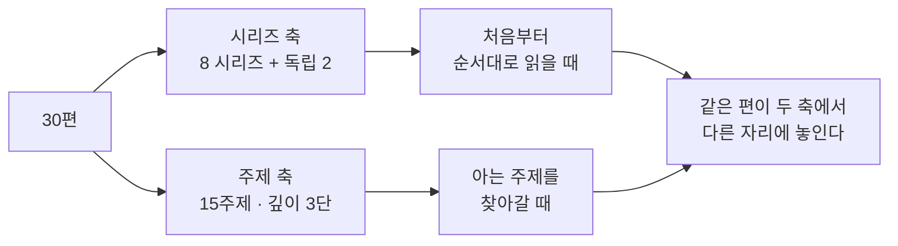
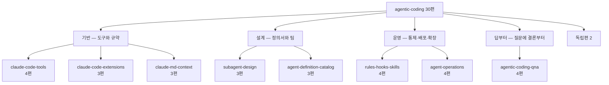

`agentic-coding` 카테고리에는 이 글을 뺀 **30편**이 있다. 한 편씩은 각자 완결돼 있다. 문제는 30편을 앞에서부터 통째로 읽으라고 하면 대부분 중간에서 멈춘다는 것이다 — 지금 필요한 것이 어디 있는지 모르는 채로 읽기 때문이다.

이 글은 그 30편의 지도다. 같은 30편을 **두 번 갠다.**

- **시리즈 축** — 발행 구조 그대로다. 8개 시리즈와 어디에도 속하지 않는 2편. 순서대로 읽을 때 쓴다.
- **주제 축** — 15개 주제 각각을 깊이 순서로 늘어놓는다. 열다섯 중 열넷만 가장 깊은 자리가 차 있다. 아는 주제를 찾아갈 때 쓴다.

두 축이 어긋난다는 것이 지도가 필요한 이유다. 시리즈의 첫 편이 어떤 주제에서는 3차로 내려가는 자리가 **다섯**이다 — `claude-md-context`의 첫 편은 주제 7(컨텍스트·토큰 예산)에서 3차다. 그리고 어느 시리즈에도 속하지 않는 독립편 하나가 주제 15(조직 도입과 측정)의 1차다.

## 30편이 어떻게 묶여 있는가

| 묶음 | 시리즈 | 편수 | 다루는 범위 |
|---|---|---:|---|
| 기반 | `claude-code-tools` | 4 | 도구가 할 수 있는 일, 그것을 막는 설정, 규약 파일의 조직화 |
| 기반 | `claude-code-extensions` | 3 | 기능을 늘릴 때 무엇을 붙이고 무엇으로 갈리는가 |
| 기반 | `claude-md-context` | 3 | 규약 파일 한 장과 매 턴 실려 나가는 대화 이력 |
| 설계 | `subagent-design` | 3 | 에이전트 한 명에서 여럿을 굴리는 데까지 |
| 설계 | `agent-definition-catalog` | 3 | 정의서 서른 개를 펼쳐 놓고 본 결과 |
| 운영 | `rules-hooks-skills` | 4 | 통제 수단 셋, 업종별 변형, 배포·디버깅 |
| 운영 | `agent-operations` | 4 | 대상 선정에서 확장 한계까지 |
| 답부터 | `agentic-coding-qna` | 4 | 반복해서 돌아오는 질문에 결론부터 |
| — | 독립편 | 2 | 어느 시리즈에도 들어가지 않는다 |
| | **계** | **30** | |

여덟 시리즈가 28편이고 독립편이 2편이다. 묶음 이름 넷(기반·설계·운영·답부터)은 이 글이 붙인 것이지 각 시리즈가 스스로 선언한 상위 분류가 아니다.

## 시리즈별 30편

### 기반 — `claude-code-tools` 4편

| # | 글 | 무엇을 정하는가 |
|---:|---|---|
| 1 | [자율성이 3세대를 가른다](/blog/agentic-coding/claude-code-autonomy-tiers/) | 도구 세대를 가르는 변수 하나와, 로그인 방식이 그대로 과금 경로가 되는 구조 |
| 2 | [도구 목록이 곧 공격 표면](/blog/agentic-coding/builtin-tools-attack-surface/) | 도구 일곱 개를 위험도로 다시 묶고, 즉시 실행을 늦추는 지시 방법 넷 |
| 3 | [deny가 항상 이긴다](/blog/agentic-coding/settings-permissions-deny/) | 권한을 JSON으로 선언할 때의 평가 순서와 설정이 쌓이는 계층 |
| 4 | [enforcement 없는 규칙은 위시리스트](/blog/agentic-coding/claude-md-enforcement/) | 개인 메모 수준의 규칙을 조직 단위로 올리는 3계층과, 부서마다 정책이 갈리는 이유 |

### 기반 — `claude-code-extensions` 3편

| # | 글 | 무엇을 정하는가 |
|---:|---|---|
| 1 | [누가 트리거하는가](/blog/agentic-coding/extension-trigger-axis/) | 넷을 가르는 축은 기능 차이가 아니라 실행을 누가 일으키느냐다 |
| 2 | [MCP 도입은 기능 추가가 아니라 예산 배분이다](/blog/agentic-coding/mcp-selection-practice/) | 외부 연결의 구성 요소와, 도구 하나가 먹는 토큰을 예산으로 보는 관점 |
| 3 | [예외 없이 걸리는 것은 훅뿐이다](/blog/agentic-coding/commands-skills-hooks-plugins/) | 셋이 각각 어떤 파일로 존재하고 무엇을 막을 수 있는지, 그리고 한 벌로 묶어 배포하는 층 |

### 기반 — `claude-md-context` 3편

| # | 글 | 무엇을 정하는가 |
|---:|---|---|
| 1 | [200줄은 상한이 아니라 임계다](/blog/agentic-coding/claude-md-scope-layers/) | 규약 파일이 쌓이는 네 계층과, 실제로 손이 가는 작성 순서 |
| 2 | [지시는 문서가 하고 차단은 설정이 한다](/blog/agentic-coding/dot-claude-directory/) | 규칙 파일 옆에 함께 서는 구성물들과, 지시 한 줄을 제대로 쓰는 패턴 |
| 3 | [70%에서 끊는 것이 더 빠르다](/blog/agentic-coding/context-budget-session/) | 매 턴 다시 실려 나가는 대화 이력을 어느 지점에서 어떻게 회수하나 |

### 설계 — `subagent-design` 3편

| # | 글 | 무엇을 정하는가 |
|---:|---|---|
| 1 | [에이전트 한 명을 정의한다](/blog/agentic-coding/subagent-definition-fields/) | 정의서 한 장을 프론트매터와 본문으로 분해하고 검증 항목까지 |
| 2 | [셋으로 묶고 셋으로 가른다](/blog/agentic-coding/collaboration-patterns-isolation/) | 협업 방식 셋에 실패 모드를 붙이고, 그것을 떠받치는 격리 축 셋을 가른다 |
| 3 | [팀을 굴리면 첫날 무엇이 멈추는가](/blog/agentic-coding/agent-team-operations/) | 구조를 다 그리고도 첫 턴에 걸리는 자리들 — 순서·소유권·종료 |

### 설계 — `agent-definition-catalog` 3편

| # | 글 | 무엇을 정하는가 |
|---:|---|---|
| 1 | [권한은 프론트매터로 좁히고 통합은 Bash 한 구멍으로](/blog/agentic-coding/thirty-agent-catalog/) | 정의서 서른 개를 한 장의 표로 펼쳐 분포를 센다 |
| 2 | [형식은 템플릿이 복제하지만 안전장치는 복제되지 않는다](/blog/agentic-coding/definition-writing-quality/) | 같은 스키마로 쓰인 서른 개에서 형식과 안전장치의 충족률이 갈린다 |
| 3 | [에이전트 개수는 자산이 아니라 부채로 시작한다](/blog/agentic-coding/dev-org-transfer/) | 서른 개 중 개발조직으로 옮길 것과, 이 세트에 아예 자리가 없는 영역들 |

### 운영 — `rules-hooks-skills` 4편

| # | 글 | 무엇을 정하는가 |
|---:|---|---|
| 1 | [차단만 하면 같은 시도가 반복된다](/blog/agentic-coding/rules-hooks-skills-layers/) | 통제 수단 셋을 나란히 놓고 강제력이 어디에만 붙는지 본다 |
| 2 | [7원칙의 자리는 그대로고 내용만 업종을 탄다](/blog/agentic-coding/industry-claude-md-templates/) | 업종이 바뀔 때 자리를 지키는 것과 내용만 바뀌는 것을 축별로 센다 |
| 3 | [자물쇠를 먼저 달고 출입증을 발급한다](/blog/agentic-coding/empty-folder-to-deploy/) | 빈 폴더에서 배포까지의 순서와, 데이터·인증 구간만 확대한 순서, 그리고 AI 기능을 붙인 뒤 막아야 하는 비용 폭주와 프롬프트 주입 |
| 4 | [재현 없이 가설 없다](/blog/agentic-coding/deploy-checklist-debugging/) | 배포 점검 항목을 섹션별로 펼치고, 디버깅을 재현·가설·검증·회귀방지 네 단계로 나눈다 |

### 운영 — `agent-operations` 4편

| # | 글 | 무엇을 정하는가 |
|---:|---|---|
| 1 | [규칙 문서부터 쓰면 막힌다](/blog/agentic-coding/automation-scope-criteria/) | 만들기 전에 정할 것 — 자동화 대상 고르기와 「끝났다」의 판정 기준 |
| 2 | [한 커맨드를 세 곳에서 부른다](/blog/agentic-coding/agent-jd-triggers/) | 정의서에서 출발해 트리거 셋이 같은 커맨드 하나를 부르는 데까지 |
| 3 | [3계층으로 좁히고 4단으로 분해한다](/blog/agentic-coding/troubleshooting-three-layers/) | 장애를 계층으로 좁힌 뒤 같은 틀에 넣어 분해하는 진단 절차 |
| 4 | [잠재 경로는 개수의 제곱으로 는다](/blog/agentic-coding/scaling-routing-collapse/) | 개수가 늘 때 먼저 무너지는 것과, 구간마다 갈아타는 운영 모델 |

### 답부터 — `agentic-coding-qna` 4편

| # | 글 | 무엇을 정하는가 |
|---:|---|---|
| 1 | [도입은 도구 선정에서 시작하지 않는다](/blog/agentic-coding/agentic-coding-qna-setup/) | 도입 순서·규약 형태·조직 규모별 계층 — 17문항 |
| 2 | [붙일 수 있다와 붙여야 한다는 다르다](/blog/agentic-coding/agentic-coding-qna-extensions/) | 무엇을 붙일 수 있고 무엇을 붙여야 하는가 — 12문항 |
| 3 | [역할을 먼저 쓰고 도구를 나중에 고른다](/blog/agentic-coding/agentic-coding-qna-agent-design/) | 역할 규정·묶는 구조·사람이 정하는 자리 — 10문항 |
| 4 | [에러 없이 실패하는 배포가 있다](/blog/agentic-coding/agentic-coding-qna-governance/) | 권한·기록·장애 대응·비용·판정 — 17문항 |

### 독립편 2편

| 글 | 무엇을 정하는가 |
|---|---|
| [되돌릴 수 있어야 권한을 넓힌다](/blog/agentic-coding/reversibility-before-permission/) | 권한의 상한을 신뢰가 아니라 되돌릴 수 있는지로 정한다 |
| [개인은 빨라졌는데 조직 지표는 안 움직인다](/blog/agentic-coding/team-adoption-roi/) | 개인 향상이 조직 지표로 넘어가지 않는 간극과, 그것을 메우는 측정 |

여기까지가 30편 전부다 — 4 + 3 + 3 + 3 + 3 + 4 + 4 + 4 + 2로 합이 30이다. 각 칸의 한 줄 설명은 그 편이 무엇을 다루는지 가리키기만 한다. 표와 수치는 전부 해당 편 안에 있다.

## 목적별 읽는 순서

시간이 없으면 전부 읽지 않는다. 목적을 하나 고르고 네다섯 편에서 멈추는 편이 낫다.

> **여덟 경로의 순서는 이 글이 짠 것이다.** 각 편이 스스로 선언한 선행 관계가 아니라, 30편을 놓고 「무엇을 먼저 알아야 다음이 읽히는가」로 배열한 결과다.

| 목적 | 순서 | 왜 이 순서인가 |
|---|---|---|
| **처음 깔고 권한을 잡는다** | [자율성 3세대](/blog/agentic-coding/claude-code-autonomy-tiers/) → [내장 도구와 지시 패턴](/blog/agentic-coding/builtin-tools-attack-surface/) → [settings.json과 deny](/blog/agentic-coding/settings-permissions-deny/) → [복구 가능성과 권한](/blog/agentic-coding/reversibility-before-permission/) | 무엇을 할 수 있는지 먼저 보고, 막을 것을 그다음에 정한다 |
| **규약 파일을 쓴다** | [CLAUDE.md 4계층 Scope](/blog/agentic-coding/claude-md-scope-layers/) → [`.claude/` 여덟 구성물](/blog/agentic-coding/dot-claude-directory/) → [컨텍스트 예산](/blog/agentic-coding/context-budget-session/) → [CLAUDE.md 3계층과 enforcement](/blog/agentic-coding/claude-md-enforcement/) → [업종별 템플릿 3종](/blog/agentic-coding/industry-claude-md-templates/) | 한 장 쓰기 → 옆에 서는 것들 → 분량이 왜 문제인가 → 조직으로 올리기 → 업종별 변형 |
| **확장을 붙인다** | [트리거 주체 축](/blog/agentic-coding/extension-trigger-axis/) → [MCP 도입과 예산](/blog/agentic-coding/mcp-selection-practice/) → [커맨드·스킬·훅과 플러그인](/blog/agentic-coding/commands-skills-hooks-plugins/) → [Rules·Hooks·Skills 3계층](/blog/agentic-coding/rules-hooks-skills-layers/) → [확장 메커니즘 Q&A](/blog/agentic-coding/agentic-coding-qna-extensions/) | 무엇으로 갈리는지 잡고 개별 구현으로 내려간 뒤, 붙일지 말지로 되돌아온다 |
| **정의서를 여러 개 쓴다** | [정의서 필드 10개](/blog/agentic-coding/subagent-definition-fields/) → [30개 에이전트 카탈로그](/blog/agentic-coding/thirty-agent-catalog/) → [정의서 공통 스키마](/blog/agentic-coding/definition-writing-quality/) → [JD 5필드와 트리거 셋](/blog/agentic-coding/agent-jd-triggers/) | 한 장 → 서른 장을 펼친 결과 → 그중 무엇이 균질하지 않은가 → 실제로 부르는 법 |
| **여럿을 함께 굴린다** | [협업 패턴과 격리 3계층](/blog/agentic-coding/collaboration-patterns-isolation/) → [팀 운용 규칙](/blog/agentic-coding/agent-team-operations/) → [라우팅 붕괴와 구간별 운영](/blog/agentic-coding/scaling-routing-collapse/) → [에이전트 설계 Q&A](/blog/agentic-coding/agentic-coding-qna-agent-design/) | 묶는 구조 → 첫날 멈추는 자리 → 개수가 늘었을 때 |
| **거버넌스와 보안을 본다** | [Rules·Hooks·Skills 3계층](/blog/agentic-coding/rules-hooks-skills-layers/) → [settings.json과 deny](/blog/agentic-coding/settings-permissions-deny/) → [내장 도구와 지시 패턴](/blog/agentic-coding/builtin-tools-attack-surface/) → [운영과 거버넌스 Q&A](/blog/agentic-coding/agentic-coding-qna-governance/) | 강제력이 어디 붙는지부터 잡는다. 규범만으로는 아무것도 막히지 않는다 |
| **배포하고 장애를 잡는다** | [합격선 5축과 60줄](/blog/agentic-coding/automation-scope-criteria/) → [빈 폴더에서 배포까지](/blog/agentic-coding/empty-folder-to-deploy/) → [배포 체크리스트와 디버깅](/blog/agentic-coding/deploy-checklist-debugging/) → [3계층 진단](/blog/agentic-coding/troubleshooting-three-layers/) | 「끝났다」를 먼저 못박고 → 만들고 → 내보내고 → 터진 것을 좁힌다 |
| **조직에 들인다** | [도입 로드맵과 ROI](/blog/agentic-coding/team-adoption-roi/) → [개발조직에 옮길 것](/blog/agentic-coding/dev-org-transfer/) → [CLAUDE.md 3계층과 enforcement](/blog/agentic-coding/claude-md-enforcement/) → [도입과 표준화 Q&A](/blog/agentic-coding/agentic-coding-qna-setup/) | 무엇을 증명할지 먼저 정하고 대상과 규칙으로 내려간다 |

여덟 경로의 자리를 다 세면 **34개**다. 그중 네 편이 두 경로에 겹쳐 나오므로 중복을 걷어내면 **30편 전부**가 된다. 두 번 나오는 넷은 내장 도구 편·`settings.json` 편·3계층 통제 편·enforcement 편이고, 앞의 셋은 「거버넌스와 보안을 본다」 경로에서 한 번 더 불린다.

## 주제에서 글로 — 15주제 교차 참조

같은 주제가 여러 편에 흩어져 있다. 주제를 알고 들어오는 경우에는 이쪽이 빠르다.

> **주제 열다섯 중 열하나와 1차·2차·3차라는 깊이 3단은 원 자료의 교차 참조표에서 받았다. 나머지 주제 넷을 세우고 서른 편을 각 자리에 배정한 것이 이 글의 판정이다.** 각 편이 그 주제를 **글의 주어로 삼는가**(1차) · **한 절로 다루는가**(2차) · **곁가지로 언급하는가**(3차)로 갈랐다. 분량은 보조 근거로만 썼다. 다른 기준으로 재면 순서가 달라질 수 있다.
>
> 「함께 볼 것」 열은 깊이 순서 **밖**이다. 같은 주제를 다른 각도에서 건드리는 편을 적었다.

| # | 주제 | 1차 (가장 깊다) | 2차 | 3차 | 함께 볼 것 |
|---:|---|---|---|---|---|
| 1 | 도구와 자율성 | [자율성 3세대](/blog/agentic-coding/claude-code-autonomy-tiers/) | [내장 도구와 지시 패턴](/blog/agentic-coding/builtin-tools-attack-surface/) | [복구 가능성과 권한](/blog/agentic-coding/reversibility-before-permission/) | — |
| 2 | 규약 파일 작성 | [CLAUDE.md 4계층 Scope](/blog/agentic-coding/claude-md-scope-layers/) | [CLAUDE.md 3계층과 enforcement](/blog/agentic-coding/claude-md-enforcement/) | [업종별 템플릿 3종](/blog/agentic-coding/industry-claude-md-templates/) | [합격선 5축과 60줄](/blog/agentic-coding/automation-scope-criteria/) |
| 3 | 권한·차단 설계 | [settings.json과 deny](/blog/agentic-coding/settings-permissions-deny/) | [Rules·Hooks·Skills 3계층](/blog/agentic-coding/rules-hooks-skills-layers/) | [내장 도구와 지시 패턴](/blog/agentic-coding/builtin-tools-attack-surface/) | [운영과 거버넌스 Q&A](/blog/agentic-coding/agentic-coding-qna-governance/) |
| 4 | 확장 메커니즘 | [트리거 주체 축](/blog/agentic-coding/extension-trigger-axis/) | [커맨드·스킬·훅과 플러그인](/blog/agentic-coding/commands-skills-hooks-plugins/) | [MCP 도입과 예산](/blog/agentic-coding/mcp-selection-practice/) | [확장 메커니즘 Q&A](/blog/agentic-coding/agentic-coding-qna-extensions/) |
| 5 | 훅 | [Rules·Hooks·Skills 3계층](/blog/agentic-coding/rules-hooks-skills-layers/) | [커맨드·스킬·훅과 플러그인](/blog/agentic-coding/commands-skills-hooks-plugins/) | [settings.json과 deny](/blog/agentic-coding/settings-permissions-deny/) | — |
| 6 | 프롬프트 패턴 | [`.claude/` 여덟 구성물](/blog/agentic-coding/dot-claude-directory/) | [업종별 템플릿 3종](/blog/agentic-coding/industry-claude-md-templates/) | [배포 체크리스트와 디버깅](/blog/agentic-coding/deploy-checklist-debugging/) | [내장 도구와 지시 패턴](/blog/agentic-coding/builtin-tools-attack-surface/) |
| 7 | 컨텍스트·토큰 예산 | [컨텍스트 예산](/blog/agentic-coding/context-budget-session/) | [MCP 도입과 예산](/blog/agentic-coding/mcp-selection-practice/) | [CLAUDE.md 4계층 Scope](/blog/agentic-coding/claude-md-scope-layers/) | — |
| 8 | 멀티에이전트 구조 | [협업 패턴과 격리 3계층](/blog/agentic-coding/collaboration-patterns-isolation/) | [팀 운용 규칙](/blog/agentic-coding/agent-team-operations/) | [라우팅 붕괴와 구간별 운영](/blog/agentic-coding/scaling-routing-collapse/) | [JD 5필드와 트리거 셋](/blog/agentic-coding/agent-jd-triggers/) |
| 9 | 에이전트 정의서 | [정의서 필드 10개](/blog/agentic-coding/subagent-definition-fields/) | [정의서 공통 스키마](/blog/agentic-coding/definition-writing-quality/) | [30개 에이전트 카탈로그](/blog/agentic-coding/thirty-agent-catalog/) | [JD 5필드와 트리거 셋](/blog/agentic-coding/agent-jd-triggers/) |
| 10 | 사람 개입과 승인 게이트 | **없음** | [30개 에이전트 카탈로그](/blog/agentic-coding/thirty-agent-catalog/) | [에이전트 설계 Q&A](/blog/agentic-coding/agentic-coding-qna-agent-design/) | [정의서 공통 스키마](/blog/agentic-coding/definition-writing-quality/) · [운영과 거버넌스 Q&A](/blog/agentic-coding/agentic-coding-qna-governance/) |
| 11 | 트러블슈팅·디버깅 | [3계층 진단](/blog/agentic-coding/troubleshooting-three-layers/) | [배포 체크리스트와 디버깅](/blog/agentic-coding/deploy-checklist-debugging/) | [복구 가능성과 권한](/blog/agentic-coding/reversibility-before-permission/) | — |
| 12 | 비용 통제 | [라우팅 붕괴와 구간별 운영](/blog/agentic-coding/scaling-routing-collapse/) | [MCP 도입과 예산](/blog/agentic-coding/mcp-selection-practice/) | [자율성 3세대](/blog/agentic-coding/claude-code-autonomy-tiers/) | [운영과 거버넌스 Q&A](/blog/agentic-coding/agentic-coding-qna-governance/) |
| 13 | 확장·스케일링 | [라우팅 붕괴와 구간별 운영](/blog/agentic-coding/scaling-routing-collapse/) | [개발조직에 옮길 것](/blog/agentic-coding/dev-org-transfer/) | [팀 운용 규칙](/blog/agentic-coding/agent-team-operations/) | — |
| 14 | 실전 구축·배포 | [빈 폴더에서 배포까지](/blog/agentic-coding/empty-folder-to-deploy/) | [배포 체크리스트와 디버깅](/blog/agentic-coding/deploy-checklist-debugging/) | [합격선 5축과 60줄](/blog/agentic-coding/automation-scope-criteria/) | — |
| 15 | 조직 도입과 측정 | [도입 로드맵과 ROI](/blog/agentic-coding/team-adoption-roi/) | [개발조직에 옮길 것](/blog/agentic-coding/dev-org-transfer/) | [도입과 표준화 Q&A](/blog/agentic-coding/agentic-coding-qna-setup/) | [CLAUDE.md 3계층과 enforcement](/blog/agentic-coding/claude-md-enforcement/) |

### 이 표를 세어 보면

| 세어 본 것 | 값 |
|---|---:|
| 주제 | 15 |
| 1차 자리 | 14 |
| 2차 자리 | 15 |
| 3차 자리 | 15 |
| 「함께 볼 것」 자리 | 10 |
| **배정한 자리 계** | **54** |
| 깊이 순서(1·2·3차)만 세었을 때 편 수 | 27 |
| 중복을 걷어낸 편 수 | **30** |

쉰네 자리에 서른 편이 들어간다. **어느 편도 이 표에서 빠지지 않는다** — 단 깊이 순서만 세면 스물일곱 편이고, 나머지 세 편은 깊이 순서 밖인 「함께 볼 것」 열에만 있다.

1차 자리가 열넷인 것은 주제 10에 1차가 없기 때문이다. 그리고 그 열넷을 채우는 편은 **열셋**이다 — 라우팅 붕괴 편이 비용 통제와 확장·스케일링 두 주제의 1차를 겸한다. 나머지 **열일곱 편은 1차를 한 번도 받지 못했다.** 그중 열넷은 2차나 3차로 들어가고, 어떤 편은 여러 주제에서 여러 번 불린다. 남는 세 편 — [확장 메커니즘 Q&A](/blog/agentic-coding/agentic-coding-qna-extensions/) · [운영과 거버넌스 Q&A](/blog/agentic-coding/agentic-coding-qna-governance/) · [JD 5필드와 트리거 셋](/blog/agentic-coding/agent-jd-triggers/) — 은 1차도 2차도 3차도 아니고 「함께 볼 것」으로만 불린다.

### 주제 10에 1차가 없는 것에 대해

**사람이 승인하는 지점을 글의 주어로 삼는 편이 이 카테고리에 없다.** 열다섯 주제 중 1차가 비어 있는 유일한 자리다.

2차·3차로 세운 두 편과 「함께 볼 것」에 적은 두 편이 그 자리를 나눠 메운다. [30개 에이전트 카탈로그](/blog/agentic-coding/thirty-agent-catalog/) 편은 사람 검수 필요도로 서른 종을 세어 본 절을 따로 두고, [에이전트 설계 Q&A](/blog/agentic-coding/agentic-coding-qna-agent-design/) 편은 사람 손이 마지막으로 닿는 자리를 어디에 둘 것인가를 문항 제목 둘로 받는다. [정의서 공통 스키마](/blog/agentic-coding/definition-writing-quality/) 편은 서른 개의 정의서 중 승인 게이트를 갖춘 것이 몇 개인지를 다른 항목들과 나란히 세고, [운영과 거버넌스 Q&A](/blog/agentic-coding/agentic-coding-qna-governance/) 편은 그 게이트를 사전·사후 두 시점으로 가른다.

**이 글의 판단은 그 빈칸을 채우지 않고 그대로 두는 것이다.** 2차를 1차로 올려 적으면 없는 깊이를 있다고 말하는 것이 되고, 그 편을 찾아간 독자가 기대한 것을 찾지 못한다. 빈칸이 보이는 편이 낫다.

## 결론부터 보려면 — Q&A 4편

네 편은 나머지 26편을 다시 자르지 않는다. **같은 내용을 질문 형태로 먼저 만나게 한다.** 어떤 시리즈로 들어갈지 정하지 못했을 때 진입점으로 쓴다. 어느 편이 무엇을 받는지는 위 시리즈 표의 「답부터」 묶음에 이미 적었으므로 여기서 다시 펼치지 않는다.

문항 수는 각 편 제목에 그대로 적혀 있는 값이고(17·12·10·17), 넷을 더하면 쉰여섯이다. 네 편 모두 본문에서 이 카테고리의 다른 편으로 링크를 걸어 두었으므로, 답이 짧게 느껴지는 문항은 그 링크를 따라 내려가면 된다.

## 닫으며

지도는 두 번 쓰인다. 들어올 때 어디부터 볼지 정하는 데 한 번, 이미 읽은 뒤에 「그게 어디 있었더라」를 찾는 데 한 번.

앞쪽 용도라면 **목적별 경로에서 하나를 골라 네다섯 편을 읽고 멈추는 것**이 30편을 순서대로 훑는 것보다 낫다. 뒤쪽 용도라면 **주제 교차 참조 표에서 주제를 찾아 1차부터 내려가면** 된다. 두 축이 어긋나는 자리 — 시리즈 첫 편이 어떤 주제에서는 3차인 자리 — 가 있어서 한쪽만으로는 찾아지지 않는 편이 생긴다.

남겨 둘 것 하나는 열 번째 주제다. **사람이 승인하는 지점은 1차가 비어 있는 유일한 주제**이고, 그것을 지도에 빈칸으로 적어 두는 편이 아무 편이나 끌어다 채우는 것보다 정확하다고 봤다.
