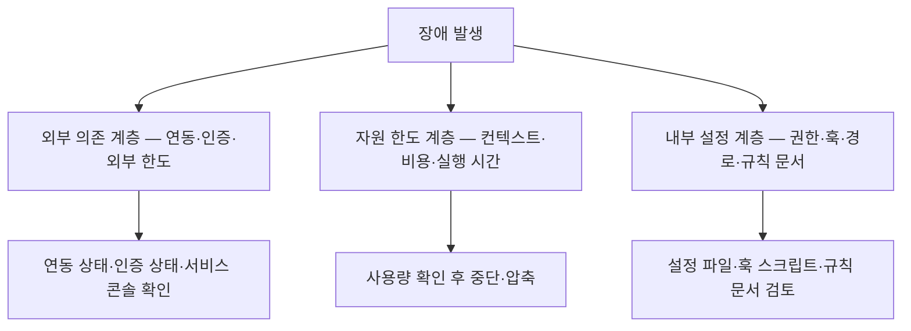
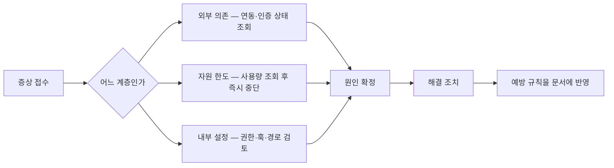

[앞 편](/blog/agentic-coding/agent-jd-triggers/)에서 하루가 사람 손 없이 도는 데까지 만들었다. 잘 만들어도 장애는 난다. 그리고 자동화의 장애는 수동 작업의 장애와 성격이 다르다 — **아무도 보고 있지 않을 때 나고, 조용히 나며, 나는 동안에도 계속 돈다.**

이 글은 그때 무엇을 어떤 순서로 보는가를 다룬다. 핵심은 두 가지 틀이다. 하나는 **어디가 깨졌는지를 세 계층으로 좁히는 것**이고, 다른 하나는 **하나의 장애를 네 칸으로 분해해 마지막 칸을 비워 두지 않는 것**이다.

[앞 편](/blog/agentic-coding/agent-jd-triggers/)이 하루 사이클 표 안에 자리만 잡아 둔 「주간 15분 · 월간 30분」 점검이 무엇을 보는 시간인지도 이 글에서 목록으로 펼친다.

> 이 글이 옮긴 원 자료의 작성 기준일은 **2026-07-26**이다. 도구 동작·임계값·에러 코드 성격은 그 시점의 것이며 버전에 따라 바뀐다.
>
> 아래 「현장 장애 사례 5건」의 수치는 **원 자료가 장애 기록에서 옮긴 것**이며 이 글이 관측한 값이 아니다.

## 용어 정리

[첫 편](/blog/agentic-coding/automation-scope-criteria/)의 용어표에서 이 글이 쓰는 행만 추렸다.

| 용어 | 풀이 |
|---|---|
| **Hook** | 특정 이벤트 시점에 자동 실행되는 스크립트. SessionStart, PostToolUse, Stop 등 |
| **Cron / crontab** | 시간 기반 정기 실행 스케줄러. macOS에서는 launchd(plist)를 권장 |
| **롤백(Rollback)** | 잘못 반영된 변경을 되돌리는 것. `git revert`, `git reset --soft`, `git reflog` |
| **컨텍스트 윈도우** | 모델이 한 번에 볼 수 있는 토큰 한도. 초과 이전에 이미 응답 품질이 떨어진다 |
| **RLS (Row Level Security)** | DB에서 행 단위 접근 제어. 활성화만으로는 안전하지 않고 조건식이 핵심 |
| **Circuit Breaker** | 동일 에러가 정해진 횟수 반복되면 자동 중단하는 방어 패턴 |
| **관측성(Observability)** | 시스템 내부 상태를 외부에서 파악할 수 있는 정도. 여기서는 감사 로그·trace ID·비용 대시보드 |

## 진단 프레임 — 4단 분해 + 3계층 분류

모든 장애를 **증상 → 원인 → 해결 → 예방** 4단으로 분해한다. 처음 보는 문제도 이 틀에 넣으면 체계적으로 다룰 수 있다.

동시에 어느 레이어가 깨졌는지 3계층으로 좁힌다. 복구 속도는 이 좁히기에서 결정된다.

| 계층 | 원인 위치 | 특징 | 1차 진단 |
|---|---|---|---|
| 외부 의존 | 시스템 밖 | 토큰 만료·서비스 한도·네트워크 | 연동 목록 조회, 인증 상태 확인 |
| 자원 한도 | 사용량 | 컨텍스트 초과·비용 폭주 | 사용량 조회, 즉시 중단 |
| 내부 설정 | 우리가 쓴 설정 | 권한 오설정·훅 버그·경로 오류 | 설정·훅·규칙 문서 검토 |

세 계층은 **원인이 있는 자리가 우리 통제 밖인지, 우리가 쓴 양인지, 우리가 쓴 글자인지**로 갈린다. 갈린 자리가 다르면 손에 잡히는 조치의 **성격**도 달라진다 — 아래 「진단 순서」 표의 「즉시 조치」 열이 그 차이를 그대로 보여준다. 외부 의존은 **상태를 되살리거나 흘려보내는 쪽**(재인증, 영구 실패 코드면 즉시 중단·큐 저장)이고, 자원 한도는 **먼저 멈추는 쪽**(실행 중단 → 대화 압축 또는 세션 초기화, 즉시 중단 후 훅 코드 점검)이며, 내부 설정은 **쓴 것을 고치는 쪽**(화이트리스트 재구성, 절대 경로 치환, 커밋 되돌리기)이다. 세 계층에 각각 조치가 있고 그 성격이 다르다는 것이지 어느 하나만 손댈 수 있다는 뜻은 아니다 — **이렇게 갈라 읽는 것은 이 글의 정리다.**

그리고 원 자료는 **내부 설정 계층 장애가 대부분 테스트 없이 운영에 반영한 결과**라는 지적이 특히 실무적이라고 적었다. 위 표가 이 계층의 원인 위치를 「우리가 쓴 설정」으로 적어 둔 것과 이어 읽으면, 반영 전에 한 번 돌려 보는 절차가 이 계층에서 특히 값을 한다는 말이 된다.

## 공통 문제 10선

| 증상 | 원인 | 해결 | 예방 |
|---|---|---|---|
| 도구를 찾을 수 없음 / 연동 서버 접속 실패 | 인증 토큰 만료(보통 30~60일), 경로 오류, 타임아웃 | 연동 목록 조회 → 재인증 → 잔여 프로세스 정리 | 설정에 timeout 명시, 세션 시작 훅에서 실패 자동 감지 |
| 컨텍스트 한도 초과, 응답 품질 저하 | 대용량 파일 읽기(파일당 10~20K), 명령 출력 누적, 비대한 규칙 문서 | 사용량 확인 → 대화 압축 → 필요 시 세션 초기화 | 빌드 산출물·의존성 폴더를 읽기 거부 목록에 등록, 규칙 문서 200줄 이하 유지 |
| 무한 루프 — 같은 파일 반복 읽기, 분당 수천 토큰 | 종료 훅의 재진입 플래그 확인 누락, 반복 상한 미설정 | 즉시 중단 → 사용량 확인 → 훅 코드 수정 | 종료 훅 첫 줄에 재진입 플래그 체크, "동일 에러 3회면 보고 후 중단" 규칙 명시 |
| 권한 거부 — 도구 호출이 정책에 막힘 | 권한 4계층(관리자 > 실행 인자 > 프로젝트 > 사용자) 충돌. 상위 거부가 하위 허용을 무시 | 현재 권한 상태 확인 → 설정에 허용/거부 명시 | 기본 거부 + 필요한 것만 허용하는 화이트리스트 방식 |
| 인증 충돌 — 401, 구독이 있는데 API 요금 청구 | 환경변수에 API 키가 있으면 구독보다 우선 사용됨 | 상태 확인 → 환경변수 해제 → 보안 저장소로 재저장 | 예제 파일은 빈 값, 실제 키 파일은 형상관리 제외, 세션 시작 훅에서 유효성 점검 |
| 파일 경로 오류 — 파일이 있는데 없다고 나옴 | 물결(~) 확장은 대화형 셸 전용. 스케줄러·서브프로세스·설정 파서는 리터럴로 처리 | 절대 경로로 교체하거나 홈 경로 확장 함수 사용 | 규칙 문서에 "절대 경로 우선, ~ 금지" 명시, 스케줄 등록 전 검증 스크립트 |
| 버전관리 충돌·잘못된 자동 커밋 | 버전관리 명령 전체 허용으로 add-commit-push 체인이 즉시 실행, 주 브랜치 보호 미비 | 커밋 취소(스테이징 유지)로 되돌리고, 강제 푸시는 참조 로그로 복구 | push·force push·rebase를 개별 거부 등록 + 원격 브랜치 보호 규칙 |
| 비용 폭주 — 청구액이 예상의 수 배 | 무한 루프가 1순위, 대형 모델 × 대용량 컨텍스트 반복 호출, 인증 혼용 | 사용량 확인 → 즉시 중단 → 에이전트별 모델 재배치 | 콘솔에서 하드 리밋 + 경고 임계값 2단 설정 |
| 검토 없는 자동 커밋·배포 | "배포 준비해줘" 같은 모호한 지시를 push까지 자의적으로 해석 | 커밋 취소 또는 수정 후, 커밋 명령 자체를 거부 등록 | "커밋 전 변경분 출력 후 사용자 확인" 규칙 + 종료 조건 명시 |
| 응답 품질 저하 — 없는 함수명 창작, 버전 환각 | 대화 누적으로 인한 컨텍스트 오염, 규칙 문서 과부하·모순, 예시 부재 | 새 세션에서 재시도 → 규칙 문서 줄 수 점검 → 예시 보강 | 규칙 문서에 예시 3~5개 + 주간 고정 테스트 케이스로 품질 추적 |

열 행을 앞 절의 3계층에 전수 배정하면 분포가 한쪽으로 쏠린다. **외부 의존이 둘**(연동 접속 실패, 인증 충돌), **자원 한도가 셋**(컨텍스트 초과, 무한 루프, 비용 폭주), **내부 설정이 다섯**(권한 거부, 경로 오류, 자동 커밋, 검토 없는 배포, 품질 저하)이다 — **이 배정은 이 글의 정리다.** 마지막 행(품질 저하)은 원인이 컨텍스트 오염(자원 한도)과 규칙 문서 과부하(내부 설정) 양쪽에 걸쳐 있어, 아래 「진단 순서」 표가 「규칙 문서 줄 수와 모순 여부」를 내부 설정 행에 둔 것을 따랐다.

쏠린 방향이 말하는 것은 하나다. **열 행 중 다섯이 우리가 쓴 설정에서 나온다** — 원인이 우리 통제 밖도 우리가 쓴 양도 아니라 우리가 쓴 글자에 있는 항목이 가장 많다.

「해결」 열도 한 방향으로 모인다. 열 행 중 넷(무한 루프, 버전관리 충돌, 비용 폭주, 검토 없는 자동 커밋)이 **즉시 중단** 또는 **되돌리기**를 포함한다. 원인을 찾기 전에 출혈을 먼저 막는 순서다.

> **위 표의 수치는 전부 원 자료가 제시한 기준선·관측 범위**이며 이 글이 측정한 값이 아니다 — 토큰 만료 `30~60일`, 파일당 `10~20K` 토큰, `동일 에러 3회`, 규칙 문서 `200줄`, 예시 `3~5개`. 권한 4계층의 이름과 우선순위 역시 원 자료 작성 기준일(**2026-07-26**) 시점의 도구 사양이다.

품질 저하 판정에 대한 지적이 실무적으로 유용하다. **"모델이 나빠진 것 같다"는 느낌의 대부분은 컨텍스트 오염**이며, 새 세션 테스트로 진짜 회귀와 구분할 수 있다.

### 수치 기준이 명확한 세 항목

| 항목 | 기준 | 근거 |
|---|---|---|
| 컨텍스트 선제 압축 | 한도의 50~60% 시점에 미리 압축 | 70%를 넘으면 에러 이전에 이미 응답 품질이 떨어진다 |
| 대용량 읽기 차단 | 의존성·빌드 산출물 폴더를 읽기 거부 목록에 등록 | 파일 하나가 10~20K 토큰을 차지한다 |
| 규칙 문서 크기 | 200줄 이하 유지, 초과 시 정리 | 문서 자체가 컨텍스트를 잠식한다 |

세 행이 전부 **한도에 닿기 전에 손을 쓰는 기준**이라는 점이 공통점이다. 첫 행이 특히 그렇다 — 압축 시점을 50~60%로 잡는 이유가 한도 초과를 막기 위해서가 아니라 **70%에서 이미 품질이 떨어지기 때문**이다. 에러가 나는 선과 품질이 떨어지는 선이 다르고, 관리해야 할 것은 뒤쪽이다.

> **위 표의 수치(`50~60%` 압축 시점, `70%` 품질 저하선, 파일당 `10~20K` 토큰, 규칙 문서 `200줄`)는 원 자료가 제시한 기준선**이며 이 글이 측정한 값이 아니다. 실제 임계는 모델의 컨텍스트 한도와 작업 성격에 따라 달라진다. 원 자료 작성 기준일은 **2026-07-26**이다.

마지막 행의 **200줄은 규칙 문서(CLAUDE.md)의 크기 한도**다. 같은 원 자료가 설계 절에서는 같은 파일에 **60줄**이라는 다른 값을 쓰는데, 그쪽은 10항목 체크리스트에서 역산한 설계 산식이고 이쪽은 컨텍스트 잠식을 막는 장애 예방 한도다 — 두 값이 어떻게 갈리는지는 [첫 편](/blog/agentic-coding/automation-scope-criteria/)이 서로 다른 값이 붙는 여섯 자리를 모아 정리했다.

### 권한 설계는 문제 유형에 따라 갈린다

권한 설계에서 **문제 유형에 따라 전략이 달라진다**는 점도 짚어둘 만하다. 잘못된 자동 커밋 문제는 "커밋은 허용, 푸시는 거부"로 막지만, 검토 없는 커밋 자체가 문제라면 "커밋 명령 자체를 거부"해야 한다. 커밋 훅은 우회 옵션으로 무력화될 수 있으므로, **근본 통제는 권한 계층에서 한다.**

같은 증상(원치 않은 커밋)에 두 개의 다른 처방이 붙는 이유는 막으려는 것이 다르기 때문이다. 앞은 *영향 범위*를 막고(원격에 나가지 않게), 뒤는 *행위 자체*를 막는다(사람이 보기 전에는 기록되지 않게).

## 현장 장애 사례 5건

앞의 10선이 일반론이라면, 아래는 실제 장애 기록에서 뽑은 것이다.

| 증상 | 원인 | 해결 | 예방 |
|---|---|---|---|
| 메일 발송 파이프라인이 100통 후 중단, 영구 실패 코드 수신 | 유료 계정의 실제 한도 조건(개설 기간·누적 결제) 미확인. 오전에 이미 450통을 써서 여유가 50통뿐이었음 | 영구 실패 코드는 재시도 금지. 큐에 저장 후 24시간 뒤 재발송 | 발송 전 한도의 80% 안전 마진 체크 함수 + 규칙 문서에 "영구 실패 코드 수신 시 즉시 중단" 명시 |
| 행 단위 보안을 켰는데 모든 인증 사용자가 전체 행 접근 가능, 30분간 노출 | 조건식을 `USING (true)`로 작성. 자물쇠는 달았지만 열쇠구멍이 없는 상태 | 본인 행만 접근하도록 조건식을 사용자 ID 비교로 교체 | 규칙 문서에 해당 패턴 절대 금지 명시 + 마이그레이션 후 보안 점검 도구 실행 의무화 |
| 정기 실행 스크립트가 7일간 조용히 실패 | 스케줄러는 최소 환경에서 돌아 사용자 셸 설정을 읽지 않고, 물결 경로가 확장되지 않음 | 등록된 전체 스케줄의 물결 경로를 절대 경로로 일괄 치환 | 신규 스케줄 등록 후 24시간 내 실행 로그 확인을 필수 절차로 |
| 종료 훅 무한 루프로 5분 만에 컨텍스트 80% 소진, 비용 급증 | 재진입 플래그 미확인 + 파일 쓰기를 유발하는 작업이 추가 훅을 연쇄 트리거 | 즉시 중단 → 세션 초기화 → 훅에 플래그 체크와 타임아웃 추가 | 훅 3체크(재진입 플래그·타임아웃·정상 종료 코드) + 배포 전 수동 테스트 |
| "배포 준비해줘" 한마디에 미완성 결제 코드가 주 브랜치에 반영, 다음 날 자동 배포로 결제 오류 30건 | 디버그 출력 12줄, 미구현 항목 3개, 하드코딩된 테스트 값이 그대로 포함됨 | 즉시 되돌리기 + 영향받은 결제 수동 처리 | push 계열 거부 등록 + 규칙 문서에 "배포 준비 = 기능 브랜치 커밋까지(푸시 아님)" 정의 |

다섯 건 전부 「예방」 열에 **규칙 문서 명시 또는 필수 절차 지정**이 들어 있다. 코드나 설정을 고치는 조치가 함께 붙은 것은 셋이다 — 안전 마진 체크 함수, 훅 3체크, push 계열 거부 등록. 나머지 둘은 문서와 절차만으로 끝난다. 즉 **다음 사람이 같은 판단을 못 하게 만드는** 쪽이 기본이고 코드는 보조다.

장애가 이어진 시간도 표에 남아 있는데, 세 수치가 각각 다른 것을 잰다. 물결 경로 건의 **7일**은 스크립트가 **조용히 실패한 기간**이고, 행 단위 보안 건의 **30분**은 전체 행이 **노출된 채로 지속된 시간**이며, 종료 훅 무한 루프 건의 **5분**은 컨텍스트 **80%를 태우는 데 걸린 시간**이다. 발견 시점이 아니라 **문제가 굴러간 시간**이라는 점이 셋의 공통점이다 — 이렇게 갈라 읽는 것은 이 글의 정리다. [앞 편](/blog/agentic-coding/agent-jd-triggers/)이 운영 전환 목록에 알림과 로그를 넣은 이유가 여기 있다.

> **위 다섯 건의 수치는 원 자료가 장애 기록에서 옮긴 것**이며 이 글이 관측한 값이 아니다 — `100통`·`450통`·`50통`, `30분간 노출`, `7일간`, `5분 만에 80%`, `결제 오류 30건`, `디버그 출력 12줄`·`미구현 3개`, 안전 마진 `80%`, 재발송 `24시간`. 원 자료 작성 기준일은 **2026-07-26**이다.

이 다섯 건에서 뽑아낼 수 있는 문장은 하나다. **에이전트가 말하는 "완료"는 기술적 실행 가능을 뜻하지, 코드 품질이나 비즈니스 안전성을 뜻하지 않는다.** 모호한 지시는 모호한 결과를 낳는다.

## 점검 루틴 — 지식을 습관으로

| 주기 | 소요 | 점검 항목 |
|---|---|---|
| 일일(세션 시작 전) | 5분 | 인증 상태 확인, 연동 서버 실패 여부, 전일 사용량 급증 여부, 의도치 않은 스테이징·커밋, 스케줄 경로 점검 |
| 주간(월요일) | 15분 | 사용량 리포트 추세, 권한 화이트리스트 재검토, DB 보안 정책 점검, 전체 훅의 플래그 체크 포함 여부, 외부 API 한도 여유 |
| 월간(1일) | 30분 | 예산 한도 재설정, 만료 예정 토큰 선제 갱신, 규칙 문서 줄 수 감사, 자동 커밋 패턴 누적 점검, 전체 스케줄 재검토 |

세 주기의 항목이 **점검 대상의 변화 속도**에 맞춰 배치돼 있다 — 이렇게 읽는 것은 이 글의 정리다. 일일은 어제 하루 사이에 바뀔 수 있는 것(인증·사용량·커밋)을 보고, 주간은 며칠에 걸쳐 추세로 드러나는 것(사용량 추세·한도 여유)을 보며, 월간은 한 달은 지나야 부채가 쌓이는 것(예산·토큰 만료·문서 분량)을 본다. 점검 항목은 세 주기가 각각 다섯 개씩, 합쳐 열다섯 개이고 시간은 하루 5분·주 15분·월 30분이다.

세 행 중 **주간·월간 두 행**이 [앞 편](/blog/agentic-coding/agent-jd-triggers/)의 하루 사이클 표에서 「운영 점검 15분」·「월간 점검 30분」으로 자리만 잡혀 있던 두 행의 내용이다. **일일 행은 그 표에 대응 행이 없다** — 앞 편의 표가 점검으로 잡아 둔 자리는 주간·월간 둘뿐이고, 세션을 열기 전에 무엇을 훑을지는 이 표에서 처음 나온다.

### DO / DON'T

원 자료가 강조하는 DO / DON'T를 한 표로 압축하면 다음과 같다.

| DO | DON'T |
|---|---|
| 종료 훅 맨 앞에 재진입 플래그 체크를 넣는다 | 버전관리 명령을 와일드카드로 통째 허용한다 |
| push 계열은 기본적으로 거부 목록에 넣는다 | 권한 확인 건너뛰기 옵션을 기본값으로 쓴다 |
| 자동화 스크립트의 모든 경로는 절대 경로로 쓴다 | 재진입 체크 없이 종료 훅에서 차단 코드를 반환한다 |
| 새 외부 서비스는 실제 적용 한도를 검증한다 | 스케줄·서브프로세스·설정 파일에서 물결 경로를 쓴다 |
| 모호한 지시의 종료 조건을 문서로 정의한다 | 보안 정책 조건식을 항상 참으로 둔다 |

왼쪽 열은 **사고가 나기 전에 하는 것**이고 오른쪽 열은 **사고를 만든 실제 행동**이다. 오른쪽 다섯 항목 중 셋이 바로 앞의 현장 5건에 직접 등장한다 — 재진입 체크 없이 종료 훅에서 차단 코드 반환(4번 사례), 물결 경로 사용(3번 사례), 보안 정책 조건식을 항상 참으로 둠(2번 사례)이다. 나머지 둘의 자리는 서로 다르다. **와일드카드 허용**은 앞의 공통 문제 10선에 대응 행이 있고(「버전관리 명령 전체 허용으로 add-commit-push 체인이 즉시 실행」), **권한 확인 건너뛰기**는 10선이 아니라 아래 「진단 순서」 표의 내부 설정 행 — 2순위 확인 「실행 인자에 위험 옵션이 남았는지」 — 에 걸린다. 이렇게 대응을 찾아 붙이는 것은 이 글의 정리다.

원 자료는 이번 주 안에 실천할 것 세 가지로 압축한다. **종료 훅 플래그 체크**, **push 거부 등록**, **물결 경로 제거**다. 셋 다 한 줄짜리 조치이면서, 각각 장애 5건 중 하나씩을 막는다.

## 진단 순서 — 계층별로 무엇을 먼저 보는가

장애 시 손이 가야 할 순서를 계층별로 정리한다. 도구 이름이 아니라 **확인 대상**으로 적어두면 다른 스택에도 그대로 옮겨 쓸 수 있다.

| 계층 | 1순위 확인 | 2순위 확인 | 즉시 조치 |
|---|---|---|---|
| 외부 의존 | 연동 서버 목록과 상태 | 인증 방식(구독 vs 키) 충돌 여부 | 재인증, 잔여 프로세스 정리 |
| 외부 의존 | 외부 서비스 콘솔의 한도·에러 코드 | 오늘 이미 소진한 사용량 | 영구 실패 코드면 즉시 중단·큐 저장 |
| 자원 한도 | 누적 토큰·비용 추이 | 컨텍스트 점유율 | 실행 중단 → 대화 압축 또는 세션 초기화 |
| 자원 한도 | 반복 호출 패턴(같은 파일 재읽기) | 훅 연쇄 트리거 여부 | 즉시 중단 후 훅 코드 점검 |
| 내부 설정 | 권한 허용/거부 목록과 계층 우선순위 | 실행 인자에 위험 옵션이 남았는지 | 화이트리스트로 재구성 |
| 내부 설정 | 스케줄 등록 내용의 경로·로그 설정 | 훅 스크립트의 플래그·타임아웃 | 절대 경로 치환, 플래그 체크 추가 |
| 내부 설정 | 규칙 문서 줄 수와 모순 여부 | 형상관리 로그의 비정상 커밋 | 문서 다이어트, 커밋 되돌리기 |

일곱 행이 세 계층에 2·2·3으로 배분되고, 내부 설정에 가장 많은 진입점이 붙는다. 공통 문제 10선의 분포와 같은 방향이다.

「즉시 조치」 열도 계층마다 성격이 갈린다. 외부 의존은 **상태를 되살리는 것**(재인증·큐 저장), 자원 한도는 **먼저 멈추는 것**(중단·초기화, 그리고 중단 후 훅 코드 점검), 내부 설정은 **고치는 것**(재구성·치환·되돌리기)이다 — 첫 절에서 예고한 그 차이가 여기서 표로 확인된다. 세 계층에서 손에 잡히는 조치의 성격이 처음부터 다르므로, 계층을 먼저 좁히는 것이 곧 복구 속도가 된다. 이렇게 갈라 읽는 것은 이 글의 정리다.

**4단 프레임워크의 마지막 칸(예방)을 비워두지 않는 것**이 이 절의 핵심이다. 해결에서 멈추면 같은 장애가 다른 얼굴로 돌아온다. 예방 항목은 반드시 설정 파일이나 규칙 문서에 반영해 다음 사람이 같은 실수를 못 하게 만든다. 위 도식의 마지막 화살표가 **해결이 아니라 문서 반영으로 끝나는** 이유다.

## 다음 편으로

이 글은 하나의 장애를 어떻게 다루는가를 다뤘다. 3계층으로 좁히고(어디가 깨졌는가), 4단으로 분해하고(무엇을 남길 것인가), 자주 나오는 것 10선과 실제 5건을 같은 틀에 넣고, 점검 루틴으로 습관화하는 데까지다.

전체를 관통하는 것은 하나다. **장애 대응의 산출물은 복구가 아니라 문서 한 줄이다.** 복구는 그 장애를 끝낼 뿐이고, 규칙 문서나 권한 설정에 반영된 한 줄만이 다음 장애를 막는다. 공통 문제 10선의 「예방」 열도, 현장 5건의 「예방」 열도, 진단 순서 도식의 마지막 화살표도 전부 같은 곳을 가리킨다.

여기까지는 에이전트가 열 개 안쪽일 때의 이야기다. 이어지는 [마지막 편](/blog/agentic-coding/scaling-routing-collapse/)은 개수가 늘 때 무엇이 먼저 깨지는지를 다룬다 — 잠재 경로가 개수의 제곱으로 늘어나는 라우팅 붕괴, 개수보다 빨리 오르는 비용 구조, 그리고 그 모든 것을 하고 나서 "그래서 효과가 얼마였나"에 답하는 방법이다.
