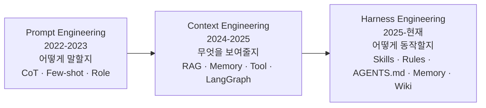
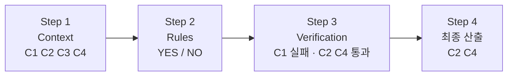

"모델이 좋아지면 제품도 좋아진다"는 전제는 몇 년 동안 깨질 일이 없었다. 그런데 모델이 상향 평준화되고 나니 이상한 일이 생긴다 — 벤치마크는 계속 오르는데 우리 에이전트는 그만큼 나아지지 않는다. 같은 도구를 1년째 쓰면서 첫 달과 무엇이 달라졌는지 대답하기 어렵다.

이 글은 그 간극의 원인을 하나로 지목한다. **동작 방식이 배포 시점에 고정돼 있기 때문**이다. 그리고 그 고정 영역을 바꿀 수 있게 만드는 층에 이름을 붙인다 — `Agent = Model + Harness`. 모델을 못 바꾼다면 하네스를 바꾼다는 것이 이 등식의 실천적 함의다. [앞 시리즈](/blog/ai-agent/self-evolving-seed-and-fork/)가 하네스를 무엇으로 조립하는지까지 다뤘다면, 이 시리즈는 그것을 **반복 실행하고 검증하는 운영 구조**로 넘어간다.

일곱 편이다. 이 글이 진단과 등식을 세우고, [자기진화와 거버넌스 편](/blog/ai-agent/self-evolving-harness-governance/)이 그 하네스가 스스로 갱신되는 구조를 다룬다. 이어서 [위임 격차 편](/blog/ai-agent/delegation-gap/)과 [단일 디스패처 편](/blog/ai-agent/single-dispatcher-worker-isolation/)이 자율 실행의 조건을, 마지막 세 편이 [루프 설계](/blog/ai-agent/loop-engineering-basics/)·[구성 요소](/blog/ai-agent/minimal-loop-design-surfaces/)·[안티패턴](/blog/ai-agent/loop-antipatterns-and-checklist/)을 다룬다.

> 이 글은 **2026년 4월 자료를 정리한 것**이다. 등장하는 벤치마크·수치·도입 사례는 모두 원 자료가 인용한 외부 자료다.

## 용어 정리

이 시리즈가 공통으로 쓰는 용어 중 이 글에 등장하는 행만 추렸다.

| 용어 | 원어 / 표기 | 뜻 |
|---|---|---|
| Agent Harness | Agent Harness | `Agent = Model + Harness`. 모델을 둘러싸고 통제하는 운영 구조 |
| Harness Engineering | Harness Engineering | 모델 **외부의 모든 것**을 가이드·센서·피드백 제어로 설계하는 관점 |
| Loop Engineering | Loop Engineering | 모델 **호출 이후**를 설계하는 실천. 정의는 [루프 기초 편](/blog/ai-agent/loop-engineering-basics/) |
| Compounding Principle | — | 실패에서 얻은 교훈이 **다음 실행의 동작 방식**에 반영되는 루프 |
| Context Engineering | Context Engineering | 모델이 다음 단계를 풀도록 지시·지식·도구 결과·메모리·상태를 선택·압축·격리·배치하는 설계 |
| Prompt Engineering | Prompt Engineering | 모델 파라미터를 바꾸지 않고 입력의 지시·예시·출력 형식·역할을 조정하는 것 |
| Rules · AGENTS.md | — | 프로젝트·팀 단위 행동 규범을 담아 실행마다 주입되는 파일 |
| SKILL | — | 절차·도구·판단 기준을 패키징해 필요할 때 로드하는 단위 |
| LLM Wiki | — | 답변을 지식으로 컴파일해 재활용하는 방식 |

## 하나의 문제, 세 번의 이름

먼저 이 논의가 어디서 왔는지부터다.

| 단계 | 질문 | 대표 기법 |
|---|---|---|
| Prompt Engineering | 모델에게 **어떻게 말할지** | CoT · Few-shot · Role |
| Context Engineering | **무엇을** 모델에게 보여줄지 | RAG · Memory · Tool · LangGraph |
| Harness Engineering | 모델이 **어떻게 동작할지** | Skills · Rules · AGENTS.md · Memory · Wiki |

세 단계는 서로 다른 기술이 아니라 **같은 문제를 다르게 푸는 방식**이다. 컨텍스트를 어떻게 관리할 것인가라는 문제 하나가 말하기 → 보여주기 → 동작시키기로 옮겨 갔을 뿐이다.

여기에 4월 자료가 덧붙인 제약 진단이 중요하다. Prompt·Context 단계에서 **유연한 것은 사용자 프롬프트뿐**이고, 시스템 프롬프트와 도구는 배포 시점에 결정론적으로 고정된다.

| 단계 | 컨텍스트 창을 채우는 것 |
|---|---|
| Prompt | 시스템 프롬프트 + 사용자 프롬프트 |
| Context | 시스템 프롬프트 + 사용자 프롬프트 + **도구** |
| Harness | 시스템 프롬프트 + 사용자 프롬프트 + **Skills · Tools · Rules · Middlewares** |

> **컨텍스트 길이는 누구에게나 고정된 자원이다. 차이는 그 고정된 창을 무엇으로 채우는가에서 난다.**
>
> 이 관점이 실무에서 값을 하는 이유는 경쟁 조건을 명확히 하기 때문이다. 모델도 컨텍스트 창도 모두에게 같으므로 남는 변수는 채우는 방식뿐이고, 그것은 예산이 아니라 설계로 결정된다. 하네스는 배포 시점에 고정되던 영역을 **동적으로 바꿀 수 있게 만드는 층**이며, 위 표의 세 번째 행이 두 번째 행보다 긴 이유가 그것이다.

## 쓰면 쓸수록 좋아지나요

같은 갈증이 층위마다 다른 문장으로 나타난다.

| 주체 | 증상 |
|---|---|
| 개인 | 1년째 쓰고 있는데, 첫 달과 얼마나 달라졌나 |
| 팀 | PoC 때는 잘 나왔는데 6개월 후 품질은 글쎄 |
| 기업 | 문서가 10배 늘었는데 답변 품질은 제자리 |
| 에이전트 | 어제의 실수를 오늘 또 반복 |

네 행이 같은 질문의 네 규모다 — **지식은 쌓이는데 시스템은 왜 똑똑해지지 않는가.** 그리고 원인은 방식의 고정성 넷으로 정리된다.

| # | 고정성 | 증상 |
|---|---|---|
| 01 | 정적 프롬프트 | 운영 피드백이 프롬프트로 돌아오지 않는다 |
| 02 | 정적 인덱스 | 문서는 늘어나지만 검색 방식은 그대로 |
| 03 | 정적 흐름 | 최신 프레임워크를 써도 흐름 자체가 진화하지 않는다 |
| 04 | 정적 평가 | 평가셋이 프로덕션 실패를 따라가지 못한다 |

**두 표는 행 수가 같지만 대응하지 않는다.** 위는 누가 겪는가이고 아래는 무엇 때문인가라, 네 주체가 네 고정성을 하나씩 나눠 갖는 것이 아니다. 오히려 네 고정성이 네 주체 모두에게 동시에 작동한다. 그중 03과 04가 특히 자주 누락되는데, 프롬프트와 인덱스는 손대 볼 생각이라도 하지만 흐름과 평가셋은 처음 만든 뒤 다시 열지 않기 때문이다.

## 오차는 곱해진다

> 정확도 95%인 단계를 10번 거치면 최종 정확도는 약 60%다.

멀티스텝 에이전트에서 작은 오차가 모이면 실패한 결과물이 될 가능성이 높다. 이 계산 하나가 하네스가 주목받는 이유 넷을 전부 설명한다.

| # | 하네스가 주목받는 이유 |
|---|---|
| 1 | 작업이 여러 단계로 수행되면서 복잡해짐 |
| 2 | 장기 실행 작업에서 일관된 품질 확보 |
| 3 | 에이전트 실행의 시스템화 |
| 4 | 맥락의 효율적 운용 |

지향점은 한 줄이다 — **비결정론에서 결정론으로.** 다만 이 문장을 "에이전트를 워크플로로 되돌리자"로 읽으면 안 된다. 모델의 출력은 여전히 비결정적이고, 결정론적으로 만드는 대상은 그 출력을 **다루는 방식**이다.

> **95% × 10단계 ≈ 60%가 조직 의사결정에 갖는 함의는 기획 단위의 크기다.**
>
> 긴 워크플로를 에이전트에 통째로 맡기는 기획은 산술적으로 실패한다. 단계를 쪼개고 각 단계에 검증을 붙이면 오차가 곱해지는 대신 단계마다 끊긴다. 그래서 자동화 후보를 고를 때 첫 질문은 "이 일을 AI가 할 수 있나"가 아니라 **"이 일을 기계적으로 검증 가능한 단위로 쪼갤 수 있나"가** 되어야 한다.

## 하네스의 네 계층

`Agent = Model + Harness`를 구성 요소로 분해하면 네 역할이 나온다.

| 하네스 구성물 | 역할 | 내용 |
|---|---|---|
| `AGENTS.md`, `Rules/` | **제약(Constrain)** | 규칙과 경계 설정으로 환각 방지 — "해야 하는 것 vs 하지 말아야 하는 것"의 구분 |
| Tools, Middleware, Wiki | **정보(Information)** | 작업에 필요한 맥락. LLM Wiki, RAG 방식이 유효 |
| Eval, Lint | **검증(Verification)** | 결과물이 기준에 부합하는지 검증 — TDD, 린터, 명세, 비즈니스 로직 |
| Memory | **피드백(Feedback)** | 같은 실수를 반복하지 않도록 개선 |

네 역할이 시간축에서 순서를 이룬다 — 제약은 시작 전에, 정보는 실행 중에, 검증은 종료 시점에, 피드백은 종료 후에 작동한다. **한 계층만 빠져도 나머지 셋이 헛돈다**는 것이 이 분해의 요점이고, 실무에서 가장 자주 빠지는 것은 세 번째와 네 번째다.

## 실패했을 때 어디를 고치는가

하네스가 실제로 도는 방식은 네 단계다.

문제는 이 흐름이 실패했을 때다. 자료의 다음 도식은 필요한 컨텍스트 `C5`가 애초에 수집되지 않아 잘못된 결과가 나온 상황을 그리고, 실패 지점별로 어디를 고쳐야 하는지를 되돌림 화살표로 표시한다.

| 실패 증상 | 고칠 곳 | 자료 표기 |
|---|---|---|
| 필요한 컨텍스트(C5)가 애초에 안 들어옴 | 검색·수집 단계 | **Fix Retrieval!** |
| 규칙이 잘못 판정 | Rules 레이어 | **Fix Rules!** |
| 통과시키면 안 되는 걸 통과시킴 | Verification 레이어 | **Fix Verification!** |

**도식은 하나인데 실패 표는 세 행이다.** 도식이 성공 경로만 그렸고 표는 그 경로의 각 단계가 무너지는 방식을 적었기 때문인데, 여기서 중요한 것은 세 행 어디에도 "모델을 바꾼다"가 없다는 점이다. 같은 증상을 놓고 모델 교체를 먼저 검토하는 습관이 시간을 가장 많이 쓰는 오진이다.

> 누구나 완벽한 계획을 가지고 있다. 그것이 실패하기 전까지.
>
> 이 문장이 자료의 전환점이다. 앞까지가 "무엇을 준비할 것인가"였다면 여기부터는 "실패했을 때 무엇이 달라지는가"로 옮겨 간다. 그리고 답이 재시도가 아니라 **구조 변경**이라는 것이 다음 절의 논지다.

## 실패를 규칙으로 승격시킨다

자료의 예시는 기술 용어 없이 이 원리를 설명한다.

| 구분 | 흐름 |
|---|---|
| **Lesson Learned (실패)** | "4월에는 대체로 비가 안 오니 셋째 주 금요일에 야외 워크샵을 갑시다" → 비가 왔음 → 준비했던 장소 섭외·주제·콘텐츠 회의가 전부 무의미 → **워크샵 취소** |
| **Add Rules (고도화)** | 같은 계획에 **"비가 올 경우"** 분기를 추가 → 실내 워크샵 / 야외 워크샵 두 갈래로 분리 → 어느 쪽이든 워크샵은 **진행됨** |

> **핵심은 "예측을 더 잘하자"가 아니라 실패 경험을 규칙으로 승격시켜 다음 실행의 동작 방식을 바꾼다는 것이다.**
>
> 두 접근의 차이가 비용에서 갈린다. 예측 정확도를 올리는 일은 상한이 있고 투입 대비 수익이 빠르게 떨어지지만, 분기를 하나 추가하는 일은 한 번 하면 영구적이고 다음 실패에서 또 하나가 붙는다. 회고를 문서로만 남기는 조직과 회고를 규칙 파일에 커밋하는 조직의 6개월 뒤 차이가 여기서 갈린다 — 전자는 같은 실패를 반복하고 후자는 분기가 쌓인다.

같은 패턴이 네 가지 이름으로 불리고 있다.

| 이름 | 주체 · 시점 | 내용 |
|---|---|---|
| **SKILL** | Anthropic (2025.10) | 절차·도구·판단기준이 축적·갱신 |
| **LLM Wiki** | Karpathy (2026.04) | 답변이 지식으로 컴파일, 재활용 |
| **Rules** | Cursor (2025~) | 프로젝트별 행동 규범 누적 |
| **Playbook** | Devin (2025~) | 반복 과제의 고정밀 실행 패턴 |

네 이름이 2025년 하반기부터 2026년 4월 사이에 몰려 나왔다는 것이 이 표의 정보다. 서로 다른 진영이 독립적으로 같은 구조에 도착했다는 뜻이고, 그것이 **Compounding Principle** — 배운 것이 다음 실행의 동작 방식에 반영되는 루프 — 이 특정 제품의 기능이 아니라 일반해라는 근거가 된다.

## 하네스가 다루는 네 표면

> "If you're not the model, you are the harness." AI 모델(두뇌) 자체보다, 그 모델을 둘러싸고 통제하는 운영 구조가 더 중요하다.
>
> 이 문장의 실질은 배제법이다. 모델을 직접 만들지 않는 모든 조직은 자동으로 하네스 쪽에 서 있고, 그러면 "우리는 모델을 못 만드니까 할 수 있는 게 없다"는 진단이 성립하지 않게 된다. 경쟁 영역이 좁아지는 것이 아니라 옮겨 간다.

그 하네스가 손대는 표면은 넷이다.

| 표면 | 구성물 |
|---|---|
| 사전 정의 | System Prompt · Tools · Skills · MCPs |
| 환경 | Sandbox · Filesystem · Browser |
| 오케스트레이션 | Subagent · Handoff · Routing |
| 동적 제어 | Hooks · Middleware |

위에서 아래로 갈수록 실행 시점에 가까워진다. 첫 표면은 세션 시작 전에 정해지고, 마지막 표면은 도구 호출 순간에 작동한다. **네 표면 중 앞의 셋만 손대는 것이 흔한 정체 지점**인데, 동적 제어가 없으면 실행 도중에 개입할 수단이 없어 하네스가 다시 정적인 구성이 되기 때문이다.

그래서 엔지니어의 역할이 이렇게 옮겨 간다 — **프롬프트를 쓰는 사람에서 진화 루프를 설계하는 사람으로.**

---

여기까지가 진단과 등식이다. 모델은 상향 평준화됐고, 차이는 하네스에서 나며, 하네스는 네 계층과 네 표면으로 분해되고, 실패는 규칙으로 승격시켜 복리로 쌓는다.

그런데 "쌓는다"는 말에는 아직 주어가 없다. 사람이 매번 규칙을 추가한다면 그것은 자동화가 아니라 새로운 수작업이고, 자동으로 쌓게 하면 누가 언제 검토할 것인지가 문제가 된다. [다음 편](/blog/ai-agent/self-evolving-harness-governance/)에서 하네스가 스스로 갱신되는 레퍼런스 아키텍처와, 모델을 고정한 채 하네스만 바꿔 벤치마크를 13.7포인트 올린 실증, 그리고 자율성과 거버넌스가 왜 한 쌍인지를 본다.
