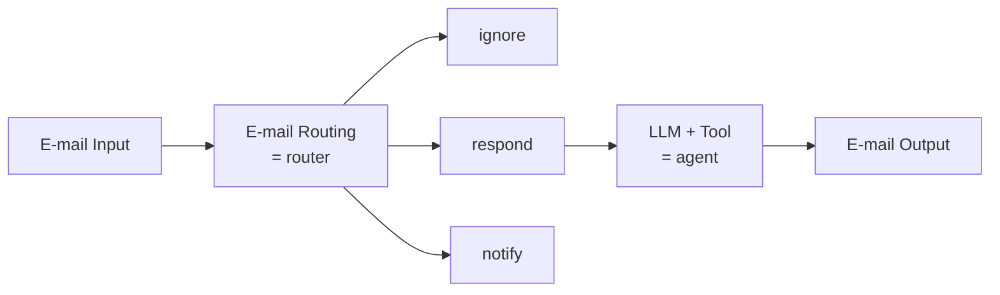
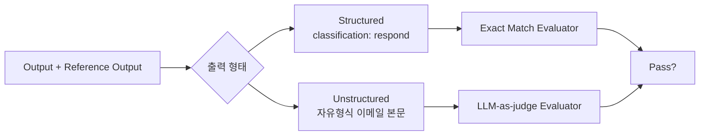
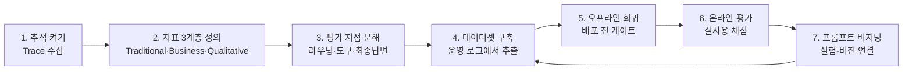

"에이전트가 잘 되나요?"라는 질문에는 답할 수 없다. 라우팅이 틀린 것인지, 도구 선택이 틀린 것인지, 근거는 맞았는데 문장이 나쁜 것인지가 구분되지 않은 상태에서 나온 질문이기 때문이다. 답을 만들려면 질문을 쪼개야 한다.

이 글은 그 쪼개기를 두 축으로 한다. 하나는 **평가 지점** — 라우팅·도구 호출·최종 답변 셋으로 나누면 "어디가 틀렸나"에 답할 수 있게 된다. 다른 하나는 **지표의 수신자** — 엔지니어용 지표만 있으면 품질 대화가 개발팀 안에 갇힌다. 여기에 세 가지 평가 방식(오프라인·온라인·루프)을 언제 쓰는가와, 이 모두를 실제로 세우는 7단계 절차를 붙인다.

[앞 편](/blog/ai-agent/ambient-agent-and-hitl/)에서 승인 데이터가 회귀 테스트 자산으로 재사용되는 구조를 봤다. 그 자산을 무엇에 쓸 것인가가 이 글의 주제이며, [첫 편의 배팅 우선순위 1위](/blog/ai-agent/llm-app-bottleneck-shift/)이기도 하다 — 보안·지연·비용이 시장에서 해소되는 동안 품질만 남았기 때문이다.

> 이 글은 **2025년 5월과 7월의 자료를 정리한 것**이다. 제품 화면 구성과 기능명은 그 시점의 것이다.

## 용어 정리

앞 편의 용어표에서 이 글이 쓰는 행만 추리고, 평가 용어를 더했다.

| 용어 | 원어 / 표기 | 뜻 |
|---|---|---|
| Evaluation | Evaluation / Evals | LLM 애플리케이션의 품질을 정의된 기준으로 측정하는 활동 |
| Observability | Observability | 운영 중인 시스템 내부 상태를 밖에서 관측 가능하게 만드는 것. 추적·지표·로그 |
| Trace | Trace | 한 번의 요청이 거쳐 간 모든 호출(LLM·도구·검색)의 실행 기록 |
| Trajectory | Trajectory | 에이전트가 목표에 도달하기까지 밟은 단계의 순서 그 자체 |
| 오프라인 평가 | Offline Evaluation | 운영 전, 미리 준비한 데이터셋으로 성능을 측정하는 방식 |
| 온라인 평가 | Online Evaluation | 실제 사용자 트래픽에서 생성된 데이터로 평가하는 방식 |
| 루프 평가 | Loop Evaluation | 에이전트 실행 루프 안에서 즉시 결과를 채점하고 되먹이는 방식 |
| LLM-as-Judge | LLM as a Judge | 정답이 하나로 정해지지 않는 출력을 다른 LLM이 기준에 따라 채점하게 하는 방법 |
| Exact Match | Exact Match Evaluator | 출력이 정답과 정확히 일치하는지 보는 평가자. 분류·라우팅처럼 정형 출력에 사용 |
| Ground Truth | ground truth | 정답으로 삼는 기준값. 평가 데이터셋의 레퍼런스 출력 |
| Triage Unit Test | — | 에이전트 전체가 아니라 라우팅 같은 개별 판단 하나만 떼어 검증하는 테스트 |
| Context Recall | context recall | 답에 필요한 근거 중 실제로 검색해 온 비율 |
| Context Precision | context precision | 검색해 온 문맥 중 실제로 답에 쓸모 있었던 비율 |
| P50 / P99 | percentile | 지연시간 분포의 50번째·99번째 백분위. 평균 대신 꼬리 지연을 보는 지표 |
| SRE | Site Reliability Engineer | 서비스 가용성·운영·장애 대응을 맡는 직무 |
| 프롬프트 허브 | Prompt Hub | 프롬프트를 코드처럼 버전 관리·공유·실험하는 저장소 |

## 왜 어려운가 — 여섯 가지 이유

| 이유 | 설명 |
|---|---|
| 정답이 하나가 아니다 | 자유형식 텍스트는 Exact Match로 채점 불가 |
| 채점자마저 확률적이다 | LLM-as-Judge의 일관성 자체가 문제 |
| 평가 지표의 적절성을 모른다 | 무엇을 재야 좋은 제품인지 합의가 없음 |
| 데이터셋이 없다 | 평가용 데이터셋 구축이 별도 프로젝트 |
| 실행 경로가 길다 | 에이전트는 라우팅·도구 호출·생성이 겹쳐 어디서 틀렸는지 특정하기 어려움 |
| 페이로드가 크고 비정형이다 | 전통적 APM 트레이스와 형태가 다름 |

여섯 중 앞의 넷은 **무엇을 정답으로 볼 것인가**의 문제이고, 뒤의 둘은 **어디를 볼 것인가**의 문제다. 이 글의 전반부가 앞의 넷을, 후반부가 뒤의 둘을 다룬다.

> LangSmith가 스스로를 규정한 문구가 이 구분을 정확히 말한다 — "Large, Unstructured, Multi-modal Payloads", **"Built for an agent engineer not an SRE"**.
>
> 기존 APM·모니터링 도구와 목적이 다르다는 선언이다. SRE는 서비스가 살아 있는지를 보지만 에이전트 엔지니어는 **판단의 품질**을 봐야 한다. 응답이 200으로 돌아오면서도 완전히 틀린 답을 담고 있을 수 있다는 것이 이 도메인의 특징이고, 그래서 가용성 지표만으로는 아무것도 알 수 없다.

## 세 가지 평가 방식

### 오프라인 평가 — 운영 전, 준비된 데이터셋으로

| 구성요소 | 내용 |
|---|---|
| 데이터 준비 | 평가 목적에 맞는 다양한 샘플 데이터를 사전 구축 |
| 평가자 역할 | 사람 또는 자동화 시스템이 결과에 점수를 부여하고 분석 |
| 성과 추적 | 시간 경과에 따른 성능 변화를 객관적으로 측정 |
| 모델 비교 | 다양한 모델이나 프롬프트 변화 효과를 체계적으로 비교 |

| 장점 | 단점 |
|---|---|
| 통제된 환경에서 일관된 평가 가능 | 데이터 세트 한계로 실제 환경과 괴리 |
| 모델 간 성능 직접 비교 용이 | 예상 못한 실제 사용 패턴 반영 어려움 |
| 비용 효율적이고 신속한 평가 | 데이터 편향성이 결과에 영향 가능 |

장단점이 같은 성질의 앞뒷면이다. **통제됐기 때문에 비교가 가능하고, 통제됐기 때문에 현실과 다르다.**

### 온라인 평가 — 실제 트래픽에서

| 항목 | 내용 |
|---|---|
| 정의 | 운영 중인 앱에 유입되는 실제 질의와 사용자 행동을 기반으로 평가 |
| 특징 | 실제 사용자가 생성한 동적인 데이터 활용 / 실시간 또는 사후 성능 점수화 가능 |
| 주의 | 데이터 통제와 일관성 유지에 어려움 존재 |
| 키워드 | 실제 사용자 데이터 · 실시간 평가 · 현실 환경 반영 |
| 원 자료 각주 | "온라인 평가는 에이전트가 실제 환경에서 어떻게 작동하는지 가장 정확하게 보여줍니다" |

### 루프 평가 — 실행 중에 즉시

| 항목 | 내용 |
|---|---|
| 정의 | 브라우저 사용, 코드 실행 등에서 결과를 즉시 평가하고 피드백. 작업 수행 중 품질을 검증하고 필요시 수정 |
| 장점 | 실시간 상태 모니터링 / 잘못된 결과 즉시 차단 가능 / 정확도와 신뢰성 향상 |
| 단점 | 시간·비용 소요 증가 / 지연 허용 범위 제한적 / 구현 복잡성 높음 |

도식의 `C → D → B` 되돌림이 [Agentic RAG의 관련성 검증 루프](/blog/rag/agentic-rag-relevance-check/)와 같은 형태라는 점이 눈에 띈다. 자기교정 루프를 "평가"의 한 방식으로 분류하면, 관련성 판정기와 근거성 채점기가 전부 루프 평가기가 된다.

### 세 방식 비교

| 평가 방식 | 데이터 소스 | 평가 시점 | 장점 | 단점 |
|---|---|---|---|---|
| 오프라인 | 준비된 데이터 세트 | 운영 전 | 비교 및 분석 용이 | 실제 환경과 괴리 |
| 온라인 | 실제 사용자 데이터 | 실시간/사후 | 실제 사용 반영 | 통제 어려움 |
| 루프 | 실시간 생산 데이터 | 에이전트 실행 중 | 즉각적 피드백·수정 가능 | 비용·지연 시간 증가 |

**이 비교표는 위 세 개별 표의 요약이지 대체가 아니다.** 비교표는 각 방식의 결정적 축(소스·시점·장단점 한 줄씩)만 남기므로, 오프라인의 구성요소 넷이나 루프의 장점 셋 같은 것은 여기 없다. 방식을 고를 때는 비교표를, 고른 뒤 실제로 세울 때는 개별 표를 본다.

셋의 관계는 배타가 아니라 순서다 — 오프라인으로 배포 게이트를 만들고, 온라인으로 실패 케이스를 수집하고, 그 케이스를 다시 오프라인 데이터셋에 넣는다. 루프는 되돌릴 수 없는 행위 앞에서만 쓴다. 비용이 가장 크기 때문이다.

## 무엇을 평가할 것인가 — 지점 3계층

같은 Email Assistant 구조도를 세 번 반복하면서 **평가 대상 지점만 바꿔 가며** 설명한 것이 이 자료의 백미다.

| 평가 계층 | 평가 지점 | 평가 방법 | 근거 |
|---|---|---|---|
| (1) 생성된 답변 | E-mail Output | 최종 산출물 품질 채점 | 자유형식 → LLM-as-Judge |
| (2) Triage 판단 | E-mail Routing | **Triage Unit Test: evaluate a triage decision** | 정형 분류 → Exact Match |
| (3) 도구 호출 | LLM → Tool action | 어떤 도구를 골랐는지 / 인자가 맞는지 | 도구 선택·결과 평가 |

왜 나누는지는 구조도 아래 붙은 설명 두 줄이 말한다.

| 구간 | 설명 원문 | 함의 |
|---|---|---|
| 앞단 | "Simple branching step to classify incoming emails, so use a **router**" | 단순 분기 → 결정론적, 유닛테스트 가능 |
| 뒷단 | "Based on the email, need different tools (schedule mtng, check cal, etc) so use an **agent**" | 도구 선택 필요 → 비결정론적, 궤적 평가 필요 |

> **한 시스템 안에서 앞단과 뒷단의 평가 방법이 달라야 한다는 것이 이 절의 결론이다.**
>
> 이 구분이 값을 하는 이유는 앞단을 에이전트로 만들지 않을 근거가 되기 때문이다. 분류 단계를 라우터로 두면 Exact Match로 채점되는 유닛테스트가 성립하고, 같은 자리를 에이전트로 만들면 그 시점부터 궤적 평가밖에 못 한다. **평가 가능성이 아키텍처 선택의 기준이 되는 자리**이며, [경로를 누가 정하는가](/blog/ai-agent/agent-vs-workflow/)의 판단에 축이 하나 더 붙는 셈이다.

정리하면 "에이전트가 잘 되나요"는 라우팅 정확도 / 도구 선택 정확도 / 최종 답변 품질 셋으로 쪼개야 답이 되고, 쪼개야 개선 지점이 특정된다.

### 정형과 비정형은 채점기가 다르다

| 구분 | Structured | Unstructured |
|---|---|---|
| Output 예시 | `{"classification": "respond"}` | "Hi Nick, I just scheduled a meeting for us on Tuesday at 3pm! Best, Lance" |
| Reference | `{"ground_truth": "respond"}` | Success Criteria: "Schedule a meeting on Tuesday" |
| Evaluator | Exact Match Evaluator | LLM-as-judge Evaluator |
| 결과 | true / false | true / false |

> **비정형 평가에서 레퍼런스는 "정답 문장"이 아니라 성공 기준(Success Criteria)이다.**
>
> 두 번째 행이 이 표의 전부다. 문장을 맞히라고 하면 평가가 불가능해진다 — 같은 뜻의 이메일을 쓰는 방법이 수십 가지이고 그중 하나만 정답이 될 이유가 없다. 조건을 만족했는지 묻는 순간 평가가 가능해지고, 마지막 행처럼 결과가 두 방식 모두 `true / false`로 떨어진다. 채점기는 달라도 **출력 계약은 같게 유지한다**는 설계다.

## 누가 볼 것인가 — 메트릭 3계층

| 계층 | 지표 | 지표 | 지표 |
|---|---|---|---|
| Traditional Metrics | TRACE VOLUME | ERROR RATES | LATENCY |
| Business Metrics | COST | USER FEEDBACK | TOPIC SUMMARIZATION |
| Qualitative Metrics | TOXICITY | HALLUCINATIONS | CUSTOM EVALUATION |

| 계층 | 누구를 위한 지표인가 | 답하는 질문 |
|---|---|---|
| Traditional | 엔지니어 | 시스템이 도는가, 얼마나 느린가, 얼마나 깨지는가 |
| Business | 경영진·PM | 돈이 얼마나 드는가, 사용자가 만족하는가, 무엇을 묻고 있는가 |
| Qualitative | 제품·리스크 | 위험한 말을 하는가, 지어내는가, 우리 기준에 맞는가 |

**두 표는 행 수가 같지만 세는 단위가 다르다.** 위는 계층당 지표 셋을 나열하고, 아래는 계층당 수신자와 질문을 적는다. 위만 보면 아홉 개 지표 목록이고, 아래만 보면 지표 이름이 사라진다.

> **이 3계층은 지표 분류가 아니라 조직 확장 장치다.**
>
> Traditional만 있으면 품질 대화가 개발팀 안에 갇힌다. Business Metrics 행(Cost / User Feedback / Topic Summarization)이 생기는 순간 PM·CS·재무가 **같은 대시보드**를 보게 되고, 이때부터 "이 기능이 개선됐다"는 주장이 개발팀 밖에서 검증 가능해진다. 자료가 이 표에 "개발자 1인의 온전한 책임이 아닌 팀으로의 확장"이라는 부제를 붙인 이유가 여기 있다.

## 무엇을 추적하는가

| 관측 대상 | 화면 이름 | 보는 것 |
|---|---|---|
| 도구 사용 | Tool Metric Observability — RUN COUNT BY TOOL | 도구별 호출 횟수의 시간 변화 (예: Search_Knowledge_Base, SerpAPI, Calculator) |
| 실행 경로 | Trajectory Observability — MEDIAN LATENCY BY RUN NAME | 실행 단위별 중앙 지연 (예: ChatOpenAI, VectorStoreRetriever, conduct_research, JSONOutputTool) |
| 실험 비교 | COMPARING TESTS / HUMAN LABELING | Aggregate Metrics(예: Conciseness) · Latency(P50) · Tokens(P50)를 실험 번호별로 나란히 비교 |

세 화면을 질문 쪽에서 다시 세우면 이렇게 된다.

| 질문 | 보는 화면 |
|---|---|
| 이 에이전트는 어떤 도구에 의존하고 있나 | Tool Metric |
| 느린 원인이 어느 단계인가 | Trajectory Latency |
| 이번 프롬프트 변경이 개선인가 퇴보인가 | Comparing Tests |

**두 표는 행 수가 셋으로 같지만 열 축이 다르다.** 위 표는 화면에서 출발해 무엇이 보이는지를 적고, 아래 표는 질문에서 출발해 어느 화면으로 가는지를 적는다. 하나로 합치려면 네 열(질문·관측 대상·화면 이름·보는 것)짜리 단일 표가 되어야 하는데, 그러면 질문 열이 나머지 셋에 종속된 것처럼 보인다. 실무에서는 대개 질문이 먼저 오므로 두 방향을 따로 두는 편이 쓰기 낫다.

셋 중 마지막이 성격이 다르다는 점도 짚어 둘 만하다. 앞의 둘은 운영 중인 시스템을 보는 것이고, `Comparing Tests`는 **바꾸기 전과 후를 보는 것**이다. 관측과 평가가 만나는 자리가 여기다.

### 프롬프트 버저닝

| 항목 | 내용 |
|---|---|
| 제품 | LangSmith Prompt Hub / Playground |
| 화면 구성 | 왼쪽 PROMPTS(SYSTEM 메시지 + HUMAN 메시지, + Message / + Output schema / + Tool 버튼), 오른쪽 OUTPUT |
| 핵심 메시지 | **프롬프트 허브를 활용한 버저닝의 중요성** |

프롬프트를 코드 리포지터리 안 문자열로 두면 셋이 동시에 막힌다 — ① 변경 이력이 커밋에 섞여 추적이 어렵고 ② 비개발자가 손댈 수 없고 ③ 어떤 버전이 어떤 실험 결과를 냈는지 연결되지 않는다. 허브로 빼면 이 셋이 함께 풀린다. 특히 ③은 위 `Comparing Tests`가 성립하기 위한 전제라, 버저닝 없이 실험 비교를 하면 무엇을 비교한 것인지 나중에 알 수 없다.

## 도입 절차 7단계

원 자료는 절차를 한 장으로 정리해 두지 않았다. 아래는 위 요소들을 도입 순서로 재구성한 것이다.

| 단계 | 하는 일 | 완료 판정 |
|---|---|---|
| 1. 추적 켜기 | 모든 실행에 trace를 남긴다 | 장애 시 실행 경로를 재구성할 수 있다 |
| 2. 지표 정의 | 3계층 중 우리 서비스에 필요한 항목 선별 | 비개발자가 대시보드를 해석할 수 있다 |
| 3. 평가 지점 분해 | 라우팅 / 도구 호출 / 최종 답변으로 쪼갠다 | "어디가 틀렸나"에 답할 수 있다 |
| 4. 데이터셋 구축 | 운영 로그·사람 피드백에서 케이스 수집 | 회귀 세트가 존재한다 |
| 5. 오프라인 회귀 | 배포 전 자동 실행 | 지표 하락 시 배포가 막힌다 |
| 6. 온라인 평가 | 실사용 트래픽을 사후 채점 | 실환경 지표가 추이로 보인다 |
| 7. 프롬프트 버저닝 | 버전 태깅 + 실험 결과 연결 | "어느 버전이 좋았나"에 답할 수 있다 |
| → 4로 회귀 | 온라인에서 발견한 실패 케이스를 데이터셋에 편입 | 루프가 닫힌다 |

**도식은 노드 일곱인데 표는 여덟 행이다.** 마지막 행(`7 → 4` 회귀)이 도식에서는 화살표 하나라 노드로 세어지지 않기 때문인데, 그 화살표가 이 절차의 요점이다. 7단계를 한 번 완주하는 것은 프로젝트지만, 4번으로 돌아오는 화살표가 있어야 **체계**가 된다.

세 번째 열도 눈여겨볼 만하다. 완료 판정이 전부 "무엇에 답할 수 있게 되는가"로 쓰여 있고 산출물 이름이 아니다. 대시보드를 만든 것과 비개발자가 그것을 해석할 수 있는 것은 다른 사건이다.

## 현장의 고민 — 완벽주의가 착수를 늦춘다

| 관찰 | 내용 |
|---|---|
| 보편성 | 모든 회사가 각자의 방식으로 평가 방식을 고민(LLM-as-Judge) |
| 과잉 투자 | 완벽한 평가 지표를 만들려고 너무 많은 노력을 쏟고 있음 |
| Andrew Ng의 처방 | **"20분 만에 빠르게 평가할 수 있는 능력"** |
| 현실 인정 | 아무리 완벽한 평가를 하려 해도 틀릴 것이다 → 온라인 평가로 **점진적으로 발전하는 파이프라인** 구축 |
| 방향 | 실제 사용자 tracing이 들어오는 시점에서 대화를 평가해 나가려는 노력 |
| 새 과제 | Agent + MCP 시대의 ① 도구 선택에 대한 평가 ② 도구 활용 후 결과에 대한 평가 방식 |
| 5월 기록 | 평가 지표에 대한 모호함. "고객 만족 지표를 어떤 정량지표로 표현하는 것이 적합할까?"에 대한 실험 |

> **20분짜리 거친 평가라도 먼저 돌리는 것이 완벽한 지표를 설계하는 것보다 낫다.**
>
> 이유는 위 7단계의 순서에 이미 들어 있다. 데이터셋 구축(4번)이 온라인 평가(6번)보다 먼저 오지만, 처음에 만드는 데이터셋은 어차피 틀린다 — 실제 사용자가 무엇을 묻는지 모르는 상태에서 만들었기 때문이다. 그 오차를 없애려고 4번에 오래 머무는 것이 과잉 투자이고, 6번을 돌려 실패 케이스를 회수하는 편이 빠르다. **평가 체계는 설계하는 것이 아니라 수렴시키는 것**이라는 뜻이다.

여섯 번째 행의 "새 과제"는 아직 열려 있다. 도구가 표준 프로토콜로 붙기 시작하면서 도구 선택 자체가 평가 대상이 됐는데, 그 표준이 만든 다른 변화들은 다음 편의 주제다.

---

여기까지가 품질을 재는 체계다. 지점을 셋으로 쪼개고, 방식을 셋으로 나누고, 지표를 셋으로 층지어 개발팀 밖으로 내보낸다.

그런데 위 마지막 표의 여섯 번째 행이 새 문제를 열어 둔 채 끝난다 — 도구를 표준 프로토콜로 붙이기 시작하면 도구 선택 정확도가 새 평가 대상이 되고, 동시에 **접근 제어**라는 전혀 다른 문제가 따라온다. 사내 지식베이스를 프로토콜로 여는 순간 검색 품질보다 권한이 먼저가 된다. [다음 편](/blog/ai-agent/mcp-rag-as-service/)에서 MCP가 실제로 바꾼 것과, 벡터스토어를 애플리케이션 밖으로 떼어 내는 재편을 다룬다.
