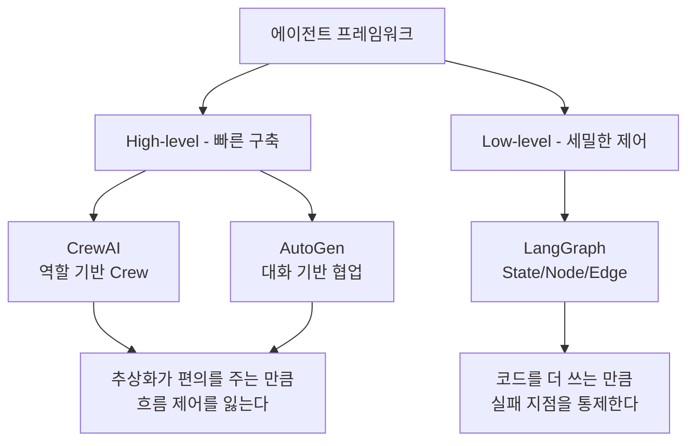
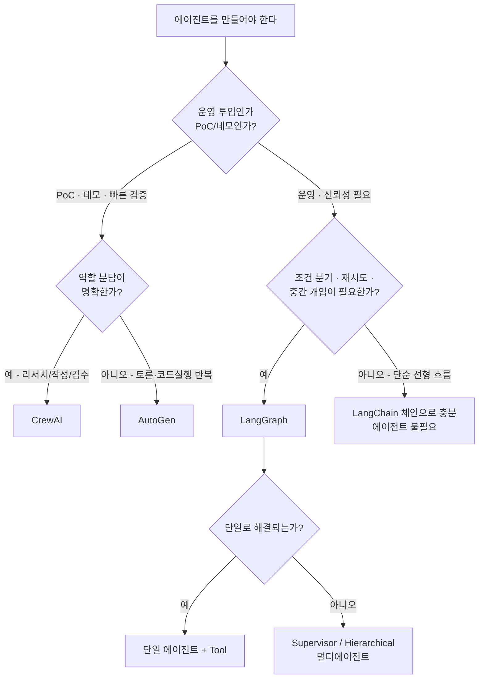

프레임워크 선택 질문에 "요즘 다 LangGraph 쓴다"고 답하는 것은 근거가 아니다. 세 프레임워크는 같은 문제를 서로 다른 **추상화 수준**에서 푸는데, 추상화가 주는 편의와 개발자가 쥐는 제어권은 반비례한다. 그래서 선택은 취향이 아니라 **운영 요건의 함수**다.

[앞 편](/blog/ai-agent/agent-vs-chatbot/)에서 Naive RAG가 검색 실패를 스스로 모른다는 문제까지 왔다. 이 글은 그 돌파를 무엇으로 구현할지를 다룬다. CrewAI·AutoGen·LangGraph를 12개 축으로 비교하고, 어떤 조건에서 어느 쪽이 맞는지를 의사결정 트리로 정리한다. **트리의 끝에 "에이전트를 쓰지 않는다"는 선택지가 있다는 것**이 이 글에서 가장 중요한 한 칸이다.

## 용어 정리

앞 편의 용어표에서 이 글이 쓰는 행만 추리고, 프레임워크 고유명사를 더했다.

| 약어 / 용어 | 원어 | 뜻 |
|---|---|---|
| Controllability | — | 제어 가능성. 개발자가 실행 흐름을 얼마나 세밀히 지정할 수 있는가 |
| Persistence | — | 지속성. 실행 상태를 저장했다가 이어서 재개할 수 있는 성질 |
| HITL | Human-in-the-Loop | 실행 도중 사람이 개입해 승인·수정하는 구조 |
| State | — | 그래프 실행 전 구간에서 공유·갱신되는 데이터 묶음 |
| Node / Edge | — | 그래프의 작업 단위(노드)와 그 사이의 연결/분기(엣지) |
| DAG | Directed Acyclic Graph | 방향성 비순환 그래프. 되돌아가는 루프가 없는 구조 |
| CrewAI | — | 역할(Role) 기반 멀티에이전트 프레임워크. LangChain 위에 구축 |
| AutoGen | — | Microsoft가 만든 멀티에이전트 **대화** 프레임워크 |
| LangGraph | — | LangChain Inc.가 만든 그래프·상태 기반 Low-level 에이전트 프레임워크 |
| UserProxyAgent | — | AutoGen에서 사용자를 대신해 발언·실행하는 에이전트 |
| AssistantAgent | — | AutoGen에서 UserProxy를 보조해 답을 생성하는 에이전트 |
| Pregel | — | 구글의 대규모 그래프 병렬처리 모델. LangGraph 실행 모델의 원류 |
| Apache Beam | — | 배치·스트리밍 통합 데이터 처리 모델. LangGraph가 영감을 받은 프로젝트 |
| NetworkX | — | 파이썬 그래프 라이브러리. LangGraph 공개 인터페이스의 참고 대상 |
| Supervisor / Hierarchical | — | 관리자 에이전트가 하위 에이전트에 작업을 배분하는 멀티에이전트 구조 |

## 세 프레임워크의 정체성

| 프레임워크 | 무엇으로 정의되는가 |
|---|---|
| **CrewAI** | LangChain으로 구축된 프레임워크. **Agent, Tool, Task, Process, Crew**로 구성된다. LangChain과 결합이 용이하며 멀티에이전트 아키텍처에 최적화돼 있다 |
| **AutoGen** | Microsoft가 만든 멀티에이전트 **대화** 시스템 구축 프레임워크. 사용자를 대신하는 `UserProxyAgent`와 이를 보조하는 `AssistantAgent`가 있고, **여러 에이전트 간의 대화 자체에 집중**한다 |
| **LangGraph** | LangChain 생태계에서 구축된 **그래프 방식**의 프레임워크로 **Low-level 접근**을 취한다. 에이전트-에이전트, 에이전트-도구 간 흐름을 상세히 정의하므로 **Controllability가 높다** |

세 줄에 이미 답이 반쯤 들어 있다. **CrewAI는 조직도를 흉내 내고, AutoGen은 회의록을 흉내 내고, LangGraph는 상태 기계를 그대로 노출한다.**

### LangGraph가 스스로 내세우는 세 가지

LangGraph 공식 문서는 자신을 상태 저장·멀티액터 애플리케이션을 구축하기 위한 라이브러리로 규정하고, 다른 LLM 프레임워크 대비 이점을 셋으로 든다.

| 이점 | 공식 설명의 요지 | 실무에서 무엇을 얻는가 |
|---|---|---|
| **주기(Cycle)** | 대부분의 에이전트 아키텍처에 필수적인 주기를 포함하는 플로우를 정의할 수 있어 **DAG 기반 솔루션과 차별화**된다 | 평가 실패 시 되돌아가는 흐름을 코드로 표현할 수 있다 |
| **제어 가능성** | 매우 낮은 수준(low-level)의 프레임워크로서 애플리케이션의 **흐름과 상태를 모두 세밀하게 제어**할 수 있다 | 실패 지점을 노드 단위로 특정하고 격리할 수 있다 |
| **지속성** | 지속성이 내장돼 있어 고급 **Human-in-the-Loop** 및 메모리 기능을 쓸 수 있다 | 장시간 실행을 중단·재개하고 중간에 사람 승인을 끼울 수 있다 |

계보도 명시돼 있다. **Pregel**과 **Apache Beam**에서 영감을 받았고, 공용 인터페이스는 **NetworkX**에서 영감을 얻었다. LangChain을 개발한 LangChain Inc.가 만들었지만 **LangChain 없이도 사용할 수 있다.**

> 계보가 취향 정보가 아닌 이유는 Pregel이 **대규모 그래프 병렬처리 모델**이라는 데 있다. LangGraph의 노드가 왜 "State를 받아 State 일부를 반환하는 함수"라는 계약을 갖는지, 왜 병렬 실행이 자연스러운지가 여기서 나온다.
>
> 그리고 **LangChain 의존이 필수가 아니라는 점**은 기술 선택 회의에서 자주 오해되는 지점이다. 같은 회사가 만들었다는 사실이 종속을 뜻하지 않는다.

## 축별 비교 — 12개 축

| 비교 축 | CrewAI | AutoGen | LangGraph |
|---|---|---|---|
| **핵심 은유** | 회사 조직(역할 분담) | 회의실(대화) | 상태 기계 / 그래프 |
| **추상화 수준** | 높음 (High-level) | 중간 | **낮음 (Low-level)** |
| **제어권 소재** | 프레임워크가 많이 가져감 | 대화 규칙에 위임 | **개발자가 흐름을 명시** |
| **1급 개념** | Agent, Tool, Task, Process, Crew | UserProxyAgent, AssistantAgent | State, Node, Edge |
| **상태 관리** | Task 결과 전달 중심 | 대화 이력(메시지 로그) | **명시적 State 객체를 전 노드가 공유·갱신** |
| **흐름 형태** | 순차/병렬 Process | 대화 턴의 연쇄 | **사이클 허용 그래프** |
| **분기 제어** | 제한적 | 대화 흐름에 의존 | 조건부 엣지로 명시적 분기 |
| **재개·중단** | 약함 | 약함 | **지속성 내장 → 체크포인트·HITL** |
| **개발 속도** | 가장 빠름 | 빠름 | 느림(코드량 많음) |
| **디버깅 난이도** | 내부가 감춰져 원인 추적 어려움 | 대화 로그로 추적 | 노드 단위로 추적 쉬움 |
| **LangChain 의존** | LangChain 기반 | 독립 | 같은 생태계이나 **필수 아님** |
| **적합 상황** | 역할이 뚜렷한 협업 과업(리서치→작성→검수) | 에이전트끼리 토론·코드 실행 반복 | **운영 투입할 신뢰성 있는 에이전트, 조건 분기·재시도가 많은 워크플로우** |

> **열두 행이 같은 강도의 근거를 갖지는 않는다.**
>
> 「추상화 수준·제어권 소재·1급 개념·흐름 형태·재개와 중단·LangChain 의존」 여섯 행은 원 자료에 직접 근거가 있다. 「핵심 은유·개발 속도·디버깅 난이도·적합 상황」 네 행은 그 위에 얹은 해석이다.
>
> 구분이 필요한 자리는 이 표를 근거로 실제 선택을 할 때다. 원 자료에 근거가 있는 행은 출처로 확인되지만, 해석 행은 팀의 숙련도와 운영 조건에 따라 달라진다.

12개 축 중 **상태 관리** 행이 나머지를 대체로 결정한다. 상태를 어디에 두느냐가 정해지면 분기 제어도, 재개·중단도, 디버깅 난이도도 따라 정해지기 때문이다.

| 상태를 어디에 두는가 | 따라오는 결과 |
|---|---|
| Task 결과로 흘려보낸다 (CrewAI) | 중간 지점의 상태를 꺼내 볼 방법이 마땅치 않다 → 재개·중단 약함 |
| 대화 이력에 쌓는다 (AutoGen) | 상태 = 메시지 로그 → 로그로 추적되지만 구조화된 분기는 어렵다 |
| 명시적 State 객체에 둔다 (LangGraph) | 스냅샷 저장·복원이 가능 → 체크포인트·HITL·Time Travel이 전부 여기서 파생 |

> **"이 프레임워크는 재개가 되나요"는 사실 "상태를 어디에 두나요"와 같은 질문이다.** 지속성은 부가 기능이 아니라 상태 설계의 귀결이다.

### 추상화 수준과 제어권은 반비례한다

CrewAI는 "역할만 정의하면 알아서 굴러간다"는 편의를 주고, 대신 중간에 특정 조건에서 되돌아가게 만드는 일이 어렵다. LangGraph는 그 반대다. 노드와 엣지를 직접 쓰는 비용을 내는 대신, 어디서 무엇이 실패했는지를 노드 단위로 특정한다.

> 이 트레이드오프에서 자주 저지르는 실수는 **한쪽을 "미숙한 선택"으로 취급하는 것**이다. 데모를 일주일 안에 보여야 하는 상황에서 LangGraph로 State 스키마부터 설계하는 것은 과잉이고, 운영에 올릴 파이프라인을 CrewAI로 짜고 재시도 로직을 프레임워크에 맡기는 것은 과소다.
>
> **판단 기준은 "얼마나 좋은가"가 아니라 "제어권이 얼마나 필요한가"다.**

## 의사결정 트리

트리를 조건 목록으로 뒤집으면 이렇게 읽힌다.

| 질문 | 답이 '예'라면 |
|---|---|
| 흐름이 선형이고 분기가 없다 | 에이전트를 쓰지 말고 체인으로 끝낸다 |
| 실패 시 되돌아가 재시도해야 한다 | 사이클 지원이 필요 → LangGraph |
| 실행 도중 사람 승인이 필요하다 | 지속성·HITL → LangGraph |
| 장시간 실행 중 중단·재개가 필요하다 | 체크포인트 → LangGraph |
| 일주일 안에 데모를 보여야 한다 | CrewAI |
| 에이전트끼리 대화하며 코드를 고쳐야 한다 | AutoGen |

### 가장 중요한 분기점은 `A4`다

트리의 오른쪽 아래 끝, **"에이전트 불필요"** 칸을 빼놓지 않는 것이 실무 감각이다. 에이전트는 세 가지를 동시에 늘린다.

| 늘어나는 것 | 왜 |
|---|---|
| **비결정성** | 같은 입력에 매번 같은 경로를 타지 않는다. 회귀 테스트가 어려워진다 |
| **비용** | 계획·도구 판단·자기 검토가 전부 LLM 호출이다. 루프가 돌면 곱셈이 된다 |
| **지연** | 순차 호출이 쌓인다. 사용자 대기 시간이 초 단위에서 십 초 단위로 간다 |

> **결정적으로 풀 수 있는 문제는 결정적으로 푼다.** 조건이 세 개뿐인 분기를 LLM에게 맡기는 순간, 세 개의 `if`로 끝날 일이 비결정성과 비용과 지연을 전부 데려온다.
>
> 에이전트 도입 검토에서 먼저 확인할 것은 "무엇을 자동화할까"가 아니라 **"이 흐름에 진짜 분기와 되돌아감이 있는가"**다.

### 프레임워크가 갈리는 지점을 한 문장으로

| 상황 | 선택 | 이유 |
|---|---|---|
| 역할이 뚜렷한 협업을 빠르게 만든다 | CrewAI | 역할·태스크 추상화가 그대로 설계도가 된다 |
| 에이전트끼리 대화하며 코드를 고친다 | AutoGen | 대화 턴 자체가 실행 모델이라 반복 교정에 자연스럽다 |
| 운영에 올릴 신뢰성이 필요하다 | LangGraph | 조건 분기·재시도를 명시하고, 지속성으로 중단·재개와 승인 개입을 얻는다 |
| 흐름이 선형이다 | 체인 | 에이전트가 들여오는 비결정성과 비용이 순이익을 넘는다 |

---

여기까지가 "무엇을 고를 것인가"다. 다음은 실제로 짜 보는 단계인데, 순서는 추상화가 높은 쪽부터 밟는 편이 이해가 빠르다. **역할·태스크라는 익숙한 은유로 먼저 조립해 보고**, 그 은유가 어디서 깨지는지를 겪은 뒤에 State/Node/Edge로 내려가면 Low-level 프레임워크가 무엇을 해결하려는지가 선명해진다. 이어지는 시리즈에서 [CrewAI의 Agent·Task·Crew](/blog/ai-agent/crewai-agent-task-crew/)를 먼저 다룬다.

프레임워크 선택에서 반복해 부딪히는 판단들 — 넷 중 무엇을 쓸지, CrewAI와 AutoGen이 무엇으로 갈리는지, 언제 LangGraph를 쓰지 않는지 — 은 [기본기 Q&A](/blog/ai-agent/ai-agent-qna-fundamentals/)에 결론부터 모아 두었다.
