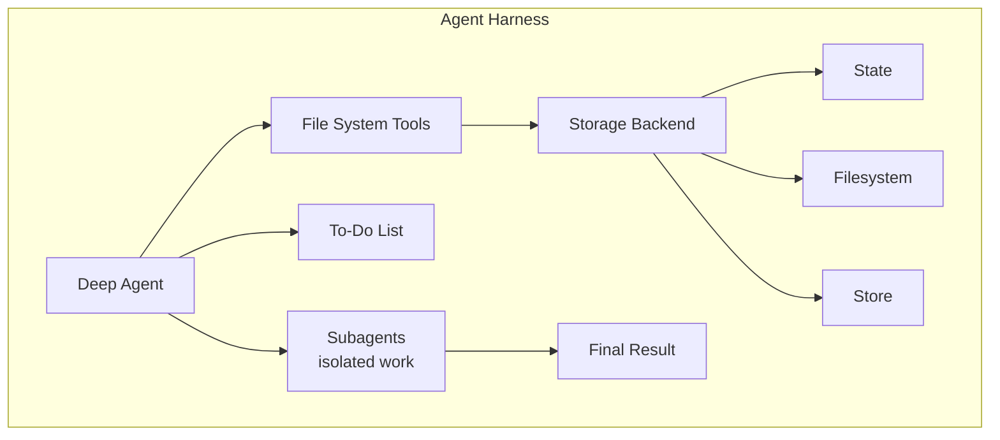
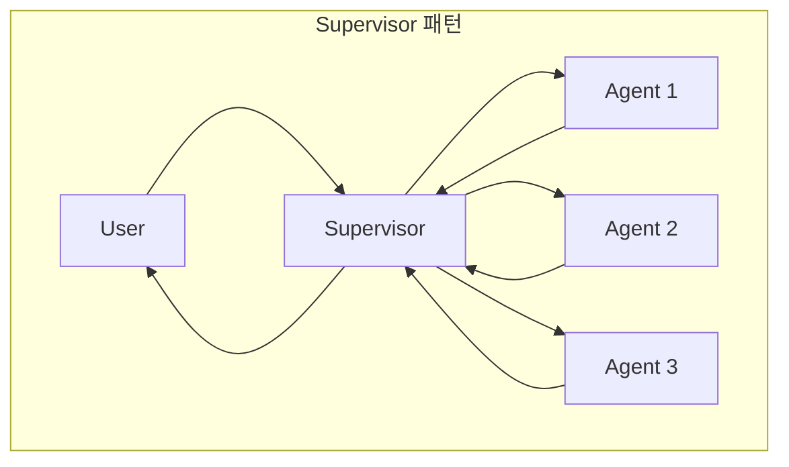
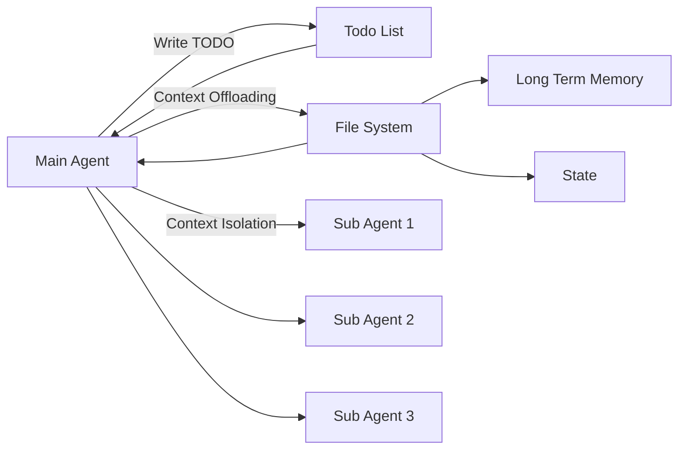
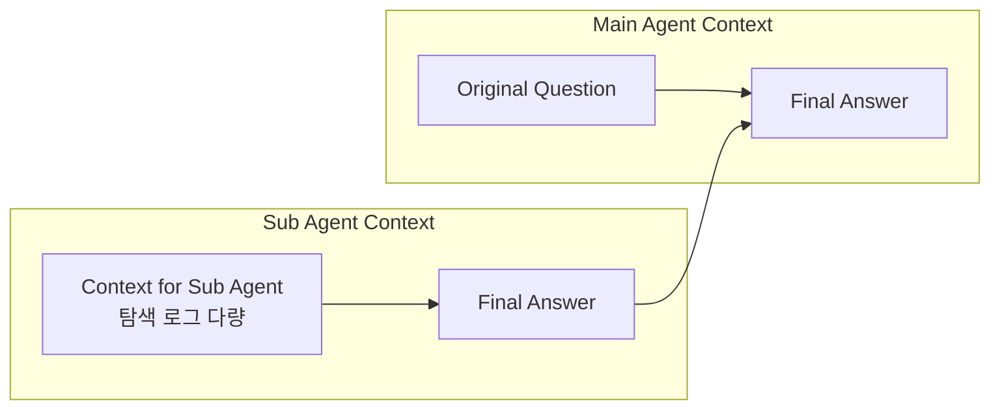
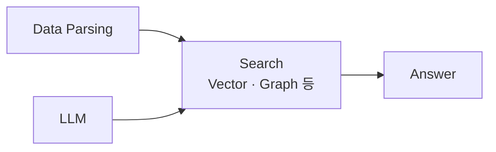
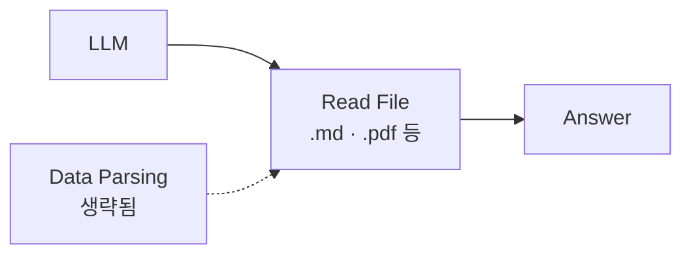
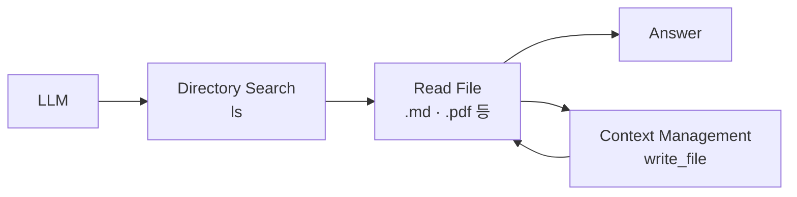

"하네스"라는 이름을 처음 들으면 프레임워크를 하나 더 배워야 하는 이야기로 읽힌다. 그런데 정의를 펼쳐 보면 새로 배울 것이 거의 없다 — **똑같은 도구 호출 루프에 파일시스템과 TODO 관리를 붙인 것**이 전부다. 새로운 것은 부품이 아니라 부품을 놓는 자리다.

이 글은 그 자리 이동이 무엇을 바꾸는지를 따라간다. 상태를 대화에 쌓을 것인가 파일에 쓸 것인가라는 질문 하나가 Supervisor 패턴과의 차이를 만들고, 계획 파일이 곧 설계서가 되게 만들고, 끝내 **RAG를 "반드시 해야 하는 것"에서 "규모에 따라 고르는 것"으로 격하시킨다.** [앞 시리즈의 마지막 편](/blog/ai-agent/build-or-buy-agent-stack/)이 스택 선택의 기본값을 프레임워크로 정리했다면, 이 시리즈는 그 프레임워크 안쪽에서 실행 구조가 어떻게 재편됐는지를 본다.

시리즈는 다섯 편이다. 이 글이 구조를 세우고, [왜 지금인가](/blog/ai-agent/why-agents-now/)가 거시 지표와 표준화의 인센티브를 보고, [조직 적용 편](/blog/ai-agent/enterprise-ai-adoption-actions/)이 역할 재정의와 실행 프레임워크로 내려간 뒤, [다섯 구성물 편](/blog/ai-agent/harness-five-primitives/)이 실제로 만드는 방법을, [마지막 편](/blog/ai-agent/self-evolving-seed-and-fork/)이 자기진화와 조직 확산을 다룬다.

> 이 글은 **2026년 1월 자료를 정리한 것**이다. 언급되는 제품 상태·화면·수치는 그 시점의 것이고, 등장하는 사례와 지표는 모두 원 자료의 것이다.

## 용어 정리

이 시리즈가 공통으로 쓰는 용어 중, 이 글에서 실제로 등장하는 행만 추렸다.

| 용어 | 원어 / 표기 | 뜻 |
|---|---|---|
| Agent Harness | Agent Harness | 모델을 감싸서 **장기 실행(long-running) 작업을 신뢰성 있게 관리하는 시스템**. 프레임워크가 아니라 운영 껍데기 |
| 하네스 표준 아키텍처 | — | FileSystem + TODO 관리를 내장한 에이전트 루프 구조 |
| Context Offloading | Context Offloading | 컨텍스트를 파일로 **써낸 뒤(write) 컨텍스트를 비우는** 기법 |
| Context Isolation | Context Isolation | 서브에이전트에 별도 컨텍스트 창을 주고 **최종 답변만** 메인으로 돌려받는 기법 |
| deepagents | — | LangChain·LangGraph 진영의 에이전트 하네스 구현체 |
| SKILL | — | `SKILL.md`로 패키징돼 메인 에이전트 컨텍스트에 자동 주입되는 전문성 |
| SubAgent | Sub Agent | 자체 컨텍스트 창을 가진 독립 작업자. 결과만 보고한다 |
| 동적 지식 검색 | — | Vector DB 사전 구축 없이 **필요할 때 파일을 읽는** 방식 |
| RAG | Retrieval-Augmented Generation | 검색으로 증강된 생성. 2026년 시점에는 "선택지 중 하나"로 위상이 바뀐다 |
| Headroom | — | 도구 출력을 압축해 토큰을 줄이는 컨텍스트 최적화 도구 |
| Supervisor | Supervisor | 지시를 받아 적합한 에이전트에 작업을 할당하고 결과를 회수하는 조정자. 정의와 상태 공유 방식은 [멀티에이전트 확장 편](/blog/rag/langgraph-parallel-multiagent/)이 정본이다 |
| Orchestrator / Maker / Builder | — | 재정의된 세 역할. [조직 적용 편](/blog/ai-agent/enterprise-ai-adoption-actions/)에서 상술한다 |

마지막 행은 원 자료의 용어표가 잘못된 절을 가리키고 있던 것을 바로잡은 것이다. 세 역할의 정의는 이 글이 아니라 조직 적용 편에 있다.

## 이 글이 밟는 순서

원 자료는 열 구간으로 나뉘어 있고, 그중 실행 구조를 다루는 여섯 구간이 이 글의 범위다.

| 구간 | 주제 | 논지 |
|---|---|---|
| B | Agent Harness 정의 | Supervisor 패턴과 무엇이 다른가 → 컨텍스트 관리 |
| C | deepagents 구조 | Planning / Context Offloading / Context Isolation |
| D | 실제 화면으로 검증 | 컨텍스트 38% → 0% 확인 |
| E | SubAgent vs SKILL | 설계 선택이 성능을 좌우한다 |
| G | 현업 도입 | RAG 사전 구축 vs 동적 지식 검색 |
| H | 부가 도구 | 도구 출력 압축 |

여섯 구간이 하나의 논증이다. 정의(B)에서 출발해 구현(C)을 보고, 실측(D)으로 확인한 뒤, 설계 선택(E)과 도입 판단(G)으로 내려간다.

## 하네스는 Supervisor와 무엇이 다른가

먼저 원문 정의부터다. deepagents 공식 문서는 자신을 이렇게 소개한다.

> deepagents를 "에이전트 하네스"로 간주합니다. 이는 다른 에이전트 프레임워크와 **동일한 핵심 도구 호출 루프**이지만, 내장된 도구와 기능을 갖추고 있습니다.
>
> 정의에서 눈에 띄는 것은 "동일한"이라는 단어다. 새 루프를 발명했다고 말하지 않는다. 그래서 "무엇이 새로운가"라는 질문은 "무엇이 내장됐는가"로 옮겨야 하고, 그 답이 아래 두 도식의 차이다.





Supervisor 자체의 정의와 상태 공유 방식은 [멀티에이전트 확장 편](/blog/rag/langgraph-parallel-multiagent/)에 있고, 여기서는 하네스와 나란히 놓았을 때 드러나는 차이만 본다. 요지는 **상태를 어디에 두는가**다. Supervisor는 라우팅만 하고 상태는 대화 컨텍스트에 쌓인다. 하네스는 File System Tools와 To-Do List라는 **외부 저장소**를 표준으로 내장한다.

| 항목 | Supervisor 패턴 | Agent Harness |
|---|---|---|
| 핵심 동작 | 하위 에이전트 라우팅 | 도구 호출 루프 + 내장 도구 |
| 상태 보관 | 대화 컨텍스트 | FileSystem / TODO / Storage Backend |
| 확장 방향 | 에이전트 수를 늘림 | 컨텍스트 관리 전략을 정교화 |
| 목적 | 역할 분업 | **컨텍스트를 효율적으로 관리** |

**도식은 둘인데 표는 하나다.** 표가 두 도식을 네 축으로 겹쳐 읽은 결과이기 때문이고, 그중 결정적인 것은 두 번째 행이다. 나머지 셋은 두 번째 행에서 따라 나온다 — 상태가 대화에 있으면 확장은 에이전트를 늘리는 방향으로만 가고, 상태가 파일에 있으면 확장은 무엇을 언제 읽고 비울지의 문제가 된다.

하네스 표준 아키텍처의 구성요소는 딱 둘, **FileSystem과 TODO 관리**다. 그리고 그 둘이 존재하는 이유는 한 문장으로 정리된다.

> 컨텍스트를 파일로 "작성"한 뒤 컨텍스트를 비운다. 사실상 컨텍스트가 모두 유용한 정보로만 이루어지지는 않기 때문이다.
>
> 이 문장이 하네스 논의 전체의 전제다. 컨텍스트를 "많이 넣을수록 좋은 자원"으로 보면 파일로 밀어낼 이유가 없다. **오염될 수 있는 자원**으로 보는 순간 비우기가 설계 대상이 된다. 뒤에 나오는 SubAgent 선택도, 도구 출력 압축도 전부 이 전제 위에 있다.

## deepagents가 그 둘을 구현한 방식



**Planning**은 `write_todos` / `read_todos` 도구로 구조화된 작업 목록을 관리하게 하는 것이다. 흐름은 세 단계다 — 복잡한 작업의 처리 순서를 TODO로 작성하고, 그 TODO를 도구로 파일에 쓰고, 순차 수행하며 목록을 갱신한다. 계획이 대화에 떠 있지 않고 파일에 앉는다는 것이 요점이다.

**Context Offloading**은 "파일 목록 확인"과 "부분 읽기"의 조합이다.

| 단계 | 화면 표현 |
|---|---|
| 1. 목록 확인 | 파일 목록(`ls`) → `MCP.txt` / `Agent.txt` / `Tools.txt` |
| 2. 대상 선택 | `MCP.txt` 선택 |
| 3. 부분 읽기 | `start=0`, `offset=200` |
| 4. 결과 | MCP 정의(0~200행) / MCP 동작 원리(200~400) / MCP 예제 코드(400~600) |

네 단계의 핵심은 3번이다. 파일 전체를 통째로 컨텍스트에 넣지 않고 **오프셋 단위로 잘라 읽는다.** "필요한 만큼만 읽기"가 비유가 아니라 인자 두 개로 구현돼 있다는 뜻이다.

**Context Isolation**은 탐색 흔적을 서브에이전트 쪽에 남기고 메인에는 결론만 돌려주는 방식이다.



메인 에이전트 컨텍스트에는 `Original Question`과 `Final Answer` 둘만 남는다. 서브에이전트를 쓰는 이유가 병렬성보다 먼저 **격리**에 있다는 것이 이 도식의 주장이다.

> 이 구현체의 소스와 예제는 공개 저장소로 배포돼 있지만, 여기서 옮길 것은 저장소 주소가 아니라 세 기법의 관계다.
>
> Planning은 무엇을 할지를 파일에 두고, Offloading은 자료를 파일에 두고, Isolation은 탐색 과정을 다른 창에 둔다. **세 기법이 전부 "메인 컨텍스트에서 무언가를 빼는" 동작이다.** 하네스가 늘리는 것은 기능이 아니라 빼는 경로의 수다.

## 컨텍스트 38%가 0%가 되는 장면

이 구간이 1월 자료에서 가장 실용적인 부분이다. 이론을 설명하고 끝내지 않고 화면으로 증거를 제시하기 때문이다.

| 관찰 | 의미 |
|---|---|
| 지속적으로 계획 파일을 업데이트하는 것이 확인됨 | 계획이 대화가 아니라 파일에 산다 |
| `~/.claude/plans`에 `.md` 파일로 적재 | 컨텍스트가 아니라 디스크가 단일 진실 공급원 |
| 이 파일을 조회 가능하고 임의 수정도 가능 (그냥 `.md`이므로) | 사람이 개입할 수 있는 지점 |
| `.md`를 열면 파일 참조가 확인됨 (요약 → 압축) | 원문이 아니라 참조를 적재 |
| 계획을 "승인"하면 컨텍스트가 비워지고 계획 파일을 참조해 작업 | 승인 = 컨텍스트 리셋 트리거 |
| 계획 단계에서 38%였던 컨텍스트가 작업 시작 후 **0%에서 시작** | Offloading의 정량 증거 |
| 그럼에도 컨텍스트는 다시 빠르게 차오름 | 만능이 아님 |
| 원인 = 수정 작업 중 다시 읽어오는 과정 (계획 파일 읽기·갱신, 수정 대상 파일 읽기) | 읽기 비용은 사라지지 않음 |
| 보완책 = **SubAgent 활용**으로 메인 컨텍스트를 천천히 차오르게 | 장기 실행의 해법 |

아홉 행 중 앞 다섯이 "무엇이 관찰됐나"이고 뒤 넷이 "그래서 무엇이 남았나"다. **38% → 0%는 이 표의 절반일 뿐**이고, 바로 다음 줄의 "다시 빠르게 차오른다"가 나머지 절반이다. 두 줄이 떨어지면 Offloading이 만능처럼 읽힌다.

계획 파일의 실물 구조는 이런 형태였다.

```markdown
# HTTP Tool Edit Dialog - Implementation Plan

## Problem
When clicking the edit button for an HTTP tool in the tools page, the dialog shows
empty fields instead of the existing tool's configuration (name, description, URL,
method, parameters, auth).

## Solution Overview
Modify `HttpToolDialog` to support both **create** and **edit** modes by:
1. Adding an optional `existingTool` prop
2. Pre-populating form fields with existing tool data when editing
3. Calling `updateTool` API instead of `createTool` when in edit mode

## Files to Modify
### 1. `src/components/tools/dialogs/HttpToolDialog.tsx`
- Add `existingTool?: ToolInfo` prop to interface
- Add `mode: 'create' | 'edit'` derived from existingTool presence
- Add `useEffect` to populate form state from existingTool
- Modify submit handler to call `updateTool` when editing
- Change dialog title/button text based on mode
```

> **이 계획 파일이 중요한 이유는 문서의 수준에 있다.** 문제 정의 → 해결 개요 → 수정할 파일 목록과 파일별 변경 항목까지 내려온다. 사람이 읽어도 리뷰가 가능한 설계 문서다.
>
> 그러면 "AI에게 시키기 위한 문서"와 "팀이 리뷰하는 설계서"가 같은 물건이 된다. 조직 관점에서 이것이 갖는 함의는 도구 도입이 아니라 **문서 이중 관리의 소멸**이다. 설계서를 따로 쓰고 지시문을 따로 쓰던 관행이 사라지는 대신, 계획 파일의 품질이 곧 결과물의 품질이 된다.

발표 화면의 상태줄에는 세션 누적 지표가 그대로 노출돼 있었다.

| 지표 | 값 |
|---|---|
| 5시간 창 사용률 | 3% (0h5m) |
| 주간 사용률 | 11% (5d16h) |
| 세션 길이 | 31m |
| 세션 비용 | ~$0.1259 |
| 토큰 | 75.2k |
| 캐시 적중률 | 99.0% |
| 컨텍스트 | 38% |
| 활성 에이전트 | 1 |

여덟 지표 중 실제로 관리 대상이 되는 것은 캐시 적중률과 컨텍스트 비율 둘이다. 나머지 여섯은 결과값이라 직접 누르는 손잡이가 없다.

## SKILL과 SubAgent — 확장이냐 분리냐

원 자료의 구분 설명을 그대로 옮긴다.

> **SKILL은 자동 호출되는 전문성**이다. 관련성이 있을 때 모델이 자동으로 호출하는 `SKILL.md` 파일에 패키징된 기능이며, "데이터베이스 마이그레이션" 스킬을 만들어 두면 "이 스키마 마이그레이션 도와줘"라는 요청에서 명시적 호출 없이 사용된다. 용도는 컨텍스트 간에 자동 적용되기를 원하는 재사용 가능한 워크플로우다.
>
> **SubAgent는 독립된 전문가**다. 자체 컨텍스트 창을 가진 별도의 어시스턴트로, 메인 대화를 유지한 채 독립적으로 전문 작업을 처리한 뒤 결과를 보고한다. 별도의 작업 공간이 필요한 복잡한 작업 — 코드 검토, 데이터 분석, 디버깅 — 이 대상이다.

| 축 | SKILL | SubAgent |
|---|---|---|
| 컨텍스트 | 메인 컨텍스트에 주입 | 별도 컨텍스트 창 |
| 호출 방식 | 관련성 감지 시 자동 | 위임(Agent 도구) |
| 해결하는 문제 | 기능 확장 | 작업 분리 |
| 대표 용도 | 재사용 워크플로우 | 코드 검토·데이터 분석·디버깅 |
| 병렬성 | 없음 | 있음 (탐색 속도 향상) |

다섯 축 중 세 번째가 나머지를 결정한다. **스킬은 기능을 확장하고, 서브에이전트는 작업을 분리한다** — 이 한 줄이 나머지 네 행의 이유다. 확장이 목적이면 메인 컨텍스트에 있어야 하고, 분리가 목적이면 있어서는 안 된다.

> 그래서 이 선택은 취향이 아니라 성능 문제다. **하네스를 어떻게 설계하느냐가 성능에 크게 영향을 미치고**, "스킬로 만들 것인가 서브에이전트로 만들 것인가"는 결국 컨텍스트 관리 문제로 환원된다.
>
> 조직 자산 관점으로 옮기면 판단 기준이 하나 생긴다. 사내 반복 워크플로우를 목록화한 뒤, **자동으로 항상 적용되기를 바라는 것은 SKILL, 독립 산출물을 내는 것은 SubAgent**로 분류하면 된다. 둘을 뒤집으면 늘 켜져 있어야 할 것이 호출되지 않거나, 격리돼야 할 탐색이 메인 컨텍스트를 오염시킨다.

## 현업 도입 — RAG의 위상이 바뀐다

이 구간이 1월 자료에서 인용 가치가 가장 높다. 기법 하나가 추가된 것이 아니라 **기존 기법의 지위가 바뀌기** 때문이다.

**기존 RAG**는 데이터 파싱 → 전처리 → Vector DB 구성이라는 사전 작업을 요구한다.



**하네스 구조에서의 RAG**는 데이터 파싱이 빠지고, 필요에 따라 읽는 방식이 된다.



**비효율은 디렉터리 탐색과 계획 단계로 보완**한다.



세 도식이 한 축을 따라 움직인다. 첫 도식에서 사라진 `Data Parsing`이 두 번째에서 점선으로 남고, 세 번째에서 그 빈자리를 `Directory Search`가 메운다. **파싱 비용을 없앤 대가가 탐색 비용이라는 것**이 세 장을 나란히 놓아야 보이는 부분이다.

그리고 자료는 둘 중 하나가 이긴다고 말하지 않는다. **규모로 나눈다.**

| 축 | RAG 사전 구축 (엔터프라이즈 규모) | 동적 지식 검색 (개인 규모) |
|---|---|---|
| 대상 | 대규모 파일에 대한 검색 | 소규모 파일에 대한 검색 |
| 속도·전처리 | 빠른 검색, 고급 전처리 필요(도면·표·다이어그램 등) | 낮은 구축 비용, 즉각 적용 |
| 갱신 | 빈번한 파일 업데이트에 제한적 | 개인화된 구성, 편리한 사용성 |

**도식은 셋인데 표는 두 열이다.** 도식은 동적 검색 쪽의 내부 구조만 그렸고, 표는 그 구조를 사전 구축 방식과 나란히 세워 어느 조건에서 무엇을 고를지를 말한다. 도식만 보면 "파싱이 필요 없어졌다"로 읽히지만, 표의 두 번째 행이 그것을 조건부로 되돌린다 — 도면·표·다이어그램이 있으면 고급 전처리는 여전히 필요하다.

### 프로젝트 단위 지식 저장소

적용 대상으로 제시된 것은 셋이다 — 회의 중 나온 아이디어 토론의 맥락, 프로젝트 히스토리 추적, 진행 중 잦은 수정사항. 방법론은 두 줄뿐이다.

- `.md` 파일로 **일자별로 정리**해 데이터를 추가한다
- **디렉터리 파일**을 만들어 어떤 `.md`를 참조할지 관리한다

> **리더에게 주는 함의는 착수 비용이다.** 회의록과 의사결정 로그를 Vector DB에 넣을지 고민하기 전에, 날짜별 `.md`와 인덱스 파일부터 만들면 그날부터 에이전트가 읽는다.
>
> 이 방식이 값을 하는 이유는 성능이 아니라 **의사결정을 미룰 수 있게 해 준다**는 데 있다. 임베딩 모델 선정, 청크 크기, 리랭커 도입 같은 결정을 전부 뒤로 미룬 채 자산 축적을 시작할 수 있고, 규모가 커져 사전 구축이 필요해지는 시점에는 이미 정제된 `.md` 코퍼스가 입력으로 존재한다. 착수 비용이 0이면서 나중 작업의 사전 준비까지 겸한다.

## 도구 출력 압축 — 토큰은 줄고 지연은 그대로

컨텍스트를 비우는 또 다른 경로는 애초에 적게 채우는 것이다. 도구 출력을 압축하는 파이프라인의 실측이다.

| 항목 | Baseline | 압축 적용 |
|---|---|---|
| API로 보낸 토큰 | 15,662 | 6,100 |
| API 요청 수 | 2 | 2 |
| 도구 호출 수 | 4 | 4 |
| 소요 시간 | 26.5s | 27.0s |

> **네 행 중 값이 달라진 것은 첫 행 하나뿐이다.** 토큰이 76.3% 줄었는데 요청 수·호출 수·소요 시간은 사실상 동일하다.
>
> 이것이 중요한 이유는 트레이드오프가 없다는 데 있다. 대부분의 최적화는 무언가를 내주고 무언가를 얻지만, 여기서는 압축이 지연을 늘리지 않고 비용만 줄인다. 조직 단위로 곱하면 재무에 설명 가능한 숫자가 되고, "AI 비용은 모델 단가 문제"라는 인식을 엔지니어링 문제로 되돌린다.

파이프라인 구성은 캐시 정렬(동적 토큰 안정화) → 중복 도구 출력 제거 → 점수 기반 토큰 피팅 → LLM 제공자 순이고, 압축-캐시-복원 도구가 원문을 보관하다가 필요할 때 전체 컨텍스트를 되살린다. 같은 원리가 스킬에도 적용된다 — 시스템 프롬프트에는 **스킬 설명만** 올리고, 스킬 본문과 스크립트·참조는 필요할 때 불러온다. **스킬 자체가 Context Offloading의 단위**라는 뜻이다.

## 조직에 옮기면 무엇이 되는가

| 주장 | 조직에 미치는 함의 | 첫 90일에 할 일 |
|---|---|---|
| 하네스 = 도구 호출 루프 + FileSystem/TODO | 새 프레임워크 도입 논쟁이 필요 없다. **파일 규약**만 정하면 시작된다 | 30일: 저장소마다 `plans/`·`docs/decisions/` 디렉터리와 파일 네이밍 규약 확정 |
| 컨텍스트를 파일로 쓰고 비운다 | 긴 작업의 실패 원인이 "모델 성능"이 아니라 **컨텍스트 오염**임을 팀에 설명 가능 | 30일: 장기 작업은 계획 파일 승인 후 착수하는 절차를 코드리뷰 규칙에 편입 |
| 계획 파일이 곧 설계서 | 지시문과 리뷰 문서를 **하나로 통합** → 문서 이중 관리 소멸 | 60일: 계획 파일 템플릿(문제/해결/수정 파일) 표준화, PR 첨부 의무화 |
| 컨텍스트는 다시 빠르게 찬다 | "한 번 비웠으니 끝"이 아니다. 읽기 비용을 구조로 흡수해야 함 | 60일: 탐색·검증형 작업을 SubAgent로 분리, 메인 세션은 판단만 담당 |
| SKILL은 확장, SubAgent는 분리 | 조직 자산을 **둘 중 무엇으로 만들지** 결정하는 기준이 생김 | 60일: 사내 반복 워크플로우 목록화 → 자동 적용 대상은 SKILL, 독립 산출물은 SubAgent |
| RAG 사전 구축 vs 동적 지식 검색 | 모든 지식을 벡터화할 필요가 없다. **규모로 분기**한다 | 30일: 지식 자산을 규모·갱신빈도로 2분류, 소규모·고빈도는 `.md` + 인덱스로 즉시 전환 |
| 프로젝트 지식 = 날짜별 `.md` + 디렉터리 파일 | 회의록·의사결정 기록이 그대로 검색 자산이 됨 | 30일: 회의록 포맷을 `.md` 일자별로 통일, 인덱스 파일 1개 신설 |
| 도구 출력 압축: 토큰 76% 절감, 지연 동일 | AI 비용을 **엔지니어링으로** 줄일 수 있음을 재무에 설명 가능 | 90일: 토큰 사용량 계측 → 도구 출력 압축 적용 → 절감액 리포트 |
| 커뮤니티 하네스 배포판이 이미 존재 | 사내 표준을 백지에서 만들 필요 없음. fork에서 시작 | 90일: 배포판 1종 파일럿 → 우리 규약만 덧씌운 사내 프로파일 확정 |

세 번째 열을 세로로 읽으면 30일 항목이 다섯, 60일이 셋, 90일이 셋이다. **30일 항목 다섯이 전부 "규약을 정한다"에 속하고 도구 도입이 하나도 없다**는 것이 이 표의 실제 메시지다. 하네스를 도입한다는 말은 무언가를 설치한다는 뜻이 아니라 파일을 어디에 어떤 이름으로 둘지 합의한다는 뜻이다.

---

여기까지가 구조다. 컨텍스트를 파일로 밀어내고, 필요할 때 오프셋 단위로 읽고, 탐색은 격리하고, 계획은 승인 지점으로 삼는다.

그런데 이 구조가 왜 하필 2026년에 표준이 됐는지는 아직 설명되지 않았다. 기술적 필요만으로는 채택 속도가 설명되지 않고, 실제로 이 시기의 자료들은 기술이 아니라 **채택 곡선과 생산성 지표**에서 논증을 시작한다. [다음 편](/blog/ai-agent/why-agents-now/)에서 플랫폼 시프트마다 절반으로 줄어든 침투 기간, 15년째 정체된 1인당 생산성, 그리고 도구 개발이라는 병목을 표준화가 푼 인센티브 구조를 본다.
