"에이전트 아키텍처"라는 이름 아래 묶여 있는 것들의 자율성 수준이 실제로는 **"없음"에서 "매우 높음"까지 걸쳐 있다.** 프롬프트를 두 번 이어 부르는 것도, 화면을 보고 마우스를 움직이는 것도 같은 목차 안에 들어간다. 그래서 "어떤 패턴을 쓰시나요"라는 질문에 이름으로 답하면 정보가 거의 전달되지 않는다.

이 글은 그 목록을 두 축으로 정렬한다. 하나는 **자율성 수준** — 경로 결정권을 코드가 얼마나 쥐고 있는가. 다른 하나는 **대표 실패 모드** — 그 패턴이 무너질 때 어디서부터 무너지는가. 패턴을 고르는 일은 결국 "어느 실패를 감당할 것인가"를 고르는 일이기 때문이다. [앞 편](/blog/ai-agent/agent-vs-workflow/)에서 오류 비용과 가역성으로 자율성의 상한을 그었고, 여기서는 그 상한 아래에 실제로 무엇이 있는지를 편다.

이 글은 **카탈로그**다. 각 패턴을 LangGraph로 실제 조립하는 코드는 [멀티에이전트 패턴 시리즈](/blog/ai-agent/when-to-split-agents/)에 따로 있고, 여기서는 개요·자율성 축·실패 모드까지만 다룬다. 층위를 나눈 이유는 한 글에서 카탈로그와 구현을 같이 하면 열한 개 중 두세 개만 깊어지고 나머지가 목록으로 남기 때문이다.

> 이 글은 **2025년 2월과 4월의 자료를 정리한 것**이다. 언급되는 라이브러리·제품 상태는 그 시점의 것이다.

## 용어 정리

앞 편의 용어표에서 이 글이 쓰는 행만 추리고, 패턴 이름을 더했다.

| 용어 | 원어·표기 | 뜻 |
|---|---|---|
| 도구 호출 | Tool Calling / Function Calling | LLM이 외부 함수·API를 호출하도록 구조화된 출력을 내는 기능 |
| ReAct | Reasoning + Acting | Thought → Action → Observation을 반복해 최종 답에 도달하는 추론 프레임워크 (ICLR 2023) |
| 플래너 | Planner | 최종 목표를 하위 단계(step)로 분해하는 구성 요소 |
| Plan-and-Execute | — | 계획 수립 → 단계 실행 → 재계획(replan) → 최종 보고서로 이어지는 패턴 |
| 리플렉션 | Reflection | 산출물을 스스로 평가·비판해 재생성하는 루프. [Self-RAG의 채점기 설계](/blog/ai-agent/self-rag-grader-design/) 참조 |
| 관련성 검사 | Relevance Check | 검색 결과가 질문에 실제로 답이 되는지 판정하는 게이트. [Agentic RAG 편](/blog/rag/agentic-rag-relevance-check/) 참조 |
| Agentic RAG | — | RAG 파이프라인에 자율 판단(검색 여부·재질의·관련성 판정)을 결합한 구조 |
| 멀티에이전트 | Multi-Agent | 전문성이 다른 복수 에이전트가 협업해 문제를 분산 처리하는 시스템 |
| 핸드오프 | Hand-off | 한 에이전트가 다른 에이전트로 제어권을 넘기는 라우팅 방식 |
| 스웜 | Swarm | 중앙 통제 없이 핸드오프로만 굴러가는 naive 멀티에이전트 구조 |
| 수퍼바이저 | Supervisor | 지시를 받아 적합한 에이전트에 작업을 할당하고 결과를 회수하는 조정자. 정의는 [멀티에이전트 확장 편](/blog/rag/langgraph-parallel-multiagent/) |
| 오케스트레이터–워커 | Orchestrator–Worker | 조정자가 작업을 쪼개 워커에게 위임하는 일반 명칭. Supervisor의 상위 표현 |
| 계층형 팀 | Hierarchical Teams | Supervisor 아래에 다시 팀별 Supervisor를 두는 2단 구조. 구현은 [계층화 편](/blog/ai-agent/hierarchical-team-subgraph/) |
| STORM | Synthesis of Topic Outlines through Retrieval and Multi-perspective Question Asking | 다관점 분석가를 만들어 인터뷰시키고 결과를 리서치 페이퍼로 합성하는 패턴 |
| 컴퓨터 유즈 | Computer Use | 모델이 사람처럼 화면·마우스·키보드를 조작해 앱과 상호작용하는 방식 |

## 에이전트를 다섯 층으로 분해한다

패턴을 세기 전에 무엇이 조립되는지부터 봐야 한다.

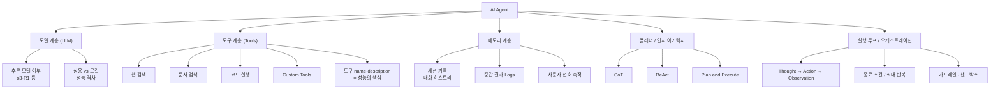

다섯 층 각각이 무너지는 방식이 다르다.

| 요소 | 책임 | 여기가 무너지면 |
|---|---|---|
| 모델 | 판단·계획·도구 선택 | 상용 대비 로컬 모델에서 **성능 저하가 뚜렷**하고 파인튜닝도 어렵다 |
| 도구 | 외부 환경과의 상호작용 | 설명이 모호하면 잘못된 도구를 고름 → 일관성 없는 의사결정 |
| 메모리 | 세션 기록·중간 결과 유지 | 문맥 유실로 같은 작업 반복, 비용 증가 |
| 플래너 | 최종 목표를 단계로 분해 | 잘못된 계획이 하위 전 단계로 전파(복합적 오류) |
| 실행 루프 | 반복·종료·오류 복구 | 무한 루프·비용 폭증 |

**도식은 다섯 층 아래 열여섯 개 리프를 달지만 표는 다섯 행이다.** 도식의 리프는 "무엇이 들어가는가"의 목록이고, 표는 "빠지면 어떻게 되는가"의 목록이다. 두 번째 행이 특히 그렇다 — 도식에서는 `도구 name·description`이 다섯 리프 중 하나로 나란히 놓이지만, 표에서는 그것이 도구 계층 전체의 실패 원인으로 지목된다. 도식은 병렬이고 표는 인과다.

### ReAct — 실행 루프의 표준형

2월판과 4월판이 같은 도식을 쓴다. 출처는 ReAct 논문(ICLR 2023, arXiv 2210.03629)이다.

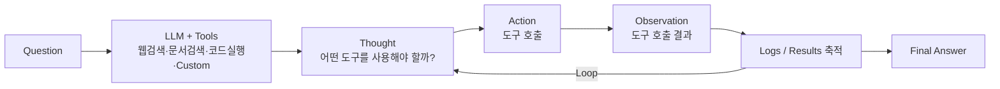

도식에 함께 붙어 있던 Agentic Prompt 작성 원칙 두 가지는 **① Step을 순서대로 명시한다, ② 사용할 도구의 name·description을 최대한 구체적으로 명시한다**로 요약된다. 예시 시스템 프롬프트는 `pdf_search` → `relevance_check` 순으로 단계를 못 박고, 판정이 `no`면 질의를 다시 만들어 재검색하되 **최대 20회**로 반복을 끊는 구조였다.

이 프롬프트의 전문과 네 번에 걸친 개정 이력, 그리고 상한을 문장으로 넣지 않았을 때 실제로 무슨 일이 일어났는지는 [Agentic RAG와 관련성 검증 편](/blog/rag/agentic-rag-relevance-check/)에 개정본 대조까지 정리돼 있다. 여기서 옮길 것은 결론 한 줄뿐이다 — **루프가 있는 프롬프트에는 종료 조건을 문장으로 박는다.**

### 구현은 생각보다 단순하다

> 에이전트는 정교한 작업을 처리할 수 있지만 **구현은 간단한 경우가 많다.** 일반적으로 환경 피드백에 기반한 도구를 반복적으로 사용하는 LLM에 불과하다.
>
> 같은 취지가 Anthropic 「Building Effective Agents」(2024.12.20) 서두에도 있다. 지난 1년간 여러 산업의 수십 개 팀과 LLM 에이전트를 구축해 본 결과 **가장 성공적인 구현들은 복잡한 프레임워크나 특수 라이브러리를 쓰지 않았고**, 단순하고 조합 가능한(composable) 패턴으로 만들어졌다는 것이다.

이 문장이 아래 카탈로그를 읽는 방식을 바꾼다. 열한 개 패턴은 서로 배타적인 제품이 아니라 조합 단위이고, 프레임워크 선택보다 **도구 설계와 종료 조건**이 성패를 가른다.

## 패턴 카탈로그 11종

| # | 패턴 | 자율성 | 적합 상황 | 대표 실패 모드 |
|---|---|---|---|---|
| 1 | 프롬프트 체이닝 | 없음 | 고정 단계 분해 가능 | 예외 케이스 미처리 |
| 2 | 게이트·라우팅 | 낮음 | 조건 분기가 유한 | 게이트 기준 모호 시 오분기 |
| 3 | 자율 에이전트 루프 | 높음 | 개방형 문제 | 무한 루프·비용 폭증 |
| 4 | Agentic RAG | 중간 | 검색 품질이 답변 품질을 좌우 | 재질의 반복으로 지연 증가 |
| 5 | Swarm(핸드오프) | 중간 | 에이전트 2~3개 소규모 | 에이전트 수 증가 시 라우팅 폭발 |
| 6 | Supervisor | 중간 | 역할이 명확히 나뉜 다수 에이전트 | Supervisor 병목·단일 실패점 |
| 7 | 계층형 팀 | 중간 | 팀 단위로 묶이는 대형 작업 | 계층 간 컨텍스트 유실 |
| 8 | Plan-and-Execute | 높음 | 장문 보고서·다단계 리서치 | 초기 계획 오류의 전파 |
| 9 | STORM Research | 높음 | 다관점 리서치 산출물 | 관점 중복·수렴 실패 |
| 10 | Debate / 시뮬레이션 | 높음 | 찬반 논증·의사결정 지원 | 종료 조건 없으면 발산 |
| 11 | 컴퓨터 유즈 | 매우 높음 | UI만 있고 API가 없는 시스템 | 화면 변화에 취약, 오류 비용 큼 |

자율성 열을 세로로 읽으면 분포가 보인다. **"중간"이 넷으로 가장 많고 그 넷이 전부 멀티에이전트 계열이다.** 여러 에이전트를 쓴다는 것이 곧 자율성을 높이는 것은 아니라는 뜻이다 — 쪼개는 순간 라우팅이 명시적으로 드러나서 오히려 통제가 늘어나는 경우가 많다.

### 1. 프롬프트 체이닝 — 자율성 없음

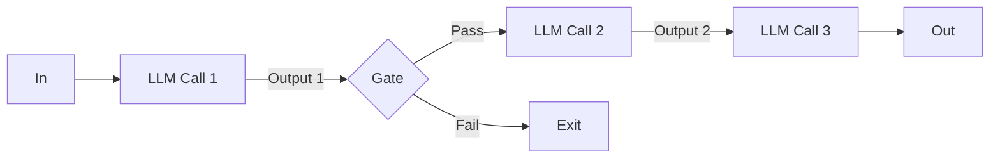

적합한 곳은 마케팅 문구 생성 → 번역, 개요 작성 → 기준 충족 확인 → 세부 작성 → 결합처럼 순서가 요구사항에 이미 적혀 있는 작업이다.

실패는 `Gate` 한 곳에서 난다. 통과 기준이 모호하면 전부 `Fail`로 빠지거나, 반대로 저품질 산출물이 그대로 통과한다. **게이트가 있다는 것과 게이트가 판정한다는 것은 다르다.**

### 2. 조건 분기 워크플로 — 자율성 낮음

경로가 코드에 그려져 있는 그래프 세 종이다. 첫 번째는 선형에 가깝다.

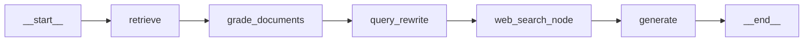

두 번째는 관련성 판정에서 되돌아오는 엣지와 할루시네이션 재생성 루프를 갖는다. Agentic RAG의 원형이다.

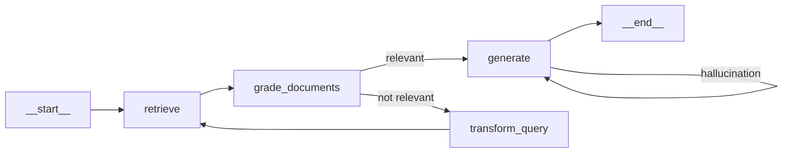

세 번째는 도구 실행 앞에 사람이 끊고 들어오는 지점을 그래프에 명시한 형태다. `human` 노드에 `__interrupt__ = before`가 붙어 있다.

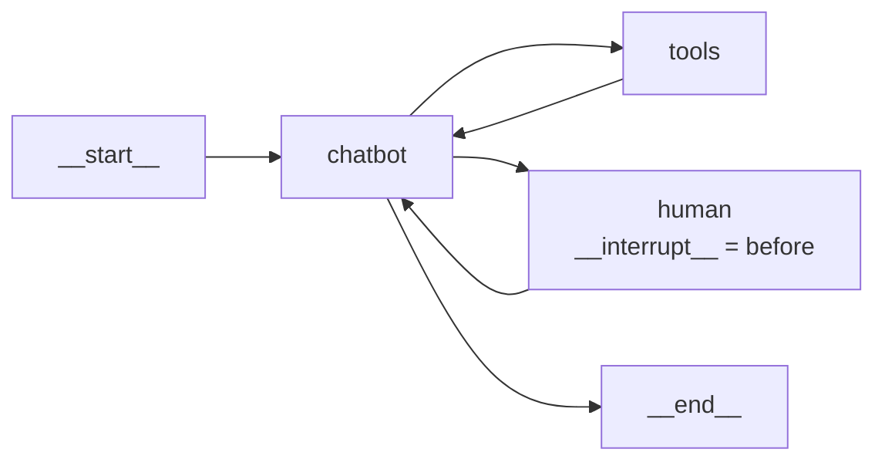

> **세 그래프 모두 자율성이 "낮음"으로 분류되는 이유는 분기 조건이 코드에 있기 때문이다.**
>
> 두 번째 그래프에는 루프가 둘이나 있고 LLM이 관련성을 판정하지만, 판정 결과를 어느 노드로 보낼지는 조건부 엣지가 정한다. 판정을 LLM이 하는 것과 라우팅을 LLM이 하는 것은 다른 층위다. 이 구분이 흐려지면 "LLM이 판단하니까 에이전트"라는 잘못된 분류가 나온다.

### 3. 자율 에이전트 루프 — 자율성 높음

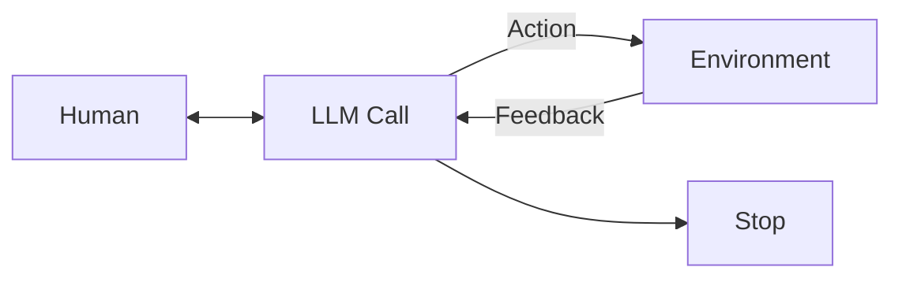

적합한 곳은 단계 수를 예측할 수 없는 개방형 문제다. 필수 설계는 최대 반복 횟수, 비용 상한, 샌드박스, 중단 조건 넷이고, 이 넷이 없으면 앞 편이 경고한 "더 높은 비용과 복합적 오류"가 그대로 발생한다.

### 4. Agentic RAG — 자율성 중간

| 특성 | 내용 |
|---|---|
| Autonomous Decision-Making | 작업 완수에 무엇이 필요한지 **스스로 식별**하고, 명시적 지시 없이도 필요한 정보를 능동적으로 수집. 질의에서 누락된 데이터를 감지 가능 |
| Dynamic Information Retrieval | 정적·사전학습 지식에 의존하는 전통 RAG와 달리, API·DB·웹검색 등 다양한 소스에서 **실시간 데이터**에 동적으로 접근 |

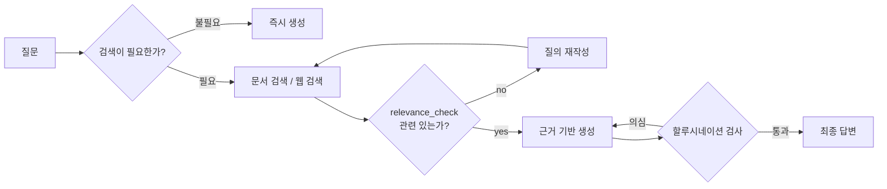

첫 분기가 이 패턴의 정체다. **"검색이 필요한가"를 코드가 아니라 모델이 판정하는 순간** 조건 분기 워크플로에서 넘어온다. 실패 모드는 재질의 루프에 상한이 없을 때 지연과 비용이 선형으로 증가하는 것이고, 그래서 앞의 시스템 프롬프트가 반복 상한을 문장으로 박았다. 이 계열 넷(Self-RAG·CRAG·Adaptive RAG 포함)의 계보는 [판단하는 RAG 4종](/blog/ai-agent/agentic-rag-as-tool/)에 정리돼 있다.

### 5. Swarm — 핸드오프 기반 naive 멀티에이전트

> LangGraph Swarm은 naive 버전의 멀티에이전트 협업 시스템이다. 에이전트가 각자의 전문성에 따라 서로에게 **동적으로 제어권을 넘기고**, 구축이 쉽다.
>
> 라이브러리 설명에서 눈여겨볼 것은 **마지막으로 활성화된 에이전트를 기억**해 다음 상호작용에서 그 에이전트로 대화를 재개한다는 점이다. 중앙 관리자가 없는 구조에서 "지금 누구 차례인가"를 어딘가에는 적어 둬야 하는데, Swarm은 그것을 상태 한 칸으로 처리한다.

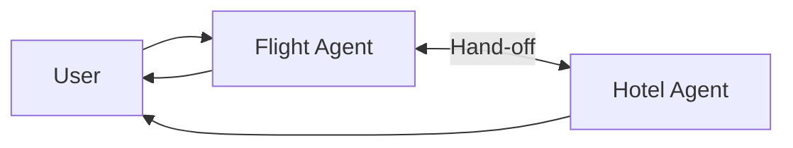

적합한 규모는 에이전트 2~3개다. 그 이상에서 무너지는 이유는 다음 절에 있다.

> 멀티에이전트 협업 시스템에서 에이전트 개수가 늘어남에 따라 **작업 완료 후 NEXT 라우팅이 복잡해지고**, 그 복잡도를 **각 에이전트 프롬프트에 명시**해야 한다.
>
> 즉 에이전트 N개가 서로를 알아야 하므로 라우팅 지식이 각 프롬프트에 중복 기술되고, 하나를 추가할 때마다 전부를 손봐야 한다. 비용이 N에 비례해 늘지 않고 프롬프트 수정 범위가 N개로 퍼진다는 점이 핵심이다 — 코드 중복이 아니라 **프롬프트 중복**이라 정적 분석에 잡히지도 않는다.

### 6. Supervisor — 라우팅 지식을 한 곳에 모은다

> 보다 효율적인 멀티에이전트 컨트롤 방법으로 Supervisor 패턴이 제안된다. Supervisor가 사용자와 상호작용하며 지시를 받고, 적합한 에이전트에게 작업을 할당하며, 에이전트는 완료 후 Supervisor로 라우트한다.
>
> Swarm과 비교하면 달라진 것은 하나뿐이다. **모든 워커가 반드시 Supervisor로 되돌아온다.** 그 되돌아옴이 라우팅 지식의 소재지를 바꾼다 — N개 프롬프트에 흩어져 있던 "다음은 누구인가"가 한 노드로 모인다.

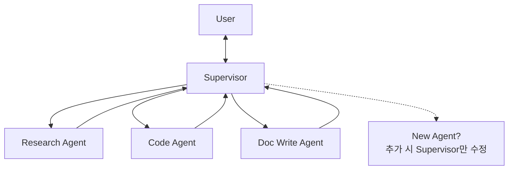

핵심 이점은 점선 노드에 적혀 있다 — 에이전트 추가 시 **N개 프롬프트가 아니라 1개**만 고치면 된다. 실패 모드는 Supervisor가 병목이자 단일 실패점이 되는 것이고, 하위 에이전트 설명이 부실하면 잘못된 할당이 반복된다.

Supervisor의 정의와 상태 공유 방식은 [멀티에이전트 확장 편](/blog/rag/langgraph-parallel-multiagent/)이 정본이다. 이 패턴을 실제 코드로 조립할 때 따라오는 대가 셋 — 끝난 워커 재호출, `FINISH` 미선택으로 인한 핑퐁, 누적 메시지로 인한 라우팅 단가 상승 — 은 [Supervisor 구현과 그 대가](/blog/ai-agent/supervisor-pattern-cost/)에서 코드와 함께 다룬다.

### 7. 계층형 팀 — Supervisor의 재귀 적용

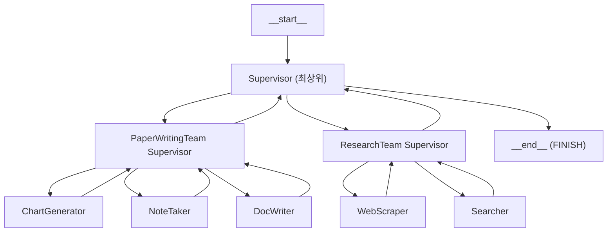

각 말단 에이전트는 다시 `agent → tools → agent`의 자체 ReAct 루프를 가진다.

> **계층형 팀은 별개의 발명이 아니라 Supervisor의 재귀 적용이다.**
>
> 그래서 새로 배울 것이 없는 대신 새로 생기는 문제도 하나뿐이다 — 계층을 지날 때마다 컨텍스트가 요약·유실되어 하위 팀이 상위 의도를 잃는다. 층이 늘어난 만큼 라우팅 LLM 호출도 층수만큼 곱해진다. 팀 State를 어떻게 격리하고 상위와 무엇을 주고받을지는 [계층화 편](/blog/ai-agent/hierarchical-team-subgraph/)에 서브그래프 구현으로 정리돼 있다.

적합한 곳은 리서치 팀과 문서작성 팀처럼 역할군이 명확히 갈리는 대형 작업이다. 팀이 하나뿐이면 과설계다.

### 8. Plan-and-Execute — 계획을 명시적 산출물로 만든다

입력 프롬프트는 공교롭게도 앞 편의 주제와 같다 — *"AI Agent와 워크플로우의 차이에 대해서 설명하고, 각각의 장단점에 대해서 설명하세요"*. `planner` 노드가 만든 계획은 이렇게 출력됐다.

```text
Node: planner
- AI Agent와 워크플로우의 정의를 각각 설명한다.
- AI Agent의 장점을 설명한다.
- AI Agent의 단점을 설명한다.
- 워크플로우의 장점을 설명한다.
- 워크플로우의 단점을 설명한다.
```

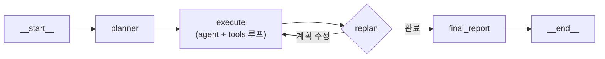

> **`replan` 노드가 이 패턴의 전부다.**
>
> `planner → execute`만 있는 구조는 계획이 틀리면 그대로 끝까지 틀린다. 초기 계획 오류가 하위 전 단계로 전파되는 것이 이 패턴의 대표 실패 모드이고, 그것을 막는 유일한 장치가 중간 교정 지점이다. 계획을 세우는 것이 아니라 **계획을 고칠 수 있게 만드는 것**이 설계의 요점이다.

### 9. STORM Research — 관점을 먼저 만든다

하나의 주제에서 서로 다른 관점을 가진 분석가(Analysts)를 다수 생성하고, 각 분석가가 인터뷰를 수행한 뒤 결과를 하나의 리서치 페이퍼로 합성한다.

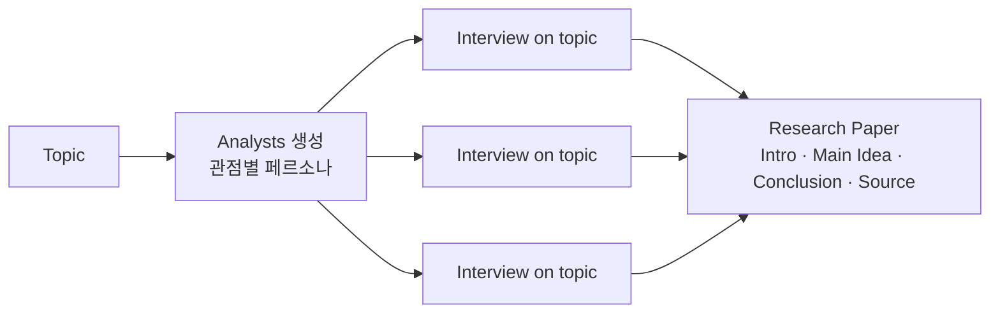

각 분석가는 `Name / Role / Affiliation / Description` 형태의 페르소나를 부여받는다. 실패 모드는 관점이 서로 겹쳐 인터뷰가 중복되는 것이고, 그러면 **비용만 늘고 정보량은 늘지 않는다.** 팬아웃 구조에서 이 문제가 어떻게 나타나는지는 [Send()로 런타임에 갈래를 만드는 편](/blog/ai-agent/send-map-reduce-report/)에 다른 각도로 나온다.

### 10. Debate / 에이전트 시뮬레이션

사람의 텍스트 입력과 해석을 양쪽에서 제거하고, 자율 에이전트 둘이 공용 도구 세트(Wikipedia·arXiv·검색 등)를 놓고 대화하게 만든다.

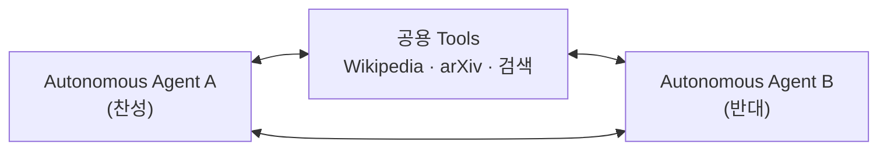

적합한 곳은 의사결정 전 논점 발굴과 반대 논거 사전 점검이다. 실패 모드가 둘인데 방향이 정반대라는 점이 특이하다 — 종료 조건이 없으면 무한 발산하고, **두 에이전트가 같은 모델이면 논점이 수렴해 버린다.** 발산과 수렴이 동시에 위험 요인인 유일한 패턴이다.

### 11. 컴퓨터 유즈 / 브라우저 에이전트

*"Find and book me the highest rated one-day tour of Rome on Tripadvisor"* 요청에 대한 실행 로그다.

```text
Worked for 2 minutes
- Navigating to TripAdvisor website
- Selecting "Things to Do" category
- Searching for historic Rome tours
- Closing pop-up, continuing tour search
- Exploring all historic Rome tour options
- Closing Colosseum tab, resuming tour search
- Exploring options for top-rated tours
- Sorting results by tour ratings
- Exploring filters for top-rated tours
```

아홉 단계 중 둘이 팝업 닫기와 탭 닫기다. 적합한 곳은 API가 없고 UI만 존재하는 레거시·외부 시스템이고, 실패 모드는 화면 구조 변경 취약성·긴 단계로 인한 지연과 비용, 그리고 **오류 비용이 높은 결제 단계를 포함하기 쉽다는 것**이다. 자율성이 가장 높은 패턴이 앞 편의 가역성 질문에 가장 취약하다.

## 실패 모드 종합표

| 실패 모드 | 발생 지점 | 대응 |
|---|---|---|
| 일관성 없는 의사결정 | 도구 선택 | 도구 description 구체화, 라우팅을 워크플로로 고정 |
| 무한 루프 | 실행 루프 | 최대 반복 횟수(예: 20회) 명시 |
| 복합적 오류 | 다단계 실행 | 단계별 근거 데이터 확보·검증 |
| 비용·지연 폭증 | 반복 호출 | 비용 상한, 캐싱, 모델 티어 분리 |
| 라우팅 복잡도 폭발 | 멀티에이전트 | Supervisor 패턴 |
| Supervisor 병목 | 멀티에이전트 | 계층형 팀으로 분할 |
| 로컬 모델 성능 저하 | 모델 | 상용 모델 병행, 판단 노드만 상용 사용 |
| 재현 불가 | 전체 | 실행 로그·트레이싱, 평가셋 고정 |

**이 표 여덟 행과 앞의 카탈로그 열한 행은 겹치는 것이 넷뿐이다.** 카탈로그는 패턴별로 한 줄씩 대표 실패를 적었고 이 표는 발생 지점(도구·루프·모델·멀티에이전트·전체)으로 다시 묶었기 때문에, 축이 다르면 남는 항목도 다르다. 카탈로그에만 있는 것은 게이트 오분기·관점 중복·화면 변화 취약성처럼 **특정 패턴에만 나타나는 실패**이고, 이 표에만 있는 것은 로컬 모델 성능 저하·재현 불가처럼 **패턴과 무관하게 깔리는 실패**다. 어느 한쪽만 보면 일곱 항목이 사라진다.

세 번째 열이 이 표의 실제 값어치인데, 대응 여덟 개 중 셋이 같은 것을 말한다 — 상한을 걸어라(반복·비용·티어). 그리고 그 셋이 전부 자율성 "높음" 패턴에 붙는다.

---

여기까지가 한 조직 안에서 조립할 수 있는 것들이다. 열한 개 패턴 어느 것을 고르든 도구는 내가 만들고, 에이전트는 내 코드 안에 있다.

그런데 도구가 열 개를 넘어가면 다른 종류의 비용이 나타난다. 프레임워크가 M개고 붙일 서비스가 N개면 연동이 M×N개 필요하고, 이 곱셈은 패턴 선택으로 줄일 수 없다. [다음 편](/blog/ai-agent/mcp-a2a-landscape/)에서 그 곱셈을 덧셈으로 바꾸려는 두 표준 — MCP와 A2A — 을 보고, 2025년의 벤치마크·서베이·회의론을 나란히 놓는다.
