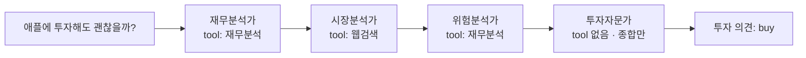

에이전트에 도구를 붙일 때 흔히 하는 일은 기존 함수에 `@tool`을 얹는 것이다. 그러면 대개 두 가지가 함께 일어난다. LLM이 그 툴을 언제 써야 하는지 헷갈려 하고, 반환값이 컨텍스트를 통째로 먹는다.

원인은 같다. **툴 시그니처는 사람이 읽는 API가 아니라 LLM이 읽는 라우팅 인터페이스**인데, 사람용 함수를 그대로 노출했기 때문이다. 이 글은 그 관점에서 CrewAI의 내장 툴과 `@tool` 커스텀 툴을 다루고, 4역할 주식분석 파이프라인으로 마무리한다. [앞 편](/blog/ai-agent/crewai-agent-task-crew/)에서 조립한 Agent·Task·Crew에 이제 손발을 붙이는 단계다.

## 용어 정리

| 약어 / 용어 | 원어 | 뜻 |
|---|---|---|
| Tool | Tool | 에이전트가 호출하는 외부 기능(검색·크롤링·재무조회 등) |
| Custom Tool | Custom Tool | `@tool` 데코레이터로 직접 정의한 사용자 툴 |
| Serper | Serper.dev | Google 검색 결과를 API로 제공하는 서비스. `SERPER_API_KEY` 필요 |
| yfinance | Yahoo Finance API wrapper | 주가·재무제표를 가져오는 파이썬 라이브러리 |
| EBITDA | Earnings Before Interest, Taxes, Depreciation and Amortization | 이자·세금·감가상각 차감 전 영업이익 |
| EPS | Earnings Per Share | 주당순이익 |
| QoQ | Quarter over Quarter | 전분기 대비 증감률 |
| max_iter | — | 에이전트의 도구 호출 루프 상한. CrewAI 기본값은 `25` |

## 내장 툴 — 검색과 스크래핑

```python
from crewai_tools import SerperDevTool, WebsiteSearchTool, ScrapeWebsiteTool

search_tool  = SerperDevTool()      # Google 검색 (SERPER_API_KEY 필요)
web_rag_tool = WebsiteSearchTool()  # 특정 사이트 내부를 RAG로 검색
scrap_tool   = ScrapeWebsiteTool()  # 페이지 본문 스크래핑

researcher = Agent(
    role='테크 트렌드 연구원',
    goal="인공지능 분야의 최신 기술 트렌드를 한국어로 제공합니다. 지금은 2024년 8월입니다.",
    backstory='기술 트렌드에 예리한 안목을 지닌 전문 분석가이자 AI 개발자입니다.',
    tools=[search_tool, web_rag_tool],
    max_iter=5,          # 툴 호출 루프 상한 — 기본 25는 너무 관대하다
    llm=llm, verbose=True
)
write = Task(
    description="연구원의 요약을 바탕으로 테크 뉴스레터를 작성하세요.",
    expected_output='최신 기술 소식을 재밌는 말투로 소개하는 4문단짜리 마크다운 뉴스레터',
    agent=writer,
    output_file='output/new_post.md'   # 결과를 파일로 바로 저장
)
```

| 툴 | 용도 | 외부 의존 |
|---|---|---|
| `SerperDevTool` | 웹 검색 결과(제목·링크·스니펫) 조회 | Serper API 키 |
| `WebsiteSearchTool` | 지정 사이트 내부를 임베딩 기반으로 검색 | 임베딩 모델 |
| `ScrapeWebsiteTool` | 웹페이지 본문 추출 | 없음 |

세 툴은 검색의 세 층위에 대응한다. **밖에서 찾고(Serper), 안에서 찾고(WebsiteSearch), 찾은 것을 읽는다(Scrape).** 어느 하나만 붙이면 "링크는 찾았는데 내용을 모르는" 상태나 "내용은 읽는데 어디를 읽을지 모르는" 상태가 된다.

### `goal`에 오늘 날짜를 박는 이유

위 코드에서 `goal` 끝에 붙은 `"지금은 2024년 8월입니다"`가 장식이 아니다.

> **LLM은 오늘 날짜를 모른다.** `goal`이나 `backstory`에 현재 시각을 직접 주입하지 않으면 학습 시점을 기준으로 "최신"을 판단해 낡은 결과를 낸다. 검색 툴을 붙여 놨는데도 "최신 동향"을 물으면 2년 전 것을 가져오는 현상이 여기서 나온다.

주식분석 사례에서는 이 패턴을 아예 자동화해서, `datetime.now()`를 읽어 모든 에이전트의 `backstory`에 날짜를 심는다. **시간에 의존하는 태스크에서는 선택이 아니라 필수 패턴이다.**

## Custom Tool — `@tool` 데코레이터

```python
from crewai_tools import tool
import yfinance as yf

# 형태 1) 함수명이 곧 툴 이름
@tool
def latest_stock_price(ticker):
    """
    주어진 주식 티커에 대한 최근 종가를 가져오는 툴
    """                                    # ← docstring이 LLM에게 보이는 사용설명서
    historical = yf.Ticker(ticker).history(period='5d', interval='1d')
    return historical['Close']

# 형태 2) 툴 이름을 명시 + 타입 힌트로 인자 스키마 확정
@tool("Updated Comprehensive Stock Analysis")
def comprehensive_stock_analysis(ticker: str) -> str:
    """
    주어진 주식 티커에 대한 종합적인 재무 분석을 수행합니다.
    최신 주가 정보, 재무 지표, 성장률, 밸류에이션 및 주요 비율을 제공합니다.

    :param ticker: 분석할 주식의 티커 심볼
    :return: 재무 분석 결과를 포함한 문자열
    """
    # 본문은 아래 "반환값을 압축한다" 절에서 이어서 다룬다.
    # yfinance 원본 → LLM이 읽기 좋은 dict로 정제하는 부분이 전부다.
    ...

latest_stock_price.run("AAPL")   # 단독 테스트 — 툴은 크루 없이도 검증 가능
```

두 형태의 차이는 이름과 스키마를 어디서 얻느냐다. 형태 1은 함수명과 docstring에서 전부 가져오고, 형태 2는 이름을 명시하고 타입 힌트로 인자 스키마를 확정한다.

| 설계 지점 | 왜 중요한가 |
|---|---|
| **docstring** | LLM이 "이 툴을 언제 쓸지" 판단하는 유일한 근거. 스펙 문서가 아니라 **라우팅 신호** |
| **타입 힌트** (`ticker: str`) | function calling 스키마를 만든다. 없으면 LLM이 인자 형식을 추측 |
| **반환 형식** | LLM이 파싱할 대상. 원본 DataFrame 대신 **키가 한글인 dict**로 정제해서 반환 |
| **단독 실행** (`.run()`) | 에이전트를 붙이기 전에 툴만 따로 검증. 디버깅 비용을 크게 줄임 |

> 네 항목 중 **docstring**이 가장 자주 과소평가된다. 사람에게 docstring은 있으면 좋은 문서지만, 에이전트에게는 그것이 **선택의 근거 전부**다. 도구가 세 개인데 설명이 비슷하면 라우팅이 흔들리고, 그 증상은 "LLM이 멍청하다"로 오진된다.
>
> 그래서 툴 설명을 쓸 때 기준은 "이 함수가 무엇을 하는가"가 아니라 **"다른 툴과 어떻게 구별되는가"**다.

### 반환값을 압축한다 — 툴 설계는 컨텍스트 예산 관리다

`yfinance`가 주는 재무제표는 수백 행짜리 DataFrame이다. 이것을 그대로 반환하면 두 가지가 동시에 나빠진다. 토큰을 태우고, **LLM의 주의력이 흩어진다.**

```python
# 툴 내부: 원본 DataFrame → LLM이 읽기 좋은 압축 dict (핵심부만 발췌)
def format_number(n):
    return "N/A" if (n is None or pd.isna(n)) else f"{n:,.0f}"

def calculate_growth_rate(current, previous):
    if previous and current and previous != 0:
        return (current - previous) / abs(previous) * 100
    return None

t = yf.Ticker(ticker)
annual    = t.get_financials()                    # 연간 손익
quarterly = t.get_financials(freq="quarterly")    # 분기 손익
balance   = t.get_balance_sheet()                 # 재무상태표

revenue = annual.loc['TotalRevenue', annual.columns[0]]
net_income = annual.loc['NetIncome', annual.columns[0]]
total_assets = balance.loc['TotalAssets', balance.columns[0]]
total_liab = balance.loc['TotalLiabilitiesNetMinorityInterest', balance.columns[0]]

return {
    "현재 주가": {"현재 주가": latest_price, "기준 시간": latest_time},
    "연간 데이터": {
        "매출": format_number(revenue),
        "순이익": format_number(net_income),
        "순이익률": f"{net_income / revenue * 100:.2f}%",
        "매출 성장률": f"{calculate_growth_rate(revenue, annual.iloc[:,1]['TotalRevenue']):.2f}%",
        "부채비율": f"{total_liab / total_assets * 100:.2f}%",
    },
    # 분기 데이터도 같은 방식으로 QoQ 성장률까지 계산해 담는다.
    # (연간 블록과 구조가 동일해 생략)
    "분기 데이터": {},
}
```

수백 행이 매출·영업이익·순이익·EBITDA·EPS·마진율·성장률·부채비율만 남은 dict로 줄어든다.

> **툴 설계는 곧 컨텍스트 예산 관리다.** 원본을 통째로 넘기면 토큰만 태우고 LLM의 주의력은 오히려 흩어진다.
>
> 압축의 기준은 "무엇을 빼도 되는가"가 아니라 **"이 툴을 쓰는 에이전트가 어떤 판단을 하는가"**다. 재무 상태를 판정하는 에이전트에게 필요한 것은 원자료가 아니라 비율이다. 비율 계산을 툴 안에서 끝내면 LLM은 계산이 아니라 해석만 하면 된다 — **LLM에게 산수를 시키지 않는 것**이 정확도에도 유리하다.

값을 서식 문자열로 만들어 반환하는 것도 같은 맥락이다. `f"{...:.2f}%"`로 미리 포맷하면 LLM이 소수점 자리를 임의로 바꾸거나 단위를 빠뜨릴 여지가 사라진다.

## 4역할 파이프라인 — 주식분석



| 에이전트 | goal | 툴 | LLM |
|---|---|---|---|
| Financial Analyst | 회사의 재무 상태 및 성과 분석 | `comprehensive_stock_analysis` | gpt-4o-mini |
| Market Analyst | 시장 지위 및 업계 동향 분석 | `SerperDevTool` | gpt-4o-mini |
| Risk Analyst | 잠재적 위험 식별 및 평가 | `comprehensive_stock_analysis` | gpt-4o-mini |
| Investment Advisor | 전체 분석 기반 투자 추천 | **없음** | claude-3-5-sonnet |

```python
llm        = LLM(model="openai/gpt-4o-mini")                       # 조사·분석용 (저렴)
invest_llm = LLM(model="anthropic/claude-3-5-sonnet-20240620")     # 최종 종합용 (고품질)
current_time = datetime.now()

financial_analyst = Agent(
    role="Financial Analyst",
    goal="회사의 재무 상태 및 성과 분석",
    backstory=f"재무제표와 비율 해석에 전문성을 갖춘 분석가입니다. 날짜: {current_time:%Y년 %m월 %d일}",
    tools=[comprehensive_stock_analysis],
    llm=llm, max_iter=3, allow_delegation=False, verbose=True   # 위임 차단 = 비용 통제
)
# market_analyst / risk_analyst / investment_advisor도 같은 형태로 정의한다.
# 차이는 role·goal·tools·llm 네 필드뿐이다.

def create_dynamic_tasks(ticker):        # 티커를 런타임 입력으로 받아 Task를 동적 생성
    financial_analysis = Task(
        description=f"{ticker}에 대한 철저한 재무 분석을 수행합니다. 날짜: {current_time:%Y년 %m월 %d일}",
        agent=financial_analyst,
        expected_output=f"{ticker}의 재무 상태 종합 보고서. 주요 지표·수익성·부채비율 포함"
    )
    # market_analysis / risk_assessment / investment_recommendation도 같은 형태로 만든다.
    # 마지막 Task의 expected_output에는 리포트 9절 목차를 통째로 넣는다.
    return [financial_analysis, market_analysis, risk_assessment, investment_recommendation]

crew = Crew(
    agents=[financial_analyst, market_analyst, risk_analyst, investment_advisor],
    tasks=create_dynamic_tasks(ticker),
    process=Process.sequential,
    verbose=True,
)
result = crew.kickoff()
```

### 설계 포인트 세 가지

| # | 설계 | 무엇을 얻는가 |
|---|---|---|
| 1 | **모델 티어링** — 조사·분석 3명은 gpt-4o-mini, 최종 투자의견만 Claude Sonnet | 에이전트별로 LLM을 갈아끼울 수 있으므로 **비용을 역할 단위로 최적화**한다 |
| 2 | **마지막 에이전트에 툴을 주지 않음** — Investment Advisor는 새 데이터를 못 가져온다 | 종합 단계에서 근거 없는 새 사실이 튀어나오는 사고를 **구조로** 막는다 |
| 3 | **Task 동적 생성** — `create_dynamic_tasks(ticker)`로 매번 생성 | Task를 상수가 아니라 함수 반환값으로 다루므로 런타임 입력을 받을 수 있다 |

> 두 번째가 가장 응용 범위가 넓다. **"할 수 없게 만드는 것"이 "하지 말라고 지시하는 것"보다 강하다.**
>
> "앞 단계에서 나온 근거만 쓰라"고 프롬프트에 쓰는 것과, 애초에 도구를 주지 않아 새 데이터를 가져올 수단 자체를 없애는 것은 보장 수준이 다르다. 프롬프트 지시는 확률이고 툴 목록은 제약이다.

`allow_delegation=False`와 `max_iter=3`도 같은 성격의 장치다. 앞 편에서 봤듯 CrewAI 기본값은 위임 허용에 반복 25회인데, 4명이 서로 위임하기 시작하면 호출 수가 곱셈으로 늘어난다.

> 에이전트 시스템의 비용 통제는 한 군데를 조여서 되지 않는다. **반복 횟수(`max_iter`)·분당 요청 수(`max_rpm`)·위임 허용(`allow_delegation`)을 전부 명시**해야 실행 전에 상한을 계산할 수 있다. 기본값을 그대로 두면 상한이 사실상 없는 것과 같다.

---

여기까지가 CrewAI다. 역할을 나누고, 산출물 계약을 걸고, 툴로 바깥 세계에 접근하는 구조 — 전부 **미리 정해 둔 순서를 흘려보내는** 방식이다.

AutoGen은 반대편에서 출발한다. 순서를 정하지 않고 에이전트끼리 대화하며 수렴시키는데, 그러려면 **언제 멈출지를 직접 설계**해야 하고 대개 **코드 실행 권한**이 따라온다. [다음 편](/blog/ai-agent/autogen-conversation-agents/)에서 AutoGen의 대화 패턴과 Code Executor의 신뢰 경계 문제를 다룬다.
