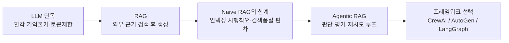
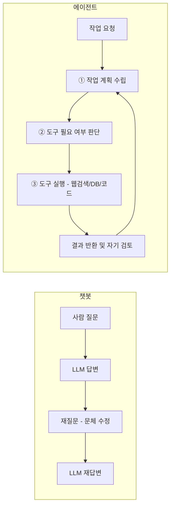
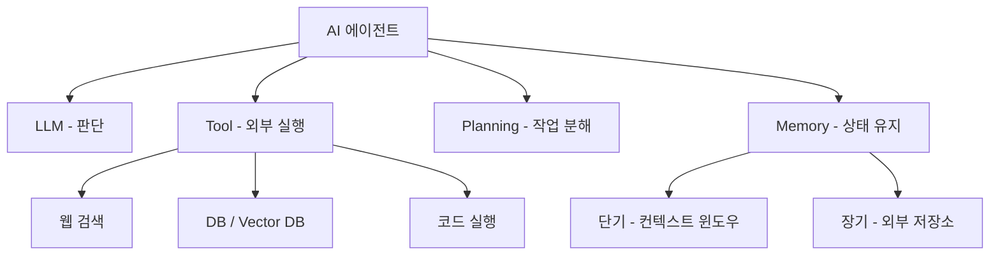
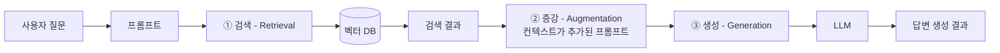
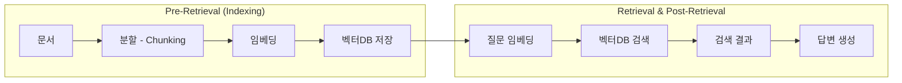
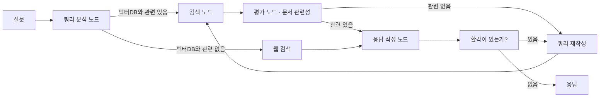

"에이전트가 뭐냐"는 질문에 "LLM에 도구를 붙인 것"이라고 답하면 절반만 답한 것이다. 도구 호출은 결과이지 정의가 아니다. 진짜 차이는 **결과 품질을 끌어올리는 반복을 누가 감당하는가**에 있다.

이 글은 그 관점에서 에이전트가 왜 필요해졌는지를 거슬러 올라간다. LLM 단독의 한계 → RAG로 보완 → 그런데 RAG에도 한계 → 에이전트로 돌파라는 한 줄의 이야기다. 그 돌파를 무엇으로 구현할지, 즉 CrewAI·AutoGen·LangGraph 중 무엇을 고를지는 [다음 편](/blog/ai-agent/agent-framework-comparison/)에서 다룬다.

## 용어 정리

| 약어 / 용어 | 원어 | 뜻 |
|---|---|---|
| LLM | Large Language Model | 대규모 언어 모델. 딥러닝 기반 텍스트 생성 모델 |
| RAG | Retrieval-Augmented Generation | 검색 증강 생성. 외부 DB에서 근거를 검색해 프롬프트에 주입한 뒤 답을 생성 |
| Naive RAG | — | 검색 1회 → 증강 → 생성 1회로 끝나는 가장 단순한 RAG 형태 |
| Agentic RAG | — | 검색·평가·재작성을 에이전트가 판단해 반복 수행하는 RAG. 고정 파이프라인이 아님 |
| Pre-Retrieval | — | 검색 이전 단계. 문서 전처리·청킹·임베딩·벡터DB 저장(=Indexing) |
| Post-Retrieval | — | 검색 이후 단계. 결과 재순위화·재배치·선별 |
| Indexing | — | 문서를 검색 가능한 형태(벡터)로 만들어 저장하는 과정 |
| Chunking | — | 긴 문서를 검색 단위로 쪼개는 것 |
| Embedding | — | 텍스트를 의미를 담은 실수 벡터로 변환하는 것 |
| Vector DB | Vector Database | 임베딩 벡터를 저장하고 유사도 검색을 제공하는 DB |
| Hallucination | — | 환각. 모델이 근거 없는 내용을 사실처럼 생성하는 현상 |
| Context Window | — | 모델이 한 번에 입력받을 수 있는 토큰 길이 상한 |
| Token | — | 모델이 텍스트를 처리하는 최소 단위 |
| Tool | — | 에이전트가 호출하는 외부 기능(웹 검색·DB 조회·코드 실행 등) |
| Planning | — | 목표를 하위 작업으로 분해하고 순서를 정하는 능력 |
| Memory | — | 대화·작업 이력을 유지하는 기능. 단기(컨텍스트)와 장기(외부 저장)로 나뉨 |
| DAG | Directed Acyclic Graph | 방향성 비순환 그래프. 되돌아가는 루프가 없는 구조 |
| ReAct | Reasoning + Acting | 추론과 도구 호출을 번갈아 수행하는 에이전트 패턴 |

## 전체 그림 — LLM 단독에서 에이전트까지

각 단계가 앞 단계의 문제를 풀면서 새 문제를 남긴다. 그 연쇄를 표로 펼치면 왜 마지막에 그래프 실행기가 필요해지는지가 드러난다.

| 단계 | 무엇이 문제인가 | 해법 | 그래도 남는 문제 |
|---|---|---|---|
| LLM 단독 | 학습 시점 이후 정보를 모름(환각) | 외부 근거를 넣어준다 | 근거를 어떻게 찾을 것인가 |
| LLM 단독 | 지난 대화를 기억하지 못함 | 대화 이력을 상태로 저장 | 길어지면 토큰 초과 |
| LLM 단독 | 입력 길이 상한 존재 | 필요한 부분만 검색해 주입 | 검색이 틀리면 답도 틀림 |
| Naive RAG | 문서 인덱싱이 문서 종류마다 다름 | 전처리·청킹·임베딩 맞춤화 | 시행착오 비용이 큼 |
| Naive RAG | 질문에 따라 검색 결과 품질이 천차만별 | 쿼리 재작성·문서 재배치 | 언제 재작성할지 판단 필요 |
| Naive RAG | 검색이 실패해도 그냥 답을 만들어냄 | 관련성·환각 **평가 노드** 추가 | 루프 제어 구조가 필요 |
| 루프 제어 | DAG로는 되돌아가는 흐름 표현 불가 | 사이클을 지원하는 그래프 실행기 | → LangGraph |

> 마지막 행이 이 시리즈의 출발점이다. **앞의 여섯 행은 전부 "무엇을 넣을까"의 문제였지만, 마지막 행만 "어떤 실행 모델을 쓸까"의 문제다.** 표현력이 부족하면 아무리 좋은 아이디어도 코드로 옮길 수 없다.

## AI 에이전트란 무엇인가

에이전트는 세 가지 성질로 정의된다. **환경을 감지하고 행동을 취하는 자율적 시스템**이고, **목표 달성을 위해 독립적으로 의사결정**하며, **학습과 적응 능력을 보유**한다.

세 성질 모두 "사람이 매번 지시하지 않아도 된다"는 한 방향을 가리킨다. 그 지점이 챗봇과 갈리는 자리다.

### 챗봇과 에이전트를 가르는 것

| 항목 | AI 챗봇 | AI 에이전트 |
|---|---|---|
| 목적 | 사용자와의 **대화**에 특화 | 사용자 **요청의 완수** |
| 진행 방식 | 질문 1 → 답변 1의 반복 | 계획 수립 → 실행 → 검토 → 개선 |
| 결과 품질 확보 | 사람이 여러 번 되물어 끌어올림 | 스스로 결과를 되돌아보고 개선 |
| 외부 연결 | 기본적으로 없음(모델 내부 지식) | 웹 검색·DB·코드 실행 등 도구 활용 |
| 성패 요인 | 프롬프트 엔지니어링 영향이 큼 | 계획·도구 선택·검증 루프 설계 |

> 다섯 행을 하나로 줄이면 **"누가 반복을 감당하는가"**다. 챗봇에서는 사람이 재질문으로 품질을 끌어올리고, 에이전트에서는 시스템이 스스로 반복한다.
>
> 그래서 에이전트를 도구 호출로만 설명하면 절반이 빠진다. **도구만 있고 자기 검토 루프가 없으면 그건 함수 호출기다.**

### 실행 흐름 대비

"AI에 대한 에세이를 작성해줘"라는 동일한 요청을 두 구조에 던지면 차이가 즉시 드러난다. 챗봇은 곧장 본문을 쓰고, 사람이 문체를 고쳐 달라고 재요청한다. 에이전트는 **최신 정보 수집이 필요하다고 먼저 판단**해 웹 검색을 실행한 뒤 그 결과 위에서 본문을 작성한다.

도식에서 눈여겨볼 것은 화살표의 방향이다. 챗봇 쪽은 왼쪽에서 오른쪽으로만 흐르고, 에이전트 쪽은 마지막 노드가 첫 노드로 되돌아간다. **이 되돌아가는 화살표 하나가 이 시리즈 전체가 다루는 주제다.**

### 구성요소 네 가지

| 구성요소 | 하는 일 | 없을 때 생기는 일 |
|---|---|---|
| **LLM** (두뇌) | 언어 이해·판단·생성 | 판단 주체가 없음 |
| **Tool** (손발) | 웹 검색·DB 조회·코드 실행 | 모델 내부 지식에 갇힘(환각) |
| **Planning** (계획) | 목표를 하위 작업으로 분해·순서화 | 복합 요청을 한 번에 실패 |
| **Memory** (기억) | 대화·중간 결과 유지 | 매 턴 처음부터 다시 시작 |

네 축 중 Tool과 Memory만 하위 갈래가 있다. Tool은 무엇을 붙이느냐로 벌어지고, Memory는 **얼마나 오래 유지하느냐**로 벌어진다. 단기 메모리는 컨텍스트 윈도우 안에 사는 것이고 장기 메모리는 외부 저장소로 나가는 것인데, 이 둘을 구분하지 않으면 "대화가 길어지면 앞을 잊는다"는 증상의 원인을 찾지 못한다.

> 이 4요소 루프를 논문 수준에서 정형화한 것이 **ReAct**(Reasoning + Acting) 패턴이다. `생각 → 행동(도구 호출) → 관찰 → 다시 생각`을 반복한다. 결과를 스스로 비평해 재시도하는 확장이 **Reflexion** 계열이다.
>
> 에이전트 루프를 설계할 때는 ReAct를 기준선으로 두되 **종료 조건(최대 반복 횟수·비용 상한)을 함께 정의한다.** 루프에 상한이 없으면 실패한 질의 하나가 비용을 무한정 태운다.

### 단일 에이전트와 멀티 에이전트

| 구분 | 단일 에이전트 | 멀티 에이전트 |
|---|---|---|
| 구성 | LLM 1 + 도구 N | 역할이 다른 에이전트 N이 협업 |
| 강점 | 단순·저비용·디버깅 용이 | 역할 분담으로 복잡 과업 처리 |
| 약점 | 복합 과업에서 맥락 과부하 | 비용·지연·비결정성 증가 |
| 대표 형태 | 검색형 에이전트, 범용 도구 사용 에이전트 | 뉴스레터 생성, 기업분석 리포트, 코딩 멀티에이전트 |

멀티에이전트가 지향하는 그림은 명확하다. 여러 팀의 AI가 서로 협력해 소프트웨어를 개발하고, 다양한 맥락을 파악해 능동적으로 임무를 수행하는 것이다.

> 다만 멀티에이전트는 기본값이 아니다. 에이전트 수가 늘면 호출 수와 토큰이 곱셈으로 늘고, 실패 지점도 함께 늘어난다.
>
> **단일 에이전트로 안 되는 이유를 먼저 댈 수 있을 때만 멀티로 간다.** 이 순서를 지키지 않으면 통제 불가능한 구조를 만들어 놓고 원인을 못 찾는다.

## LLM 단독의 세 가지 한계

LLM은 딥러닝 기반 모델이라 긴 문장 처리와 학습 범위 밖 정보 생성에 구조적 한계가 있다.

| # | 한계 | 원인 | 2024년 시점의 예 |
|---|---|---|---|
| 1 | **환각 현상** | 학습 데이터 밖 정보에 취약 | 2024년 기준으로 GPT-4o는 2023년 9월까지, Claude Sonnet 3.5는 2024년 4월까지의 데이터로 학습됐다 |
| 2 | **기억 불가** | 사전학습 이후 새로 배우지 못함 | 어제 나눈 대화를 오늘 기억하지 못한다 |
| 3 | **토큰 제한** | 입력이 길수록 계산량 급증 | 2024년 기준 GPT-4o 입력 상한 128,000 토큰 / Claude Sonnet 3.5 200,000 토큰 |

> **위 모델명·컷오프·토큰 상한은 전부 2024년 시점의 값이다.** 이후 세대 모델에서 컨텍스트 길이는 크게 확대됐다. 숫자를 그대로 인용하는 것은 의미가 없고, 남는 것은 **한계의 성질**이다 — 길이 상한이 존재하고, 비용과 지연이 길이에 비례하며, 긴 입력의 중간 정보는 소실된다.
>
> 그래서 "컨텍스트가 커졌으니 RAG는 필요 없다"는 결론은 성립하지 않는다. 전체를 넣는 것과 필요한 것만 넣는 것은 **길이의 문제가 아니라 비용 구조의 문제**다.

1번과 2번의 증상과 완화책은 RAG 파이프라인 쪽에서 더 자세히 다뤘다 — [RAG를 쓰는 이유와 8단계 지도](/blog/rag/rag-pipeline-ingestion/)에 순수 LLM의 문제 네 가지와 각각의 개선 항목이 표로 정리돼 있다. 여기서는 **3번 토큰 제한**을 별도로 세는 것이 중요하다. 앞의 둘은 "모르는 것"의 문제라 외부 근거로 메울 수 있지만, 토큰 제한은 **그 근거를 얼마나 넣을 수 있는지의 상한**이라 성격이 다르다. 검색이라는 선별 장치가 필요해지는 직접적 이유가 여기 있다.

### RAG — 근거를 그때그때 쥐어주는 것

RAG는 AI 모델이 외부 데이터베이스에서 관련 정보를 검색하고, 이를 활용해 더 정확하고 최신의 응답을 생성하는 기술이다.

"현재 갤럭시 Z시리즈의 최신 모델은?"이라는 질문에 언팩 행사 보도자료를 **힌트(Context)**로 함께 넣어주면, 모델이 학습하지 않은 사실도 정확히 답한다. 즉 RAG는 **모델을 다시 학습시키는 대신 답할 근거를 그때그때 쥐어주는 것**이다.

| 단계 | 핵심 작업 | 대표 기술 |
|---|---|---|
| **① 검색** | 질문 분석 → 키워드/의미 추출 → 벡터DB에서 관련 정보 조회 | 벡터 유사도 검색 |
| **② 증강** | 검색 결과의 관련성 평가 → 선별 → 원 프롬프트에 결합 | 컨텍스트 윈도우 조정, 정보 요약 |
| **③ 생성** | 증강된 프롬프트로 응답 생성 | 사전학습 지식 + 주입된 컨텍스트 결합 |

이 3단계 분해는 RAG라는 약어를 그대로 펼친 것이라 **개념을 잡는 데 쓰는 지도**다. 구현 단위로 내려가면 로드·분할·임베딩·저장·검색·프롬프트·LLM·체인의 [8단계](/blog/rag/rag-pipeline-ingestion/)가 되는데, 두 지도는 경쟁 관계가 아니다.

> 3단계는 **"무엇을 하는가"**를 말하고 8단계는 **"어디를 조정할 수 있는가"**를 말한다. 문제를 진단할 때는 8단계가 필요하지만, 왜 이 구조인지를 설명할 때는 3단계가 빠르다.

## RAG의 한계 — 검색 실패를 스스로 모른다

RAG 시스템에서 올바른 응답을 유도하려면 **검색 단계를 고도화**해야 한다. 그리고 검색 단계는 검색 전(문서를 벡터DB에 저장)과 검색 후(질문으로 유사 문서를 찾음)의 **두 구간**으로 나뉜다. 이 분리가 RAG 튜닝의 좌표계다.

| 구간 | 무엇이 어려운가 | 성격 |
|---|---|---|
| **Pre-Retrieval** | 문서 종류마다 전처리·청킹·임베딩 모델·메타데이터를 맞춤화해야 함 | 내게 맞는 방법을 찾기 위한 **시행착오가 필수적**인 구간 |
| **Retrieval / Post-Retrieval** | 저장이 잘 됐어도 질문에 따라 결과가 **천차만별** | 쿼리 재구성·문서 재배치 같은 고도화 작업이 동반되는 구간 |

> 두 구간을 나눠 보는 것이 실무에서 갖는 값은 **고칠 곳을 특정해 준다**는 데 있다. 답변이 나쁠 때 프롬프트부터 만지는 것이 흔한 반응이지만, 원인이 Pre-Retrieval에 있으면 프롬프트를 백 번 고쳐도 바뀌지 않는다.
>
> **RAG 품질 문제의 병목은 생성이 아니라 검색이고, 검색은 다시 두 구간으로 갈린다.** 이 좌표계 없이는 튜닝이 시행착오의 반복이 된다.

여기서 결정적 관찰이 나온다. **Naive RAG는 검색이 실패했다는 사실을 스스로 알지 못한다.** 잘못된 문서를 받아도 그것을 근거 삼아 그럴듯한 답을 만들어낸다. 실패를 감지하고 다르게 다시 시도하려면 **판단하는 주체**와 **되돌아가는 흐름**이 필요하다. 그것이 에이전트다.

### Agentic RAG — 판단과 사이클을 넣는다

핵심 아이디어는 두 가지다.

- **쿼리 의도 파악 및 재구성** — 질문을 그대로 검색하지 않고, 벡터DB와 관련 있는지부터 분석한다.
- **검토를 통한 재귀 실행** — 문서 관련성·환각 여부를 평가하고, 문제가 있으면 쿼리를 재작성해 되돌아간다.

| Naive RAG | Agentic RAG |
|---|---|
| 검색 1회 고정 | 필요하면 재검색·재작성 반복 |
| 질문을 그대로 임베딩 | 질문 의도를 분석하고 재구성 |
| 벡터DB만 소스 | 관련 없으면 웹 검색으로 우회 |
| 검색 실패를 모름 | 문서 관련성 평가 노드가 판정 |
| 환각을 검증하지 않음 | 환각 여부를 판정하고 되돌림 |
| 흐름이 DAG (일방향) | 흐름에 **사이클** 존재 |

표의 마지막 행이 나머지 다섯 행을 가능하게 하는 전제다. 재검색·재작성·되돌림은 전부 **뒤로 가는 화살표**를 요구하고, DAG는 정의상 그것을 표현하지 못한다.

관련성 판정기를 실제로 어떻게 만드는지, 판정 프롬프트가 어떤 실패를 겪는지는 [Agentic RAG와 관련성 검증](/blog/rag/agentic-rag-relevance-check/)에서 코드 수준으로 다뤘다. 이 아이디어를 이름 붙여 정형화한 변종으로 [**Self-RAG**](/blog/ai-agent/self-rag-grader-design/)(생성물 자기평가), [**CRAG**](/blog/ai-agent/crag-adaptive-rag-routing/)(검색 품질이 낮으면 웹 검색으로 교정), [**Adaptive RAG**](/blog/ai-agent/crag-adaptive-rag-routing/)(질문 난이도에 따라 경로 자체를 분기)가 있다. 네 변종의 계보와 발동 조건은 [판단하는 RAG 시리즈](/blog/ai-agent/agentic-rag-as-tool/)에서 축별로 비교한다.

> 주의할 것은 이런 검증 루프가 환각을 **줄이는 장치**이지 0으로 만드는 보증이 아니라는 점이다. 평가자 역시 LLM이므로 오판한다.
>
> 그래서 검증 루프에는 항상 **반복 상한과 폴백 경로**가 함께 설계돼야 한다. "관련 문서를 못 찾았습니다"라고 답하고 멈추는 경로가 없으면, 루프는 오판을 근거로 무한히 재시도한다.

---

여기까지가 "왜 에이전트인가"다. 남은 질문은 **그것을 무엇으로 구현하는가**다. CrewAI·AutoGen·LangGraph는 같은 문제를 서로 다른 추상화 수준에서 푸는데, 그 차이는 곧 **제어권을 얼마나 개발자가 쥐는가**의 차이다. [다음 편](/blog/ai-agent/agent-framework-comparison/)에서 세 프레임워크를 12개 축으로 비교하고 선택 트리로 정리한다.
