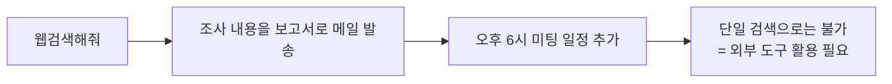
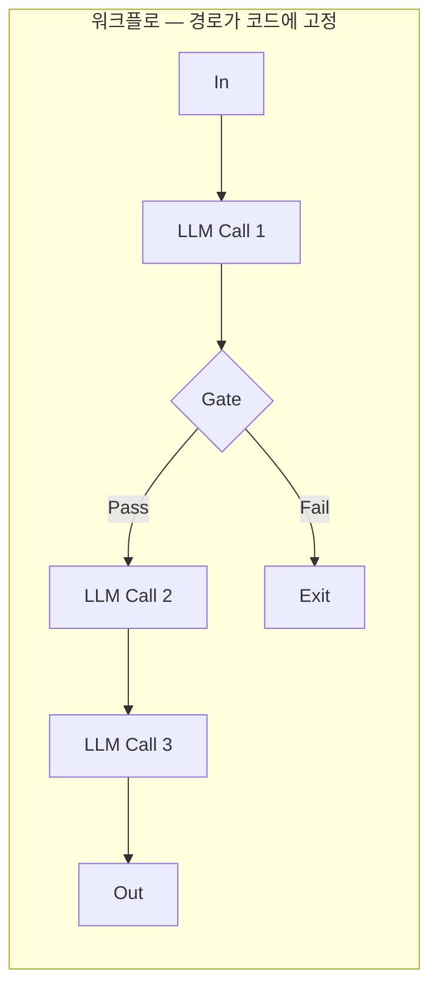
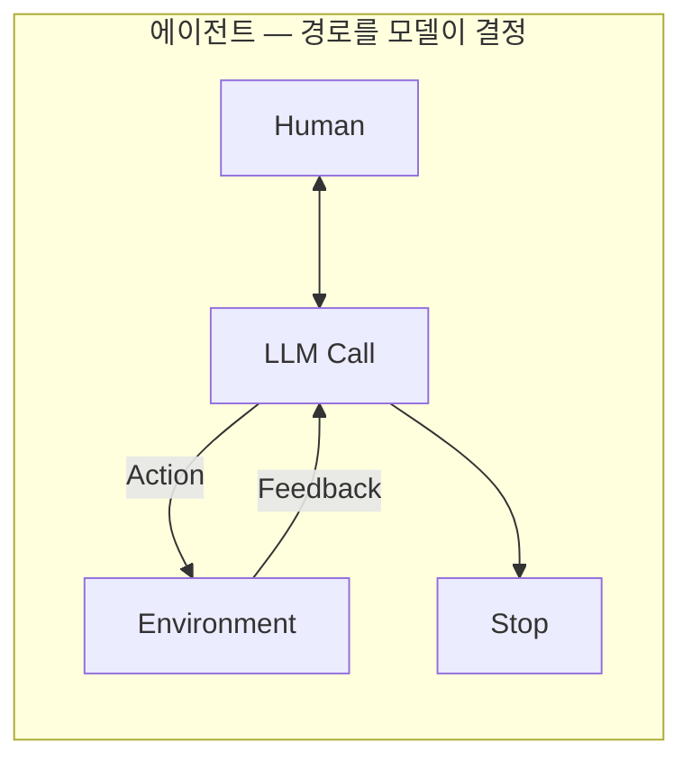
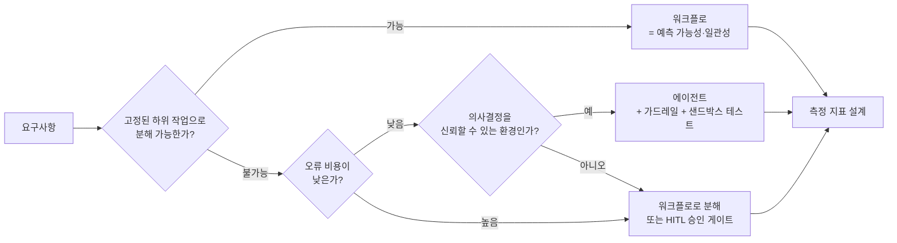
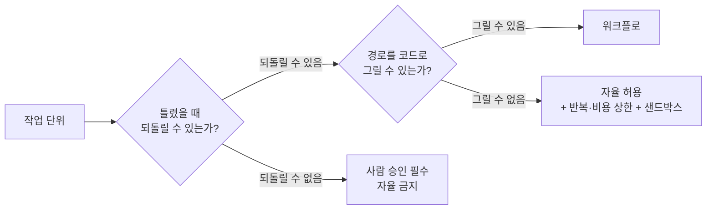

"에이전트를 도입합시다"라는 말이 회의에서 나오면 대개 두 사람이 서로 다른 것을 떠올린다. 한쪽은 웹 검색을 붙인 챗봇을 생각하고, 다른 쪽은 목표만 주면 알아서 여러 단계를 밟는 무언가를 생각한다. 둘 다 최근 몇 년 사이 "에이전트"라고 불린 적이 있어서 어느 쪽도 틀렸다고 말하기 어렵다.

이 글은 그 단어의 뜻이 실제로 한 번 이동했다는 사실에서 출발한다. 판정 기준이 **"도구를 쓰느냐"에서 "경로와 종료 시점을 누가 정하느냐"로** 옮겨 갔고, 그 이동을 인정하는 순간 워크플로와 에이전트 사이에 아키텍처적 경계선이 생긴다. 경계선을 그은 다음에는 반대 방향의 질문이 따라온다 — **에이전트를 쓰지 말아야 할 때는 언제인가.** 이 글의 절반은 그쪽에 쓰인다. 다음 편에서는 이 경계를 넘어간 쪽, 즉 [자율성을 실제로 구현하는 패턴 카탈로그](/blog/ai-agent/agent-pattern-catalog/)로 넘어간다.

> 이 글은 **2025년 2월과 4월의 자료를 정리한 것**이다. 두 시점에 같은 주제를 다시 다룬 자료가 있고, 두 판을 겹쳐 읽으면 회의론에서 표준화로 이동하는 흐름이 보인다. 등장하는 수치·제품·벤치마크는 모두 그 시점의 것이며 이후 갱신되지 않았다.

## 용어 정리

| 용어 | 원어·표기 | 뜻 |
|---|---|---|
| 에이전트 | Agent | 목표 달성을 위해 환경을 관찰(observation)하고, 보유한 도구(tools)로 행동(action)하는 자율 애플리케이션 |
| 워크플로 | Workflow | LLM과 도구가 **미리 정의된 코드 경로**로 오케스트레이션되는 시스템 |
| 에이전틱 시스템 | Agentic System | 워크플로와 에이전트를 아우르는 상위 개념 |
| 도구 호출 | Tool Calling / Function Calling | LLM이 외부 함수·API를 호출하도록 구조화된 출력을 내는 기능 |
| CoT | Chain-of-Thought | 중간 추론 과정을 명시적으로 생성해 정답률을 올리는 프롬프트 기법 |
| 할루시네이션 | Hallucination | 모델이 틀린 정보를 확신 있게 제시하는 현상 |
| RAG | Retrieval-Augmented Generation | 검색으로 근거를 붙여 답변을 생성하는 구조 |
| 지연시간 | Latency | 요청부터 응답까지 걸리는 시간. 에이전트는 다단계라 유동적 |
| 오류 비용 | Cost of Error | 잘못된 판단 1건이 실제로 초래하는 손해. 자율성 판단의 핵심 축 |
| 가드레일 | Guardrail | 자율 행동의 허용 범위를 강제하는 안전 장치(권한·비용·횟수·승인) |
| 샌드박스 | Sandbox | 실제 시스템에 영향을 주지 않는 격리 실행 환경 |
| HITL | Human-in-the-Loop | 에이전트가 판단을 멈추고 사람에게 확인을 요청하는 개입 지점 |

## 출발점 — LLM 단독이 부딪힌 네 개의 벽

2025년 4월 자료는 에이전트를 곧바로 정의하지 않고, 2023년에 기업이 ChatGPT를 도입하며 부딪힌 벽부터 센다. 에이전트를 "새로 나온 것"이 아니라 **누적된 대응의 마지막 층**으로 놓는 서사다.

| 한계 | 내용 | 1차 대응 |
|---|---|---|
| 할루시네이션 | 모델이 잘못된 정보를 **자신감 있게** 제시 | 근거 제시(RAG) |
| 최신 정보 미반영 | 학습 컷오프에 지식이 묶임. 재학습은 시간·리소스 부담이 커 실시간 반영이 어려움 | 검색·웹 도구 |
| 도메인 특화 부족 | 일반 LLM은 특정 조직 고유 정보를 갖고 있지 않음. 파인튜닝·맞춤 학습이 별도로 필요 | 사내 문서 검색(RAG) |
| 출처 불분명 | 학습 데이터를 종합해 답을 만들므로 특정 정보의 정확한 출처를 대기 어려움 | 인용·근거 링크 |

네 벽 중 셋이 RAG로 상당 부분 해결된다. 남는 것은 **"검색해서 → 메일 보내고 → 일정 잡아줘"** 같은 요청이다.

RAG의 한계와 그 위에 얹히는 검증 루프는 [Agentic RAG 편](/blog/rag/agentic-rag-relevance-check/)에 별도로 정리돼 있다. 여기서 중요한 것은 위 도식의 마지막 상자뿐이다 — **한 번의 검색으로 끝나지 않는 요청이 존재한다**는 사실이 에이전트의 존재 이유다.

## 정의 — 그리고 정의가 한 번 이동했다

> AI Agent는 목표를 달성하기 위하여 주변 환경을 관찰(observation)하고, 보유한 도구(tools)를 활용하여 행동(action)하는 **자율적인 애플리케이션**이다.
>
> 이 에이전트는 명시적인 인간의 지시 없이도 스스로 목표를 판단하고, 해당 목표를 달성하기 위한 최적의 행동을 계획할 수 있다.
>
> — Google, Agents Whitepaper

이 정의를 네 속성으로 분해하면 다음과 같다.

| 속성 | 설명 |
|---|---|
| 자율성 | 인간의 직접적 개입 없이 스스로 판단하고 결정 |
| 도구 사용 | 외부 환경과 지속적으로 상호작용하며 데이터를 수집 |
| 목표 중심 | 목표 달성을 위한 최적의 행동을 계획 |
| 환경 피드백 | 환경 피드백을 수용해 유동적으로 역할을 조정 |

네 속성 중 실무에서 판정 기준으로 쓸 수 있는 것은 첫 번째와 세 번째뿐이다. 도구 사용과 환경 피드백은 워크플로도 한다.

### LLM 단독과 에이전트의 여덟 축

2월판(5축)과 4월판(6축)을 합치면 여덟 축이 된다. 겹치는 항목은 4월판 표현을 기준으로 했다.

| 비교축 | 모델(LLM) | 에이전트(Agent) |
|---|---|---|
| 지식의 범위 | 학습 데이터에 포함된 내용으로 제한 | 웹검색·SQL 쿼리 등 외부 도구 연결로 지식 확장 |
| 문맥 관리 | 단일 추론/예측만 수행. 세션 기록 관리 없음 | 세션 기록을 관리해 여러 차례 추론 가능 |
| 작업 처리 | 단순 질문–응답. 명시적으로 설계되지 않으면 복잡한 작업 처리 불가 | API 호출·데이터 검색 등 복잡한 작업을 **계획하고 실행** |
| 도구 사용 | 네이티브 도구 구현 없음 | 도구가 아키텍처에 **네이티브로 내장** |
| 추론 프레임워크 | 네이티브 논리 계층 없음. CoT·ReAct를 프롬프트로 유도 | CoT·ReAct가 내장된 인지 아키텍처 제공 |
| 자율적 계획 | 명시적 지침 없이는 자체 계획 수립 어려움 | 스스로 계획을 수립해 작업 진행 |
| 응답 시간·효율 | 즉각 반응, 고정된 처리 시간 | 다단계 처리로 **응답 시간이 유동적** |
| 환경 대응 | 피드백 기능 제한적 | 피드백을 수용해 유동적 구조 성립 |

여덟 축 중 마지막 두 개가 대가를 말한다. 앞의 여섯은 에이전트가 더 낫다고 읽히지만, 응답 시간이 유동적이라는 것은 **p95 지연을 약속할 수 없다**는 뜻이고 그것은 제품 요구사항이 될 수 있다.

### 사고실험 — ChatGPT는 LLM인가 에이전트인가

| 조건 | 질문 | 결과 |
|---|---|---|
| 순수 LLM (웹검색 불가) | "2024년 노벨 문학상 수상자는 누구야?" | "제 데이터 업데이트 범위(2021년 9월) 이후의 내용이어서 제공해 드리기 어렵습니다" |
| 에이전트 (웹검색 도구 사용) | 동일 | "2024년 노벨 문학상 수상자는 대한민국 작가 **한강**입니다" — 출처 표기 포함 |

두 행의 차이는 모델이 아니라 도구 하나다. 그래서 결론이 "둘 중 하나"가 아니라 **"도구 활성 여부에 따라 성격이 달라지는 시스템"**이 된다. 검색을 상시 결합해 자율적으로 정보를 모으는 제품은 Agentic RAG 쪽에 더 가깝고, 그 계열을 화면에서 역추론한 기록은 [Perplexity를 리버스 엔지니어링한 편](/blog/ai-agent/reverse-engineering-agent-graph/)에 있다.

### 판정 기준이 옮겨 갔다

| 시점 | 에이전트의 뜻 |
|---|---|
| 기존 | 도구 호출(웹검색 등)이 가능한 LLM |
| 변경 | 스스로 판단하고 다양한 도구를 **선택**하여 활용하며, 주어진 목표(Goal)를 달성할 때까지 **반복하여** 작업을 수행 |

> **판정 기준은 "도구를 쓰느냐"가 아니라 "경로와 종료 시점을 누가 정하느냐"다.**
>
> 이 이동이 실무에서 값을 하는 이유는 판정 대상이 바뀌기 때문이다. 기존 기준으로는 기능 목록을 보고 판정했지만 — 검색이 되나, 코드를 돌리나 — 새 기준으로는 **코드를 열어 조건부 엣지가 어디에 있는지**를 봐야 한다. "도구를 다섯 개 붙였으니 에이전트"라는 문장은 새 기준에서 아무것도 말하지 않는다.

## 아키텍처적 구분 — 화살표가 미리 그려져 있는가

> 워크플로우와 에이전트 사이에는 **중요한 아키텍처적 구분**이 있다.
>
> **워크플로우**는 정해진 규칙대로 순차적으로 수행하며, 이 과정에서 도구 호출이 사용될 수 있다. **에이전트**는 변하는 환경과 주어진 도구를 활용하여 최적의 상황을 판단하며 수행하는 **동적 프로세스**다.

두 도식의 차이는 노드 수가 아니라 **화살표의 성격**이다. 위쪽은 화살표가 전부 미리 그려져 있고 `Gate`가 그중 하나를 고른다. 아래쪽에는 Action–Feedback 루프 하나뿐이고, 몇 바퀴 돌지·언제 `Stop`할지가 어디에도 그려져 있지 않다.

### 축을 늘리면 무엇이 보이나

원 자료가 제시한 네 축은 이렇다.

| 기준 | Workflow | Agent |
|---|---|---|
| 방식 | 사전 정의된 흐름을 따라 수행 | 자율적 판단에 따른 작업 수행 |
| 프롬프트 | 점진적으로 구체화(상세한 정의) | 느슨한 프롬프트(열린 형태) |
| 유연함 | 정해진 Rule 기반, 비교적 덜 유연 | 유연하나 **같은 상황에서도 다른 판단**이 나올 수 있음 |
| 주의사항 | 예외 케이스 대처 능력 부족 | **도구에 대한 설명이 구체적**이어야 함 |

여기에 자료 전반에 흩어져 있던 운영 축을 더하면 여섯 줄이 붙는다.

| 운영 축 | Workflow | Agent |
|---|---|---|
| 예측 가능성 | 높음 — 잘 정의된 작업에 대해 **예측 가능성과 일관성** 제공 | 낮음 — 일관성 없는 의사결정 발생 가능 |
| 지연시간 | 고정적 | 유동적, 일반적으로 **더 김** |
| 비용 | 예측 가능 | **더 높음** (반복 호출) |
| 오류 양상 | 예외 미처리로 중단 | **복합적 오류**(누적 오류) 가능성 |
| 디버깅 | 그래프 경로 추적 용이 | 실행마다 경로가 달라 재현이 어려움 |
| 적합 문제 | 고정된 하위 작업으로 깔끔히 분해 가능 | 단계 수를 예측할 수 없는 **개방형 문제** |

**도식은 둘인데 표는 두 개에 열 행이다.** 도식이 말하는 것은 구조 하나 — 화살표가 미리 그려져 있는가 — 뿐이고, 표 열 행은 전부 그 하나에서 파생된 운영상의 귀결이다. 도식만 보면 "그래서 뭐가 문제인가"에 답할 수 없고, 표만 보면 열 가지가 서로 독립된 항목처럼 보인다.

> **"유연함"과 "비결정성"은 같은 것을 두 각도에서 부르는 이름이다.**
>
> 세 번째 행이 그 사실을 드러낸다. 원 자료는 에이전트를 "유연하며, 같은 상황에서도 다른 판단이 작용할 가능성이 있음"이라고 적었는데, 앞의 절반은 세일즈 문구이고 뒤의 절반은 장애 리포트다. 같은 문장에 둘이 들어 있다. 도입을 검토할 때 앞의 절반만 인용되는 것이 이 단어가 위험한 이유다.

## 언제 에이전트를 쓰지 **않아야** 하는가

> 현재 에이전트라는 용어에 대한 흥미가 높지만, 많은 사람들이 실제로 그 의미를 잘 이해하지 못하고 있다. 그래서 이로 인해 **불필요한 문제에 에이전트를 적용하려는 경향**이 보인다. "소 잡는 칼로 닭을 잡을 필요는 없다."
>
> 에이전트를 사용할 적정 영역은 **가치가 있으며 복잡한 작업으로, 오류 비용이 상대적으로 낮은 작업**이다.

판단은 두 축의 교차로 정리된다.

| | 오류 비용 **낮음** | 오류 비용 **높음** |
|---|---|---|
| 작업 복잡도 **높음** (경로 예측 불가) | **에이전트 적합** — 리서치·정보 수집·코드 탐색 | 에이전트 + **강한 가드레일·HITL 승인** 또는 워크플로로 분해 |
| 작업 복잡도 **낮음** (분해 가능) | 워크플로 — 굳이 에이전트를 쓸 이유 없음 | **워크플로 + 규칙 검증** — 결제·계약·의료 등 |

네 칸 중 셋이 "에이전트를 쓰지 말거나 제한하라"고 말한다. 자율성이 온전히 허용되는 것은 왼쪽 위 한 칸뿐이다.

원 자료가 던진 검증 질문이 이 표를 한 문장으로 압축한다.

> 에이전트에게 **값비싼 비행기 티켓 예매와 호텔 예약**을 맡길 수 있는가?
>
> 이 질문이 좋은 이유는 복잡도를 묻지 않기 때문이다. 티켓 예매는 단계가 많지도 않고 경로가 애매하지도 않다. 그런데도 대부분 "아니오"라고 답한다면, 판단을 가른 것은 복잡도가 아니라 **틀렸을 때의 대가**다.

반대로 에이전트를 **써야 하는** 조건은 다섯 가지로 정리돼 있다.

| 조건 | 내용 |
|---|---|
| 개방형 문제 | 필요한 단계 수를 예측하기 어렵거나 불가능하고, **고정된 경로를 하드코딩할 수 없는** 문제 |
| 신뢰 확보 | 여러 차례에 걸쳐 작동하므로, 에이전트의 의사결정에 **어느 정도 신뢰**가 있어야 함 |
| 환경 조건 | 자율성은 **신뢰할 수 있는 환경**에서 작업을 확장할 때 이상적 |
| 대가 인지 | 자율적 특성은 **더 높은 비용과 복합적 오류 가능성**을 의미 |
| 필수 조치 | 적절한 **가드레일**과 함께 **샌드박스 환경에서 광범위한 테스트** 수행 권장 |

다섯 조건 중 마지막 둘은 조건이 아니라 청구서다. 앞의 셋을 만족해서 에이전트를 쓰기로 했다면, 그 결정에 비용 증가와 샌드박스 구축이 자동으로 딸려 온다. 실행 권한이 붙는 순간 샌드박스가 무엇을 뜻하는지는 [격리 등급을 4단계로 나눈 편](/blog/ai-agent/code-execution-sandbox-limits/)에 정리돼 있다.

추천된 도메인은 **상담원과 코딩 에이전트** 둘이었고, 예시 제품으로는 OpenAI Operator, Anthropic Computer Use, AI 상담원이 제시됐다. 대표 프롬프트는 *"여행 계획을 세우고, 비행기 티켓을 구매하고, 호텔과 레스토랑을 예약해줘"*다. 바로 위에서 "맡길 수 있는가"라고 물었던 그 작업이 예시로 다시 나온다는 점이 이 자료의 긴장 지점이다.

### 워크플로가 적합한 경우

| 예시 | 흐름 |
|---|---|
| 예시 1 | 마케팅 문구를 생성 → 다른 언어로 번역 |
| 예시 2 | 문서의 개요를 작성 → 특정 기준을 충족하는지 확인 → 세부 내용 작성 → 결합 |

두 예시 모두 LLM 호출이 두 번 이상이고, 두 번째가 첫 번째 결과에 의존한다. 그런데도 워크플로인 이유는 **호출 순서가 요구사항에 이미 적혀 있기** 때문이다.

> 워크플로우란 LLM과 도구가 미리 정의된 코드 경로를 통해 오케스트레이션되는 시스템이며, 복잡한 파이프라인을 **그래프 형태**로 구성함으로써 흐름 관리가 용이하다.
>
> 복잡성이 요구되는 경우에도 워크플로우는 잘 정의된 작업에 대해 **예측 가능성과 일관성**을 제공한다. 여기서 읽어야 할 것은 "복잡성이 요구되는 경우에도"라는 단서다. 복잡하다는 이유만으로는 에이전트로 넘어갈 근거가 되지 않는다 — 복잡한 것과 경로를 그릴 수 없는 것은 다른 문제다.

## 결정 프레임 두 장

먼저 요구사항에서 시작하는 흐름이다.

**이 도식은 분기가 셋인데 앞의 2×2 표는 칸이 넷이다.** 도식이 표에 없는 축을 하나 더 갖고 있어서다 — "신뢰할 수 있는 환경인가"라는 세 번째 질문은 표의 어느 칸에도 없다. 반대로 표는 오류 비용이 높으면서 복잡도가 낮은 칸(결제·계약)을 명시하지만 도식은 그 경로를 `D`로 합쳐 버린다. 둘을 함께 봐야 네 칸과 세 질문이 다 남는다.

그리고 모든 경로가 `M`(측정 지표 설계)으로 수렴한다는 점이 이 도식의 진짜 주장이다. 워크플로를 골랐든 에이전트를 골랐든 측정은 면제되지 않는다.

두 번째 프레임은 작업 단위에서 시작하며, 첫 질문이 다르다.

> **가역성이 복잡도보다 먼저다.**
>
> 앞 도식은 "분해 가능한가"를 먼저 묻고 오류 비용을 두 번째로 물었다. 이 도식은 순서를 뒤집는다. 되돌릴 수 없는 작업이라면 경로를 그릴 수 있든 없든 자율 대상이 아니기 때문에, 복잡도 질문을 먼저 하면 판정을 두 번 해야 한다. 실무에서는 이쪽 순서가 짧다 — 첫 질문에서 잘려 나가는 작업이 생각보다 많다.

가역성이 자율성의 상한을 정한다는 원칙은 [코딩 에이전트의 권한 등급](/blog/ai-agent/code-execution-sandbox-limits/)에서 읽기 → 로컬 실행 → 쓰기 → 배포의 4단 게이트로 구체화된다. 원칙과 구현이 같은 축 위에 있다.

---

여기까지가 "에이전트를 쓸 것인가"의 판단이다. 쓰기로 했다면 다음 질문은 **무엇을 어떻게 조립할 것인가**이고, 여기서 선택지가 갑자기 열한 개로 늘어난다.

프롬프트 체이닝부터 컴퓨터 유즈까지, 자율성 수준이 "없음"에서 "매우 높음"까지 걸쳐 있는 패턴들이 전부 "에이전트 아키텍처"라는 한 이름으로 불린다. [다음 편](/blog/ai-agent/agent-pattern-catalog/)에서 에이전트를 구성 요소로 먼저 분해한 뒤, 그 열한 개를 자율성 축과 대표 실패 모드로 나란히 세운다.
