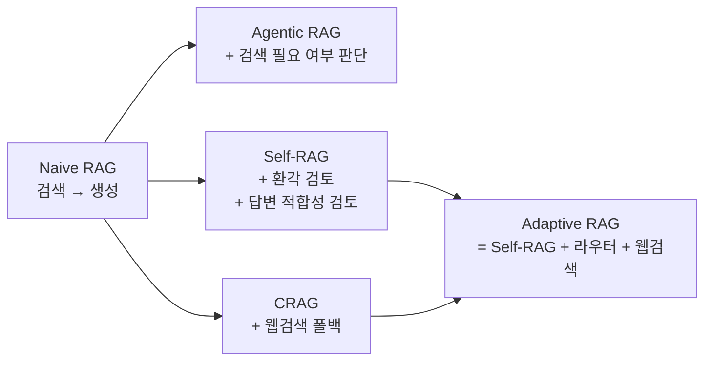
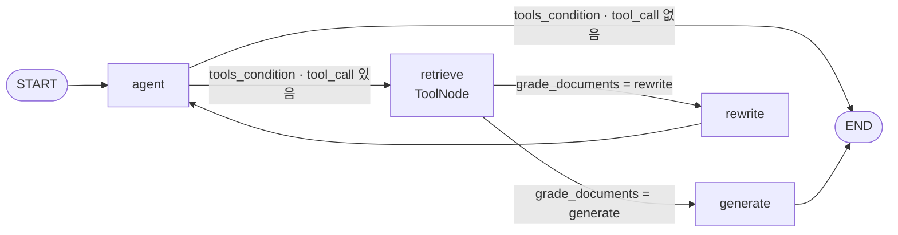

"대한민국 2023년 최저 시급은?"이라는 질문에 사내 인사규정 벡터DB를 뒤지는 챗봇이 있다. 검색은 성공한다 — "임직원 연봉은 매년 계약을 갱신한다"는 청크가 올라온다. 그리고 그 청크를 근거로 그럴듯한 답이 나간다. **아무것도 에러를 내지 않았고 아무도 실패를 몰랐다.**

이 실패를 막는 방법은 넷으로 갈린다. 검색을 걸지 말지부터 판단하거나, 검색 결과를 채점하거나, 생성된 답변을 다시 채점하거나, 애초에 어느 데이터소스로 갈지 라우팅하거나. **네 가지 모두 파이프라인 중간에 LLM 판정기를 꽂고 판정 결과로 그래프 경로를 바꾼다는 하나의 아이디어에서 갈라져 나온다.** 무엇을 판정하느냐, 판정이 나쁠 때 어디로 되돌아가느냐만 다르다.

이 시리즈는 그 넷을 LangGraph `StateGraph`로 구현하며 비교한다. 이 편은 계보와 실패 분류, 그리고 첫 번째인 **Agentic RAG**를 다룬다. 앞 시리즈의 [체크포인터·인터럽트 편](/blog/ai-agent/langgraph-checkpointer-hitl/)에서 "판단 대상을 바꾸면 어떻게 되는가"라는 질문까지 왔다면 여기가 그 답이다.

## 용어 정리

| 약어 / 용어 | 원어 | 뜻 |
|---|---|---|
| RAG | Retrieval-Augmented Generation | 외부 문서를 검색해 LLM 답변의 근거로 넣는 기법 |
| Naive RAG | — | 검색 → 생성만 있는 단방향 RAG. 분기·재시도 없음 |
| Agentic RAG | — | 검색 자체를 **Tool**로 만들고, 에이전트가 검색할지 말지를 스스로 결정하는 RAG |
| Self-RAG | Self-Reflective RAG | 생성 결과를 스스로 채점(환각·적합성)해 재생성·재검색하는 RAG |
| CRAG | Corrective RAG | 검색 문서가 부실하면 **웹 검색으로 보정**하는 RAG |
| Adaptive RAG | — | 질문 유형에 따라 데이터소스를 **라우팅**한 뒤 Self-RAG 검증을 붙인 통합형 |
| Grader | — | yes/no 등 정형 라벨을 뱉는 LLM 판정기. 이 시리즈의 핵심 부품 |
| Groundedness | 근거성 | 답변이 **주어진 문서에 근거**하는가. 사실성(factuality)과 다름 |
| Retriever | — | 질문 벡터와 유사한 문서 청크를 반환하는 검색기 |
| Vectorstore | — | 임베딩 벡터 저장소. 이 시리즈는 Chroma 사용 |
| Conditional Edge | 조건부 엣지 | 함수 반환값에 따라 다음 노드가 갈리는 엣지 |
| `add_messages` | — | LangGraph 리듀서. 새 메시지를 기존 리스트에 **누적** |
| `with_structured_output` | — | LLM 출력을 Pydantic 스키마로 강제 파싱시키는 LangChain API |
| `tools_condition` / ToolNode | — | 도구 호출 여부를 판정하는 프리빌트 엣지 / 도구를 실제 실행하는 프리빌트 노드 |
| Tavily | — | LLM용 웹 검색 API. 이 시리즈의 웹검색 폴백 도구 |
| Reflection Token | — | Self-RAG 원논문에서 모델이 직접 생성하도록 학습시킨 자기평가 특수 토큰 |

## 4종의 계보 — 무엇이 추가되며 갈라지는가



도식이 말하는 것은 **어디서 갈라져 어디서 합류하는가**다. 셋은 Naive RAG에서 각자 다른 방향으로 뻗고, Adaptive RAG만 두 갈래가 모여 만들어진다. 같은 넷을 축별로 펼치면 열한 줄이 된다.

| 구분 | Agentic RAG | Self-RAG | CRAG | Adaptive RAG |
|---|---|---|---|---|
| **무엇을 판단하는가** | ① 검색이 필요한가 ② 검색 결과가 관련 있는가 | ① 문서 관련성 ② 환각 여부 ③ 답변 적합성 | ① 문서 관련성(하나라도 무관한가) | ① 질문 유형(라우팅) ② 문서 관련성 ③ 환각 ④ 답변 적합성 |
| **Grader 개수** | 1개 (`grade`) | 3개 (`GradeDocuments`·`GradeHallucinations`·`GradeAnswer`) | 1개 (`GradeDocuments`) | 4개 (위 3개 + `RouteQuery`) |
| **추가 노드** | `agent`, `retrieve`(ToolNode), `rewrite` | `grade_documents`, `transform_query` | `grade_documents`, `transform_query`, `web_search_node` | 위 전부 + `web_search` + START 라우팅 |
| **State 스키마** | `messages`(add_messages 누적) | `question`·`generation`·`documents` | 좌동 + `web_search` 플래그 | `question`·`generation`·`documents` |
| **되돌아가는 지점** | `rewrite` → `agent` | `transform_query` → `retrieve`, `generate` → `generate` | 없음 (루프 자체가 없는 DAG) | `transform_query` → `retrieve`, `generate` → `generate` |
| **막는 실패** | 불필요한 검색 / 무관 문서로 답변 | 환각 답변 / 동문서답 | 벡터DB에 근거가 아예 없는 질문 | 위 전부 |
| **못 막는 실패** | 환각, 동문서답 | 벡터DB 밖 지식 요구 질문 | 환각, 동문서답 (검증기 없음) | 문서 자체가 틀린 경우 |
| **최소 LLM 호출** | 3회 | 문서 N개 기준 N+3회 | N+1회 | N+4회 |
| **대가(지연·비용)** | 중 (에이전트 1턴 추가) | 상 (문서마다 채점 + 생성 후 2중 검증) | 중상 (채점 N회 + 웹 API 왕복) | 최상 (라우팅까지 전부) |
| **루프 상한** | `recursion_limit=10`으로만 제어 | **없음** (무한 재생성 위험) | 해당 없음 | **없음** |
| **State 리듀서** | `add_messages`로 누적 | 없음 (키 단위 덮어쓰기) | 좌동 | 좌동 |

**도식은 다섯 노드인데 표는 열한 행이다.** 도식에만 있는 것은 `Naive RAG`라는 기점과 갈라짐의 방향이고, 표에만 있는 것은 열한 개 비교축 전부다. 둘을 함께 봐야 하는 이유는 도식이 **"왜 이런 것들이 생겼는가"**를 말하고 표가 **"그래서 무엇이 다른가"**를 말하기 때문이다. 계보만 보면 넷이 자연스러운 발전 단계처럼 읽히지만, 표의 "못 막는 실패" 행을 보면 뒤로 갈수록 나아지는 것이 아님이 드러난다.

> **"최소 LLM 호출" 행은 실측치가 아니라 코드에서 호출 경로를 세어 계산한 값이다.** 지연·비용 벤치마크가 아니다.
>
> 이 구분을 흘리면 "Self-RAG가 N+3배 느리다"는 식의 잘못된 요약이 나온다. 호출 횟수와 체감 지연은 모델 크기·병렬화 여부에 따라 크게 갈린다. 이 값이 말하는 것은 **호출이 문서 수에 선형으로 붙는다는 구조**이지 배수가 아니다.

### 공통 실습 세팅

넷 다 같은 인덱스 위에서 돈다. 비교가 성립하려면 이 부분이 고정돼야 한다.

| 요소 | 값 |
|---|---|
| 인덱싱 대상 | Lilian Weng 블로그 3편 (LLM Agent / Prompt Engineering / Adversarial Attack) |
| 로더 | `WebBaseLoader` |
| 스플리터 | `RecursiveCharacterTextSplitter.from_tiktoken_encoder` |
| 청크 크기 | Agentic RAG: 100/overlap 50 · Self-RAG·CRAG: 250/overlap 0 · Adaptive RAG: 500/overlap 0 |
| 임베딩 | `OpenAIEmbeddings` |
| 벡터스토어 | `Chroma` (collection `rag-chroma`) |
| LLM | `gpt-4o-mini`, `temperature=0` (생성기·판정기 전부 동일 모델) |
| 생성 프롬프트 | `hub.pull("rlm/rag-prompt")` (LangChain Hub 공개 RAG 프롬프트) |
| 웹검색 | `TavilySearchResults(k=3)` — CRAG·Adaptive RAG만 |

> 네 번째 행이 비교를 흐리는 변수다. **청크 크기가 100에서 500까지 다섯 배 차이 난다.** 청크가 작으면 문서 수 N이 커지고, 그러면 문서별 채점 비용도 함께 커진다.
>
> 그래서 위 비교표의 "최소 LLM 호출"을 변형 간 직접 비교에 쓰면 안 된다. 같은 질문이라도 Agentic RAG의 N과 Adaptive RAG의 N이 애초에 다른 수다. 비교하려면 **청크 설정부터 통일**해야 한다.

## 실패 분류 — 일곱 갈래

RAG가 무너지는 지점을 이 카테고리 전체에서 같은 번호로 부른다. 다섯 가지는 [Agentic RAG와 관련성 검증](/blog/rag/agentic-rag-relevance-check/)에 이미 정리돼 있고, 이 글에서 **두 가지를 더한다.**

| # | 실패 유형 | 증상 | 어느 변형이 잡나 |
|---|---|---|---|
| F1 | **검색 실패** | 질문과 무관한 청크가 top-k에 올라오고, 그것을 근거로 답이 나감 | 전부 (관련성 Grader) |
| F2 | **노이즈 희석** | 관련 청크는 있으나 무관한 문장에 파묻힘 | [문맥 압축](/blog/rag/agentic-rag-context-extractor/) |
| F3 | **근거 없는 확장** | 문서에 없는 세부를 덧붙여 답함 = 환각 | Self-RAG, Adaptive RAG |
| F4 | **동문서답** | 문서 근거는 맞지만 질문에 답하지 않음 | Self-RAG, Adaptive RAG |
| F5 | **무한 재시도** | 재검색·재생성이 끝없이 반복됨 | **어느 변형도 못 막는다** (아래 참조) |
| **F6** | **불필요한 검색** | 인덱스와 무관한 질문에도 무조건 Retrieval 수행 | **Agentic RAG** |
| **F7** | **근거 자체의 부재** | 벡터DB 안에 답이 없는 질문 | **CRAG, Adaptive RAG** |

F6과 F7이 이 글에서 새로 붙는 번호다. 앞의 다섯은 "검색은 했는데 결과가 나쁘다"의 문제이고, 새 둘은 **"검색을 해야 했는가"와 "검색으로 답할 수 있는 질문인가"**의 문제라 개입 지점이 다르다.

일곱을 성격으로 묶으면 넷이 된다.

| 묶음 | 항목 | 개입 지점 |
|---|---|---|
| 검색 전후 | F6, F1, F2 | 검색을 걸기 전 / 걸고 난 직후 |
| 생성 후 | F3, F4 | 답변이 만들어진 뒤 |
| 지식 커버리지 | F7 | 데이터소스 선택 |
| 운영 | F5 | 루프 상한·폴백 |

**네 변형이 각각 다른 지점에 개입하는 이유가 이 표에 있다.** 그리고 F5가 혼자 다른 칸에 있는 것이 시리즈 전체의 복선이다 — 검증 루프를 넣는 순간 F5가 새로 생기는데, 이 실습 코드 중 상한을 건 것은 하나뿐이다.

## Agentic RAG — 검색을 Tool로 만든다

핵심 아이디어는 한 문장이다. **Retriever를 체인의 고정 단계가 아니라 도구(Tool)로 등록한다.** 그러면 LLM이 "이 질문은 검색이 필요한가?"를 스스로 판단해 `tool_call`을 낼지 말지 결정한다. F6이 여기서 해결된다.



구조적 특징이 둘이다.

- `grade_documents`가 **노드가 아니라 조건 엣지 함수**다. `retrieve` 노드 뒤에 바로 붙어 상태를 바꾸지 않고 경로만 정한다.
- 재작성 후 `rewrite → agent`로 돌아간다. 즉 **재작성된 질문으로 "검색할지 여부"부터 다시 판단한다.** 나머지 세 변형은 재작성 후 곧장 검색으로 간다.

두 번째가 Agentic RAG를 나머지와 구분하는 지점이다. 다른 변형은 "검색은 당연히 한다"를 전제하고 무엇을 검색할지만 고치지만, 여기서는 **재작성 결과가 "검색 불필요"로 판정될 수도 있다.**

### State — 메시지 누적형

```python
from typing import Annotated, Sequence, TypedDict
from langchain_core.messages import BaseMessage
from langgraph.graph.message import add_messages


class AgentState(TypedDict):
    messages: Annotated[Sequence[BaseMessage], add_messages]
```

4종 중 **유일하게 대화 메시지 리스트를 State로 쓰는 변형**이다. 사용자 질문(`HumanMessage`), `tool_call`이 담긴 `AIMessage`, 검색 결과 `ToolMessage`, 최종 답변이 전부 한 리스트에 누적된다. [앞 시리즈에서 본](/blog/ai-agent/langgraph-state-reducer/) `add_messages` 리듀서가 붙어 각 노드의 반환값이 덮어쓰기가 아니라 append로 처리된다.

> 대가는 **문서를 구조적으로 다루기 어렵다**는 점이다. 검색 결과가 `ToolMessage.content` 문자열 한 덩어리로 들어오므로 문서를 개별적으로 채점할 방법이 없다.
>
> 이 제약이 나머지 세 변형의 State 설계를 결정한다. Self-RAG 이후로는 전부 `documents: List[str]`로 바꾸는데, 그러려면 `add_messages`를 포기해야 한다. **상태 스키마 선택이 판정의 해상도를 정한다.**

### Retriever를 Tool로 등록

```python
from langchain.tools.retriever import create_retriever_tool

retriever_tool = create_retriever_tool(
    retriever,
    "retrieve_blog_posts",  # Tool 이름
    # Tool 설명 — LLM이 "언제 이 도구를 쓸지" 판단하는 유일한 근거
    "Search and return information about Lilian Weng blog posts on LLM agents, "
    "prompt engineering, and adversarial attacks on LLMs.",
)

tools = [retriever_tool]
```

세 번째 인자가 F6 해결의 실질적 열쇠다 — **"검색 필요 여부 판단"은 별도 판정 로직이 아니라 Tool 설명문의 품질로 결정된다.** 이 논지와 그로부터 나오는 프롬프트 설계 원칙은 [관련성 검증 편의 도구 설계 절](/blog/rag/agentic-rag-relevance-check/)에 코드와 함께 정리돼 있으므로 여기서는 반복하지 않는다. 이 글에서 새로 짚을 것은 **그래프 안에서 이 판단이 어디에 놓이는가**다.

### 에이전트 노드 — 검색할지 답할지 결정

```python
def agent(state):
    """주어진 메시지를 바탕으로 도구를 사용할지, 바로 답변할지 결정한다."""
    print("---CALL AGENT---")
    messages = state["messages"]
    model = ChatOpenAI(temperature=0, streaming=True, model="gpt-4o-mini")
    model = model.bind_tools(tools)   # LLM에게 Retriever 툴 사용 가능함을 알림
    response = model.invoke(messages)
    return {"messages": [response]}   # 리스트 반환 → add_messages가 append
```

앞 시리즈의 `chatbot` 노드와 코드가 거의 같다. 다른 것은 붙인 도구가 웹 검색이 아니라 **Retriever**라는 것뿐이다. 그 한 가지 교체로 파이프라인이 RAG가 된다.

### 관련성 Grader — 조건 엣지 함수 형태

```python
from typing import Literal
from langchain_core.pydantic_v1 import BaseModel, Field
from langchain_core.prompts import PromptTemplate


def grade_documents(state) -> Literal["generate", "rewrite"]:
    """검색된 문서가 질문과 관련 있는지 검토한다.

    반환값이 "generate" 또는 "rewrite" 중 하나임을 Literal로 명시해야
    LangGraph가 조건 엣지의 분기 목록을 추론할 수 있다.
    """
    print("---CHECK RELEVANCE---")

    class grade(BaseModel):
        """Binary score for relevance check."""
        binary_score: str = Field(description="Relevance score 'yes' or 'no'")

    model = ChatOpenAI(temperature=0, model="gpt-4o-mini", streaming=True)
    llm_with_tool = model.with_structured_output(grade)

    prompt = PromptTemplate(
        template="""You are a grader assessing relevance of a retrieved document to a user question. \n
        Here is the retrieved document: \n\n {context} \n\n
        Here is the user question: {question} \n
        If the document contains keyword(s) or semantic meaning related to the user question, grade it as relevant. \n
        Give a binary score 'yes' or 'no' score to indicate whether the document is relevant to the question.""",
        input_variables=["context", "question"],
    )

    chain = prompt | llm_with_tool

    messages = state["messages"]
    question = messages[0].content        # 최초 사용자 질문
    docs = messages[-1].content           # ToolMessage 본문 = 검색 결과 전체

    scored_result = chain.invoke({"question": question, "context": docs})

    if scored_result.binary_score == "yes":
        print("---DECISION: DOCS RELEVANT---")
        return "generate"
    print("---DECISION: DOCS NOT RELEVANT---")
    return "rewrite"
```

여기서 반드시 짚어야 할 것이 둘이다.

**첫째, 반환 타입 `Literal["generate", "rewrite"]`가 문법 장식이 아니다.** 그래프 조립 시 `workflow.add_conditional_edges("retrieve", grade_documents)`처럼 **경로 맵(path map) 인자 없이** 호출하는데, LangGraph는 이 타입 애노테이션을 읽어 분기 후보를 파악한다. 애노테이션을 빼면 그래프 시각화가 깨지고 분기 연결이 성립하지 않는다.

**둘째, 문서를 하나로 뭉쳐 한 번에 채점한다.** `messages[-1].content`는 여러 청크가 합쳐진 문자열이다. 따라서 "5개 중 3개만 관련 있음" 같은 부분 판정이 불가능하고, 무관 문서를 걸러내 남기는 동작도 없다.

> 이 두 번째 성질이 **F1을 "완전히"는 못 잡는 이유**다. 다섯 청크 중 하나만 관련 있어도 뭉친 문자열에는 그 하나가 들어 있으므로 판정은 `yes`가 나오고, 노이즈 네 개가 그대로 생성 프롬프트에 들어간다.
>
> 즉 Agentic RAG의 관련성 판정은 **"완전히 헛다리를 짚었는가"**만 거른다. 부분적으로 섞인 노이즈(F2)는 통과한다. 다음 편에서 Self-RAG가 State를 통째로 바꾸면서까지 개별 채점으로 가는 이유가 여기 있다.

### 질문 재작성 노드

4종 중 유일하게 `ChatPromptTemplate`이 아닌 **원시 `HumanMessage`**로 재작성한다. 최적화 대상(벡터스토어/웹검색)을 명시하지 않고 의미 의도 추론만 지시한다.

```python
def rewrite(state):
    """질문의 의미적 의도를 추론해 더 나은 질문으로 변환한다."""
    print("---TRANSFORM QUERY---")
    question = state["messages"][0].content
    msg = [HumanMessage(content=f""" \n
    Look at the input and try to reason about the underlying semantic intent / meaning. \n
    Here is the initial question:
    \n ------- \n
    {question}
    \n ------- \n
    Formulate an improved question: """)]
    model = ChatOpenAI(temperature=0, model="gpt-4o-mini", streaming=True)
    return {"messages": [model.invoke(msg)]}
```

최적화 대상을 안 적은 것이 이 변형에서는 **일관된 선택**이다. 재작성 결과가 `agent`로 돌아가 "검색할지 말지"부터 다시 판단받으므로, 목적지가 아직 정해지지 않았기 때문이다. 목적지를 아는 나머지 변형들은 프롬프트에 그것을 명시한다.

### 그래프 조립

```python
from langgraph.graph import END, StateGraph, START
from langgraph.prebuilt import ToolNode, tools_condition

workflow = StateGraph(AgentState)

workflow.add_node("agent", agent)
workflow.add_node("retrieve", ToolNode([retriever_tool]))
workflow.add_node("rewrite", rewrite)
workflow.add_node("generate", generate)

workflow.add_edge(START, "agent")

# 검색 도구 활용 여부에 따른 분기
workflow.add_conditional_edges(
    "agent",
    tools_condition,
    {"tools": "retrieve", END: END},
)

# 관련성 여부에 따른 분기 — 경로 맵 없이 Literal 애노테이션에 의존
workflow.add_conditional_edges("retrieve", grade_documents)

workflow.add_edge("generate", END)
workflow.add_edge("rewrite", "agent")

graph = workflow.compile()
```

두 `add_conditional_edges` 호출이 나란히 있는데 한쪽만 경로 맵을 받는다. 위쪽은 `tools_condition`이 프리빌트라 반환값이 노드 이름과 다를 수 있어 매핑이 필요하고, 아래쪽은 반환 문자열이 곧 노드 이름이라 `Literal` 애노테이션으로 충분하다.

실행할 때는 재귀 상한을 명시한다.

```python
graph.stream(inputs, {"recursion_limit": 10})
```

> **4종 중 루프 상한을 건 유일한 예제다.** 앞의 실패 분류표에서 F5(무한 재시도)에 "어느 변형도 못 막는다"고 적은 것이 이 사실 때문이다.
>
> Agentic RAG조차 그래프에 카운터를 둔 것이 아니라 **실행 시점 옵션**으로 막았을 뿐이다. `stream` 호출에서 이 인자를 빠뜨리면 기본 재귀 한도까지 돈다. 상한을 그래프 안에 넣는 방법은 시리즈 마지막 편에서 다룬다.

---

여기까지가 "검색을 할 것인가"의 판단이다. 그런데 이 구조에는 판정이 하나뿐이라 남는 구멍이 크다. 검색된 문서가 관련 있다고 판정되어 답변이 생성되고 나면, **그 답변이 문서에 근거하는지는 아무도 보지 않는다.** F3(환각)과 F4(동문서답)가 그대로 나간다.

판정을 생성 이후로 옮기면 무엇이 달라지는가. 그리고 문서를 뭉쳐 채점하는 대신 하나씩 채점하려면 상태를 어떻게 바꿔야 하는가. [다음 편](/blog/ai-agent/self-rag-grader-design/)에서 Grader 세 개를 붙인 Self-RAG를 다룬다.
