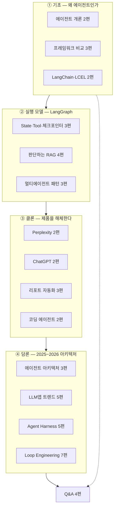
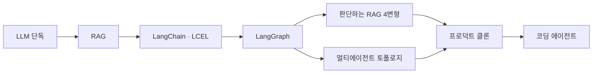
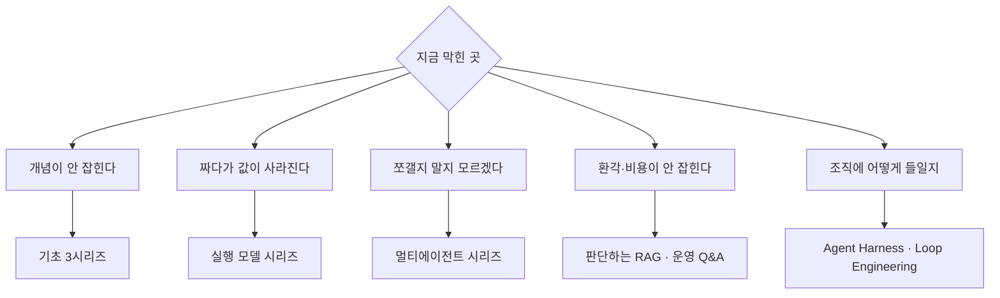

이 카테고리는 이 글을 포함해 51편이다. 순서대로 읽을 수도 있지만, 대부분은 **지금 부딪힌 문제**를 들고 온다. 이 글은 그 문제에서 편으로 가는 지도다.

한 가지만 먼저 말해 두면, 이 계보를 관통하는 문장은 하나다. **각 단계는 앞 단계의 표현력 한계를 풀고, 그 대가로 비용과 실패 지점을 늘린다.** 그래서 "왜 LangGraph를 쓰나" 같은 질문에 프레임워크 비교로 답하면 절반만 맞는다. 정확한 답은 "1회 검색으로 안 풀리는 질문이 실제로 있었다"는 문제 서술이다.

## 카테고리 구조

①~②가 구현 계보, ③이 적용, ④가 그 위에 얹히는 논의다. **④는 ①~③을 몰라도 읽히지만, ①~③은 ④의 문제의식이 없으면 왜 그렇게 짜는지가 안 보인다.**

## 개념 계보 — 각 단계는 무엇을 풀고 무엇을 만드는가

| 단계 | 앞 단계의 어떤 한계를 푸는가 | 대신 새로 생기는 문제 | 어디에 |
|---|---|---|---|
| **RAG** | LLM이 학습 시점 밖을 모른다 | 검색이 틀리면 답도 틀린다 | [에이전트란 무엇인가](/blog/ai-agent/agent-vs-chatbot/) |
| **LangChain·LCEL** | 벤더마다 SDK가 달라 조립이 안 된다 | 흐름이 단방향이라 재시도가 없다 | [구성요소와 LCEL](/blog/ai-agent/langchain-core-components/) |
| **LangGraph** | DAG로는 되돌아가는 흐름을 못 그린다 | 코드량·설계 부담이 늘어난다 | [State와 Reducer](/blog/ai-agent/langgraph-state-reducer/) |
| **판단하는 RAG** | 검색 실패를 시스템이 모른다 | 호출 횟수가 문서 수만큼 선형 증가 | [4종의 계보](/blog/ai-agent/agentic-rag-as-tool/) |
| **멀티에이전트** | 한 프롬프트에 역할이 뒤엉킨다 | 라우팅 비용·컨텍스트 오염·무한 루프 | [분할 경계와 토폴로지](/blog/ai-agent/when-to-split-agents/) |
| **프로덕트 클론** | 개념만으로는 UX 제약을 못 본다 | 인용 정합성·스트리밍이 새 과제로 | [화면에서 그래프 역추론](/blog/ai-agent/reverse-engineering-agent-graph/) |
| **코딩 에이전트** | 생성만 하고 검증하지 않는다 | 임의 코드 실행 = 신뢰 경계 붕괴 | [실행 권한을 주는 순간](/blog/ai-agent/code-execution-sandbox-limits/) |

## 문제에서 편으로

구체적인 질문 단위로는 이렇게 갈린다.

| 이런 질문이라면 | 펼 곳 | 답의 축 |
|---|---|---|
| 에이전트가 무엇인가 | [에이전트란 무엇인가](/blog/ai-agent/agent-vs-chatbot/) | 도구는 절반. **계획 + 자기검토 루프**가 본체 |
| 워크플로와 무엇이 다른가 | [경로를 누가 정하는가](/blog/ai-agent/agent-vs-workflow/) | 경로를 사람이 정했나 LLM이 정하나 |
| 어떤 프레임워크를 쓰나 | [제어권을 얼마나 쥘 것인가](/blog/ai-agent/agent-framework-comparison/) | 추상화와 제어권은 반비례한다 |
| 청크 크기를 어떻게 정하나 | [RAG 파이프라인 만들기](/blog/ai-agent/langchain-rag-pipeline/) | 글자 수가 아니라 **답변에 필요한 최소 의미 단위** |
| 상태 설계에서 중요한 결정은 | [State와 Reducer](/blog/ai-agent/langgraph-state-reducer/) | 필드 목록이 아니라 **필드별 병합 정책** |
| 멀티유저 대화가 섞인다 | [체크포인터·HITL](/blog/ai-agent/langgraph-checkpointer-hitl/) | `thread_id` 단위 발급. 공유하면 섞인다 |
| 사람 승인을 어떻게 넣나 | [체크포인터·HITL](/blog/ai-agent/langgraph-checkpointer-hitl/) | 결정과 실행이 분리돼야 그 틈에 게이트가 들어간다 |
| 환각을 어떻게 막나 | [groundedness와 그 대가](/blog/ai-agent/groundedness-cost-limits/) | groundedness는 측정, factuality는 미보장 |
| 언제 에이전트를 쪼개나 | [분할 경계와 토폴로지](/blog/ai-agent/when-to-split-agents/) | 도구 개수가 아니라 **프롬프트 충돌** |
| 무한 루프를 어떻게 막나 | [Supervisor의 대가](/blog/ai-agent/supervisor-pattern-cost/) | `recursion_limit`은 안전벨트. 해법은 종료 조건 명문화 |
| 병렬 처리는 어떻게 | [Send()로 갈래 만들기](/blog/ai-agent/send-map-reduce-report/) | 노드 내부는 비동기, 그래프는 팬아웃. 가변이면 `Send()` |
| 일부 분기가 실패하면 | [부분 실패 마감](/blog/ai-agent/tool-contract-and-partial-failure/) | 성공분으로 마감 + **한계 명시** |
| 출력 포맷을 어떻게 보장하나 | [부분 실패 마감](/blog/ai-agent/tool-contract-and-partial-failure/) | 분기에 쓰는 값은 스키마, 산문은 프롬프트 목차 |
| 코드 실행 도구는 안전한가 | [실행 권한을 주는 순간](/blog/ai-agent/code-execution-sandbox-limits/) | `work_dir`은 보안 경계가 아니다 |
| 완성 제품 구조를 어떻게 추론하나 | [화면에서 그래프 역추론](/blog/ai-agent/reverse-engineering-agent-graph/) | 관찰과 추정을 문장에서 가른다 |
| 인용의 신뢰성은 | [인용 정합성](/blog/ai-agent/focus-routing-and-citations/) | 프롬프트가 아니라 **상태 설계 문제** |
| 진행 상황을 어떻게 보여주나 | [노트북을 서비스로](/blog/ai-agent/notebook-to-service/) | 노드 경계 스트림으로는 토큰이 안 나온다 |
| 모델을 바꿨는데 왜 안 좋아지나 | [Agent = Model + Harness](/blog/ai-agent/agent-equals-model-plus-harness/) | 실행 구조가 배포 시점에 고정돼 있다 |
| 조직에 어떻게 들이나 | [AX 실행 프레임워크](/blog/ai-agent/enterprise-ai-adoption-actions/) | 모델 선택보다 **권한 등급 설계**가 먼저 |

## 한 장 요약

### 프레임워크 3종

| 축 | CrewAI | AutoGen | LangGraph |
|---|---|---|---|
| 은유 | 조립 라인 | 회의실 | 상태 기계 |
| 1급 개념 | Agent · Task · Crew · Process | ConversableAgent · GroupChat | State · Node · Edge |
| 추상화 | 높음 | 중간 | **낮음** |
| 흐름 형태 | 순차·계층 Process | 대화 턴의 연쇄 | **사이클 허용 그래프** |
| 종료 | Task 소진 시 **자동** | **수동 설계 필수** | 조건부 엣지 + 재귀 한도 |
| 코드 실행 | 기본 비활성 | 기본 시나리오 | 도구로 별도 구성 |
| 중단·재개 | 약함 | 약함 | **체크포인터 내장** |
| 적합 상황 | 형식 고정 리포트 | 생성-실행 검토 루프 | 운영 투입할 신뢰성 |

> **추상화 수준과 제어권은 반비례한다.**
>
> 그리고 흐름이 선형이면 애초에 에이전트를 쓰지 않고 체인으로 끝내는 선택지가 있다. 이것을 빼놓지 않는 것이 실무 감각이다.

### 판단하는 RAG 4변형

| 구분 | Agentic RAG | Self-RAG | CRAG | Adaptive RAG |
|---|---|---|---|---|
| 무엇을 판정 | 검색 필요 여부 + 관련성 | 관련성 · 환각 · 적합성 | 관련성 | 라우팅 + 위 3종 |
| Grader 수 | 1 | 3 | 1 | 4 |
| 되돌아가는 곳 | `rewrite → agent` | 재검색·재생성 자기루프 | 없음(DAG) | Self-RAG와 동일 |
| 막는 실패 | 불필요한 검색 | 환각·동문서답 | 근거 부재 | 위 전부 |
| 최소 LLM 호출 | 3회 | N+3회 | N+1회 | N+4회 |
| 루프 상한 | `recursion_limit`만 | **없음** | 해당 없음 | **없음** |

> 위 호출 횟수는 실측이 아니라 **코드에서 경로를 센 값**이다(N = 검색 문서 수). 지연·비용 벤치마크는 별도로 재야 한다.

### 멀티에이전트 토폴로지 3종

| 기준 | Network | Supervisor | Hierarchical |
|---|---|---|---|
| 다음 순서를 정하는 주체 | 각 에이전트 자신 | Supervisor LLM | 상위 → 팀 Supervisor |
| 라우팅 LLM 호출 | 0 | 스텝당 1 | 스텝당 계층 수 |
| 종료 판정 | 각자 판단 → 불안정 | `FINISH`를 선택지로 명문화 | 각 층이 `FINISH` |
| 상태 격리 | 없음 | 없음 | **팀별 State 분리** |
| 워커가 늘 때 | 연결 수 폭증 | 라우터 프롬프트 비대 | 팀으로 묶어 흡수 |
| 적정 규모 | 2~3개 | 워커 3~6개 | 팀 2~4개 |

**격상 순서**: 단일 → 조건부 엣지 워크플로 → Supervisor → Hierarchical. 한 단계씩만 올린다.

## 주제 교차 지도

같은 주제가 여러 시리즈에 걸쳐 나온다. 한 주제를 깊게 볼 때는 **교차해서 읽어야** 층위가 잡힌다.

| 주제 | 기초 | 실행 모델 | 클론 | 담론 |
|---|---|---|---|---|
| 프레임워크 비교 | ★ | ○ | | ★ |
| RAG 파이프라인 | ★ | ★ | ○ | ○ |
| State·리듀서 | | ★ | ★ | |
| 도구 설계·docstring | ★ | ★ | ★ | ○ |
| 조건 분기·라우팅 | ○ | ★ | ★ | ○ |
| 구조화 출력 | ○ | ★ | ★ | |
| 종료 조건·루프 상한 | ○ | ★ | ★ | ★ |
| 비용·지연 | ○ | ★ | ★ | ★ |
| 병렬·팬아웃 | | ○ | ★ | |
| 스트리밍·UX | | ○ | ★ | ○ |
| 보안·격리 | ★ | ○ | ★ | ★ |
| 평가·관측 | | ○ | ○ | ★ |
| 조직·운영 | | | | ★ |

★ = 주력으로 다룸 · ○ = 부분적으로 다룸

주제별로 층위를 갖춰 읽으려면 이런 조합이 된다.

| 주제 | 조합 | 왜 이 조합인가 |
|---|---|---|
| 환각 대응 | [문제 제기](/blog/ai-agent/agent-vs-chatbot/) + [검증 루프](/blog/ai-agent/self-rag-grader-design/) + [보장 범위](/blog/ai-agent/groundedness-cost-limits/) | 원인 → 구조적 해법 → 한계까지 한 흐름 |
| 왜 그래프인가 | [체인의 한계](/blog/ai-agent/langchain-rag-pipeline/) + [사이클](/blog/ai-agent/langgraph-state-reducer/) + [동적 분기](/blog/ai-agent/send-map-reduce-report/) | 같은 논지를 **세 층위**로 |
| 비용 통제 | [단일 유지 판단](/blog/ai-agent/when-to-split-agents/) + [호출 횟수](/blog/ai-agent/crag-adaptive-rag-routing/) + [Supervisor 대가](/blog/ai-agent/supervisor-pattern-cost/) | 설계 판단이 곧 비용 판단 |
| 조직 운영 | [역할 3층](/blog/ai-agent/enterprise-ai-adoption-actions/) + [seed와 fork](/blog/ai-agent/self-evolving-seed-and-fork/) + [권한 등급](/blog/ai-agent/code-execution-sandbox-limits/) | 기술이 아니라 운영으로 답하는 3종 |

## 표현을 고를 때 조심할 것

에이전트 분야에는 마케팅성 과장과 학습용 단순화가 섞여 있다. 그대로 옮기면 근거를 대지 못한다.

| 부정확한 표현 | 왜 부정확한가 | 정확한 서술 |
|---|---|---|
| "환각을 0으로 만들었다" | 측정되는 것은 groundedness다 | 생성 결과를 문서 근거와 대조하는 검증 노드를 두어 **근거 없는 답변이 사용자에게 도달하는 경로를 차단**했다 |
| "Self-RAG를 구현했다" | 원논문은 reflection token을 학습시킨다 | 논문 아이디어를 **외부 LLM Grader 체인으로 근사 구현**한 것이며 학습 방식과는 다르다 |
| "성능이 N% 개선됐다" | 정량 벤치마크가 없는 경우가 대부분 | 정량 지표가 없다면 경로별 정답률·평균 지연·검색 호출 절감률처럼 **무엇을 잴 것인지**로 서술한다 |
| "멀티에이전트로 만들었다" | 관리자 없는 정적 파이프라인인 경우가 많다 | 순서가 고정된 구간은 조건부 엣지 워크플로이고, 유동적인 구간만 LLM 라우팅으로 뺐다 |
| "제품을 클론했다" | 5단계 중 3단계만 구현한 경우가 흔하다 | 검색·선별·생성만 구현했고 질의 분해와 후속 질문은 비워 두었다 |
| "스트리밍으로 진행을 보여준다" | `invoke()` 기반이면 스트리밍이 아니다 | 진행 표시는 호출자 루프 기준이고 그래프 이벤트 스트림은 아니다 |
| "이 코드를 그대로 쓰면 된다" | 폐기된 API와 필드 오매핑이 남아 있다 | 폐기 API가 무엇으로 대체됐는지, 어떤 오매핑이 있는지를 함께 적는다 |
| "LangGraph가 제일 좋다" | 우열 프레임이 성립하지 않는다 | 제어권을 얻는 대신 코드량을 낸다. 선형 흐름이면 체인이 짧다 |

> **공통 원리는 하나다 — 조건을 붙이면 주장이 성립하고, 조건을 떼면 근거가 사라진다.**
>
> "환각 0"이 위험한 이유도 같다. 측정 가능한 주장이라 검증 근거를 요구받는데, 실제로 측정된 것은 다른 값이기 때문이다.

## 도입 전 확인할 열 가지

에이전트를 조직에 들일 때 **기술 선택보다 먼저 정해져야 하는 것들**이다. 정해지지 않았다면 그 자체가 도입 리스크다.

| 축 | 확인할 것 | 정해지지 않으면 |
|---|---|---|
| 목적 | 사람의 반복 작업을 대체하려는가, 지금 못 하는 일을 하려는가 | 자동화 대상과 성공 기준이 흔들린다 |
| 평가 | 성공을 정답률·처리량·개입 감소율 중 무엇으로 판정하는가 | 좋아졌는지 알 방법이 없다 |
| 데이터 | 평가용 정답 세트가 있는가, 만들어야 하는가 | 판정기를 검증할 수단이 없다 |
| 비용 | 요청당 비용 상한이나 월 예산 가이드가 있는가 | 검증 루프를 몇 겹까지 붙일지 정할 수 없다 |
| 지연 | 사용자 대면 실시간 경로인가, 배치·비동기인가 | 실시간이면 N+4회 구조는 쓰지 못한다 |
| 권한 | 읽기·실행·쓰기·배포 중 어디까지 주는가 | 안전 설계의 출발점이 없다 |
| 게이트 | 되돌릴 수 없는 작업 앞에 사람 승인이 있는가 | 사고가 나야 경계를 알게 된다 |
| 운영 | 장애 시 온콜은 누가 받고 실행 로그는 어디에 남는가 | 사후 추적이 불가능하다 |
| 조직 | 유지 인원은 몇 명이고 어느 팀 소유인가 | 버스 팩터와 인지 비용이 잡히지 않는다 |
| 단계 | PoC인가, 운영 중인 것을 개선하는가 | 프레임워크 선택 근거가 완전히 달라진다 |

> **평가 세트가 없다면 도입 초기 3~4주를 판정 기준을 만드는 데 쓰는 편이 낫다.**
>
> 판정기를 검증할 방법이 없으면 검증 노드를 아무리 붙여도 품질이 올랐는지 알 수 없다.

## 통합 용어집

각 편의 용어표를 합친 것이다. 정의가 필요한 자리에서 되돌아오면 된다.

| 용어 | 한 줄 정의 |
|---|---|
| **RAG** | 외부 문서를 검색해 근거로 주입한 뒤 답을 생성하는 기법 |
| **Naive RAG** | 검색 1회 → 생성 1회로 끝나는 단방향 RAG. 검색 실패를 감지 못 함 |
| **Agentic RAG** | 검색 자체를 도구로 만들어 "검색이 필요한가"부터 판단하는 RAG |
| **Self-RAG** | 생성 후 환각·답변 적합성을 채점해 재생성·재검색하는 RAG |
| **CRAG** | 검색 문서가 부실하면 웹 검색으로 근거를 보정하는 RAG. 루프 없는 DAG |
| **Adaptive RAG** | 질문 유형으로 데이터소스를 라우팅한 뒤 검증을 붙인 통합형 |
| **Groundedness** | 답변이 주어진 문서에 근거하는가. 사실성(factuality)과 다름 |
| **Grader** | yes/no 등 정형 라벨을 뱉는 LLM 판정기 |
| **Pre / Post-Retrieval** | 검색 이전(청킹·임베딩·색인) / 검색 이후(재순위·선별) 단계 |
| **Chunking / Overlap** | 문서를 검색 단위로 자르는 것 / 경계 손실을 줄이려 앞 조각 끝을 겹치는 것 |
| **Embedding** | 텍스트를 의미를 담은 실수 벡터로 변환. 질문과 문서는 **같은 모델**이어야 함 |
| **Retriever** | 질문을 받아 관련 문서를 돌려주는 인터페이스 |
| **LCEL** | `\|`로 컴포넌트를 잇는 LangChain 표현식. 합성이 닫혀 있어 스트리밍·재시도가 따라옴 |
| **Runnable** | `invoke`/`stream`/`batch`를 갖는 LangChain 공통 인터페이스 |
| **StateGraph** | 상태 스키마를 받아 노드·엣지를 조립하는 LangGraph 그래프 빌더 |
| **Node / Edge** | 상태를 받아 **부분 업데이트**를 반환하는 함수 / 다음 노드로의 연결 |
| **Conditional Edge** | 함수 반환값으로 다음 노드를 고르는 분기. 사이클의 출발점 |
| **Reducer** | 기존 채널 값과 노드 반환값을 어떻게 합칠지 정하는 채널별 병합 규칙 |
| **`add_messages`** | 메시지 전용 리듀서. 누적 + id 기반 upsert + 타입 정규화 |
| **Tool / `bind_tools`** | LLM이 호출할 외부 기능 / LLM에게 도구 목록을 인지시키는 바인딩(결정) |
| **ToolNode** | `tool_calls`를 실제로 실행해 결과 메시지를 반환하는 노드(실행) |
| **`tool_call_id`** | 도구 호출 요청과 그 결과를 잇는 식별자 |
| **ReAct** | 추론 → 도구 호출 → 관찰을 반복하는 에이전트 패턴 |
| **Checkpointer** | 스텝별 상태를 저장·복원하는 지속성 계층. HITL의 전제 조건 |
| **`thread_id`** | 대화 세션을 가르는 키. 잘못 공유하면 대화가 섞이는 사고 |
| **HITL / `interrupt_before`** | 실행 도중 사람이 승인·수정하는 구조 / 지정 노드 직전에 정지시키는 옵션 |
| **`Send()`** | 런타임에 분기와 전용 입력을 발행하는 Map-Reduce용 객체 |
| **Fan-out / Fan-in** | 여러 갈래로 퍼뜨렸다가 다시 하나로 모으는 그래프 형태 |
| **Supervisor / Hierarchical** | 관리자 1명이 워커에 배정하는 구조 / 그 관리자를 계층으로 중첩한 구조 |
| **`recursion_limit`** | 그래프가 밟을 수 있는 최대 스텝 수. 안전벨트지 설계가 아님 |
| **Structured Output** | 출력을 스키마로 강제해 파싱 실패를 없애는 기능. 그래프 안정성의 전제 |
| **`create_react_agent`** | ReAct 루프를 완성해 주는 프리빌트 에이전트 팩토리 |
| **Prompt Injection** | 외부 문서에 심긴 지시가 에이전트를 조종하는 공격. 실행기가 붙으면 곧 코드 실행 |
| **Sandbox** | 임의 코드를 호스트와 격리해 실행하는 장치. 작업 디렉터리 지정은 샌드박스가 아님 |
| **Self-Correction** | 생성 → 실행·검증 → 오류를 입력으로 되먹여 재생성하는 순환 |
| **Escalation** | 자동 수정 한계에 도달했을 때 시도 이력과 함께 사람에게 넘기는 것 |
| **MCP** | 도구·데이터 소스를 표준 인터페이스로 연결하는 프로토콜. M×N 연동을 M+N으로 바꾼다 |
| **A2A** | 에이전트끼리 협업하기 위한 상위 계층 프로토콜 |
| **Agent Harness** | 모델을 감싸는 실행 구조. 컨텍스트·도구·메모리·훅의 집합 |
| **Loop Engineering** | 모델 호출 이후의 실패·기록·승인·판정을 설계하는 것 |
| **Context Offloading** | 컨텍스트를 파일로 밀어내고 필요할 때 다시 읽는 기법 |

---

읽는 순서가 정해지지 않았다면 **④ 담론부터 한 편**을 권한다. [Agent = Model + Harness](/blog/ai-agent/agent-equals-model-plus-harness/)가 "왜 모델을 바꿔도 제품이 안 좋아지는가"를 다루는데, 이 질문이 나머지 50편이 답하려는 것의 요약이기 때문이다.

반복해 돌아오는 질문들은 네 편의 문답으로 따로 모아 두었다 — [기본기](/blog/ai-agent/ai-agent-qna-fundamentals/) · [실행 모델](/blog/ai-agent/ai-agent-qna-execution/) · [멀티에이전트](/blog/ai-agent/ai-agent-qna-multi-agent/) · [운영](/blog/ai-agent/ai-agent-qna-operations/).
