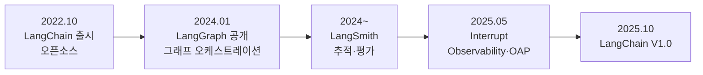
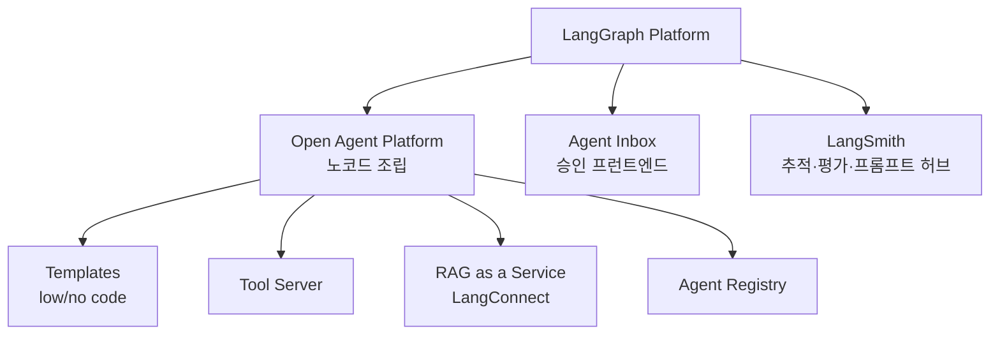
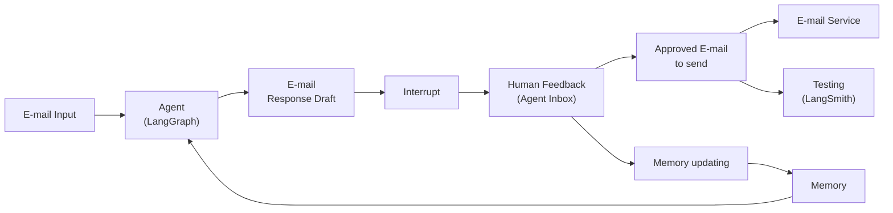
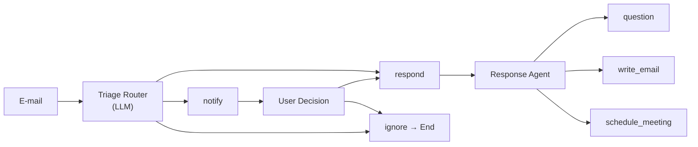

챗봇 UI에는 구조적 제약이 하나 있다. **한 번에 한 가지 대화만 가능하다.** 에이전트가 3분짜리 리서치를 도는 동안 그 창에서는 다른 일을 시킬 수 없고, 사용자는 앉아서 기다리거나 창을 떠난다.

이 제약을 정면으로 다룬 것이 2025년 5월 LangChain의 첫 공식 개발자 컨퍼런스 Interrupt였다. 1일차는 핸즈온, 2일차는 도입 사례로 구성됐고, 발표 전반을 관통한 명제가 **"여러 에이전트를 동시에 실행하되 필요할 때만 사람을 부른다"였다**. 그런데 사람을 부르는 순간 승인 UI·상태 관리·프런트엔드가 따라오고, 자료는 그 대가를 숨기지 않는다 — "간단한 이메일 어시스턴트도 복잡해진다."

이 글은 그 전환과 대가를 함께 본다. [앞 편](/blog/ai-agent/llm-app-bottleneck-shift/)에서 병목이 품질로 옮겨 갔다는 진단을 했고, 여기서는 제품 형태 쪽 변화를 다룬다. 승인 게이트를 어디에 놓을 것인가는 [자율성의 상한을 오류 비용으로 긋는 문제](/blog/ai-agent/agent-vs-workflow/)의 제품 버전이기도 하다.

> 이 글은 **2025년 5월과 7월의 자료를 정리한 것**이다. 제품명·기능 구성은 그 시점의 것이며, 이후 갱신되지 않았다.

## 용어 정리

앞 편의 용어표에서 이 글이 쓰는 행만 추리고, 제품 이름을 더했다.

| 용어 | 원어 / 표기 | 뜻 |
|---|---|---|
| Ambient Agent | Ambient Agent | 채팅창에서 사람이 말을 걸어야 움직이는 것이 아니라, 배경에서 이벤트를 받아 상시 동작하는 에이전트 |
| HITL | Human-in-the-Loop | 에이전트 실행 도중 사람의 승인·수정·피드백을 끼워 넣는 설계 |
| Interrupt(기능) | interrupt | 그래프 실행을 특정 지점에서 멈추고 사람의 입력을 기다리는 기능. 컨퍼런스 이름과 동음이의 |
| Durable Execution | Durable Execution | 실행 상태를 저장해 중단·재개·재시도가 가능하게 만드는 실행 모델 |
| Context Engineering | Context Engineering | 시스템 프롬프트·대화·툴 메시지·문서를 하나의 조립 대상으로 설계하는 일 |
| LangGraph | LangGraph | 2024년 1월 공개된 에이전트 오케스트레이션 라이브러리. [State와 Reducer 편](/blog/ai-agent/langgraph-state-reducer/) 참조 |
| LangSmith | LangSmith | 추적(trace)·데이터셋·실험 비교·프롬프트 허브를 제공하는 관측·평가 SaaS |
| LangGraph Platform | — | LangGraph로 만든 에이전트를 배포·운영하는 매니지드 실행 환경 |
| OAP | Open Agent Platform | LangGraph Platform 위에서 코딩 없이 에이전트를 조립하는 오픈소스 플랫폼 |
| LangConnect | LangConnect | RAG 전용 서버. [RAG as a Service 편](/blog/ai-agent/mcp-rag-as-service/) 참조 |
| Agent Inbox | Agent Inbox | 에이전트가 사람의 승인을 요청할 때 사용하는 프런트엔드. 받은편지함 같은 UI |
| Arcade | Arcade | 에이전트와 외부 도구 사이에 놓이는 도구 관리·인증 게이트웨이 |
| Citizen Developer | Citizen Developer | 전문 개발자가 아니면서 사내 도구를 직접 만드는 실무자 |
| Agent Engineer | Agent Engineer | 프롬프트·엔지니어링·제품·머신러닝을 겹쳐 가진, 에이전트 제품을 만드는 새 직무 정의 |

## 무엇이 발표됐나 — 실무 영향도로 정렬

| 구분 | 세션 / 발표 | 핵심 메시지 | 실무 영향도 |
|---|---|---|---|
| 핸즈온 | LangGraph 소개 · Tools | 그래프 구조로 흐름을 정의하고 노드 단위로 도구를 붙인다 | 중 |
| 핸즈온 | LangSmith Evaluation | 데이터셋·평가자·실험 비교를 제품 기능으로 제공 | **높음** ★ |
| 핸즈온 | Memory | 단기/장기 메모리 분리, 사람 피드백으로 장기 메모리 갱신 | **높음** ★ |
| 핸즈온 | Agent Inbox | 사람 승인 UI를 별도 프런트엔드로 분리 | **높음** ★ |
| 키노트 | LangChain의 여정 | 오픈소스 → 회사. "프로토타입은 쉽지만 프로덕션은 어렵다" | 중 |
| 키노트 | Agent의 미래 3대 명제 | 모델 다양성 · 컨텍스트 · 팀 스포츠 | **높음** ★ |
| 런치 | AI Observability in LangSmith | 메트릭 3계층(Traditional·Business·Qualitative) 공개 | **높음** ★ |
| 런치 | Trajectory Observability | 실행 경로 단위 지연·호출 추적 | **높음** ★ |
| 런치 | Tool Metric Observability | 도구별 호출 횟수 추적 | 높음 |
| 런치 | Open Agent Platform | 노코드 에이전트 빌더 공개 | 중 |
| 런치 | Prompting: Playground & Hub | 프롬프트 버저닝을 제품화 | 높음 |
| 사례 | Ambient Agent / Email Assistant | 채팅 UX 탈피 + HITL | **높음** ★ |
| 사례 | Nu Bank, LinkedIn, Uber, Cisco, BlackRock | 이미 프로덕션에 올라가 있음 | 중 |
| Fireside | Andrew Ng | 완벽한 평가보다 "20분 만에 빠르게 평가하는 능력" | **높음** ★ |
| 비즈니스 | 시장 가치 논의 | "이 기능이 얼마 $ 를 벌어다 줍니까?" | 높음 |

열다섯 항목 중 ★ 표시가 여덟이고, 그중 넷(Evaluation·Observability 셋)이 [평가·관측 편](/blog/ai-agent/agent-evaluation-observability/) 소관이다. 이 글이 맡는 것은 Memory·Agent Inbox·3대 명제·Ambient Agent 넷이다.

### 다음 분기 계획을 바꿀 만한 것 다섯

| # | 항목 | 왜 바로 영향인가 | 조직이 해야 할 일 |
|---|---|---|---|
| 1 | 메트릭 3계층 공개 | 비개발자와 공유 가능한 품질 언어가 생김 | 대시보드에 Business Metrics 행을 추가 |
| 2 | Trajectory / Tool 관측 | 에이전트 장애가 "어느 단계에서" 났는지 특정 가능 | 추적 도입을 배포 전제 조건으로 |
| 3 | HITL(Interrupt) 표준화 | 위험한 액션에 승인 게이트를 넣는 패턴이 제품화됨 | 승인 필요 액션 목록을 먼저 정의 |
| 4 | 프롬프트 허브 버저닝 | 프롬프트를 코드처럼 관리하는 방식이 확립 | 프롬프트를 리포지터리 밖으로 빼고 버전 태깅 |
| 5 | "에이전트 개발은 팀 스포츠" | 개발자 1인 책임 구조를 깨는 명분 | PM·도메인 전문가를 평가 데이터셋 작성에 참여시킴 |

오른쪽 열이 전부 **조직 행위**라는 점이 이 표의 성격을 말한다. 다섯 중 어느 것도 "라이브러리를 업그레이드하라"가 아니다. 3번의 "승인 필요 액션 목록을 먼저 정의"가 특히 그런데, 이것은 코드 작업이 아니라 합의 작업이고 대개 코드보다 오래 걸린다.

## 오픈소스가 회사가 된 이유

| 시점 | 사건 | 성격 |
|---|---|---|
| 2022.10 | LangChain 출시 | 오픈소스 프로젝트에서 시작. 프로토타이핑 용이성 → 프로덕션급 구축 지원으로 확장 |
| 2024.01 | LangGraph 공개 | 그래프 형식의 유연한 구조 / State 관리 / 장·단기 메모리 / 디버깅 툴 / 쉬운 배포 |
| 2024~ | LangSmith 확장 | 여러 명이 LLM 앱 개발에 참여하는 협업 플랫폼으로 재정의 |
| 2025.05 | Interrupt 컨퍼런스 | AI Observability, Trajectory 관측, Open Agent Platform, LangConnect 공개 |
| 2025.10 | LangChain V1.0 | 문서 페이지 전면 개편, Agent Builder 신청 개시 |

**도식은 다섯 마디인데 표도 다섯 행이지만, 표에만 "성격" 열이 있다.** 도식이 시간 순서를 그린다면 표는 각 시점에서 무엇이 달라졌는지를 적는데, 세로로 읽으면 하나의 방향이 나온다 — 프로토타이핑 → 실행 구조 → 관측 → 운영 → 노코드. **아래로 갈수록 개발자에게서 멀어진다.**

> "Building an LLM app is easy at first... but getting to production is hard."
>
> 키노트 슬라이드는 이것을 곡선으로 그렸다. 프로토타입 구간에서 우상향하다가 프로덕션 경계에서 급락한 뒤 다시 오르는 형태다. 오픈소스가 회사가 된 이유를 한 장으로 설명한 셈인데, 급락 구간에 필요한 것들(관측·평가·배포·승인 UI)이 전부 오픈소스 라이브러리로는 채우기 어려운 것들이기 때문이다.

### Agent의 미래 3대 명제

| # | 명제 | 근거 | 제품적 귀결 |
|---|---|---|---|
| 1 | 에이전트는 다양한 모델에 의존한다 | 모델마다 잘하는 분야가 다름(코딩, 글쓰기 등). 적재적소 배치가 중요 | 프레임워크가 모델 추상화 계층이 되어야 함 |
| 2 | 신뢰할 수 있는 에이전트는 올바른 컨텍스트에서 시작한다 | 프롬프트는 단 하나의 문자열이 아님 — System / 대화내용 / Tool 메시지 / 문서로 구성 | Context Engineering. LangGraph는 Low Level에서 맥락을 세밀히 조정하려고 만들어짐 |
| 3 | 에이전트를 만드는 것은 팀 스포츠다 | 에이전트 개발이 개발자 1인의 온전한 책임이 아님 | LangSmith를 여러 명이 참여하는 플랫폼으로 확장 |

> **2번이 이 시리즈에서 가장 자주 인용되는 명제다. "프롬프트는 단 하나의 문자열이 아니다."**
>
> 이 문장이 관점을 바꾸는 이유는 작업 단위를 바꾸기 때문이다. 프롬프트가 문자열이면 개선 작업은 문장을 고치는 일이고, 조립 대상이면 **무엇을 넣고 무엇을 뺄지 정하는 일**이 된다. 후자에서는 검색 결과를 몇 개 넣을지, 대화 이력을 어디서 자를지, 도구 응답을 요약할지가 전부 같은 층위의 결정이 된다. [앞 편의 배팅 우선순위 2위](/blog/ai-agent/llm-app-bottleneck-shift/)가 이것이다.

명제 2를 뒷받침하는 기능 다섯이 함께 제시됐다.

| 기능 | 역할 |
|---|---|
| Streaming | 중간 산출을 흘려보내 대기 UX를 만든다 |
| Human-in-the-loop | 실행을 멈추고 사람의 판단을 받는다 |
| Short Term Memory | 한 세션 안의 대화 상태를 유지한다 |
| Long Term Memory | 세션을 넘어 선호·사실을 축적한다 |
| Durable Execution | 중단·재개·재시도가 가능한 실행을 보장한다 |

다섯 중 둘(HITL·Durable Execution)이 아래 Email Assistant의 뼈대가 된다. 그리고 이 둘은 짝으로만 성립하는데, 실행을 멈추려면 멈춘 지점의 상태를 어딘가에 저장해야 하기 때문이다 — 그 인과는 [체크포인터와 HITL 편](/blog/ai-agent/langgraph-checkpointer-hitl/)에 상태 전이도와 함께 있다.

명제 3에 붙은 것이 새 직무 정의다.

| 재료 | 내용 |
|---|---|
| Prompt | 모든 요소에 들어가고 영향을 미치는 중요한 요소 |
| Engineering | Ops, 배포 |
| Product | 제품에 대한 이해, 에이전트 활용에 대한 깊은 고민 |
| Machine Learning | Evals, Test, Metrics, Fine Tuning |

네 재료가 기존 직무 넷에 하나씩 대응한다는 점이 이 정의의 주장이다. 어느 하나의 확장이 아니라 **교집합**이라 기존 조직도에 자리가 없고, 그래서 "팀 스포츠"라는 표현이 따라 나온다.

## 생태계 지도

| 구성요소 | 정체 | 해결하는 문제 |
|---|---|---|
| Open Agent Platform | LangGraph Platform 기반 노코드 빌더 | 개발자가 아니어도 에이전트를 조립 |
| LangConnect | FastAPI 기반 RAG 전용 REST 서버 | 벡터스토어 운영을 서비스로 분리 |
| Agent Inbox | 승인 대기 항목을 보여주는 프런트엔드 | HITL의 사용자 접점 |
| Arcade | 도구 관리 + 인증 게이트웨이 | 에이전트마다 도구 인증을 다시 짜는 문제 |
| LangGraph Studio V2 | 시각 디버깅 도구 | 누구나 공개·원클릭 배포 |
| prebuilt Agent | ReAct Agent, Supervisor Agent 등 | AI 지식이 없어도 시작 가능 |

**도식은 노드 여덟인데 표는 여섯 행이다.** 표에만 있는 것이 Arcade와 Studio V2인데, 둘 다 플랫폼 트리에 매달리지 않고 옆에 붙는 것들이라 도식에 자리가 없었다. Arcade의 위치는 별도로 그려졌다 — 왼쪽에 AI 시스템(모델·에이전트 프레임워크), 오른쪽에 Tools & MCP Servers(Calendar·Gmail·Drive·Slack·Notion 등), 그 사이에 **Tool Management + Authentication Gateway**를 놓는 구조다. 도구 인증을 에이전트마다 다시 짜지 않으려면 중간에 계층이 하나 필요하다는 것이 이 그림의 주장이고, 같은 문제를 사내 지식베이스에 적용한 것이 [MCP RAG의 3중 방어 구조](/blog/ai-agent/mcp-rag-as-service/)다.

## 왜 채팅 UX를 벗어나야 하나

| 관점 | 내용 |
|---|---|
| 문제 | 대화창 UX에 의존. 일부 사용자에게는 유용하나 제한이 됨 — **한 번에 한 가지 대화만 가능** |
| 요구 | UX 패러다임 shift. 채팅에만 의존하지 말고 **여러 에이전트를 동시에 실행** |
| 관건 | 여기서 중요한 역할이 Human-in-the-loop |
| HITL의 효용 | ① 에이전트 판단의 위험성을 낮춤 ② 인간의 커뮤니케이션 방식을 모방해 사용자–에이전트 간 신뢰 구축 ③ 장기 기억의 학습을 강화 |
| 예시 | Email → 답장 ("어조를 business 형식에 맞게 교정해줘") |

> **네 번째 행의 세 효용 중 셋째가 이 절의 숨은 논지다.**
>
> ①과 ②는 HITL을 비용으로 놓고 그 값어치를 설명한다 — 사람을 부르는 대신 안전과 신뢰를 얻는다는 거래다. 그런데 ③은 성격이 다르다. 사람의 개입이 장기 메모리로 회수되면 개입 횟수 자체가 시간이 지나며 줄어든다. **HITL을 고정 비용이 아니라 감소하는 비용으로 설계할 수 있다**는 뜻이고, 아래 메모리 루프가 그 구현이다.

### Email Assistant 레퍼런스 아키텍처

컨퍼런스 핸즈온과 7월 자료 양쪽에 동일하게 등장하는 구조도다. "에이전트 제품의 최소 완성형"으로 반복 인용된다.

| 블록 | 역할 | 대응 제품 |
|---|---|---|
| Agent | 이메일을 읽고 초안을 만든다 | LangGraph |
| Interrupt | 초안 상태로 실행을 멈춘다 | LangGraph interrupt |
| Human Feedback | 사람이 승인·수정·무시를 고른다 | Agent Inbox |
| Memory updating | 사람의 선택을 선호로 환원해 저장한다 | Long Term Memory |
| Memory | 다음 실행에 선호를 주입한다 | Store |
| Testing | 승인된 결과로 에이전트 테스트를 돌린다 | LangSmith |

> **사람의 승인 행위가 두 갈래로 재사용된다.** 하나는 실제 발송이고, 다른 하나는 회귀 테스트 자산이다.
>
> 도식에서 `F`가 `G`와 `H`로 동시에 갈라지는 지점이 그것이다. 이 분기가 값을 하는 이유는 평가 데이터셋 구축이 별도 프로젝트가 되지 않기 때문이다 — 사람이 "이 초안 괜찮다"고 누른 순간 그것이 곧 정답 레이블이 된다. **운영이 곧 평가 데이터 수집**인 구조이고, [평가·관측 편](/blog/ai-agent/agent-evaluation-observability/)의 온라인 평가가 여기서 이어진다.

### Triage Router와 Interrupt 4종

Triage Router는 일반적인 쿼리 라우터와 비슷하지만 **Interrupt의 종류를 라우팅**한다는 점이 다르다.

1차 분기는 Triage Router의 판정이다.

| 판정 | 처리 |
|---|---|
| respond | 곧바로 Response Agent로 |
| notify | 사람에게 알림 → 사람이 respond / ignore 선택 |
| ignore | 종료 |

2차 분기는 Response Agent의 각 도구 호출 앞에서 사람이 고르는 네 갈래다.

| Interrupt 종류 | 의미 | 결과 |
|---|---|---|
| ignore | 도구 호출을 무시 | End |
| respond | 에이전트에게 피드백을 준다 (질문에 답, 이메일 작성 방향 지시, 회의 재시도 지시) | Feedback message로 루프 재진입 |
| accept | 도구 호출을 그대로 승인 | Invoke tool → Done |
| edit | 도구 호출 인자를 직접 수정 | edited tool args로 Invoke tool → Done |

**도식은 분기가 두 층인데 표는 3행과 4행으로 나뉘어 일곱 갈래다.** 도식이 `Response Agent` 아래 세 도구를 그리는 반면 표는 그 도구 앞에 놓이는 승인 선택지 넷을 편다 — 도식은 무엇을 실행하는가를, 표는 실행 직전에 사람이 무엇을 할 수 있는가를 말한다. 두 층이 곱해지므로 실제 경로 수는 도식만 봐서는 나오지 않는다.

> **승인을 Yes/No 이분법으로 만들면 사람이 매번 처음부터 다시 지시해야 한다.**
>
> `edit`(인자만 고침)과 `respond`(방향만 알려줌)를 분리한 것이 이 패턴의 핵심이다. "아니오"만 있으면 사람은 거절한 뒤 자기가 직접 하거나 프롬프트를 다시 쓰게 되고, 그러면 에이전트를 쓰는 의미가 절반 사라진다. 네 갈래는 **거절의 이유를 구조화한 것**이고, 그 구조가 아래 메모리 루프의 입력이 된다.

### 사람의 개입을 학습 신호로 회수한다

| 단계 | 내용 |
|---|---|
| 수집 | Human Feedback(Agent Inbox)에서 사람의 선택·수정 내용을 받는다 |
| 반영 | Memory updating 노드가 이를 선호(preference)로 변환 |
| 저장 | 장기 메모리에 저장 — 저장된 정보는 전체 시스템에 유지 |
| 재사용 | 다음 실행 때 Agent가 메모리를 읽고 초안 품질을 높인다 |

핵심 문구는 **"Human Feedback > Memory Update"와** **"Learn preferences over time"이다**. 네 단계 중 2번이 가장 어려운 자리인데, `edit`으로 고쳐진 인자 하나를 "이 사람은 회의를 오후에 잡는 것을 선호한다"로 일반화하는 일이 자동으로 되지 않기 때문이다. 개별 수정을 선호로 승격하는 규칙이 없으면 메모리는 수정 로그가 될 뿐이다.

### 그리고 그 대가

| 계층 | 담당 | 내용 |
|---|---|---|
| Backend | LangGraph | 사용자 워크플로 정의 / 다양한 옵션 코딩 |
| Frontend | Agent Inbox | AI 출력을 사용자에게 제시 / 워크플로에 따른 사용자 옵션 변경 |
| 대가 | 복잡성 증가 | **"간단한 이메일 어시스턴트도 복잡해짐"** |

> **HITL을 제대로 넣으면 제품 신뢰도는 올라가지만, 가장 단순한 어시스턴트조차 상태·분기·UI가 붙으면서 복잡해진다.**
>
> 원 자료가 이 경고를 명시적으로 남겼다는 점이 중요하다. "Interrupt를 넣자"는 결정은 그래프에 노드 하나를 추가하는 일이 아니라 **프런트엔드 작업과 상태 관리 비용을 동반하는 결정**이다. 위 표 두 번째 행이 그것을 말한다 — 승인 선택지가 워크플로마다 다르면 프런트엔드가 그 차이를 알아야 하고, 그러면 백엔드와 프런트엔드 사이에 계약이 하나 더 생긴다.

---

여기까지가 제품 형태의 전환이다. 채팅창에서 나와 배경으로 가고, 위험한 지점에서만 사람을 부르고, 그 개입을 선호로 회수한다.

그런데 이 구조를 세우고 나면 답할 수 없는 질문이 하나 남는다. **"이 에이전트, 잘 되고 있나요?"** 라우팅이 틀린 것인지 도구 선택이 틀린 것인지 최종 문장이 나쁜 것인지가 구분되지 않으면 이 질문에 답할 방법이 없고, 승인 데이터가 쌓여도 무엇을 개선했는지 말할 수 없다. [다음 편](/blog/ai-agent/agent-evaluation-observability/)에서 평가 지점을 세 계층으로 쪼개고, 오프라인·온라인·루프 세 방식을 목적별로 가른다.
