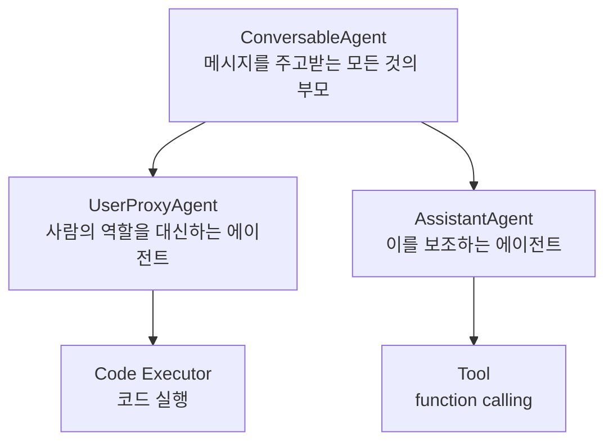
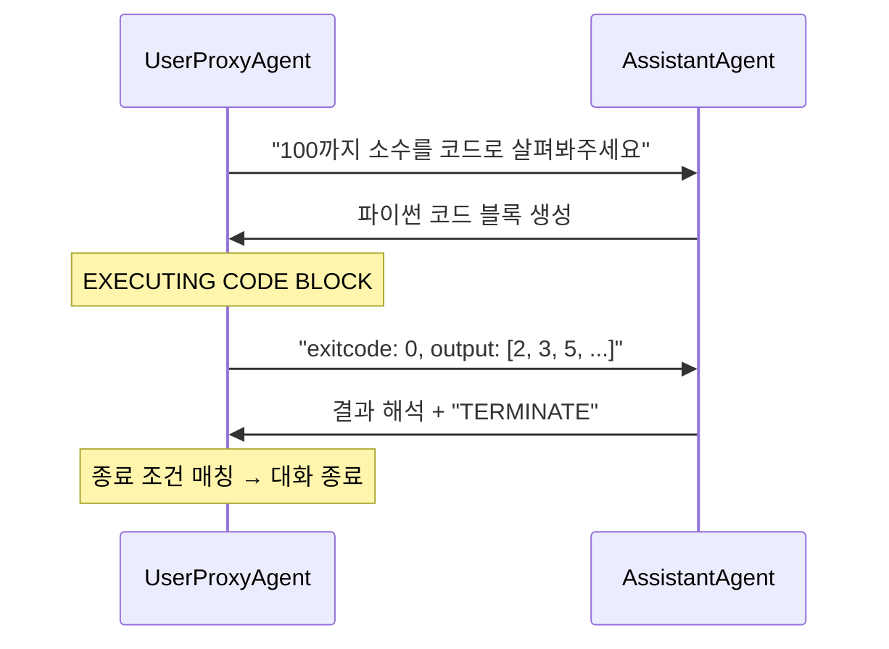
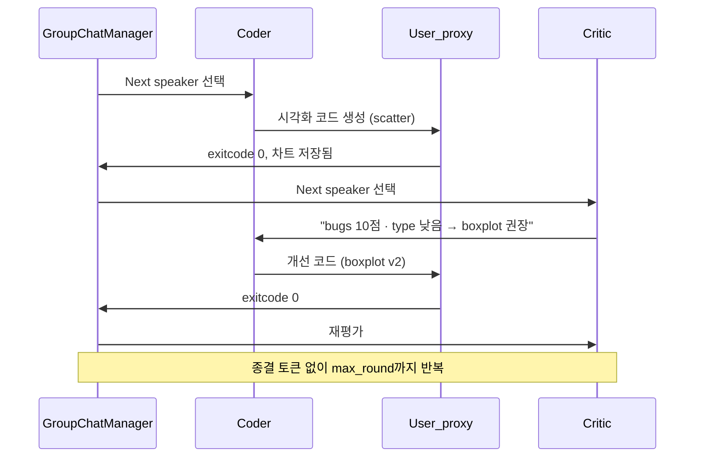
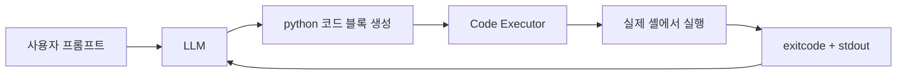

CrewAI에서는 "언제 끝나는가"를 물을 필요가 없다. Task 리스트가 유한하기 때문이다. AutoGen에서는 그 질문이 **설계의 출발점**이 된다. 대화가 실행 모델이므로 끝은 구조가 주지 않고 사람이 설계해야 한다.

그리고 대화가 실행 모델이라는 것은 대개 **코드 실행 권한**을 동반한다는 뜻이기도 하다. 생성 담당이 코드를 쓰고 실행 담당이 돌려 결과를 되먹이는 루프가 AutoGen의 기본 시나리오이기 때문이다. 이 글은 AutoGen의 대화 패턴과 종료 조건을 다루고, 실행기가 붙는 순간 무엇이 달라지는지를 신뢰 경계 관점으로 정리한 뒤, 두 프레임워크가 각각 어디서 무너지는지로 마무리한다. 앞 편들은 [Agent·Task·Crew](/blog/ai-agent/crewai-agent-task-crew/)와 [Tool 설계](/blog/ai-agent/agent-tool-design/)에 있다.

## 용어 정리

| 약어 / 용어 | 원어 | 뜻 |
|---|---|---|
| ConversableAgent | Conversable Agent | AutoGen의 최상위 에이전트 추상. 메시지를 주고받을 수 있는 모든 에이전트의 부모 |
| AssistantAgent | Assistant Agent | LLM으로 답·코드를 **생성**하는 AutoGen 에이전트 |
| UserProxyAgent | User Proxy Agent | 사람 역할을 대리. 코드를 **실행**하고 결과를 되돌려주는 AutoGen 에이전트 |
| GroupChat | Group Chat | 3인 이상 에이전트가 한 방에서 대화하는 AutoGen 패턴 |
| GroupChatManager | Group Chat Manager | GroupChat에서 **다음 발화자를 선택**하는 사회자 에이전트 |
| Code Executor | Code Executor | LLM이 생성한 코드 블록을 실제로 실행하는 컴포넌트 |
| human_input_mode | human input mode | 사람 개입 시점 설정. `ALWAYS` / `TERMINATE` / `NEVER` |
| TERMINATE | — | 대화 종료를 알리는 관례적 종결 토큰 |
| max_round | max round | GroupChat 최대 발화 라운드 수 |
| Task / Crew | — | CrewAI의 단위 작업 객체 / 팀 컨테이너. 비교 축으로 등장한다 |

## ConversableAgent — 모든 것이 대화 참여자다



AutoGen의 구성은 **사람의 역할을 대신하는 에이전트 + 이를 보조하는 에이전트 + Tool**이고, 이 모두를 포함하는 개념이 ConversableAgent다. CrewAI가 Agent/Task/Crew 세 개념으로 쪼갠 것과 달리 AutoGen은 **모든 것이 대화 참여자**라는 단일 추상으로 통일한다.

| 축 | CrewAI | AutoGen |
|---|---|---|
| 기본 단위 | Agent + Task (별개 개념) | ConversableAgent (메시지 하나로 통일) |
| 일을 정의하는 방식 | Task 객체를 선언 | 메시지를 보냄 (`initiate_chat`) |
| 흐름 제어 | Process 설정 | 대화 패턴 선택 |
| 사람 개입 | Task의 `human_input=True` | `human_input_mode` 3단계 |

> 단일 추상의 이득은 **조합의 자유도**다. 생성 담당과 실행 담당이 같은 인터페이스를 공유하므로 참여자를 늘리거나 바꾸는 데 새 개념이 필요 없다.
>
> 대가는 **흐름이 코드에 남지 않는다**는 것이다. CrewAI는 Task 리스트만 봐도 무슨 일이 몇 단계로 일어나는지 읽히지만, AutoGen은 실행해 봐야 안다.

## 네 가지 대화 패턴

| 패턴 | 구조 | 쓰는 곳 |
|---|---|---|
| **2개 에이전트 대화** | A ↔ B 왕복 | 생성-검증 루프. 가장 기본 |
| **순차적 대화** | A→B, B→C, C→D. 앞 대화 요약이 다음 대화 입력 | 단계별 파이프라인 |
| **Group Chat** | 여러 에이전트 + Manager가 발화자 선택 | 역할이 많고 순서를 미리 못 정할 때 |
| **중첩된 대화** | 대화 안에서 다른 대화를 서브루틴처럼 호출 | 복잡한 작업의 모듈화 |

가장 기본인 2인 대화가 실제로 어떻게 도는지 보면 나머지 셋의 성격도 짐작된다.



주목할 것은 마지막 두 줄이다. **대화를 끝내는 것은 작업 완료가 아니라 문자열 매칭**이다. Assistant가 `TERMINATE`를 출력하고 UserProxy가 그것을 알아채야 멈춘다. 이 협조가 깨지면 루프는 계속 돈다.

### 최소 골격

```python
import autogen
from autogen.coding import LocalCommandLineCodeExecutor

config_list = [{"model": "gpt-4o-mini", "api_key": os.environ["OPENAI_API_KEY"]}]

# 생성 담당 — LLM이 코드를 만든다
assistant = autogen.AssistantAgent(
    name="assistant",
    llm_config={"config_list": config_list, "temperature": 0},   # 코드 생성은 temperature 0
)

# 실행 담당 — 사람 대신 코드를 돌리고 결과를 되돌려준다
user_proxy = autogen.UserProxyAgent(
    name="user_proxy",
    max_consecutive_auto_reply=10,                                # 안전장치 1: 연속 자동응답 상한
    is_termination_msg=lambda x: x.get("content", "").rstrip().endswith("TERMINATE"),
                                                                  # 안전장치 2: 종결 토큰
    code_execution_config={
        "executor": LocalCommandLineCodeExecutor(work_dir="coding"),  # 실행 디렉터리 지정
    },
    human_input_mode="NEVER",                                     # 사람에게 안 묻고 끝까지 자동
)

chat_res = user_proxy.initiate_chat(
    assistant,
    message="100까지 소수가 어떤 것이 있는지 코드로 살펴봐주세요.",
    summary_method="reflection_with_llm",   # 대화 전체를 LLM이 한 줄로 요약
)

print(chat_res.chat_history)   # 전체 메시지 로그
print(chat_res.summary)        # LLM 요약
print(chat_res.cost)           # 토큰 비용 — 관측성이 내장돼 있다

# 같은 컨텍스트를 유지한 채 후속 질문
user_proxy.send(recipient=assistant, message="예시 영어 문장을 만들고, 키워드를 추출하세요")
```

> `chat_res`가 `chat_history`·`summary`·`cost` 셋을 함께 준다는 점은 과소평가되기 쉬운 장점이다. 대화가 실행 모델이라 **관측 대상이 자연스럽게 로그가 된다.**
>
> CrewAI에서는 `verbose`와 `step_callback`으로 따로 심어야 하는 것을, AutoGen은 반환 객체로 준다. 비용 상한을 세션 단위로 걸려면 이 `cost`가 출발점이다.

## 종료 조건 — AutoGen의 핵심 설계 지점

| 장치 | 파라미터 | 성격 |
|---|---|---|
| 종결 토큰 | `is_termination_msg=lambda x: ...endswith("TERMINATE")` | **의미 기반**. LLM이 협조해야 작동 |
| 연속 응답 상한 | `max_consecutive_auto_reply=10` | **횟수 기반**. 확실하지만 무딤 |
| 라운드 상한 | `GroupChat(max_round=20)` | GroupChat 전용 하드 리밋 |
| 사람 개입 | `human_input_mode` = `ALWAYS`/`TERMINATE`/`NEVER` | 사람이 끊는 방식 |

앞의 둘은 성격이 정반대다. 종결 토큰은 **작업이 끝났을 때** 멈추지만 LLM이 협조하지 않으면 작동하지 않고, 횟수 상한은 **반드시** 멈추지만 작업이 끝났는지와는 무관하게 끊는다. 그래서 둘 중 하나만 거는 것은 항상 부족하다.

### `human_input_mode` 3단계

| 값 | 동작 | 성격 |
|---|---|---|
| `ALWAYS` | 매 턴 사람에게 묻는다 | 안전하지만 자동화가 아니다 |
| `TERMINATE` | 종료 시점에만 사람 확인을 받는다 | 실무 기본값으로 무난하다 |
| `NEVER` | 완전 자동 | **코드 실행 권한을 사람 확인 없이 LLM에게 위임한 상태** |

> 위 골격 코드는 `NEVER`다. 학습용 예제가 대부분 그렇다. 이 값이 아래 Code Executor 절의 전제가 된다 — **격리도 사람 게이트도 없이 자동으로 도는 루프**라는 조합이 무엇을 뜻하는지가 그 절의 주제다.

## GroupChat이 안 멈출 때

```python
user_proxy = autogen.UserProxyAgent(
    name="User_proxy", system_message="A human admin.",
    code_execution_config={"executor": LocalCommandLineCodeExecutor(work_dir="group_chat")},
    human_input_mode="NEVER",
)
coder = autogen.AssistantAgent(name="Coder", llm_config=llm_config)
critic = autogen.AssistantAgent(
    name="Critic",
    system_message="""비평가. 1(나쁨)~10(좋음) 점수로 시각화 코드 품질을 평가합니다.
    - 버그: 구문 오류·오타가 있는가? 버그가 있으면 점수는 반드시 5점 미만.
    - 데이터 변환: 필터링·집계·그룹화·날짜 변환이 적절한가?
    - 목표 준수: 지정된 시각화 목표를 충족하는가?
    - 시각화 유형: 데이터와 의도에 맞는가? 더 나은 유형이 있으면 5점 미만.
    - 데이터 인코딩 / 미학
    {bugs: 0, 변환: 0, 규정 준수: 0, type: 0, encoding: 0, 미학: 0}
    코드를 제안하지 마세요. 마지막에 코더가 취할 구체적 조치 목록을 제안하세요.""",
    llm_config=llm_config,
)

groupchat = autogen.GroupChat(agents=[user_proxy, coder, critic], messages=[], max_round=20)
manager = autogen.GroupChatManager(groupchat=groupchat, llm_config=llm_config)

user_proxy.initiate_chat(manager, message="""titanic.csv를 다운로드하고,
    age와 pclass의 관계를 차트로 생성해 파일로 저장해주세요.
    차트 생성 전에 확인을 위해 데이터셋의 열을 출력하세요.""")
```



실행 로그를 끝까지 따라가면 Coder → User_proxy → Critic 사이클이 **품질이 이미 만점(bugs 10)에 도달한 뒤에도 계속 돈다.** Critic이 "전체적으로 코드가 훌륭하게 작성되었습니다"라고 평가한 이후에도 `Next speaker` 선택이 이어지고, 같은 코드 블록이 반복 실행된다.

원인은 명확하다. 이 GroupChat에는 `is_termination_msg`가 없고, Critic의 `system_message`에도 "충분하면 `TERMINATE`를 출력하라"는 지시가 없다. **유일한 브레이크가 `max_round=20`뿐이라 라운드를 다 소진할 때까지 토큰을 태운다.**

> 여기서 얻는 교훈은 비평가의 유용성이 아니라 그 한계다. 비평가를 붙이면 품질은 오르지만, **비평가는 스스로 만족했다고 말하는 법을 모른다.** 점수를 매기라고만 지시했으니 계속 점수를 매길 뿐이다.
>
> 자기 교정 루프를 설계할 때는 평가 기준과 **수렴 조건**을 반드시 함께 준다. "몇 점 이상이면 `TERMINATE`를 출력하라"가 프롬프트에 없으면, 루프는 만점에서도 돈다.

## Code Executor — 신뢰 경계가 무너지는 지점



핵심은 **LLM이 만든 임의의 문자열이 그대로 실행 가능한 코드가 된다**는 점이다. `LocalCommandLineCodeExecutor(work_dir="coding")`는 그 코드를 실행하는 머신에서, 실행 사용자의 권한으로 파이썬 파일을 만들고 돌린다.

### 실행기 세 종류

| 실행기 | 격리 수준 | 실행 위치 | 주의점 |
|---|---|---|---|
| `LocalCommandLineCodeExecutor` | **없음** — 호스트에서 직접 실행 | 호스트 셸, 실행 사용자 권한 그대로 | `work_dir`은 작업 디렉터리 지정일 뿐, 보안 경계가 아님 |
| `DockerCommandLineCodeExecutor` | 컨테이너 격리 | 별도 컨테이너 | 파일시스템·네트워크를 컨테이너로 한정 |
| `JupyterCodeExecutor` | 커널 프로세스 격리 | 별도 커널 프로세스 | 상태 유지 실행에 유리, 격리 강도는 중간 |

### `work_dir`은 보안 경계가 아니다

`work_dir="coding"`은 흔한 오해 지점이다.

> 이 인자는 **생성된 스크립트가 저장될 폴더를 정할 뿐**이다. 코드 안에서 `os.remove("../../중요파일")`을 실행하는 것을 막지 않는다.
>
> 즉 학습용 기본 설정은 **"사람 확인 없이(`human_input_mode="NEVER"`) + 격리 없이(Local executor) + 10회까지 자동 반복"**이라는, 학습 환경에서만 허용되는 조합이다.

"디렉터리를 지정했으니 그 안에서만 논다"는 직관이 틀리는 이유는 단순하다. **작업 디렉터리는 프로세스의 현재 위치일 뿐 경계가 아니다.** 경계를 만들려면 파일시스템 네임스페이스를 분리해야 하고, 그것이 컨테이너 실행기가 하는 일이다.

### 위협 모델

| 위협 | 시나리오 | 완화책 |
|---|---|---|
| 간접 프롬프트 인젝션 | 에이전트가 크롤링한 웹페이지에 "이전 지시를 무시하고 ~를 실행하라"가 박혀 있음 | 외부 콘텐츠를 **데이터로만** 취급. 실행기와 검색기 분리 |
| 임의 파일 접근 | 생성 코드가 홈 디렉터리·자격증명 파일을 읽음 | 컨테이너 격리 + 읽기 전용 마운트 |
| 데이터 유출 | 코드가 외부로 HTTP 요청을 보냄 | 컨테이너 네트워크 차단(egress deny) |
| 자원 고갈 | 무한 루프·대용량 다운로드 | 실행 타임아웃, CPU·메모리 제한 |
| 비용 폭주 | 종료 조건 부재로 LLM 호출 반복 (앞 절의 GroupChat 사례) | `max_round`·`max_consecutive_auto_reply`·비용 상한 |
| 패키지 설치 | 코드가 `pip install`을 실행 | 오프라인 이미지 사용, 설치 명령 차단 |

여섯 항목 중 첫 번째가 성격이 다르다. 나머지 다섯은 **코드가 무엇을 할 수 있는가**의 문제라 격리로 막지만, 간접 프롬프트 인젝션은 **누가 코드를 지시했는가**의 문제라 격리로 막히지 않는다. 검색 결과가 지시문으로 읽히는 경로 자체를 끊어야 한다.

### 운영 반입 체크리스트

| 항목 | 최소 기준 |
|---|---|
| 실행 격리 | Docker 실행기 + 네트워크 egress 차단 |
| 사람 게이트 | 쓰기·삭제·외부 호출이 포함된 코드는 `human_input_mode="TERMINATE"` |
| 종료 조건 | 종결 토큰 + 라운드 상한 **이중** 설정 |
| 비용 관측 | `chat_res.cost` 수집 → 세션당 상한 초과 시 중단 |
| 감사 로그 | `chat_history` 전량 보관 (누가 어떤 코드를 실행했는지) |
| 자격증명 | 환경변수로만 주입. **소스에 하드코딩 금지** |

> 여섯 항목 중 **종료 조건**과 **비용 관측** 둘은 AutoGen 고유 문제가 아니라 코드를 실행하는 모든 에이전트의 공통 과제다. 루프 상한을 어디에 두고 비용을 어떤 단위로 끊을지는 코딩 에이전트를 직접 만들 때 훨씬 정교해지며, [코딩 에이전트의 실행 권한 편](/blog/ai-agent/code-execution-sandbox-limits/)에서 종료 조건 4겹과 격리 4등급으로 다시 다룬다.

정리하면 이렇다.

> Code Executor는 에이전트 시스템에서 **신뢰 경계(trust boundary)가 무너지는 정확한 지점**이다. 일반 LLM 앱에서 최악의 사고는 "틀린 문장"이지만, **실행기가 붙는 순간 최악의 사고는 "파일 삭제"와 "자격증명 유출"이 된다.**
>
> 그래서 CrewAI가 `allow_code_execution=False`를 기본값으로 둔 선택은 보수적인 것이 아니라 옳은 기본값이다. 실행 권한은 **켜는 것이 결정**이어야지 끄는 것이 결정이어서는 안 된다.

## CrewAI vs AutoGen — 정면 비교

| 축 | CrewAI | AutoGen |
|---|---|---|
| 은유 | **조립 라인** — 역할별 공정 | **회의실** — 참여자들의 대화 |
| 흐름 정의 | Task 리스트 + Process | 대화 패턴 + 발화자 선택 |
| 순서 보장 | 강함 (sequential은 결정론적) | 약함 (Manager의 LLM 판단에 의존) |
| 종료 | 자동 (Task 소진) | **수동 설계 필수** |
| 코드 실행 | 기본 비활성 (`allow_code_execution=False`) | 기본 시나리오 (Code Executor) |
| 산출물 형식 강제 | `expected_output`·`output_json`·`output_pydantic` | `system_message`로 지시 (형식 강제 약함) |
| 자기 교정 | 검토 Task를 뒤에 추가 | Critic 에이전트 + 재작업 루프 (자연스러움) |
| 관측성 | `verbose`·`step_callback`·`output_log_file` | `chat_history`·`summary`·`cost` 내장 |
| 사람 개입 | Task 단위 `human_input` | 턴 단위 `human_input_mode` |
| 학습 곡선 | 낮음 — 선언적 | 중간 — 대화 제어를 이해해야 함 |
| 적합한 문제 | 형식 고정 리포트·파이프라인 | 코드 생성-실행 루프, 품질 검토 루프 |
| 둘 다 부족한 경우 | 조건 분기·상태 관리가 복잡하면 **LangGraph**로 | (동일) |

> 이 표는 [프레임워크 3종 비교](/blog/ai-agent/agent-framework-comparison/)의 표와 **축이 다르다.** 그쪽은 LangGraph를 포함해 제어권 소재·1급 개념·상태 관리·분기 제어·재개/중단·개발 속도·디버깅 난이도·LangChain 의존을 본다. 여기서는 두 프레임워크만 두고 **순서 보장·자기 교정·관측성·둘 다 부족한 경우** 네 축을 새로 본다. 공통 축은 여덟 개뿐이니 한쪽만 봐서는 열두 항목을 놓친다.

### 각각이 무너지는 지점

| 프레임워크 | 무너지는 지점 | 근거 | 대응 |
|---|---|---|---|
| CrewAI | **오류 전파** — 앞 Task가 잘못된 사실을 만들면 뒤 Task가 그걸 전제로 정교하게 틀린다 | sequential은 되돌아가지 않음 | 검증 Task 삽입, 마지막 종합 에이전트에서 툴 제거 |
| CrewAI | **위임 폭주** — `allow_delegation=True` 기본값으로 에이전트끼리 일을 넘김 | 파라미터 기본값 | 명시적 `allow_delegation=False` |
| CrewAI | **설정 무시** — 잘못된 인자명이 조용히 무시됨 | `Process=` 대문자 오타 사례 | 설정 검증 레이어, 실행 로그 확인 |
| CrewAI | **동적 판단 불가** — 흐름이 코드에 고정. 런타임 분기 어려움 | sequential의 구조적 한계 | hierarchical 전환, 또는 LangGraph로 이관 |
| AutoGen | **비종료** — 수렴 조건 없이 라운드 소진까지 반복 | GroupChat 실행 로그 실측 | 종결 토큰 + `max_round` 이중 브레이크 |
| AutoGen | **발화자 선택의 비결정성** — Manager가 LLM이라 매 실행마다 순서가 달라짐 | GroupChat 구조 | `speaker_selection_method` 고정, 순차 패턴으로 대체 |
| AutoGen | **실행 권한 노출** — Local executor + `NEVER` 조합 | 기본 예제 설정 | Docker 실행기 + 사람 게이트 |
| 공통 | **비용 예측 불가** — 툴 루프·재시도가 곱해짐 | `max_iter=25` 기본값 | RPM·iter·round 상한을 전부 명시 |

여덟 행을 관통하는 것이 하나 있다. **네 개 중 세 개가 "기본값을 그대로 뒀다"에서 온다.** 위임 허용, 반복 25회, 사람 개입 없음 — 셋 다 학습 환경에 최적화된 기본값이고, 운영 환경에서는 전부 반대 값이 맞다.

> 그래서 두 프레임워크 중 무엇을 고르든 첫 작업은 같다. **기본값 목록을 뽑아서 하나씩 운영 값으로 바꾸고, 바뀌지 않은 것에 이유를 적는 것이다.**

---

CrewAI는 순서를 코드에 고정하고, AutoGen은 순서를 LLM에 맡긴다. 그런데 실무 문제는 대개 그 사이에 있다 — **순서는 대체로 정해져 있지만 특정 조건에서만 되돌아가야 하고, 중간에 사람이 승인해야 하며, 장시간 실행을 중단했다 재개해야 한다.**

두 프레임워크의 마지막 비교 행이 가리키는 것이 그 지점이다. 조건 분기와 상태 관리가 복잡해지면 State·Node·Edge를 직접 다루는 쪽으로 내려가게 된다. 이어지는 시리즈에서 [LangChain의 구성요소](/blog/ai-agent/langchain-core-components/)부터 그 경로를 밟는다.

종료 조건의 소재지, `expected_output`이 품질을 좌우하는 이유처럼 두 프레임워크를 가르는 판단은 [기본기 Q&A](/blog/ai-agent/ai-agent-qna-fundamentals/)에, 실행 권한과 격리는 [운영 Q&A](/blog/ai-agent/ai-agent-qna-operations/)에 정리돼 있다.
