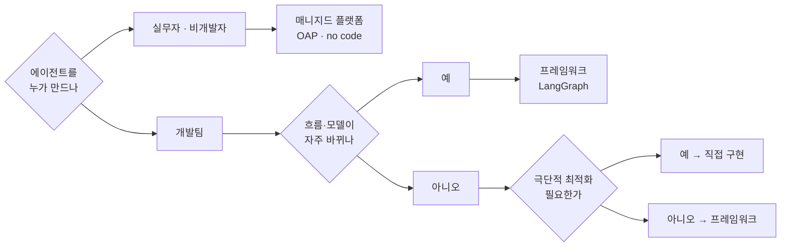

"프레임워크를 쓸까요, 직접 짤까요"는 잘못 놓인 질문이다. 선택지가 둘이 아니라 셋이고, 셋을 가르는 축이 하나가 아니라 아홉이기 때문이다. 그리고 그 아홉 중 실제로 결정을 가르는 것은 대개 하나 — **누가 만드는가**다.

이 글은 그 셋을 나란히 세운다. SDK를 직접 부르는 방식, 프레임워크를 얹는 방식, 매니지드 플랫폼에 올리는 방식. 축을 다 펼친 뒤에는 반대 방향에서 검증한다 — 서베이와 도입 사례를 통해 **산업이 실제로 무엇을 골랐는지**를 본다. 절반 이상이 이미 프로덕션에 에이전트를 올려 뒀고, 규모를 막론하고 1순위 우려는 하나로 모인다.

[앞 편들](/blog/ai-agent/mcp-rag-as-service/)에서 구성요소를 하나씩 봤다면 이 글은 그것들을 어디까지 가져다 쓸 것인가의 문제다. 시리즈의 마지막 편이라 [첫 편의 배팅 우선순위](/blog/ai-agent/llm-app-bottleneck-shift/)에서 근거로 인용했던 수치들이 여기서 원본 형태로 나온다.

> 이 글은 **2025년 5월부터 10월까지의 자료를 정리한 것**이다. 서베이는 2024년 조사분이고, 도입 기업 목록과 제품 상태는 2025년 시점이다. 등장하는 회사 사례와 수치는 모두 원 자료의 것이며 정리자의 수행 실적이 아니다.

## 용어 정리

앞 편의 용어표에서 이 글이 쓰는 행만 추리고, 선택 축 용어를 더했다.

| 용어 | 원어 / 표기 | 뜻 |
|---|---|---|
| 락인 | Vendor Lock-in | 특정 공급자의 제품에 묶여 이탈 비용이 커지는 상태 |
| 매니지드 플랫폼 | Managed Platform | 실행 환경·배포·관측을 공급자가 운영해 주는 형태 |
| Citizen Developer | Citizen Developer | 전문 개발자가 아니면서 사내 도구를 직접 만드는 실무자 |
| CSAT | Customer Satisfaction | 고객 만족도 지표 |
| PoC | Proof of Concept | 실현 가능성을 확인하는 소규모 검증 프로젝트 |
| Function Calling | Function Calling | 모델이 도구 호출을 구조화된 형태로 출력하는 기능 |
| LangGraph Platform | — | LangGraph 에이전트를 배포·운영하는 매니지드 실행 환경 |
| OAP | Open Agent Platform | 코딩 없이 에이전트를 조립하는 오픈소스 플랫폼 |
| 온프레미스 | On-premise | 자체 인프라에 직접 설치·운영하는 배포 형태 |

## 세 선택지, 아홉 축

표에 붙은 기호가 근거의 성격을 가른다. **◎는 원 자료에 명시된 내용이고, ○는 그 근거로 정리자가 구성한 판단이다.** 인용할 때 둘을 섞으면 안 된다.

| 축 | ① 직접 구현 (SDK 직접 호출) | ② 프레임워크 | ③ 매니지드 플랫폼 |
|---|---|---|---|
| 초기 속도 | 느림 ○ | 빠름 ◎ ("빠르게 도입할 수 있는 프레임워크에 대한 니즈") | 가장 빠름 ◎ (원클릭 배포, prebuilt Agent) |
| 통제 수준 | 최대 ○ | 높음 ◎ (Low Level에서 맥락 세밀 조정) | 낮음 ○ |
| 모델 교체 비용 | 높음 ◎ (SDK마다 재작성) | 낮음 ◎ ("다양한 모델을 빠르게 통합") | 낮음 ○ |
| 운영·관측 | 직접 구축 ○ | 관측 SaaS 연동 ◎ | 내장 ◎ |
| 배포 | 직접 구축 ○ | 쉬운 배포 ◎ | 매니지드 ◎ |
| 비개발자 참여 | 불가 ○ | 제한적 ○ | 가능 ◎ (Citizen Developer, no code) |
| 락인 | 없음 ○ | 중간 ○ | 높음 ○ |
| 온프레미스 | 자유 ○ | 가능 ○ | 제약 ○ |
| 적합 상황 | 단일 유스케이스, 극단적 최적화 필요 ○ | 흐름이 자주 바뀌고 모델·도구를 갈아끼우는 제품 ◎ | 사내 업무 자동화, 실무자 주도 ◎ |

아홉 축 중 ◎가 붙은 것은 여섯 자리뿐이고 전부 ②와 ③에 몰려 있다. **①에 ◎가 하나(모델 교체 비용)뿐이라는 사실 자체가 이 자료의 입장을 드러낸다** — 직접 구현은 비교 대상으로 놓였지 권장 대상으로 놓이지 않았다. 인용할 때 이 편향을 함께 말해야 한다.

축을 순서대로 밟는 대신 실제 결정 순서로 세우면 이렇게 된다.

**도식은 질문이 셋인데 표는 축이 아홉이다.** 표의 나머지 여섯 축(통제·운영·배포·락인·온프레미스·초기 속도)은 도식 어디에도 분기로 등장하지 않는데, 그것들이 덜 중요해서가 아니라 **첫 질문에 종속되기 때문이다.** 비개발자가 만드는 것으로 결정되면 락인과 통제 수준은 이미 정해진다. 도식은 결정 순서를, 표는 결정의 결과로 무엇이 따라오는지를 말한다.

그리고 잎이 넷인데 종착지는 셋이다. `프레임워크`가 두 경로에서 도달한다 — 흐름이 자주 바뀌어서 고르는 경우와, 극단적 최적화가 필요 없어서 남는 경우다. **기본값이 프레임워크이고 나머지 둘이 조건부**라는 구조다.

## 산업은 무엇을 골랐나

| 지표 | 수치 | 출처 |
|---|---|---|
| LangGraph 사용률 | 2024년 한 해 **7% → 44%** | 7월 자료 |
| 국내 채택 | 대부분의 RAG·Agent 개발사 | 7월 자료 |
| 해외 채택 | LinkedIn, Uber, GitLab, Cisco, Replit, Blackrock, JP Morgan 등 | 7월 자료 |
| 다운로드 추월 | 발표 슬라이드 제목 "LangChain is now downloaded more than the OpenAI SDK" | Interrupt 발표 화면 |
| Trace 볼륨 | "Agents are rapidly growing in production volume" — 2023 하반기부터 2025년 4월까지 우상향, 특히 2025년 초부터 급상승 | Interrupt 발표 화면 |

다운로드 추월 그래프의 월별 눈금은 다음과 같다. **막대 그래프에서 읽은 근사치이며 슬라이드에 숫자 라벨은 없다.**

| 월 | LangChain | OpenAI SDK |
|---|---|---|
| 2024.11 | 약 20M | 약 37M |
| 2024.12 | 약 29M | 약 45M |
| 2025.01 | 약 32M | 약 50M |
| 2025.02 | 약 36M | 약 50M |
| 2025.03 | 약 59M | 약 62M |
| 2025.04 | 약 72M | 약 66M ← 역전 |

> **위 표는 눈금 판독값이므로 정확한 숫자를 단언하면 안 된다.**
>
> 인용할 때는 "2025년 4월경 LangChain 월간 다운로드가 OpenAI SDK를 넘어섰다고 발표됐다" 수준으로 말하는 것이 안전하다. 그리고 이 지표 자체가 무엇을 뜻하는지도 조심해야 한다 — 다운로드 수는 채택의 대리 지표일 뿐이고, CI 파이프라인의 재설치가 상당 부분을 차지한다. 추세의 방향은 읽되 절대값에는 기대지 않는 편이 낫다.

### 프레임워크로 옮긴 뒤 얻은 것

한 개발 조직이 2024년 5월부터 오케스트레이션을 프레임워크 중심으로 전면 개편한 뒤 정리한 성과 목록이다.

| # | 성과 |
|---|---|
| 1 | 노드를 독립적으로 가져갈 수 있음 (템플릿화) |
| 2 | 흐름을 자유자재로 변경하면서 테스트가 용이 |
| 3 | 메모리 관리 |
| 4 | 쉬운 배포 |
| 5 | 복잡한 흐름을 생각보다 간단하게 |

> **1번과 2번이 본질이고 나머지 셋은 부수 효과다.**
>
> 노드가 독립적이면 **부분 교체와 A/B 테스트**가 가능해지고, 그래야 [앞 편의 평가 체계](/blog/ai-agent/agent-evaluation-observability/)가 의미를 갖는다. 평가 지점을 라우팅·도구·최종 답변 셋으로 쪼갰는데 코드가 한 덩어리면 쪼갠 결과로 무엇을 할 수가 없다. **평가 체계와 모듈형 오케스트레이션은 한 세트**이고, 어느 한쪽만 도입하면 둘 다 값을 못 한다. 노드 경계를 실제로 어디에 그을 것인가는 [모듈 경계 편](/blog/rag/langgraph-module-boundaries/)에 별도로 있다.

## 서베이 — 절반이 이미 프로덕션에 있다

| 질문 | Yes | No |
|---|---|---|
| Does your company currently have agents in production? | 51.1% | 48.9% |
| Are you currently developing an agent with plans to put it into production? | 78.1% | 21.9% |

두 행의 간격이 이 조사의 핵심이다. 51.1%가 이미 올렸고 78.1%가 올릴 계획을 갖고 개발 중이다 — 계획 단계가 현재 단계보다 27%p 크다는 것은 **아직 확산의 중간**이라는 뜻이다.

| 순위 | 에이전트가 수행하기 가장 적합한 업무 | 응답률 |
|---|---|---|
| 1 | Research and summarization | 58.2% |
| 2 | Personal assistance / productivity tasks | 53.5% |
| 3 | Customer service | 45.8% |
| 4 | Code generation | 35.5% |
| 5 | Data transformation and enrichment | 33.8% |
| 6 | Interactive game play, storytelling, or companionship | 19.6% |
| 7 | Other | 2.9% |

1위가 조사·요약이라는 것은 [첫 편의 2024년 요청 목록](/blog/ai-agent/llm-app-bottleneck-shift/)과 일치한다. 그리고 이 셋(1·2·3위)의 공통점이 **오류 비용이 낮다**는 것인데, [자율성의 상한을 오류 비용으로 긋는 원칙](/blog/ai-agent/agent-vs-workflow/)이 실제 채택 분포에서 그대로 확인되는 셈이다.

### 우려 — 순위와 규모별 교차는 다른 절단면이다

| 순위 | 상용 서비스로 구축할 때 우려 | 응답률 |
|---|---|---|
| 1 | Performance quality | 41% |
| 2 | Cost | 18.4% |
| 2 | Safety concerns | 18.4% |
| 4 | Latency | 15.1% |
| 5 | Other | 7% |

| 규모 | Performance quality | Cost | Safety concerns | Latency |
|---|---|---|---|---|
| Small | 45.8% | 22.4% | 17.0% | 14.8% |
| Mid-sized | 43.7% | 17.0% | 22.1% | 17.3% |
| Enterprise | 39.7% | 18.1% | 23.6% | 18.6% |

**두 표는 지표명 넷을 공유하지만 서로를 대체하지 못한다.** 위 표는 전체 순위와 `Other` 항목을 갖고, 아래 표는 규모라는 축을 하나 더 가져 같은 지표를 세 값으로 쪼갠다. 순위표만 보면 규모별 차이가 사라지고, 교차표만 보면 `Other` 7%와 2위 공동 순위가 사라진다.

그리고 교차표에서만 보이는 것이 하나 있다.

> **규모와 무관하게 Performance quality가 압도적 1위지만, 커질수록 quality가 내려가고(45.8 → 39.7) Safety가 올라간다(17.0 → 23.6).**
>
> 스타트업은 "잘 되게 하는 것", 대기업은 "사고 안 나게 하는 것"에 상대적으로 더 무게를 둔다는 해석이 가능하다. 그런데 두 값의 이동 폭이 각각 6.1%p와 6.6%p로 거의 같다 — 총량이 보존된 채 무게중심만 옮겨 간 형태다. **우려의 총량은 규모와 무관하고 배분만 달라진다**고 읽는 편이 정확하다. 이것이 [첫 편의 배팅 1순위](/blog/ai-agent/llm-app-bottleneck-shift/)가 평가·관측인 근거이기도 하다.

### 무엇을 프로덕션에 올렸나

| 카테고리 | 기업 |
|---|---|
| CO-PILOTS | LinkedIn, Rippling, elastic |
| CODEGEN | Replit, GitLab, Lovable |
| AI SEARCH | Etsy, The Home Depot, L'Oréal |
| ENTERPRISE GPT | AT&T, Rakuten |
| RESEARCH | BlackRock, Moody's, Clay |
| CUSTOMER SUPPORT | Klarna, Nu |

여섯 카테고리 중 넷(CO-PILOTS·CODEGEN·AI SEARCH·RESEARCH)이 위 서베이 상위 업무와 겹친다. 조사·코드 생성·검색이라는 저위험 영역에 실제 도입도 몰려 있다.

### Nu Bank — 이 자료의 유일한 정량 Before/After

위 표 `CUSTOMER SUPPORT` 행의 Nu가 2일차 사례 세션에서 발표한 "Money Transfer using Agents"다. 이 시리즈를 통틀어 도입 전후를 숫자로 제시한 유일한 사례다.

| 항목 | 내용 |
|---|---|
| 무엇 | WhatsApp(및 인앱)에서 에이전트를 이용한 멀티모달 송금 |
| 소요시간 | **70+ sec → &lt;30 sec** |
| 만족도 | **90%+ CSAT** |
| 정확도 | **&lt;0.5% inaccuracy** |
| 구조 최적화 | 초기 **6회의 OpenAI 호출** → 이후 **3회로 축소**. 지연·비용 요건을 맞추기 위해 fine-tuned LLAMA 호출로 대체 |

발표에 함께 실린 교훈 셋이다.

| # | 교훈 | 뜻 |
|---|---|---|
| 1 | Iterate to simplify | 반복하면서 단순화하라. 호출 6→3회가 그 결과 |
| 2 | All product quality aspects apply to AI products too; think about design, copy, support etc | AI 제품이라고 제품 품질의 규칙이 면제되지 않는다 |
| 3 | Building a one off solution is not sufficient | 일회성 솔루션으로는 부족하다 — 재사용 가능한 기반이 필요 |

> **위 수치는 전부 Nu Bank가 자사 사례로 발표한 것이며, 2025년 5월 컨퍼런스 발표 자료 기준이다.** 제3자 검증을 거친 값이 아니다.
>
> 내용 면에서 주목할 것은 첫 번째 교훈이 마지막 행과 짝을 이룬다는 점이다. 호출 6회에서 3회로 줄인 것은 성능 튜닝이 아니라 **구조를 단순화한 결과**이고, 그 과정에서 지연과 비용이 요건을 만족하게 됐다. 에이전트에서 호출 수는 대개 설계 결정의 부산물이라, 호출 수를 목표로 잡으면 줄지 않고 구조를 다시 보면 줄어든다.

### 도입 태도

| 관찰 | 내용 |
|---|---|
| 단계 | 대형 기술기업이 멀티에이전트 협업 네트워크의 **PoC를 마치고 도입 추진 중** |
| 문화 | 빠른 시행착오를 포용하는 문화 |
| 이유 | 급변하는 AI 트렌드에 대한 대처 |
| 귀결 | **빠르게 도입할 수 있는 프레임워크**에 대한 니즈 |

네 행이 하나의 인과 사슬이다 — 트렌드가 빨리 바뀌니까 시행착오를 포용하고, 시행착오를 포용하려니 갈아엎기 쉬운 도구가 필요하다. 위 아홉 축 표에서 "초기 속도"와 "모델 교체 비용"에 ◎가 붙은 근거가 여기다.

## 기술이 아니라 가치

> 우리는 무슨 문제를 풀려고 하는가? 우리가 고민하는 것이 진짜 "고객"의 고민이 맞는가? 고급 기술을 사용하지 않는 기업도 있지만 이미 고객을 확보했고 돈도 잘 벌고 있다.
>
> 기술적인 부분도 중요하겠지만 가치 창출에 더 많은 고민과 노력을 기울이고 있다 — **"이 기능이 얼마 $ 를 벌어다 줍니까?"** 이 질문이 불편한 이유는 답이 대개 없기 때문이고, 답이 없다는 사실 자체가 정보다.

| 논점 | 내용 |
|---|---|
| 현장 발언 | "모델 버전과 상관없이 고객의 문제를 풀기만 하면 되는데, 우리는 어쩌면 수요 없는 공급을 하고 있을지도 모른다" |
| 비유 | 마차 vs 자동차 |
| 과제 | 새로운 UX에 대한 고민 / 실제로 시장에서 얼마나 큰 가치를 인정받을 수 있는가 |
| 제안 | 기술이 아니라 비즈니스를 주제로 하는 개발자 모임의 필요성 |

이 절이 시리즈 전체에서 갖는 위치는 분명하다. [평가·관측 편](/blog/ai-agent/agent-evaluation-observability/)이 "품질을 어떻게 재는가"였다면 이 절은 **"무엇을 품질로 삼을 것인가"**를 되묻는다. 메트릭 3계층에 Business Metrics 행이 존재하는 이유이기도 하다 — Cost·User Feedback·Topic Summarization은 저 질문에 답하기 위한 지표다.

## 2025년 10월 시점 갱신

| 항목 | 내용 |
|---|---|
| 사건 | **LangChain V1.0 출시** |
| 문서 | 문서 페이지 전면 개편 (한국어 문서 별도 제공) |
| 신규 | **Agent Builder** 신청 개시 |

5월에 예고된 방향(노코드 에이전트 빌더, 관측 내장)이 10월에 V1.0과 Agent Builder로 제품화됐다. **로드맵 발표가 5개월 만에 배송된 셈**이고, 위 아홉 축 표의 세 번째 열(매니지드 플랫폼)이 그 5개월 사이에 실체를 갖췄다. 표를 다시 읽을 때는 이 시차를 감안해야 한다 — ③에 붙은 ◎ 중 일부는 발표 시점에는 예고였고 10월에 제품이 됐다.

---

다섯 편에 걸쳐 2025년 한 해의 이동을 정리했다. 병목이 프롬프트에서 RAG로, 에이전트로, 도구 통합으로 옮겨 갔고, 그동안 해결되지 않은 것은 품질 하나였다. 제품은 채팅창을 벗어났고, 평가 지점은 셋으로 쪼개졌고, 지식베이스는 서비스로 떨어져 나갔으며, 스택 선택의 기본값은 프레임워크가 됐다.

여기까지의 서사에는 공통 전제가 하나 깔려 있다 — **모델이 좋아지면 제품도 좋아진다**는 전제다. 그런데 2026년의 논의는 정확히 그 전제를 의심하는 데서 시작한다. 모델은 상향 평준화됐는데 제품 성능이 비례하지 않는다면 원인은 어디에 있는가. 답이 모델이 아니라 모델을 감싼 실행 구조에 있다면, 개선 예산은 모델 교체가 아니라 다른 곳으로 가야 한다. 그 진단과 그것이 개발 조직에 미친 영향이 이 카테고리의 다음 시리즈다.
