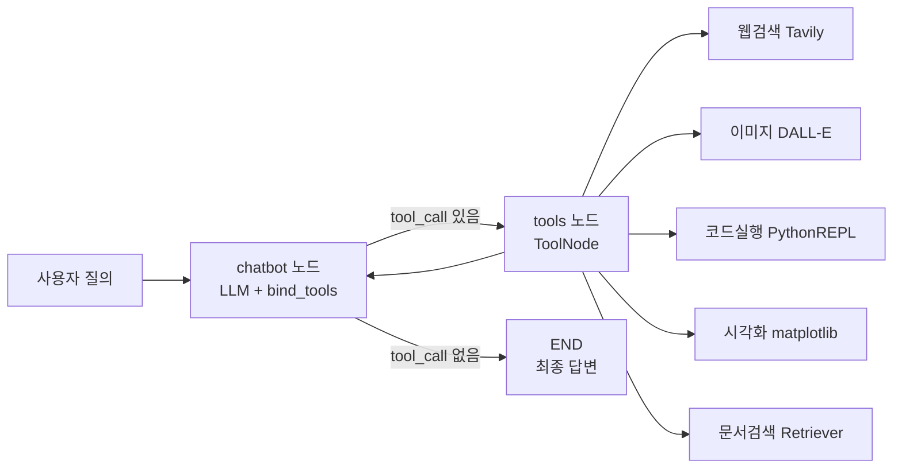
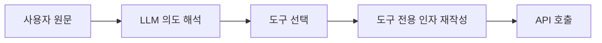
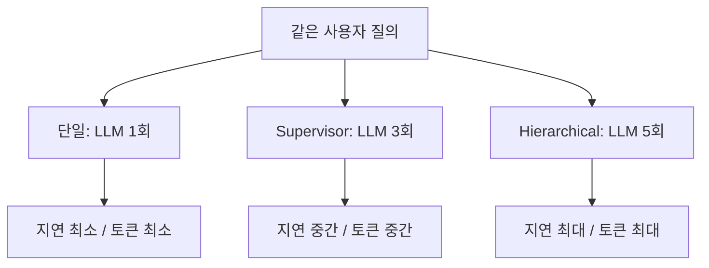
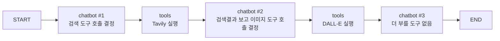
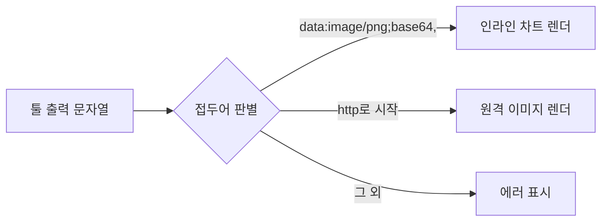

기능이 많은 제품을 보면 뒤에 에이전트가 여러 개 있을 것 같다. 그림도 그리고 검색도 하고 코드도 돌리는데 그게 하나일 리 없다는 직관이다. 그런데 이 직관은 비용을 세어 보면 흔들린다 — 역할을 쪼갤 때마다 LLM 호출이 배로 늘고, 대화형 제품에서 그 지연은 그대로 체감된다.

ChatGPT가 하는 일의 상당 부분은 "거대한 하나의 모델"로 설명되지 않는다. 화면에서 관찰되는 동작은 **하나의 LLM이 여러 도구를 골라 반복 호출하는 라우팅 구조**로 재현할 수 있고, 이 글은 그 재현을 따라간다. 앞 시리즈의 Perplexity에는 Focus라는 컨트롤이 있어 [분기 키를 사용자가 골랐지만](/blog/ai-agent/focus-routing-and-citations/), 여기에는 고를 것이 없다. 라우팅이 어디로 가는지가 이 글의 첫 질문이다.

미리 선을 그어 둔다. **OpenAI의 내부 구현은 공개돼 있지 않다.** 이 글이 원 제품에 대해 말하는 것은 전부 화면에서의 관찰과 그로부터의 추론이며, "이렇게 만들면 같은 동작이 나온다"는 것이 "실제로 그렇게 만들어졌다"를 뜻하지는 않는다.

## 용어 정리

| 약어 / 용어 | 원어 | 뜻 |
|---|---|---|
| Tool Calling | Tool Calling / Function Calling | LLM이 자연어 대신 "함수명 + 인자 JSON"을 출력해 외부 기능을 호출하게 하는 기법 |
| `ToolNode` | `langgraph.prebuilt.ToolNode` | LLM이 뱉은 `tool_call`을 실제로 실행하고 결과를 `ToolMessage`로 되돌리는 기본 노드 |
| `tools_condition` | `langgraph.prebuilt.tools_condition` | 마지막 AI 메시지에 `tool_call`이 있으면 `tools`로, 없으면 `END`로 보내는 표준 조건분기 함수 |
| `MessagesState` | `langgraph.graph.MessagesState` | `messages` 키 하나만 가진 내장 State. 리듀서로 `add_messages`가 이미 붙어 있음 |
| `add_messages` | LangGraph message reducer | State의 messages를 **덮어쓰지 않고 누적**하는 리듀서. 대화 맥락 유지의 핵심 |
| REPL | Read-Eval-Print Loop | 코드를 즉시 실행하고 결과를 돌려주는 인터프리터. 여기서는 `PythonREPL` |
| RAG | Retrieval-Augmented Generation | 외부 문서를 검색해 LLM 답변 근거로 넣는 기법 |
| Retriever Tool | `create_retriever_tool` | 벡터 검색기를 "도구"로 감싸 LLM이 직접 호출할 수 있게 만든 래퍼 |
| Tavily | Tavily AI Search API | LLM 친화적 웹 검색 API. 문장형 쿼리를 그대로 받는다 |
| DALL·E | OpenAI DALL·E 3 | 이미지 생성 API. 결과로 이미지 URL 반환 |
| `astream_events` | `graph.astream_events()` | 노드 **내부**의 LLM 토큰·도구 시작/종료까지 이벤트로 흘려주는 비동기 스트리밍 API |
| `stream_mode` | `values` / `updates` | 노드 **경계**에서의 스트리밍 단위. 전체 상태 대 변경분 |
| Chroma | ChromaDB | 로컬 임베디드 벡터 DB |
| Streamlit | Streamlit | 파이썬만으로 웹 UI를 만드는 프레임워크. 입력마다 스크립트를 통째로 재실행 |

## 한눈에 보기



핵심은 **단 하나의 사이클**이다. `chatbot → (조건분기) → tools → chatbot` 루프가 돌면서, LLM이 "더 부를 도구가 없다"고 판단할 때까지 반복한다.

| # | 문제 | 이 설계의 해법 |
|---|---|---|
| 1 | 네 가지 기능을 어떻게 재현하나 | 기능을 각각 **도구**로 정의하고 하나의 LLM에 바인딩 |
| 2 | 멀티 에이전트로 쪼개야 하나 | 아니다. **비용·지연** 때문에 단일 에이전트 + 다중 도구 |
| 3 | 언제 어떤 도구를 부를지 누가 정하나 | LLM 자신. System Prompt로 **호출 가이드라인**을 준다 |
| 4 | 도구를 두 번 이상 이어서 써야 하면 | `tools → chatbot` 되돌림 엣지로 **반복 호출** 허용 |
| 5 | 노트북 코드를 어떻게 서비스로 만드나 | `agent`/`nodes`/`tools`/`tool_calling_event`로 **책임 분리** |
| 6 | 진행 상황을 어떻게 보여주나 | `astream_events()`로 토큰·도구 이벤트를 UI에 스트리밍 |
| 7 | 무한 루프가 나면 | `RecursionError`를 잡아 사용자 메시지로 전환 |

일곱 문제 중 1~4가 이 글의 범위이고, 5~7은 노트북을 서비스로 옮기는 단계라 다음 편에서 다룬다.

## 기능 단위로 해체하기

| 기능 | 사용자 관점 | 실제로 필요한 외부 자원 | 클론 시 대체재 |
|---|---|---|---|
| 그림 생성 | "고양이 그려줘" | 이미지 생성 모델 | DALL·E 3 API |
| 웹 검색 | "지금 상영 중인 영화는?" | 실시간 검색 인덱스 | Tavily Search API |
| 문서 업로드 | PDF 올리고 질문 | 문서 파서 + 벡터 검색 | PyPDFLoader + Chroma |
| Code Interpreter | "GDP 추이 그래프로" | 코드 실행 샌드박스 | Python REPL + matplotlib |

**기능 표는 네 행인데 위 도식의 도구는 다섯 개다.** Code Interpreter 하나가 구현에서 둘로 갈라졌기 때문이다 — `python_repl`(계산·데이터 처리)과 `data_visualization`(차트 생성). 사용자에게는 한 기능이지만 반환값의 성격이 달라(문자열 대 이미지) UI가 다르게 렌더해야 하므로 도구를 나눴다. **기능 경계와 도구 경계가 일치하지 않는 첫 사례**다.

### 결정적 관찰 — 중간에 판단이 한 번 개입한다

| 화면에서 관찰되는 것 | 거기서 끌어낸 결론 |
|---|---|
| 그림 요청 시, 입력 문장에 없던 배경·화풍·구도가 결과 이미지에 들어 있다 | 사용자 문장이 그대로 이미지 모델로 가지는 않는 것으로 **보인다**. "이미지"라는 단어를 키워드 매칭해 API로 넘기는 구조라면 나올 수 없는 디테일이다 |
| 검색 요청 시 화면에 뜨는 검색어가 사용자가 입력한 문장과 다르다 | 도구를 부르기 직전에 **의도 추출 + 쿼리 생성**이 한 번 더 도는 것으로 **추정** |

두 관찰 모두 "입력과 출력 사이에 원문이 아닌 무언가가 지나갔다"는 흔적이다. 이를 설명하는 가장 단순한 구조를 그리면 이렇게 된다.



**이 도식은 위 두 관찰을 설명하는 가설이지 원 제품의 내부 구성도가 아니다.** 이 글의 나머지는 이 가설대로 그래프를 짜면 같은 관찰이 재현되는지를 확인하는 작업이다.

재현해 보면 증폭이 눈에 보인다. 아래는 **이 클론을 돌려 얻은 로그**다.

- 입력: `"generate the image of dog"`
- LLM이 만든 인자: `"A realistic and detailed illustration of a happy dog playing in a sunny park. The dog is a golden retriever…"`

한 줄짜리 입력이 문단짜리 이미지 프롬프트로 증폭됐다.

> 얻은 것과 얻지 못한 것을 갈라야 한다. 얻은 것은 **위 가설대로 만든 그래프가 실제로 그렇게 동작한다**는 사실이고, 얻지 못한 것은 원 제품이 그렇게 한다는 증거다. 자기 구현의 출력은 자기 구현에 대한 근거일 뿐이다.
>
> 같은 관찰을 설명하는 구조는 여럿일 수 있다. 이 로그가 보태 주는 것은 "그 관찰을 설명하는 구조 하나가 실제로 성립한다"까지이고, 그것만으로도 값은 충분하다 — 설명 후보를 하나 확정했으니 나머지 설계를 그 위에서 진행할 수 있다.

### 도구는 결합된다

`"Claude의 computer use에 대해서 조사하고, 이를 그림으로 표현해줘."` — 이 한 문장에 대해 LLM은 한 턴에 **`tavily_search`와 `generate_image` 두 개의 `tool_call`을 동시에 발행**했다.

여기서 아키텍처 요구사항이 하나 도출된다. **도구 호출은 1회로 끝나지 않으며, 반복·병렬 호출이 가능해야 한다.** 그래프에 사이클이 필요한 이유가 이 한 문장이다.

## 왜 단일 에이전트인가

토폴로지별 형태와 적합 상황은 [단일 에이전트의 경계와 토폴로지 3종](/blog/ai-agent/when-to-split-agents/)에 여덟 축으로 정리돼 있다. 여기서는 그 표에 없는 축 하나만 본다 — **같은 질의를 처리할 때 구조가 요구하는 최소 LLM 호출 수**다.

| 아키텍처 | 최소 LLM 호출 | 그 호출이 하는 일 |
|---|---|---|
| **단일 에이전트 + 다중 도구** | **1회** | 도구 선택 겸 답변 생성 |
| **Supervisor(감독자)형** | **3회** | 감독자 라우팅 + 워커 실행 + 감독자 종료 판정 |
| **Hierarchical(그룹)형** | **5회** | 상위 라우팅 + 팀 라우팅 + 워커 + 팀 복귀 + 상위 종료 판정 |



> **1·3·5는 구조를 세어 본 값이지 벤치마크 실측이 아니다.** 실제로는 도구 호출이 반복되므로 어느 구조든 이 숫자를 훌쩍 넘는다.
>
> 그래서 절대값이 아니라 **바닥값의 배수 관계**로 읽어야 한다. 층을 하나 얹을 때마다 반복 이전에 이미 치르는 고정 비용이 두 호출씩 늘고, 반복 횟수가 같다면 그 차이가 그대로 최종 지연에 곱해진다.

여기서 나오는 판단이 다음 인용문이다.

> 기능이 많아 멀티 에이전트처럼 보이지만, **멀티 에이전트는 응답이 늦고 비용이 크다.** 대화형 제품에서 그 대가는 그대로 사용자에게 간다.
>
> 그러므로 같은 기능 집합을 **여러 도구를 가진 단일 에이전트**로 구현 가능하다.

마지막 문장의 강도에 유의할 필요가 있다. **"구현 가능하다"이지 "그렇게 구현돼 있다"가 아니다.** 이 차이가 이 글 전체의 서술 강도를 규정한다 — 우리가 확인할 수 있는 것은 재현 가능성이지 원본의 구성이 아니다.

### 쪼개야 하는 조건은 사실상 하나다

**"System Prompt가 서로 충돌하는가."** 도구만 다르고 페르소나·정책이 같으면 도구를 추가하고, 역할마다 지켜야 할 규칙·톤·금지사항이 다르면 분리한다. 이 기준은 [앞 글의 일곱 신호](/blog/ai-agent/when-to-split-agents/) 중 첫 행("역할 설명이 서로 충돌하기 시작")과 같은 것을 다르게 말한 것이다.

거기에 하나를 덧붙일 수 있다. **컨텍스트 윈도우가 도구 스키마로 포화되는 경우**다. 도구 개수 자체가 아니라 도구 스키마가 매 호출마다 프롬프트에 실린다는 사실이 문제이고, 이때는 에이전트를 쪼개거나 도구를 그룹으로 묶어 라우팅한다. "도구 개수 6개 이상"이라는 정량 신호에 **왜 그런가**를 채워 넣는 근거다.

## 그래프 설계 — chatbot ↔ tools 루프

```python
from langgraph.graph import StateGraph, START, MessagesState
from langgraph.prebuilt import ToolNode, tools_condition
from utils.nodes import create_chatbot
from utils.tools import get_tools

def create_agent(docs_info=None, retriever_tool=None):
    graph_builder = StateGraph(MessagesState)

    # chatbot 노드: 업로드 문서 정보와 retriever 도구를 주입받아 생성
    chatbot_node = create_chatbot(docs_info, retriever_tool)
    graph_builder.add_node("chatbot", chatbot_node)

    # tools 노드: 도구 목록도 retriever 유무에 따라 동적으로 구성
    tool_node = ToolNode(tools=get_tools(retriever_tool))
    graph_builder.add_node("tools", tool_node)

    # 핵심 3줄 — 조건분기 + 되돌림 엣지 + 시작점
    graph_builder.add_conditional_edges("chatbot", tools_condition)
    graph_builder.add_edge("tools", "chatbot")
    graph_builder.add_edge(START, "chatbot")

    return graph_builder.compile()
```

| 요소 | 역할 | 없으면 생기는 일 |
|---|---|---|
| `MessagesState` | 대화 이력 누적 State | 매 턴 맥락이 사라져 "그거 다시 그려줘"가 안 됨 |
| `tools_condition` | `tool_call` 유무로 분기 | 도구를 부를지 말지 직접 파싱해야 함 |
| `add_edge("tools","chatbot")` | **되돌림 엣지** | 도구 결과를 LLM이 못 보고 그대로 사용자에게 노출됨 |
| `ToolNode` | `tool_call` 실행 + `ToolMessage` 변환 | 인자 파싱·에러 핸들링을 직접 구현해야 함 |

네 요소 중 셋은 프리빌트를 가져다 쓴 것이고, 실제로 설계한 것은 되돌림 엣지 하나뿐이다.



`tools → chatbot` 엣지 하나가 **"문제 해결을 위한 도구 호출 반복"을** 만든다. 앞에서 본 결합 질의("조사하고, 그림으로 표현해줘")가 정확히 이 엣지로 처리된다.

### 반복의 대가 — RecursionError

되돌림 엣지는 무한 루프 가능성을 연다. LangGraph는 재귀 한도를 넘으면 `RecursionError`를 던지고, 코드는 이를 두 곳에서 처리한다.

```python
# tool_calling_event.py — 하위에서는 다시 던진다
except RecursionError as e:
    raise  # 상위 레벨에서 처리하도록 예외를 다시 발생

# app.py — 최상위에서 사용자 메시지로 전환
except RecursionError as e:
    error_message = f"⚠️ 너무 많은 재귀 호출이 발생했습니다: {str(e)}"
    st.error(error_message)
    st.session_state.messages.append(AIMessage(content=error_message))
```

> 재귀 한도·타임아웃·도구 호출 횟수 상한은 기능이 아니라 **과금 통제 수단**으로 봐야 한다. 도구 실행 루프에서는 비용이 곧 요금이다.
>
> 이 관점 전환이 값을 하는 이유는 상한값의 소유자를 바꾸기 때문이다. "안전장치"로 부르면 적당히 크게 잡고 잊어버리지만, "요금 통제"로 부르면 예산에서 역산돼야 할 숫자가 된다.

## 도구 4종 구현

| 도구 | 함수 | 반환값 | 특이점 |
|---|---|---|---|
| 이미지 생성 | `generate_image` | `"Successfuly generated the image!,{url}"` | Pydantic 스키마로 인자 명세 |
| 웹 검색 | `TavilySearchResults(max_results=2)` | 검색 결과 리스트 | 프리빌트 도구 그대로 사용 |
| 코드 실행 | `python_repl` | stdout 문자열 | REPL 인스턴스를 **공유** |
| 데이터 시각화 | `data_visualization` | `data:image/png;base64,...` | 차트를 base64로 인코딩해 반환 |
| 문서 검색 | `retriever_tool` | 문서 청크 | 파일 업로드 시에만 **동적 추가** |

다섯 행이 앞의 기능 표 네 행과 어긋나는 지점이 3·4행이고, 다섯 번째 행은 존재 자체가 조건부다.

```python
class GenImageSchema(BaseModel):
    prompt: str = Field(description="The prompt for image generation")

@tool(args_schema=GenImageSchema)
def generate_image(prompt: str) -> str:
    """Generate an image using DALL-E based on the given prompt."""
    response = client.images.generate(
        model="dall-e-3", prompt=prompt,
        size="1024x1024", quality="standard", n=1
    )
    return f"Successfuly generated the image!,{response.data[0].url}"

repl = PythonREPL()   # 모듈 레벨 단일 인스턴스 = 세션 간 변수 공유

@tool
def data_visualization(code: str):
    """Execute Python code. Use matplotlib for visualization."""
    try:
        repl.run(code)
        buf = io.BytesIO()
        plt.savefig(buf, format='png')      # 파일이 아닌 메모리 버퍼로 저장
        buf.seek(0)
        img_str = base64.b64encode(buf.getvalue()).decode()
        return f"data:image/png;base64,{img_str}"
    except Exception as e:
        return f"Error creating chart: {str(e)}"

@tool
def python_repl(code: str):
    """Execute Python code."""
    return repl.run(code)

def get_tools(retriever_tool=None):
    base_tools = [generate_image, search, python_repl, data_visualization]
    if retriever_tool:
        base_tools.append(retriever_tool)   # 도구 목록 자체가 런타임 가변
    return base_tools
```

| 포인트 | 설명 |
|---|---|
| **docstring이 곧 스펙** | `@tool`은 함수 docstring을 LLM에게 보내는 도구 설명으로 쓴다. 주석이 아니라 **프롬프트**다 |
| **도구 목록의 런타임 가변성** | `get_tools()`가 retriever 유무로 도구 수를 바꾼다 → 문서 업로드 시 그래프를 **다시 컴파일** |
| **반환 형식이 UI 계약** | `data:image/png;base64,` 접두어로 UI가 "이건 그려야 할 이미지"임을 판별한다 |

> 첫 행이 파이썬 코드 리뷰의 관성을 정면으로 거스른다. **docstring은 사람에게 하는 설명이 아니라 모델에게 보내는 명세다.**
>
> `"""Execute Python code."""` 같은 세 단어짜리 문장이 코드 리뷰에서는 통과하지만, 여기서는 도구 선택 정확도를 직접 깎는다. 도구가 둘뿐일 때는 티가 안 나고 다섯을 넘어가면 오선택으로 나타난다.

### 반환값으로 렌더링을 분기한다

`generate_image`는 **URL**, `data_visualization`은 **base64 데이터 URI**를 돌려준다. UI는 문자열 접두어를 보고 렌더 방식을 바꾼다.



도구가 문자열밖에 못 돌려주는 제약에서 나온 설계다. 반환 타입이 구조화돼 있었다면 접두어 규약 대신 필드 하나로 끝났을 자리다.

### 운영 리스크

아래 네 항목은 원 자료에 없어 직접 채운 것이다. 코드는 실습 환경에서 정상 동작하지만, 그 정상 동작이 서비스 안전성을 뜻하지 않는다.

| 리스크 | 내용 | 대응 |
|---|---|---|
| **코드 실행 샌드박스 부재** | `PythonREPL`은 임의 코드를 **그대로** 실행한다. 파일 접근·네트워크·프로세스가 전부 열려 있음 | 컨테이너 격리, 네트워크 차단, 실행 타임아웃, 화이트리스트 |
| **REPL 상태 공유** | 모듈 레벨 단일 인스턴스라 **여러 사용자가 변수 네임스페이스를 공유** | 세션별 REPL 인스턴스 분리 |
| **base64 페이로드 비대** | 이미지가 대화 이력에 문자열로 누적 → 컨텍스트·메모리 폭증 | 스토리지에 저장 후 URL만 이력에 남김 |
| **matplotlib 전역 상태** | `plt.savefig`가 직전 figure에 의존. 동시 요청 시 다른 차트가 나올 수 있음 | figure 객체 명시 관리 |

네 항목의 공통점은 **모듈 레벨 전역 상태**다. 1·2·4행이 전부 `repl = PythonREPL()` 한 줄과 matplotlib의 전역 figure에서 나온다.

> 첫 행은 다른 셋과 등급이 다르다. 나머지 셋은 결과가 이상해지는 문제지만, 격리 없는 코드 실행은 **원격 코드 실행 취약점 그 자체**다.
>
> 실행 권한이 붙는 순간 무엇이 달라지는지는 [AutoGen의 Code Executor 편](/blog/ai-agent/autogen-conversation-agents/)에 신뢰 경계 관점으로 정리돼 있다. 프레임워크가 달라도 결론은 같다 — 프리빌트 REPL 도구는 예외 없이 호스트에서 실행 사용자 권한으로 돈다.

## System Prompt — 라우팅 규칙은 코드가 아니라 프롬프트에 있다

```python
def get_system_prompt(docs_info=None):
    system_prompt = f"""
    Today is {datetime.now().strftime("%Y-%m-%d")}
    You are a helpful AI Assistant that can use web search tool(tavily ai api),
    image generation tool(DallE API) and code execution tool(Python REPL).
    When you call image generation or data visualization tool,
    only answer the fact that you generated, not base64 code or url.
    Once you generated image by a tool, then do not call it again in one answer.
    """
    if docs_info:                       # 업로드된 문서를 프롬프트에 목록으로 주입
        docs_context = "\n\nYou have access to these documents:\n"
        for doc in docs_info:
            docs_context += f"- {doc['name']}: {doc['type']}\n"
        system_prompt += docs_context

    system_prompt += "\nYou should always answer in same language as user's ask."
    return system_prompt
```

| 프롬프트 문장 | 막으려는 실패 |
|---|---|
| `Today is {오늘 날짜}` | LLM이 학습 시점 기준으로 "최신"을 판단하는 문제 |
| `only answer the fact that you generated, not base64 code or url` | 답변 본문에 base64 수천 자를 토해내는 사고 |
| `Once you generated image ... do not call it again in one answer` | 이미지 도구 **중복 호출**로 요금이 배로 나가는 문제 |
| `You have access to these documents: ...` | 문서를 올렸는데 retriever를 안 부르는 문제 |
| `answer in same language as user's ask` | 한국어 질문에 영어로 답하는 문제 |

**다섯 문장이 전부 사후 대응이다.** 처음부터 이렇게 쓰인 프롬프트가 아니라, 사고가 한 번씩 나고 나서 한 줄씩 붙은 것이다.

> 프롬프트가 이렇게 자란다는 사실 자체가 설계 정보다. **System Prompt는 문서가 아니라 버그 트래커에 가깝다.**
>
> 줄마다 "이 줄이 없으면 무엇이 깨지는가"를 적어 두지 않으면 다음 사람이 정리한다며 지운다. 위 표가 그 기록의 형태다.

### 도구 사용 가이드라인 — 상세 버전

노트북 단계에는 더 상세한 라우팅 지침이 있었고, 프로덕션 코드에서는 축약됐다. 축약본만 보면 놓치는 것이 있어 원형을 남긴다.

```text
web search tool is useful when:
- real-time info
- local specialized info
- metric related info

you should use web search tool with the guideline below:
- Extract the user query's intent and rephrase the prompt into appropriate search query
- web search tool(Tavily AI API) can deal with sentence query.
  you don't need to limit your querying ability to generating keyword only query.
```

```text
generate_image tool is useful when:
Visual Exploration / Customization / Creative Brainstorming
Rephrase the Prompt into a Detailed Image Generation Query:
- Include relevant details about the main subject, setting, perspective, style
- If the user provides vague descriptions, add assumptions or clarify with a follow-up
```

구조가 일정하다. **① 언제 쓰는가(트리거 조건) → ② 인자를 어떻게 만드는가(재작성 규칙).** 앞에서 관찰한 "판단 개입"이 바로 ②를 프롬프트로 명문화한 것이다. 도구 설명(docstring)이 ①을 담당하고 System Prompt가 ②를 담당하는 2단 구조이며, 도구 선택 정확도는 이 둘을 함께 손봐야 오른다.

### 커스텀 도구로 통제력 높이기

프리빌트 `TavilySearchResults` 대신 직접 `@tool`을 쓰면 검색 조건을 코드로 고정할 수 있다.

```python
@tool
def search_news(keyword: str) -> str:
    """Collect recent news for the given query."""
    tavily_client = TavilyClient(api_key=os.environ['TAVILY_API_KEY'])
    # topic·기간을 코드로 못박아 LLM이 흔들 수 없게 만든다
    return tavily_client.search(query=keyword, topic="news", days=30)
```

| 방식 | 통제 지점 | 트레이드오프 |
|---|---|---|
| 프리빌트 도구 | 프롬프트로만 유도 | 빠르지만 LLM이 규칙을 어길 수 있음 |
| 커스텀 `@tool` | 코드로 고정 | 유연성은 줄지만 **재현성·비용 예측성** 확보 |

두 행의 차이는 규칙을 어디에 두느냐 하나다.

> 프롬프트에 둔 규칙은 **확률적으로 지켜지고**, 코드에 둔 규칙은 **항상 지켜진다.** 어느 쪽이 옳은지는 규칙이 깨졌을 때의 대가로 정해진다.
>
> `days=30`을 프롬프트로 지시하면 대부분 지켜지고 가끔 안 지켜진다. 그 "가끔"이 품질 편차로 끝난다면 프롬프트로 충분하지만, 요금이나 접근 범위가 걸려 있다면 코드로 내려야 한다. 앞의 이미지 중복 호출 방지가 아직 프롬프트에 있는 것은 그래서 미완성이다 — 요금이 걸린 규칙인데 확률적으로 지켜지고 있다.

---

여기까지가 노트북 한 파일에 담기는 범위다. 그래프 두 노드, 조건분기 하나, 되돌림 엣지 하나, 도구 다섯, 그리고 그것들을 조율하는 프롬프트.

그런데 이 상태에서는 서비스가 되지 않는다. 그래프가 전역 상수라 사용자가 파일을 올리면 도구 목록을 바꿀 수 없고, 도구가 도는 30초 동안 화면은 아무것도 알려주지 않는다. [다음 편](/blog/ai-agent/notebook-to-service/)에서 파일을 변경 축으로 가르고, 노드 경계가 아니라 노드 **내부**를 스트리밍해 그 30초를 채운다.
