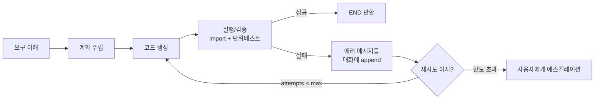
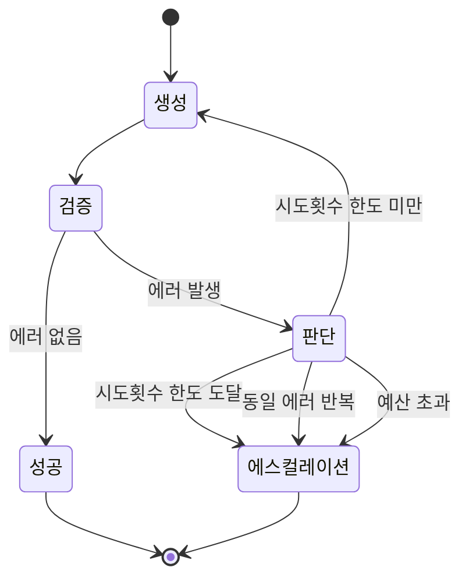

앞 편의 그래프는 사이클이 없다. 근거를 찾고, 코드를 쓰고, 끝난다. 그 코드가 도는지는 사용자가 붙여 넣어 보고 알게 된다.

실제 코딩 에이전트의 본체는 그 다음에 있다 — **생성한 코드를 실행해 보고 틀리면 고치는 순환**이다. 그런데 이 순환을 붙이는 순간 성격이 완전히 다른 시스템이 된다. 그래프에 사이클이 생겨 끝나지 않을 수 있고, LLM이 만든 문자열이 실제로 실행되므로 근거로 삼은 웹 문서에 심긴 지시가 그대로 돈다. 이 글은 그 순환을 상태 설계부터 세우고, 실행 권한이 여는 위협과 그것을 닫는 장치들을 정리한다. [앞 편](/blog/ai-agent/dynamic-rag-code-agent/)에서 근거 확보 층까지 만들었다.

## 용어 정리

앞 편의 용어표에서 이 글이 쓰는 행만 추렸다.

| 약어 / 용어 | 원어 | 뜻 |
|---|---|---|
| Self-Correction | 자기수정 루프 | 생성 → 실행/검증 → 오류를 다시 입력으로 넣어 재생성하는 순환 구조 |
| Sandbox | 샌드박스 | 임의 코드를 호스트와 격리된 환경에서 실행시키는 장치(컨테이너·gVisor·Firecracker 등) |
| Structured Output | 구조화 출력 | LLM 출력을 Pydantic 스키마로 강제하는 기능 |
| Reducer | 리듀서 | 노드 반환값을 덮어쓰지 않고 누적하도록 지정하는 병합 규칙. `operator.add` 등 |
| `recursion_limit` | — | 허용하는 최대 super-step 수. 초과 시 `GraphRecursionError` |
| RCE | Remote Code Execution | 원격 코드 실행 취약점 |
| cgroup | control group | 리눅스 커널의 자원 상한 장치. CPU·메모리 제한에 쓰인다 |
| 에스컬레이션 | escalation | 자동 처리를 포기하고 사람에게 넘기는 것 |

## 자기수정 루프



### 검증을 2단으로 쪼개는 이유

| 단계 | 검사 대상 | 실패 시 피드백 | 비용 |
|---|---|---|---|
| 1. import 검증 | 임포트문만 실행 | "패키지 없음 / 심볼 오타" | 매우 낮음 |
| 2. 실행 검증 | 본문 실행 + 테스트 | 런타임 스택트레이스 | 높음 |

**도식의 「실행/검증」 한 노드가 표에서는 두 단계로 갈라진다.** 도식이 흐름을 그리느라 접어 둔 것이 이 분할인데, 접힌 쪽에 요점이 있다.

> 값싼 검사를 먼저 돌리면 **존재하지 않는 API를 지어낸 환각형 오류를 실행 전에 걸러낸다.** 앞 편이 제기한 "최신 프레임워크 환각"이 정확히 이 층에서 잡히는 오류다.
>
> 즉 앞 편은 **입력 쪽(근거 주입)으로**, 자기수정은 **출력 쪽(사후 검증)으로** 같은 문제를 친다. 둘 중 하나만으로는 부족하다 — 근거를 붙여도 모델이 문서에 없는 함수를 만들어 낼 수 있고, 검증만 두면 애초에 맞을 확률이 낮아 재시도가 늘어난다. 실무에서는 둘을 함께 쓴다.

### 상태 스키마 — 코드·에러·시도 횟수

```python
class CodeSolution(BaseModel):
    prefix: str = Field(description="문제 접근 설명")
    imports: str = Field(description="import 문만")
    code:    str = Field(description="import를 제외한 실행 코드")

class CodeAgentState(TypedDict):
    # 대화 누적: 리듀서로 append. 실패 메시지가 여기 쌓여 다음 생성의 입력이 된다
    messages: Annotated[List, operator.add]
    context: str            # 검색/RAG로 확보한 근거 문서
    generation: CodeSolution
    error: str              # "yes" | "no" — 라우터가 읽는 판정값
    error_message: str      # 스택트레이스 원문
    iterations: int         # 시도 횟수 — 종료 조건의 핵심
```

설계 결정이 셋 들어 있다.

| 결정 | 내용 | 없으면 |
|---|---|---|
| 코드를 `imports` / `code`로 쪼개 담는다 | 검증을 2단으로 나누려면 상태도 2단으로 쪼개져 있어야 한다 | 임포트만 따로 실행할 방법이 없어 값싼 검사가 성립 안 함 |
| `messages`에 `operator.add` 리듀서 | 노드가 반환한 리스트가 덮어쓰기가 아니라 append 된다 | 실패 이력이 사라져 LLM이 "아까 그 방법은 안 됐다"를 모른다 |
| `iterations`를 상태에 둔다 | 종료 조건을 영속 상태 위에 세운다 | 파이썬 지역변수로 세면 체크포인트 복원 시 카운터가 리셋된다 |

세 결정이 전부 "무엇을 상태에 둘 것인가"의 문제이고, 앞 편의 판정값 설계와 같은 원리다. 첫 행은 구조화 출력이 두 번째로 값을 하는 자리이기도 하다 — 앞 편에서는 라우팅 값을 보장하려고 썼고, 여기서는 **검증 단위를 가르려고** 쓴다.

### 자기수정 조건 엣지 골격

```python
def code_check(state: CodeAgentState):
    solution, iterations = state["generation"], state["iterations"]
    # 1단계: 임포트만 검증
    try:
        exec(solution.imports)
    except Exception as e:
        return {"messages": [("user", f"임포트 검증 실패: {e}")],
                "error": "yes", "error_message": str(e), "iterations": iterations + 1}
    # 2단계: 본문 실행
    try:
        exec(solution.imports + "\n" + solution.code)
    except Exception as e:
        return {"messages": [("user", f"실행 검증 실패: {e}")],
                "error": "yes", "error_message": str(e), "iterations": iterations + 1}
    return {"error": "no", "iterations": iterations + 1}


MAX_ITERATIONS = 3

def decide_to_finish(state: CodeAgentState) -> Literal["generate", "escalate", "__end__"]:
    if state["error"] == "no":
        return "__end__"                 # 검증 통과 → 종료
    if state["iterations"] >= MAX_ITERATIONS:
        return "escalate"                # 한도 초과 → 사람에게 넘김
    return "generate"                    # 에러 메시지를 물고 재생성

workflow.add_conditional_edges(
    "code_check", decide_to_finish,
    {"generate": "generate", "escalate": "human_handoff", "__end__": END},
)
```

> **`exec()`를 그대로 쓰는 것은 구조를 보이기 위한 코드다.** 프로덕션에서 LLM이 생성한 문자열을 호스트 프로세스에서 `exec`하는 것은 **원격 코드 실행을 스스로 열어주는 것**과 같다.
>
> 그리고 이 골격에는 그것보다 앞서는 문제가 하나 더 있다. `exec`이 성공했다는 것은 예외가 안 났다는 뜻일 뿐 **코드가 옳다는 뜻이 아니다.** 실제 검증 단계에는 단위 테스트가 들어가야 하고, 그러면 "테스트를 누가 쓰는가"라는 질문이 따라온다. 모델이 자기 코드의 테스트를 쓰면 같은 오해가 양쪽에 복제된다.

## 실행 권한이 여는 위협

임의 코드 실행은 코딩 에이전트에서 **가장 큰 단일 리스크**다. LLM이 악의적이지 않아도, 근거로 삼은 웹 문서나 깃헙 레포에 프롬프트 인젝션이 심겨 있으면 그대로 실행된다. 앞 편의 구조가 **외부 검색 결과를 그대로 컨텍스트에 넣는다**는 점을 떠올리면, 여기에 실행 노드를 붙이는 순간 공격 경로가 완성된다.

| 위협 | 구체적 시나리오 | 통제 수단 |
|---|---|---|
| 호스트 침해 | `os.system("rm -rf ...")`, 서버 파일 열람 | 컨테이너·마이크로VM 격리, 비특권 사용자 |
| 자격증명 탈취 | `os.environ` 덤프, `~/.aws/credentials` 읽기 | 실행 컨테이너에 시크릿을 **주입하지 않음**, 환경변수 화이트리스트 |
| 데이터 유출 | 결과를 외부로 POST | **네트워크 기본 차단(deny-all)**, 필요한 호스트만 allowlist |
| 자원 고갈 | 무한 루프, 메모리 폭주, 포크 폭탄 | CPU/메모리 cgroup 제한, `ulimit -u`(프로세스 수), 실행 타임아웃 |
| 디스크 훼손 | 소스 트리 덮어쓰기 | read-only 루트 FS + 쓰기 가능한 tmpfs 작업 디렉터리만 마운트 |
| 상태 오염 | 이전 시도의 잔여물이 다음 검증을 오염 | 시도마다 **일회용 컨테이너**로 재생성 |
| 프롬프트 인젝션 | 검색된 문서가 "다음 코드를 실행하라"고 지시 | 근거 문서를 데이터로 구분 표기, 실행 전 사용자 승인 게이트 |

일곱 위협 중 다섯은 코드 실행 일반의 문제이고 [AutoGen의 신뢰 경계 편](/blog/ai-agent/autogen-conversation-agents/)에도 대응 항목이 있다. 여기에만 있는 것이 **디스크 훼손**과 **상태 오염** 둘이다. 반대로 그쪽에만 있는 것도 둘(비용 폭주·패키지 설치)이라, 어느 한쪽만 보면 네 항목을 놓친다.

두 고유 항목이 자기수정 루프에서 나온다는 점이 중요하다. 한 번 실행하고 끝나는 구조에서는 잔여물이 문제가 되지 않지만, **같은 작업 공간에서 여러 번 시도하는 순간 이전 시도가 다음 시도의 환경이 된다.** 2회차에서 통과한 코드가 1회차가 만들어 둔 파일 덕분에 통과한 것일 수 있고, 그러면 검증이 거짓 양성을 낸다.

### 격리 강도 선택 기준

| 등급 | 수단 | 적합한 상황 | 한계 |
|---|---|---|---|
| 1 | `subprocess` + 타임아웃 | 개인 로컬 실험 | 호스트와 같은 커널·파일시스템. 방어라고 부르기 어렵다 |
| 2 | Docker 컨테이너 (비특권, 네트워크 off, 읽기전용 FS) | 사내 도구의 현실적 기본값 | 커널 공유 — 컨테이너 탈출 취약점에 노출 |
| 3 | gVisor / Firecracker 마이크로VM | 외부 사용자 코드를 받는 서비스 | 운영 복잡도·콜드스타트 |
| 4 | 원격 격리 실행 서비스 | 규제 산업, 멀티테넌트 | 지연·비용·데이터 반출 검토 필요 |

> 이 표는 **누구의 코드를 실행하는가**로 등급을 가른다. 앞의 AutoGen 편은 같은 문제를 실행기 클래스(Local / Docker / Jupyter)로 나눴는데, 축이 다르다.
>
> 실행기 카탈로그는 "무엇을 쓸 수 있는가"를 말하고 이 표는 "어디까지 필요한가"를 말한다. 그래서 겹치는 것은 사실상 등급 1·2뿐이고, 등급 3과 4는 프레임워크가 제공하는 선택지가 아니라 인프라 결정이다. **컨테이너로 충분한지 아닌지는 코드의 출처가 정한다** — 사내 개발자가 쓰는 도구와 익명 사용자의 코드를 받는 서비스는 같은 등급일 수 없다.

등급 2를 실제 클러스터에서 여러 대로 굴릴 때 무엇이 더 붙는지는 [이미지에서 무중단 교체까지를 다룬 편](/blog/backend-engineering/kubernetes-deployment-and-rollout/)에 있다.

### 최소 방어선

```text
[ ] 네트워크 deny-all (필요 도메인만 allowlist)
[ ] 실행 타임아웃 — 프로세스 트리 전체 kill
[ ] 메모리·CPU 상한 (cgroup) / read-only 루트 FS + tmpfs 작업 디렉터리
[ ] 컨테이너에 시크릿 미주입 / 시도마다 컨테이너 폐기·재생성
[ ] 파괴적 작업(파일 삭제·git push·배포)은 사람 승인 게이트
[ ] 실행 로그·명령 전문 감사 기록
```

여섯 줄 중 셋이 "프로세스 트리 전체 kill", "cgroup 상한 + tmpfs", "시도마다 컨테이너 폐기"인데, 이 셋이 자기수정 루프 때문에 추가된 것이다. 타임아웃을 걸어도 자식 프로세스가 살아남으면 다음 시도가 오염되고, 시도가 반복되므로 자원 상한이 누적으로 필요해진다.

> 조직에 코딩 에이전트를 도입할 때 실제 논쟁은 "어떤 모델이 똑똑한가"가 아니라 **"에이전트에게 무엇을 실행할 권한을 줄 것인가"다**.
>
> 실무 답안은 권한을 등급으로 나누는 것이다. 읽기(코드 검색·리뷰) → 로컬 실행(테스트) → 쓰기(커밋) → 배포 순으로 나누고 등급마다 승인 게이트를 다르게 둔다. 처음에는 읽기와 로컬 실행까지만 자동화하고 쓰기부터는 사람 리뷰를 강제한 뒤, 신뢰가 쌓이는 속도에 맞춰 게이트를 푼다. 한 번에 다 열면 실패했을 때 원인이 모델인지 권한 설계인지 구분되지 않는다.

## 사이클이 있는 그래프를 어떻게 끝내는가



| 겹 | 장치 | 성격 | 비고 |
|---|---|---|---|
| 1 | `MAX_ITERATIONS` (앱 레벨) | **의미 있는 종료** — 상태의 `iterations`로 판정 | 통상 3회. 3번 못 고치면 접근 자체가 틀린 경우가 많다 |
| 2 | `recursion_limit` (프레임워크 레벨) | **안전망** — 초과 시 `GraphRecursionError` | 앞 편의 앱은 `config={"recursion_limit": 100}` 사용 |
| 3 | 토큰·비용 예산 | 경제적 상한 | 누적 토큰을 상태에 기록하고 초과 시 중단 |
| 4 | 벽시계 타임아웃 | 사용자 체감 상한 | 전체 실행 N초 초과 시 현재까지 결과 반환 |

**도식의 「판단 → 에스컬레이션」 화살표는 셋인데 표는 네 겹이다.** 빠진 것은 2번(`recursion_limit`)과 4번(벽시계 타임아웃)이고, 대신 도식의 세 화살표 중 하나가 표의 3번과 겹친다. 그리고 이 어긋남이 우연이 아니다 — **2번과 4번은 앱 상태기계 밖에서 작동하는 장치**라 그림에 자리가 없다. 프레임워크가 예외를 던지고 런타임이 시간을 끊는 것은 상태 전이가 아니라 상태 전이의 중단이다. 상태기계 그림만 보고 종료 조건을 설계하면 이 둘이 통째로 빠진다.

> 1번과 2번의 성격 차이가 실무에서 가장 자주 흐려진다. **`recursion_limit`은 종료 조건이 아니라 안전망이다.**
>
> 이 값에 걸려서 멈추는 것은 정상 종료가 아니라 사고다 — 사용자에게는 예외로 나타나고 그때까지 태운 토큰은 회수되지 않는다. 의미 있는 종료는 항상 1번에서 나야 하고, 2번은 1번이 실패했을 때만 작동해야 한다. `recursion_limit`을 100으로 올려 두고 앱 레벨 상한을 두지 않으면 사고가 100 스텝 뒤에 일어난다.

### 진전 없음 감지

횟수만 세면 **같은 에러로 세 번 도는** 낭비가 생긴다. 오류 지문을 비교해 조기 탈출한다.

```python
import hashlib

def error_fingerprint(msg: str) -> str:
    head = msg.strip().splitlines()[-1][:200]   # 예외 타입 + 메시지 마지막 줄
    return hashlib.sha1(head.encode()).hexdigest()

def decide_to_finish(state):
    if state["error"] == "no":
        return "__end__"
    fps = state.get("error_fps", [])
    # 동일 에러가 2회 연속 → 재시도해도 못 고친다고 판단
    if len(fps) >= 2 and fps[-1] == fps[-2]:
        return "escalate"
    if state["iterations"] >= MAX_ITERATIONS:
        return "escalate"
    return "generate"
```

> 이 장치가 값을 하는 이유는 **횟수 상한이 진전을 측정하지 않기 때문**이다. 세 번을 다 쓰고 실패하는 것과, 첫 두 번이 같은 에러라 세 번째가 무의미한 것은 다르다.
>
> 지문을 마지막 줄 200자로 자르는 것이 요령이다. 스택트레이스 전문을 비교하면 줄 번호가 조금만 달라져도 다른 오류로 잡히고, 예외 타입만 비교하면 서로 다른 원인이 같은 것으로 잡힌다. 예외 타입 + 메시지가 대개 적정선이다.

### 언제 사람에게 넘기는가

| 기준 | 판단 근거 |
|---|---|
| 시도 한도 소진 | 자동 수정 가능한 범위를 벗어남 |
| 동일 오류 반복 | 모델이 같은 오해를 반복 — 근거 부족이 원인일 가능성 |
| 오류 유형이 환경 문제 | 패키지 미설치·권한·네트워크는 코드 수정으로 못 고침 |
| 파괴적 조작 필요 | 파일 삭제·스키마 변경·배포는 애초에 사람 승인 대상 |
| 요구사항 자체가 모호 | 재시도가 아니라 **되묻기**가 정답 |

다섯 기준 중 뒤의 셋은 시도 횟수와 무관하게 **즉시** 넘겨야 하는 것들이다. 환경 문제를 세 번 재시도하는 것은 토큰만 태운다.

에스컬레이션 시에는 "실패했다"가 아니라 **무엇을 시도했고 어디서 막혔는지** — 시도한 접근, 마지막 스택트레이스, 확보한 근거 — 를 넘겨야 사람이 이어받을 수 있다.

## 상용 코딩 에이전트와의 거리

| 구분 | 축 | 이 구현 | 상용 코딩 에이전트 |
|---|---|---|---|
| 공통 | 근거 확보 후 생성 | 웹 검색 + 깃헙 RAG | 코드베이스 인덱싱·파일 읽기·웹 검색 |
| 공통 | 동적 판단 | 확신도·충분성 채점 | 어떤 파일을 열고 무엇을 검색할지 모델이 판단 |
| 공통 | 구조화 출력 | Pydantic 스키마 | 도구 호출 스키마 |
| 공통 | 중간 과정 스트리밍 | `graph.stream()` + UI | 진행 상황 실시간 표시 |
| **차이** | 실행 | **없음** (생성 후 즉시 종료) | 명령 실행·테스트 구동이 1급 기능 |
| **차이** | 자기수정 | 없음 (DAG) | 실패 → 수정 재시도 루프가 본체 |
| **차이** | 코드 지식원 | 외부 레포를 그때그때 임베딩 | **사용자의 실제 워크스페이스**를 인덱싱 |
| **차이** | 쓰기 권한 | 없음 (답변 텍스트만) | 파일 편집·생성·삭제 |
| **차이** | 격리 | 해당 없음 | 권한 모드·승인 게이트·샌드박스 |
| **차이** | 컨텍스트 관리 | 검색 결과 그대로 주입 | 요약·압축·선택적 로딩 |
| **차이** | 검색 방식 | 벡터 유사도(k=10) | 정확 문자열 검색(ripgrep) + 구조 탐색 병행 |

공통 넷과 차이 일곱. 그리고 차이 중 다섯(실행·자기수정·쓰기 권한·격리·컨텍스트 관리)이 이 글이 채운 것들이다. 남은 둘 — 지식원과 검색 방식 — 은 성격이 다르다.

> 마지막 행이 직관과 어긋난다. 상용 도구가 벡터 RAG보다 **정확 문자열 검색과 파일 탐색을 우선**하는 경우가 많다.
>
> 코드에서는 심볼 이름이 정확히 일치하는 경우가 압도적이라 임베딩 유사도보다 grep이 정밀하고, 인덱싱 비용과 최신성 문제도 없기 때문이다. "레포를 통째로 임베딩" 방식은 개념 학습에는 좋지만 규모가 커지면 두 곳에서 무너진다 — **인덱스 최신성**(커밋마다 재임베딩할 것인가)과 **청크 경계가 함수를 자르는 문제**다. 실무는 정확 검색과 벡터를 함께 쓰되 정확 검색을 앞에 둔다.

---

두 편을 관통하는 것은 하나다. **코딩 에이전트의 아키텍처는 두 겹이다.** 바깥은 근거 확보 루프 — 아는 질문인지 판정하고, 모르면 검색하고, 부족하면 코드베이스를 뒤진다. 안쪽은 검증 루프 — 생성한 코드를 2단으로 돌려 보고 실패하면 스택트레이스를 물고 재생성한다. 입력 쪽과 출력 쪽에서 같은 환각을 친다.

그리고 운영 관점에서 먼저 확인할 것도 둘로 정리된다. **격리** — 네트워크 차단·타임아웃·읽기전용 FS의 일회용 컨테이너인가. **종료 조건** — 앱 레벨 상한, 프레임워크 재귀 한도, 토큰 예산, 그리고 동일 오류 반복 시 조기 에스컬레이션이 있는가. 사이클이 있는 그래프에서는 **종료 조건이 곧 아키텍처**이고, 실행 권한이 붙은 그래프에서는 격리가 곧 신뢰 경계다.

---

작업 디렉터리 지정이 왜 격리가 아닌지, 권한 등급을 무엇으로 나누는지, 재귀 한도에 걸렸을 때 값을 올리면 안 되는 이유는 [운영 Q&A](/blog/ai-agent/ai-agent-qna-operations/)에 결론부터 모아 두었다.
