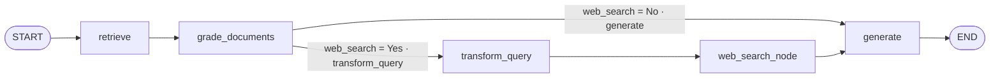
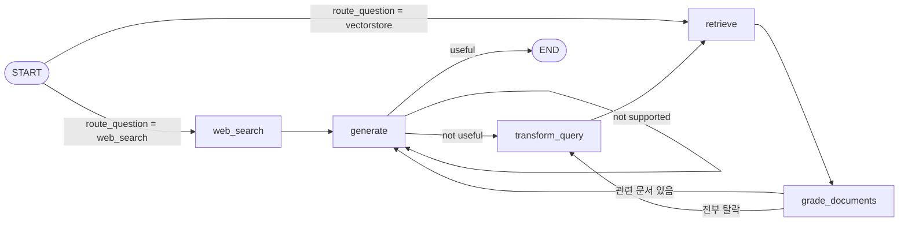

`decide_to_generate`라는 같은 이름의 함수가 두 구현에 있는데, 하나는 **"관련 문서가 전부 탈락했을 때만"** 발동하고 다른 하나는 **"하나라도 탈락하면 즉시"** 발동한다. 오타가 아니라 설계 의도의 차이다. 그리고 이 임계치 차이가 top-k 설정과 맞물려 시스템 전체의 성격을 바꾼다.

이 글은 벡터DB 안에 답이 없는 질문(F7)을 다루는 두 방식을 나란히 놓는다. CRAG는 **검색해 보고 부실하면 웹으로 보정**하고, Adaptive RAG는 **검색하기 전에 어디로 갈지 정한다.** 둘 다 웹 검색을 쓰지만 그 웹 결과를 기존 문서에 덧붙이느냐 통째로 대체하느냐까지 갈린다. [앞 편](/blog/ai-agent/self-rag-grader-design/)에서 Grader 셋을 붙인 Self-RAG까지 왔다.

## 용어 정리

앞 두 편의 용어표에서 이 글이 쓰는 행만 추렸다.

| 약어 / 용어 | 원어 | 뜻 |
|---|---|---|
| CRAG | Corrective RAG | 검색 문서가 부실하면 웹 검색으로 보정하는 RAG |
| Adaptive RAG | — | 질문 유형에 따라 데이터소스를 라우팅한 뒤 Self-RAG 검증을 붙인 통합형 |
| Grader | — | yes/no 등 정형 라벨을 뱉는 LLM 판정기. [앞 편](/blog/ai-agent/self-rag-grader-design/)의 3요소 패턴 |
| `with_structured_output` | — | LLM 출력을 Pydantic 스키마로 강제 파싱시키는 API |
| `Literal[...]` | typing.Literal | 허용값을 타입으로 못 박는 파이썬 문법 |
| Tavily | — | LLM용 웹 검색 API |
| DAG | Directed Acyclic Graph | 되돌아오는 간선이 없는 그래프 |
| F1 / F4 / F7 | — | 검색 실패 / 동문서답 / 근거 자체의 부재. 분류는 [1편](/blog/ai-agent/agentic-rag-as-tool/) 참조 |

## CRAG — 벡터DB가 모르면 웹에 물어본다

F7(근거 자체의 부재)을 겨냥한다. 검색 문서 중 **하나라도** 무관하면 "이 질문은 우리 DB만으로 답하기 부족하다"고 보고, 질문을 웹검색용으로 재작성한 뒤 결과를 문서 목록에 **덧붙인다.**



**루프가 하나도 없는 단방향 DAG다.** 재시도도, 자기 루프도 없다. 4종 중 가장 단순하고 가장 예측 가능한 지연 특성을 갖는다. 대신 환각 검증이 전혀 없다.

> 앞 시리즈 내내 "사이클을 표현할 수 있는 것이 LangGraph의 값어치"라고 했는데, CRAG는 그 사이클을 하나도 안 쓴다. 그래도 LangGraph로 짜는 것이 이상하지 않은 이유는 **조건부 분기**가 있기 때문이다.
>
> 사이클과 분기는 다른 기능이다. 되돌아가지 않아도 갈래가 여럿이면 그래프가 체인보다 읽기 쉽다. "루프가 없으니 LCEL로 충분하다"는 판단이 항상 맞는 것은 아니다.

### State — 플래그 한 칸 추가

```python
class GraphState(TypedDict):
    question: str
    generation: str
    web_search: str        # "Yes" / "No" — 웹검색 발동 여부 플래그
    documents: List[str]
```

Self-RAG는 "필터링 후 리스트가 비었는가"로 분기했지만, CRAG는 **명시적 플래그**를 State에 심는다. 발동 조건이 "전부 탈락"이 아니라 "하나라도 탈락"이라 리스트 크기만으로는 판별할 수 없기 때문이다.

이 한 칸이 상태 설계의 일반 원칙을 보여준다. **판정 결과를 뒤에서 다시 계산할 수 없으면 상태에 남긴다.** 리스트가 3개 남았다는 사실만으로는 원래 4개였는지 3개였는지 알 수 없다.

### 관련성 채점 + 플래그 세팅

채점 루프 자체는 [앞 편의 Self-RAG](/blog/ai-agent/self-rag-grader-design/)와 동일하다. 달라지는 곳은 세 줄뿐이다.

```python
def grade_documents(state):
    """관련 문서만 남기되, 하나라도 탈락하면 웹검색 플래그를 켠다."""
    filtered_docs = []
    web_search = "No"                                   # ← 추가
    for d in documents:
        score = retrieval_grader.invoke({"question": question, "document": d.page_content})
        if score.binary_score == "yes":
            filtered_docs.append(d)
        else:
            web_search = "Yes"                          # ← 단 하나만 탈락해도 즉시 켜짐
            continue
    return {"documents": filtered_docs, "question": question, "web_search": web_search}


def decide_to_generate(state):
    return "transform_query" if state["web_search"] == "Yes" else "generate"
```

> 이 "하나라도(any)" 조건은 **매우 공격적이다.** 상위 4개 문서 중 3개가 정답을 담고 1개만 노이즈여도 웹검색이 발동한다.
>
> 그리고 이것이 검색 파라미터와 직접 충돌한다. Retriever가 top-k를 넉넉히 가져올수록 무관 문서가 섞일 확률이 올라가므로, **k를 키울수록 웹검색이 거의 항상 켜지는** 구조다. 검색 품질을 높이려고 k를 올린 조치가 웹 API 비용을 폭증시키는 결과로 돌아온다.

실무에서는 "탈락 비율이 임계치 초과" 또는 "관련 문서 수 < 최소치" 같은 조건으로 바꾸는 것이 타당하다. 원 구현의 `any` 조건은 데모에서 웹검색 경로를 확실히 보여주기 위한 선택으로 읽는 편이 맞다.

### 웹검색 전용 재작성 프롬프트

```python
# CRAG의 재작성 프롬프트 — "for web search"로 최적화 대상이 다르다
system = """You a question re-writer that converts an input question to a better version that is optimized \n
     for web search. Look at the input and try to reason about the underlying semantic intent / meaning."""
```

Self-RAG·Adaptive RAG의 같은 자리 프롬프트는 `optimized for vectorstore retrieval`이다.

| 재작성 목적지 | 무엇을 최적화하나 |
|---|---|
| 벡터스토어 | 의미 밀도를 높여 임베딩 유사도를 개선 |
| 웹검색 | 검색엔진이 좋아하는 키워드형 질의로 변환 |

**재작성의 목적지가 다르면 프롬프트도 달라야 한다**는 원칙이 코드로 드러난 자리다. 1편의 Agentic RAG가 목적지를 명시하지 않은 것도 같은 원칙의 다른 면이었다 — 그쪽은 재작성 결과가 `agent`로 돌아가 목적지를 다시 정하므로 아직 특정할 수 없었다.

### 웹검색 노드 — 기존 문서에 덧붙이기

```python
from langchain.schema import Document

def web_search(state):
    """재작성된 질문으로 웹을 검색해 documents에 추가한다."""
    print("---WEB SEARCH---")
    question = state["question"]
    documents = state["documents"]      # 관련성 통과한 문서들

    docs = web_search_tool.invoke({"query": question})
    web_results = "\n".join([d["content"] for d in docs])
    web_results = Document(page_content=web_results)
    documents.append(web_results)       # 대체가 아니라 append

    return {"documents": documents, "question": question}
```

`append`가 중요하다. **벡터DB의 관련 문서 + 웹 결과를 함께** 근거로 쓴다. 아래에서 보듯 Adaptive RAG의 웹검색 노드는 여기서 갈린다.

## Adaptive RAG — 검색 전에 데이터소스를 고른다

앞의 세 변형은 모두 "일단 벡터DB를 검색하고 나서" 문제를 수습한다. Adaptive RAG는 **검색 전에** 질문 유형을 보고 데이터소스를 고른다. 여러 벡터DB를 운영하는 조직에서 특히 효과가 크다.

라우팅으로 데이터소스를 고른 뒤에는 Self-RAG의 3중 검증을 그대로 붙인다. 즉 **Adaptive RAG = 라우터 + Self-RAG + 웹검색 경로**다.



앞 편 Self-RAG의 도식과 겹쳐 보면 **왼쪽 두 갈래만 새로 붙었다.** 나머지는 그대로다. 통합형이라는 말이 은유가 아니라 구조 그대로다.

### 라우터 — 판단 기준은 "무엇이 인덱싱되어 있는가"

```python
from typing import Literal
from pydantic import BaseModel, Field   # langchain-core >= 0.3은 Pydantic v2 사용


class RouteQuery(BaseModel):
    """Route a user query to the most relevant datasource."""

    datasource: Literal["vectorstore", "web_search"] = Field(
        ...,
        description="Given a user question choose to route it to web search or a vectorstore.",
    )


llm = ChatOpenAI(model="gpt-4o-mini", temperature=0)
structured_llm_router = llm.with_structured_output(RouteQuery)

# 라우팅 판단 기준을 "인덱싱된 주제 목록"으로 명시한다
system = """You are an expert at routing a user question to a vectorstore or web search.
The vectorstore contains documents related to agents, prompt engineering, and adversarial attacks.
Use the vectorstore for questions on these topics. Otherwise, use web-search."""

route_prompt = ChatPromptTemplate.from_messages([
    ("system", system),
    ("human", "{question}"),
])
question_router = route_prompt | structured_llm_router
```

**라우팅 판단 기준의 정체**를 정확히 이해해야 한다. 프롬프트가 하는 일은 단 하나, "우리 벡터스토어에는 agents · prompt engineering · adversarial attacks 문서가 들어 있다"고 알려주는 것이다. 질문이 그 주제에 속하면 vectorstore, 아니면 web_search다.

| 항목 | 내용 |
|---|---|
| 판단 근거 | 시스템 프롬프트에 하드코딩된 **인덱스 주제 목록** |
| 판단 주체 | `gpt-4o-mini` + `with_structured_output(RouteQuery)` |
| 출력 형태 | `Literal["vectorstore", "web_search"]`로 강제된 2지 선택 |
| 검증 예시 | "Who will the Bears draft first in the NFL draft?" → `web_search` |
| 확장 시 | 벡터스토어가 여러 개면 `Literal["hr_docs", "product_docs", "web_search"]` 식으로 확장 |

마지막 행이 이 패턴의 실무 가치다. 라우팅 대상을 늘리는 일이 `Literal`에 값을 추가하고 시스템 프롬프트에 한 줄 적는 것으로 끝난다.

> 이 방식의 운영 리스크는 **인덱스 내용과 프롬프트 설명이 따로 논다**는 점이다.
>
> 문서를 새로 넣거나 뺐을 때 라우터 프롬프트를 함께 갱신하지 않으면 라우팅이 **조용히** 틀리기 시작한다. 에러도 로그도 남지 않고 검색 품질만 떨어진다. 실무에서는 컬렉션 메타데이터에서 주제 요약을 자동 생성해 프롬프트에 주입하는 편이 안전하다.

### 라우팅 조건 엣지 — START에 직접 건다

```python
def route_question(state):
    """질문을 웹검색 또는 RAG로 라우팅한다."""
    print("---ROUTE QUESTION---")
    source = question_router.invoke({"question": state["question"]})
    if source.datasource == "web_search":
        return "web_search"
    elif source.datasource == "vectorstore":
        return "vectorstore"


workflow.add_conditional_edges(
    START,                                  # 노드가 아니라 START에서 분기
    route_question,
    {"web_search": "web_search", "vectorstore": "retrieve"},
)
```

`add_conditional_edges`의 첫 인자로 **`START`를 직접 넣을 수 있다**는 점이 눈여겨볼 활용이다. 진입 노드 자체를 조건부로 만든다. 앞 시리즈에서 본 `add_edge(START, "chatbot")`이 고정 진입점이었다면, 이쪽은 진입점이 런타임에 정해진다.

### CRAG와 갈리는 지점 — 웹검색 노드의 반환값

```python
# Adaptive RAG의 web_search — 기존 documents를 읽지 않고 통째로 "대체"한다
def web_search(state):
    docs = web_search_tool.invoke({"query": state["question"]})
    web_results = Document(page_content="\n".join([d["content"] for d in docs]))
    return {"documents": web_results, "question": state["question"]}   # 리스트가 아닌 단일 객체
```

| | CRAG | Adaptive RAG |
|---|---|---|
| 진입 경로 | 관련성 채점 후 (보정용) | START 라우팅 직후 (주 경로) |
| documents 처리 | 기존 문서에 `append` | 통째로 **대체** |
| 반환 타입 | `List[Document]` | `Document` 단일 객체 |
| 이후 흐름 | `generate` → END | `generate` → 환각·적합성 검증 |

Adaptive RAG에서 웹검색은 **보정이 아니라 대안 경로**이므로 벡터DB 문서와 섞을 이유가 없다. 다만 세 번째 행의 반환 타입이 리스트가 아닌 것은 **의도라기보다 구현 결함**에 가깝다. 현재 흐름에서는 곧장 `generate`로 가므로 터지지 않지만, `grade_documents`를 거치게 바꾸면 순회에서 깨진다. 이 함정은 [마지막 편의 코드 함정 목록](/blog/ai-agent/groundedness-cost-limits/)에서 다시 다룬다.

## 재작성과 웹검색은 언제 발동하는가

네 변형의 발동 조건을 한 표에 놓으면 설계 의도의 차이가 드러난다.

| 변형 | 재작성 발동 조건 | 재작성 후 행선지 | 최적화 대상 | 웹검색 발동 조건 |
|---|---|---|---|---|
| Agentic RAG | 검색 결과 뭉치가 무관 판정 | `agent` (검색 여부부터 재판단) | 명시 없음 (의미 의도 추론) | 없음 |
| Self-RAG | ① 관련 문서 **전부** 탈락 ② 답변이 `not useful` | `retrieve` | `vectorstore retrieval` | 없음 |
| CRAG | 관련 문서 **하나라도** 탈락 | `web_search_node` | `web search` | 재작성 직후 항상 |
| Adaptive RAG | ① 관련 문서 **전부** 탈락 ② 답변이 `not useful` | `retrieve` | `vectorstore retrieval` | START 라우팅에서 `web_search` 선택 시 |

두 번째 열이 정반대인 두 구현이 함수 이름은 같다.

```python
# Self-RAG / Adaptive RAG — "전부 탈락"일 때만 (보수적)
if not filtered_documents:
    return "transform_query"

# CRAG — "하나라도 탈락"이면 즉시 (공격적)
if state["web_search"] == "Yes":
    return "transform_query"
```

> 같은 이름에 정반대 임계치가 들어간 이유는 **재작성이 두 구조에서 서로 다른 비용을 갖기 때문**이다.
>
> Self-RAG에서 재작성은 `retrieve → grade_documents(N회) → generate → 검증 2회`로 이어지는 **비싼 재검색 루프의 시작**이라 최후 수단으로 남긴다. CRAG에서 재작성은 웹검색 질의를 만드는 일회성 작업이고 그 뒤에 루프가 없으므로 부담 없이 발동한다. **임계치는 판정의 엄격함이 아니라 그 뒤에 따라오는 비용의 함수다.**

### Adaptive RAG의 라우팅-재작성 불일치

Adaptive RAG에는 코드상 논리적 빈틈이 하나 있다.

```python
workflow.add_edge("web_search", "generate")
...
workflow.add_edge("transform_query", "retrieve")   # 항상 벡터스토어로 돌아간다
```

라우터가 `web_search`로 보낸 질문의 답변이 `not useful` 판정을 받으면 `transform_query`로 갔다가 **`retrieve`(벡터스토어)로 들어간다.** 라우터가 "이 질문은 벡터스토어와 무관하다"고 이미 판단한 질문인데도 그렇다.

결과적으로 관련 문서가 전부 탈락 → 다시 재작성 → 다시 벡터스토어 순환에 빠지기 쉽다. 라우팅 결과가 그래프의 나머지 부분에 전달되지 않는 것이 원인이다.

| 수정 방향 | 방법 |
|---|---|
| 재라우팅 | 재작성 후 `route_question`을 다시 태운다 |
| 진입 경로 기록 | State에 `source` 필드를 두고 원래 데이터소스로 되돌린다 |

두 방향의 차이는 **라우팅을 매번 다시 판단할 것인가, 한 번 정한 것을 유지할 것인가**다. 앞은 재작성된 질문이 원 질문과 성격이 달라졌을 가능성을 인정하는 쪽이고, 뒤는 라우터의 첫 판단을 신뢰하는 쪽이다. 재작성 프롬프트가 "의미 의도를 유지하며 개선하라"는 지시라는 점을 보면 뒤쪽이 더 일관된 선택이다.

---

네 변형을 전부 봤다. 판정기를 하나에서 넷까지 늘렸고, 되돌아가는 지점도 검색 앞·생성 앞·라우팅 앞으로 나눴다. 그래서 환각은 사라졌는가.

**사라지지 않는다.** 이 구조가 측정하는 것은 사실성이 아니라 답변이 검색된 문서와 어긋나지 않는가이고, 문서 자체가 틀렸다면 그 오류를 충실히 옮긴 답변은 "근거 있음"으로 통과한다. 게다가 판정자도 생성기와 같은 계열 LLM이다. [다음 편](/blog/ai-agent/groundedness-cost-limits/)에서 이 구조가 실제로 보장하는 것과 그 대가를 호출 횟수까지 세어 정리한다.
