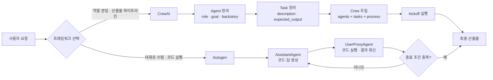
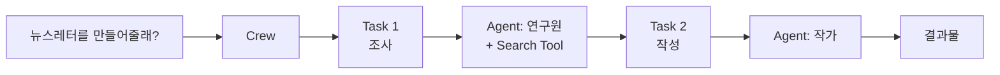
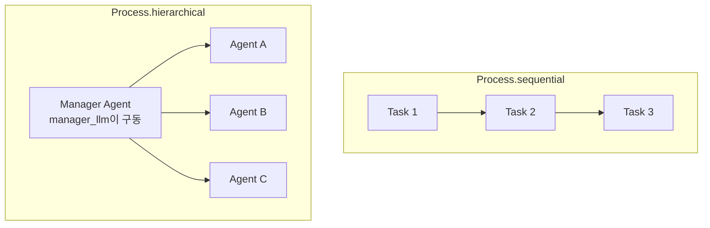

멀티에이전트 프레임워크는 크게 두 갈래다. **CrewAI**는 역할을 나눠 조립 라인처럼 흘려보내고, **AutoGen**은 에이전트끼리 대화하며 결론으로 수렴한다. 이 차이는 취향이 아니라 **"언제 멈추는가"가 어디에 새겨져 있는가**의 차이다.

이 시리즈는 두 프레임워크를 실행 모델까지 내려가 비교한다. 첫 편인 이 글은 CrewAI의 Agent·Task·Crew 세 개념과 각 파라미터의 기본값이 만드는 함정을 다룬다. [프레임워크 비교 편](/blog/ai-agent/agent-framework-comparison/)에서 "역할이 뚜렷한 협업이면 CrewAI"라고 정리했던 그 선택지를 실제로 조립해 보는 단계다.

## 용어 정리

| 약어 / 용어 | 뜻 |
|---|---|
| Agent | 역할(role)·목표(goal)·배경(backstory)을 부여받아 LLM으로 판단하는 실행 주체 |
| Task | 에이전트에게 맡길 단위 작업. 설명과 **기대 산출물**을 함께 명시 |
| Crew | Agent + Task 묶음. 실행 순서(Process)를 소유한 팀 컨테이너 |
| Process | Crew의 작업 실행 방식. `sequential`(순차) / `hierarchical`(계층) |
| Tool | 에이전트가 호출하는 외부 기능(검색·크롤링·재무조회 등) |
| kickoff | Crew 실행 진입점. `crew.kickoff()` |
| CrewOutput | Crew 실행 결과 객체. `.raw`로 최종 텍스트 접근 |
| delegation | 에이전트가 다른 에이전트에게 작업을 위임하는 기능 |
| RPM | Requests Per Minute. 분당 요청 수. LLM API 속도 제한 회피용 |

## 두 갈래 — 조립 라인과 회의실



도식에서 눈에 띄는 비대칭이 하나 있다. CrewAI 쪽은 화살표가 한 방향으로만 흐르고, AutoGen 쪽에는 **"종료 조건 충족?"이라는 판정 노드와 되돌아가는 화살표**가 있다. 두 프레임워크가 같은 문제를 어떻게 다르게 푸는지를 표로 펼치면 이 비대칭이 어디서 왔는지 보인다.

| 문제 | CrewAI의 해법 | AutoGen의 해법 |
|---|---|---|
| 한 프롬프트로 다 시키면 품질이 뭉개진다 | 역할(role)별 Agent 분리 | 페르소나별 Conversable Agent 분리 |
| 작업 순서를 어떻게 보장하나 | `Process.sequential` — 정의 순서대로 | 대화 패턴(2인·순차·GroupChat·중첩)으로 표현 |
| 결과 형식이 매번 다르다 | Task의 `expected_output`으로 계약 명시 | `system_message`로 출력 규격 지시 |
| LLM이 실제 데이터를 모른다 | Tool 주입 (`tools=[...]`) | Tool + Code Executor로 직접 실행 |
| 결과가 틀렸는지 검증할 수 없다 | 검토 Agent를 뒤 Task로 추가 | Critic 에이전트가 점수 매기고 재작업 요구 |
| 언제 멈추나 | Task 리스트 소진 = 종료 (**자동 종료**) | 종료 조건을 **직접 걸어야** 함 (`TERMINATE`·`max_round`) |

> 여섯 행 중 마지막 행이 결정적이다. 두 프레임워크의 차이는 **종료 조건의 소재지**다. CrewAI는 Task 리스트가 유한하므로 끝이 구조적으로 보장되고, AutoGen은 대화가 본질이라 끝을 사람이 설계해야 한다.
>
> 이 차이가 추상적으로 들린다면 순서를 뒤집어 보면 된다. **"이 시스템은 무엇 때문에 멈추는가"에 한 문장으로 답할 수 없으면, 그 시스템은 언젠가 안 멈춘다.**

## CrewAI 3요소

CrewAI는 네 덩어리 코드로 정리된다 — **Agent 정의 → Task 정의 → Crew·Process 정의 → Tool 정의**. 이 순서가 그대로 코드 순서다.



핵심은 Agent와 Task가 **별개 객체**라는 점이다. 에이전트는 "누구인가"이고 태스크는 "무엇을 하는가"라서, 같은 에이전트에 다른 태스크를 물릴 수 있고 그 반대도 된다.

### Agent — 정체성을 만드는 세 필드

| 파라미터 | 역할 | 기본값 |
|---|---|---|
| `role` | 팀 내 에이전트의 기능 정의. 가장 잘 수행할 작업 유형 결정 | 필수 |
| `goal` | 에이전트의 개별 목표. 의사결정 과정을 안내 | 필수 |
| `backstory` | 역할·목표에 대한 맥락 제공. 상호작용 강화 | 필수 |
| `llm` | 에이전트를 실행할 언어 모델. 환경 변수에서 동적으로 가져옴 | 환경변수 |
| `tools` | 사용 가능한 기능 세트 | `[]` |
| `function_calling_llm` | 도구 호출을 처리할 언어 모델 지정 | `llm` 상속 |
| `max_iter` | 수행 가능한 최대 반복 횟수 | `25` |
| `max_rpm` | 분당 최대 요청 수. 속도 제한 방지용 | `None` |
| `max_execution_time` | 작업 실행 최대 시간 | `None` |
| `verbose` | 상세 실행 로그 제공 여부 | `False` |
| `allow_delegation` | 에이전트 간 작업 위임 허용 여부 | `True` |
| `step_callback` | 각 단계 후 호출되는 함수. 로깅 등에 사용 | `None` |
| `cache` | 도구 사용 결과 캐시 여부 | `True` |
| `system_template` / `prompt_template` / `response_template` | 시스템·프롬프트·응답 형식 지정 | `None` |
| `allow_code_execution` | 코드 실행 허용 여부 | `False` |
| `max_retry_limit` | 오류 시 최대 재시도 횟수 | `2` |

앞의 세 필드가 정체성을 만들고 나머지는 전부 **통제 장치**다. 그리고 통제 장치의 기본값 셋이 실무에서 반복적으로 문제를 만든다.

> **`allow_delegation=True`가 기본이다.** 명시적으로 끄지 않으면 에이전트끼리 서로 일을 넘기며 토큰을 태운다. 역할 분리로 얻은 품질 이득을 위임 왕복이 그대로 상쇄한다.
>
> **`max_iter=25`는 도구 호출 루프의 상한선이다.** 툴이 계속 빈 결과를 주면 25회를 다 쓰고 나서야 멈춘다. 실전에서는 `3`이나 `5`로 조여 두는 편이 낫다.
>
> **`allow_code_execution=False`가 기본인 것은 안전한 설계다.** 반대로 AutoGen은 코드 실행이 기본 시나리오이며, 그 차이가 무엇을 뜻하는지는 [마지막 편](/blog/ai-agent/autogen-conversation-agents/)에서 신뢰 경계 관점으로 다룬다.

### Task — `expected_output`이 산출물 계약이다

| 파라미터 | 역할 | 기본값 |
|---|---|---|
| `description` | 작업의 간단한 설명 | 필수 |
| `agent` | 작업 수행 책임자 | 필수 |
| `expected_output` | 작업 완료 결과물 설명 | 필수 |
| `tools` | 사용 가능한 기능 목록 | `[]` |
| `async_execution` | 비동기 실행 여부 | `False` |
| `context` | 이 작업의 맥락이 되는 다른 작업들 | `None` |
| `config` | 추가 설정 세부사항 | `None` |
| `output_json` | JSON 형태로 출력. OpenAI 클라이언트 필요 | `None` |
| `output_pydantic` | Pydantic 모델 객체로 출력. OpenAI 클라이언트 필요 | `None` |
| `output_file` | 파일로 출력 저장 | `None` |
| `output` | TaskOutput 인스턴스. 다양한 형식의 출력 포함 | 자동 |
| `callback` | 작업 완료 시 실행되는 함수 | `None` |
| `human_input` | 인간의 피드백 필요 여부 | `False` |
| `converter_cls` | 구조화된 출력 변환 클래스 | `None` |

품질을 좌우하는 필드는 `description`이 아니라 **`expected_output`**이다. 이것이 사실상 산출물 계약서 역할을 한다.

> 계약이라는 말이 과장이 아닌 이유는 이 필드에 목차를 통째로 넣을 수 있기 때문이다. [다음 편의 주식분석 사례](/blog/ai-agent/agent-tool-design/)에서 투자자문 Task의 `expected_output`은 "제목 → 요약 → 기업개요 → 산업분석 → 재무분석 → 밸류에이션 → 투자의견 → 위험요인 → 재무제표" 9절 구성을 그대로 명시한다.
>
> **프롬프트 엔지니어링을 스키마 선언으로 바꾼 셈이다.** 그리고 형식을 더 강하게 못 박아야 하면 `output_json`이나 `output_pydantic`으로 내려간다 — 자연어 지시에서 타입 검증으로 옮겨 가는 것이다.

### Crew · Process — 팀 컨테이너

| 파라미터 | 역할 |
|---|---|
| `tasks` | 팀에 할당된 작업 리스트 |
| `agents` | 팀 구성원 리스트 |
| `process` | 팀이 따르는 작업 순서. `sequential` / `hierarchical` |
| `verbose` | 실행 중 로깅 상세도 |
| `manager_llm` | 계층적 프로세스에서 사용되는 언어 모델 |
| `function_calling_llm` | 도구 사용 시 전체 에이전트용 언어 모델 |
| `config` | 팀 추가 설정 (JSON 또는 Dict 형식) |
| `max_rpm` | 분당 최대 요청 수 |
| `language` / `language_file` | 팀 사용 언어(기본 영어) / 언어 파일 위치 |
| `memory` | 실행 기억 저장용. 단기·장기·개체(entity) 메모리 |
| `cache` | 도구 실행 결과 저장용 캐시 사용 여부 |
| `embedder` | 팀이 사용할 임베더 구성. 주로 메모리용 |
| `full_output` | 모든 작업 출력 또는 최종 출력만 반환 |
| `step_callback` / `task_callback` | 각 에이전트 단계 후 / 각 작업 완료 후 실행되는 함수 |
| `share_crew` | 팀과의 정보 공유 동의 여부 |
| `output_log_file` | 전체 출력 및 실행 로그 파일 생성 여부 |
| `manager_agent` / `manager_callbacks` | 사용자 정의 매니저 에이전트 설정 / 계층적 프로세스 매니저 콜백 |
| `prompt_file` | 사용할 프롬프트 파일 위치 |
| `planning` / `planning_llm` | 작업 계획 능력 추가 여부 / 계획 프로세스에 사용되는 언어 모델 |

`memory`·`cache`·`embedder`가 Crew 레벨에 있다는 점이 설계를 말해 준다. **기억과 캐시는 에이전트 개인의 것이 아니라 팀의 자산**이라는 전제다.

### 최소 골격

```python
from crewai import Agent, Task, Crew, LLM
from crewai.process import Process
import os
os.environ['OPENAI_API_KEY'] = os.getenv("OPENAI_API_KEY", "")

# 1) Agent — 역할·목표·배경 3종 세트가 정체성을 만든다
outline_generator = Agent(
    role='Outline Generator',
    goal='Create structured outlines for articles on given topics. answer in Korean',
    llm=LLM(model="openai/gpt-4o-mini", max_tokens=1000),   # 에이전트별 모델·토큰 분리 가능
    backstory='You are an expert at organizing information and creating outlines.'
)
writer = Agent(
    role='Writer',
    goal='Create engaging content based on research. answer in Korean',
    llm=LLM(model="openai/gpt-4o-mini", max_tokens=3000),   # 본문 작성은 토큰을 3배로
    backstory='You are a skilled writer who can transform complex information.'
)

# 2) Task — expected_output이 사실상 산출물 계약서
outline_task = Task(
    description="Create a detailed outline for an article about AI's impact on job markets",
    agent=outline_generator,
    expected_output="A comprehensive outline covering the main aspects of AI's influence"
)
writing_task = Task(
    description='Write an article about the findings from the research',
    agent=writer,
    expected_output="An engaging article discussing AI's influence on job markets"
)

# 3) Crew — 앞 Task의 산출물이 뒤 Task의 컨텍스트로 자동 전달된다
ai_impact_crew = Crew(
    agents=[outline_generator, writer],
    tasks=[outline_task, writing_task],
    process=Process.sequential,   # 기본값이지만 명시하는 편이 안전
    verbose=True
)

result = ai_impact_crew.kickoff()   # → CrewOutput 객체
print(result.raw)                   # 최종 텍스트
```

같은 모델을 쓰면서 `max_tokens`만 1000과 3000으로 갈라 둔 것이 눈여겨볼 부분이다. **개요 생성기는 길게 쓸 이유가 없고 작가는 짧게 쓸 이유가 없다.** 에이전트별로 모델과 토큰 예산을 분리할 수 있다는 것이 역할 분리의 실질적 이득 중 하나다.

### `sequential` vs `hierarchical`



| 구분 | sequential | hierarchical |
|---|---|---|
| 실행 순서 | Task 리스트 정의 순서 그대로 | 매니저가 위임 대상·순서를 **동적 결정** |
| 컨텍스트 전달 | 앞 Task 산출물이 뒤 Task로 자동 전달 | 매니저가 취합·재분배 |
| 필수 설정 | 없음 | `manager_llm` 또는 `manager_agent` |
| 비용 | 예측 가능 (Task 수에 비례) | 매니저 왕복이 추가되어 증가 |
| 적합한 곳 | 파이프라인이 이미 정해진 업무 | 무엇을 시킬지 런타임에 판단해야 하는 업무 |
| 리스크 | 앞 단계 오류가 그대로 전파 | 위임 루프·비용 폭증 |

> 표를 한 줄로 줄이면 **"순서를 코드가 정하느냐, LLM이 정하느냐"**다. sequential은 비용이 Task 수에 비례해 예측되고, hierarchical은 매니저가 몇 번 왕복할지 실행 전에는 알 수 없다.
>
> 그래서 판단 기준은 "어느 쪽이 똑똑한가"가 아니라 **"흐름이 런타임 입력에 따라 실제로 달라지는가"**다. 달라지지 않는다면 매니저 왕복 비용은 순수한 낭비다.

### 설정이 조용히 무시되는 자리

CrewAI 예제 코드에서 반복적으로 발견되는 오타가 하나 있다.

```python
Crew(..., Process=Process.sequential)   # ← 대문자 Process=
```

올바른 인자명은 소문자 `process`다. 대문자 `Process=`는 CrewAI가 인식하지 않는 이름이라 **조용히 무시**되고 기본값으로 돌아간다. 그런데 기본값이 마침 `sequential`이라 결과가 같아 보인다.

> 이 사례가 값진 이유는 버그의 크기가 아니라 **탐지 가능성** 때문이다. 설정이 무시돼도 결과가 그럴듯하면 사람은 눈치채지 못한다.
>
> 에이전트 시스템에서 **설정 검증(strict config)**이 필요한 이유가 여기 있다. 결정론적 시스템이라면 잘못된 설정이 예외로 터지지만, LLM이 끼면 잘못된 설정도 "그럴듯한 결과"를 낸다. **그럴듯함은 검증이 아니다.**

---

여기까지가 CrewAI의 뼈대다. 하지만 Agent와 Task만으로는 LLM이 실제 데이터를 만질 수 없다. 웹 검색이든 재무 조회든, 모델 바깥의 세계로 나가려면 **Tool**이 필요하다. [다음 편](/blog/ai-agent/agent-tool-design/)에서 내장 툴과 `@tool` 데코레이터, 그리고 툴 설계가 왜 컨텍스트 예산 관리인지를 다룬다.
