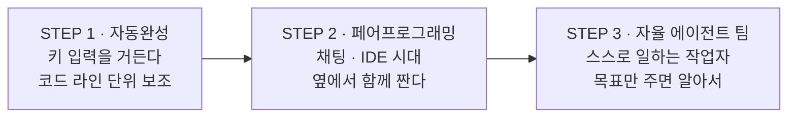
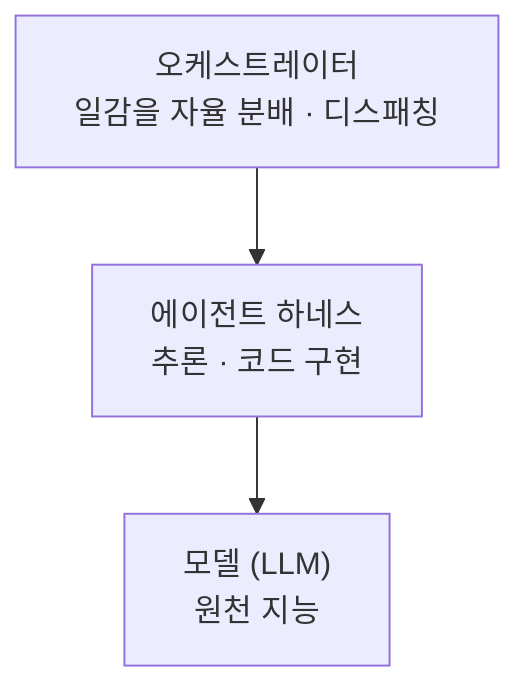
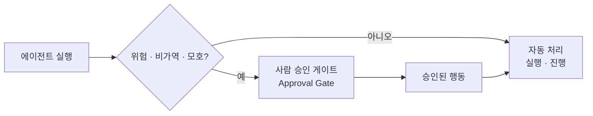

AI 코딩 도구의 도입률은 이미 논쟁거리가 아니다. 문제는 그 다음 숫자다 — 개발자는 업무의 약 60%에 AI를 쓰지만, **완전히 위임할 수 있는 일은 0~20%**에 불과하다. 40포인트가 넘는 이 간극에 이름이 붙어 있다. **위임 격차(Delegation Gap)**다.

이 글은 그 격차의 정체를 능력이 아니라 **신뢰와 구조**의 문제로 진단하고, 그것을 메우기 위한 전환 하나를 따라간다 — 사람이 앉아서 프롬프트를 치는 동기형에서, 트리거와 스케줄로 사람 없이 도는 비동기형으로. 그리고 그 전환이 성립하려면 반드시 있어야 하는 것, 즉 **완전자율과 무인 방치를 가르는 승인 게이트**를 설계한다. [앞 편](/blog/ai-agent/self-evolving-harness-governance/)이 하네스가 스스로 나아지는 구조를 다뤘다면, 이 글은 그 하네스를 사람 없이 굴리는 층을 다룬다.

이 구조의 실제 구현 — 누가 일감을 분배하고 워커는 어떻게 격리하는지 — 은 [다음 편](/blog/ai-agent/single-dispatcher-worker-isolation/)에 있다.

> 이 글은 **2026년 5월 자료를 정리한 것**이다. 등장하는 수치·사례는 전부 원 자료가 인용한 외부 보고이며, 벤더 발표와 업계 보도가 섞여 있다.

## 용어 정리

앞 편들의 용어표에서 이 글이 쓰는 행만 추리고, 자율성 용어를 더했다.

| 용어 | 원어 / 표기 | 뜻 |
|---|---|---|
| Delegation Gap | 위임 격차 | 업무에 AI를 쓰는 비율과 **완전히 위임 가능한** 비율 사이의 간극 |
| Calibrated Autonomy | 보정된 자율성 | 되돌릴 수 없거나·위험하거나·모호한 결정만 사람에게 넘기는 자율성 설계 |
| HITL | Human-in-the-Loop | 고위험 행동에 사람 승인 지점을 두는 설계 |
| 승인 게이트 | Approval Gate | 에이전트가 멈추고 사람의 결정을 기다리는 지점 |
| ADR | Architecture Decision Record | 아키텍처 결정과 그 근거를 기록으로 남기는 문서 |
| 동기형 · 비동기형 | Interactive · Background | 사람이 앉아 호출하는 방식 vs 트리거·스케줄로 사람 없이 실행되는 방식 |
| 오케스트레이터 | Orchestrator | 일감을 자율 분배하는 디스패칭 계층 |
| SoT | Source of Truth | 사람과 에이전트가 함께 참조하는 단일 진실 공급원 |
| Agent Harness | Agent Harness | 모델을 감싸 실행을 통제하는 구조. 정의는 [시리즈 첫 편](/blog/ai-agent/agent-equals-model-plus-harness/) |

## 도구는 세 단계를 지나왔다

핵심 전환은 2단계와 3단계 사이에 있다 — **"옆에서 돕는 도구"에서 "스스로 일하는 작업자"로.** 1단계와 2단계는 둘 다 사람이 키보드 앞에 있는 것을 전제하지만 3단계는 그렇지 않다. 이 차이가 아래 모든 논의의 출발점이다.

시장 쪽 숫자도 같은 방향을 가리킨다.

| 지표 | 값 | 기준 |
|---|---|---|
| 기업 앱이 최소 1개 AI 에이전트 탑재 | **80%** | 2024년 33% → 2026년 1분기 |
| 엔터프라이즈 코딩 에이전트 시장(연환산) | **$9.8–11B** | 2026년 4월 추정 |
| 한 SaaS 기업의 전사 AI 도입률 | **97%** | 2026년 1월 기준 |

세 행의 근거 강도가 다르다. 첫째는 서베이, 둘째는 **추정치**, 셋째는 한 기업의 자사 발표다. 특히 두 번째는 폭이 $9.8B에서 $11B로 12% 벌어져 있어 정밀한 값으로 확정되지 않는다.

## 60%와 0~20% 사이

> 쓰긴 쓰는데, 맡기진 못한다. 개발자는 업무의 약 **60%**에 AI를 사용하지만, **완전히 위임 가능한 일은 0~20%**에 불과하다. 이 격차의 정체는 능력이 아니라 **신뢰·구조**의 문제다.
>
> 이 진단이 실무에서 값을 하는 이유는 개선 방향을 바꾸기 때문이다. 능력 문제라면 더 좋은 모델을 기다려야 하지만, 신뢰·구조 문제라면 지금 설계할 수 있다. 그리고 조직 지표에도 함의가 있다 — **도입률(사용률)은 성과를 증명하지 못한다.** 60%라는 숫자는 이미 높지만 그 안에서 실제로 사람 손을 떠난 일은 최대 20%다. 측정해야 할 것은 사용률이 아니라 **위임 가능 비율**이다.

기존 방식의 병목은 셋이다.

| 병목 | 내용 |
|---|---|
| 손가락 속도 | 사람이 치는 만큼만 일이 진행된다 |
| 근무 시간 | 근무 시간이 곧 처리량의 상한이다 |
| 집중력 | 컨텍스트 전환 비용이 크다 |

셋 다 도구의 한계가 아니라 **사람이 루프 안에 있다는 사실 자체**에서 나온다. 그래서 해법도 도구 교체가 아니라 사람의 위치 변경이 된다.

| 구분 | 동기형 · Interactive | 비동기형 · Background |
|---|---|---|
| 방식 | 내가 앉아서 프롬프트 → 결과 확인 | 트리거·스케줄로 사람 없이 실행 |
| 사람의 역할 | 매 단계 호출·감독 | 결과만 받아본다 |
| 처리량 | **사람의 시간** | **시스템의 가동** |
| 대표 도구 | 책상 위 코딩 에이전트 | 상주형 오케스트레이터 |

세 번째 행이 이 표의 전부다 — 처리량의 단위가 사람의 시간에서 시스템의 가동으로 바뀐다. "당신이 보지 않는 동안 에이전트가 일한다"는 표현이 그 뜻이다.

## 경쟁이 아니라 계층이 다르다

이 도식이 발표의 핵심 복선이고, 뒤에서 "경쟁력의 위치"로 회수된다.

| 계층 | 정체 | 역할 |
|---|---|---|
| 자율형 에이전트 | **오케스트레이션 계층** | 메모리·스킬·스케줄·게이트웨이로 스스로 굴러간다 |
| 에이전트 하네스 | **실행 계층** | 강력한 추론·구현, 단 사람이 매번 호출한다 |
| 모델 | 원천 지능 | LLM |

**도식은 세 마디이고 표도 세 행이지만, 표에만 있는 것이 두 번째 열의 마지막 조건이다** — "단 사람이 매번 호출한다". 도식에서 세 계층은 그냥 위아래로 쌓여 있지만, 표를 보면 왜 위에 한 층이 더 필요한지가 나온다. 하네스는 성능은 좋은데 시동을 걸어 줄 사람이 필요하고, 오케스트레이션 계층은 그 시동을 대신 건다.

자율형이 푸는 문제는 셋이다.

| 문제 | 해결 |
|---|---|
| **24/7 가동** | 사람 근무 시간에 묶이지 않는다. 야간·주말에도 백로그가 줄어든다 |
| **병렬 처리** | 여러 작업을 동시에. 격리된 워커들에 분산 실행 |
| **부재 내성** | 트리거·재시도·하트비트로 사람이 없어도 지속·복구 |

세 번째가 가장 자주 누락된다. 24시간 돌리는 것과 사람이 없는 동안 실패를 복구하는 것은 다른 문제이며, 후자가 없으면 아침에 출근해서 밤새 멈춰 있던 파이프라인을 발견하게 된다.

## 자율 코딩은 이미 현장에 있다

| 사례 | 내용 | 수치 |
|---|---|---|
| **Devin · Cognition** | Goldman Sachs의 "하이브리드 인력" 파일럿 | PR 머지율 **34%(2024) → 67%(2025)**, 보안 수정에서 사람 대비 큰 효율 |
| **Factory · Droids** | 에이전트 네이티브 개발 플랫폼 | 기업가치 **$1.5B**(시리즈 C), Terminal-Bench 상위권, MongoDB·EY·Morgan Stanley·Nvidia 도입 |

> **위 수치는 벤더 발표와 업계 보도 기준이며 독립 검증된 값이 아니다.**
>
> 그래도 인용 가치가 있는 이유는 방향이 아니라 **단계**를 알려주기 때문이다. "자율 코딩"이 실험이 아니라 도입 경쟁 단계로 넘어갔다는 신호이고, 도입사 목록에 금융·컨설팅·인프라 기업이 섞여 있다는 점이 규제 산업에서도 통과됐다는 뜻이 된다. 다만 머지율 34% → 67%를 우리 조직의 목표치로 옮기면 안 된다 — 벤더가 자사 제품의 연간 성능 리뷰로 발표한 값이다.

## 상주형 오케스트레이터의 실제 형태

자료가 다룬 오픈소스 오케스트레이터는 이런 성격이다.

| 항목 | 내용 |
|---|---|
| 성격 | 오픈소스 자율 에이전트 프레임워크 |
| 라이선스·출시 | MIT · 2026년 2월 |
| 아닌 것 | IDE에 묶인 코파일럿도, API 챗봇 래퍼도 아니다 |
| 특징 | 오래 돌릴수록 똑똑해지는 자율 에이전트. 저가 VPS·GPU·서버리스 어디서든 상주 |

한 줄 정의는 이렇다 — **서버에 상주하며, 배운 것을 기억하고, 돌릴수록 더 유능해지는 에이전트.** 주목받은 이유로는 넷이 제시된다.

| 이유 | 내용 |
|---|---|
| **폭발적 성장** | 출시 2개월 만에 GitHub 10만+ 스타, 중순 기준 약 14만 |
| **비용 파괴** | 구독형 백엔드로 **월 $20 수준**의 프런티어급 운용 — 토큰 종량 과금 없이 |
| **개방 표준** | 스킬 개방 표준 호환 → 생태계가 빠르게 팽창 |
| **연구소의 신뢰** | 모델을 직접 만드는 연구소가 만든 에이전트라는 기술적 신뢰 |

핵심 기능은 일곱이다.

| # | 기능 | 내용 |
|---|---|---|
| ① | **닫힌 학습 루프 + 메모리** | 세션 시작 시 사용자·메모리 파일 자동 로드 — 빈 상태로 깨어나지 않는다. 전문 검색 기반 교차 세션 회상 + 요약, 사용자 모델링, 주기적 상기로 지식 자체 보존 |
| ② | **Skills — 절차적 기억과 자기 개선** | 어려운 문제를 풀면 재사용 가능한 `SKILL.md`를 **스스로 작성**. 프런트매터 기반 점진적 공개. 기본 85개 + 커뮤니티 520여 개 |
| ③ | **Soul — 개성과 일관성** | 별도 파일로 세션을 넘나드는 일관된 페르소나·말투 정의. 팀의 규약·말투를 에이전트에 각인 |
| ④ | **Cron — 스케줄 자동화** | 자연어로 "매일 06시 X 해줘" → 격리 세션이 실행하고 메신저로 보고. 반응형에서 능동형으로 전환하는 핵심. **cron 세션은 또 cron을 못 만든다(자기증식 방지)** |
| ⑤ | **멀티플랫폼 게이트웨이** | 메신저·메일·SMS 등 **20개 이상** 플랫폼을 하나의 게이트웨이로 |
| ⑥ | **어디서나 실행되는 런타임** | 6개 터미널 백엔드 — 로컬·컨테이너·SSH·서버리스 등. 서버리스는 유휴 시 거의 0원 |
| ⑦ | **위임·병렬 + 멀티에이전트 칸반** | 격리 서브에이전트를 띄워 병렬 작업, **내구성 칸반**으로 작업·상태·워커 신원 추적. 코드 실행으로 파이프라인 압축, MCP로 외부 도구 확장 |

> **일곱 기능 중 자율 실행을 실제로 가능하게 하는 것은 ①·④·⑦ 셋이다.**
>
> 나머지 넷은 편의 기능이지만 이 셋이 없으면 비동기형이 성립하지 않는다. 메모리가 없으면 매 세션이 백지에서 시작하고, 스케줄이 없으면 결국 사람이 호출해야 하고, 격리와 추적이 없으면 병렬 실행 결과를 신뢰할 수 없다. 특히 ④에 달린 단서 — **cron 세션은 또 cron을 만들지 못한다** — 가 이런 시스템 설계에서 반복적으로 등장하는 안전장치다. 자기증식 경로를 구조적으로 끊어 두지 않으면 예산 통제가 사후 대응이 된다.

### 성격이 다른 세 가지 운용 위치

같은 코딩 에이전트라도 어디에 두느냐로 성격이 갈린다. 아래 표는 제3자가 세 제품을 나란히 놓고 매긴 평가라 **각 벤더의 원 발표로 대조할 수 있는 값이 아니다.** 그래서 제품명 대신 **운용 위치**로 정리한다.

| 항목 | 동기형 드라이버 | 자율 백그라운드 워커 | 커뮤니티형 백그라운드 |
|---|---|---|---|
| 실행 위치 | 내 터미널·IDE | VPS·서버리스·어디서든 | VPS·서버 |
| 스케줄 | 제한적 (수동 호출) | **자연어 cron 내장** | cron 지원 |
| 메모리 | 프로젝트 범위 | **교차 세션 개인 메모리** | 세션 메모리 |
| 생태계 | 공식 벤더 지원 | 빠른 성장 | 최대 규모 |
| 안정성 | 안정적 | 가볍고 안정적 | 빠른 업데이트에 따른 변동성 |

> **결론은 경쟁이 아니라 보완이다 — 책상에는 동기형, 백그라운드에는 자율형.**
>
> 공유 코드 저장소가 셋을 묶는 지점이라는 점이 실무적으로 중요하다. 서로 다른 도구를 쓰더라도 결과물이 같은 저장소의 브랜치와 PR로 모이면 통합 비용이 들지 않는다. 도구 선택을 하나로 통일하려는 시도보다, **접점을 저장소 하나로 고정하는 편**이 관리 비용이 낮다.

생태계 스킬 사례를 보면 자동화 범위가 어디까지 갔는지 짐작된다 — 인프라 모니터링·자가 복구, 계약 리스크 분석과 다국어 조항 검토, 에이전트 간 협업 스웜 프레임워크, 개발 전주기 자동화, 성장·비즈니스 운영 플레이북. **"무엇을 자동화할지"는 결국 스킬이 결정한다**는 것이 이 목록의 시사점이다.

## 사람이 빠진다는 것의 정의

> 사람이 프롬프트를 하나하나 치는 단계가 **완전히 빠진** 시스템이다. **스스로 탐색** — 무엇을 해야 할지 백로그에서 찾는다. **스스로 구현** — 찾은 일을 직접 수행하고 검증한다.

| BEFORE — 사람이 모든 단계에 개입 | AFTER — 사람은 목표와 제약만 정의 |
|---|---|
| 할 일 식별 — **사람** | 목표·제약 정의 — **사람** |
| 프롬프트 작성 — **사람** | 탐색 — 에이전트 |
| 구현 — 에이전트 | 구현 — 에이전트 |
| 검토·조치 — **사람** | 검토·비평 — 에이전트 |
| 다음 작업 — **사람** | 조치 — 에이전트 |

왼쪽 열에는 사람이 네 번 나오고 오른쪽에는 한 번 나온다. 그런데 **줄어든 셋이 전부 실행 관련이고 남은 하나가 정의**라는 배치가 요점이다. 사람의 개입 횟수가 줄어든 것이 아니라 개입하는 **층위**가 올라갔다.

## 완전자율은 무인 방치가 아니다

> 완전자율 ≠ 무인 방치. **되돌릴 수 없거나 · 위험하거나 · 모호한** 결정은 사람에게 넘긴다.
>
> 세 조건이 서로 다른 종류라는 점이 설계상 중요하다. 되돌릴 수 없는 것은 **기술적 판정**이 가능하고(배포·삭제·외부 전송), 위험한 것은 **정책적 판정**이 필요하며(권한 범위·비용 상한), 모호한 것은 **에이전트 자신의 신뢰도 판정**에 달려 있다. 앞의 둘은 규칙으로 목록화할 수 있지만 세 번째는 그럴 수 없어서, 에이전트가 "모르겠다"고 말할 수 있는 경로를 따로 열어 둬야 한다.

패턴 이름은 **보정된 자율성 + 승인 게이트**다. 실행 절차는 네 단계다.

| # | 단계 | 내용 |
|---|---|---|
| 01 | **막힌다** | 에이전트가 비가역·모호한 지점을 만나면 멈춘다 |
| 02 | **표면화** | 의사결정을 코드 저장소의 ADR·리뷰 요청으로 올린다 |
| 03 | **사람 결정** | 근거와 함께 사람이 검토하고 결정한다 |
| 04 | **재개** | 결정이 내려지면 다시 자율 실행을 재개한다 |

**멈춤 → 표면화 → 결정 → 재개.** 상태는 보존되고, 사람은 결정에만 개입한다. 도식은 승인 여부를 판정하는 분기 하나를 그리고, 표는 그 분기가 실제로 도는 네 박자를 적는다 — 도식만 보면 승인이 즉시 나는 것처럼 보이지만, 표의 2번과 3번 사이에는 사람의 근무 시간이 통째로 들어갈 수 있다. **상태가 보존된 중단**이 아니면 그 시간 동안 작업이 죽는다.

의사결정을 코드 저장소에 두는 이유는 셋이다.

| 이유 | 내용 |
|---|---|
| **추적성** | PR·이슈·라벨에 결정의 흐름이 자연스럽게 기록된다 |
| **책임 분리** | 누가 무엇을 승인했는지가 남는다 |
| **공동 SoT** | 사람과 에이전트가 같은 진실 공급원에서 협업한다 |

세 번째가 결정적이다. 별도 승인 시스템을 두면 사람은 그쪽을 보고 에이전트는 저장소를 보게 되어 두 세계가 갈라진다. 실제 운용에서는 이슈에 상태 라벨과 우선순위 라벨을 붙여 "왜 막혔는지"를 최신 코멘트 하나로 읽을 수 있게 한다.

## 그래서 경쟁력은 어디에 있는가

> 오케스트레이터가 하는 일은 **자율적으로 일감을 분배하는 것**이고, 궁극의 추론·구현 알고리즘은 여전히 **하네스**에 있다.
>
> 이 구분이 투자 판단을 바꾼다. 디스패칭은 오픈소스로 공개돼 누구나 설치할 수 있으므로 여기에 시간을 쏟아도 남는 것이 없다. 반면 그 위에서 도는 스킬과 규약은 우리 업무를 코드화한 것이라 복제되지 않는다.

| 구분 | 성격 | 비유 |
|---|---|---|
| 디스패칭 | 범용재 — 누구나 설치해 쓸 수 있다 | **"엔진은 공용"** |
| 스킬 · SoT 계약 | 우리만의 업무 알고리즘·역할 설계 | **"레이스카는 우리 것"** |

해자는 시스템 위에서 돌아가는 **스킬과 규약**이다. 오케스트레이터는 그것을 자율로 작동하게 하는 디스패칭 계층일 뿐이다. 이 결론이 앞의 계층 도식에서 이미 예고돼 있었다 — 맨 위 계층이 가장 얇았다.

---

여기까지가 진단과 원칙이다. 위임 격차는 신뢰·구조의 문제이고, 처리량의 단위를 사람의 시간에서 시스템의 가동으로 옮기려면 승인 게이트가 먼저 있어야 하며, 경쟁력은 디스패처가 아니라 그 위의 스킬과 규약에 있다.

그러면 그 스킬과 규약은 실제로 어떻게 생겼는가. 워커를 여럿 띄우면 서로를 호출하다 감사 불가능한 그래프가 되는데, 그것을 막는 규칙은 무엇인가. [다음 편](/blog/ai-agent/single-dispatcher-worker-isolation/)에서 단일 디스패처 아키텍처와 "한 사이클 한 결정"이라는 하드 규칙, 그리고 결정 로그로 신뢰를 만드는 방법을 본다.
