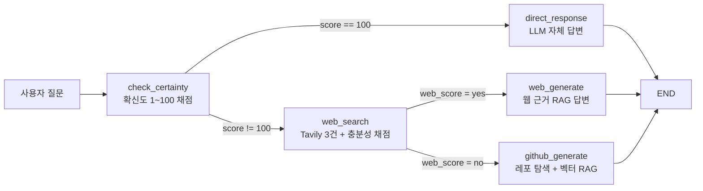
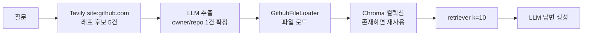

코드를 물으면 LLM은 대답한다. 문제는 그 대답이 **학습 시점에 갇혀 있다**는 것이다. LangGraph를 물었는데 존재하지 않는 "RankGraph"를 설명하거나, AutoGen 질문에 LangChain 코드를 준다. 최신 프레임워크일수록 심하고, 프레임워크가 최신이라서 묻는 것이니 정확히 필요한 곳에서 틀린다.

RAG를 붙이면 해결될 것 같지만 여기서 두 번째 문제가 나온다. **모든 질문에 검색을 붙이면 낭비다.** 파이썬 리스트 컴프리헨션을 묻는 질문에 웹을 뒤지는 것은 지연과 비용만 늘리고, 검색 결과가 오히려 답을 흐리기도 한다. 이 글은 그 사이를 가르는 구조 — 검색이 필요한 질문에만 검색을 태우는 동적 라우팅 — 를 코드로 조립한다. [앞 시리즈](/blog/ai-agent/tool-contract-and-partial-failure/)에서 도구가 코드를 실행하는 순간의 위험까지 언급하고 넘어왔다.

> 미리 범위를 그어 둔다. **이 구현에는 코드 실행 노드도, 샌드박스도, 에러 피드백 재시도 루프도 없다.** 그래프는 사이클이 없는 DAG이며 세 갈래 모두 한 번 생성하면 종료된다.
>
> 즉 여기서 만드는 것은 "코드를 실행하는 에이전트"가 아니라 **"코드를 답할 근거를 어디서 가져올지 고르는 에이전트"**다. 실행과 자기수정은 성격이 완전히 달라 다음 편에서 따로 세운다. 두 영역을 섞어 다루면 이 구조가 실제로 하는 일을 과장하게 된다.

## 용어 정리

| 약어 / 용어 | 원어 | 뜻 |
|---|---|---|
| RAG | Retrieval-Augmented Generation | 외부 문서를 검색해 프롬프트에 넣고 답하게 하는 기법 |
| Dynamic RAG | Dynamic / Adaptive RAG | 모든 질문에 검색을 붙이지 않고 **검색이 필요한 질문에만** 검색을 태우는 라우팅형 RAG |
| Structured Output | 구조화 출력 | LLM 출력을 Pydantic 스키마로 강제해 파싱 실패를 없애는 기능. `llm.with_structured_output(Model)` |
| Conditional Edge | 조건부 엣지 | 노드 실행 후 반환값에 따라 다음 노드를 고르는 분기. 라우터 함수가 문자열 키를 반환 |
| State | 그래프 상태 | 노드 간에 공유되는 `TypedDict`. 노드는 **변경분만** 반환하고 프레임워크가 병합 |
| Grader / Scorer | 채점 노드 | LLM에게 "이 결과로 답이 되나?"를 yes/no 또는 점수로 판정시키는 노드 |
| Tavily | Tavily Search API | LLM 에이전트용 웹 검색 API |
| Chroma | ChromaDB | 로컬 파일 기반 오픈소스 벡터 DB. `persist_directory`로 디스크 영속화 |
| PAT | Personal Access Token | GitHub 개인 액세스 토큰 |
| Sandbox | 샌드박스 | 임의 코드를 호스트와 격리된 환경에서 실행시키는 장치 |
| Self-Correction | 자기수정 루프 | 생성 → 실행/검증 → 오류를 다시 입력으로 넣어 재생성하는 순환 구조 |
| `recursion_limit` | — | 허용하는 최대 super-step 수. 초과 시 `GraphRecursionError` |

## 한눈에 보기



| # | 문제 | 해법 | 구현 위치 |
|---|---|---|---|
| 1 | LLM 코드 생성력은 올라갔지만 **학습 시점 이후 프레임워크는 모른다** | 외부 근거를 붙인 RAG 기반 코드 생성 | 그래프 전체 |
| 2 | 최신 프레임워크의 정답은 웹 블로그보다 **깃헙 레포 원본**에 있다 | 깃헙 레포를 로드·임베딩해 RAG | `github_generate` |
| 3 | 그렇다고 **모든 질문에 검색을 붙이면 낭비**다 | 확신도 채점으로 검색 자체를 건너뜀 | `check_certainty` |
| 4 | 웹 검색이 늘 충분한 것도 아니다 | 검색 결과의 **충분성을 다시 채점**해 깃헙으로 승격 | `web_search` |

**도식은 일곱 노드인데 표는 네 행이다.** 축이 다르다 — 도식은 실행 경로를, 표는 그 경로를 만든 문제를 말한다. 다만 대응은 정확하다. 표의 3·4행이 도식의 두 분기점이고, 1·2행이 세 종착 노드의 성격을 정한다. 주제문을 한 줄로 줄이면 이렇다 — **사용자의 모든 질문이 외부 검색을 필요로 하지는 않으므로, 동적으로 RAG를 실행할 수 있게 만드는 것이 중요하다.**

참조한 상용 사례는 둘이다. 웹 검색 기반 코드 생성(Cursor)과 깃헙 코드베이스 기반 코드 생성(Sage). 이 구현은 그 둘을 한 그래프에 넣고 **어느 쪽을 쓸지 판정하는 층**을 앞에 붙인 형태다.

## 상태 설계 — 판정값을 남긴다

에이전트 설계의 첫 단추는 "노드 사이를 흘러야 하는 것이 무엇인가"를 `TypedDict`로 고정하는 일이다.

```python
class AgentState(TypedDict):
    """The state of our agent."""
    question: str          # 원 질문 — 모든 노드가 읽는 유일한 입력
    certainty_score: int   # LLM의 자기 확신도 1~100
    search_results: list   # Tavily 웹 검색 결과 원본
    web_score: str         # 'yes' | 'no' — 웹 결과로 해결 가능한가
    repo_name: str         # 선택된 깃헙 레포 'owner/repo'
    generation: str        # 최종 답변 (세 경로가 모두 여기에 씀)
    github_chunks: list    # 검색된 코드 청크

llm = ChatOpenAI(model="gpt-4o-mini", temperature=0)
```

| 필드 | 성격 | 왜 상태에 있어야 하는가 |
|---|---|---|
| `question` | 입력 | 라우팅 후에도 계속 필요. 노드마다 재전달하면 결합도가 올라감 |
| `certainty_score`·`web_score` | **판정값** | 라우터가 읽는 유일한 근거. 노드와 라우터를 분리하는 접점이자, 스트리밍 UI가 "왜 이 경로인지"를 설명하는 재료 |
| `search_results` | 중간 산출 | 생성 노드가 재검색 없이 재사용 |
| `repo_name`·`github_chunks` | 추적용 | 답변의 **출처 표기**와 인용 청크 보존. 관측성 목적 |
| `generation` | 출력 | 세 경로가 같은 키에 쓰므로 종단 처리가 단일화됨 |

일곱 필드가 다섯 성격으로 묶이고, 그중 둘째 줄만 이 설계의 고유한 선택이다.

> **판정값을 상태에 남기는 것**이 핵심이다. 라우터가 노드 안에서 바로 분기하지 않고 상태를 경유한다.
>
> 이 우회가 두 가지를 동시에 얻는다. ① 라우팅 로직이 순수 함수가 되어 **단위 테스트가 가능**해진다 — 상태 딕셔너리를 만들어 넣으면 LLM 없이 분기를 검증할 수 있다. ② 스트리밍 UI가 "왜 이 경로로 갔는지"를 사용자에게 설명할 수 있다. 노드 안에서 바로 분기했다면 그 판정값은 함수 지역변수로 사라졌을 것이다.

## 판정 노드 ① — 확신도 채점

```python
def check_certainty(state: AgentState) -> AgentState:
    """Evaluate certainty score for the query."""
    question = state["question"]

    class CertaintyScoreResponse(BaseModel):
        score: int = Field(description="Certainty score from 1 to 100. Higher is better.")

    certainty_scorer = llm.with_structured_output(CertaintyScoreResponse)
    score_response = certainty_scorer.invoke(question)

    return {"certainty_score": score_response.score}


def route_based_on_certainty(state: AgentState) -> Literal["web_search", "direct_response"]:
    """Route to appropriate node based on certainty score."""
    score = state["certainty_score"]
    if score != 100:
        return "web_search"
    else:
        return "direct_response"
```

| 요소 | 값 | 해설 |
|---|---|---|
| 채점 척도 | 1~100 정수 | Pydantic `Field(description=...)`가 곧 채점 지시문 |
| 분기 임계값 | `score != 100` | **100점이 아니면 전부 검색.** 사실상 "거의 항상 검색" |
| 파싱 안전장치 | `with_structured_output` | 문자열 파싱·정규식 없이 타입 보장 |
| 온도 | `temperature=0` | 판정 노드는 재현성이 우선. 채점이 흔들리면 경로가 흔들림 |

> 두 번째 행이 이 구현의 가장 큰 결함이다. 실행 로그에서 *"Yolo v5를 실행하는 방법… 정확한 코드를 줄래?"* 질문의 `certainty_score`는 **90**이었고, `!= 100` 임계값 때문에 웹 검색으로 갔다.
>
> 즉 이 임계값은 **`direct_response` 경로를 사실상 죽이는 설정**이다. 게이트를 만들어 놓고 항상 열어 둔 셈이라, 3번 문제(모든 질문에 검색을 붙이면 낭비다)를 제기해 놓고 해결하지 못했다. 고치는 방향은 명확하다 — 임계값을 80 정도로 낮추고, 코드에 박지 말고 설정값으로 외부화해 경로별 정답률을 보며 조정한다.

그리고 더 근본적인 의문이 남는다. **LLM이 자기 확신도를 정확히 알 수 있는가.** 답은 아니다 — 이것은 캘리브레이션되지 않은 자기보고값이다. 그래서 확신도 하나로 끝내지 않고 뒤에 판정을 한 겹 더 두는 다단 구조가 필요하다.

## 판정 노드 ② — 웹 검색 + 충분성 채점

한 노드가 **검색과 채점을 동시에** 수행한다. 검색 결과를 상태에 남기고, 그 결과로 답이 되는지를 별도 LLM 호출로 판정한다.

```python
def web_search(state: AgentState) -> AgentState:
    """Perform web search and evaluate results"""
    question = state["question"]

    search_tool = TavilySearchResults(max_results=3)
    search_results = search_tool.invoke(question)

    class answer_availability(BaseModel):
        """Binary score for answer availability."""
        binary_score: str = Field(description="""
            If web search result can solve the user's ask, answer 'yes'.
            If user's ask is related with github or search_results are insufficient, answer 'no'""")

    evaluator = llm.with_structured_output(answer_availability)
    eval_prompt = ChatPromptTemplate.from_messages([
        ("system", """Evaluate if these search results can answer the user's question
            with a simple yes/no. If user ask github related info, then it is not
            sufficient with web search so you should answer with no."""),
        ("user", "Question: {question}\nSearch Results: {results}\nCan these results answer adequately?")
    ])
    evaluation = evaluator.invoke(
        eval_prompt.format(
            question=question,
            results="\n".join(f"- {r['content']}" for r in search_results)
        )
    )
    return {"search_results": search_results, "web_score": evaluation.binary_score}
```

| 단계 | 질문 | 판정 주체 | yes → | no → |
|---|---|---|---|---|
| 1 | "내가 아는 내용인가?" | `check_certainty` (100점?) | 바로 생성 | 웹 검색 |
| 2 | "웹 결과로 충분한가?" | `web_search` 내부 grader | 웹 RAG 생성 | 깃헙으로 승격 |
| 3 | "어느 레포인가?" | `github_generate` 내부 추출기 | 해당 레포 임베딩 후 RAG | — |

**표 세 행이 위 도식의 세 종착 경로와 대응한다.** 도식은 갈래를, 표는 각 갈래를 고르는 질문을 말한다. 3행에 `no` 칸이 비어 있는 것이 이 구조의 끝이다 — 깃헙에서도 못 찾으면 되돌아갈 곳이 없다.

> 초안의 grader 지시문은 단순히 *"can answer? yes/no"*였다. 배포본은 여기에 **"깃헙 관련 질문이면 무조건 no"**라는 하드 룰을 추가했다.
>
> LLM 판정이 흔들리는 것을 **규칙으로 고정**한 사례다. 자율 판단에 맡기면 같은 질문이 실행마다 다른 경로로 가는데, 깃헙 질문은 웹 검색으로 부족하다는 것이 이미 아는 사실이라 판정에 맡길 이유가 없다. **도메인 지식으로 확실한 부분은 프롬프트에 규칙으로 못 박는 편이 안정적이다** — 판정 노드를 두는 목적은 모르는 것을 정하는 것이지 아는 것을 다시 묻는 것이 아니다.

## 생성 노드 — 웹 RAG와 깃헙 RAG

```python
def web_generate(state: AgentState):
    question, web_results = state["question"], state["search_results"]

    def format_web_results(results):   # 출처 URL을 본문과 함께 주입
        return "\n".join(
            f"Source {i}:\nURL: {r['url']}\nContent: {r['content']}\n"
            for i, r in enumerate(results, 1)
        )

    prompt = ChatPromptTemplate.from_messages([
        ("system", """You are a helpful assistant that generates comprehensive answers
        based on web search results. Make sure to synthesize information from multiple
        sources when possible. If the search results don't contain enough information
        to fully answer the question, acknowledge this limitation."""),
        ("user", "Question: {question}\n\nSearch Results:\n{web_results}\n\nAnswer in Korean")
    ])
    chain = ({"question": lambda x: x["question"],
              "web_results": lambda x: format_web_results(x["web_results"])}
             | prompt | llm | StrOutputParser())
    return {"generation": chain.invoke({"question": question, "web_results": web_results})}
```

> 이 노드의 장치는 둘이다. **출처 URL을 프롬프트에 함께 넣어** 근거 추적이 가능하게 한 것, 그리고 **"정보가 부족하면 부족하다고 인정하라"**는 지시로 환각을 억제한 것.
>
> 앞 시리즈의 Perplexity 클론이 [인용을 못 붙였던 이유](/blog/ai-agent/focus-routing-and-citations/)와 비교하면 차이가 선명하다. 거기서는 도구가 문자열 한 덩어리를 반환해 소스 경계가 사라졌다. 여기서는 `Source {i}:\nURL: ...` 형식으로 경계를 살려 넣는다. 여전히 각주를 강제하지도 검증하지도 않지만, **적어도 인용의 정의역은 프롬프트 안에 존재한다.**

### 깃헙 RAG — 3단 파이프라인



```python
def github_generate(state: AgentState) -> AgentState:
    class GitHubRepo(BaseModel):
        repo_name: str = Field(description="Full repository name in format 'owner/repo'")

    question = state["question"]
    # 1. 깃헙으로 한정한 재검색  2. 후보 중 단 하나의 레포를 구조화 출력으로 확정
    search_results = TavilySearchResults(max_results=5).invoke(
        f"github repository {question} site:github.com")
    repo_extractor = llm.with_structured_output(GitHubRepo)
    repo_name = repo_extractor.invoke(
        eval_prompt.format(question=question, results=...)).repo_name

    # 3. 레포를 벡터화하고 RAG
    vectorstore = git_vector_embedding(repo_name)
    retriever = vectorstore.as_retriever(search_kwargs={"k": 10})
    result = rag_chain.invoke(question)
    return {"repo_name": repo_name, "generation": result, "github_chunks": retrieved_chunks}
```

검색을 한 번 더 돌리는 것이 눈에 띈다. 앞 노드가 이미 웹을 검색했지만 `site:github.com`으로 한정해 다시 던진다. 같은 질문이라도 **검색 도메인이 바뀌면 다른 후보가 나오기 때문**이다.

### 레포 캐시 전략

```python
def git_vector_embedding(repo_name):
    client = chromadb.Client(Settings(is_persistent=True, persist_directory="./chroma_db"))
    collection_name = repo_name.split("/")[1]

    if collection_name in [c.name for c in client.list_collections()]:
        vectorstore = Chroma(client=client, collection_name=collection_name,
                             embedding_function=OpenAIEmbeddings())   # 캐시 히트
    else:
        try:
            git_docs = git_loader(repo_name, "master")   # 기본 브랜치 이름 폴백
        except:
            git_docs = git_loader(repo_name, "main")
        doc_splits = RecursiveCharacterTextSplitter.from_tiktoken_encoder(
            chunk_size=500, chunk_overlap=50
        ).split_documents(git_docs)
        vectorstore = Chroma.from_documents(documents=doc_splits,
                                            collection_name=collection_name,
                                            embedding=OpenAIEmbeddings(), client=client)
    return vectorstore
```

| 설계 | 값 | 이유 |
|---|---|---|
| 컬렉션 키 | `repo_name.split("/")[1]` (레포명만) | **owner를 버려 충돌 위험.** `a/utils`와 `b/utils`가 같은 컬렉션이 된다 (결함) |
| 청크 | 500 토큰 / 50 오버랩 | tiktoken 기준 분할. 코드·문서 혼용 크기 |
| 캐시 | `is_persistent=True` + 디스크 | 같은 레포 재질문 시 임베딩 비용 0 |
| 브랜치 | `master` 시도 → 실패 시 `main` | 광범위 `except:`라 네트워크 오류도 삼킨다 (결함) |

**도식 일곱 단계 중 이 표가 확대하는 것은 네 번째(Chroma 컬렉션) 하나다.** 캐시 판정이 도식에서는 한 노드지만 실제로는 키 생성·적재·청킹·브랜치 폴백 네 결정이 겹쳐 있고, 그중 둘이 결함이다.

> 첫 행이 조용한 종류의 결함이다. `owner`를 버리면 서로 다른 레포가 같은 컬렉션을 공유하는데, **에러가 나지 않고 엉뚱한 코드가 근거로 검색된다.**
>
> 여기에 네 번째 행이 겹치면 진단이 더 어려워진다. `except:`가 네트워크 오류와 브랜치 부재를 구분하지 않으므로, 레포 로드가 실패했는지 브랜치 이름이 달랐는지가 로그에 남지 않는다. 실무 수정은 `owner__repo`로 키를 만들고, 예외를 `GithubException` 등으로 좁히고, 커밋 SHA를 메타데이터에 저장해 레포가 갱신되면 재임베딩하는 것이다 — 지금은 캐시 무효화가 아예 없어 레포가 바뀌어도 컬렉션을 영구 재사용한다.

## 그래프 조립과 스트리밍

```python
workflow = StateGraph(AgentState)

workflow.add_node("check_certainty", check_certainty)
workflow.add_node("direct_response", direct_response)
workflow.add_node("web_search", web_search)
workflow.add_node("web_generate", web_generate)
workflow.add_node("github_generate", github_generate)

workflow.add_edge(START, "check_certainty")

workflow.add_conditional_edges(
    "check_certainty", route_based_on_certainty,
    {"web_search": "web_search", "direct_response": "direct_response"},
)
workflow.add_conditional_edges(
    "web_search", route_after_search,
    {"web_generate": "web_generate", "github_generate": "github_generate"},
)

workflow.add_edge("direct_response", END)
workflow.add_edge("web_generate", END)
workflow.add_edge("github_generate", END)

graph = workflow.compile()
```

`add_conditional_edges`의 세 번째 인자(매핑 딕셔너리)는 **라우터 반환 문자열 → 실제 노드명** 사전이다. 라우터가 노드 이름을 직접 알 필요를 없애 그래프 배선과 판정 로직을 분리한다.

```python
for step in graph.stream(initial_state, config={"recursion_limit": 100}):
    for node_name, state in step.items():
        if 'certainty_score' in state:   # "제가 스스로 답할 수 있는지 고민중이에요..."
            st.write(f"🤔 LLM의 확신 정도: {state['certainty_score']}/100")
        if 'web_score' in state:         # "웹 검색만으로는 어려워요. 깃헙을 찾아볼게요!"
            ...
        if 'repo_name' in state:
            st.write(f"📚 참고한 GitHub 저장소: {state['repo_name']}")
        if 'generation' in state:
            st.markdown(state['generation'])
```

> `graph.stream()`은 **노드 단위로** `{노드명: 변경된 상태}`를 흘려보낸다. 앞의 "판정값을 상태에 남긴다" 설계가 여기서 회수된다.
>
> 사용자는 "지금 무엇을 하고 왜 그러는지"를 실시간으로 본다. 그리고 이것이 UX상 실질적인 이유는, 에이전트에서 체감 응답성을 좌우하는 것이 총 지연이 아니라 **첫 피드백까지의 시간**이기 때문이다. 깃헙 경로는 레포를 통째로 임베딩하므로 수십 초가 걸리는데, 그 시간 동안 확신도와 판정 근거를 보여주는 것과 빈 화면을 보여주는 것은 전혀 다른 제품이다.

## 노트북에서 배포본으로 — 무엇이 바뀌었나

같은 그래프의 두 버전을 비교하면 실습 코드가 서비스가 될 때 무엇이 문제였는지가 드러난다.

| 항목 | 노트북 | 배포본 | 변경 의도 |
|---|---|---|---|
| 깃헙 파일 필터 | `.md` (문서만) | `.py` (**코드만**) | README 요약이 아니라 실제 구현을 근거로 |
| RAG 프롬프트 | 허브에서 pull | 직접 작성한 `ChatPromptTemplate` | 허브 의존 제거 + "모르면 모른다고" 지시 추가 |
| retriever `k` | 기본값(4) | `search_kwargs={"k": 10}` | 코드 청크는 문맥이 흩어져 더 많이 필요 |
| grader 지시문 | "yes/no만 판정" | "깃헙 관련이면 무조건 no" | 라우팅 안정화 |
| 상태 필드 | 6개 | `github_chunks` 추가 (7개) | 인용 청크 보존 = 관측성 |
| 액세스 토큰 | 소스에 직접 기입 | `"YOUR_ACCESS_TOKEN"` 플레이스홀더 | 자격증명 분리 |
| 컴파일 변수 | `app` | `graph` | 임포트 규약 |

일곱 행 중 여섯 번째가 다른 여섯과 등급이 다르다. 나머지는 품질 개선이지만 자격증명을 소스에 두는 것은 **스타일 문제가 아니라 유출 경로 그 자체**다.

> 노트북은 **코드 셀과 출력 셀 양쪽이 유출 경로**다. 코드에 키를 안 썼어도 실행 결과에 환경변수가 찍혀 남는 일이 흔하다.
>
> 통제는 둘로 충분하다. CI에 시크릿 스캐너를 걸어 커밋 시점에 막고, 토큰은 `.env` + `load_dotenv()`로 코드 밖에 둔다. 이 프로젝트는 이미 `load_dotenv()`를 쓰고 있었으므로 **추가 비용 없이 막을 수 있는 종류**였다. 노트북을 저장소에 넣는 모든 프로젝트에 해당하는 이야기다.

### 이 구현에서 발견되는 결함 다섯

| # | 결함 | 근거 | 실무에서의 수정 |
|---|---|---|---|
| 1 | `score != 100` 임계값 | 실측 확신도 90 → 항상 검색 | 임계값을 낮추고 설정값으로 외부화 |
| 2 | 라우터 타입힌트 불일치 | 노트북 `Literal["generate","github_search"]`인데 반환은 `"web_generate"/"github_generate"` | 라우터 반환 리터럴을 매핑 키와 단일 소스로 관리 |
| 3 | 컬렉션 키 충돌 | `repo_name.split("/")[1]`이 owner를 버림 | `owner__repo`로 키 생성 |
| 4 | bare `except:` | 브랜치 폴백에서 모든 예외를 삼킴 | `except GithubException` 등으로 좁히기 |
| 5 | 캐시 무효화 없음 | 레포가 갱신돼도 컬렉션 영구 재사용 | 커밋 SHA를 메타데이터에 저장하고 변경 시 재임베딩 |

다섯 중 하나(2번)만 실행 중 예외로 나타나고, 나머지 넷은 **정상 종료되면서 결과만 틀린다.** 라우팅 게이트가 무력화돼도, 남의 레포 코드가 근거로 잡혀도, 캐시가 낡아도 에러는 없다.

---

여기까지가 근거를 확보하는 층이다. 아는 질문인지 판정하고, 모르면 웹을 뒤지고, 웹으로 부족하면 레포를 통째로 임베딩했다. 최신 프레임워크 환각을 **입력 쪽에서** 막는 구조다.

그런데 입력을 아무리 좋게 해도 생성된 코드가 도는지는 별개 문제다. 존재하지 않는 API를 지어내는 환각은 근거를 붙였다고 사라지지 않고, 실행해 보기 전까지는 발견되지도 않는다. **출력 쪽에서 같은 문제를 치려면 코드를 돌려 보고 틀리면 고치는 순환**이 필요하고, 그 순간 그래프에 사이클이 생기며 지금까지 없던 문제들이 한꺼번에 따라온다 — 무엇을 실행 권한으로 줄 것인가, 그리고 언제 멈출 것인가. [다음 편](/blog/ai-agent/code-execution-sandbox-limits/)에서 다룬다.
