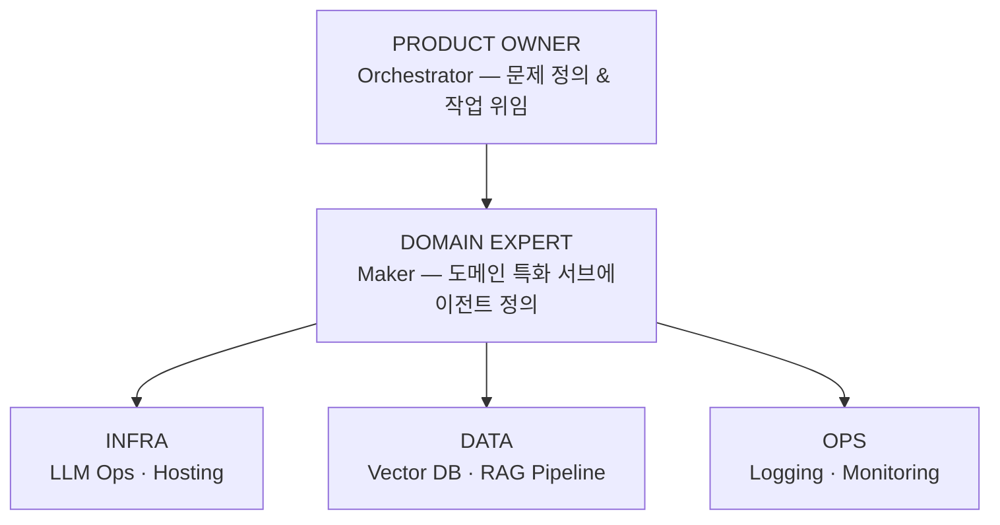
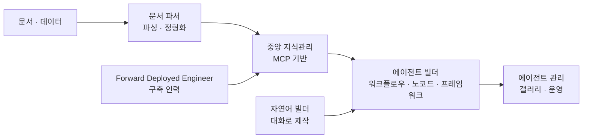
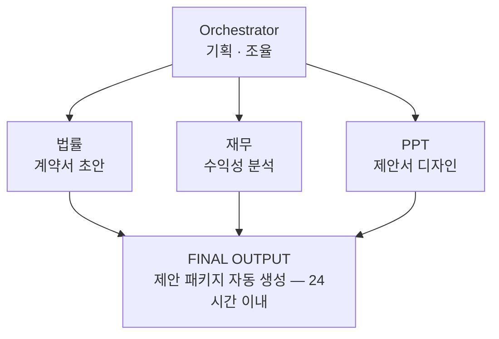
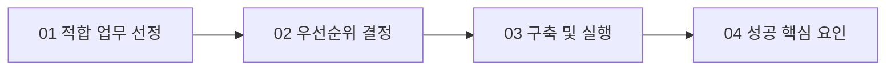

"AI를 도입하면 사람이 줄어드는가"는 도입 논의에서 가장 먼저 나오고 가장 늦게까지 남는 질문이다. 그런데 이 질문에 예·아니오로 답하는 순간 논의가 멈춘다. 자리가 없어지느냐가 아니라 **자리에 담긴 일이 무엇으로 바뀌느냐**가 실제로 결정해야 하는 것이기 때문이다.

이 글은 그 재구성을 두 방향에서 본다. 하나는 아래에서 위로 — 금융권이 실제로 무엇을 도입했고 어떤 숫자를 보고했는지. 다른 하나는 위에서 아래로 — 역할을 오케스트레이터·메이커·빌더 세 층으로 나눈 모델과, 그것을 적합 업무 선정부터 확산까지 네 단계로 옮긴 실행 프레임워크. [앞 편](/blog/ai-agent/why-agents-now/)이 왜 지금인지를 거시 지표로 답했다면, 이 글은 그래서 조직이 무엇을 하는지에 답한다.

기술 구조 자체는 [시리즈 첫 편](/blog/ai-agent/agent-harness-architecture/)에 있고, 이 글 다음의 [두 편](/blog/ai-agent/harness-five-primitives/)은 다시 실무로 내려간다.

> 이 글은 **2026년 2월 자료를 정리한 것**이다. 등장하는 도입 사례와 수치는 **각 기업이 자사 사례로 발표한 값**이며 제3자 검증을 거친 것이 아니다.

## 용어 정리

앞 편의 용어표에서 이 글이 쓰는 행만 추리고, 조직·역할 용어를 더했다.

| 용어 | 원어 / 표기 | 뜻 |
|---|---|---|
| AX | AI Transformation | 디지털 전환(DX)의 다음 단계로 제시된 조직 전환 프로그램의 이름 |
| Orchestrator | Orchestrator | 문제를 정의하고 하부 에이전트에 작업을 위임하는 최상위 역할 |
| Maker | Maker | 도메인 지식을 바탕으로 서브에이전트를 정의·설계하는 중간 계층 |
| Builder | Builder | 에이전트 구동을 위한 인프라·데이터·운영 생태계를 구축하는 역할 |
| 센토어 모델 | Centaur Model | 인간 × AI 에이전트의 승수 효과 모델. "판단력 + 처리 속도" |
| Forward Deployed Engineer | — | 현업에 상주하며 RAG·에이전트를 붙이는 구축 인력 |
| 중앙 지식관리 서비스 | — | MCP 기반으로 사내 문서·지식을 한곳에서 제공하는 계층 |
| Agent Harness | Agent Harness | 모델을 감싸 장기 실행 작업을 관리하는 시스템. 정의는 [첫 편](/blog/ai-agent/agent-harness-architecture/) |

## 금융권이 실제로 도입한 것

자료는 금융권을 고객경험·사내 혁신·리스크 세 축으로 나눈다.

| 영역 | 효과 |
|---|---|
| 고객 상담센터 | 24/7 상담, 콜센터 인력 감축, 상담 처리기간 단축 |
| 내부 업무 자동화·지식 검색·문서 작성 | 내부 규정·절차를 검색·요약해 업무 효율 개선 |
| 리스크 관리·신용 평가 | 금융이력이 부족한 고객의 리스크를 추정해 대출 문턱 완화 |

세 축의 성격이 다르다. 첫째는 비용, 둘째는 시간, 셋째는 **매출**이다. 도입 논의가 대개 첫째에서 시작해 셋째까지 가지 못하는데, 아래 사례 중 정량 효과가 가장 큰 것은 셋째 축에 있다.

### 고객경험 — 세 사례

**DNB의 챗 우선 전략**은 접점 구조 자체를 바꾼 사례다.

| 축 | 내용 |
|---|---|
| 전략 | 전화 대신 채팅을 모든 고객 접점의 기본 출입구로 단일화 |
| 응대 | AI가 모든 초기 상담을 처리하고 복잡한 이슈만 상담사로 라우팅 |
| 기술 | 자동화 플랫폼 기반, 전체 디지털 문의의 50% 이상을 사람 개입 없이 완결 |
| 효과 | 단순 반복 문의 감소로 상담사는 고부가가치 이슈에 집중 |
| 지표 | **전체 문의의 50% 이상 자동화** |

흐름은 세 단계다 — 모든 문의를 채팅으로 접수하고, AI가 1차 처리하고, 미해결 건만 사람에게 이관한다.

**Bank of America의 Erica**는 묻기 전에 먼저 말을 거는 형태다. 거래 패턴·잔고·카드 사용 데이터를 분석해 "이번 달 구독료가 20% 늘었습니다", "3일 뒤 잔고 부족이 예상됩니다" 같은 행동 유도형 알림을 보낸다. 단순 FAQ 봇이 아니라 금융 코치로 인식되면서 **1,900만 명 이상의 활성 사용자(MAU)**를 확보했다.

**Fifth Third Bank의 감정 인식**은 사후 평가를 실시간 코칭으로 바꾼 사례다. 통화 중 음성 톤·피치·속도를 분석해 분노·좌절을 실시간 감지하고 상담사에게 알린다. 도입 후 **18개월 만에 고객 감정 점수가 35% 향상**됐고 상담 품질과 만족도가 동반 상승했다는 것이 발표 내용이다.

> **세 사례의 공통 구조는 "AI가 사람을 대체한 자리"가 아니라 "AI가 사람 앞에 붙은 자리"다.**
>
> DNB는 1차 응대를 앞에 붙였고, Erica는 문의 자체를 앞당겨 만들었고, 감정 인식은 통화 도중에 붙었다. 셋 다 사람의 작업을 없앤 것이 아니라 **사람이 다루는 입력의 성격을 바꿨다.** 상담사에게 도착하는 것이 "모든 문의"에서 "복잡한 문의"로 바뀌면 필요한 역량도 바뀌고, 이것이 뒤에 나오는 역할 재정의의 현장 버전이다.

### 사내 혁신 — 세 사례

**Nubank의 AskNu**는 문제 정의가 특히 명확하다.

> 각 팀이 위키에 독립적으로 문서를 관리했다. 직원들이 정보를 찾는 데 많은 시간을 썼고, 일부는 정보를 못 찾아 헬프데스크 티켓을 열어야 했다.

| 지표 | 값 | 부연 |
|---|---|---|
| 월간 활성 사용자 | **5,000+** | 전체 직원의 55% |
| 헬프데스크 티켓 감소 | **96%** | 대부분의 질의가 자동 해결 |
| 답변 정확도 | **74%** | 내부 문서 질의 기준 |
| 라우터 성능 | **정밀도 78%** | 재현율 77% |
| 누적 질의 처리량 | 수만 건 | 6개월간 지속 증가 |

> **리더가 가져갈 문장은 "문서를 통합하지 않았다"는 것이다.** 팀별로 흩어진 위키를 정리하는 대신 그 위에 검색 에이전트를 얹었고, 티켓이 96% 줄었다.
>
> 이 판단이 값을 하는 이유는 **소요 기간의 차이**에 있다. 정보구조 개편은 수년짜리 과제이고 도중에 조직이 바뀌면 다시 시작된다. 검색 레이어는 수 주짜리이고 문서 구조가 바뀌어도 살아남는다. 다만 정확도 74%라는 숫자를 함께 봐야 한다 — 네 번 중 한 번은 틀린다는 뜻이므로, 오답을 감수할 수 있는 질의 유형부터 열어야 한다.

**글로벌 투자은행의 온보딩 어시스턴트**는 사람의 시간이 어디로 재배치됐는지를 보여준다.

| 지표 | 도입 전 | 도입 후 |
|---|---|---|
| 일일 질의 처리 시간 | 1~2시간 | **15분 (-87~92%)** |
| 에스컬레이션 빈도 | 잦음 | **15% 감소** |
| 멘토·HR 역할 | 반복 답변 처리 | **고난도 코칭 집중** |

**대형 보험사의 문서 검색 시스템**은 이 절에서 절대 금액이 제시된 유일한 사례다.

| 요약 지표 | 값 |
|---|---|
| 연간 운영 비용 절감 | **$4.2M** |
| 처리 능력 향상 | **3.5배** |
| 신입 교육 기간 | **-65%** |

| 핵심 지표 | 도입 전 | 도입 후 | 개선 |
|---|---|---|---|
| 문서 검색 시간 | 업무시간의 65% | 약 8% | **-87%** |
| 클레임 처리 기간 | 9~12일 | 2~3일 | **75% 단축** |
| 약관 해석 정확도 | 기준치 100% | 134% | **+34%** |
| 고객 만족도 | 기준치 100% | 128% | **+28%** |

**두 표는 같은 사례의 서로 다른 절단면이다.** 위는 경영 보고용 요약 셋, 아래는 그 요약을 만든 운영 지표 넷이다. 위 표만 보면 "$4.2M 절감"이 근거 없이 떠 있고, 아래 표만 보면 그것이 얼마짜리인지 알 수 없다. 그리고 아래 표의 첫 행 — **업무시간의 65%가 문서 검색이었다** — 이 나머지 셋을 전부 설명한다.

### 리스크 — 데이터로 신용을 다시 재는 사례

Tala는 전통 신용점수 대신 스마트폰 행동 데이터로 대출을 심사한다.

| 축 | 값 |
|---|---|
| 누적 고객 | 1,000만+ (케냐·필리핀·멕시코·인도) |
| 누적 대출 | $6B+ |
| 상환율 | 92% |
| 승인 속도 | 2초 미만 (현금 지급 3분 미만) |
| 심사 데이터 | 통화 규칙성, 위치 안정성, 요금 납부, 앱 사용 패턴 |
| 데이터 자산 | 10년간 축적된 수십억 데이터 포인트 |

상환율 92%가 이 사례의 요점이다. **금융 소외 계층을 대상으로 하면서도 상환율이 유지됐다**는 것이 대안 신용평가의 성립 근거이고, 그것을 뒷받침하는 것은 모델이 아니라 마지막 행 — 10년치 데이터다.

### 공통 성공 요인 넷

| 요인 | 내용 |
|---|---|
| **도메인 지식 + RAG 결합** | 일반 LLM 지식만으로는 부족하다. 현업의 문서·규정·정책을 결합해야 환각을 막고 전문성을 확보한다 |
| **실시간·주기적 업데이트** | 금융 정보는 시의성이 중요하다. 2시간 단위 또는 실시간 인덱싱 파이프라인이 신뢰도를 유지한다 |
| **출처 투명성과 감사 로그** | 모든 답변에 근거 문서 링크를 제공해 검증 가능하게 하고, 질의응답 로그로 컴플라이언스를 충족한다 |
| **워크플로우 통합** | 별도 AI 포털이 아니라 메신저·학습관리시스템 등 **기존 업무 시스템에 통합**해 접근성과 맥락을 유지한다 |

이 네 줄은 그대로 **사내 AI 과제 승인 게이트**로 쓸 수 있다. 넷 중 셋(1·2·3)이 품질과 신뢰에 관한 것이고, 네 번째만 채택률에 관한 것인데 — 실패 사례에서 가장 자주 지목되는 것은 네 번째다.

## 역할을 세 층으로 나눈다

이 절이 조직 관점에서 가장 인용 가치가 높다.

| 역할 | 정의 | 대응 직무 |
|---|---|---|
| **Orchestrator** | 문제를 정의하고 하부 에이전트에 작업을 위임하는 최상위 전략가 | 프로덕트 오너 |
| **Maker** | 도메인 특화 지식을 바탕으로 서브에이전트를 정의·설계 | 도메인 전문가 |
| **Builder** | 에이전트 구동을 위한 기술 생태계(인프라·데이터·운영)를 구축 | 시스템·인프라·데브옵스 |

**표는 세 행인데 도식은 다섯 노드다.** 표의 Builder 한 행이 도식에서는 인프라·데이터·운영 셋으로 갈라지기 때문이고, 그것이 우연이 아니다. 위 두 층은 사람 한 명이 맡을 수 있는 역할이지만 아래 층은 기능 조직 여럿이라, **역할과 조직 단위가 층마다 다르게 대응한다.** 3역할을 그대로 3팀으로 만들려는 시도가 실패하는 이유가 여기 있다.

이 계층에는 세로축이 하나 더 붙는다. 위로 갈수록 유연하고, 아래로 갈수록 결정론적이다.

| 계층 | 성격 | 판단 기준 |
|---|---|---|
| Orchestrator | 유연한 | 무엇을 할지, 왜 할지 |
| Maker | 중간 | 어떤 에이전트로 나눌지 |
| Infra · Data · Ops | 결정론적 | 재현 가능해야 함 |

> **상단은 유연해야 하고 하단은 결정론적이어야 한다. 이 두 성질을 한 레이어에 섞으면 시스템이 무너진다.**
>
> 조직도 같다. 판단 레이어와 실행 레이어는 요구 속성 자체가 다르므로 품질 기준을 따로 세워야 한다. 실행 레이어에는 재현성 지표를 걸고, 판단 레이어에는 걸지 않는다. 반대로 하면 두 가지가 동시에 무너진다 — 판단이 경직되고, 실행이 임의로 변한다. 실무에서 흔한 실패는 후자다. 인프라와 운영에 "유연하게 대응하라"는 요구가 들어오는 순간 재현성이 사라지고, 그러면 장애 원인을 특정할 수 없게 된다.

자리와 일의 관계는 이렇게 정리된다.

> 자리(Position)는 유지된다. 하지만 일(Work)은 완전히 재구성된다. **단순 실행(Task)에서 오케스트레이션(Purpose)으로.**

**센토어 모델**이 그 재구성의 원리다 — 인간 × AI 에이전트가 곱셈으로 작동한다는 것.

| # | 원리 | 내용 |
|---|---|---|
| 01 | 역할의 재정의 | 사람은 목적 정의와 가치 판단, AI는 실행과 데이터 분석 |
| 02 | 업무 단위 분해와 재조립 | 거대한 업무를 AI가 처리 가능한 단위로 쪼개고, 결과물을 사람이 다시 통합 |
| 03 | 지속적 학습과 피드백 | 사람은 결과물을 평가하며 AI를 가르치고, AI는 피드백으로 도메인 지식을 학습 |

세 원리가 순환한다. 2번의 재조립 품질이 3번의 피드백 품질을 결정하고, 그것이 다시 1번의 분업선을 옮긴다. **"인간의 판단력 + AI의 처리 속도 = 기하급수적 생산성"**이라는 표현이 성립하려면 세 번째 원리가 실제로 도는지가 관건이다.

> AI가 인간을 대체하지는 않을 것이다. 그러나 AI를 다룰 줄 아는 인간이 그렇지 못한 인간을 대체할 것이다. — Karim Lakhani, 하버드 비즈니스 스쿨
>
> 이 문장이 조직 커뮤니케이션에서 값을 하는 이유는 위협의 방향을 바꾸기 때문이다. 대체의 주체가 AI가 아니라 **동료**가 되면 논의가 "막을 것인가"에서 "누가 먼저 배울 것인가"로 옮겨간다. 다만 이 문장이 덮는 범위는 좁다 — 개인의 학습을 다루지 조직의 재배치를 다루지 않는다. 조직 차원의 답은 아래 실행 프레임워크 쪽에 있다.

## 플랫폼과 확산 — 한 조직의 6개월

한 AI 솔루션 조직이 2025년 8월에 구축한 사내 에이전트 플랫폼의 구성이다.

| 구성요소 | 역할 |
|---|---|
| 에이전트 관리 계층 | 사내 에이전트 갤러리 — 각 에이전트 카드에 사용 수·즐겨찾기 표시 |
| 중앙 지식관리 서비스 | MCP 기반 지식 제공 |
| 문서 파서 | 문서 파싱·데이터 정형화 |
| Forward Deployed Engineer | 현업에 투입되는 구축 인력 |
| 에이전트 빌더 | 워크플로우 도구·노코드 플랫폼·프레임워크 |
| 자연어 빌더 | 대화로 에이전트를 제작하는 도구 |

**표는 여섯 행이고 도식도 여섯 노드지만 배치가 다르다.** 표는 구성요소 목록이고 도식은 데이터가 흐르는 순서인데, 도식에서 드러나는 것은 사람(Forward Deployed Engineer)이 파이프라인의 중간 — 지식관리 계층 — 에 꽂힌다는 점이다. 도구 목록만 보면 자동화된 파이프라인처럼 보이지만, 실제로는 사람이 현업 지식을 지식 계층에 밀어 넣는 것이 전제다.

이 플랫폼의 6개월 성과로 제시된 값은 하나다 — **임직원 주도 에이전트 확산 1,200개 이상.** 상향식 확산이 실제로 일어난다는 증거로 인용되는 숫자다.

확산의 1단계는 개별 에이전트 활용이다.

| 에이전트 | 기능 | 효과 |
|---|---|---|
| 법률 에이전트 | 계약서 초안 검토 및 리스크 분석 | 대기 시간 **90% 단축** |
| PPT 에이전트 | 발표 자료 초안 생성 및 디자인 | 문서 작업 시간 **50% 단축** |

2단계는 오케스트레이션이며, 자료는 이것을 달성이 아니라 **비전**으로 표시한다.

> **1단계와 2단계 사이의 간격이 이 절의 진짜 정보다.** 1단계는 실측값이 있고 2단계는 없다.
>
> 개별 에이전트 1,200개가 만들어졌는데도 오케스트레이션은 아직 비전인 이유는 기술이 아니라 **작업 경계 정의**에 있다. 법률·재무·디자인 에이전트를 각각 만드는 것과 셋의 산출물을 하나의 제안 패키지로 합치는 것은 난이도가 다르다. 후자는 어느 산출물이 어느 산출물에 의존하는지, 충돌하면 누가 판정하는지를 정해야 하고, 그것은 도구 문제가 아니라 업무 규약 문제다. 멀티 에이전트를 먼저 도입하지 말라는 권고가 나오는 자리가 여기다.

## 실행 — 다섯 묶음과 네 단계

**핵심 액션 아이템**은 다섯 묶음, 열다섯 항목이다.

| 묶음 | 체크리스트 |
|---|---|
| **AI Agent Builder (AX 조직)** | 레거시 시스템 연동 API 개발 / 인프라·데이터·운영 환경 구축 / 안전한 샌드박스 테스트 환경 마련 |
| **데이터 구축 (LLM Readable)** | 비정형 데이터의 구조화 / 메타데이터 확보 및 문서 최신화 / 데이터 접근성 검증 |
| **Orchestrator 준비** | 프로덕트 오너 대상 AI 기획 교육 / 에이전트 관리 플랫폼 도입 / 업무 위임 프로토콜 정의 |
| **애자일 피드백 순환** | 초기 프로토타입에 대한 빠른 피드백 / 사용자 경험 기반 개선 고리 형성 / 실패를 허용하는 반복 프로세스 정립 |
| **Quick Win 확보** | 성공 가능성 높은 파일럿 선정 / 3개월 내 가시적 성과 도출 / 초기 성공 사례 전파로 조직 신뢰 구축 |

다섯 묶음 중 앞의 둘은 엔지니어링, 셋째는 사람, 넷째와 다섯째는 프로세스다. **열다섯 항목 중 순수 기술 항목이 여섯뿐**이라는 비율이 이 표의 메시지다.

**AX 실행 프레임워크**는 그 열다섯을 순서로 옮긴다.

| 단계 | 항목 | 상세 |
|---|---|---|
| **01 적합 업무 선정** | 반복성·규칙성 | 월 10시간 이상 반복되는 정형화된 업무 |
| | 데이터 가용성 | 매뉴얼·규정·과거 사례 등 문서화된 지식 존재 |
| | 오류 허용도 | 초안 작성 후 담당자 검토가 가능한 업무 |
| **02 우선순위 결정** | Quick Win 과제 | 난이도 낮고 효과를 즉시 체감 (예: 규정 Q&A) |
| | 전략적 임팩트 | 난이도 높고 업무 본질을 혁신 (예: 심사 초안) |
| | 확장 가능성 | 타 부서·지점으로 수평 전개 가능 |
| **03 구축 및 실행** | Pilot (2주) | 핵심 기능만 구현해 소수 인원 테스트 |
| | Optimize (4주) | 사용자 피드백 기반 프롬프트·지식 최적화 |
| | Scale (지속) | 부서 전체 배포 및 운영 모니터링 체계 |
| **04 성공 핵심 요인** | 현업의 주도적 참여 | IT 부서 의존이 아닌 현업의 지식 주입이 필수 |
| | 점진적 신뢰 구축 | 단순 조회부터 시작해 실행·판단으로 단계 확대 |
| | 피드백 루프 | 에이전트 오류를 학습 데이터로 재활용하는 순환 |

**도식은 네 마디인데 표는 열두 행이다.** 도식이 순서를, 표가 각 단계의 판정 기준을 담는다. 세 번째 단계에서 나오는 **2주 + 4주 = 과제당 6주 사이클**이 이 프레임워크의 실질적 운영 단위이고, 첫 단계의 세 조건 — 월 10시간 이상 반복 / 문서화된 지식 존재 / 사람 검토 가능 — 이 착수 여부를 가르는 게이트다.

## 조직에 옮기면 무엇이 되는가

| 주장 | 조직에 미치는 함의 | 첫 90일에 할 일 |
|---|---|---|
| 콜센터 AI: 비용 -95%인데 만족도 55→69% | "비용 절감 = 품질 하락"이라는 반대 논리를 데이터로 무력화 | 60일: 사내 CS·헬프데스크 1개 라인 파일럿, 비용·만족도 동시 계측 |
| 문서 통합 없이 검색 에이전트로 티켓 96% 감소 | 위키 정리 프로젝트(수년) 대신 검색 레이어(수 주)로 우회 가능 | 60일: 사내 문서 검색 에이전트 파일럿. 목표 지표는 헬프데스크 티켓 수 |
| 보험사: 문서 검색 시간이 업무의 65% → 8% | "검색에 쓰는 시간"이 측정 가능한 낭비 항목이라는 인식 확산 | 30일: 개발자 대상 정보 탐색 시간을 설문·로그로 측정해 기준선 확보 |
| 공통 성공요인 = 도메인지식+RAG / 최신성 / 출처·감사 / 워크플로우 통합 | 네 항목이 곧 사내 AI 도입 심사 체크리스트 | 30일: 이 4항목을 AI 과제 승인 게이트로 문서화 |
| 별도 AI 포털이 아니라 기존 협업 도구 안으로 | 채택률 실패의 주원인이 진입점 위치임을 사전에 차단 | 60일: 에이전트 진입점을 기존 협업 도구 안에 배치 |
| Orchestrator / Maker / Builder 3역할 | 기존 직군(PO·도메인 전문가·플랫폼팀)에 그대로 매핑 가능 | 30일: 현 조직도 위에 3역할을 겹쳐 공백 식별 |
| 상단은 유연, 하단은 결정론적 | 판단 레이어와 실행 레이어의 품질 기준을 분리 | 60일: 실행 레이어(인프라·데이터·운영)에 재현성 목표 설정 |
| 센토어 모델 | 인력 감축 서사가 아니라 **승수 서사**로 조직에 설명 | 30일: 전사 커뮤니케이션에서 "자리는 유지, 일은 재구성" 메시지 명문화 |
| 임직원 주도 1,200+ 에이전트 | 상향식 확산이 실제로 일어난다는 증거 | 90일: 사내 에이전트 갤러리 구축 + 공유 인센티브 설계 |
| Quick Win: 3개월 내 가시적 성과 | 조직 신뢰는 첫 성공 사례에서 만들어짐 | 90일: 파일럿 1건을 반드시 완주하고 사내 사례로 전파 |
| Pilot 2주 → Optimize 4주 → Scale | 과제당 6주 사이클이 기본 단위 | 60일: 6주 사이클을 AI 과제 운영 리듬으로 고정 |
| 반복 업무 시간·1인당 생산성 지표 | 생산성 개선의 마지막 레버가 AI라는 재무 서사 확보 | 30일: 팀별 반복 업무 시간을 월 10시간 기준선으로 실측, 금액 환산 |

열두 행의 세 번째 열을 세로로 읽으면 30일 다섯, 60일 다섯, 90일 둘이다. **30일 항목이 전부 "측정하거나 문서화한다"이고 구축은 하나도 없다.** 기준선 없이 착수한 파일럿은 성과를 증명할 수 없다는 것이 이 배치의 이유다.

---

여기까지가 조직 쪽이다. 역할은 세 층으로 나뉘고, 실행은 6주 사이클로 돌고, 첫 30일은 측정으로 채운다.

그런데 하나가 남는다. Maker가 "서브에이전트를 정의·설계한다"고 할 때 실제로 무엇을 만드는가. 메모리인가 스킬인가 커맨드인가, 그리고 그 선택은 무엇을 근거로 하는가. [다음 편](/blog/ai-agent/harness-five-primitives/)에서 하네스를 구성하는 다섯 가지 — 메모리·스킬·에이전트·커맨드·훅 — 을 하나씩 열고, 세션 시작 비용을 만드는 고정 지식 일곱 종을 토큰 단위로 분해한다.
