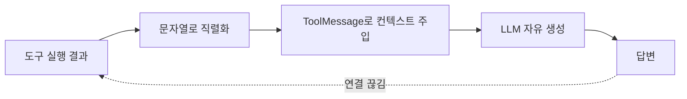
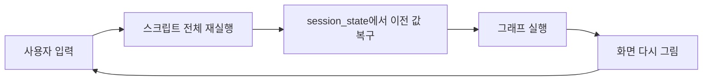

각주가 안 붙는 문제를 만나면 프롬프트부터 손보게 된다. "모든 문장 끝에 `[n]`을 붙여라"를 시스템 메시지에 넣고, 안 되면 더 강하게 쓰고, 그래도 안 되면 모델을 바꾼다. 그런데 이 순서로 접근하면 대개 해결되지 않는다. 각주를 달 **대상 자체가 그래프 안에 없기** 때문이다.

이 글은 앞 편에서 그린 그래프를 코드로 마저 조립하고, 그 코드가 어디서 정보를 흘리는지 따라간다. 도구가 문자열 한 덩어리를 반환하는 순간 문서 경계가 사라지고, 경계가 사라지면 인용은 검증할 대상을 잃는다. [앞 편](/blog/ai-agent/reverse-engineering-agent-graph/)에서 관찰을 State와 노드로 번역하는 데까지 왔다.

## 용어 정리

앞 편의 용어표에서 이 글이 쓰는 행만 추렸다.

| 약어 / 용어 | 원어 | 뜻 |
|---|---|---|
| Focus | Focus mode | 검색 소스를 한정하는 선택값. 이 그래프에서는 State의 분기 키 |
| Citation | Citation | 답변 문장에 붙는 각주형 출처 표시. 본문의 `[1]`이 Sources 목록의 특정 문서를 가리킴 |
| Grounding | Grounding | 모델 답변을 외부 근거 문서에 묶어두는 것. 인용은 그라운딩을 사용자에게 보이는 형태 |
| Reducer | State reducer | 상태 필드를 어떻게 병합할지 정하는 함수. 없으면 덮어쓰기 |
| ToolNode | LangGraph ToolNode | `tool_calls`를 실행해 `ToolMessage`로 되돌려주는 사전 제작 노드 |
| Conditional Edge | Conditional Edge | 상태를 읽어 다음 노드 이름을 문자열로 반환하는 분기 간선 |
| Chroma | ChromaDB | 오픈소스 벡터 DB. 여기서는 인메모리로 사용 |
| RAG | Retrieval-Augmented Generation | 검색으로 근거를 가져와 생성에 쓰는 패턴 |
| TTFT | Time To First Token | 첫 토큰이 화면에 뜨기까지의 시간. 스트리밍 UX의 핵심 지표 |
| `session_state` | Streamlit session state | Streamlit이 스크립트 재실행 사이에 값을 유지하는 저장소 |
| rerun | Streamlit rerun | 위젯 조작 때마다 스크립트 전체를 처음부터 다시 실행하는 실행 모델 |

## 코드 골격

### State — `focus`가 분기 키

```python
from typing import Annotated, Literal
from typing_extensions import TypedDict
from langgraph.graph.message import add_messages

class State(TypedDict):
    messages: Annotated[list, add_messages]
    focus: Literal["web", "academic", "video", "math"]
```

- `messages`에는 `add_messages` 리듀서가 붙어 노드가 반환한 메시지가 **누적**된다.
- `focus`에는 리듀서가 없다. 리듀서 없는 필드는 **덮어쓰기**이고, 이 그래프에서는 아무도 갱신하지 않으므로 실행 내내 상수처럼 유지된다. 사이클을 돌아 `chatbot`으로 되돌아와도 같은 Focus를 유지하는 근거가 이것이다.

> 노트북 원본에는 `Literal["web", "academic", "video, math"]`처럼 따옴표가 어긋난 오타가 있다. `.py` 버전에서는 네 개로 정정돼 있다. `Literal`은 런타임 검증을 하지 않으므로 이 오타로 실행이 깨지지는 않는다.
>
> **타입 힌트가 계약을 강제하지 않는다**는 것을 이보다 선명하게 보여주는 사례가 드물다. 분기 키를 `Literal`로 선언해 뒀으니 잘못된 값이 막힐 것 같지만, 막는 것은 정적 검사기이지 런타임이 아니다. 값이 실제로 그래프 동작을 가르는 필드라면 노드 진입부에서 한 번 검사하거나 Pydantic으로 State를 잡아야 한다.

### 도구 4종

```python
from langchain_community.tools.tavily_search import TavilySearchResults
from langchain_community.utilities import ArxivAPIWrapper
from langchain_community.utilities.wolfram_alpha import WolframAlphaAPIWrapper
from langchain_core.tools import tool

web_tool = TavilySearchResults(max_results=2)

@tool
def academic_tool(query: str):
    """academic paper search tool"""
    arxiv = ArxivAPIWrapper()
    return arxiv.run(query)

@tool
def math_tool(query: str):
    """math tool"""
    wolfram = WolframAlphaAPIWrapper()
    return wolfram.run(query)
```

> `@tool` 데코레이터의 **독스트링이 곧 도구 설명**이고, 이 문장이 프롬프트에 실려 모델의 도구 선택 근거가 된다.
>
> 여기서는 사용자가 Focus로 이미 결정하므로 설명 품질의 영향이 작다. 하지만 이것은 이 설계가 만들어 준 여유이지 일반적인 상태가 아니다. 도구를 전부 바인딩해 모델이 고르게 하는 구조였다면 `"math tool"`이라는 두 단어가 정확도를 좌우한다.

### Video 도구 — 검색 도구 안에 RAG 파이프라인이 통째로 들어간다

```python
youtube_search_tool = YouTubeSearchTool()

@tool
def video_tool(query: str) -> str:
    """Retriever tool for the transcript of a YouTube video."""
    urls = ast.literal_eval(youtube_search_tool.run(query))   # 1) 영상 URL 검색

    docs = []
    for url in urls:                                          # 2) 자막 로드
        loader = YoutubeLoader.from_youtube_url(
            url, add_video_info=True, language=["en", "ko"])
        scripts = loader.load()
        docs.append(Document(
            page_content=scripts[0].page_content,
            metadata={"source": url,
                      "title": scripts[0].metadata["title"],
                      "author": scripts[0].metadata["author"]}))

    text_splitter = RecursiveCharacterTextSplitter(           # 3) 청킹
        separators=["\n\n", "\n", ".", ",", " ", ""],
        chunk_size=1000, chunk_overlap=0)
    texts = text_splitter.split_documents(docs)

    db = Chroma.from_documents(texts, OpenAIEmbeddings())     # 4) 인메모리 인덱싱
    retrieved_docs = db.as_retriever().invoke(query)          # 5) 유사도 검색

    return "\n\n".join(                                       # 6) 문자열로 평탄화
        f"Title: {d.metadata.get('title')}\n"
        f"Author: {d.metadata.get('author')}\n"
        f"Transcript:\n{d.page_content}"
        for d in retrieved_docs)
```

| 관찰 | 의미 |
|---|---|
| 도구 하나가 검색→로드→청킹→임베딩→검색의 **6단계 파이프라인** | "도구"의 입자 크기가 항상 API 한 번 호출은 아니다 |
| 호출할 때마다 Chroma를 **새로 만든다** | 캐시 없음. 같은 질문을 두 번 하면 임베딩 비용을 두 번 낸다 |
| 반환이 **문자열 한 덩어리** | 문서 경계·URL이 텍스트 안에 녹아버려 인용 추적이 어려워진다 |
| `metadata["source"]`에 URL이 있는데 **출력에는 빠져 있다** | 인용 가능한 정보를 만들어 놓고 버리는 구조 |

네 행 중 뒤의 둘이 이 글의 나머지를 전부 규정한다 — 인용을 못 다는 원인이 이미 여기 있다.

### Focus별 ToolNode와 그래프 조립

```python
tools = {
    "web": [web_tool],
    "academic": [academic_tool],
    "video": [video_tool],
    "math": [math_tool],
}
tool_nodes = {focus: ToolNode(tools[focus]) for focus in tools}

llm = ChatOpenAI(model="gpt-4o-mini")

def chatbot(state: State):
    llm_with_tools = llm.bind_tools(tools[state["focus"]])   # Focus별 동적 바인딩
    return {"messages": [llm_with_tools.invoke(state["messages"])]}

graph_builder = StateGraph(State)
graph_builder.add_node("chatbot", chatbot)
for focus, tool_node in tool_nodes.items():
    graph_builder.add_node(f"{focus}_tools", tool_node)

def focus_condition(state):
    if state["messages"][-1].tool_calls:      # 도구 호출이 있으면 Focus 노드로
        return f"{state['focus']}_tools"
    return END                                # 없으면 종료

graph_builder.add_conditional_edges(
    "chatbot", focus_condition,
    {"web_tools": "web_tools", "academic_tools": "academic_tools",
     "video_tools": "video_tools", "math_tools": "math_tools", END: END})

for focus in tools:
    graph_builder.add_edge(f"{focus}_tools", "chatbot")

graph_builder.set_entry_point("chatbot")
graph = graph_builder.compile()
```

| 포인트 | 설명 |
|---|---|
| `bind_tools`가 **노드 함수 안에** 있다 | 그래프 컴파일 시점이 아니라 실행 시점에 도구가 정해진다. Focus 분기가 가능한 이유 |
| `focus_condition`이 **문자열을 반환** | Conditional Edge는 목적지 노드 이름을 문자열로 돌려주는 함수다 |
| 세 번째 인자(매핑 딕셔너리) | 반환 문자열 → 실제 노드 이름 매핑. 도달 가능한 목적지를 **선언적으로 고정**해 오타를 컴파일 시점에 잡는다 |
| 모든 `*_tools` → `chatbot` 단방향 복귀 | 도구 결과를 다시 모델에 먹여 최종 답을 만드는 **표준 ReAct 사이클** |
| 종료 조건이 `tool_calls` 유무 하나뿐 | 반복 상한이 없다. 모델이 계속 도구를 부르면 `recursion_limit`에 걸려야 멈춘다 |

첫 행이 이 그래프의 유일한 트릭이다 — 바인딩을 실행 시점으로 미룬 덕에 컴파일된 그래프 하나가 네 Focus를 전부 처리한다.

```python
for chunk in graph.stream(
        {"messages": [{"role": "user", "content": "AI 에이전트에는 어떤 프레임워크가 있어?"}],
         "focus": "video"},
        stream_mode="values"):
    print(chunk["messages"][-1].content)
```

## 인용 정합성 — 이 구현이 남긴 가장 큰 갭

### 현실 진단

원 제품에서는 Sources 카드와 본문 각주 번호가 **서로를 가리킨다.** 이 구현은 그렇지 않다.



| 문제 | 원인 |
|---|---|
| 답변 문장이 어느 소스에서 왔는지 알 수 없다 | 도구 반환이 **구조 없는 문자열**이라 소스 경계가 사라짐 |
| 인용 번호가 아예 생성되지 않는다 | 각주를 달라는 **프롬프트 지시가 없음** |
| 있어도 검증되지 않는다 | 번호가 실재 소스를 가리키는지 확인하는 **후처리 노드가 없음** |
| Video는 URL을 알면서도 안 내보낸다 | `metadata["source"]`를 출력 포맷에서 누락 (Video 도구 절 참조) |

**도식에서 끊기는 자리는 한 곳인데 표는 네 행이다.** 도식이 짚는 것은 1행과 4행 — 직렬화에서 구조가 사라지는 경로다. 2행과 3행은 도식 어디에도 없는데, **없는 것은 그릴 수 없기 때문**이다. 프롬프트 지시와 검증 노드는 존재하지 않는 컴포넌트라 화살표를 그릴 자리가 없다. 도식만 보고 고치면 직렬화만 손보게 되고, 그러면 절반만 해결된다.

### 정합성을 만드는 4단 장치

| 단계 | 장치 | 하는 일 |
|---|---|---|
| **1. ID 부여** | 검색 결과를 State에 `sources: list[dict]`로 저장하고 `[1]`, `[2]` 인덱스를 붙인다 | 인용의 **정의역**을 확정 |
| **2. 지시** | 프롬프트에 "모든 사실 문장 끝에 `[n]`을 붙이고, 목록에 없는 번호는 쓰지 말 것" 명시 | 모델이 각주를 **생성**하게 함 |
| **3. 구조화 출력** | 답변을 `{"text": ..., "citations": [{"span": ..., "source_id": n}]}` 형태로 받는다 | 문장↔소스 매핑을 **파싱 가능**하게 |
| **4. 검증 노드** | 정규식으로 `[n]`을 뽑아 `sources` 범위 밖이면 제거하거나 재생성 루프로 보낸다 | **환각 인용**을 차단 |

네 단계의 순서가 곧 의존 관계다 — 1단계 없이 2단계를 해 봐야 모델이 아무 번호나 만들고, 3단계 없이 4단계를 하면 정규식이 본문을 파싱해야 한다.

### State에 소스 슬롯을 추가한 개선안

```python
class State(TypedDict):
    messages: Annotated[list, add_messages]
    focus: Literal["web", "academic", "video", "math"]
    sources: Annotated[list, operator.add]   # 검색 노드가 누적
```

- 도구가 문자열이 아니라 `{"id": 1, "title": ..., "url": ..., "snippet": ...}` 배열을 State에 남기면, **Sources 카드를 그릴 데이터**와 **인용 검증의 기준표**가 동시에 생긴다.
- 이 한 필드를 추가하는 것만으로 [앞 편의 단계 대응표](/blog/ai-agent/reverse-engineering-agent-graph/)에서 비어 있던 "소스 선별" 단계가 실체를 갖는다. 선별(중복 제거·도메인 신뢰도 정렬)은 이 배열 위에서 하는 일이기 때문이다.

> **인용은 프롬프트 문제가 아니라 상태 설계 문제다.** 소스에 ID를 부여해 State에 남기지 않으면 검증할 대상 자체가 없다.
>
> 이 명제가 실무에서 값을 하는 이유는 진단 순서를 바꿔 주기 때문이다. 각주가 안 붙을 때 프롬프트를 강화하는 것은 증상 대응이고, 먼저 물어야 할 것은 "지금 이 그래프에 인용의 정의역이 존재하는가"다. 없으면 프롬프트를 어떻게 써도 모델은 근거 없는 번호를 만들어 낸다.

## 스트리밍 UX가 아키텍처에 거는 제약

### 왜 아키텍처 문제인가

원 제품은 답을 다 만든 뒤 보여주지 않는다. **Sources → 본문 토큰 → 후속 질문** 순으로 화면이 차오른다. 이 UX를 만들려면 그래프가 **중간 산출물을 밖으로 흘려보낼 수 있게** 설계돼야 한다.

| UX 요구 | 아키텍처에 거는 제약 |
|---|---|
| 검색 소스를 본문보다 먼저 보여준다 | 검색과 생성이 **분리된 노드**여야 한다. 한 노드에 합치면 중간에 내보낼 지점이 없다 |
| "검색 중 / 읽는 중 / 작성 중" 표시 | 노드 경계가 곧 **진행 단계**. 노드 이름이 사용자 문구로 번역 가능해야 한다 |
| 본문이 토큰 단위로 흐른다 | 최종 생성 노드가 **스트리밍 가능한 LLM 호출**이어야 한다 |
| 취소·중단 | 상태가 매 단계 체크포인트에 저장돼야 재개 가능하다 |

네 행이 전부 "UX가 노드 분할을 강제한다"는 한 문장으로 수렴한다. TTFT를 줄이려면 먼저 나갈 수 있는 것을 먼저 만드는 노드가 따로 있어야 한다.

### `stream_mode` 선택

| 모드 | 흘러나오는 것 | 맞는 UI |
|---|---|---|
| `values` | 매 스텝 후 **State 전체** | 디버깅 |
| `updates` | 그 스텝에서 **바뀐 부분만**, 노드 이름과 함께 | **단계별 진행 표시** |
| `messages` | LLM **토큰 단위** | 본문 타이핑 효과 |

세 모드는 배타적이지 않고, 실무에서는 목적이 다른 둘을 동시에 구독한다.

> 위 노트북 코드는 `stream_mode="values"`를 쓰고 `chunk["messages"][-1].content`를 출력한다. 상태 전체가 매번 오므로 대화가 길어질수록 전송량이 커진다.
>
> 이 선택이 틀린 것은 아니다. 콘솔에서 상태 변화를 눈으로 확인하는 목적에는 `values`가 맞다. 문제는 그 코드가 그대로 UI 계층으로 옮겨질 때다. 진행 표시가 목적이면 `updates`, 타이핑 효과가 목적이면 `messages`이며, 둘 다 필요하면 둘 다 구독한다.

### 이 구현은 실제로는 스트리밍이 아니다

Streamlit 코드는 `graph.stream()`이 아니라 **`graph.invoke()`** 를 부른다. `st.status`로 "Searching web..." 같은 문구를 찍지만, 그건 **파이썬 for 루프의 진행 상황**이지 그래프 내부 이벤트가 아니다. 그래프 안에서 도구가 몇 번 돌든 화면은 조용하다.

> **"진행 표시가 있다"와 "진행이 스트리밍된다"는 다른 이야기다.** 화면만 보면 구분되지 않지만 구조는 전혀 다르다.
>
> 앞의 것은 호출자가 자기 루프의 위치를 찍는 것이고, 뒤의 것은 그래프가 자기 내부 사건을 밖으로 방출하는 것이다. 앞의 방식은 도구 하나가 30초를 먹어도 그 30초 동안 아무 신호를 못 준다. 자기 구현의 이 차이를 스스로 짚어 두는 것이 클론을 만드는 값어치의 절반이다.

## Streamlit 통합 — 상태 관리

### Streamlit의 실행 모델



Streamlit은 위젯을 건드릴 때마다 **파일을 처음부터 다시 실행**한다. 살아남는 것은 `st.session_state`에 넣은 값뿐이다. 이 한 가지 사실이 아래 설계를 전부 규정한다.

```python
if "messages" not in st.session_state:
    st.session_state.messages = []

focus_areas = {"Web Search": "web", "Academic Search": "academic",
               "Video Search": "video", "Math": "math"}
selected_focus = [key for area, key in focus_areas.items()
                  if st.checkbox(area, key=f"checkbox_{key}")]

if prompt := st.chat_input("Type your message here"):
    if not selected_focus:
        st.warning("Please select at least one focus area.")
    else:
        st.session_state.messages.append({"role": "user", "content": prompt})
        st.chat_message("user").markdown(prompt)

        with st.status("Processing your request...", expanded=True) as status:
            responses = []
            for focus in selected_focus:                 # Focus마다 순차 실행
                status.write(f"Searching {focus.capitalize()}...")
                result = graph.invoke({
                    "messages": st.session_state.messages,
                    "focus": focus})
                responses.append((focus, result["messages"][-1].content))
                status.write(f"Completed {focus.capitalize()} search.")
            status.update(label="Processing complete!", state="complete", expanded=False)

        for focus, response in responses:                 # 태그를 붙여 히스토리에 적재
            tagged = f"[{focus.upper()} SEARCH]\n\n{response}"
            st.session_state.messages.append({"role": "assistant", "content": tagged})
            st.chat_message("assistant").markdown(tagged)
```

### 이 코드에서 읽어야 할 설계 결정

| 결정 | 내용 | 함의 |
|---|---|---|
| **대화 기록의 소유자** | `st.session_state.messages` (dict 리스트) | 그래프는 상태를 기억하지 않는다. 매 턴 전체 히스토리를 **통째로 주입** |
| **체크포인터 없음** | `compile()`에 `checkpointer` 미지정 | 그래프 실행이 매번 무상태. 세션 복구·중단 재개 불가 |
| **Focus 다중 선택** | 체크박스 여러 개 → `for` 루프 순차 호출 | 단일 Focus 그래프를 **바깥에서 반복**해 다중 소스를 흉내 |
| **소스 구분 방법** | 답변 앞에 `[WEB SEARCH]` 태그 문자열 | 구조화된 필드가 아니라 **본문 접두어**. 파싱·재사용 불가 |
| **그래프 생성 위치** | 모듈 최상단 | rerun마다 도구·LLM·그래프가 **전부 재생성**된다 |

다섯 결정이 공통적으로 향하는 곳이 하나 있다 — **상태를 그래프 밖에 두었다.** 체크포인터를 안 쓰기로 한 결정 하나가 나머지 넷의 형태를 정한다.

### 실무 보강 네 가지

| 문제 | 보강 |
|---|---|
| rerun마다 그래프 재컴파일 | `@st.cache_resource`로 컴파일된 그래프를 캐싱 |
| 다중 Focus가 순차라 느림 | Focus별 실행을 `asyncio.gather` 또는 스레드로 병렬화. 지연이 합이 아니라 최댓값이 된다 |
| 히스토리를 매번 전량 주입 | `MemorySaver` 체크포인터 + `thread_id`로 대화를 그래프에 위임. UI는 렌더링만 담당 |
| 응답이 한 번에 나타남 | `graph.stream(..., stream_mode="messages")` + `st.write_stream`으로 토큰 단위 출력 |

```python
@st.cache_resource
def get_graph():
    return build_graph()          # 도구·LLM·그래프 조립을 여기 안으로
```

> **왜 `cache_resource`인가**: `st.cache_data`는 반환값을 **직렬화해 복제**하므로 LLM 클라이언트나 컴파일된 그래프처럼 직렬화가 불가능하고 공유돼야 하는 객체에는 맞지 않다.
>
> `cache_resource`는 **같은 객체를 그대로 공유**한다. 두 데코레이터의 이름이 비슷해 자주 바뀌어 쓰이는데, 판단 기준은 단순하다 — 값이면 `cache_data`, 연결·핸들·컴파일 산출물이면 `cache_resource`다.

## 차이 목록 — 원본과 어디가 다른가

[앞 편의 R5](/blog/ai-agent/reverse-engineering-agent-graph/)가 요구하는 산출물이 이 표다. 클론을 돌려 보고 원본과 다른 지점을 전부 적는다.

| # | 한계 | 영향 | 확장 방향 |
|---|---|---|---|
| 1 | 인용 정합성 장치 없음 | 답변 신뢰도 검증 불가 | 위 4단 장치 |
| 2 | 질의 분해 없음 | 복합 질문에서 검색 재현율 하락 | 질의 재작성 노드 추가 후 팬아웃 |
| 3 | 후속 질문 미구현 | 탐색형 UX 단절 | 답변 완료 후 생성 노드 1개 |
| 4 | Writing·Social Focus 미구현 | 6종 중 4종만 커버 | Writing은 도구 없는 경로, Social은 커뮤니티 검색 API |
| 5 | 진짜 스트리밍 아님 | 체감 지연 큼 | `stream_mode="updates"` + `messages` |
| 6 | 체크포인터 없음 | 중단 재개·다중 사용자 세션 분리 불가 | `MemorySaver`/DB 체크포인터 + `thread_id` |
| 7 | Video 도구가 매번 재인덱싱 | 비용·지연 폭증 | 영구 벡터스토어 + URL 기준 캐시 |
| 8 | 반복 상한·에러 정책 없음 | 도구 실패 시 루프 위험 | 재시도 횟수 필드 + 상한 초과 시 END |
| 9 | 다중 Focus가 순차 | 소스 수만큼 지연 누적 | 병렬 실행 후 결과 병합 노드 |
| 10 | `focus_condition`이 마지막 메시지에 `tool_calls` 속성을 가정 | 타입 불일치 시 예외 | `getattr(msg, "tool_calls", None)` 방어 |

열 항목이 세 무리로 갈린다 — 1·2·3·4는 **안 만든 것**, 5·6·9는 **다르게 만든 것**, 7·8·10은 **잘못 만든 것**이다.

> 세 무리 중 마지막이 가장 값진 항목이다. 안 만든 것은 스스로 알고 있고 다르게 만든 것은 의도한 선택이지만, **잘못 만든 것은 돌려 보기 전까지 보이지 않는다.**
>
> 7번(매 호출 재인덱싱)과 10번(속성 가정)은 코드를 읽어서는 결함으로 보이지 않는다. 둘 다 정상 경로에서는 잘 돈다. 리버스 엔지니어링에서 R5를 생략하면 안 되는 이유가 이것이다 — 재현은 이해를 확인하는 절차가 아니라 **이해에 없던 것을 드러내는 절차**다.

---

Perplexity를 뜯어 얻은 것은 결국 하나다. **사용자가 고른 값 하나가 State 필드가 되면 라우팅이 코드로 내려온다.** 모델이 판단할 일이 줄고, 대신 사용자가 판단한다.

그런데 이 교환이 항상 가능하지는 않다. 사용자가 무엇을 원하는지 스스로도 모르는 제품 — 그냥 대화창 하나만 있고 파일을 올리든 그림을 그려 달라 하든 알아서 처리되는 제품 — 에서는 고를 컨트롤 자체가 없다. 그때 라우팅은 어디로 가는가. [다음 시리즈](/blog/ai-agent/chatgpt-as-tool-router/)에서 화면에 Focus가 없는 제품을 같은 방법으로 뜯는다.
