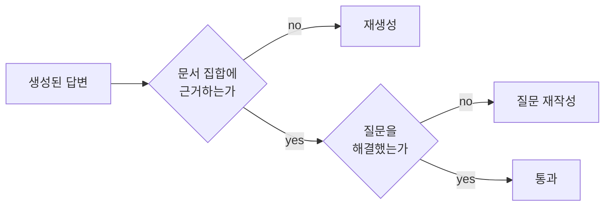

"환각을 0으로 만들었다"는 문장이 자료 제목에 그대로 등장한다. 코드는 실제로 잘 돌고, 근거 없는 답변이 걸러지는 것도 사실이다. 그런데 이 표현은 **틀렸다.** 검증 노드가 재는 것은 사실성이 아니기 때문이다.

이 글은 그 구분에서 시작한다. 코드가 실제로 보장하는 것과 보장하지 못하는 것을 분리하고, 그 검증을 붙이는 대가를 LLM 호출 횟수로 세고, 마지막으로 이 시리즈에서 다룬 네 구현에 남아 있는 함정 여덟 개를 목록으로 남긴다. [앞 편](/blog/ai-agent/crag-adaptive-rag-routing/)까지 네 변형의 구조를 전부 봤다면 여기가 그 결산이다.

## 용어 정리

앞 세 편의 용어표에서 이 글이 쓰는 행만 추렸다.

| 약어 / 용어 | 원어 | 뜻 |
|---|---|---|
| Groundedness | 근거성 | 답변이 **주어진 문서에 근거**하는가 |
| Factuality | 사실성 | 답변이 **세상의 사실**과 맞는가. groundedness와 다르다 |
| Grader | — | yes/no 정형 라벨을 뱉는 LLM 판정기 |
| Reflection Token | — | Self-RAG 원논문에서 모델이 직접 생성하도록 학습시킨 자기평가 특수 토큰 |
| Knowledge Refinement | — | CRAG 원논문의 단계. 문서를 분해했다가 재조합해 노이즈를 제거 |
| `recursion_limit` | — | LangGraph 그래프가 실행할 수 있는 최대 스텝 수 |
| `Send` API | — | LangGraph에서 작업을 여러 갈래로 팬아웃하는 API |

## 측정되는 것은 사실성이 아니다

판정 프롬프트 원문이 `grounded in / supported by a set of retrieved facts`다. 즉 **"검색된 문서와 어긋나지 않는가"만** 본다. 문서가 세상의 사실과 맞는지는 이 구조 어디에서도 확인하지 않는다.

> **groundedness와 factuality는 다른 것을 재는 지표다.** 전자는 답변과 문서의 일치를, 후자는 답변과 사실의 일치를 본다.
>
> 이 둘을 구분하지 않으면 검증 루프의 값어치를 과대평가하게 된다. 검증 루프가 하는 일을 정확히 말하면 "**근거 없는 답변이 사용자에게 도달하는 경로를 차단**"하는 것이다. 그 이상을 주장하면 근거를 대야 한다.

### 함께 따라붙는 다섯 가지 한계

| # | 한계 | 왜 문제인가 |
|---|---|---|
| L1 | **문서가 틀리면 환각도 통과한다** | 문서가 오래되었거나 오류가 있으면, 그 오류를 충실히 옮긴 답변은 `grounded=yes`로 통과한다. 검증되는 것은 출처 일치일 뿐 |
| L2 | **판정자도 같은 종류의 LLM이다** | 생성기·판정기 모두 `gpt-4o-mini`. 생성기가 놓친 오류를 판정기도 같은 편향으로 놓칠 수 있다. 자기채점(self-grading)의 순환 문제 |
| L3 | **재시도 상한이 없다** | `generate → generate` 자기 루프에 카운터가 없다. 환각이 반복 판정되면 기본 재귀 한도에 걸릴 때까지 재생성하며 토큰을 태운다 |
| L4 | **2진 판정이라 부분 환각을 못 잡는다** | 5문장 중 1문장만 지어낸 답변에 대해 전체 yes/no만 나온다. 어느 문장인지도 알려주지 않아 재생성이 맹목적이다 |
| L5 | **검증 자체의 비용·지연이 크다** | 문서 N개 채점 + 환각 + 적합성 = 최소 N+2회 추가 호출. 사용자 대면 실시간 응답에는 그대로 쓰기 어렵다 |

다섯 중 L1과 L2가 성격이 다르다. **L3·L4·L5는 구현을 고쳐 완화할 수 있지만, L1·L2는 구조에서 온다.** 문서 품질을 검증하려면 또 다른 근거가 필요하고, 판정 편향을 없애려면 판정자가 생성자와 다른 계열이어야 한다. 둘 다 이 파이프라인 안에서는 풀리지 않는다.

> L2의 완화책이 실무에서 가장 자주 빠진다. **생성기와 판정기를 다른 모델 계열로 두는 것**만으로도 편향 공유가 줄어든다.
>
> 그런데 이 조치가 아래 비용 절과 충돌한다. 판정을 소형 저가 모델로 계층화하는 것이 비용 대책인데, 같은 벤더의 소형 모델은 대형 모델과 편향을 공유할 가능성이 크다. **비용 최적화와 편향 분리가 반대 방향을 가리킨다.**

### 원논문과 구현의 거리

이 시리즈의 구현은 논문의 **간이 재현**이다. 무엇이 빠졌는지를 알아야 한계도 정확히 말할 수 있다.

| | 원논문 | 이 시리즈의 구현 |
|---|---|---|
| **Self-RAG** | 모델이 reflection token(검색 필요 여부·관련성·근거성·유용성)을 **직접 생성하도록 학습**시킨다. 판정이 생성 과정에 내재 | 별도 LLM Grader 체인으로 **외부에서 근사**. 학습 없이 프롬프트만으로 구현 |
| **CRAG** | 경량 retrieval evaluator가 **Correct / Incorrect / Ambiguous 3단계** 신뢰도를 산출하고, knowledge refinement(문서 분해 후 재조합)로 노이즈를 제거 | binary yes/no + 웹검색 추가만. refinement 단계 없음 |

> 근사 구현의 장점은 **학습 없이 어떤 LLM으로도 즉시 만들 수 있다**는 것이고, 단점은 **판정 품질이 프롬프트에 전적으로 의존한다**는 것이다.
>
> 이 트레이드오프가 실무 선택에서 직접 값을 한다. 판정 품질이 시스템 상한을 결정하는데 그 품질을 올리는 수단이 프롬프트뿐이라면, **판정 프롬프트를 형상관리 대상으로 두고 회귀 테스트를 붙여야** 한다. 프롬프트를 버전 관리하는 실제 사례는 [관련성 검증 편](/blog/rag/agentic-rag-relevance-check/)에 네 번의 개정 기록으로 남아 있다.

### 정확한 표현으로 바꾸기

| 부정확한 표현 | 정확한 표현 |
|---|---|
| "환각을 0으로 만들었다" | "생성 결과를 문서 근거와 대조하는 검증 노드를 넣어, **근거 없는 답변이 사용자에게 나가는 경로를 차단**했다" |
| "Self-RAG를 구현했다" | "Self-RAG 논문의 아이디어를 **LLM Grader 체인으로 근사 구현**했다. 원논문의 reflection token 학습 방식과는 다르다" |
| "환각률을 측정했다" | 측정 데이터가 없다면 쓰지 않는다 |

세 행이 같은 규칙의 사례다. **보장 범위를 좁혀 쓰면 그 안에서는 주장이 성립한다.** 넓히면 근거가 따라가지 못하고, 근거가 없으면 좁은 주장까지 함께 흔들린다.

## 비용 — 코드에서 센 LLM 호출 횟수

아래는 **코드의 호출 경로를 센 값**이며, 검색 문서 수를 N, 재시도 없음을 가정한다. 실측 벤치마크가 아니다.

| 변형 | 라우팅 | 에이전트 | 문서 채점 | 생성 | 환각 | 적합성 | 합계 | 웹 API |
|---|---|---|---|---|---|---|---|---|
| Naive RAG | — | — | — | 1 | — | — | **1** | — |
| Agentic RAG | — | 1 | 1 | 1 | — | — | **3** | — |
| Self-RAG | — | — | N | 1 | 1 | 1 | **N+3** | — |
| CRAG (폴백 미발동) | — | — | N | 1 | — | — | **N+1** | 0 |
| CRAG (폴백 발동) | — | — | N | 1 | — | — | **N+2** (재작성 1 포함) | 1 |
| Adaptive RAG (벡터 경로) | 1 | — | N | 1 | 1 | 1 | **N+4** | — |
| Adaptive RAG (웹 경로) | 1 | — | — | 1 | 1 | 1 | **4** | 1 |

일곱 행 중 마지막이 유일하게 N에 의존하지 않는다. 웹 경로에는 문서 채점 단계가 없기 때문이다. **라우팅이 비용 절감 장치이기도 하다**는 사실이 여기서 드러난다 — 인덱스 밖 질문을 벡터 경로에서 빼내면 채점 N회가 통째로 사라진다.

재시도가 발생하면 다음이 더해진다.

| 재시도 유형 | 추가 호출 |
|---|---|
| `not supported` 1회당 | 생성 1 + 환각 1 (+ 적합성 1) |
| `not useful` 1회당 | 재작성 1 + 검색 + 채점 N + 생성 1 + 환각 1 + 적합성 1 |

**`not useful` 루프 한 번이 거의 전체 파이프라인 재실행이다.** 상한 설정이 왜 필수인지가 여기서 나온다.

> 문서 채점 N회는 순차 실행이라 지연에 그대로 누적된다. `Send` API로 문서별 채점을 팬아웃하거나, 여러 문서를 한 프롬프트에 담아 배치 채점하면 N회를 1~2회로 줄일 수 있다.
>
> 또 하나는 **모델 계층화**다. 채점은 소형·저가 모델, 생성은 고성능 모델로 분리한다. 다만 앞서 L2에서 짚었듯 같은 계열 소형 모델은 편향을 공유하므로, 비용만 보고 고르면 판정 신뢰도를 함께 깎는다.

## 코드 함정 여덟 가지

실습을 재현할 때 걸리는 지점들이다.

| # | 위치 | 함정 | 대응 |
|---|---|---|---|
| C1 | Agentic RAG `grade_documents` | 반환 타입 `Literal[...]` 애노테이션을 지우면 조건 엣지 분기가 성립하지 않는다 (경로 맵 인자를 안 넘기므로) | 애노테이션 유지 또는 경로 맵 명시 |
| C2 | Self-RAG·Adaptive RAG `grade_generation_v_documents_and_question` | else 분기에서 `pprint(...)` 호출. Adaptive RAG 쪽은 `pprint`를 **끝까지 import하지 않아** 환각 판정 시 `NameError` | `print`로 교체하거나 import 추가 |
| C3 | Adaptive RAG `web_search` | `documents`에 리스트가 아닌 `Document` 단일 객체를 넣는다. 현재는 곧장 `generate`로 가서 터지지 않지만, `grade_documents`를 거치게 바꾸면 순회에서 깨진다 | `[web_results]`로 감싸기 |
| C4 | Self-RAG·CRAG | `retriever.get_relevant_documents(...)`는 폐기 예정 API | `retriever.invoke(...)` |
| C5 | Agentic RAG·Self-RAG·CRAG | `langchain_core.pydantic_v1`은 폐기 경로 | `from pydantic import BaseModel, Field` |
| C6 | CRAG `web_search` | `documents.append(...)`로 State 안의 리스트를 **제자리 변경**. 리듀서 없는 `TypedDict`라 동작하지만 부작용이 있는 패턴 | 새 리스트를 만들어 반환 |
| C7 | 전 구현 | Self-RAG·Adaptive RAG 그래프에 재시도 카운터가 없다 | State에 `retry_count` 추가 후 조건 분기에서 상한 체크 |
| C8 | Agentic RAG | `generate` 노드에서 `format_docs`를 정의만 하고 쓰지 않는다 (문자열을 그대로 전달) | 데드코드로 인지 |

여덟 항목이 세 무리로 갈린다.

| 무리 | 항목 | 성격 |
|---|---|---|
| 지금 터진다 | C2 | 특정 분기에서 즉시 예외 |
| 나중에 터진다 | C1, C3, C6 | 지금은 우연히 동작. 코드를 고치면 깨진다 |
| 안 터지고 새어 나간다 | C4, C5, C7, C8 | 폐기 API·비용·데드코드 |

> **가운데 무리가 가장 위험하다.** 지금 동작한다는 사실이 설계가 옳다는 증거로 읽히기 때문이다.
>
> C3가 교과서적이다. `Document` 단일 객체를 넣어도 지금 흐름에서는 곧장 `generate`로 가므로 아무 일도 일어나지 않는다. 그런데 나중에 "웹 결과도 채점하자"는 자연스러운 개선을 하는 순간 순회에서 깨진다. **타입 계약을 지금 지키는 비용보다, 나중에 왜 깨졌는지 찾는 비용이 훨씬 크다.**

C7은 이 시리즈 전체를 관통하는 결함이다. 1편의 실패 분류표에서 F5(무한 재시도)에 "어느 변형도 못 막는다"고 적은 근거가 이 항목이고, Agentic RAG가 `recursion_limit=10`을 건 것도 그래프 안이 아니라 실행 시점 옵션이었다. 상한을 그래프 안에 넣으려면 State에 카운터 채널을 하나 두고 조건 분기에서 읽으면 된다 — 앞 시리즈에서 본 [리듀서 없는 채널](/blog/ai-agent/langgraph-state-reducer/)이 정확히 이 용도에 맞는다.

---

여기까지가 판정기를 꽂아 경로를 바꾸는 RAG다. 판정 하나에서 넷까지 늘렸고, 그 대가가 호출 횟수의 선형 증가라는 것까지 봤다.

그런데 지금까지의 그래프는 전부 **에이전트 하나**였다. 노드가 여럿이어도 판단하는 주체는 하나이고, 도구와 판정기가 그 하나에 매달려 있는 구조다. 도구가 여섯 개를 넘어가고 역할이 서로 충돌하기 시작하면 무엇을 해야 하는가. 쪼개고 나면 **누가 다음 순서를 정하는가.** 이어지는 시리즈에서 [단일 에이전트의 경계와 멀티에이전트 토폴로지](/blog/ai-agent/when-to-split-agents/)를 다룬다.

"환각 0"이라는 표현이 왜 위험한지, 판정기가 틀릴 때 무엇을 할 수 있는지, 개선을 무엇으로 측정하는지는 [운영 Q&A](/blog/ai-agent/ai-agent-qna-operations/)에 이어져 있다.
