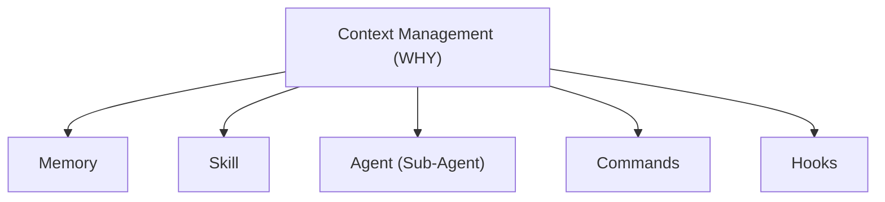
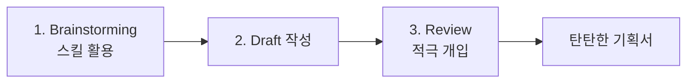
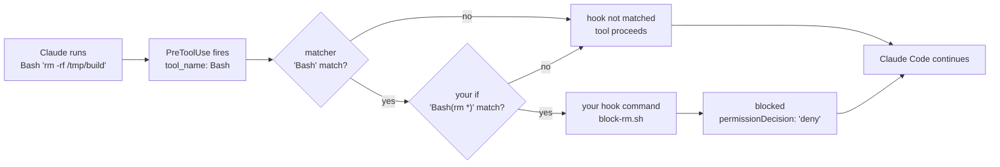

하네스를 "모델을 감싸 장기 실행을 관리하는 시스템"이라고 정의하고 나면 곧바로 다음 질문이 온다 — 그래서 무엇을 만드는가. 감싼다는 말은 동작이 아니라 은유라서, 손이 닿는 부품 목록이 없으면 정의가 실행으로 내려오지 않는다.

이 글은 그 목록을 다섯으로 못 박는다. **메모리·스킬·에이전트·커맨드·훅**, 그리고 다섯이 전부 하나의 질문 — 컨텍스트를 어떻게 관리할 것인가 — 으로 수렴한다는 것이 이 자료의 구조다. 각각이 무엇을 해결하고, 잘못 고르면 무엇이 무너지는지를 순서대로 본다. [첫 편](/blog/ai-agent/agent-harness-architecture/)이 하네스의 원리를 세웠다면 이 글은 그 원리를 부품 목록으로 바꾼다. 앞의 [조직 적용 편](/blog/ai-agent/enterprise-ai-adoption-actions/)에서 Maker가 "서브에이전트를 정의·설계한다"고 했을 때 실제로 만드는 것이 여기 나오는 다섯이다.

> 이 글은 **2026년 3월 자료를 정리한 것**이다. 언급되는 도구·명령·화면과 벤치마크 수치는 그 시점의 것이며, 모델 세대가 바뀌면 권고 상한도 함께 바뀐다.

## 용어 정리

앞 편들의 용어표에서 이 글이 쓰는 행만 추리고, 구성물 이름을 더했다.

| 용어 | 원어 / 표기 | 뜻 |
|---|---|---|
| Agent Harness | Agent Harness | 모델을 감싸 장기 실행 작업을 신뢰성 있게 관리하는 시스템. 정의는 [첫 편](/blog/ai-agent/agent-harness-architecture/) |
| SKILL | — | `SKILL.md`로 패키징돼 메인 컨텍스트에 자동 주입되는 전문성 |
| SubAgent | Sub Agent | 자체 컨텍스트 창을 가진 독립 작업자 |
| Command | — | 서브에이전트 호출 순서·절차를 고정한 **버전 관리 가능한 프롬프트 파일** |
| Hooks | — | 도구 호출 전후에 개입하는 훅. 설정 파일에 등록한다 |
| Auto Memory | — | 프로젝트별 `MEMORY.md`에 자동 기록되는 메모. 200줄 제한 |
| agent-memory | — | 서브에이전트 정의의 `memory:` 필드로 활성화되는 영속 메모리. scope는 user / project / local |
| Modular rules | — | `paths` frontmatter로 **특정 경로에서만** 활성화되는 조건부 규칙 파일 |
| MRCR v2 | Multi-Round Coreference Resolution | 롱컨텍스트 검색 벤치마크(8-needle). 컨텍스트 상한 권고의 근거 |
| OpenRCA | Root Cause Analysis benchmark | 장애 원인 분석 능력을 재는 벤치마크 |
| ast-grep | — | AST(추상 구문 트리) 기반 코드 검색·치환 도구 |
| Git Worktree | — | 한 저장소에서 여러 브랜치를 별도 디렉터리로 동시 체크아웃하는 기능 |

## 다섯 구성물과 그 위의 한 질문

정의부터다.

> 하네스란 **모델을 감싸서 장기 실행 작업을 신뢰성 있게 관리하는 시스템**이다.

그리고 그 시스템을 이루는 것이 다섯이다.



**최상위 노드가 다섯 중 하나가 아니라 다섯의 이유라는 점**이 이 도식의 전부다. 다섯을 병렬 기능 목록으로 읽으면 "무엇부터 도입할까"라는 질문이 나오지만, 컨텍스트 관리를 상위 목적으로 두고 읽으면 "우리 컨텍스트는 지금 무엇 때문에 오염되는가"로 질문이 바뀐다. 답에 따라 도입 순서가 달라진다.

컨텍스트에 대한 원칙은 셋이다 — 컨텍스트는 중요 참조 지식이고, 그 **질적 우수함이 성공에 결정적**이며, 동시에 **제한적**이다. 셋을 붙이면 결론이 하나 나온다.

> 작업(Task)에 따른 최적의 컨텍스트 구성이 필수적이다.
>
> 이 결론이 당연해 보이지만 실무에서는 정반대로 간다. 컨텍스트 창이 커졌다는 소식이 오면 "더 넣을 수 있게 됐다"로 읽히지 "더 골라야 한다"로 읽히지 않는다. 세 원칙 중 두 번째와 세 번째가 충돌하는 지점이고, 아래 벤치마크가 그 충돌을 수치로 보여준다.

### 컨텍스트를 아껴 써야 하는 이유

권고는 명확하다 — **최대한 256K 안쪽으로 쓴다.** 근거는 롱컨텍스트 검색 벤치마크다.

| 모델 · 컨텍스트 | MRCR v2 (8-needle) 평균 일치율 |
|---|---|
| Opus 4.6 — 256K | **93.0** |
| Opus 4.6 — 1M | 76.0 |
| Sonnet 4.5 — 256K | 10.8 |
| Sonnet 4.5 — 1M | 18.5 |

> **같은 모델이 256K에서 93.0, 1M에서 76.0으로 떨어진다. 17.0%p 하락이다.**
>
> 컨텍스트 창이 크다고 채워 쓰면 손해라는 뜻이고, "1M 지원"은 상한이지 권장치가 아니다. 벤치마크 이름이 캡션에 붙어 있어야 하는 이유는 아래 두 행에 있다 — 다른 모델에서는 순서가 뒤집혀 1M 쪽이 더 높다. **단일 벤치마크의 한 모델에서 관측된 값**이지 보편 법칙이 아니며, 모델 세대가 바뀌면 최적 상한도 바뀐다.

### 고정 비용 일곱 종

작업마다 컨텍스트를 새로 짜더라도 공통으로 지켜야 할 규칙은 고정으로 올린다 — 코드 컨벤션, 테스트 작성 방법 같은 것들이다. 그 고정분의 구성이 일곱이다.

| # | 구성요소 | 크기 | 설명 |
|---|---|---|---|
| 1 | 시스템 프롬프트 | 3k 토큰 | 도구 자체의 기본 동작 지침. 직접 수정 불가 (플래그로 추가만 가능) |
| 2 | 시스템 도구 | ≈ 11k 토큰 | 셸·파일 편집·검색 등 내장 도구 정의. **가장 큰 고정 비용 항목** |
| 3 | 메모리 파일 | 가변 | `CLAUDE.md` 계층 구조 |
| 4 | `.claude/rules/*.md` | 조건부 | `paths` frontmatter로 특정 경로에서만 활성화되는 조건부 규칙 |
| 5 | Auto Memory | 가변 | 프로젝트별 `MEMORY.md`. 200줄 제한. 세션 시작 시 읽고, 대화 중 감지한 패턴을 기록 |
| 6 | 커스텀 에이전트 | 가변 | `.claude/agents/*.md`의 서브에이전트 정의도 컨텍스트에 포함 |
| 7 | 참조 파일 | 가변 | `@path/to/file` 문법으로 import한 외부 파일. **재귀 import 최대 5단계** |

메모리 파일은 다시 계층을 이룬다.

| 파일 위치 | 범위 | 특징 |
|---|---|---|
| `~/.claude/CLAUDE.md` | 전역 (모든 프로젝트) | 개인 선호 설정 |
| `./CLAUDE.md` | 프로젝트 루트 | 저장소로 팀 공유 |
| `./CLAUDE.local.md` | 프로젝트 (개인) | 버전 관리 제외 권장 |
| 상위 디렉터리 `CLAUDE.md` | 상위 경로 전체 | 계층적으로 모두 로딩 |

일곱 종 중 **고정값이 붙은 것은 1·2번뿐이고 나머지 다섯은 전부 가변**이다. 다시 말해 세션 시작 비용의 대부분은 우리가 만든다.

> **4번이 중요한 이유는 총량과 단가를 분리해 주기 때문이다.** 규칙을 전부 항상 올리면 고정 비용이 규칙 수에 비례해 커진다.
>
> `paths` 조건으로 "테스트 파일을 작업할 때만 켜지는 규칙"을 만들면 **규칙 총량을 늘리면서도 세션당 비용은 억제**할 수 있다. 조직 규모가 커질수록 필수가 되는데, 규칙은 사람 수에 비례해 늘고 컨텍스트 창은 늘지 않기 때문이다. 전역 규칙 파일이 비대해지는 순간이 조건부 분해를 시작할 신호다.

## 메모리 — 인덱스와 본문을 나눈다

메인 세션의 자동 메모리는 단순하다. `MEMORY.md`를 자동으로 읽어 들이고, 200줄 제한이 있으며, 자동 저장되거나 사람이 직접 고칠 수 있다.

서브에이전트 쪽에는 별도 메모리가 붙는다. 정의 파일에 `memory` 필드를 설정하면 scope(user / project / local)에 따라 세 위치 중 하나에 영속 디렉터리가 생기고, **미설정 시 메모리를 쓰지 않는다.** 실제 구조는 이렇게 생겼다.

```text
.claude/
└── agent-memory/
    ├── expert-backend/
    ├── expert-devops/
    ├── expert-security/
    ├── expert-testing/
    │   ├── MEMORY.md
    │   ├── project_go_cli_coverage.md
    │   └── project_hook_testing_patterns.md
    └── manager-git/
```

그리고 `MEMORY.md`의 내용은 본문이 아니라 링크 인덱스였다.

```markdown
# Expert Testing Agent Memory

## Project
- [Go CLI coverage patterns](./project_go_cli_coverage.md) — Patterns ...
- [Hook testing patterns](./project_hook_testing_patterns.md) — Fixtu...
```

> **구조가 말해주는 것은 200줄 제한을 다루는 방법이다.** 메모리 본문을 `MEMORY.md`에 쌓지 않는다. 인덱스만 두고 본문은 개별 파일로 분리한다.
>
> [첫 편](/blog/ai-agent/agent-harness-architecture/)의 "날짜별 `.md` + 디렉터리 파일"과 정확히 같은 패턴이다. 두 자료가 두 달 간격으로 같은 구조에 도착했다는 것은 이것이 구현 세부가 아니라 **컨텍스트가 제한 자원일 때의 일반해**라는 뜻이고, 조직 위키를 재편할 때도 같은 원리가 적용된다 — 인덱스는 항상 읽히고, 본문은 필요할 때만 읽힌다.

세션 시작 비용은 실제로 측정할 수 있다. 컨텍스트 분해 명령이 내놓은 실제 값이다(1M 창에서 67k 사용, 7%).

| 카테고리 | 토큰 | 비중 |
|---|---|---|
| 시스템 프롬프트 | 7.4k | 0.7% |
| 시스템 도구 | 9.7k | 1.0% |
| 커스텀 에이전트 | 5.7k | 0.6% |
| 메모리 파일 | 18.6k | 1.9% |
| 스킬 | 7.2k | 0.7% |
| 메시지 | 18.2k | 1.8% |
| 여유 공간 | 900k | 90.0% |
| 자동 압축 버퍼 | 33k | 3.3% |
| MCP 도구 | — | 필요 시 로드 |

> **사람이 나눈 대화(18.2k)보다 메모리 파일(18.6k)이 더 크다.**
>
> 세션 초기 비용의 대부분은 "무엇을 항상 읽게 할 것인가"라는 설계 결정에서 나온다는 뜻이다. 커스텀 에이전트 5.7k도 같은 성격이고, 이 값이 왜 문제가 되는지는 바로 다음 절에 나온다. MCP 도구만 필요 시 로드라 도구를 많이 붙여도 상시 비용이 되지 않는다.

## 계획 없이 구현하지 않는다

200만 줄 이상을 AI와 코딩하며 얻었다는 교훈은 네 가지다.

**첫째, 계획 없이 구현하지 않는다.** 자료의 표현은 단호하다 — "설마 계획 없이 구현하고 있는가? 당장 멈추시오."

**둘째, 계획 단계에서 철저히 검증한다.** 구체적으로는 브레인스토밍 스킬을 쓰고, **요구사항 인터뷰 스킬을 만들어 최소 10개 이상의 질문을 받게** 하고, 이 단계에서 아는 개발 용어와 지식을 총동원해 설계를 다지고, 검증 계획도 느슨하게 잡지 말고 **최소 85% 이상의 커버리지**를 가져간다.

**셋째, 자연어보다 지식을 주입한다.**

| 나쁜 지시 | 좋은 지시 |
|---|---|
| "RAG 챗봇 만들어줘" | "벡터DB는 Chroma를 쓰고, 하이브리드 검색 비율은 시맨틱 6 대 4로 주고, LangGraph 상태 그래프로 만들고, 모델은 특정 버전을 쓰고, 출처를 표기하는 프롬프트를 가진 챗봇 만들어줘" |

> **그래서 소프트웨어와 프레임워크를 공부한 사람이 유리할 수밖에 없다.**
>
> 이 문장이 갖는 무게는 "AI가 개발을 대체하면 시니어가 필요 없어지는 것 아니냐"는 흔한 예측에 대한 정면 반박이라는 데 있다. **지시의 품질이 곧 결과의 품질이고, 지시의 품질은 아키텍처 지식에서 나온다.** 위 표의 오른쪽 칸을 쓰려면 벡터DB 선택지를 알아야 하고, 하이브리드 검색의 가중치가 무엇을 바꾸는지 알아야 하고, 상태 그래프가 왜 필요한지 알아야 한다. 경력의 가치가 사라지는 것이 아니라 **가치가 발현되는 위치가 코드에서 지시로 옮겨간다.**

**넷째, 나에게 맞는 하네스를 찾는다.** 커뮤니티 배포판이 여럿 나와 있어 백지에서 시작할 필요가 없다.

계획 수립 자체는 3단계다.



세 번째 단계에 "적극 개입"이 붙은 것이 이 도식의 요점이다. 1·2단계는 도구가 하고 3단계는 사람이 한다 — **리뷰에서 우리 생각과 일치시키는 것**이 목표이고, 여기서 탄탄한 기획서가 나와야 한다. 코드리뷰가 아니라 **계획 리뷰가 새 품질 게이트**가 된다는 뜻이다.

## 스킬로 만들 것인가, 에이전트로 만들 것인가

구분은 한 줄이다 — 스킬은 컨텍스트 안에서 호출하는 용도, 에이전트는 서브에이전트로 위임해 독립적으로 처리하는 용도이며 **에이전트는 스킬을 쓸 수 있다.**

**스킬로 만들 것**은 도구 자체로는 할 수 없는 새로운 기능이다. 메신저 메시지 발송, 메일을 읽어 요약하는 기능, 특정 문서 포맷을 다루는 기능 같은 것들이다.

**에이전트로 만들 것**은 독립적인 역할을 갖고 수행하는 일이다. 각 서브에이전트는 자기 도구와 스킬만 로드한다.

| 예시 에이전트 | 로드하는 것 |
|---|---|
| 프론트엔드 엔지니어 | 프론트엔드 관련 스킬 / 브라우저 도구 |
| 백엔드 엔지니어 | 백엔드 관련 스킬과 지식 |

그러면 에이전트를 많이 만들면 좋은가 — 아니다.

| 분할 수준 | 문제 |
|---|---|
| 너무 많음 | frontmatter가 상시 로드돼 컨텍스트 낭비 |
| 너무 잘게 나눔 | 어느 에이전트에 위임할지 모호 → 라우팅 오류 |
| 적정 | 도구·지식 경계가 실제로 다른 단위 |

> **에이전트 정의는 항상 컨텍스트에 로드되므로 너무 많으면 낭비가 되고, 너무 잘게 나누면 위임 대상이 모호해진다.**
>
> 자료가 든 반례가 명료하다 — 프론트엔드 엔지니어, CSS 엔지니어, HTML 엔지니어, Next.js 엔지니어를 따로 두는 식이다. 넷 다 프론트엔드 작업이라 "이 일은 누구 것인가"가 매번 판정 문제가 된다. **팀을 잘게 쪼개면 소통 비용과 담당 모호성이 늘어난다**는 조직 설계의 오래된 문제와 같은 구조이고, 앞 절의 `/context` 분해에서 커스텀 에이전트가 5.7k를 차지한 것이 이 낭비의 실측값이다.

## 커맨드 — 프롬프트를 버전 관리 대상으로

커맨드가 왜 필요한지는 서브에이전트의 제약 다섯 가지에서 나온다.

**① 서브에이전트는 컨텍스트를 직접 받지 못한다.** 서브에이전트의 컨텍스트 창은 부모 대화 없이 새로 시작하고, 부모에서 전달할 수 있는 유일한 채널은 호출 시 넘기는 프롬프트 문자열 하나뿐이다.

**② 서브에이전트는 서브에이전트를 부르지 못한다.** 무한 중첩을 막는 설계다. 그래서 오케스트레이터 역할의 커맨드를 명시적으로 만들어 어떤 서브에이전트를 어떤 순서로 부를지 커맨드 레벨에서 정의한다.

**③ 커맨드가 없으면 주 대화가 오염된다.** 반복 작업마다 자연어로 지시하면 토큰이 낭비되고 컨텍스트가 오염된다.

**④ 서브에이전트에는 계획 모드가 없다.** 단계별 계획 생성과 실행을 지원하지 않고 할당된 작업을 바로 실행하며, 중간 출력이 없어 완료 전까지 진행 상황을 모니터링하거나 디버깅하기 어렵다. 그래서 단계별 절차를 커맨드 파일에 명시해야 한다.

**⑤ 모델은 매번 다르게 행동한다.** 아무리 정확한 지시를 줘도 매번 다르게 따를 수 있는데, 항상 동일하게 작동해야 하는 경우가 있다. 커맨드 파일은 프롬프트를 **버전 관리 가능한 파일로 고정**해 팀 전체가 같은 결과를 얻게 한다.

| 이유 | 제약 | 커맨드의 역할 |
|---|---|---|
| 컨텍스트 전달 채널이 하나 | 서브에이전트는 부모 대화를 모른다 | 필요한 정보를 모두 파일에 명시 |
| 중첩 호출 불가 | 서브에이전트 → 서브에이전트 불가 | 오케스트레이션 로직을 커맨드에 |
| 컨텍스트 오염 방지 | 탐색 결과가 주 대화에 쌓인다 | 서브에이전트로 격리, 요약만 반환 |
| 계획 모드 없음 | 서브에이전트는 즉시 실행 | 단계별 절차를 커맨드에 명시 |
| 비결정적 모델 동작 | 매번 다른 결과 가능 | 프롬프트 파일로 동작 고정 |
| 도구 권한 제한 | 기본은 모든 도구 허용 | 허용 도구 목록으로 안전하게 제한 |

**본문의 이유는 다섯인데 표는 여섯 행이다.** 마지막 행(도구 권한 제한)은 앞의 다섯처럼 제약에서 도출된 것이 아니라 커맨드가 부수적으로 얻는 능력이라, 서술에서 빠졌다가 총정리에서 붙는다. 이 행이 다음 절의 훅과 이어진다.

> **이 표는 사실상 "AI 작업의 표준작업절차를 왜 문서화해야 하는가"의 목록이다.**
>
> 여섯 줄 모두 사람 조직의 프로세스 문서화 논거와 동일하다 — 인수인계가 안 된다, 순서를 아는 사람이 한 명뿐이다, 매번 결과가 다르다. 결정적 차이는 하나다. 사람 조직의 프로세스 문서는 읽히지 않으면 그만이지만, 여기서는 문서가 **실행 가능한 자산**이라 읽히지 않을 수가 없다.

## 훅 — 가드레일을 시스템으로 강제한다

훅은 나만의 하네스를 만들기 위해 반드시 알아야 하는 요소로 제시된다. 설정 파일에 등록하며, 도구 호출을 가로채는 흐름은 이렇다.



분기가 두 단계라는 점이 설계상 중요하다. 첫 관문은 도구 종류를, 둘째는 인자 패턴을 거른다. 둘 다 통과해야 차단되므로 **오탐을 줄이면서 위험 명령만 잡을 수 있다.**

> **훅은 가드레일을 코드로 강제하는 유일한 지점이다.**
>
> "위험한 명령을 쓰지 말자"는 규약은 지켜지지 않지만 사전 훅은 반드시 지켜진다. 보안·컴플라이언스 요구를 개발자 선의가 아니라 시스템으로 처리하는 방법이고, 앞 절 커맨드의 허용 도구 목록과 짝을 이룬다 — 커맨드가 **줄 수 있는 권한의 상한**을 정한다면 훅은 **주어진 권한 안에서의 행동**을 판정한다. 둘 중 하나만 쓰면 구멍이 남는다.

## 나머지 교훈들

**장애 원인 분석은 아직 사람의 영역이다.** 원인 분석 벤치마크의 모델별 정확도다.

| 모델 | 정확도 (%) |
|---|---|
| Opus 4.6 | 34.9 |
| Opus 4.5 | 26.9 |
| Sonnet 4.5 | 12.9 |

차트 캡션은 "복잡한 소프트웨어 장애 진단에 뛰어나다"였지만, **최상위 모델도 34.9%다.** AI 도입 서사에 이 숫자를 함께 제시하면 무비판적 낙관이 아니라는 신뢰를 얻는다.

**두세 번 시도해서 안 풀리면 다른 도구로 옮긴다.** 한 도구로만 해결하려다 막힌 문제가 다른 도구에서 풀린 경우가 많았다는 관찰이고, 이유로 둘이 제시된다 — 완전히 다르게 구성된 컨텍스트, 그리고 모델의 특성.

> **이 관찰을 "저쪽 모델이 더 좋다"로 읽으면 잘못이다. "컨텍스트 구성이 달라서"로 읽어야 한다.**
>
> 그러면 막혔을 때 도구를 바꾸는 것은 취향이 아니라 **컨텍스트를 리셋하는 저비용 실험**이 된다. 우리가 쌓아 둔 규칙 파일과 메모리가 완벽하지 않다는 것을 확인하는 진단 수단이기도 하고, "도구를 하나로 통일해야 한다"는 압력에 대한 반론 근거이기도 하다 — 다변화가 낭비가 아니라 복구 경로다.

**병렬 작업의 전제는 Git Worktree다.** 한 저장소에서 여러 브랜치를 별도 디렉터리로 동시 체크아웃해야 세션 둘이 서로를 밟지 않는다.

**검색 도구를 바꾸면 대규모 리팩터링의 안전성이 달라진다.**

| 구분 | grep | ast-grep |
|---|---|---|
| 탐색 방식 | 문자열·정규식 | 추상 구문 트리 |
| 코드 이해 | 없음 | 문법 구조 이해 |
| 오탐 | 많음 | 매우 적음 |
| 속도 | 빠름 | 거의 동등 |

```bash
# console.log(...)를 모두 찾되, 인자가 무엇이든 상관없이
ast-grep -p 'console.log($$$)'

# var → let 일괄 변환 (구문적으로 안전하게)
ast-grep -p 'var $VAR = $EXPR' --rewrite 'let $VAR = $EXPR'
```

네 축 중 마지막 행이 이 표를 결정한다. **속도가 거의 같기 때문에** 오탐이 적다는 장점이 순수 이득이 되고, 트레이드오프가 없으므로 일괄 치환의 기본 도구를 바꾸는 것이 자연스러운 결론이 된다.

## 조직에 옮기면 무엇이 되는가

| 주장 | 조직에 미치는 함의 | 첫 90일에 할 일 |
|---|---|---|
| 하네스 = 장기 실행을 신뢰성 있게 관리하는 시스템 | 도입의 성패가 모델 선택이 아니라 **운영 껍데기 설계**에 달림 | 30일: 사내 하네스 구성물(메모리·스킬·에이전트·커맨드·훅) 표준 정의 |
| 256K 안쪽 권고 (MRCR v2 기준 93.0 → 76.0) | "창이 크니 다 넣자"는 발상을 금지해야 함 | 30일: 컨텍스트 예산 가이드 배포. 세션당 상한을 팀 규약으로 명시 |
| 고정 지식 7종, 시스템 도구 ≈11k가 최대 고정비 | 세션 시작 비용을 **측정 가능한 항목**으로 관리 | 60일: 컨텍스트 분해를 정기 점검 항목으로. 메모리 파일 비대화 감시 |
| 조건부 규칙 로딩 | 규칙 총량은 늘리되 세션 비용은 억제하는 유일한 방법 | 60일: 비대해진 전역 규칙 파일을 경로 조건부로 분해 |
| `MEMORY.md` 200줄 제한 + 본문은 개별 파일 | 지식 자산은 **인덱스 + 분리 본문** 구조가 정답 | 30일: 팀 지식베이스를 인덱스/본문 2계층으로 재편 |
| agent-memory scope(user/project/local) | 에이전트별 학습이 조직 자산으로 축적되기 시작 | 90일: 리뷰·테스트 에이전트에 project scope 메모리 부여, 축적 내용 정기 검토 |
| 계획 없이 구현 금지 / 검증 커버리지 85% | 코드리뷰가 아니라 **계획 리뷰**가 새 품질 게이트 | 30일: "계획 승인 없이 구현 착수 금지"를 팀 규칙으로. 계획 리뷰 체크리스트 작성 |
| 인터뷰 스킬 — 최소 10개 질문을 받게 하기 | 요구사항 누락을 사람이 아니라 절차로 잡음 | 60일: 사내 인터뷰 스킬 제작, 신규 과제 착수 시 필수 실행 |
| 자연어보다 아키텍처 지식 주입 | **시니어의 가치가 오히려 상승**한다는 조직 서사 | 30일: 지시문 예시집(나쁜 지시 → 좋은 지시) 사내 배포 |
| 에이전트가 너무 많으면 오히려 해롭다 | 에이전트 카탈로그도 **정리 대상 자산** | 60일: 에이전트 인벤토리 정리, 도구·지식 경계 기준으로 통폐합 |
| 커맨드 = 버전 관리 가능한 프롬프트 | 프로세스가 실행 가능한 코드가 됨 | 60일: 반복 워크플로우 3개를 커맨드로 고정, 저장소에 커밋 |
| 허용 도구 목록으로 권한 제한 | 최소 권한 원칙을 에이전트에도 적용 | 30일: 에이전트별 허용 도구 목록 명문화 |
| 훅으로 위험 명령 차단 | 가드레일을 선의가 아니라 시스템으로 강제 | 60일: 파괴적 명령·비밀정보 접근 차단 훅을 사내 기본 설정에 포함 |
| 원인 분석 최상위 34.9% | 장애 분석은 여전히 사람의 일 — 과대약속 방지 | 30일: AI 적용 범위에서 장애 분석을 명시적으로 "보조" 등급으로 분류 |
| 막히면 다른 도구로 = 컨텍스트 리셋 실험 | 도구 다변화가 낭비가 아니라 진단 수단 | 90일: 2~3회 실패 시 도구 전환 규칙을 트러블슈팅 가이드에 삽입 |
| Git Worktree 필수 | 병렬 에이전트 작업의 전제 조건 | 30일: worktree 기반 병렬 작업 가이드 배포 |
| ast-grep > grep | 대규모 리팩터링의 안전성이 달라짐 | 60일: 일괄 치환 작업 표준 도구를 ast-grep으로 전환 |

열일곱 행 중 30일 항목이 여덟, 60일 일곱, 90일 둘이다. 그리고 30일 여덟 중 **일곱이 "규약을 정하거나 문서를 만든다"이고 실제 구현은 하나도 없다** — 하네스 도입의 첫 달은 코드를 쓰는 달이 아니라 합의를 만드는 달이다.

---

여기까지가 부품이다. 다섯 구성물이 있고, 각각이 컨텍스트의 어느 부분을 맡고, 잘못 고르면 무엇이 무너지는지까지 나왔다.

그런데 이 다섯을 잘 조립해도 남는 문제가 있다. 하네스는 만든 시점에 고정되고, 운영하면서 배운 것이 자동으로 돌아오지 않는다. 그리고 더 어려운 문제 — 잘 만든 하네스를 팀에 배포하면 대개 쓰이지 않는다. [마지막 편](/blog/ai-agent/self-evolving-seed-and-fork/)에서 피드백이 스킬과 메모리를 갱신하는 자기진화 구조와, 하향식 표준 강제가 왜 실패하는지에 대한 반전을 본다.
