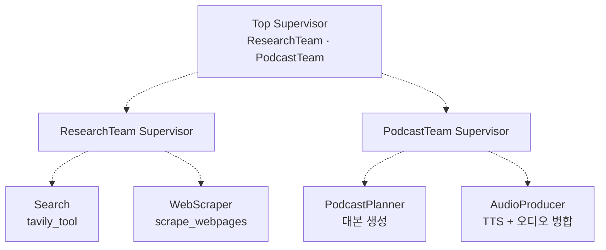
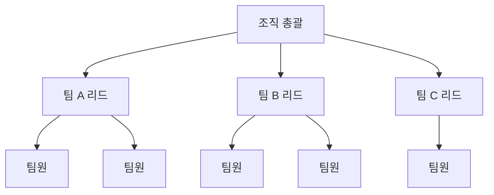

계층 구조에서 최상위 State에 필드가 **두 개뿐**이다. `messages`와 `next`. 팀 내부가 대본을 만들든 오디오 조각을 붙이든, 상위 그래프는 그 필드들의 존재조차 모른다.

이것이 계층 구조가 규모를 감당하는 방식이다. 층을 나눈다는 것은 호출을 나누는 것이 아니라 **무엇을 모르게 할지를 정하는 것**이고, 그러려면 스키마가 서로 다른 그래프를 잇는 장치가 필요하다. 이 글은 그 장치 — 어댑터 세 개 — 를 코드로 따라간다. [앞 편](/blog/ai-agent/supervisor-pattern-cost/)에서 Supervisor 한 층으로는 풀리지 않는 오염 문제까지 왔다.

## 용어 정리

앞 두 편의 용어표에서 이 글이 쓰는 행만 추렸다.

| 약어 / 용어 | 원어 | 뜻 |
|---|---|---|
| Hierarchical | — | Supervisor를 여러 층으로 중첩한 구조 |
| Subgraph | 서브그래프 | 컴파일된 그래프를 다른 그래프의 노드로 끼워 넣은 것 |
| Supervisor | — | 하위 에이전트에게 일을 배정하고 결과를 회수하는 관리자 노드 |
| `bind_functions` | — | OpenAI 함수 호출 API에 스키마를 바인딩하는 구 API. **deprecated** |
| `JsonOutputFunctionsParser` | — | 함수 호출 응답을 dict로 파싱하는 파서 |
| `with_structured_output` | — | Pydantic 스키마로 출력을 강제하는 현행 API |
| TTS | Text To Speech | 텍스트를 음성으로 변환 |
| `recursion_limit` | — | 그래프 최대 스텝 수. [앞 편](/blog/ai-agent/supervisor-pattern-cost/) 참조 |

## 3층 구조

문서를 읽어 팟캐스트를 만드는 구성이다. 최상위 Supervisor 아래 팀이 둘, 팀마다 워커가 둘이다.



앞 편에서 본 `recursion_limit=150`이 바로 이 구조를 돌리기 위한 값이다. 상위 라우팅 1 + 팀 진입 1 + (팀 라우팅 1 + 워커 1) × M + 복귀 1이 팀마다 반복되므로 기본값 25로는 완주하지 못한다.

### 팀 Supervisor를 함수로 찍어낸다

앞 편의 Supervisor는 워커 목록이 코드에 박혀 있었다. 여기서는 **함수로 만든다.** 팀이 늘어도 코드가 늘지 않는다.

```python
def create_team_supervisor(llm: ChatOpenAI, system_prompt, members) -> str:
    """An LLM-based router."""
    options = ["FINISH"] + members
    function_def = {
        "name": "route",
        "description": "Select the next role.",
        "parameters": {
            "title": "routeSchema",
            "type": "object",
            "properties": {
                "next": {"title": "Next", "anyOf": [{"enum": options}]},
            },
            "required": ["next"],
        },
    }
    prompt = ChatPromptTemplate.from_messages([
        ("system", system_prompt),
        MessagesPlaceholder(variable_name="messages"),
        ("system",
         "Given the conversation above, who should act next?"
         " Or should we FINISH? Select one of: {options}"),
    ]).partial(options=str(options), team_members=", ".join(members))
    return (
        prompt
        | llm.bind_functions(functions=[function_def], function_call="route")
        | JsonOutputFunctionsParser()
    )
```

같은 자료 안에서 라우터 구현이 두 방식으로 등장한다.

| 방식 | 어디에 쓰이나 | 스키마 정의 | 장점 | 단점 |
|---|---|---|---|---|
| `with_structured_output(Pydantic)` | 평평한 Supervisor | Pydantic 클래스 | 타입 안전, 코드가 짧음 | 모델·버전별 지원 편차 |
| `bind_functions` + `JsonOutputFunctionsParser` | 계층형 팀 Supervisor | JSON Schema 딕셔너리 | 스키마를 동적 생성하기 쉬움 | 장황함, **OpenAI 함수 API에 종속** |

> `bind_functions`는 현재 **deprecated**이며 `bind_tools`로 대체됐다. 신규 코드는 `with_structured_output` 쪽을 쓰는 것이 맞다.
>
> 그럼에도 두 방식을 나란히 보는 값어치는 **왜 후자가 정리됐는지**에 있다. JSON Schema를 손으로 쓰면 스키마를 런타임에 조립할 수 있는 대신 오타가 타입 검사에 걸리지 않고 벤더 API에 묶인다. 동적 생성이 필요한 경우는 드물었고, 그래서 정적·타입 안전한 쪽이 남았다.

### 팀 서브그래프 조립

```python
class ResearchTeamState(TypedDict):
    messages: Annotated[List[BaseMessage], operator.add]
    team_members: List[str]   # 서로의 역량을 알기 위해 팀원 목록을 상태에 보유
    next: str

research_graph = StateGraph(ResearchTeamState)
research_graph.add_node("Search", search_node)
research_graph.add_node("WebScraper", research_node)
research_graph.add_node("supervisor", supervisor_agent)

research_graph.add_edge("Search", "supervisor")
research_graph.add_edge("WebScraper", "supervisor")
research_graph.add_conditional_edges(
    "supervisor",
    lambda x: x["next"],
    {"Search": "Search", "WebScraper": "WebScraper", "FINISH": END},
)
research_graph.add_edge(START, "supervisor")
chain = research_graph.compile()
```

**팀 그래프는 앞 편의 Supervisor 그래프와 구조가 완전히 동일하다.** 재귀적 구성이 성립하는 이유가 여기 있다 — 팀은 특별한 무엇이 아니라 그냥 또 하나의 Supervisor 그래프다.

팀별 상태는 팀의 필요에 맞게 다르다.

```python
class PodcastTeamState(TypedDict):
    messages: Annotated[List[BaseMessage], operator.add]
    team_members: List[str]
    next: str
    script: List[dict]           # PodcastPlanner가 채움
    audio_segments: List[str]    # AudioProducer가 채움
```

`ResearchTeamState`에는 없는 두 필드가 붙었다. 그리고 이 차이가 곧 문제가 된다 — 상위 그래프는 어느 쪽 스키마를 써야 하는가.

## 상태 격리 3종 세트

상위 그래프와 팀 서브그래프는 **스키마가 다르다.** 그대로 연결하면 상태가 섞인다. 어댑터 세 개가 그 경계를 만든다.

```python
# (1) 진입 어댑터 — 상위의 문자열 하나를 팀 State 전체로 부풀린다
def enter_chain(message: str):
    return {
        "messages": [HumanMessage(content=message)],
        "team_members": ["PodcastPlanner", "AudioProducer"],
        "next": "",
        "script": [],
        "audio_segments": []
    }

# (2) 추출 어댑터 — 상위 State에서 마지막 메시지 본문만 뽑는다
def get_last_message(state: State) -> str:
    return state["messages"][-1].content

# (3) 복귀 어댑터 — 팀 결과 중 마지막 메시지 1개만 상위로 올린다
def join_graph(response: dict):
    return {"messages": [response["messages"][-1]]}

podcast_chain = enter_chain | chain     # 진입부 결합

super_graph.add_node("ResearchTeam", get_last_message | research_chain | join_graph)
super_graph.add_node("PodcastTeam",  get_last_message | podcast_chain  | join_graph)
```


**축소 → 확장 → 실행 → 축소.** 이 모래시계 모양이 상태 격리의 표준형이다.

| 어댑터 | 방향 | 효과 |
|---|---|---|
| `get_last_message` | 상위 → 팀 | 상위 대화 이력이 팀에 통째로 새는 것을 차단 |
| `enter_chain` | 상위 → 팀 | 팀 고유 필드(`script`, `audio_segments`)를 초기화 |
| `join_graph` | 팀 → 상위 | 팀 내부 왕복 N개 메시지를 **1개로 압축**해 상위 컨텍스트 보호 |

**도식은 여섯 노드인데 표는 세 행이다.** 표에 없는 셋은 상위 State·팀 서브그래프·병합인데, 어댑터가 아니라 **어댑터가 잇는 대상**이라 빠졌다. 셋 중 가운데(팀 서브그래프 내부 루프 N회)가 도식에만 있는 정보로서 가장 중요하다 — 팀 안에서 몇 바퀴가 돌든 상위로 나가는 것은 한 개라는 사실이 이 그림에만 보인다.

> 이 방식의 대가는 **정보 손실**이다. 팀이 중간에 발견한 유용한 사실이 마지막 메시지에 담기지 않으면 영원히 사라진다.
>
> 실무 대응은 둘이다. 팀 Supervisor가 마지막에 **요약 메시지를 명시적으로 작성**하도록 프롬프트를 두거나, 손실이 곤란한 산출물은 메시지가 아닌 **별도 상태 필드**로 올린다. 앞은 싸고 불완전하며, 뒤는 스키마를 손대야 하지만 확실하다.

### 최상위 그래프

```python
class State(TypedDict):
    messages: Annotated[List[BaseMessage], operator.add]
    next: str

super_graph = StateGraph(State)
super_graph.add_node("ResearchTeam", get_last_message | research_chain | join_graph)
super_graph.add_node("PodcastTeam", get_last_message | podcast_chain | join_graph)
super_graph.add_node("supervisor", supervisor_node)

super_graph.add_edge("ResearchTeam", "supervisor")
super_graph.add_edge("PodcastTeam", "supervisor")
super_graph.add_conditional_edges(
    "supervisor",
    lambda x: x["next"],
    {"PodcastTeam": "PodcastTeam", "ResearchTeam": "ResearchTeam", "FINISH": END},
)
super_graph.add_edge(START, "supervisor")
super_graph = super_graph.compile()
```

**최상위 State는 `messages`와 `next` 단 두 개다.** 팀 내부 사정(`script`, `audio_segments`)은 상위가 전혀 모른다. 앞 편의 평평한 Supervisor와 조립 코드가 거의 같은데, 노드에 들어가는 것이 함수가 아니라 **어댑터로 감싼 서브그래프**라는 점만 다르다.

> 서브그래프가 상위 그래프에서 그냥 노드 하나로 보인다는 것이 계층 구조의 전부다. 노드는 "상태를 받아 상태 일부를 반환하는 함수"라는 계약만 지키면 되고, 그 안에서 무슨 일이 벌어지는지는 계약 밖이다.
>
> [앞 시리즈에서 본](/blog/ai-agent/langgraph-state-reducer/) 노드 반환 계약이 여기서 두 번째 값을 한다. 계약이 느슨했다면 서브그래프를 노드 자리에 끼우는 일이 성립하지 않는다. **재귀적 구성은 인터페이스가 좁을 때만 가능하다.**

## 조직 관점 비유 — 같은 문제가 두 번 나온다

에이전트 구조에서 나온 실패 양상이 조직 구조에서 나오는 것과 겹친다. 우연이 아니라 **둘 다 "판단 대역폭이 유한한 주체들을 어떻게 연결할 것인가"의 문제**이기 때문이다.

| 에이전트 구조 | 조직 대응 | 공통된 실패 양상 |
|---|---|---|
| 단일 에이전트 + 도구 다수 | **만능 실무자 1명** | 업무가 늘면 판단 품질이 먼저 무너진다 |
| Network / 협업 | **수평 협업 조직, 오너 없음** | 아무도 "이제 끝"이라고 선언하지 않아 일이 안 닫힌다 |
| Supervisor | **팀장 1명 + 팀원 N명** | 팀장이 병목. 팀원이 6명을 넘으면 배정 품질이 떨어진다 |
| Hierarchical | **상위 조직 → 팀 → 팀원** | 층이 늘수록 의사결정 지연과 전달 손실이 커진다 |
| `agent_node`의 결과 압축 | **팀원의 보고는 결론 1줄로** | 과정을 다 올리면 윗선의 판단 대역폭이 잠식된다 |
| `enter_chain` 상태 격리 | **팀에는 필요한 맥락만 전달** | 전사 맥락을 다 주면 팀이 자기 일에 집중하지 못한다 |
| `recursion_limit` | **타임박스** | 한도가 없으면 결론 없는 논의가 무한 반복된다 |
| `interrupt_before` | **배포 승인·리뷰 게이트** | 되돌릴 수 없는 작업 앞에는 사람이 서야 한다 |



**총괄은 팀 단위로만 말을 건다.** 팀 내부의 누가 무엇을 하는지는 팀 리드의 몫이다. `super_graph`의 State에 `messages`와 `next`밖에 없는 것과 정확히 같은 원리다.

### 기술 결정이 조직 결정과 겹치는 자리

각 기술 선택을 조직 운영 언어로 옮기면 같은 문장이 나온다.

| 기술 개념 | 조직 운영 원칙으로 옮기면 |
|---|---|
| Supervisor의 `FINISH` 옵션 | 완료 판정을 리더의 감이 아니라 **명시적 선택지**로 만들어야 일이 닫힌다 |
| `HumanMessage(name=...)` | 누가 무엇을 했는지 기록이 남아야 중복 배정이 사라진다 |
| `join_graph`의 1개 메시지 | 보고는 과정이 아니라 결론이다. 상위의 판단 대역폭은 유한하다 |
| 팀별 State 분리 | 팀에 필요한 맥락만 주는 것이 집중을 만든다 |
| `recursion_limit` | 무한 루프를 막는 건 안전벨트고, 진짜 해법은 **종료 조건을 명확히 하는 것**이다 |
| 계층 추가 시 스텝 곱셈 | 층을 하나 더하는 비용은 덧셈이 아니라 곱셈이다. 그래서 함부로 안 늘린다 |
| 단일 → Supervisor 점진 격상 | 처음부터 완성된 조직을 그리지 않고, 병목이 보이는 곳부터 한 단계씩 나눈다 |

> 일곱 행 중 세 번째가 이 시리즈에서 반복해 나온 명제다. **압축은 손실이지만, 압축하지 않는 것은 더 큰 손실이다.**
>
> `result["messages"][-1]`이라는 코드 한 조각이 컨텍스트 오염 방어선이자 비용 통제 장치이자 조직 보고 원칙이었다. 층을 나누는 모든 설계가 결국 같은 결정을 반복한다 — **무엇을 위로 올리고 무엇을 아래에 남길 것인가.**

---

여기까지가 LangGraph의 실행 모델부터 멀티에이전트 계층화까지다. State와 리듀서로 시작해, 도구로 루프를 만들고, 판정기로 경로를 가르고, 에이전트를 쪼개 층을 쌓았다. 세 시리즈를 관통하는 것은 하나다 — **자율성을 늘리는 모든 결정에는 그것을 되돌릴 장치가 함께 붙어야 한다.** 리듀서에는 채널 설계가, 루프에는 종료 조건이, 도구에는 승인 게이트가, 계층에는 상태 경계가.

다음 단계는 이 부품들로 실제 제품을 해체해 보는 것이다. Perplexity의 검색 흐름, ChatGPT의 라우팅 구조, 리포트 자동화, 코딩 에이전트 — 전부 지금까지 본 조각의 조합이다. 이어지는 시리즈에서 제품을 하나씩 뜯는다.
