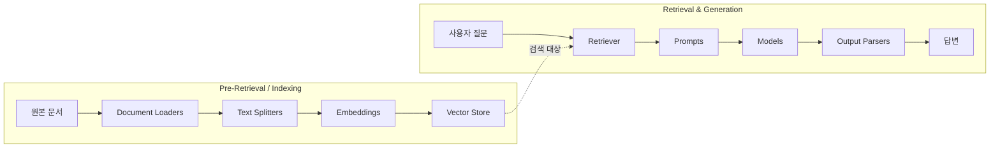
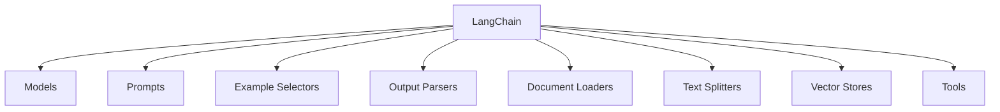
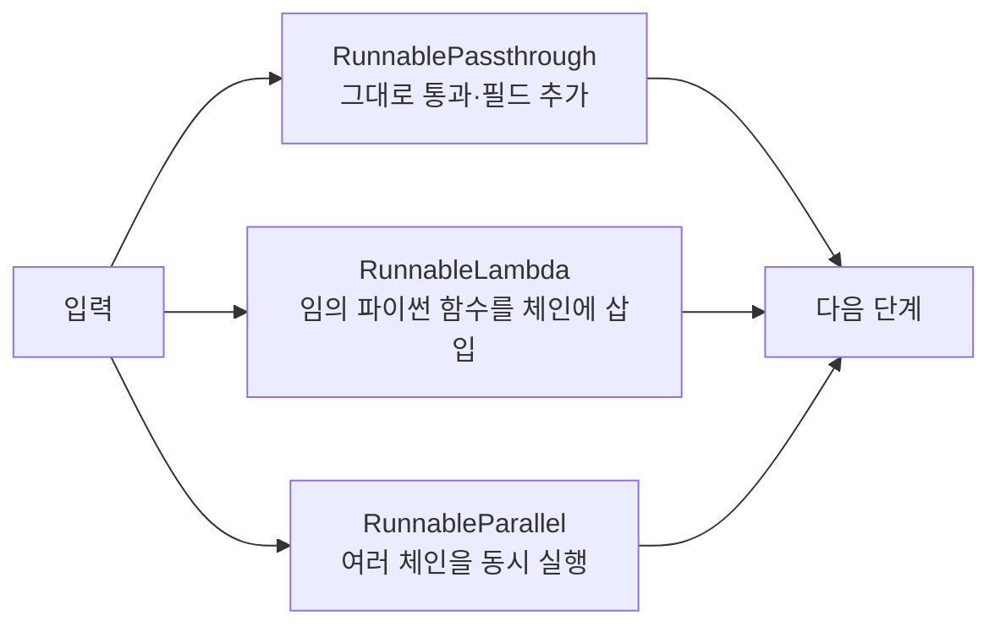

LangChain을 처음 볼 때 가장 헷갈리는 것은 "이게 왜 필요한가"다. OpenAI SDK를 직접 부르면 세 줄이면 되는데 왜 추상화 계층을 하나 더 얹느냐는 질문이다.

답은 **한 번 부를 때가 아니라 조립할 때** 드러난다. 프롬프트를 바꾸고, 모델을 갈아끼우고, 출력을 파싱하고, 검색 결과를 끼워 넣는 일이 반복되면 배선 코드가 본체보다 커진다. LangChain의 가치는 그 배선을 표준화하는 데 있고, 그 표준의 이름이 **Runnable**이다.

이 글은 LangChain의 구성요소 8종을 정리하고, Model·Prompt·Output Parser를 코드로 확인한 뒤, LCEL의 파이프 연산자가 왜 스트리밍·비동기·재시도까지 함께 주는지를 다룬다. [앞 시리즈](/blog/ai-agent/autogen-conversation-agents/)에서 CrewAI·AutoGen의 고수준 추상화가 어디서 부족해지는지를 봤다면, 여기서는 그 아래 계층으로 한 칸 내려가는 셈이다.

## 용어 정리

| 약어 | 원어 | 뜻 |
|---|---|---|
| LLM | Large Language Model | 대규모 언어모델 |
| RAG | Retrieval-Augmented Generation | 검색으로 찾은 외부 문서를 프롬프트에 붙여 답을 생성하는 기법 |
| LCEL | LangChain Expression Language | `\|` 파이프 연산자로 컴포넌트를 연결하는 LangChain 표현식 문법 |
| Runnable | — | LCEL로 연결 가능한 모든 객체의 공통 인터페이스. `invoke`/`stream`/`batch`를 갖는다 |
| Chunk | — | 긴 문서를 검색 단위로 자른 조각 |
| Embedding | — | 텍스트를 고정 길이 실수 벡터로 바꾼 표현 |
| Vector Store | — | 임베딩 벡터를 저장하고 유사도 검색을 지원하는 저장소 |
| Retriever | — | 질문을 받아 관련 문서를 돌려주는 검색기 인터페이스 |
| Pydantic | — | 파이썬 데이터 검증 라이브러리. 출력 스키마 정의에 쓰인다 |
| Few-shot | — | 프롬프트에 예시 몇 개를 넣어 원하는 형식·톤을 유도하는 기법 |

## 전체 그림 — 구성요소가 RAG의 어느 단계에 붙는가



구성요소를 하나씩 외우는 것보다 **각각이 어떤 문제 때문에 존재하는지**를 보는 편이 빠르다.

| 문제 | LangChain의 해법 | 담당 구성요소 |
|---|---|---|
| 모델마다 SDK가 달라 갈아타기 어렵다 | 공통 인터페이스로 추상화 | Models |
| 프롬프트를 문자열로 조립하면 관리가 안 된다 | 변수 슬롯을 가진 템플릿 객체 | Prompts |
| LLM 답이 자유 텍스트라 후속 처리가 안 된다 | 스키마를 강제하고 파싱 | Output Parsers |
| PDF·웹·Word마다 파싱 코드가 다르다 | 무엇을 읽든 `Document` 하나로 통일 | Document Loaders |
| 문서가 컨텍스트 창보다 길다 | 조각으로 나눔 | Text Splitters |
| 키워드가 안 겹치면 못 찾는다 | 의미를 벡터로 바꿔 유사도 검색 | Embeddings + Vector Stores |
| 이 조각들을 매번 손으로 이어붙여야 한다 | `\|` 로 연결 | Chain / LCEL |
| 모델이 모르는 사내 지식은 답을 못 한다 | 검색 결과를 프롬프트에 주입 | RAG 전체 |

> 한 줄로 줄이면 이렇다. **LangChain은 LLM 앱의 배관 자재 세트이고, LCEL은 그 자재를 잇는 파이프 렌치이며, RAG는 그 자재로 만드는 가장 흔한 배관 도면이다.**
>
> 그리고 이 도면의 한계 — **한 번 검색하고 끝난다** — 가 Agentic RAG와 LangGraph가 존재하는 이유다. 그 한계는 [다음 편](/blog/ai-agent/langchain-rag-pipeline/) 마지막에서 다룬다.

## LangChain 구성요소



| 구성요소 | 하는 일 | 대표 구현체 |
|---|---|---|
| **Models** | 다양한 LLM을 통합하고 상호작용. 여러 모델을 쉽게 전환·비교 | OpenAI, Google, Anthropic |
| **Prompts** | LLM 입력을 구조화·최적화. Few-shot 예시 제공, 동적 템플릿 생성·관리 | PromptTemplate, ChatPromptTemplate, Partial |
| **Example Selectors** | 상황에 맞는 Few-shot 예시를 골라 넣음 | Dynamic Example Selector |
| **Output Parsers** | AI 답변을 구조화된 형식으로 변환. 후속 처리·앱 통합 용이 | CSV, JSON, Pydantic … |
| **Document Loaders** | 여러 형태의 파일을 하나의 일관된 형식(`Document`)으로 불러옴 | PDF, PPTX, Word |
| **Text Splitters** | 주어진 Document를 여러 조각으로 나눔 | Recursive, HTML |
| **Vector Stores** | 텍스트를 벡터로 임베딩하여 저장 | Chroma, FAISS, Qdrant |
| **Retriever** | 쿼리를 벡터로 변환하여 유사 문서를 검색 | `vectorstore.as_retriever()` |
| **Tools** | 외부 기능 호출 | Web Search, SQL, Pandas |

도식은 여덟 갈래인데 표는 아홉 행이다. 차이는 **Retriever**다. 도식의 방사형 목록에는 없지만 실제 RAG 체인에서 Vector Store를 감싸는 인터페이스로 반드시 등장하므로 표에는 넣었다. 표에만 있는 "대표 구현체" 열도 마찬가지로 도식이 담지 못하는 정보다 — 개념을 아는 것과 무엇을 `import`할지 아는 것은 다르다.

> **Memory는 왜 이 목록에 없나.** LangChain에서 Memory는 "대화 히스토리를 다음 호출의 프롬프트에 자동으로 끼워 넣는 장치"인데, 최신 스택에서는 `RunnableWithMessageHistory`나 LangGraph의 State로 흡수되는 추세다.
>
> 아래 `ChatPromptTemplate` 예제에서 `("human", …)` / `("ai", …)` 쌍을 직접 넣는 방식이 나오는데, 그것이 **대화 히스토리 수동 주입**이다. 즉 **Memory는 그 수동 작업의 자동화**라고 이해하면 정확하다. 수동 히스토리 → Memory → LangGraph State가 이 개념의 이동 경로다.

### Output Parser 카탈로그

| 파서 | 하는 일 |
|---|---|
| **JSON** | JSON 객체 반환. Pydantic 모델을 지정하면 그 모델 형태의 JSON을 반환. 함수 호출(function calling)을 안 쓰고 구조화 데이터를 얻는 가장 신뢰할 만한 파서 |
| **XML** | 태그 사전 반환. XML 작성에 능숙한 모델(예: Anthropic)과 함께 사용 |
| **CSV** | 쉼표로 구분된 값의 목록을 반환 |
| **OutputFixing** | 다른 파서를 감싼다. 파싱 오류 시 오류 메시지와 잘못된 출력을 LLM에 보내 고쳐달라고 요청 |
| **Retry** | OutputFixing과 같지만 **원래 입력(원 명령)까지 함께** 보내 재시도. 그만큼 복구 성공률이 높다 |
| **Pydantic** | 사용자 정의 Pydantic 모델을 받아 해당 형식의 데이터 반환 |
| **YAML** | Pydantic과 같되 YAML로 인코딩 |
| **Pandas DataFrame** | DataFrame 작업 시 유용 |
| **Enum** | 응답을 제공된 열거형 값 중 하나로 파싱 |
| **Datetime** | 응답을 날짜/시간 문자열로 파싱 |
| **Structured** | 구조화된 정보를 반환. **필드가 문자열만 허용**되어 다른 파서보다 덜 강력하지만, 소규모 LLM에 유용 |

> 열한 개 중 성격이 다른 둘이 **OutputFixing**과 **Retry**다. 나머지 아홉이 "무슨 형식으로 받을까"라면 이 둘은 "실패했을 때 어떻게 할까"다.
>
> 차이는 한 가지 — **원래 명령을 다시 보내느냐**다. OutputFixing은 잘못된 출력만 고쳐 달라 하고, Retry는 원 명령까지 함께 보내 다시 시키므로 복구 성공률이 높다. 파서 실패가 곧 장애인 서비스라면 이 래핑 파서의 유무가 가용성 설계 그 자체다.

## Model · Prompt · Output Parser

### Model — 원본 SDK와 무엇이 다른가

```python
# (A) OpenAI 원본 SDK — 응답이 ChatCompletion 객체, OpenAI 전용 구조
from openai import OpenAI
client = OpenAI()
client.chat.completions.create(
    model="gpt-3.5-turbo",
    messages=[{"role": "user", "content": "2002년 월드컵 4강 국가 알려줘"}],
)

# (B) LangChain — 벤더에 무관한 공통 인터페이스. 응답은 AIMessage
from langchain_openai import ChatOpenAI
chat = ChatOpenAI(model_name="gpt-4o-mini")
chat.invoke("안녕~ 너를 소개해줄래?")
# -> AIMessage(content='...', response_metadata={'token_usage': {...}}, usage_metadata={...})
```

핵심 차이는 **반환 타입**이다. LangChain은 어떤 벤더를 쓰든 `AIMessage`로 통일하고, 토큰 사용량을 `usage_metadata`에 표준 필드로 담는다.

> 그래서 모델을 바꿔도 하류 코드(파서·체인)를 고칠 필요가 없다. 이것이 "여러 모델을 쉽게 전환·비교"의 실체다.
>
> 단 여기서 줄어드는 것은 **코드 교체 비용**이지 품질 검증 비용이 아니다. 인터페이스는 같아도 **프롬프트는 모델마다 다시 튜닝**해야 한다. 이 구분을 놓치면 "LangChain 쓰면 모델 교체가 자유롭다"를 과신하게 된다.

### Prompt — 두 가지 템플릿

```python
from langchain.prompts import PromptTemplate

# PromptTemplate: 단일 문자열 프롬프트. {중괄호}가 곧 입력 변수가 된다
prompt = PromptTemplate.from_template(
    """
    너는 요리사야. 내가 가진 재료들을 갖고 만들 수 있는 요리를 {개수}추천하고,
    그 요리의 레시피를 제시해줘. 내가 가진 재료는 아래와 같아.
    <재료>
    {재료}
    """
)
prompt.invoke({"개수": 6, "재료": "사과, 잼"})   # -> StringPromptValue
```

```python
from langchain_core.prompts import ChatPromptTemplate

# ChatPromptTemplate: 역할(role)이 있는 메시지 리스트. 챗 모델의 네이티브 형식
chat_template = ChatPromptTemplate.from_messages([
    ("system", "You are a helpful AI bot. Your name is {name}."),  # 역할·이름 부여
    ("human",  "Hello, how are you doing?"),   # 여기 human/ai 쌍이
    ("ai",     "I'm doing well, thanks!"),     # 곧 '대화 히스토리 수동 주입'이다
    ("human",  "{user_input}"),                # 실제 사용자 입력
])
chat_template.format_messages(name="Bob", user_input="What is your name?")
# -> [SystemMessage(...), HumanMessage(...), AIMessage(...), HumanMessage(...)]
```

| 구분 | PromptTemplate | ChatPromptTemplate |
|---|---|---|
| 산출물 | 문자열 하나 | 메시지 리스트 |
| 역할 구분 | 없음 | system / human / ai |
| Few-shot 주입 | 문자열에 직접 써넣음 | `("human"/"ai")` 쌍으로 자연스럽게 |
| 적합 대상 | 완성형(completion) 모델 | 챗 모델 — 현대 LLM 대부분 |

현대 LLM은 대부분 챗 모델이므로 실무 기본값은 `ChatPromptTemplate`이다. 그리고 위 코드의 `("human"/"ai")` 쌍이 Few-shot 예시로도, 대화 히스토리로도 쓰인다는 점이 중요하다 — **둘은 모델 입장에서 같은 것**이다.

### Output Parser — 형식 지시문이 핵심이다

```python
from langchain.output_parsers import CommaSeparatedListOutputParser
from langchain.prompts import PromptTemplate

output_parser = CommaSeparatedListOutputParser()

# 파서가 스스로 '이렇게 답하라'는 지시문을 만들어 준다
format_instructions = output_parser.get_format_instructions()
# -> 'Your response should be a list of comma separated values, eg: `foo, bar, baz`'

# partial_variables로 그 지시문을 프롬프트에 미리 고정 주입
prompt = PromptTemplate(
    template="List {subject}. answer in Korean \n{format_instructions}",
    input_variables=["subject"],
    partial_variables={"format_instructions": format_instructions},
)

chain = prompt | model | output_parser
chain.invoke({"subject": "공포 영화"})
# -> ['겟 아웃', '더 링', '콘저링', '할로윈', ...]   문자열이 아니라 파이썬 list
```

```python
from langchain_core.output_parsers import JsonOutputParser
from langchain_core.pydantic_v1 import BaseModel, Field

# 원하는 스키마를 Pydantic으로 선언
class Country(BaseModel):
    continent: str = Field(description="사용자가 물어본 나라가 속한 대륙")
    population: str = Field(description="사용자가 물어본 나라의 인구(int 형식)")

parser = JsonOutputParser(pydantic_object=Country)   # Field description이 지시문에 그대로 들어간다

prompt = PromptTemplate(
    template="Answer the user query.\n{format_instructions}\n{query}\n",
    input_variables=["query"],
    partial_variables={"format_instructions": parser.get_format_instructions()},
)

chain = prompt | model | parser
chain.invoke({"query": "아르헨티나는 어떤 나라야?"})
# -> {'continent': '남아메리카', 'population': '약 45,376,763'}
```

> **가장 자주 놓치는 지점이 여기다.** Output Parser는 마법이 아니라 **(1) 형식 지시문을 프롬프트에 넣고 (2) 돌아온 문자열을 파싱하는** 2단 구조다. `get_format_instructions()`를 프롬프트에 안 넣으면 모델은 아무 형식이나 뱉고 파서는 그대로 터진다.
>
> 그리고 `Field(description=...)`에 쓴 한글 설명이 그대로 지시문에 실려 모델에게 전달된다. 즉 **스키마의 description이 곧 프롬프트 엔지니어링**이다. 타입 선언인 줄 알았던 것이 실은 프롬프트의 일부다.

파서를 쓰기 전과 후의 출력이 실제로 어떻게 달라지는지는 [출력파서 사용 전후 비교](/blog/rag/rag-pipeline-generation/)에 예시로 정리돼 있다.

## Chain과 LCEL

Chain이란 **여러 구성요소를 하나로 묶어 원하는 결과물을 짧은 코드로 구현 가능하게 만드는 도구**다. 초기 LangChain은 이것을 클래스 생성자로 표현했다.

```python
# 구식(레거시) — 클래스 생성자에 인자로 밀어넣는 방식
chain = LLMChain(prompt=prompt, llm=model, output_parser=output_parser)
result = chain.run(topic="Artificial Intelligence")
```

### LCEL — 파이프 연산자

```python
from langchain_core.output_parsers import StrOutputParser
from langchain_core.prompts import ChatPromptTemplate
from langchain_openai import ChatOpenAI

prompt = ChatPromptTemplate.from_template("tell me a short joke about {topic}")
model  = ChatOpenAI(model="gpt-4o-mini")

# 프롬프트 -> 모델 -> 파서를 '|' 로 잇는다. 왼쪽의 출력이 오른쪽의 입력이 된다
chain = prompt | model | StrOutputParser()

chain.invoke({"topic": "ice cream"})
# -> 'Why did the ice cream truck break down? Because it had a rocky road!'
```

| 비교 축 | No LCEL (`LLMChain`) | With LCEL (`\|`) |
|---|---|---|
| 연결 방식 | 생성자 인자 | 파이프 연산자 |
| 데이터 흐름 | 코드만 봐선 안 보임 | 왼쪽→오른쪽으로 눈에 보임 |
| 실행 | `.run()` | `.invoke()` / `.stream()` / `.batch()` |
| 부분 교체 | 클래스 통째로 수정 | 파이프 한 칸만 갈아끼움 |

네 행 중 마지막이 실무에서 가장 크게 체감된다. **검색기만 바꾸고 나머지를 그대로 두는 A/B 비교**가 파이프 한 칸 교체로 끝난다.

### LCEL이 공짜로 주는 것 여덟 가지

| 기능 | 의미 |
|---|---|
| 스트리밍 지원 | `.stream()`으로 토큰 단위 출력 |
| 비동기 지원 | `.ainvoke()` 등 async 인터페이스 자동 제공 |
| 병렬 실행 | 독립 분기를 동시에 실행 |
| 재시도 및 폴백 | `.with_retry()` / `.with_fallbacks()` |
| 중간 과정 확인 | 체인 내부 단계별 입출력 관찰 |
| 입출력 스키마 | 각 단계의 타입이 자동 정의됨 |
| LangSmith 추적 | 실행 트레이스 자동 수집 |
| LangServe 배포 | 체인을 그대로 REST API로 노출 |

```python
# 스트리밍은 체인을 바꾸지 않는다. 호출 함수만 stream()으로 바꾸면 된다
chain = prompt | model
for s in chain.stream({"topic": "bears"}):
    print(s.content, end="", flush=True)
```

체인 정의는 그대로 두고 호출 메서드만 바꾼다는 점이 핵심이다. 스트리밍을 붙이려고 체인을 다시 짜지 않는다.

### 왜 `|` 만으로 이 모든 것이 되나

LangChain의 모든 구성요소가 `Runnable`이라는 하나의 인터페이스를 구현하기 때문이다. `Runnable.__or__`가 오버로드돼 있어 `a | b`는 `RunnableSequence([a, b])`를 만들고, **이 시퀀스가 다시 `Runnable`이라 또 이어붙일 수 있다.**

> 즉 LCEL은 문법 설탕이 아니라 **합성(composition)이 닫혀 있는 대수 구조**다. `Runnable`끼리 합성한 결과가 또 `Runnable`이라는 성질 하나가 전부를 지탱한다.
>
> 스트리밍·비동기·재시도가 "공짜"인 이유도 여기서 나온다. 시퀀스가 자기 멤버들의 그 메서드를 위임 호출하기만 하면 되기 때문이다. **인터페이스를 하나로 좁힌 대가로 얻은 것**이지, 기능을 여덟 개 구현해서 얻은 것이 아니다.

## Runnable 3형제 — 체인의 배선 도구

파이프로 잇다 보면 "입력 모양이 안 맞는" 문제가 생긴다. 그것을 푸는 세 도구다.



### RunnablePassthrough — 입력을 그대로 흘린다

```python
from langchain_core.runnables import RunnablePassthrough

RunnablePassthrough().invoke("안녕하세요")     # -> '안녕하세요'

# 용도 1: 프롬프트 변수 이름에 입력을 매핑
runnable_chain = {"sentence": RunnablePassthrough()} | prompt | model | output_parser
runnable_chain.invoke({"sentence": "그녀는 매일 아침 책을 읽습니다."})
# -> 'Elle lit un livre chaque matin.'

# 용도 2: assign — 기존 딕셔너리를 유지한 채 필드를 '추가'
RunnablePassthrough.assign(mult=lambda x: x["num"] * 3).invoke({"num": 3})
# -> {'num': 3, 'mult': 9}     원본 num이 살아 있다는 게 포인트
```

`.assign()`이 원본 키를 유지한다는 점이 두 용도를 가른다. 그냥 `RunnablePassthrough()`는 값을 흘리고, `.assign()`은 **값을 흘리면서 계산 결과를 덧붙인다.**

### RunnableLambda — 아무 함수나 체인에 끼운다

```python
from langchain_core.runnables import RunnableLambda

def add_thank(x):
    return x + " 들어주셔서 감사합니다 :)"

add_thank = RunnableLambda(add_thank)   # 평범한 함수를 Runnable로 승격

chain = prompt | model | output_parser | add_thank
chain.invoke("반도체")
# -> '반도체의 역사는 ... 지속적으로 발전하고 있습니다. 들어주셔서 감사합니다 :)'
```

> `RunnableLambda`의 존재가 이 설계의 개방성을 보여준다. **LangChain이 제공하지 않는 처리는 전부 이 문으로 들어온다.** 후처리·정제·포맷 변환 어느 것이든 평범한 파이썬 함수로 쓰고 승격시키면 체인의 일부가 된다.

### RunnableParallel — 분기를 동시에 굴린다

```python
from langchain_core.runnables import RunnableParallel

history_chain = ChatPromptTemplate.from_template("{topic}가 무엇의 약자인지 알려주세요.") | model | output_parser
celeb_chain   = ChatPromptTemplate.from_template("{topic} 분야의 유명인사 3명의 이름만 알려주세요.") | model | output_parser

# 두 체인이 같은 입력을 받아 병렬로 실행되고, 결과가 키별로 묶여 나온다
map_chain = RunnableParallel(history=history_chain, celeb=celeb_chain)
map_chain.invoke({"topic": "AI"})
# -> {'history': 'AI는 "Artificial Intelligence"의 약자로 ...',
#     'celeb':   '1. 앨런 튜링\n2. 제프리 힌튼\n3. 얀 르쿤'}
```

> **RAG에서 이것이 왜 중요한가.** 다음 편에 나올 RAG 체인의 첫 줄 `{"context": retriever | format_docs, "question": RunnablePassthrough()}`가 바로 **딕셔너리 리터럴로 표현된 RunnableParallel**이다.
>
> 질문을 검색기로도 보내고(context) 그대로도 보내는(question) 분기를 한 줄로 표현한 것이다. **이 한 줄을 읽어내면 RAG 체인 전체가 읽힌다.**

---

여기까지가 자재와 렌치다. 다음은 도면 — 이 부품들로 실제 RAG 파이프라인을 조립하는 단계다. [다음 편](/blog/ai-agent/langchain-rag-pipeline/)에서 Load·Split·Embed·Store·Generate를 코드와 실측값으로 따라가고, 마지막에 이 직선 파이프라인이 왜 부족한지를 여섯 가지 한계로 정리한다.
