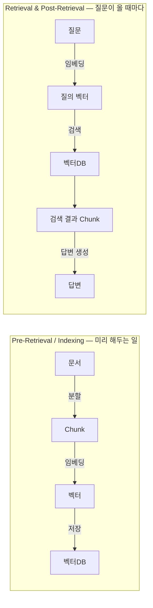
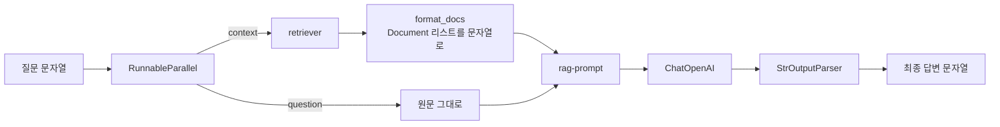
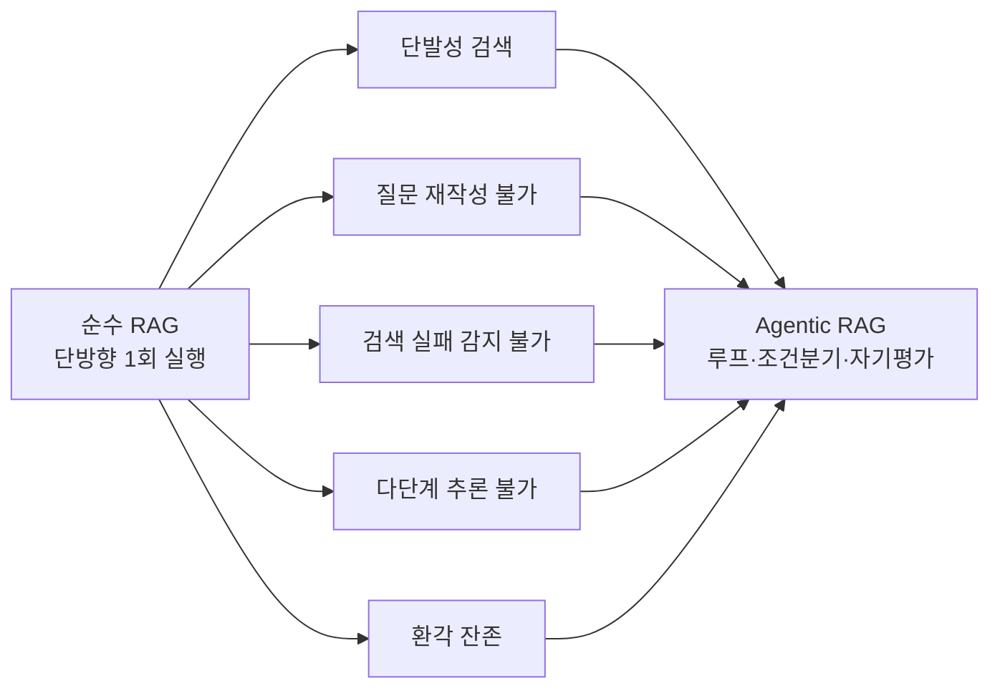

`chunk_size=500`을 주면 청크가 500자로 나온다고 생각하기 쉽다. 실제로 논문 PDF 한 편을 `CharacterTextSplitter`로 자르면 **2,191자에서 6,130자짜리 청크**가 나온다. 파라미터를 줬다고 지켜지는 것이 아니다.

이 글은 그런 지점들을 코드와 실측값으로 확인하며 RAG 파이프라인을 조립한다. Load → Split → Embed → Store → Generate를 따라가고, 마지막에 이 직선 파이프라인이 왜 부족한지를 여섯 가지 한계로 정리한다. [앞 편](/blog/ai-agent/langchain-core-components/)에서 본 구성요소와 LCEL이 여기서 실제 도면이 된다.

## 용어 정리

앞 편의 용어에 이 편이 쓰는 것을 더했다.

| 약어 | 원어 | 뜻 |
|---|---|---|
| Chunk | — | 긴 문서를 검색 단위로 자른 조각 |
| Embedding | — | 텍스트를 고정 길이 실수 벡터로 바꾼 표현. 의미가 가까우면 벡터도 가깝다 |
| Vector Store | — | 임베딩 벡터를 저장하고 유사도 검색을 지원하는 저장소 |
| Retriever | — | 질문을 받아 관련 문서를 돌려주는 검색기 인터페이스 |
| FAISS | Facebook AI Similarity Search | 메타가 만든 로컬 벡터 인덱스 라이브러리 |
| ANN | Approximate Nearest Neighbor | 근사 최근접 이웃 탐색. 정확도를 조금 포기하고 속도를 얻는 검색 방식 |
| MIPS | Maximum Inner Product Search | 내적 최대화 검색. 밀집 벡터 검색의 수학적 형태 |
| Parametric memory | — | 모델 가중치 안에 녹아든 지식. 수정·갱신이 어렵다 |
| Non-parametric memory | — | 모델 밖 외부 저장소의 지식. RAG가 쓰는 쪽. 갱신·출처 추적이 가능 |
| Hallucination | — | 모델이 근거 없는 내용을 사실처럼 말하는 현상 |

## 두 국면 — 미리 하는 일과 매번 하는 일



도식은 **데이터가 어떤 형태로 변해 가는지**를 보여준다. 문서가 Chunk가 되고, Chunk가 벡터가 되고, 벡터가 벡터DB에 앉는다. 같은 파이프라인을 "무엇을 하는가"의 관점에서 여덟 단계로 펼친 것이 [RAG 파이프라인 8단계](/blog/rag/rag-pipeline-ingestion/)이고, 단계별 선택지와 실패 모드는 그쪽에 정리돼 있다.

여기서 필요한 것은 하나 더 있다. **각 단계에 LangChain의 어느 구성요소가 붙는가**다.

| 국면 | 단계 | LangChain 구성요소 | 실행 시점 |
|---|---|---|---|
| Pre-Retrieval | Load | Document Loaders | 배치 — 문서가 추가·변경될 때 |
| Pre-Retrieval | Split | Text Splitters | 배치 |
| Pre-Retrieval | Embed | Embeddings | 배치 |
| Pre-Retrieval | Store | Vector Stores | 배치 |
| Retrieval | Retrieve | Retriever | 온라인 — 요청마다 |
| Post-Retrieval | Generate | Prompts → Models → Output Parsers | 온라인 |

> 이 표가 무기인 이유는 **비용과 지연이 어디서 갈리는지**를 보여주기 때문이다. 임베딩 비용은 문서 수에 비례해 **한 번** 나가고, 검색·생성 비용은 트래픽에 비례해 **계속** 나간다.
>
> RAG를 "검색해서 붙이는 것"이라고만 설명하면 이 선이 안 보인다. 임베딩 모델을 바꾸는 결정과 top-k를 바꾸는 결정은 비용 구조가 완전히 다른 결정이다.

## Load — Document Loaders

```python
from langchain_community.document_loaders import PyPDFLoader

loader = PyPDFLoader("data/Retrieval-Augmented Generation for Knowledge-Intensive NLP Tasks.pdf")
pages = loader.load_and_split()      # 페이지 단위로 Document 리스트 생성

pages[0]
# -> Document(metadata={'source': '...pdf', 'page': 0}, page_content='Retrieval-Augmented ...')
```

모든 로더의 산출물은 동일하게 **`Document(page_content, metadata)`**다. `metadata`에 `source`와 `page`가 들어가는데, 이것이 나중에 **출처 표기(citation)**의 근거가 된다.

| 메서드 | 동작 |
|---|---|
| `.load()` | 문서 전체를 그대로 로드 |
| `.load_and_split()` | 로드하면서 기본 분할까지 수행 |

### 웹 로더 — 필요한 영역만 긁는다

```python
import bs4
from langchain_community.document_loaders import WebBaseLoader

# 그냥 로드하면 헤더·푸터·광고까지 통째로 들어온다
loader = WebBaseLoader("https://www.espn.com/")

# bs4 SoupStrainer로 원하는 CSS 클래스만 파싱 -> 노이즈 제거
loader = WebBaseLoader(
    "https://www.espn.com/",
    bs_kwargs=dict(parse_only=bs4.SoupStrainer(class_=("headlineStack top-headlines"))),
)
loader.requests_kwargs = {"verify": False}   # SSL 검증 우회 (로컬 확인용. 운영에서는 쓰지 말 것)
data = loader.load()
```

필터 없이 로드한 스포츠 뉴스 페이지에는 메뉴·"Skip to main content"·푸터 링크가 본문과 뒤섞여 들어온다. **이 쓰레기가 그대로 청킹·임베딩되면 검색 결과에 계속 딸려 나온다.**

> **RAG 품질의 절반은 검색 알고리즘이 아니라 로더 단계의 정제에서 결정된다.** "RAG 정확도를 어떻게 올리나"라는 질문에 리랭커부터 답하는 것은 순서가 틀렸다.
>
> 리랭커는 검색된 후보를 재정렬하는 장치라, 애초에 색인에 들어간 노이즈는 재정렬로 사라지지 않는다. **색인에 들어가지 말았어야 할 것은 색인 이전에 막는 편이 압도적으로 싸다.**

## Split — 청킹 전략

### 같은 `chunk_size=500`, 완전히 다른 결과

```python
from langchain_text_splitters import CharacterTextSplitter

text_splitter = CharacterTextSplitter(
    # separator="\n",        # 주석 처리됨 -> 기본 구분자 "\n\n" 사용
    chunk_size=500,
    chunk_overlap=100,
    length_function=len,
)
texts = text_splitter.split_documents(pages)
print([len(i.page_content) for i in texts])
# -> [2191, 5185, 4423, 3625, 5008, 3526, 3075, 4740, ... 6130 ...]   500을 한참 초과!
```

```python
from langchain_text_splitters import RecursiveCharacterTextSplitter

text_splitter = RecursiveCharacterTextSplitter(
    chunk_size=500,
    chunk_overlap=100,
    length_function=len,
    is_separator_regex=False,
)
texts = text_splitter.split_documents(pages)
print([len(i.page_content) for i in texts])
# -> [441, 439, 498, 420, 473, 275, 406, ... 44, ... 499]   전부 500 이하
```

| 스플리터 | chunk_size | 실측 청크 길이 | 청크 개수 |
|---|---|---|---|
| `CharacterTextSplitter` | 500 | **2,191 ~ 6,130자** | 43개 |
| `RecursiveCharacterTextSplitter` | 500 | **44 ~ 499자** | 400개 이상 |

**왜 이런 일이 벌어지나.** `CharacterTextSplitter`는 **구분자 하나**(기본 `"\n\n"`)로만 자른다. 논문 PDF는 문단 사이 빈 줄이 드물어 구분자가 거의 안 나타나고, 그러면 자를 자리가 없어 `chunk_size`를 초과한 덩어리가 그대로 남는다.

`RecursiveCharacterTextSplitter`는 구분자 목록 `["\n\n", "\n", " ", ""]`을 **위에서부터 재귀적으로** 시도한다. 문단으로 안 되면 줄, 줄로 안 되면 공백, 그래도 안 되면 글자 단위로 쪼갠다. 그래서 항상 상한을 지킨다.

> **`chunk_size`는 상한이 아니라 목표치다.** 구분자가 없으면 지켜지지 않는다.
>
> 그래서 특별한 이유가 없으면 `RecursiveCharacterTextSplitter`가 기본값이고, **청킹 결과는 반드시 길이 분포를 찍어서 눈으로 확인해야 한다.** 이 실측이 주는 교훈은 스플리터 선택이 아니라 검증 습관 쪽이다.

### `chunk_overlap`은 왜 필요한가

경계에서 문장이 잘리면 그 문장이 담고 있던 의미가 두 청크 어디에도 온전히 남지 않는다. 앞 청크의 끝 N자를 다음 청크 앞에 겹쳐 넣어(overlap) 경계 손실을 완화한다. 위 실습값은 `chunk_size=500, chunk_overlap=100` — **20% 겹침**이다.

### 청크 크기 선택 기준

| 청크 크기 | 장점 | 단점 | 적합한 경우 |
|---|---|---|---|
| 작다 (200~400) | 검색 정밀도↑, 노이즈↓ | 문맥이 잘려 답변이 파편화 | FAQ, 매뉴얼 항목, 정의형 질문 |
| 중간 (500~1,000) | 균형 | — | 대부분의 문서 QA — 기본 출발점 |
| 크다 (1,500~) | 문맥 풍부, 추론형 질문에 유리 | 한 청크에 여러 주제가 섞여 검색 정밀도↓, 토큰 비용↑ | 서사형 문서, 계약서 조항 |

> **결정 규칙**: "이 질문에 답하는 데 필요한 최소 문맥 단위"가 청크 하나에 들어가야 한다. 사규 QA라면 조항 하나, 기술 문서라면 소단원 하나가 기준이다.
>
> **글자 수부터 정하지 말고 문서의 자연스러운 의미 단위부터 정하는 것이 순서다.** 500이라는 숫자는 그 단위를 재고 나서 나오는 결과지 출발점이 아니다.

## Embed — 임베딩

```python
from langchain_openai import OpenAIEmbeddings

embeddings_model = OpenAIEmbeddings(model="text-embedding-3-small")

embeddings = embeddings_model.embed_documents([
    "Hi there!", "Oh, hello!", "What's your name?",
    "My friends call me World", "Hello World!",
])
len(embeddings), len(embeddings[0])
# -> (5, 1536)      문장 5개 -> 각 1536차원 벡터

print(embeddings[0][:10])
# -> [-0.0191, -0.0381, -0.0309, -0.0046, -0.0354, ...]   그냥 실수 배열이다
```

```python
# 실제 파이프라인: PDF 로드 -> 재귀 분할 -> 전체 청크를 한 번에 임베딩
loader = PyPDFLoader("data/autogen_paper.pdf")
pages = loader.load()

text_splitter = RecursiveCharacterTextSplitter(chunk_size=500, chunk_overlap=100)
texts = text_splitter.split_documents(pages)

embeddings = embeddings_model.embed_documents([i.page_content for i in texts])
len(embeddings), len(embeddings[0])
# -> (412, 1536)    AutoGen 논문 1편이 청크 412개 = 벡터 412개가 됐다
```

실측값 둘을 남겨 둔다. `text-embedding-3-small`은 **1,536차원**이고, AutoGen 논문 PDF 1편은 `chunk_size=500` 재귀 분할 기준 **412청크**가 된다. 다만 이 숫자는 **논문 PDF 한 편**이라는 특정 문서에 대한 값이라, 문서 종류가 바뀌면 분포도 바뀐다.

| 메서드 | 용도 |
|---|---|
| `embed_documents(list)` | 문서 청크 여러 개를 한 번에 (인덱싱 시) |
| `embed_query(str)` | 질문 하나를 (검색 시) |

> **두 메서드가 나뉜 이유**가 인터페이스 설계의 좋은 예다. 모델에 따라 문서용과 질의용 프리픽스(`passage:` / `query:` 등)를 다르게 붙여야 성능이 나오기 때문이다.
>
> OpenAI 모델은 양쪽을 동일하게 처리하지만, **인터페이스가 미리 나뉘어 있는 덕분에 그렇지 않은 모델로 갈아탈 때 호출부 코드를 안 고쳐도 된다.** 지금 필요 없는 구분을 미리 그어 두는 것이 나중에 값을 하는 드문 경우다.

임베딩 모델을 무엇으로 고를지의 기준(언어·차원·비용·입력 길이·보안)은 [임베딩 단계](/blog/rag/rag-pipeline-retrieval/)에 정리돼 있다. 여기서 한 가지만 못 박아 두면, **모델을 바꾸면 기존 벡터 전량을 다시 만들어야 한다.** 질문과 문서가 같은 벡터 공간에 있어야 유사도가 의미를 갖기 때문에 부분 교체가 성립하지 않는다. 임베딩 모델 선택은 사실상 되돌리기 어려운 결정이다.

## Store & Retrieve — 벡터스토어와 Retriever

```python
from langchain.vectorstores import FAISS

# 청크 + 임베딩 모델을 넘기면 임베딩 생성부터 인덱싱까지 한 번에 처리
db = FAISS.from_documents(texts, embeddings_model)

retriever = db.as_retriever()      # 벡터스토어를 Retriever 인터페이스로 감싼다

query = "What is autogen"
retriever.invoke(query)            # 질문을 임베딩 -> 유사 청크 상위 k개 반환 (기본 k=4)
```

`as_retriever()`가 중요한 이유는 **인터페이스 분리**다. Retriever는 "질문을 주면 Document 리스트를 준다"만 약속하므로, 뒤에서 FAISS를 Chroma로 바꾸든 Elasticsearch로 바꾸든 체인 코드는 그대로다.

### 벡터스토어 선택

| 저장소 | 성격 | 적합한 상황 |
|---|---|---|
| **FAISS** | 라이브러리(서버 아님). 인메모리 인덱스, 파일로 저장/로드 | 실습·PoC, 단일 프로세스, 문서량이 메모리에 들어올 때 |
| **Chroma** | 임베디드 DB. 로컬 영속화가 쉬움 | 소규모 서비스, 로컬 개발 |
| **Qdrant / Weaviate / Milvus** | 전용 벡터 DB 서버 | 대규모, 필터링·샤딩·고가용성 필요 |
| **pgvector** | PostgreSQL 확장 | **이미 Postgres를 쓰고 있고, 벡터와 관계형 데이터를 한 트랜잭션으로 묶고 싶을 때** |
| **Elasticsearch / OpenSearch** | 검색엔진 + 밀집 벡터 | 기존 키워드 검색 자산이 있고 **하이브리드 검색**으로 가고 싶을 때 |

**선택의 실질적 기준은 성능이 아니라 운영이다.** 네 가지를 순서대로 확인한다.

| # | 질문 | 왜 |
|---|---|---|
| 1 | 이미 운영 중인 DB에 얹을 수 있는가 | 신규 저장소 = 신규 장애 지점 + 신규 백업 대상 |
| 2 | 메타데이터 필터링이 필요한가 | 부서별·기간별 권한 분리가 여기서 갈린다 |
| 3 | 실시간 갱신이 필요한가, 배치 재색인으로 충분한가 | 갱신 주기가 저장소 선택을 좁힌다 |
| 4 | 키워드 검색과 섞어야 하는가 | 사번·상품코드 같은 정확 일치는 벡터 검색이 약하다 |

### 메타데이터 필터 — 권한이 걸리는 자리

Retriever의 `k`·`search_type`·`score_threshold` 같은 튜닝 파라미터는 [검색기 단계](/blog/rag/rag-pipeline-retrieval/)에 표로 정리돼 있다. 여기서 따로 짚을 것은 하나다.

```python
retriever = db.as_retriever(search_kwargs={"filter": {"department": "finance"}})
```

> `search_kwargs`의 **메타데이터 필터**는 품질 파라미터가 아니라 **접근 제어 지점**이다. 부서·기간·문서종류로 검색 범위를 좁히는 것이 사내 RAG에서 권한을 거는 실질적 위치다.
>
> 이것이 앞의 벡터스토어 선택 기준 2번과 직결된다. 메타데이터 필터가 약한 저장소를 고르면, 권한 분리를 애플리케이션 코드로 올려야 하고 그 순간 검색 결과를 받아 놓고 버리는 구조가 된다.

## Generate — RAG 체인

검색기까지 준비되면 남은 것은 조립이다. 체인 골격 자체는 [RAG 체인 조립과 문서 포맷터](/blog/rag/rag-pipeline-generation/)에 코드로 정리돼 있으므로 여기서는 **각 조각이 없으면 무슨 일이 생기는지**만 본다.



| 코드 조각 | 역할 | 없으면 생기는 일 |
|---|---|---|
| `{"context": ..., "question": ...}` | 질문을 두 갈래로 분기 | 프롬프트 변수 하나가 비어 에러 |
| `retriever \| format_docs` | 검색 후 문자열화 | 프롬프트에 객체가 그대로 들어가 깨짐 |
| `hub.pull("rlm/rag-prompt")` | "주어진 문맥만 근거로 답하라"는 검증된 지시문 | 모델이 문맥을 무시하고 제 지식으로 답함 |
| `StrOutputParser()` | AIMessage → str | 하류에서 `.content`를 매번 벗겨야 함 |

세 번째 행의 `hub.pull("rlm/rag-prompt")`가 눈여겨볼 부분이다. RAG 프롬프트를 직접 쓰지 않고 LangChain Hub에서 검증된 것을 가져온다. `context`·`question` 슬롯을 가진 규격이라 그대로 파이프에 꽂힌다.

> **`format_docs`가 사실 가장 손댈 데가 많은 함수다.** 여기서 `doc.metadata['source']`와 `page`를 같이 붙이면 답변에 출처를 달 수 있고, 청크 순서를 재정렬하면 그것이 곧 리랭킹이다.
>
> 기본형은 `"\n\n".join(...)` 한 줄이지만, **출처 표기와 재정렬이 들어가는 자리가 전부 이 함수 안**이다. 로더 단계에서 챙긴 `metadata`가 여기서 값을 한다.

### 노트북 포맷과 시크릿

RAG 실습이 대부분 노트북에서 이뤄지다 보니 반복적으로 나오는 사고가 하나 있다. **API 키가 첫 셀에 평문으로 남은 채 공유되는 것**이다.

| 문제 | 올바른 방식 |
|---|---|
| 노트북에 키를 직접 문자열로 | `.env` + `python-dotenv`, 또는 실행 환경의 환경변수 |
| 노트북을 그대로 커밋 | `.gitignore` + 커밋 훅으로 시크릿 스캔 |
| 출력 셀에 키가 남음 | 커밋 전 `nbstripout`으로 출력 제거 |

> 노트북은 **코드와 실행 결과가 한 파일에 붙어 있는** 포맷이다. 그래서 시크릿뿐 아니라 고객 데이터·사내 문서 원문이 출력 셀에 함께 남아 유출된다.
>
> AI 실습 코드를 팀에 전파할 때 별도 게이트가 필요한 이유가 여기 있다. 일반 소스 코드용 시크릿 스캔만으로는 **출력 셀**을 못 잡는다.

## 순수 RAG의 한계

지금까지 만든 체인은 **직선 파이프라인**이다. 질문이 들어오면 한 번 검색하고, 한 번 생성하고, 끝난다.



| 한계 | 무슨 일이 벌어지나 | Agentic RAG의 대응 |
|---|---|---|
| **단발성 검색** | 첫 검색이 빗나가면 그걸로 끝. 재시도 경로가 없다 | 검색 결과를 평가하고 **다시 검색**하는 루프 |
| **질문 재작성 불가** | 사용자 표현("그거 얼마였죠")이 문서 표현("연간 구독료")과 안 겹치면 못 찾는다 | LLM이 질문을 검색용으로 **재작성(query rewriting)** 후 검색 |
| **검색 실패를 모른다** | 엉뚱한 청크가 와도 체인은 그걸 문맥이라 믿고 답을 만든다 | 문서 관련성을 **채점(grading)** 하고, 미달이면 다른 경로로 |
| **다단계 질문 불가** | "A와 B를 비교해줘"는 검색 2회가 필요한데 1회만 한다 | 질문을 **분해**해 순차/병렬 검색 |
| **환각 잔존** | 문맥에 없는 내용을 그럴듯하게 덧붙인다 | 생성 답변이 문맥에 근거하는지 **자기검증** 후 재생성 |
| **도구 사용 불가** | 검색만 가능. 계산·API 호출·DB 조회는 못 한다 | Tool 호출을 포함한 **행동 선택** |

도식은 다섯 갈래인데 표는 여섯 행이다. 표에만 있는 것이 **도구 사용 불가**다. 앞의 다섯은 전부 "검색을 더 잘하면 되는" 문제라 한 묶음이지만, 여섯 번째는 성격이 다르다 — **계산이 필요한 질문은 검색을 아무리 잘해도 안 풀린다.** 이 한 행이 RAG와 에이전트를 가르는 자리다. 표의 "Agentic RAG의 대응" 열도 도식이 담지 못하는 정보다. 한계를 아는 것과 그 한계를 무엇으로 푸는지 아는 것은 다르다.

**구조적으로 말하면** 순수 RAG는 **DAG(비순환 그래프)**이고, Agentic RAG는 **사이클이 있는 그래프**다. LCEL의 `|`는 왼쪽 출력을 오른쪽 입력으로 넘기는 연산이라 사이클을 표현할 수 없다. 조건 분기와 반복을 표현하려면 상태(State)를 들고 노드 사이를 오갈 수 있는 실행 모델이 필요하고, 그것이 [**LangGraph**](/blog/ai-agent/langgraph-state-reducer/)다. LCEL 체인과 LangGraph가 각각 어떤 작업에 맞는지는 [체크포인터·HITL 편](/blog/ai-agent/langgraph-checkpointer-hitl/)에서 아홉 개 축으로 정리한다.

> 그래서 학습 순서가 이렇게 짜인다. **LCEL로 배관을 배우고 → 순수 RAG로 한계를 체감하고 → LangGraph로 루프를 얹는다.**
>
> "왜 LangGraph를 쓰나"라는 질문에 프레임워크 비교로 답하는 것은 두 번째로 좋은 답이다. 가장 좋은 답은 **"1회 검색으로 안 풀리는 질문이 실제로 있었다"**는 문제 서술이다.

---

여기까지가 LangChain으로 만드는 RAG의 전부이자 한계다. 검색 결과를 채점하고, 미달이면 질문을 재작성해 다시 검색하는 사이클 — 그것을 표현하려면 파이프가 아니라 그래프가 필요하다. 이어지는 시리즈에서 [State·Node·Edge라는 실행 모델](/blog/ai-agent/langgraph-state-reducer/)로 내려간다.

청크 크기를 무엇으로 정하는지, 임베딩 모델을 바꾸면 무슨 일이 생기는지처럼 RAG 설계에서 반복되는 질문은 [기본기 Q&A](/blog/ai-agent/ai-agent-qna-fundamentals/)에 결론부터 모아 두었다.
