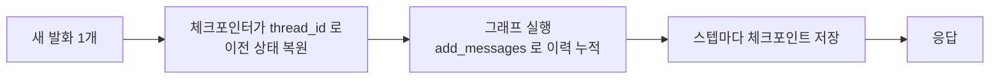
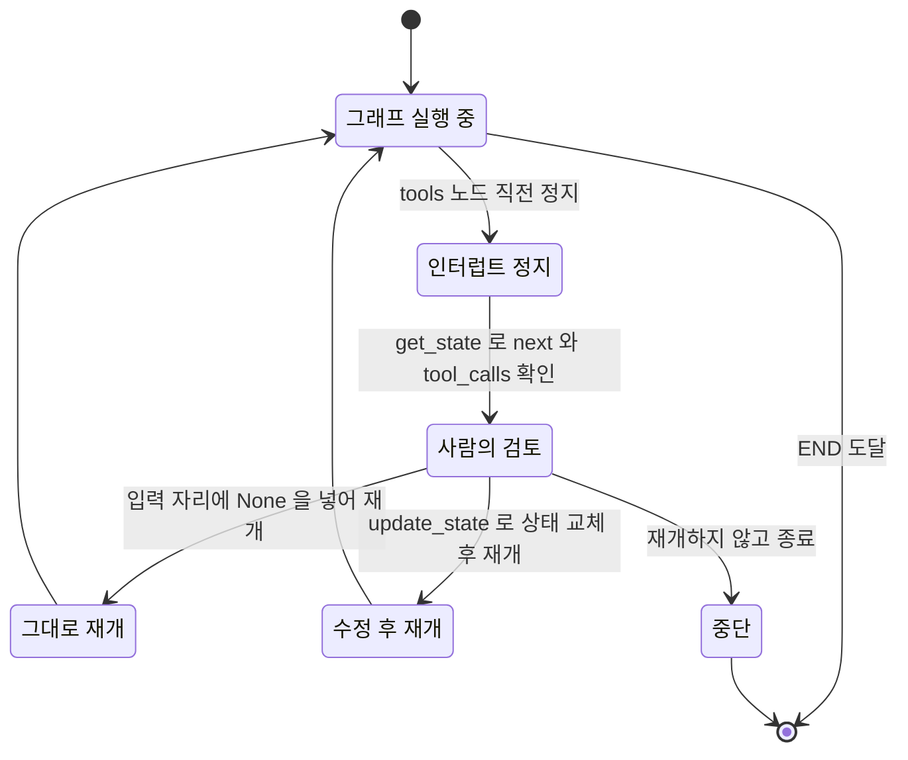
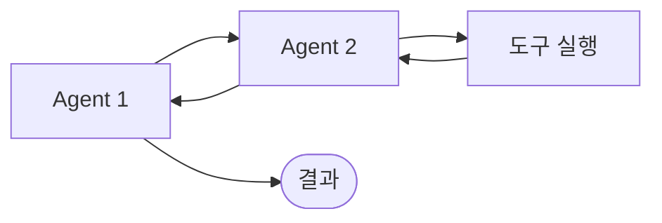

멀티유저 챗봇에서 다른 사용자의 대화가 섞여 나오는 사고는 보안 설정이 아니라 **문자열 하나**에서 난다. 대화 기억은 모델에도 그래프 객체에도 붙어 있지 않고, `thread_id`라는 키에 붙어 있기 때문이다. 이 키를 상수로 하드코딩한 코드는 로컬 테스트에서는 완벽하게 동작하고 운영에서만 터진다.

이 글은 그 저장소를 다룬다. 체크포인터가 실제로 무엇을 담고 있는지(`StateSnapshot` 여섯 필드), 그 지속성 위에서만 성립하는 인터럽트로 승인 게이트를 만드는 법, 그리고 마지막으로 **언제 이 모든 것을 쓰지 않아야 하는지** — LCEL 체인과의 경계를 아홉 축으로 가른다. [앞 편](/blog/ai-agent/langgraph-tool-react-loop/)에서 루프는 돌지만 대화를 기억하지 못하는 그래프까지 왔다.

## 용어 정리

앞 두 편의 용어표에서 이 글이 쓰는 행만 추리고, 지속성 쪽 용어를 더했다.

| 약어 / 용어 | 원어 | 뜻 |
|---|---|---|
| State / 리듀서 | — | 노드들이 공유하는 데이터와 그 병합 규칙. [1편](/blog/ai-agent/langgraph-state-reducer/) 참조 |
| `bind_tools` / ToolNode | — | 도구를 **결정**하는 곳과 **실행**하는 곳. [2편](/blog/ai-agent/langgraph-tool-react-loop/) 참조 |
| Checkpointer | 체크포인터 | 각 스텝의 상태를 저장·복원하는 지속성 계층 |
| MemorySaver | — | 프로세스 메모리에 상태를 저장하는 체크포인터 구현체 |
| `thread_id` | — | 대화 세션을 구분하는 키. 체크포인트 조회 단위 |
| StateSnapshot | — | 특정 시점 상태 + 다음 실행 노드 + 메타데이터 묶음 |
| HITL | Human-in-the-Loop | 사람이 중간에 개입해 승인·수정하는 구조 |
| `interrupt_before` | — | 지정 노드 **직전**에 그래프를 정지시키는 컴파일 옵션 |
| `update_state` | — | 정지 지점의 상태를 사람이 고쳐 넣는 API |
| LCEL | LangChain Expression Language | `\|` 연산자로 컴포넌트를 잇는 LangChain의 체인 표기법 |

## 기억은 어디에 저장되는가

`graph.invoke()`는 기본적으로 **상태를 남기지 않는다.** 다음 호출은 빈 상태에서 시작한다. 1편에서 세 번 반복 예제가 누적된 것은 파이썬 변수 `state`를 사람이 손으로 되먹였기 때문이지, 그래프가 기억한 것이 아니다.

멀티턴 대화를 하려면 **그래프 바깥에 상태 저장소**가 필요하다. 그것이 체크포인터다.

```python
from langgraph.checkpoint.memory import MemorySaver

memory = MemorySaver()

# ... 노드·엣지 구성은 앞 편의 ReAct 골격과 동일 ...

graph = graph_builder.compile(checkpointer=memory)     # ← 지속성 부여
```

```python
config = {"configurable": {"thread_id": "1"}}          # ← 세션 식별자

while True:
    user_input = input("User: ")
    if user_input.lower() in ["quit", "exit", "q"]:
        break
    for event in graph.stream({"messages": ("user", user_input)}, config):
        for value in event.values():
            print("Assistant:", value["messages"][-1].content)
```

바뀐 곳은 **compile 한 줄과 invoke의 config 한 개**뿐이다. 노드도 엣지도 그대로다.



핵심은 첫 노드다. **매 호출에 이력 전체를 다시 넣지 않는다.** 새 발화 한 개만 넣는데, 체크포인터가 `thread_id`로 이전 상태를 복원한 뒤 `add_messages`가 새 메시지를 이어 붙인다.

> 1편의 리듀서와 여기의 체크포인터는 **같은 문제를 다른 층에서 푼다.** 리듀서는 한 번의 실행 안에서 값이 살아남게 하고, 체크포인터는 실행과 실행 사이에서 살아남게 한다.
>
> 그래서 둘 중 하나만 있으면 반쪽이다. 체크포인터가 있어도 `messages` 채널에 리듀서가 없으면 복원된 이력을 새 메시지가 덮어쓰고, 리듀서가 있어도 체크포인터가 없으면 복원할 이력 자체가 없다.

### thread_id 격리 — 실제 응답

같은 그래프 객체에 `thread_id`만 바꿔 물었다.

| thread_id | 질문 | 실제 응답 |
|---|---|---|
| `"1"` (대화 진행 후) | "첫질문이 뭐였어?" | `첫 질문은 "대한민국의 대통령은 누구야?"였습니다.` |
| `"2"` (새 스레드) | "내가 한 첫 질문이 뭐였어?" | `죄송하지만, 이전의 대화를 기억할 수 없어서…` |

두 응답이 같은 그래프, 같은 모델, 같은 체크포인터에서 나왔다. **기억은 모델이나 그래프가 아니라 `thread_id`에 붙어 있다.**

> 멀티유저 서비스에서 `thread_id`를 사용자·세션 단위로 발급하면 **그것만으로 대화 격리가 완성된다.** 별도의 격리 계층이 필요 없다.
>
> 뒤집으면 실무에서 가장 조심할 지점도 여기다. `thread_id`를 공유하거나 상수로 박으면 **다른 사용자의 대화가 섞여 나온다.** 이 결함은 단일 사용자로 테스트하는 한 절대 재현되지 않는다.

### StateSnapshot — 저장된 것의 실체

```python
snapshot = graph.get_state(config)
```

돌려받는 `StateSnapshot`의 구성은 여섯 필드다.

| 필드 | 내용 | 쓸모 |
|---|---|---|
| `values` | 현재 상태 값 전체(예: `messages` 리스트) | 대화 이력 조회 |
| `next` | **다음에 실행될 노드 튜플** | 비었으면 완료, 값이 있으면 대기 중 |
| `config` | `thread_id` + `thread_ts`(체크포인트 타임스탬프) | 특정 시점 지목 |
| `metadata` | `source`, `step`, `writes`(어느 노드가 무엇을 썼는지) | 감사·디버깅 |
| `created_at` | 생성 시각 | 이력 추적 |
| `parent_config` | 부모 체크포인트 | 시간 여행(과거 시점 재개)의 연결고리 |

여섯 중 둘이 이 글의 나머지를 지탱한다. `next`는 아래 인터럽트 절에서 "지금 멈춰 있는가"를 판별하는 값이고, `metadata.writes`는 사후 추적의 근거다.

> `metadata.writes`에 **어느 노드가 어떤 메시지를 썼는지**가 그대로 남는다. "에이전트가 왜 그런 답을 냈는가"를 사후에 되짚을 수 있다는 뜻이다.
>
> 이것이 프로덕션에서 지속성이 갖는 진짜 값어치다. 지속성을 "대화 기억 기능"으로만 이해하면 관측성 쪽 이득을 통째로 놓친다. **재현성과 감사 가능성이 여기서 나온다.**

### 컨텍스트가 길어질 때

대화가 길어지면 토큰과 비용이 함께 늘어난다. 가장 단순한 대응은 LLM에 넣기 전에 자르는 것이다.

```python
def filter_messages(messages: list):
    # 마지막 2개만 사용
    return messages[-2:]


def chatbot(state: State):
    messages = filter_messages(state["messages"])   # LLM에 넣기 전에 자른다
    result = llm_with_tools.invoke(messages)
    return {"messages": [result]}
```

실행 결과가 이 방식의 성질을 정확히 드러낸다.

| 순서 | 입력 | 응답 | 해석 |
|---|---|---|---|
| 1 | "hi! I'm bob and I like soccer" | 이름·취미 인식 | — |
| 2 | "what's my name?" | `Your name is Bob!` | 직전 2개 안에 이름이 남아 있었음 |
| 3 | "what's my name?" | `Your name is Bob!` | 직전 답변이 창 안에 있어 유지 |
| 4 | "what's my favorite?" | 모른다고 답함 | 축구 언급이 **창 밖으로 밀려남** |

여기서 반드시 구분해야 할 것이 있다. 잘린 것은 **LLM에 보내는 입력**뿐이고, 체크포인터에는 전체 이력이 그대로 남는다.

> 이 기법은 "기억 삭제"가 아니라 **"컨텍스트 창 관리"다**. 감사 로그는 온전하고 비용만 줄어든다.
>
> 두 층이 분리돼 있다는 사실이 실무에서 선택지를 만든다. 사용자에게 보이는 것과 모델이 보는 것과 감사에 남는 것을 각각 다르게 정할 수 있다. 한 층으로 뭉쳐 있으면 셋 중 하나를 위해 나머지 둘을 포기해야 한다.

| 전략 | 방식 | 트레이드오프 |
|---|---|---|
| 윈도우 슬라이싱 | 최근 N개만 전달 | 구현 한 줄, 오래된 사실 유실 |
| 요약 압축 | 오래된 구간을 LLM으로 요약해 1개 메시지로 치환 | 맥락 보존, 요약 호출 비용·왜곡 |
| 선별 검색 | 이력을 벡터 검색해 관련 대목만 주입 | 장기 기억에 강함, 인프라 필요 |

### 프로덕션에서의 체크포인터

`MemorySaver`는 이름 그대로 **프로세스 메모리**에 저장한다. 재시작하면 사라지고, 여러 인스턴스 간 공유도 안 된다. 로컬 `MemorySaver`를 그대로 운영에 올리는 것이 흔한 실패이며, 그 실패의 증상과 처방은 [모듈화 실패 목록](/blog/rag/langgraph-parallel-multiagent/)에 정리돼 있다. 여기서 필요한 것은 **어느 구현체를 어디에 쓰는가**의 지도다.

| 구현체 | 저장소 | 용도 |
|---|---|---|
| `MemorySaver` | 프로세스 메모리 | 학습·노트북·단위 테스트 |
| SQLite 기반 세이버 | 로컬 파일 | 단일 노드 데모, 개인 도구 |
| PostgreSQL 기반 세이버 | RDB | **다중 인스턴스 서비스 운영** |

가운데 행이 자주 빠지는 선택지다. "메모리 아니면 RDB"의 이분법으로 보면 개인 도구나 단일 노드 배치 작업에 과한 인프라를 붙이게 된다.

> 체크포인터를 RDB로 바꾸면 애플리케이션 코드는 그대로 두고 지속성만 승격된다. `compile(checkpointer=...)` 한 줄이 유일한 교체 지점이다.
>
> 1편에서 Apache Beam 계보를 짚으며 말한 **"그래프 정의와 실행의 분리"가** 여기서 실물로 드러난다. 저장소가 인터페이스 뒤에 있으니 노드도 엣지도 저장소를 모른다. 인터페이스가 잘 잘려 있다는 것은 이런 것이다.

## Human-in-the-Loop — 그래프를 멈추고 개입하기

앞 편에서 짚은 **결정(`bind_tools`)과 실행(`ToolNode`)의 분리**가 여기서 값을 한다. LLM이 "이 도구를 이 인자로 부르겠다"고 선언한 시점과 실제로 실행되는 시점 사이에 틈이 있고, 그 틈에 사람을 세울 수 있다.

실무 시나리오로 옮기면 결제 API 호출, 메일 발송, DB 삭제, 외부 공개 — **되돌리기 어려운 작업 앞에 승인 게이트를 놓는 것**이다.

```python
from langgraph.checkpoint.memory import MemorySaver

memory = MemorySaver()

# ... 노드·엣지 구성은 앞 편의 ReAct 골격과 동일 ...

graph = graph_builder.compile(
    checkpointer=memory,          # HITL은 체크포인터가 전제 조건
    interrupt_before=["tools"],   # tools 노드 '직전'에 정지
)
```

> **`interrupt_before`는 체크포인터 없이는 성립하지 않는다.** 멈춘 자리를 저장해 둘 곳이 있어야 나중에 이어서 돌릴 수 있기 때문이다.
>
> 이 전제를 모르면 "인터럽트를 걸었는데 안 멈춘다"는 증상 앞에서 인터럽트 쪽만 계속 들여다보게 된다. 원인은 함께 주지 않은 인자에 있다.

### 실제로 멈추는 장면

```python
user_input = "Langgraph가 뭐야?"
config = {"configurable": {"thread_id": "1"}}

events = graph.stream(
    {"messages": [("user", user_input)]}, config, stream_mode="values"
)

for event in events:
    if "messages" in event:
        event["messages"][-1].pretty_print()
```

출력은 여기서 **끊긴다**.

```text
================================ Human Message =================================
Langgraph가 뭐야?
================================== Ai Message ==================================
Tool Calls:
  tavily_search_results_json (call_XLkOygS67iYnVCY5F1YA4sBV)
 Call ID: call_XLkOygS67iYnVCY5F1YA4sBV
  Args:
    query: Langgraph
```

검색 결과도, 최종 답변도 없다. 그래프가 **tools 노드 직전에서 멈춘 상태**다. 이때 `graph.get_state(config)`의 `next`에는 다음 실행 대상인 `tools`가 들어 있다 — 앞 절에서 본 `next` 필드가 여기서 쓰인다.

### 정지·검토·재개의 상태 전이



사람이 고를 수 있는 것은 세 갈래다.

| 패턴 | 방법 | 쓰는 상황 |
|---|---|---|
| **승인 후 그대로 재개** | 입력 자리에 `None`을 넣고 같은 `config`로 다시 호출 | 도구 호출이 타당함 |
| **수정 후 재개** | `graph.update_state(config, {...})`로 상태를 고친 뒤 재개 | 검색어가 엉성하거나 인자가 틀림 |
| **거부** | 재개하지 않음. 또는 도구 결과 자리에 거절 메시지를 넣고 재개 | 실행하면 안 되는 요청 |

**도식은 여섯 상태인데 표는 세 행이다.** 표에 없는 셋은 `Running`·`Paused`·`Review`인데, 사람이 고르는 것이 아니라 **시스템이 지나가는 상태**라서 빠졌다. 이 구분이 실무에서 갈리는 지점이다 — 표의 세 갈래는 UI로 노출할 버튼이 되고, 도식의 나머지 셋은 그 버튼을 언제 띄울지 판별하는 조건이 된다. `next` 필드를 봐야 하는 이유가 여기 있다.

```python
# 패턴 1 — 그대로 승인하고 이어서 실행
for event in graph.stream(None, config, stream_mode="values"):
    event["messages"][-1].pretty_print()
```

`None`을 넣는다는 것은 **"새 입력은 없다, 저장된 지점부터 계속하라"는** 신호다. `config`의 `thread_id`가 어디서 멈췄는지를 알고 있으므로 그래프는 정확히 tools 노드부터 재개한다.

### 게이트가 조직에 주는 것

이 메커니즘의 함의는 코드보다 크다.

| 관점 | 내용 |
|---|---|
| 안전 | 되돌릴 수 없는 액션 앞에 **기술적 강제 게이트**를 둘 수 있다. 정책 문서가 아니라 코드로 강제된다 |
| 점진 자동화 | 처음엔 전 도구를 승인 대상으로 두고, 신뢰가 쌓인 도구부터 `interrupt_before`에서 빼며 자동화 범위를 넓힌다 |
| 감사 | 인터럽트 지점의 스냅샷이 그대로 승인 로그가 된다 |
| 품질 개선 | 사람이 고친 상태(`update_state` 이력)가 곧 모델 개선용 라벨 데이터가 된다 |

> 네 행 중 **점진 자동화**가 실무에서 가장 값을 한다. 자동화 범위를 늘리는 결정이 "믿을 만한가"라는 감이 아니라 `interrupt_before` 배열에서 이름 하나를 빼는 **되돌릴 수 있는 조작**이 되기 때문이다.
>
> 그래서 도입 초기에 게이트를 넉넉히 거는 것은 보수적인 선택이 아니라 **가장 빠른 선택**이다. 게이트가 없으면 승인 이력이 안 쌓이고, 이력이 없으면 무엇을 자동화해도 되는지 판단할 근거가 없다.

## LangChain(LCEL) vs LangGraph

여기까지 오면 그래프의 값어치가 분명해지는데, 그만큼 **안 써야 할 자리**도 분명해져야 한다.

두 실행 모델의 모양 차이는 도식 두 장으로 끝난다.




한 줄로 줄이면 LangChain은 **여러 컴포넌트를 묶은 일방향 체인**이고, LangGraph는 **노드와 엣지로 연결한 양방향 그래프**다. 그 한 줄이 아홉 축으로 갈라진다.

| 항목 | LangChain (LCEL) | LangGraph |
|---|---|---|
| 구조 | 선형 체인, 사실상 DAG | 순환 허용 그래프 |
| 흐름 방향 | 단방향 | 양방향·되돌아오기 가능 |
| 상태 | 체인을 타고 흐르는 입출력 | **명시적 State 객체**를 노드들이 공유 |
| 분기 | 라우터로 제한적 표현 | 조건부 엣지로 일급 표현 |
| 반복 횟수 | 정의 시점에 고정 | **런타임에 결정**(도구 호출이 끝날 때까지) |
| 지속성 | 별도 메모리 컴포넌트 | **내장 체크포인터** |
| 중단·재개 | 어려움 | `interrupt_before`로 일급 지원 |
| 추상화 수준 | 높음(빠르게 조립) | 낮음(세밀하게 제어) |
| 대표 활용 | RAG 인덱싱·생성, 정보 추출 | 단일 에이전트, 멀티 에이전트 |

아홉 축 중 **반복 횟수** 행이 나머지를 결정한다. 반복 횟수가 정의 시점에 고정된다면 상태를 명시적으로 들 이유도, 지속성을 내장할 이유도, 중단·재개를 지원할 이유도 약해진다. 앞 편의 멀티홉 예제에서 루프가 몇 바퀴 돌지 사전에 알 수 없었던 것이 이 표 전체의 근거다.

상황별로 뒤집으면 이렇게 된다.

| 상황 | 선택 | 근거 |
|---|---|---|
| 프롬프트 → LLM → 파싱, 단계가 고정 | **LCEL** | 그래프는 과잉 |
| 문서 검색 후 답변 생성, 재시도 없음 | **LCEL** | 단방향으로 충분 |
| 답이 부실하면 재검색해서 다시 시도 | **LangGraph** | 루프가 필요 |
| 도구를 몇 번 부를지 모름 | **LangGraph** | 반복 횟수가 런타임 결정 |
| 멀티턴 대화 세션 유지 | **LangGraph** | 체크포인터 + `thread_id` |
| 실행 전 사람 승인 필요 | **LangGraph** | 인터럽트 |
| 에이전트 여러 개가 역할 분담 | **LangGraph** | 멀티액터가 설계 전제 |

> **둘은 배타 관계가 아니다.** 실무 조합은 대개 노드 **안쪽**을 LCEL 체인으로 짜고, 노드 **사이**의 흐름·상태·반복을 LangGraph가 관장한다.
>
> 공식 문서가 강조하듯 LangGraph는 LangChain 없이도 쓸 수 있지만, 실제로는 프롬프트·파서·리트리버 자산을 그대로 노드 안에 얹는 편이 경제적이다. "무엇을 쓸까"보다 **"어느 층에서 쓸까"가** 정확한 질문이다.

## 흔한 함정 체크리스트

| # | 증상 | 원인 | 대처 |
|---|---|---|---|
| 1 | 대화 이력이 매번 1개로 초기화 | `messages` 채널에 리듀서 미지정 | `Annotated[list, add_messages]` |
| 2 | 여러 턴을 돌아도 이전 대화를 모름 | 체크포인터 미지정 | `compile(checkpointer=...)` + `config`의 `thread_id` |
| 3 | 다른 사용자의 대화가 섞여 나옴 | `thread_id`를 공유·하드코딩 | 사용자·세션 단위로 발급 |
| 4 | 도구를 만들었는데 안 부른다 | docstring·파라미터 명세 부실 | 함수명·인자명·docstring을 명세서처럼 작성 |
| 5 | 도구가 결정만 되고 실행이 안 됨 | `ToolNode`를 그래프에 안 넣음 | `bind_tools`와 `ToolNode` **둘 다** 필요 |
| 6 | `tools_condition`이 라우팅 실패 | 도구 노드 이름이 `"tools"`가 아님 | 이름을 맞추거나 조건 함수를 직접 작성 |
| 7 | 재귀 한도 초과로 종료 | 순환 그래프에 END 경로가 사실상 없음 | 조건부 엣지에 종료 조건·최대 반복 카운터 추가 |
| 8 | 인터럽트가 안 걸림 | 체크포인터 없이 `interrupt_before` 사용 | 체크포인터를 함께 지정 |
| 9 | 재시작하면 대화가 사라짐 | `MemorySaver`는 프로세스 메모리 | RDB 기반 체크포인터로 교체 |
| 10 | 토큰 비용이 대화 길이에 비례해 폭증 | 이력 전량을 매번 LLM에 전달 | 윈도우 슬라이싱·요약 압축 |
| 11 | 병렬 노드에서 상태가 유실 | 같은 채널을 리듀서 없이 동시 갱신 | 해당 채널에 병합 리듀서 지정 |
| 12 | 노트북 코드에 API 키 하드코딩 | 학습 코드를 그대로 이식 | 환경변수·시크릿 매니저로 분리 |

열두 항목이 세 무리로 갈린다. 1·11은 리듀서, 2·3·8·9는 체크포인터, 4·5·6은 도구 등록이다. **증상은 열두 가지지만 원인은 세 가지**이고, 셋 다 "선언을 빼먹었다"는 같은 모양이다.

> 나머지 셋(7·10·12)이 성격이 다르다. 이것들은 선언 누락이 아니라 **상한을 안 정한 것**이다. 루프의 상한, 컨텍스트의 상한, 시크릿의 경계.
>
> 앞의 아홉은 동작하지 않아서 즉시 드러나지만, **뒤의 셋은 동작하면서 비용과 위험만 키운다.** 그래서 리뷰에서 잡아야 하는 쪽은 뒤의 셋이다.

## 전 과정 재현 골격

이 한 덩어리로 시리즈 세 편의 코드를 전부 되살릴 수 있다.

```python
from typing import Annotated
from typing_extensions import TypedDict

from langchain_openai import ChatOpenAI
from langchain_core.tools import tool
from langgraph.graph import StateGraph, START, END
from langgraph.graph.message import add_messages
from langgraph.prebuilt import ToolNode, tools_condition
from langgraph.checkpoint.memory import MemorySaver

# ① State — 채널마다 병합 정책을 다르게 줄 수 있다
class State(TypedDict):
    messages: Annotated[list, add_messages]   # 누적
    counter: int                              # 덮어쓰기


# ② Tool — docstring이 곧 LLM에게 보이는 명세
@tool
def get_weather(location: str):
    """Call to get the weather"""
    return "It's 60 degrees and foggy." if location in ["서울", "인천"] else "It's 90 degrees and sunny."


tools = [get_weather]
tool_node = ToolNode(tools)                              # 실행 담당
llm_with_tools = ChatOpenAI(model="gpt-4o-mini", temperature=0).bind_tools(tools)  # 결정 담당


# ③ Node — 부분 업데이트만 반환
def chatbot(state: State):
    return {
        "messages": [llm_with_tools.invoke(state["messages"])],
        "counter": state.get("counter", 0) + 1,
    }


# ④ 배선 — 조건부 분기 + 되돌아오는 엣지 = 순환
builder = StateGraph(State)
builder.add_node("chatbot", chatbot)
builder.add_node("tools", tool_node)
builder.add_edge(START, "chatbot")
builder.add_conditional_edges("chatbot", tools_condition)   # tools 또는 END
builder.add_edge("tools", "chatbot")

# ⑤ compile — 지속성과 인터럽트를 여기서 주입
graph = builder.compile(
    checkpointer=MemorySaver(),
    interrupt_before=["tools"],      # 승인 게이트가 필요 없으면 이 줄만 제거
)

# ⑥ 실행 — thread_id가 대화 세션을 가른다
config = {"configurable": {"thread_id": "user-42"}}
for event in graph.stream({"messages": [("user", "서울 날씨는 어때?")]}, config, stream_mode="values"):
    event["messages"][-1].pretty_print()

# ⑦ 인터럽트 지점 확인 → 검토 → 재개
snapshot = graph.get_state(config)
print(snapshot.next)                 # ('tools',) 이면 도구 실행 대기 중

for event in graph.stream(None, config, stream_mode="values"):   # None = 저장된 지점부터 재개
    event["messages"][-1].pretty_print()
```

⑤번 블록이 이 시리즈의 요약이다. **설계(①~④)를 한 글자도 건드리지 않고 운영 성질만 바꾸는 자리**가 거기 하나로 모여 있다. 체크포인터를 RDB로 올리는 것도, 승인 게이트를 걷어내는 것도 그 안에서 끝난다.

---

여기까지가 LangGraph의 실행 모델이다. 상태를 들고 돌고, 도구를 부르고, 멈췄다 재개한다. 그런데 지금까지의 판단은 전부 **"도구를 부를까 말까"** 한 종류뿐이었다. `tools_condition`이 보는 것은 마지막 메시지에 `tool_calls`가 있는지, 그것뿐이다.

판단 대상을 바꾸면 어떻게 되는가. **검색 결과가 질문과 관련 있는가**를 LLM에게 묻고 그 답으로 경로를 가른다면, 그 그래프는 "검색이 실패했다는 사실을 스스로 아는" RAG가 된다. 여기에 "답변이 문서에 근거하는가", "질문에 답하고 있는가"를 더하면 판정기가 셋이 된다. 이어지는 시리즈에서 [판정기를 꽂아 경로를 바꾸는 RAG 4종](/blog/ai-agent/agentic-rag-as-tool/)을 다룬다.

리듀서를 어떤 채널에 붙이는지, `tool_calls`가 찍힌 시점에 무엇이 아직 일어나지 않았는지, `MemorySaver`를 왜 운영에 올리면 안 되는지는 [실행 모델 Q&A](/blog/ai-agent/ai-agent-qna-execution/)에 문답으로 정리돼 있다.
