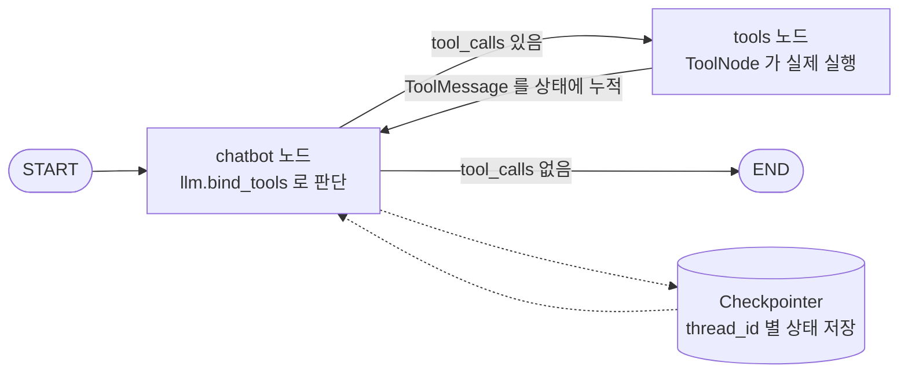
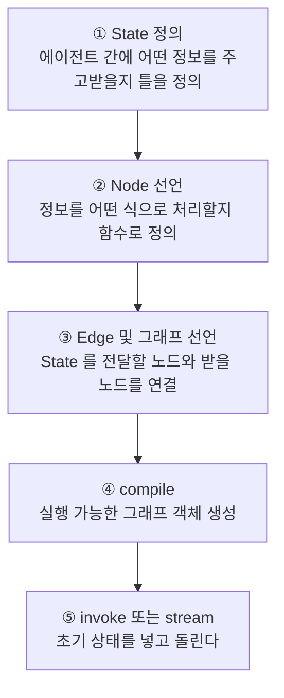

노드를 세 번 돌렸는데 리스트에 원소가 하나뿐이다. 코드에는 틀린 곳이 없다. 노드는 `["Hello"]`를 정확히 반환했고, 그래프도 세 번 정확히 돌았다. 그런데도 결과는 `['Hello']` 하나다. 이 증상을 만나면 대개 노드 함수를 들여다보지만, 원인은 노드가 아니라 **상태 스키마의 타입 선언 한 줄**에 있다.

이 글은 LangGraph를 "그래프를 그리는 라이브러리"가 아니라 **상태를 들고 도는 실행 엔진**으로 보는 관점에서 그 한 줄을 다룬다. 실행 모델의 네 덩어리(State·Node·Edge·compile)를 훑고, 같은 그래프를 리듀서만 바꿔 세 번씩 돌린 실제 출력을 나란히 놓은 뒤, 왜 병합이 그 시점에 일어나는지를 슈퍼스텝 모델로 설명한다. [앞 시리즈](/blog/ai-agent/langchain-rag-pipeline/)에서 LCEL 체인이 사이클을 표현하지 못한다는 지점까지 왔다면, 여기가 그 다음 칸이다. 도구를 붙여 실제로 순환을 만드는 것은 [다음 편](/blog/ai-agent/langgraph-tool-react-loop/)에서 다룬다.

## 용어 정리

| 약어 / 용어 | 원어 | 뜻 |
|---|---|---|
| LLM | Large Language Model | 대규모 언어 모델. 여기서는 `gpt-4o-mini` 등 채팅 모델 |
| DAG | Directed Acyclic Graph | 방향성 비순환 그래프. 되돌아오는 간선이 없는 구조 |
| StateGraph | — | LangGraph의 그래프 빌더. 상태 스키마를 인자로 받아 생성 |
| Node | 노드 | 상태를 입력받아 **상태의 부분 업데이트**를 반환하는 함수 |
| Edge | 엣지 | 노드 간 이동 경로. 고정 엣지와 조건부 엣지가 있음 |
| Conditional Edge | 조건부 엣지 | 함수의 반환값에 따라 다음 노드를 고르는 분기 |
| START / END | — | 그래프의 가상 진입점·종료점을 나타내는 특수 상수 |
| State | 상태 | 노드들이 공유하는 데이터. `TypedDict`로 스키마 선언 |
| Channel | 채널 | 상태 스키마의 각 키를 부르는 내부 명칭. 키마다 갱신 규칙을 가짐 |
| Reducer | 리듀서 | 기존 채널 값과 노드가 반환한 값을 **어떻게 합칠지** 정하는 함수 |
| `Annotated` | typing.Annotated | 타입에 메타데이터를 붙이는 문법. 리듀서를 매다는 자리 |
| `add_messages` | — | 메시지 리스트 전용 리듀서. 덮어쓰지 않고 누적·병합 |
| MessagesState | — | `messages` 채널 하나가 미리 정의된 프리셋 상태 |
| 슈퍼스텝 | super-step | 한 번에 실행되는 노드 묶음. 그 경계에서 상태가 동기화된다 |
| Pregel | — | 구글의 대규모 그래프 처리 모델. LangGraph 실행 모델의 원류 |
| BSP | Bulk Synchronous Parallel | 슈퍼스텝 단위로 동기화하며 진행하는 병렬 계산 모델 |
| LCEL | LangChain Expression Language | `\|` 연산자로 컴포넌트를 잇는 LangChain의 체인 표기법 |

## 완성형 한 장 — 무엇이 어디에 붙는가

LangGraph로 만든 에이전트의 최소 완성형은 아래 한 장으로 요약된다. 판단하는 노드와 실행하는 노드가 조건부 엣지로 순환하고, 그 옆에서 체크포인터가 매 스텝 상태를 적재한다.



이 그림에 담긴 것을 "무엇을 풀려고 그렇게 생겼는가"의 관점에서 펼치면 일곱 줄이 된다.

| # | 풀어야 할 문제 | LangGraph의 해법 | 다루는 곳 |
|---|---|---|---|
| 1 | 체인은 한 번 흐르면 끝이라 "다시 시도"가 안 된다 | 순환 가능한 그래프(사이클 지원) | 이 편 · 다음 편 |
| 2 | 노드마다 상태를 덮어써 이전 맥락이 날아간다 | 채널별 **리듀서**로 누적 정책 지정 | 이 편 |
| 3 | LLM이 최신 정보를 모르고 환각을 낸다 | 도구 바인딩 + ToolNode 실행 | 다음 편 |
| 4 | 도구를 부를지 말지 매번 사람이 정할 수 없다 | 조건부 엣지로 자동 라우팅 | 이 편 · 다음 편 |
| 5 | 세션이 끊기면 대화 기억이 사라진다 | Checkpointer + `thread_id` | 마지막 편 |
| 6 | 위험한 도구 실행을 그대로 두면 사고가 난다 | `interrupt_before`로 정지 후 사람이 검토 | 마지막 편 |
| 7 | 어디까지 체인, 어디부터 그래프인가 | 단방향·정형이면 LCEL / 순환·분기·상태면 그래프 | 마지막 편 |

**도식은 다섯 요소(START·chatbot·tools·END·Checkpointer)인데 표는 일곱 행이다.** 도식이 담지 못한 셋은 2번 리듀서, 6번 인터럽트, 7번 LCEL 경계인데, 공교롭게도 셋 다 그림으로 그릴 수 없는 종류다. 리듀서는 화살표가 아니라 **화살표 끝에서 벌어지는 병합 규칙**이고, 인터럽트는 **일어나지 않는 이동**이며, LCEL 경계는 애초에 이 그림을 그릴지 말지의 판단이다.

> 이 시리즈가 2번부터 시작하는 이유가 여기 있다. 1·3·4번은 그림을 보면 짐작이 가지만 **2번은 그림에 없어서 아무도 안 챙기고, 그래서 가장 먼저 사고가 난다.**
>
> "대화가 이어지지 않는다"는 증상의 절대다수가 리듀서 미지정이다. 노드도 엣지도 정상인데 상태만 매번 초기화된다.

### 계보와 정의는 어디를 보면 되나

LangGraph가 Pregel·Apache Beam·NetworkX에서 무엇을 물려받았는지, 그리고 공식 저장소가 스스로를 어떻게 정의하는지는 [프레임워크 비교 편](/blog/ai-agent/agent-framework-comparison/)에 정리돼 있다. 세 프레임워크를 나란히 놓은 좌표도 그쪽이 정본이다. 여기서는 그 정의 중 **이 글의 주제와 직접 닿는 두 가지만** 확장한다.

첫째, 공식 소개문은 "대부분의 에이전트 아키텍처에 필수적인 **주기(cycle)를 포함하는 플로우**를 정의할 수 있어 DAG 기반 솔루션과 차별화된다"고 못 박는다. 차별화의 기준점이 성능이나 편의가 아니라 **표현력**이라는 뜻이다. 반복 횟수가 런타임에 정해지는 흐름은 DAG로 아예 적을 수 없다.

둘째, Apache Beam에서 물려받은 것은 **그래프 정의와 실행을 분리하는 관점**이다. 같은 그래프 정의에 런타임과 체크포인터를 갈아 끼울 수 있다는 성질이 여기서 나오고, 이것이 마지막 편에서 `compile(checkpointer=...)` 인자 한 줄로 지속성을 승격하는 장면의 배경이다.

## 코드 네 덩어리 — 사고의 순서

LangGraph 코드는 정확히 네 덩어리로 나뉜다. 이 순서가 곧 사고 순서다.



앞의 세 덩어리는 "무엇을 적는가"로 바꿔 말할 수 있다.

| 단계 | 무엇을 적는가 | 성격 |
|---|---|---|
| State 정의 | 에이전트 간에 어떤 정보를 주고받을지 **틀**을 정의 | 데이터 계약 |
| Node 선언 | 정보를 어떤 식으로 처리할지 **함수**로 정의 | 처리 로직 |
| Edge 선언 | State를 전달할 노드 → State를 받을 노드 | 흐름 배선 |

**도식은 다섯 단계인데 표는 세 행이다.** 표에서 빠진 둘은 `compile`과 `invoke`인데, 빠진 이유가 성격이 다르기 때문이다. 앞의 셋은 **설계**라 코드로 적는 대상이고, 뒤의 둘은 **실행**이라 적는 것이 아니라 호출하는 것이다. 이 경계가 중요한 이유는 지속성·인터럽트 같은 운영 설정이 전부 `compile` 인자로 들어가기 때문이다. 설계를 바꾸지 않고 운영 성질만 바꿀 수 있는 자리가 거기다.

### 최소 골격

```python
from typing import TypedDict
from langgraph.graph import StateGraph, START, END


# ① State 정의 — 그래프가 들고 도는 데이터의 틀
class State(TypedDict):
    counter: int
    alphabet: list[str]


# ② Node 선언 — 상태를 받아 상태를 돌려주는 함수
def node_a(state: State):
    state["counter"] += 1
    state["alphabet"] = ["Hello"]
    return state


# ③ Edge 및 그래프 선언
graph_builder = StateGraph(State)
graph_builder.add_node("chatbot", node_a)
graph_builder.add_edge(START, "chatbot")
graph_builder.add_edge("chatbot", END)

# ④ compile
graph = graph_builder.compile()

# ⑤ 실행 — 초기 상태를 넣는다
result = graph.invoke({"counter": 0, "alphabet": []})
```

`START`/`END` 대신 진입·종료점을 직접 지정하는 축약형도 있다.

```python
graph_builder.set_entry_point("chatbot")    # == add_edge(START, "chatbot")
graph_builder.set_finish_point("chatbot")   # == add_edge("chatbot", END)
```

구조를 눈으로 확인하고 싶으면 그래프 객체가 스스로를 그려 준다. 실행하면 `__start__ → chatbot → __end__`가 나온다.

```python
from IPython.display import Image, display

display(Image(graph.get_graph().draw_mermaid_png()))
```

> 위 `node_a`에는 실무에서 따라 쓰면 안 되는 습관이 하나 들어 있다. **입력받은 상태 dict를 제자리에서 고치고 통째로 반환하는 것**이다. 학습 예제로는 짧아서 좋지만, 병렬 노드가 생기는 순간 같은 객체를 두 노드가 동시에 건드리게 된다.
>
> 노드가 지켜야 할 반환 계약 — 자기가 채우는 키만 돌려주고 나머지는 건드리지 않는 것 — 은 [모듈 경계 편](/blog/rag/langgraph-module-boundaries/)과 [파이프라인 구현 편](/blog/rag/layout-parser-pipeline/)에 코드와 함께 정리돼 있다. 이 글에서는 그 계약이 **왜 성립할 수 있는지**, 즉 반환하지 않은 키가 어떻게 살아남는지를 아래 리듀서 절에서 본다.

### 엣지 3종

| 종류 | API | 동작 |
|---|---|---|
| 고정 엣지 | `add_edge("a", "b")` | a가 끝나면 무조건 b |
| 조건부 엣지 | `add_conditional_edges("a", fn)` | `fn(state)`의 반환 문자열이 다음 노드 이름 |
| 진입·종료 | `add_edge(START, "a")` / `add_edge("a", END)` | 그래프의 시작과 끝 |

조건부 엣지가 LangGraph의 심장이다. **분기와 순환이 모두 여기서 나온다.** `add_edge("tools", "chatbot")`처럼 되돌아오는 고정 엣지를 하나 놓는 순간 그래프는 DAG를 벗어난다.

## State와 Reducer — 덮어쓰기 vs 누적

여기가 LangGraph 학습에서 가장 많이 걸리는 지점이다. 설명보다 **실행 출력 대조**가 빠르다.

### 리듀서 없는 상태

```python
class State(TypedDict):
    counter: int
    alphabet: list[str]          # 리듀서 없음


def node_a(state: State):
    state["counter"] += 1
    state["alphabet"] = ["Hello"]
    return state
```

그래프를 세 번 반복 호출하며 이전 결과를 다시 입력으로 넣는다.

```python
state = {"counter": 0, "alphabet": []}
for _ in range(3):
    state = graph.invoke(state)
    print(state)
```

### 리듀서를 붙인 상태

바꾼 곳은 **딱 한 줄**, 타입 선언뿐이다. 노드 코드도 호출 코드도 그대로다.

```python
from typing import Annotated
import operator


class State(TypedDict):
    counter: int
    alphabet: Annotated[list[str], operator.add]   # ← 리듀서 지정
```

### 3회차까지의 실제 출력

| 호출 회차 | 리듀서 없음 | `operator.add` 지정 |
|---|---|---|
| 1회차 | `{'counter': 1, 'alphabet': ['Hello']}` | `{'counter': 1, 'alphabet': ['Hello']}` |
| 2회차 | `{'counter': 2, 'alphabet': ['Hello']}` | `{'counter': 2, 'alphabet': ['Hello', 'Hello']}` |
| 3회차 | `{'counter': 3, 'alphabet': ['Hello']}` | `{'counter': 3, 'alphabet': ['Hello', 'Hello', 'Hello']}` |

읽는 법이 셋 있다.

- `counter`는 리듀서가 없어도 늘어난다. 노드가 **직전 값을 읽어 +1**하기 때문이지, 누적 규칙이 있어서가 아니다.
- `alphabet`은 리듀서가 없으면 매번 `["Hello"]`로 **덮어써져** 길이가 1로 고정된다.
- `operator.add`를 붙이면 기존 채널 값과 노드 반환값이 **리스트 연결**로 병합되어 3회차에 3개가 된다.

> **리듀서는 "노드가 낸 값을 기존 값에 어떻게 합칠지"를 정하는 채널별 병합 규칙이다.** 지정하지 않으면 기본 동작은 덮어쓰기(last write wins)다.
>
> `counter` 행이 이 표에서 가장 위험한 칸이다. 리듀서 없이도 값이 늘어나는 것처럼 보여서 "LangGraph가 알아서 누적한다"는 오해를 만든다. 리스트 채널에서 그 오해가 깨질 때는 이미 대화 이력이 날아간 뒤다.

### 리듀서 카탈로그

| 리듀서 | 동작 | 쓰는 곳 |
|---|---|---|
| 없음(기본) | 덮어쓰기 | 현재 단계·플래그·최종 답변처럼 최신값만 의미 있는 채널 |
| `operator.add` | 리스트·숫자 연결/합산 | 로그 누적, 후보 문서 모으기 |
| `add_messages` | 메시지 전용 병합(아래 참조) | 대화 이력 |
| 커스텀 함수 | `(old, new) -> merged` 직접 구현 | 중복 제거, 상한 두기, 우선순위 병합 |

네 줄 중 첫 줄이 기본값이라는 사실이 설계의 방향을 말해 준다. **LangGraph는 누적을 예외로 본다.** 누적이 필요한 채널만 명시적으로 표시하라는 쪽이고, 그래서 표시를 빼먹으면 조용히 덮어써진다.

### `add_messages`가 특별한 이유

모든 채팅 실습이 이 한 줄로 시작한다.

```python
from typing import Annotated
from typing_extensions import TypedDict
from langgraph.graph.message import add_messages


class State(TypedDict):
    messages: Annotated[list, add_messages]
```

`add_messages`는 단순 리스트 연결이 아니다. 실무에서 값을 하는 성질이 셋 있다.

| 성질 | 내용 | 왜 필요한가 |
|---|---|---|
| 누적 | 새 메시지를 뒤에 붙인다 | 대화 맥락 보존 |
| **id 기반 upsert** | 같은 `id`의 메시지가 오면 덮어쓴다 | 스트리밍 중 부분 응답을 갱신, 메시지 수정 가능 |
| 타입 정규화 | `("user", "안녕")` 같은 튜플·dict를 `HumanMessage` 등으로 변환 | 입력 형식을 느슨하게 받아도 이력이 일관됨 |

세 성질 중 가운데가 `operator.add`로는 대체 불가능한 지점이다. 스트리밍은 같은 메시지를 여러 번 갱신하며 완성해 가는데, 단순 연결이면 부분 응답 조각이 전부 이력에 남는다.

세 번째 성질 덕분에 아래처럼 형태를 섞어 넣어도 전부 동작한다.

```python
graph.invoke({"messages": ("user", "안녕")})                                # 튜플
graph.invoke({"messages": {"role": "user", "content": "안녕"}})             # dict
graph.invoke({"messages": [HumanMessage(content="안녕")]})                  # 객체
```

> **입력을 느슨하게 받고 저장을 엄격하게 하는 것**이 여기서 쓰인 설계다. 호출부는 편한 형태로 넣고, 상태에는 항상 정규화된 메시지 객체가 쌓인다.
>
> 이 성질에 기대다 보면 놓치기 쉬운 대가가 하나 있다. **입력 형태가 자유롭다는 것은 타입 오류가 런타임까지 미뤄진다는 뜻**이기도 하다. 잘못된 dict 키를 넣어도 선언 시점에는 아무 일도 일어나지 않는다.

### MessagesState 프리셋과 확장

`messages` 채널만 필요하면 직접 선언할 필요가 없다.

```python
from langgraph.graph import MessagesState

graph_builder = StateGraph(MessagesState)   # messages 채널이 이미 add_messages로 정의됨
```

필드를 더하고 싶으면 **상속**한다.

```python
class State(MessagesState):
    counter: int


def chatbot(state: State):
    state["counter"] = state.get("counter", 0) + 1
    return {
        "messages": [llm.invoke(state["messages"])],
        "counter": state["counter"],
    }
```

실행하면 `messages`는 `add_messages`로 누적되고, `counter`는 리듀서가 없어 매번 새 값으로 덮어써진다.

> **하나의 상태 안에서 채널마다 다른 병합 정책이 공존한다.** 이것이 리듀서를 상태 단위가 아니라 채널 단위로 두는 이유다.
>
> 상태 설계가 "필드 목록을 정하는 일"이 아니라 **"필드별 병합 정책을 정하는 일"인** 것도 여기서 나온다. 어떤 데이터를 들고 다닐지보다, 그 데이터가 두 번 들어올 때 무슨 일이 벌어져야 하는지가 실제 설계 결정이다.

## 슈퍼스텝 — 병합은 언제 일어나는가

리듀서가 "어떻게 합치는가"라면, 슈퍼스텝은 "언제 합치는가"다. Pregel 계보를 알면 이 시점이 왜 노드 반환 직후가 아닌지가 풀린다.

| 개념 | 설명 |
|---|---|
| 슈퍼스텝(super-step) | 한 번에 실행되는 노드 묶음. 스텝 경계에서 상태가 동기화된다 |
| 병합 시점 | 노드 반환값은 즉시 반영되지 않고, 스텝이 끝날 때 리듀서를 거쳐 채널에 합쳐진다 |
| 병렬 실행 | 같은 스텝에 있는 여러 노드는 동시에 돌 수 있다. 이때 같은 채널을 쓰면 **리듀서가 없으면 충돌** |
| 종료 조건 | 갈 곳이 없거나 END에 도달하면 종료. 순환 그래프는 무한 루프 방지를 위해 재귀 한도가 존재 |

두 번째 행이 앞 절의 노드 반환 계약과 직접 이어진다. 노드가 부분 업데이트만 반환해도 되는 이유는, 반환값이 상태를 **교체**하는 것이 아니라 스텝 경계에서 **병합**되기 때문이다. 반환하지 않은 키는 병합 대상이 아니므로 그대로 살아남는다.

세 번째 행은 병렬 노드를 쓰는 순간 실전 문제가 된다. 같은 채널에 두 노드가 동시에 값을 내면, 리듀서가 없는 채널은 하나만 살아남고 나머지는 **에러 없이** 사라진다. 이 실패가 어떻게 드러나고 어떤 채널 설계로 막는지는 [병렬 처리와 상태 전달 편](/blog/rag/langgraph-parallel-multiagent/)에 사례로 정리돼 있다.

> **순환 그래프에서 종료 조건을 잘못 짜면 재귀 한도 초과 예외로 끝난다.** 조건부 엣지가 반드시 END로 빠지는 경로를 하나 이상 갖는지 항상 확인해야 한다.
>
> 재귀 한도는 안전벨트지 설계가 아니다. 한도에 걸렸다는 것은 "루프가 길다"가 아니라 **"멈출 조건을 안 적었다"는** 신호로 읽어야 한다.

---

여기까지가 상태를 들고 도는 부분이다. 그런데 지금까지의 그래프에는 사이클이 없다 — 노드 하나가 START와 END 사이에 앉아 있을 뿐이다. 되돌아오는 화살표는 무엇이 있어야 생기는가.

답은 **판단할 거리**다. 매번 같은 곳으로 가야 한다면 분기가 필요 없고, 분기가 없으면 순환도 없다. LLM에게 도구를 쥐여 주면 "이번엔 도구를 부를까, 바로 답할까"라는 판단이 생기고, 그 판단이 조건부 엣지의 입력이 된다. [다음 편](/blog/ai-agent/langgraph-tool-react-loop/)에서 도구를 붙여 그래프에 첫 번째 사이클을 만든다.
