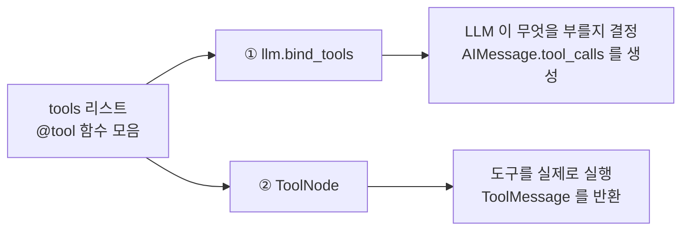
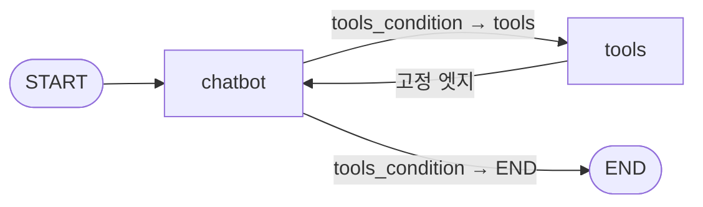

`model.invoke("서울 날씨는 어때?").tool_calls`를 찍었더니 `get_weather`가 인자와 함께 나왔다. 도구가 실행됐다고 읽기 쉽지만, 이 시점에 날씨 함수는 **한 줄도 돌지 않았다.** 모델이 낸 것은 "이 이름의 도구를 이 인자로 불러 달라"는 구조화된 요청뿐이다.

이 어긋남이 사고가 아니라 설계라는 점이 이 글의 주제다. LangGraph는 도구를 **결정하는 곳**과 **실행하는 곳**에 각각 한 번씩, 총 두 번 등록한다. 그 사이의 틈이 나중에 사람이 승인을 끼워 넣는 자리가 된다. 도구를 붙이고, 조건부 엣지로 라우팅하고, 되돌아오는 엣지 하나를 놓아 그래프에 첫 사이클을 만드는 데까지 간다. [앞 편](/blog/ai-agent/langgraph-state-reducer/)에서 상태와 리듀서를 정했다면 여기서 그 상태가 실제로 무엇을 나르는지가 드러난다.

## 용어 정리

앞 편의 용어표에서 이 글이 쓰는 행만 추리고, 도구 쪽 용어를 더했다.

| 약어 / 용어 | 원어 | 뜻 |
|---|---|---|
| State / 리듀서 | — | 노드들이 공유하는 데이터와 그 병합 규칙. [앞 편](/blog/ai-agent/langgraph-state-reducer/) 참조 |
| `add_messages` | — | 메시지 전용 리듀서. 덮어쓰지 않고 누적·병합 |
| 조건부 엣지 | Conditional Edge | 함수 반환값에 따라 다음 노드를 고르는 분기 |
| Tool | 도구 | LLM이 호출할 수 있는 외부 기능. `@tool` 데코레이터로 선언 |
| `bind_tools` | — | LLM에게 도구 목록(스펙)을 인지시키는 바인딩. **결정** 담당 |
| ToolNode | — | 도구를 실제로 실행하는 prebuilt 노드. **실행** 담당 |
| `tools_condition` | — | 도구 호출 여부를 판정하는 prebuilt 조건부 엣지 함수 |
| tool_calls | — | LLM이 "이 도구를 이렇게 부르겠다"고 낸 구조화 출력 |
| ToolMessage | — | 도구 실행 결과를 담아 대화 이력에 돌려주는 메시지 타입 |
| `tool_call_id` | — | 요청과 결과를 잇는 식별자 |
| ReAct | Reasoning + Acting | 추론과 도구 실행을 번갈아 반복하는 에이전트 패턴 |
| Tavily | — | LLM 에이전트용 웹 검색 API |

## 왜 도구인가

도구 없는 LLM과 있는 LLM의 차이는 질문 하나로 드러난다.

| 질문 | 도구 없음 | 도구 있음 |
|---|---|---|
| "LangGraph가 뭐야?" | 학습 시점 이후 정보라 **환각** 가능 | 검색 도구 호출 → 근거를 받아 답변 |

도구는 **모델의 지식 경계 밖 작업을 위임하는 장치**다. 최신 정보 검색, 계산, 사내 시스템 조회가 전부 여기 해당한다.

### `@tool` 데코레이터

```python
from langchain_core.tools import tool


@tool
def get_weather(location: str):
    """Call to get the weather"""
    if location in ["서울", "인천"]:
        return "It's 60 degrees and foggy."
    else:
        return "It's 90 degrees and sunny."


@tool
def get_coolest_cities():
    """Get a list of coolest cities"""
    return "서울, 고성"
```

여기서 반드시 짚어야 할 것이 있다. **LLM은 함수 본문을 보지 않는다.** 모델이 보는 것은 함수명·인자 시그니처·docstring 세 가지뿐이다.

> **docstring은 주석이 아니라 도구 명세서다.** 여기가 부실하면 모델이 도구를 잘못 고르거나 아예 안 부른다.
>
> 그래서 "도구 선택 정확도가 낮다"는 문제의 상당수가 프롬프트가 아니라 **함수명·인자명·docstring을 고쳐서** 해결된다. 시스템 프롬프트에 "적절한 도구를 고르시오"를 아무리 정교하게 써도, 모델이 고를 때 실제로 읽는 텍스트는 그쪽이 아니다.

## 2단 구조 — 같은 리스트를 두 곳에 넣는다

도구 등록이 두 번인 것이 LangGraph 코드에서 가장 자주 헷갈리는 지점이다. **같은 `tools` 리스트가 서로 다른 두 곳에 쓰인다.**



```python
from langchain_openai import ChatOpenAI
from langgraph.prebuilt import ToolNode

tools = [get_weather, get_coolest_cities]

tool_node = ToolNode(tools)                                  # ② 실행 담당
model_with_tools = ChatOpenAI(model="gpt-4o-mini", temperature=0).bind_tools(tools)  # ① 결정 담당
```

한쪽만 하면 각각 다르게 실패한다. `bind_tools`만 하면 모델이 요청은 내는데 아무도 실행하지 않아 대화가 그 자리에서 멈추고, `ToolNode`만 그래프에 넣으면 모델이 도구의 존재를 모르니 요청 자체가 생기지 않아 노드가 영원히 비어 돈다.

> 이 분리가 왜 중요한가. **결정과 실행이 분리되어 있기 때문에 그 사이에 사람을 끼워 넣을 수 있다.**
>
> LLM이 실행까지 한 몸으로 처리한다면 승인 게이트를 놓을 자리가 물리적으로 없다. 결제·삭제·발송처럼 되돌리기 어려운 도구 앞에 사람을 세우는 구조는 이 틈에서 나온다 — [마지막 편](/blog/ai-agent/langgraph-checkpointer-hitl/)의 인터럽트가 정확히 이 자리에 들어간다.

### tool_calls는 실행이 아니라 요청이다

```python
model_with_tools.invoke("서울 날씨는 어때?").tool_calls
# [{'name': 'get_weather',
#   'args': {'location': '서울'},
#   'id': 'call_HmyqZSrjgHd0p59ePE1Ll9kZ',
#   'type': 'tool_call'}]

model_with_tools.invoke("한국에서 가장 추운 도시는?").tool_calls
# [{'name': 'get_coolest_cities', 'args': {}, 'type': 'tool_call', 'id': 'call_lt9B...'}]
```

이 시점에 날씨 함수는 **아직 실행되지 않았다**. 실제 실행은 `ToolNode`가 한다.

```python
tool_node.invoke({"messages": [model_with_tools.invoke("서울 날씨는 어때?")]})
# {'messages': [ToolMessage(content="It's 60 degrees and foggy.",
#                           name='get_weather',
#                           tool_call_id='call_k7S04S37SUlIhe5jdyw9zJIb')]}
```

`tool_call_id`가 요청과 결과를 잇는 열쇠다. 이 값이 맞아야 모델이 "내가 부탁한 그 호출의 결과"로 인식한다.

### ToolNode의 내부

prebuilt를 쓰기 전에 같은 일을 하는 노드를 손으로 짜 보면 블랙박스가 열린다. 이 코드가 `ToolNode`의 실체다.

```python
import json
from langchain_core.messages import ToolMessage


class BasicToolNode:
    """A node that runs the tools requested in the last AIMessage."""

    def __init__(self, tools: list) -> None:
        self.tools_by_name = {tool.name: tool for tool in tools}

    def __call__(self, inputs: dict):
        if messages := inputs.get("messages", []):
            message = messages[-1]           # 마지막 AIMessage
        else:
            raise ValueError("No message found in input")

        outputs = []
        for tool_call in message.tool_calls:  # 요청된 도구를 순회하며
            tool_result = self.tools_by_name[tool_call["name"]].invoke(
                tool_call["args"]
            )
            outputs.append(
                ToolMessage(
                    content=json.dumps(tool_result),
                    name=tool_call["name"],
                    tool_call_id=tool_call["id"],   # 요청 id를 그대로 되돌려준다
                )
            )
        return {"messages": outputs}
```

하는 일은 네 줄로 요약된다.

1. 상태의 **마지막 메시지**에서 `tool_calls`를 꺼낸다.
2. 이름으로 실제 함수를 찾아 `args`로 호출한다.
3. 결과를 `ToolMessage`로 감싸되 `tool_call_id`를 보존한다.
4. `{"messages": [...]}` 부분 업데이트를 반환한다 → `add_messages`가 이력에 누적한다.

> 4번이 앞 편에서 본 리듀서와 맞물리는 자리다. `ToolNode`는 상태 전체를 모른다. 자기가 만든 `ToolMessage`만 신고하고, **이력에 어떻게 얹힐지는 채널의 리듀서가 정한다.**
>
> `messages` 채널에 `add_messages`가 없으면 이 반환값이 이력을 통째로 갈아엎는다. 도구는 정상 실행됐는데 직전 질문이 사라지는 증상이 그렇게 나온다.

### 조건부 엣지 — 직접 짠 것과 prebuilt

직접 구현하면 이렇다.

```python
from typing import Literal
from langgraph.graph import END, MessagesState


def should_continue(state: MessagesState) -> Literal["tools", END]:
    messages = state["messages"]
    last_message = messages[-1]
    if last_message.tool_calls:      # 도구 요청이 있으면
        return "tools"               # tools 노드로
    return END                       # 없으면 종료
```

prebuilt로 바꾸면 한 줄이 된다.

```python
from langgraph.prebuilt import ToolNode, tools_condition

graph_builder.add_conditional_edges("chatbot", tools_condition)
```

| 항목 | `should_continue` (직접) | `tools_condition` (prebuilt) |
|---|---|---|
| 판정 기준 | 마지막 메시지에 `tool_calls`가 있는가 | 동일 |
| 반환값 | `"tools"` 또는 `END` | 도구 노드 이름 또는 종료 |
| 장점 | 조건을 마음대로 확장 가능 | 코드 한 줄 |
| **함정** | — | **도구 노드 이름이 `"tools"`여야 한다.** 다른 이름을 쓰면 라우팅이 어긋난다 |

마지막 행이 실전에서 나오는 버그다. 노드 이름을 `"actions"`나 `"search"`로 바꾸는 순간 `tools_condition`이 존재하지 않는 노드를 가리킨다. 이름을 바꿔야 한다면 `add_conditional_edges`에 경로 매핑을 함께 주거나, 직접 구현한 조건 함수를 쓰는 편이 안전하다.

## ReAct 루프 — 배선 세 줄로 완성되는 사이클

Tavily 웹 검색을 붙인 완성형이다.

```python
from typing import Annotated
from typing_extensions import TypedDict
from langgraph.graph import StateGraph
from langgraph.graph.message import add_messages
from langgraph.prebuilt import ToolNode, tools_condition
from langchain_community.tools.tavily_search import TavilySearchResults
from langchain_openai import ChatOpenAI


class State(TypedDict):
    messages: Annotated[list, add_messages]


tool = TavilySearchResults(max_results=2)
tools = [tool]
tool_node = ToolNode(tools)

llm = ChatOpenAI(model="gpt-4o-mini")
llm_with_tools = llm.bind_tools(tools)


def chatbot(state: State):
    result = llm_with_tools.invoke(state["messages"])
    return {"messages": [result]}


graph_builder = StateGraph(State)
graph_builder.add_node("chatbot", chatbot)
graph_builder.add_node("tools", tool_node)

graph_builder.add_edge("tools", "chatbot")                      # 되돌아오는 엣지 = 사이클
graph_builder.add_conditional_edges("chatbot", tools_condition) # 분기
graph_builder.set_entry_point("chatbot")

graph = graph_builder.compile()
```

배선은 단 세 줄이다. **되돌아오는 고정 엣지 하나 + 조건부 엣지 하나 + 진입점.**



> 이 도식에서 DAG와 갈리는 것은 `tools → chatbot` 화살표 **하나**다. 나머지는 전부 단방향이다.
>
> 앞 시리즈에서 LCEL의 `|`가 사이클을 표현하지 못한다고 했던 이유가 여기서 눈에 보인다. `|`는 왼쪽 출력을 오른쪽 입력으로 넘기는 연산이라 **오른쪽이 왼쪽을 가리킬 문법이 없다.** 그래프 빌더는 노드를 이름으로 참조하므로 그 제약이 사라진다.

### 라우팅 규칙을 사람이 적지 않았다

같은 그래프에 성격이 다른 두 질문을 던진 결과다.

| 질문 | 모델의 판단 | 실제 경로 |
|---|---|---|
| "지금 한국 대통령은 누구야?" | 최신 정보 필요 → `tavily_search_results_json` 호출 | chatbot → tools → chatbot → END |
| "마이크로소프트가 어떤 회사야?" | 내장 지식으로 충분 → tool_calls 없음 | chatbot → END |

개발자가 정의한 것은 "도구 요청이 있으면 tools로 간다"는 **메타 규칙 하나뿐**이고, 어떤 질문이 검색을 필요로 하는지는 모델이 판단한다.

> 여기서 제어권의 경계가 어디에 그어졌는지가 드러난다. 개발자는 **가능한 경로의 집합**을 정하고, 모델은 그 안에서 **이번 경로**를 고른다.
>
> 이 경계가 "AI가 알아서 하게 두는 것"과 다른 지점이다. 모델이 존재하지 않는 노드로 갈 방법은 없다. 자율성은 그래프가 허용한 범위 안에서만 행사된다.

### 멀티홉 — 루프가 두 바퀴 도는 경우

"가장 추운 도시의 날씨는 어때?"는 도구를 **두 단계**로 써야 답할 수 있다.

| 스텝 | 노드 | 내용 |
|---|---|---|
| 1 | chatbot | `get_coolest_cities()` 호출 요청 |
| 2 | tools | `"서울, 고성"` 반환 |
| 3 | chatbot | `get_weather("서울")` + `get_weather("고성")` **두 개를 동시에** 요청 |
| 4 | tools | 각 도시의 날씨 반환 |
| 5 | chatbot | tool_calls 없음 → 최종 답변 생성 후 END |

관찰할 것이 둘이다.

- 루프가 **두 바퀴** 돌았다. 몇 바퀴 돌지는 사전에 정해지지 않는다 — 이것이 DAG로 표현 불가능한 이유다.
- 3번 스텝에서 **하나의 AIMessage가 tool_calls 두 개**를 담았다. `ToolNode`는 이를 순회하며 모두 실행한다.

두 번째가 비용 계산에서 자주 빠지는 항목이다. 도구 호출 횟수는 루프 바퀴 수와 같지 않다. 한 바퀴에 여러 개가 실려 나갈 수 있다.

### 중간 과정은 stream으로 본다

```python
for chunk in app.stream(
    {"messages": [("human", "가장 추운 도시의 날씨는 어때?")]},
    stream_mode="values",
):
    chunk["messages"][-1].pretty_print()
```

| 모드 | 내보내는 것 |
|---|---|
| `stream_mode="values"` | 매 스텝 **전체 상태 값** |
| 기본(`updates`) | 노드별 **변경분만** |

> **에이전트 디버깅은 `invoke`가 아니라 `stream`으로 한다.** `invoke`는 최종 답변만 주므로, 도구를 몇 번 불렀는지도 어느 노드에서 어긋났는지도 보이지 않는다.
>
> 두 모드의 선택 기준은 "무엇을 의심하는가"다. 상태가 오염됐다고 의심되면 `values`로 전체를 보고, 특정 노드의 반환값이 이상하면 `updates`로 변경분만 본다.

---

여기까지로 루프는 돈다. 그런데 이 그래프는 대화를 기억하지 못한다. `graph.invoke()`를 두 번 부르면 두 번째 호출은 첫 번째를 모르는 채로 시작한다. 앞 편에서 세 번 반복 예제가 누적된 것도 파이썬 변수를 사람이 손으로 되먹였기 때문이지 그래프가 기억한 것이 아니다.

멀티턴 대화를 하려면 **그래프 바깥에 상태 저장소**가 필요하고, 그것이 붙는 순간 또 하나가 따라온다 — 저장된 지점이 있으니 **멈췄다가 다시 시작할 수 있다.** [다음 편](/blog/ai-agent/langgraph-checkpointer-hitl/)에서 체크포인터와 인터럽트를 함께 다룬다.
