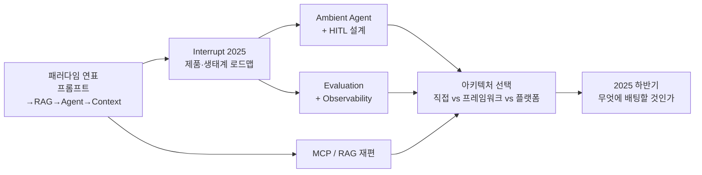
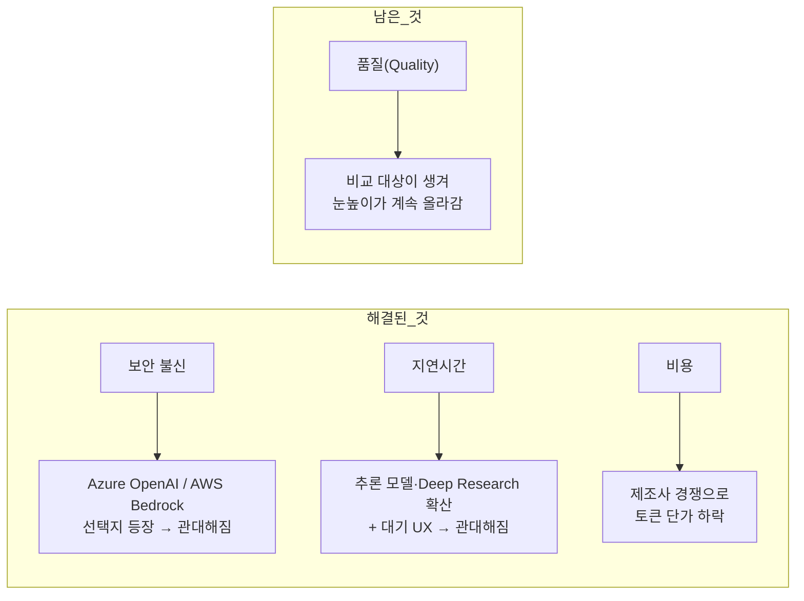

"요즘 트렌드를 어떻게 보시나요"라는 질문에 기술 이름을 나열하면 대개 답이 되지 않는다. 프롬프트 엔지니어링, RAG, 에이전트, MCP — 이름을 순서대로 말하는 것은 목차를 읽는 것이지 판단이 아니다.

이 글은 같은 시기를 **병목의 이동**으로 다시 읽는다. 각 단계는 앞 단계의 병목을 풀면서 새 병목을 만들었고, 그 사슬을 따라가면 "다음에 무엇이 온다"가 아니라 **"지금 무엇이 막혀 있다"**가 보인다. 그리고 사슬 옆에는 네 번의 이동 동안 한 번도 자리를 바꾸지 않은 영역이 셋 있는데, 유행을 타지 않는다는 사실 자체가 그 셋의 성격을 말해 준다. [앞 시리즈](/blog/ai-agent/mcp-a2a-landscape/)가 무엇이 공개됐는가를 셌다면 이 시리즈는 무엇이 요청됐는가를 센다.

글 후반은 그 결과를 우선순위로 뒤집는다. 보안·지연·비용은 엔지니어링이 아니라 시장이 상당 부분 해소해 줬고 **품질만 남았다.** 그 진단이 맞다면 투자 배분이 달라져야 한다.

> 이 글은 **2025년 5월부터 10월까지의 자료를 정리한 것**이다. 서술의 현재 시제는 그 시점을 가리키며, 이후 갱신되지 않았다. 등장하는 회사 사례·서베이 수치·벤치마크는 모두 원 자료의 것이다.

## 용어 정리

| 용어 | 원어 / 표기 | 뜻 |
|---|---|---|
| 프롬프트 엔지니어링 | Prompt Engineering | 모델에 주는 지시문을 다듬어 출력 품질을 끌어올리는 방법 |
| RAG | Retrieval-Augmented Generation | 외부 문서를 검색해 LLM 입력에 붙여 답변을 생성하는 방식 |
| 에이전트 | Agent | LLM이 스스로 도구를 선택·호출하며 다단계로 목표를 수행하는 시스템 |
| 컨텍스트 엔지니어링 | Context Engineering | 모델에 들어가는 맥락 전체(시스템 프롬프트·대화·툴 메시지·문서)를 설계·관리하는 일 |
| MCP | Model Context Protocol | LLM 애플리케이션이 외부 도구·데이터에 붙는 방식을 표준화한 프로토콜 |
| A2A | Agent to Agent | 에이전트끼리 직접 통신·위임하기 위한 프로토콜 계열 |
| Function Calling | Function Calling | 모델이 도구 호출을 구조화된 형태로 출력하는 기능. 에이전트 성능의 핵심 지표 |
| Evaluation | Evaluation / Evals | LLM 애플리케이션의 품질을 정의된 기준으로 측정하는 활동 |
| LLMOps | — | LLM 애플리케이션의 배포·추적·오토스케일링·CI/CD를 다루는 운영 영역 |
| HITL | Human-in-the-Loop | 에이전트 실행 도중 사람의 승인·수정·피드백을 끼워 넣는 설계 |
| Guardrail | AI Guardrail | 입출력을 검열·차단해 위험한 응답이나 권한 밖 접근을 막는 안전장치 계층 |
| Reranker | — | 1차 검색 결과의 순위를 정밀 모델로 다시 매기는 2단계 검색 |

## 이 시리즈의 지도

이 글은 `A`와 `G`를 맡는다. 시작과 끝이 같은 편에 있는 이유는 둘이 같은 질문의 앞뒤이기 때문이다 — 병목이 어디로 옮겨 갔는지 알면 어디에 투자할지가 따라 나온다. 가운데 넷은 각각 [Ambient Agent와 HITL](/blog/ai-agent/ambient-agent-and-hitl/), [평가와 관측](/blog/ai-agent/agent-evaluation-observability/), [MCP와 RAG 재편](/blog/ai-agent/mcp-rag-as-service/), [아키텍처 선택](/blog/ai-agent/build-or-buy-agent-stack/)에 있다.

## 네 시기와 그 사이의 병목

원 자료가 "AI의 기술 발전에 따른 개발 수요 '변화'"라는 제목으로 네 시기를 가른 표다.

| 시기 | 지배 기술 | 개발 요청의 전형 |
|---|---|---|
| 2022 말 ~ 2023 중 | ChatGPT · 프롬프트 엔지니어링 | "챗봇 하나 붙여 주세요" |
| 2023 말 ~ 2024 중 | RAG | "우리 문서 기반으로 답하게 해 주세요" |
| 2024 말 ~ 2025 초 | Agent | "알아서 조사하고 처리하게 해 주세요" |
| 2025 중 ~ 진행 중 | MCP · A2A | "우리 사내 도구랑 다 연결해 주세요" |

오른쪽 열이 이 표의 요점이다. 기술 이름이 아니라 **고객이 실제로 한 말**로 시기를 가르면, 각 시기의 요청이 앞 시기에는 불가능했던 것임이 드러난다.

같은 이동을 병목으로 다시 쓰면 사슬이 된다.

| 단계 | 그 시기의 병목 | 무엇이 해결했나 | 남긴 새 병목 |
|---|---|---|---|
| 프롬프트 엔지니어링 | 모델이 사내 지식을 모름 | — | 지식 주입 수단 부재 |
| RAG | 지식 주입 · 출처 · 할루시네이션 | 검색 + 컨텍스트 삽입 | 문서 파싱 품질, 청크·임베딩 선택, 평가 부재 |
| Agent | 단발 질의응답의 한계 | 도구 호출 + 다단계 실행 | 도구 통합 비용, 신뢰성, 실행 경로 관측 불가 |
| MCP · A2A | 도구 연결이 매번 커스텀 | 프로토콜 표준화 | 권한·인증·가드레일, 도구 선택 품질 평가 |
| 컨텍스트 엔지니어링 | 프롬프트 = 문자열이라는 착각 | 맥락 전체를 설계 대상으로 승격 | 맥락 조립 규칙의 표준 부재 |

> **네 번째 열을 세로로 읽어야 한다.** 각 단계가 남긴 새 병목의 절반이 "평가"와 "관측"이다.
>
> RAG가 남긴 것에 평가 부재가 있고, 에이전트가 남긴 것에 실행 경로 관측 불가가 있고, MCP가 남긴 것에 도구 선택 품질 평가가 있다. 세 시기가 각각 다른 이유로 같은 곳에 도착했다는 뜻이다. 이것이 [평가·관측 편](/blog/ai-agent/agent-evaluation-observability/)이 이 시리즈에서 가장 긴 이유이고, 아래 배팅 우선순위 1위의 근거이기도 하다.

## 네 번의 이동 동안 자리를 바꾸지 않은 셋

트렌드가 네 번 바뀌는 동안에도 계속 수요가 있었던 영역이 셋으로 정리돼 있다.

| # | 영역 | 세부 |
|---|---|---|
| 1 | 도큐먼트 파서 | HWP · PPT · PDF · Word 등 / 표 안의 표 / 이미지(멀티모달 수요) 검색 |
| 2 | 평가(Evaluation) | 적합한 평가 지표 선정 / LLM-as-Judge의 일관성 / 평가지표의 적절성 / 평가용 데이터셋 |
| 3 | LLMOps | Auto-Scaling / CI/CD / 배포 및 운영 / 추적 |

> **셋의 공통점은 모델이 좋아진다고 저절로 해결되지 않는다는 것이다.**
>
> 이 기준이 유용한 이유는 투자 판단에 바로 쓰이기 때문이다. 모델 개선으로 풀리는 문제에 엔지니어링 예산을 쓰면 다음 세대에 그 코드가 버려진다. 반대로 이 셋은 모델이 두 배 좋아져도 스캔 PDF의 표는 여전히 표이고, 평가 데이터셋은 여전히 사람이 만들어야 하고, 배포 파이프라인은 여전히 필요하다. 유행을 타지 않는다는 것은 매력이 없다는 뜻이 아니라 **감가상각이 느리다**는 뜻이다.

## 2024년 — RAG 고도화의 해

병목 사슬의 두 번째 칸을 확대하면 현장에서 무엇이 요청됐는지가 나온다. 먼저 고객이 요청한 것 여덟 가지다.

| # | 요청 |
|---|---|
| 1 | 내부 지식관리 (사내 문서 기반 챗봇) |
| 2 | 고객 응대 챗봇 |
| 3 | 심층 리서치 (Deep Research) |
| 4 | 업무 자동화 |
| 5 | 번역 / 문서 교정 / 이메일 검수 / 정합성 검증 |
| 6 | 경쟁사 조사 |
| 7 | 마켓 분석 / 뉴스레터 |
| 8 | 보고서 작성 |

여덟 중 셋(3·6·7)이 조사와 요약이다. 리서치가 RAG의 첫 킬러 유스케이스였다는 것은 뒤의 서베이에서도 다시 확인된다.

그다음이 그 요청을 받고 깊어진 고민 일곱 가지다.

| # | 현장의 요구 | 성격 |
|---|---|---|
| 1 | "출처 표기해 주세요" | 신뢰 |
| 2 | "지연시간 줄여 주세요" | 성능 |
| 3 | "할루시네이션 발생하면 안 됩니다" | 품질 |
| 4 | "웹 검색 넣어주세요" | 범위 |
| 5 | "온프레미스로 구축해 주세요" | 보안 |
| 6 | "문서가 한 10만 개 정도 됩니다" | 규모 |
| 7 | "표, 표 안의 표, 표 안의 이미지, 다이어그램" | 파싱 |

**요청 표는 여덟 행, 고민 표는 일곱 행인데 두 표는 한 항목도 대응하지 않는다.** 앞의 표는 "무엇을 만들어 달라"이고 뒤의 표는 "만들었더니 무엇이 문제더라"라서, 행 수가 비슷한 것은 우연이다. 그리고 뒤 표의 성격 열을 보면 신뢰·성능·품질·범위·보안·규모·파싱이 전부 다르다 — 한 프로젝트에서 이 일곱을 동시에 요구받는 것이 2024년의 현실이었다는 뜻이다.

그래서 파고든 주제가 다섯이다.

| # | 고도화 주제 |
|---|---|
| 1 | Document Parser |
| 2 | 평가 지표 |
| 3 | 임베딩 / Reranker / Open Model 선택 |
| 4 | 청크 사이즈 결정 |
| 5 | GraphDB (Hierarchical Indexing) |

다섯 중 1번과 2번이 앞의 "자리를 바꾸지 않은 셋"과 겹친다. 2024년에 파고든 것 중 절반이 2025년에도 여전히 수요였다는 뜻이다. 각 주제의 실제 작업은 [문서 파싱의 병목](/blog/rag/document-parsing-bottleneck/)과 [Knowledge Graph와 GraphRAG](/blog/rag/knowledge-graph-and-graphrag/)에 따로 정리돼 있다.

### 국내 현장에서 실제로 나온 질문

기술 스펙이 아니라 설득과 기대치 관리 쪽에 몰려 있다.

| # | 질문 | 이 질문이 진짜 묻는 것 |
|---|---|---|
| 1 | "리더분들을 어떻게 이해시켜야죠?" (RAG를 한 문장으로? Fine Tuning vs RAG?) | 의사결정자 설득 언어 |
| 2 | "답변은 빠르게, 정확도는 높게!" | 트레이드오프 인식 부재 |
| 3 | "데이터 저희는 진짜 많긴 해요" (이미지로 스캔된 PDF…) | 데이터 준비도 |
| 4 | "이거 구축하고 쓰면 쓸수록 AI가 학습해서 더 똑똑해지는 거죠?" | 학습/검색 개념 혼동 |

오른쪽 열이 이 표를 표로 만든 이유다. 왼쪽만 보면 네 개의 다른 질문이지만, 오른쪽으로 옮기면 전부 **한 가지 준비 부족** — 도입 전에 무엇을 합의했어야 하는가 — 을 가리킨다. 4번은 특히 위험한데, 이 오해를 방치한 채 구축하면 운영 6개월 뒤 "왜 안 똑똑해지냐"는 질문을 받는다.

## 무엇이 저절로 해결되었고 무엇이 남았나

| 문제 | 무엇이 해결했나 | 기록된 경위 |
|---|---|---|
| 보안(LLM) | 사회적 분위기 | 기존엔 상용 모델 데이터 유출 불신 → 에이전트 트렌드로 넘어오며 LLM 성능(특히 Function Calling capacity)이 중요해짐 → Azure OpenAI / AWS Bedrock 선택으로 비교적 관대해짐 |
| 지연시간 | 사회적 분위기 | Deep Research·추론 모델 등장 이후 지연에 관대. UX/UI로도 해결 가능("검색중..", "조사중..") |
| 비용 | LLM 제조사 | OpenAI·Anthropic·Google 경쟁 심화로 토큰 비용 하락. 단, 추론·멀티모달 모델은 여전히 고가 |
| **품질** | **미해결** | 고객 눈높이 상승. 비교 가능한 고품질 AI 툴 등장 — "Perplexity는 잘되는데, 이것보다는 성능이 더 좋겠죠…당연히?" |

**도식은 네 갈래인데 표는 네 행이고, 여기서는 개수가 맞는다.** 대신 표에만 있는 것이 "무엇이 해결했나" 열이다. 도식은 결과를 그리고 표는 주체를 적는데, 그 주체가 셋 다 우리가 아니라는 점이 이 절의 논지다 — 보안과 지연은 사회적 분위기가, 비용은 제조사가 풀었다. 엔지니어링이 푼 것은 하나도 없고, 그래서 남은 하나도 저절로 풀리기를 기대할 수 없다.

지연시간 항목에는 UX 처방이 함께 붙어 있다.

> "좋은 질문이네요!", "자, 그럼 이제 조사를 시작할게요~" 와 같이 멘트를 던지면서 시간을 끌어 주는 UX가 사용자의 인내심을 기르는 데 도움이 될 수 있다. — Andrew Ng
>
> 이 처방이 값을 하는 이유는 지연을 **줄이는 대신 견딜 만하게 만드는** 방향으로 문제를 옮기기 때문이다. 응답 시간을 절반으로 줄이는 일은 아키텍처 전체를 건드리지만, 진행 상황을 흘려보내는 일은 스트리밍 한 겹이다. 어느 쪽이 먼저인지는 대개 명확한데도 반대로 착수하는 경우가 많다.

> **세 문제가 "저절로" 풀렸다는 서술의 실전 함의는 리소스 배분이다.**
>
> 보안 우려로 자체 모델을 고집하고, 지연시간 최적화에 분기 예산을 쓰고, 토큰 비용을 아끼려 프롬프트를 깎는 작업 — 이 셋이 2024년에는 값을 했지만 2025년에는 이미 시장이 상당 부분 해소한 영역이다. 같은 인력을 품질 측정 체계로 옮기는 것이 이 진단의 결론이고, 그래서 이 시리즈에서 평가·관측이 가장 큰 자리를 차지한다.

## 2025년 하반기 시점의 배팅 우선순위

아래 순위는 원 자료가 표로 제공한 것이 아니라 앞 절들을 근거로 정리한 판단이다. "근거" 열이 원 자료 대응 지점이다.

| 순위 | 배팅 대상 | 왜 | 근거 |
|---|---|---|---|
| 1 | **평가·관측 체계** | 유일하게 해결되지 않은 문제가 품질이고, 트렌드가 바뀌어도 남는 수요 | 「자리를 바꾸지 않은 셋」 2번 / 「무엇이 남았나」 품질 행 / [서베이 1위 41%](/blog/ai-agent/build-or-buy-agent-stack/) |
| 2 | **컨텍스트 엔지니어링** | 프롬프트를 문자열이 아니라 조립 대상으로 보는 관점 자체가 자산 | [Agent의 미래 3대 명제 중 2번](/blog/ai-agent/ambient-agent-and-hitl/) |
| 3 | **HITL 설계 역량** | 신뢰도를 올리는 가장 확실한 수단이면서 조직 승인 프로세스와 직결 | [승인 게이트 4종](/blog/ai-agent/ambient-agent-and-hitl/) |
| 4 | **도큐먼트 파서** | 4년째 사라지지 않은 수요. 멀티모달로 난이도만 올라감 | 「자리를 바꾸지 않은 셋」 1번 |
| 5 | **LLMOps (배포·추적·CI/CD)** | 프로토타입과 프로덕션 사이 절벽을 메우는 일 | 「자리를 바꾸지 않은 셋」 3번 / "getting to production is hard" |
| 6 | **멀티 에이전트 설계 패턴** | 대형 기술기업이 PoC를 끝내고 도입 중인 단계 | [산업 현황](/blog/ai-agent/build-or-buy-agent-stack/) |

**여섯 중 셋(1·4·5)이 "자리를 바꾸지 않은 셋"과 그대로 겹친다.** 순위를 다시 세운 것이 아니라 같은 결론에 다른 경로로 도착한 것이고, 나머지 셋(2·3·6)은 2025년에 새로 올라온 항목이다.

### 배팅하지 말아야 할 것

| 항목 | 자료의 태도 |
|---|---|
| MCP 자체를 역량으로 내세우기 | "MCP는 그냥 도구일 뿐". 통합 비용을 낮췄을 뿐 새 능력이 아님 |
| 완벽한 평가 지표 설계 | "완벽한 평가 지표를 만들려고 너무 많은 노력을 쏟고 있음". 20분 평가부터 시작하라 |
| 지연시간 최적화 과투자 | 추론 모델 확산으로 사용자 인내심이 늘었고 UX로도 해결 가능 |
| 보안 우려로 인한 자체 모델 고집 | Azure OpenAI / AWS Bedrock 선택으로 관대해진 흐름 |
| 일회성 솔루션 | "Building a one off solution is not sufficient" |

> **두 표를 나란히 놓으면 두 번째 행이 서로 모순처럼 보인다.** 위 표는 평가·관측이 1순위라고 하고, 아래 표는 평가 지표에 과투자하지 말라고 한다.
>
> 모순이 아니라 순서의 문제다. 평가 **체계**를 세우는 것과 완벽한 평가 **지표**를 설계하는 것은 다른 작업이고, 후자에 매달리면 전자가 착수되지 않는다. 거친 평가라도 먼저 돌리고 실사용 데이터로 정교화하라는 것이 자료 전체의 권고이며, 그 절차를 7단계로 편 것이 [평가·관측 편](/blog/ai-agent/agent-evaluation-observability/)이다.

---

여기까지가 지형이다. 병목이 네 번 옮겨 갔고, 지금 막혀 있는 곳은 품질이며, 유행을 타지 않는 세 축이 그 옆에 있다.

그런데 이 진단은 자료의 절반만 쓴 것이다. 나머지 절반은 같은 시기에 벌어진 **제품 형태의 변화**다 — 사람이 채팅창에 말을 걸어야 움직이는 에이전트에서, 배경에서 이벤트를 받아 상시 동작하며 필요할 때만 사람을 부르는 에이전트로. [다음 편](/blog/ai-agent/ambient-agent-and-hitl/)에서 그 전환과, 승인을 Yes/No가 아니라 네 갈래로 나눈 설계를 다룬다.
