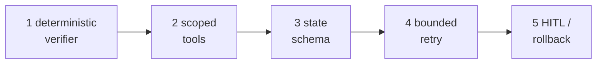
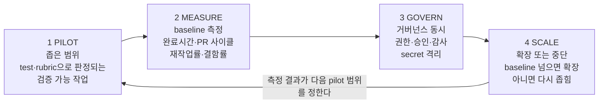
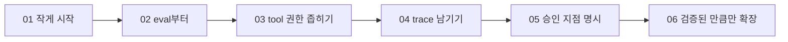
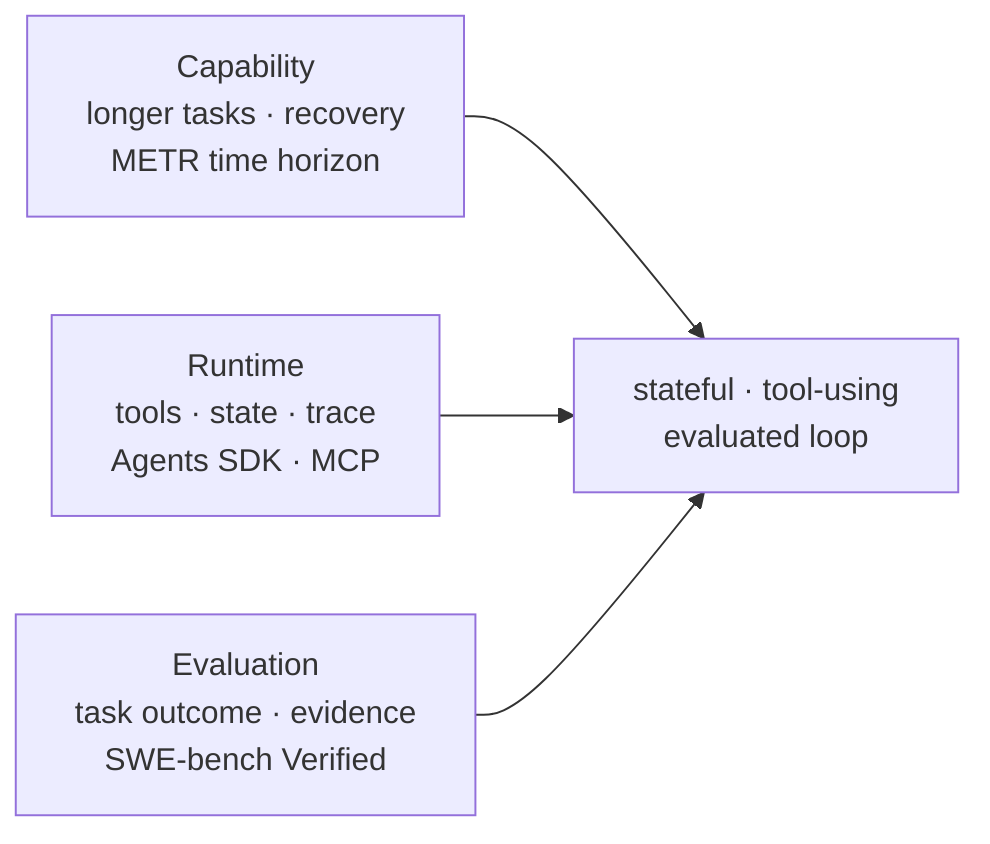
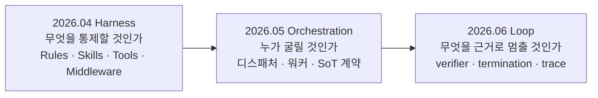

루프가 이상하게 동작할 때 가장 먼저 나오는 가설은 대개 "모델이 별로다"이다. 그런데 실제로 잡히는 원인의 대부분은 앞의 세 자리 — 종료 조건, 상태 반영, 예산 경계 — 에 있다. 모델 교체는 가장 비싸고 가장 늦게 검토해야 할 선택지다.

이 글은 그 진단 순서를 고정한다. 루프가 무너지는 열 가지 방식을 증상·원인·해결로 세우고 **가장 비싼 조합**을 지목한 뒤, 여섯 단계 진단 체크리스트와 남겨야 할 트레이스 필드로 내려간다. 후반은 조직 쪽이다 — 도입 자체를 하나의 루프로 다루는 절차, 그리고 근거의 강도를 다섯 종으로 나눠 남의 사례 수치를 자사 예측으로 직결하는 실수를 막는 법. [앞 편](/blog/ai-agent/minimal-loop-design-surfaces/)이 여덟 개 설계 표면을 세웠다면 이 글은 그 표면들이 무너지는 자리를 짚고, 시리즈의 마지막 편이라 [세 자료를 관통하는 서사](/blog/ai-agent/agent-equals-model-plus-harness/)로 닫는다.

> 이 글은 **2026년 4월부터 6월까지의 자료를 정리한 것**이다. 인용된 통계·벤치마크·벤더 주장은 근거 강도가 서로 다르며, 아래 「근거 강도 구분」 절이 그 차이를 표로 정리한다.

## 용어 정리

앞 편들의 용어표에서 이 글이 쓰는 행만 추리고, 실패 모드 용어를 더했다.

| 용어 | 원어 / 표기 | 뜻 |
|---|---|---|
| Context rot | Context rot | 오래되거나 상충하거나 과다한 이력이 쌓여 모델 품질이 떨어지는 현상 |
| Compaction | Compaction | 컨텍스트가 임계치를 넘으면 요약본으로 치환해 창을 확보하는 기법 |
| Observation noise | — | 도구 출력의 원본 덤프가 그대로 되돌아와 다음 추론을 오염시키는 상태 |
| Memory poisoning | — | 외부 콘텐츠의 악성 지시가 신뢰된 지시처럼 저장·재사용되는 공격 |
| Denial of wallet | — | 비용을 고갈시키는 것을 목적으로 하는 공격 유형 |
| Bounded retry | — | 최대 반복·타임아웃·비용 상한을 건 재시도 |
| Golden dataset | — | 정답이 확정된 회귀 검증용 평가셋 |
| DORA 지표 | — | 배포 빈도·변경 리드타임·변경 실패율·복구 시간으로 전달 성과를 재는 지표 체계 |
| Verifier | 검증기 | 종료 조건을 판정하는 관찰 가능한 증거 장치. 정의는 [앞 편](/blog/ai-agent/minimal-loop-design-surfaces/) |

## 루프가 무너지는 열 가지 방식

| 안티패턴 | 증상 | 근본 원인 | 해결 |
|---|---|---|---|
| **검증기 없는 루프** | 에이전트가 "완료"라는데 결과가 틀림 | 모델의 자기 선언을 종료 조건으로 씀 | 테스트·정적 검사·사람 게이트를 종료 조건으로 |
| **상태 없는 재시도** | 같은 실패를 반복 | 실패 증거가 다음 상태에 반영 안 됨 | 검증기 피드백을 **상태에 덧붙임** |
| **무한 루프 · 비용 폭주** | 멈추지 않고 토큰만 소모 | 최대 반복·타임아웃·예산 부재 | **제한된 재시도 + 중단 사유 기록** |
| **Context rot** | 긴 작업 후 품질 급락, 엉뚱한 참조 | 오래된·상충·과다 이력 누적 | 압축·선택·격리 · **compaction** 도입 |
| **Observation noise** | 실패 후 모델이 헤맴 | 원본 로그 전체를 그대로 되돌림 | 실패 요약·종료 코드·핵심 트레이스만 구조화 |
| **권한 과다** | 의도치 않은 쓰기·삭제·외부 호출 | 범위 제한 도구·승인 게이트 부재 | 최소 권한 · 고위험 행동 승인 |
| **도구 옆 가드레일 부재** | 관리자 에이전트는 통과했는데 하위 도구가 위험한 부작용 실행 | 에이전트 수준 가드레일만 믿고 **도구 호출 지점 검증 생략** | 부작용 도구 **옆에** 인자·결과 검증과 승인 중단 배치 |
| **메모리·컨텍스트 오염** | 이전 세션·검색·도구 결과의 악성 지시가 다음 실행까지 영향 | 외부 콘텐츠를 **신뢰된 지시처럼** 저장·재사용 | 메모리 격리 · TTL/크기 제한 · 정제 · 출처 감사 |
| **멀티에이전트 분산** | 병합 시 충돌·일관성 붕괴 | 전체 트레이스 미공유, 쓰기 소유권 불명확 | 단일 작성자 + 병합 검증기, 또는 트레이스 공유 |
| **캐시 파괴** | 지연·비용 급증 | 대화 중 도구 목록·모델·접두사 변경 | 변경은 **새 메시지 덧붙이기**로 접두사 보존 |

> **가장 비싼 조합은 검증기 없는 루프 + 상태 없는 재시도다. 비용은 선형으로 늘고 품질은 그대로다.**
>
> 이 조합이 위험한 이유는 겉으로 정상 동작처럼 보이기 때문이다. 에러도 나지 않고 로그도 쌓이며 에이전트는 계속 무언가를 한다. 다만 나아지지 않을 뿐이다. **자율성을 올리기 전에 이 둘부터 막아야 하고**, 순서가 반대면 자율성이 커진 만큼 낭비도 커진다.

열 항목을 원인별로 묶으면 넷이 된다 — 종료 조건 계열(1·3), 상태 계열(2·4·5), 권한 계열(6·7·8), 구조 계열(9·10). **셋째 묶음이 가장 크다**는 점이 2026년 담론의 무게중심을 보여준다.

| 출처 | 내용 |
|---|---|
| **OWASP Agentic Applications 2026** | 에이전트가 계획·행동·결정을 수행하는 복합 워크플로를 **별도 보안 대상**으로 다룬다 |
| **AI Agent Security Cheat Sheet** | `도구 남용` · `권한 상승` · `메모리 오염` · `과도한 자율성` · `denial of wallet`을 명시. 최소 도구 권한 · 신뢰 수준별 도구 세트 · 고위험 행동 승인 · 비용/재시도/도구 체인 상한 권장 |
| **가드레일 가이드** | 관리자형 워크플로에서는 에이전트 수준 가드레일만 믿지 말고, **부작용을 만드는 도구 가까이에** 검증과 승인을 두라 |

## 모델을 바꾸기 전에 좁히는 순서

루프가 이상하게 동작하면 아래 순서로 좁힌다. **대부분의 문제는 1~3번에서 잡힌다.**

| # | 확인 항목 | 판정 |
|---|---|---|
| 1 | **종료 조건** — 에이전트의 "done"이 무엇으로 판정되나? | **모델 문장이면 그게 1차 원인** |
| 2 | **상태 반영** — 직전 실패 증거가 다음 호출의 컨텍스트에 실제로 들어갔나? | 트레이스로 확인 |
| 3 | **예산 경계** — 최대 반복·타임아웃·비용 상한·중단 사유가 정의돼 있나? | 없으면 비용 폭주 |
| 4 | **관찰 형태** — 도구 출력이 요약·구조화돼 있나, 원본 덤프인가? | 원본 덤프면 오염 |
| 5 | **컨텍스트 크기** — 프롬프트가 비정상적으로 커졌나? 압축 시점인가? | context rot 의심 |
| 6 | **권한 경계** — 도구 권한이 작업에 필요한 최소로 좁혀져 있나? | 과다면 보안 위험 |

여섯 항목이 앞 절 안티패턴과 대응하지만 순서가 다르다. 안티패턴 표는 **비용순**이고 이 표는 **확인 비용순**이다 — 종료 조건은 코드 한 줄로 답이 나오고 권한 경계는 전수 조사가 필요하다.

디버깅에 꼭 남길 트레이스 필드는 여섯이다.

```text
trace.fields
step         n
state_in     {budget, done, last_proof}
action       tool_name, args, scope
observation  exit_code, summary, error_kind
proof        verifier_result, failures[]
decision     continue | retry | handoff | stop(reason)
```

> **트러블슈팅 원칙: "모델이 왜 그랬을까"로 시작하지 않는다.**
>
> 트레이스를 펼쳐 **어떤 상태와 관찰, 검증기 결과가 그 행동을 만들었는지**부터 본다. 위 여섯 필드가 재구성에 필요한 최소 집합이고, 특히 `stop(reason)`이 결정적이다 — 중단 사유가 없으면 성공한 종료와 예산 소진을 구분할 수 없어 성공률 통계 자체가 무의미해진다. **재현 가능한 트레이스가 없으면 디버깅이 아니라 추측이다.**

## 도입 체크리스트

### 기술 레벨 — 최소 루프 다섯 단계

도구 선택은 마지막 문제다. 성공 기준·상태·권한·관찰 형식·검증기·종료 조건을 먼저 정한다.



| # | 단계 | 목표 | 다음 단계로 가는 조건 |
|---|---|---|---|
| 1 | **결정론적 검증기** | 테스트·린트·루브릭·사람 게이트 정의 | 실패가 **기계적으로 관찰**된다 |
| 2 | **범위 제한 도구** | 읽기/쓰기/실행 권한을 분리 | 부작용과 시크릿 노출이 통제된다 |
| 3 | **상태 스키마** | 트레이스·관찰·결정·산출물 구조화 | 재개·디버깅·요약이 가능하다 |
| 4 | **제한된 재시도** | 최대 반복·타임아웃·비용 상한 설정 | 실패가 무한 반복되지 않는다 |
| 5 | **사람 개입 / 롤백** | 고위험 변경 승인과 복구 경로 확보 | 운영 환경에서 안전하게 확장 가능하다 |

**네 번째 열이 이 표의 값어치다.** 각 단계의 완료 판정이 "했다"가 아니라 **관찰 가능한 조건**으로 적혀 있어서, 단계를 건너뛰었는지를 스스로 확인할 수 있다.

```text
custom_loop.py · 직접 작성
spec  = load_task_contract(goal, success_criteria, risk_policy)
state = pack_context(spec, repo_snapshot, memory, budget)
while budget.ok() and not state.done:
    action = policy.choose_next(state)
    obs    = guarded_tools.run(action)      # scoped, timed, logged
    proof  = verifier.check(obs, spec)
    state  = update_state(state, obs, proof)
    if proof.requires_human:
        break                                # 고위험 변경은 사람에게 handoff
return artifact, trace, proof, stop_reason
```

검증을 루프에 넣는 evaluator-optimizer 템플릿은 그래프 프레임워크에서 이렇게 생겼다.

```python
def route(state) -> Literal["Accepted", "Rejected + Feedback"]:
    return "Accepted" if state["grade"] == "pass" else "Rejected + Feedback"

builder.add_edge(START, "generate")
builder.add_edge("generate", "evaluate")
builder.add_conditional_edges("evaluate", route, {
    "Accepted": END,
    "Rejected + Feedback": "generate",   # 피드백을 들고 다시 생성
})
```

주석 한 줄이 요점이다 — **피드백을 들고** 다시 생성한다. 그냥 되돌아가면 앞 절의 "상태 없는 재시도"가 된다.

### 조직 레벨 — 도입 자체가 루프다

pilot이 행동, 측정이 관찰, 채택 기준이 검증기, 확장 또는 중단이 계속/중지다.



| 단계 | 실행 지침 |
|---|---|
| **좁은 범위 선택** | 성공이 테스트나 루브릭으로 판정되는 작업 1~2개. **자율성보다 검증 가능성이 기준**. 테스트가 있는 버그 수정, 마이그레이션, 보일러플레이트 생성, 로그 분석이 첫 파일럿에 적합 |
| **기준선 측정** | 도입 **전에** 완료 시간·PR 사이클·재작업률·결함률을 기록. 비교 대상 없는 효과 주장은 무의미 |
| **거버넌스 동시 설계** | 권한 범위·승인 게이트·감사 로그·시크릿 격리를 **파일럿 단계에서 같이** 붙인다. 확장 후에 붙이면 늦다 |
| **확장 또는 중단** | 측정값이 기준선을 명확히 넘으면 인접 작업으로 확장, 아니면 범위를 다시 좁힌다 |

> **세 번째 단계의 순서가 이 절의 핵심 주장이다 — 거버넌스를 확장 후가 아니라 파일럿과 동시에 설계한다.**
>
> 근거는 [앞 편의 통계](/blog/ai-agent/self-evolving-harness-governance/)에 있다. 파일럿 78%, 프로덕션 14%, 실패의 89%가 비기술 요인. 파일럿은 거버넌스 없이도 성공하고 프로덕션은 그렇지 않으므로, 나중에 붙이는 계획은 64포인트 격차를 그대로 재생산한다. 도식의 되돌림 화살표도 같은 성격이다 — 측정 결과가 **다음 파일럿의 범위**를 정한다는 것은 실패한 파일럿에도 산출물이 있다는 뜻이다.

### 근거 강도를 구분한다

| 지표 | 수치 | 근거 종류 | 읽는 법 |
|---|---|---|---|
| 과제 완료 시간 (코딩 어시스턴트 RCT) | 대조군 대비 **55.8% 빠름** | **통제 실험** | 표준화 과제 한정. 모든 업무로 일반화 불가 |
| 조직 비용 절감 (Stanford AI Index 2025) | 서비스 운영 **49%**, 공급망 **43%**, SW 엔지니어링 **41%**가 절감 보고. **대부분 10% 미만 폭** | **공식 통계** | 절감 **"여부"** 비율이지 평균 절감률이 아님 |
| 작업 시간 지평 (METR 2025) | 약 **7개월마다 2배** | **벤치마크 연구** | 긴 작업일수록 루프·평가가 필수라는 구조적 근거 |
| AI 코딩 도구 사용 (Stack Overflow 2025) | 전문 개발자 다수가 사용 또는 도입 예정 | **대규모 설문** | 사용 의향이지 생산성 증거는 아님 |
| 제품 도입 규모 주장 | "엔지니어링 시간 90% 감소" 류 | **벤더 · 언론 보도** | 독립 검증 ROI가 아니라 **채택 신호로만** |

같은 자료가 보고한 배경 수치로, 2024년 미국 민간 AI 투자는 **1,091억 달러**, 글로벌 생성형 AI 민간 투자는 **339억 달러**였고, 조직의 AI 사용은 2023년 **55%**에서 2024년 **78%**로 늘었다.

> **가장 흔한 실수는 남의 사례 수치를 자사 ROI 예측으로 직결하는 것이다.**
>
> 두 번째 행이 특히 오독되기 쉽다. "49%가 절감했다"는 절감을 경험한 조직의 **비율**이지 평균 49%를 아꼈다는 뜻이 아니고, 실제 절감 폭은 대부분 10% 미만이다. 공개 수치는 방향 신호일 뿐이고, 실제 효과는 **어떤 작업을 루프화하고 어떤 검증·승인 경계를 뒀는지**가 가른다.

### 산출량이 아니라 결과를 센다

| ✕ 피해야 할 지표 (활동) | ✓ 봐야 할 지표 (결과) | 이유 |
|---|---|---|
| 생성된 코드 라인 수 | 변경 리드타임 · PR 사이클 타임 | 산출량은 가치가 아니다 |
| 수락된 AI 제안 건수 | 재작업률 · 변경 실패율 | 수락이 정답을 보장하지 않는다 |
| 일회성 데모 성공 | 결함 탈출률 · 사고 빈도 | 운영 안정성이 진짜 비용을 가른다 |
| 주관적 만족도 단독 | 만족도 + 객관 결과 지표 병행 | 체감과 효과는 어긋날 수 있다 |

왼쪽 넷의 공통점은 **측정이 쉽다**는 것이고, 그래서 대시보드에 먼저 올라간다. **ROI를 묻기 전에 검증기부터 만든다** — 결과를 테스트·리뷰·운영 지표로 판정할 수 없는 작업은 효과도 증명할 수 없으며, 이는 **측정 가능한 작업이 루프화에 적합한 작업**이라는 앞 편의 기준과 같은 말이다. DORA 지표와 묶으면 속도와 안정성을 함께 본다.

### 여섯 줄로 압축한 운영 원칙



```text
loop-designer.operating-principles
start with a small task and explicit success criteria
build deterministic eval before autonomy
scope tools by least privilege and reversible side effects
trace state, actions, observations, verifier evidence
expand only when the loop improves outcome, not vibes
```

**도식은 여섯 마디인데 원칙 코드는 다섯 줄이다.** 5·6번이 코드의 마지막 줄 하나로 합쳐지는데, 승인 지점을 명시하는 것과 검증된 만큼만 확장하는 것이 실행상 같은 동작이기 때문이다. 이름은 바뀌어도 이 원칙은 남는다 — 프롬프트가 아니라 **검증 가능한 반복 시스템을 작게 설계하고 안전하게 확장하는 능력**.

## 무엇을 더 읽을 것인가

단일 "Loop Engineering 논문"은 없다. 여섯 종류의 루프 조합으로 본다.

| 분류 | 대표 자료 | 가져갈 설계 원리 |
|---|---|---|
| **행동 루프** | ReAct · SWE-agent | 행동 결과를 관찰로 받아 다음 추론·상태에 반영 |
| **도구 루프** | Toolformer · ReAct · 내장 도구 문서 | 도구 스키마·호출 시점·출처·부작용 경계 설계 |
| **자기수정 루프** | Self-Refine · Reflexion | 피드백은 로그가 아니라 **다음 시도의 구조화된 상태** |
| **탐색 루프** | Tree of Thoughts | 분기는 품질을 살 수 있지만 토큰 예산과 가지치기가 필요 |
| **장기 경험 루프** | Voyager | 반복 경험을 재사용 스킬·메모리로 축적할 때 **상태 설계가 중요** |
| **평가 루프** | SWE-bench Verified · METR time horizon | 최종 산출물이 실제 작업을 끝냈는지를 테스트·부분집합·시간 지평으로 판정 |

| 학습 단계 | 추천 자료 | 쓰는 법 |
|---|---|---|
| **시스템 관점** | Chip Huyen 『AI Engineering』 · "Agents" | 에이전트를 도구·환경·평가 문제로 보는 기본 프레임 |
| **패턴 · 가드레일** | Anthropic "Building effective agents" | 워크플로 vs 에이전트 · evaluator-optimizer · ACI · **단순성 원칙** |
| **실습 온램프** | Hugging Face Agents Course | 기초 → 프레임워크 → 유스케이스 → 벤치마크, 관측·평가 보너스 유닛 |
| **그래프 런타임 구현** | LangChain Academy 트랙 | 상태 스키마 · 메모리 · 중단/사람 개입 · 배포 · MCP 리서치 에이전트 · 멀티에이전트 |
| **SDK · 런타임 구현** | OpenAI Agents SDK | 에이전트 루프 · 샌드박스 워크스페이스 · 세션 · 오케스트레이션 · 핸드오프 · 가드레일 · MCP · 트레이싱 |
| **개발자 서사** | Karpathy "Software Is Changing (Again)" | Software 3.0 · 부분 자율성 · 사람-AI 협업 루프 |

> **출처 위생 — 출판사 설명만으로 핵심 주장을 근거화하지 않는다.**
>
> 추천 목록에는 넣되 핵심 주장에는 논문·공식 문서·저자 원문·저장소를 우선한다. 커뮤니티도 같다. 큐레이션 목록·포럼·저장소 토픽은 **새 도구 발견에는 좋지만 사실 근거로는 약해서**, 거기서 찾은 항목은 공식 문서나 논문으로 역추적한 뒤에 인용한다.

| 축 | 대표 | 따라볼 이유 |
|---|---|---|
| AI 엔지니어링 · 평가 | **Chip Huyen** | 에이전트를 프로덕션 AI 시스템의 한 부분으로 다룬다 |
| 에이전트 패턴 · 가드레일 | **Anthropic** | 워크플로·에이전트·평가자·ACI·MCP를 공식 문서로 제공 |
| 소프트웨어 패러다임 | **Andrej Karpathy** | Software 3.0 · 부분 자율성 · 에이전트를 위한 설계 서사 |
| 에이전틱 엔지니어링 | **Addy Osmani** | AI 보조 코딩을 명세·테스트·리뷰·CI 규율과 연결 |
| 런타임 · 커뮤니티 | **LangChain · Hugging Face · OpenAI** | 실습 과정·SDK·런타임 프리미티브가 빠르게 갱신 |
| 코딩 벤치마크 | **SWE-bench · SWE-agent · Cognition** | 실제 저장소 이슈·ACI·제품화된 워크플로의 기준 제공 |

## 세 축은 하나로 수렴한다



"Loop Engineering"이 표준 용어가 되는지는 중요하지 않다. 분명한 것은 **능력·런타임·평가가 하나의 운영 루프로 수렴**한다는 점이다.

> 개발자의 역할도 그 수렴을 따라간다 — **모델에게 한 번 잘 말하는 사람**에서 **실패를 관찰·복구하며 검증 가능한 단위로 자율성을 안전하게 확장하는 사람**으로.
>
> 루프의 목표는 **사람을 제거하는 것이 아니라**, 사람이 아키텍처·품질·정확성을 소유한 채 반복 작업을 위임 가능하게 만드는 것이다. AI 보조 코딩 담론도 같은 결론에 닿는다 — **검토 없이 산출물을 받아들이는 방식은 프로토타이핑으로 제한**하고, 전문 워크플로에서는 명세·작업 범위·diff 리뷰·테스트·버전 관리·CI·문서화·모니터링을 유지한다. 자율성이 커질수록 규율은 줄지 않고 늘어난다.

## 조직에 옮기면 무엇이 되는가

| 주장 | 조직에 미치는 함의 | 첫 90일에 할 일 |
|---|---|---|
| 종료 조건은 모델의 "done"이 아니라 **관찰 가능한 증거** | AI 산출물 수용 기준을 사람의 감이 아니라 **기계 판정**으로 바꿔야 함. 리뷰 병목이 줄어듦 | AI가 생성한 PR의 머지 기준을 "테스트 통과 + 정적 분석 통과"로 명문화. 리뷰어 승인만으로 머지하는 경로 차단 |
| 가장 비싼 조합 = 검증기 없는 루프 + 상태 없는 재시도 | 자동화 비용이 조용히 새는 전형. **비용은 늘고 품질은 그대로** | 현재 도는 자동화의 재시도 로직을 감사. 실패 증거가 다음 시도에 전달되지 않는 곳을 찾아 우선 수정 |
| 첫 질문은 "얼마나 자율적인가"가 아니라 "실패하면 무엇이 멈추고 누가 승인하는가" | 자율성 논쟁을 **운영 설계 논쟁으로 전환**. 경영진 설득 프레임이 바뀜 | 자동화 제안서 템플릿에 네 칸 추가: 실패 시 정지 범위 / 기록 / 승인자 / 성공 증거 |
| 도구 선택은 마지막 문제, 루프 소유권이 먼저 | 벤더 비교로 시작하는 도입 프로세스를 뒤집는다. **소유 경계를 먼저 정하고 도구를 고른다** | 도구 검증 전에 "우리가 절대 외부에 넘기지 않을 것(트레이스·평가·권한)" 목록을 확정 |
| 도입 자체가 루프: pilot → measure → govern → scale | 전사 일괄 배포 방식의 실패를 예방. **거버넌스를 파일럿에 동시 설계** | 첫 파일럿 범위를 테스트가 있는 작업 1~2종으로 제한하고, 승인·감사·시크릿 격리를 같은 스프린트에 넣는다 |
| 활동 지표(코드 라인·수락 건수) 금지, 결과 지표만 | 생산성 보고의 신뢰도가 올라감. **재작업률·변경 실패율**이 핵심 지표 | 성과 대시보드에서 활동 지표를 제거하고 리드타임·재작업률·변경 실패율·결함 탈출률로 교체 |
| 근거 강도 구분 (통제실험 / 공식통계 / 벤치마크 / 설문 / 벤더주장) | 의사결정 회의에서 **수치의 출처를 묻는 문화**가 생김. 과잉 기대 예방 | 기술 도입 제안서에 근거 종류 라벨 필수화. 벤더 수치는 목표치로 쓰지 않는 원칙 명문화 |
| 멀티에이전트 전에 상태 스키마·소유권·병합 검증기부터 | 에이전트를 늘리는 방향의 아키텍처 결정을 제어. **병렬성은 검증 가능한 작업 분할의 결과** | 멀티에이전트 제안이 오면 쓰기 소유권 다이어그램과 병합 검증 방법을 먼저 요구 |
| 보안: 생산성 루프 = 공격 표면 루프 | AI 자동화가 보안 심사 대상이 됨. **도구 옆에 가드레일** 배치가 표준 | 자동화가 쓰는 도구 권한을 전수 조사해 읽기/쓰기/실행으로 분리. 쓰기·배포 도구는 승인 게이트 뒤로 |
| 사람이 남는 곳 = 아키텍처 · 품질 · 정확성 | 역량 개발 방향과 평가 기준의 재설계 근거 | 시니어 이상 평가에 "검증 설계 품질"과 "되돌리기 비싼 결정의 품질" 항목 추가 |

열 행 중 여섯의 세 번째 열이 **감사·전수 조사·목록 확정**으로 시작한다. 새로 만드는 것보다 이미 도는 것을 들여다보는 일이 앞선다는 배치이며, 이것이 이 시리즈 전체의 실행 지침이기도 하다.

## 세 자료를 관통하는 하나의 서사

세 달치 자료는 독립 발표처럼 보이지만 **같은 문제의 세 단면**이다.



| 축 | 2026.04 Harness | 2026.05 Orchestration | 2026.06 Loop |
|---|---|---|---|
| 핵심 질문 | 모델 외부에서 **무엇을 통제**하나 | **누가 일감을 분배**하나 | **무엇을 근거로 멈추나** |
| 문제 진단 | 방식의 고정성 | 위임 격차(신뢰·구조) | 평가 질문의 이동 |
| 핵심 장치 | Rules · Skills · Eval · Memory | 단일 디스패처 · 워커 격리 · 승인 게이트 | verifier · 종료 조건 · trace |
| 사람의 위치 | 진화 루프의 **설계자** | 결정에만 개입하는 **판단자** | 아키텍처·품질·정확성의 **소유자** |
| 조직 자산 | 평가셋 · SKILL 카탈로그 | 스킬 · SoT 계약 | trace · 기준선 · 검증 가능한 작업 목록 |
| 반복되는 경고 | 켜두면 저절로 되는 게 아니다 | 벤더 수치는 참고치, 자체 검증 필요 | 남의 수치를 자사 ROI로 직결하지 말 것 |

여섯 행 중 네 번째가 이 시리즈의 서사다. 설계자 → 판단자 → 소유자로 사람의 위치가 옮겨 가는데, 승격이 아니라 **같은 사람이 세 층에서 하는 서로 다른 일**이다. 편으로 대응시키면 첫 두 편이 왼쪽 열, [세 번째](/blog/ai-agent/delegation-gap/)·[네 번째 편](/blog/ai-agent/single-dispatcher-worker-isolation/)이 가운데, 마지막 세 편이 오른쪽이다.

| # | 공통 메시지 | 각 자료의 표현 |
|---|---|---|
| 1 | **검증이 없으면 시스템이 아니다** | 04: "Eval이 없으면 Harness가 아니다" / 05: "ADR·리뷰 필수 게이트" / 06: "ROI를 묻기 전에 verifier부터" |
| 2 | **자율성과 거버넌스는 한 쌍** | 04: "자기진화 × 거버넌스, 하나만 빠져도 작동 안 함" / 05: "완전자율 ≠ 무인 방치" / 06: "실패하면 무엇이 멈추고 누가 승인하는가" |
| 3 | **해자는 도구가 아니라 축적된 조직 자산** | 04: "흡수되지 않을 자산 — 데이터·평가셋·조직구조·도메인 SKILL" / 05: "엔진은 공용, 레이스카는 우리 것" / 06: "자사 기준선 측정값을 우선" |

세 메시지가 각각 세 번 반복됐다는 것이 이 표의 정보다. 서로 다른 문제를 다루는 세 자료가 독립적으로 같은 결론에 도착했다면, 그것은 특정 도구나 시기의 특성이 아니라 **에이전트를 운영한다는 일 자체의 성질**일 가능성이 높다.

---

일곱 편에 걸쳐 2026년 하반기의 논의를 정리했다. 모델은 상향 평준화됐고 차이는 하네스에서 나며, 하네스는 스스로 진화하되 거버넌스와 짝을 이뤄야 하고, 위임 격차는 신뢰의 구조로 메우며, 자율 실행은 단일 디스패처와 결정 로그로 감사 가능하게 만들고, 루프는 여덟 표면을 가진 런타임 계약이며, 무너질 때는 열 가지 방식 중 하나다.

이 카테고리에는 앞서 프레임워크 비교부터 멀티에이전트 패턴까지의 구현 계보가 [따로 정리](/blog/ai-agent/agent-pattern-catalog/)돼 있다. 도구를 고르는 문제와 루프를 소유하는 문제는 층위가 다르므로, 두 계열을 나란히 읽으면 어느 결정이 어느 층에 속하는지가 분명해진다.
