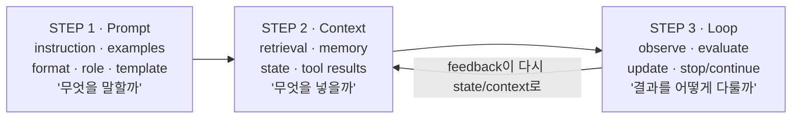
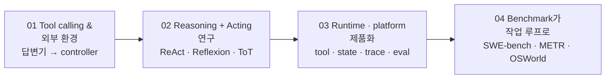
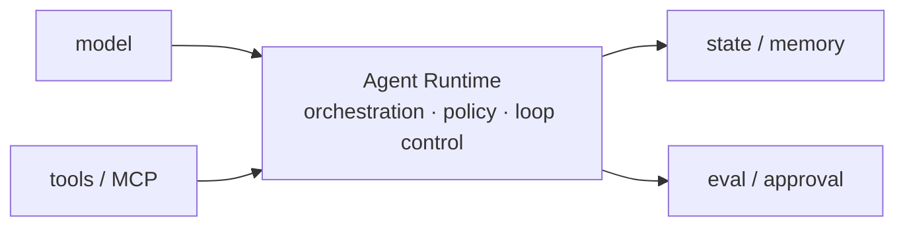

새 용어가 나올 때마다 물어야 할 것은 "이게 뭔가"가 아니라 "무엇이 바뀌어서 이 말이 필요해졌나"다. **Loop Engineering**도 마찬가지다. 이 이름은 아직 학술 표준 용어가 아니고, 자료 자신이 그 점을 반복해서 못 박는다. 그럼에도 다룰 값이 있는 이유는 이름이 아니라 이름이 가리키는 이동에 있다.

이 글은 그 이동을 두 축으로 정리한다. 하나는 **역사** — AI 애플리케이션의 제어 표면이 프롬프트(무엇을 말할까)에서 컨텍스트(무엇을 넣을까)로, 다시 루프(결과를 어떻게 다룰까)로 넓어진 경로. 다른 하나는 **촉발 요인 넷** — 도구 호출, 추론과 행동을 묶은 연구 흐름, 런타임의 제품화, 그리고 벤치마크가 묻는 질문의 변화. 마지막이 특히 결정적인데, 평가 기준이 "정답 텍스트를 냈는가"에서 "실제 작업을 끝냈는가"로 옮겨 갔기 때문이다.

[앞 편](/blog/ai-agent/single-dispatcher-worker-isolation/)이 워커 바깥의 운영 규약이었다면 이 글부터는 워커 안쪽이다. 루프를 실제로 무엇으로 조립하는지는 [다음 편](/blog/ai-agent/minimal-loop-design-surfaces/)에, 무너지는 방식은 [마지막 편](/blog/ai-agent/loop-antipatterns-and-checklist/)에 있다.

> 이 글은 **2026년 6월 자료를 정리한 것**이다. 인용된 논문 수치는 각 논문의 특정 평가 설정에서 나온 값이고, 제품 상태는 2025~2026년 시점의 것이다.

## 용어 정리

앞 편들의 용어표에서 이 글이 쓰는 행만 추리고, 루프 용어를 더했다.

| 용어 | 원어 / 표기 | 뜻 |
|---|---|---|
| Loop Engineering | — | 모델 **호출 이후**를 설계하는 실천. `goal`·`state`·`tools`·`verifier`·`stop condition`·`cadence`·`human handoff`를 묶어 검증 가능한 반복 시스템을 만드는 런타임 제어 설계 |
| Agentic loop | — | `state → action → observation → update → stop/continue`. 도구를 호출하고 결과를 관찰해 다음 행동을 정하는 제어 구조 |
| Verifier | 검증기 | 루프의 **종료 조건을 판정하는 관찰 가능한 증거 장치**. 모델의 "완료" 선언과 반드시 분리한다 |
| Evaluator-optimizer | — | 생성 노드와 평가 노드를 두고, 평가 실패 시 피드백과 함께 생성으로 되돌리는 워크플로 패턴 |
| Termination | 종료 조건 | 성공·차단·최대 반복·예산·타임아웃 중 무엇으로 멈출지의 정의 |
| Loop ownership | — | 루프의 state·edge·종료조건·권한을 **누가 소유하는가** |
| Trace | Trace | 상태·행동·관찰·검증 결과·결정을 단계별로 남긴 재현 가능한 실행 기록 |
| ACI | Agent-Computer Interface | 에이전트가 파일을 보고 편집하고 명령을 실행하는 인터페이스 설계 |
| METR time horizon | — | 모델이 **50% 확률로 완수**하는 작업의 사람 기준 소요 시간 |
| SWE-bench Verified | — | 실제 저장소 이슈로 패치를 만들어 테스트로 평가하는 벤치마크의 사람 검토 부분집합 |

## 세 문장으로 압축한 주장

> Loop Engineering은 새 유행어가 아니라 **AI 애플리케이션의 제어 표면이 넓어진 역사**다. 프롬프트(무엇을 말할까) → 컨텍스트(무엇을 넣을까) → 루프(결과를 어떻게 다룰까).
>
> 지금 주목받는 이유는 리더보드 숫자가 아니라 **평가가 묻는 질문이 바뀌었기** 때문이다. "정답 텍스트를 냈는가"에서 "실제 작업을 끝냈는가 · 실패를 복구했는가 · 검증 가능한 증거를 남겼는가"로. 그래서 개발자는 프롬프트를 쓰는 사람이 아니라 **상태를 갖고 도구를 쓰며 평가되는 루프의 설계자**가 된다. 이름은 바뀌어도 이 설계 역량은 남는다.

자료는 여덟 주제로 나뉘고, 각 주제가 끝나면 할 수 있게 되는 것이 명시돼 있다.

| # | 주제 | 끝나면 할 수 있는 것 |
|---|---|---|
| 00 | 패러다임의 역사 (Prompt → Context → Loop) | 컨텍스트·상태와 루프·런타임 설계로 넘어온 이유를 설명 |
| 01 | Loop Engineering이란 무엇인가 | 학술 용어로 오해하지 않으면서 에이전틱 루프의 설계 요소로 분해 |
| **02** | **왜 지금 주목받는가 (무게중심)** | 단발 호출보다 상태·평가·도구 루프가 중요해진 이유를 근거로 설명 |
| 03 | 개발자 효용과 장단점 | 어떤 작업에 루프를 도입하고 어떤 경우 과설계인지 판단 |
| 04 | 실전: 코드·저장소·도구 | 구현별 루프를 비교하고 직접 최소 루프를 작성 |
| 05 | 비즈니스 적용 | 도입 단계와 효과를 검증 가능한 지표로 설계 |
| 06 | 안티패턴과 트러블슈팅 | 증상 → 원인 → 해결로 빠르게 좁히기 |
| 07 | 자료 총정리와 전망 | 학습 경로와 장기 흐름 구분 |

자료가 답하는 질문은 셋으로 압축된다 — Loop Engineering은 정확히 무엇을 설계하는가, 왜 지금인가, 개발자는 프롬프트 작성자에서 무엇으로 바뀌는가.

같은 여덟 주제를 논지의 사슬로 다시 쓰면 열한 마디가 된다.

| # | 논지 | 고리 |
|---|---|---|
| 1 | 제어 표면이 프롬프트 문구 → 컨텍스트·상태 조립 → 도구를 쓰고 평가받는 루프로 확장 | 역사로 본다 |
| 2 | 에이전틱 AI는 응답기에서 환경 상호작용 실행 시스템으로. 단 "신앙이 아니라 아키텍처 결정" | 남용 경계 |
| 3 | 최소 루프는 `while` 문이 아니라 **런타임 계약** | 구현 단위 정의 |
| 4 | 설계해야 할 **여덟 가지 구성 요소** | 체크리스트화 |
| 5 | 인접 개념(Harness·OODA·Evaluator-optimizer·Self-Refine/Reflexion)과의 경계 | 새 발명이 아님 |
| 6 | 네 가지 촉발 요인: 도구 호출 · 추론+행동 연구 · 런타임 제품화 · 벤치마크 이동 | 왜 지금 |
| 7 | 효용(완료시간·작업길이·검증가능성) vs 대가(비용·지연·복잡도·보안) | 언제 쓰나 |
| 8 | 기준은 모델이 아니라 **loop ownership** | 도구 선택 |
| 9 | 도입 자체가 루프: pilot → measure → govern → scale | 조직 적용 |
| 10 | 안티패턴 10종 + 진단 체크리스트 6단계 | 실패 대응 |
| 11 | 능력·런타임·평가의 수렴. 프롬프트 작성자 → 루프 설계자 | 전망 |

**두 표는 같은 자료를 다루지만 세는 단위가 다르다.** 위는 여덟 주제의 학습 성과이고 아래는 열한 개 논지의 연결 고리라, 주제 하나가 논지 둘로 갈리기도 한다. 위 표만 보면 목차가 되고 아래 표만 보면 논증이 되는데, 이 시리즈에서 남은 세 편이 다루는 것은 아래 표의 3~11번이다.

## 제어 표면이 넓어진 역사



> **호출은 끝이 아니라 다음 입력이 된다.**
>
> 도식에서 유일하게 되돌아가는 화살표가 이 문장이다. 앞의 두 단계는 왼쪽에서 오른쪽으로만 흐르지만 세 번째 단계는 두 번째로 되돌아온다. 실무적 함의는 로그의 지위 변화에 있다 — 트레이스를 "장애 볼 때만 보는 것"에서 **제품의 입력 자산**으로 승격시켜야 한다는 뜻이고, 그러려면 실행 기록을 저장·조회 가능한 형태로 남기는 최소 스키마가 먼저 있어야 한다.

| 단계 | 자료상 정의 | 대표 근거 |
|---|---|---|
| Prompt Engineering | 모델 파라미터를 바꾸지 않고 입력의 지시·예시·출력 형식·역할·템플릿을 조정 | OpenAI 프롬프트 가이드, The Prompt Report, Brown 등(2020) GPT-3 few-shot |
| Context Engineering | 모델이 다음 추론 단계에서 과제를 풀도록 정보를 **선택·압축·격리·배치**하는 시스템 설계 | LangChain(올바른 정보와 도구를 올바른 형식으로), Anthropic(추론 시점의 토큰·정보 큐레이션) |
| Loop Engineering | 모델 **호출 이후**를 설계 | Addy Osmani, LangChain(agent·verification·event-driven·hill-climbing loop), Simon Willison, Anthropic |

세 번째 행의 근거가 전부 블로그·문서라는 점이 앞의 두 행과 다르다. **논문 근거가 있는 단계와 실무 담론뿐인 단계를 구분해서 인용해야 한다.**

컨텍스트 엔지니어링의 네 실전 패턴은 그대로 루프로 이어진다.

| 패턴 | 개발자가 실제로 설계하는 것 | 루프로 이어지는 지점 |
|---|---|---|
| `write` | 스크래치패드·메모리·외부 저장소에 중간 상태를 기록 | 다음 반복의 상태 소스가 된다 |
| `select` | 현재 단계에 필요한 메모리·문서·도구만 선택 | 반복마다 컨텍스트 페이로드를 재구성한다 |
| `compress` | 긴 실행 궤적을 요약·체크포인트로 축약 | 긴 작업의 주의 예산을 유지한다 |
| `isolate` | 서브에이전트·샌드박스·상태 스키마로 정보 영역 분리 | 오염·충돌·권한 확산을 줄인다 |

Loop Engineering의 설계 표면은 일곱이다 — `goal` · `state` · `tools` · `verifier` · `stop condition` · `cadence` · `human handoff`. 세 패러다임이 각각 무엇을 묻는지는 아래 비교표의 첫 행에 정리돼 있다.

> **"Loop Engineering"은 아직 학술 표준 용어가 아니다.** 2025~2026년 실무 담론에서 부상한 신생 프레이밍이며, 기존 에이전틱 루프·하네스·검증 관행을 묶어 부르는 말이다.
>
> 근거가 있는 주장은 "용어의 승리"가 아니라, 에이전틱 시스템·런타임·평가가 **상태를 갖고 도구를 쓰며 평가되는 루프로 수렴**한다는 구조적 변화다. 이 구분을 먼저 밝히는 편이 신뢰를 얻는다. 기술 도입 제안서에 "이 용어의 근거 종류(논문/공식문서/벤더 주장)"를 명시하는 칸을 두면 유행어 기반 의사결정을 구조적으로 걸러낼 수 있다.

## 왜 지금인가 — 네 가지 촉발 요인

2023년 이후 LLM이 도구·환경과 구조적으로 연결됐고, 논문·플랫폼·벤치마크가 같은 방향을 가리키기 시작했다.



### 요인 01 — 도구 호출과 외부 환경

| 시점 | 사건 |
|---|---|
| 2023 | OpenAI **function calling** — 개발자가 함수 스펙을 제공하면 모델이 호출할 함수와 JSON 인자를 선택 |
| 2024 (문서 표기 9월) | Google·Kaggle **Agents 백서** — function calling을 학습 데이터 밖의 실시간 정보·서비스 접근용 아키텍처 구성 요소로 정리 |
| — | **Toolformer** — 모델이 API 호출 여부·시점·인자·결과 통합을 학습할 수 있음을 제안 |

> **도구가 붙으면 프롬프트 문장보다 tool schema · argument validation · side-effect boundary · timeout/retry · provenance가 결과를 가른다.**
>
> 같은 모델도 잘못 설계된 도구 결과를 받으면 **잘못된 상태로 다음 반복을 시작**한다. 이것이 품질의 축이 옮겨간다는 말의 구체적 의미다. 프롬프트를 아무리 다듬어도 도구가 잘못된 값을 돌려주면 루프 전체가 그 값 위에서 굴러가므로, 개선 예산이 프롬프트가 아니라 도구 경계 설계로 가야 한다.

```text
tool-loop.boundary
model  → choose_tool(name="search_docs", args={query})
guard  → validate args, scope, timeout, rate_limit
tool   → execute and return observation + provenance
state  → append only the useful evidence, not raw noise
loop   → decide continue / retry / ask human / stop
```

### 요인 02 — 추론과 행동을 묶은 연구 흐름

| 흐름 | 루프 메커니즘 | 설계 함의 | 인용된 수치 |
|---|---|---|---|
| **ReAct** | reasoning / action / observation 궤적 | 도구 결과가 다음 추론을 갱신 | 초록 기준 두 환경에서 기준선 대비 각각 **34%p, 10%p** 성공률 향상 |
| **Self-Refine** | generate → feedback → refine | 평가 기준·종료 조건이 있어야 개선 루프가 된다 | 초록 기준 7개 태스크 평균 약 **20%p** 향상 |
| **Reflexion** | failure → 언어적 메모리 → 다음 시도 | 실패 로그를 다음 상태로 되돌리는 테스트 시점 적응 | HumanEval **91% pass@1** |
| **Tree of Thoughts** | search · branch · evaluate · prune | 품질을 살 수 있지만 토큰·비용이 커진다 | CoT 대비 **5~100배 토큰** 요구 가능 |
| **Voyager** | 환경 피드백 + 스킬 라이브러리 | 긴 환경 상호작용에서는 경험 축적이 중요 | 게임 환경에서의 스킬 누적 |

> **위 수치는 각 논문의 특정 평가 설정 결과다.**
>
> "모든 작업이 그만큼 좋아진다"가 아니라, **행동·피드백·평가·기억을 루프로 묶으면 단발 생성과는 다른 설계 공간이 열린다**는 증거로 읽는 것이 맞다. 특히 네 번째 행의 5~100배는 개선 폭이 아니라 **비용**이라는 점을 놓치기 쉬운데, 다섯 행 중 유일하게 부호가 반대인 값이다.

### 요인 03 — 런타임과 플랫폼의 제품화



| 주체 | 내용 |
|---|---|
| OpenAI (2025) | **Responses API · 내장 도구 · Agents SDK · 관측성**을 에이전트 구성 블록으로 발표 |
| Google Cloud | 에이전트 플랫폼 문서 — build·scale·govern·optimize 생애주기, 매니지드 런타임, 세션, 신원·게이트웨이, 관측성, 평가 |
| Anthropic | **MCP** — 콘텐츠 저장소·업무 도구·개발 환경 등 데이터가 있는 시스템에 AI를 연결하는 **개방 표준** |

> **모델이 강해져도 데이터 사일로와 커스텀 연동이 병목이면 에이전트 루프는 확장되지 않는다.**
>
> 경쟁력은 모델 호출 래퍼가 아니라 **도구·상태·트레이스·승인·평가를 얼마나 안정적으로 엮느냐**로 옮겨간다. 그래서 아키텍처 선택의 질문도 "에이전트를 쓸까 말까"가 아니라 — **루프 소유권을 직접 가질지, 매니지드 런타임에 맡길지, 어떤 트레이스와 평가와 승인은 반드시 내부 표준으로 유지할지**가 된다.

### 요인 04 — 벤치마크가 실제 작업 루프로

| 벤치마크 | 내용 |
|---|---|
| **SWE-bench** | 저장소 이슈를 주고 패치를 생성해 **실제 테스트 프레임워크**로 평가. ICLR 2024 논문은 **2,294개** 문제와 **12개** 파이썬 저장소를 다룸 |
| **SWE-bench Verified** | **500개 사람 검토 부분집합**. 문제 설명·테스트 패치의 명확성·정확성·해결 가능성을 사람이 검토 |
| **컴퓨터 사용 평가** | 화면 관찰·커서 이동·클릭·타이핑을 공개하면서 동시에 **실험적·오류 취약** 한계를 명시. 벤더들이 관련 벤치마크 수치를 제시하며 **사람 감독을 권고** |
| **METR time horizon** | 50% 완수 기준 작업 시간 지평. 프런티어 모델의 지평이 2019년 이후 약 **7개월마다 2배**. 단 외적 타당성·비정형 작업 한계 명시 |

**네 행 중 셋에 한계 표기가 함께 있다.** 최신 벤치마크의 메시지는 "에이전트가 완벽해졌다"가 아니라, **실제 환경에서 관찰 → 행동 → 검증을 얼마나 견디느냐**가 경쟁 축이 됐다는 것이다. 그리고 이것이 한 문장으로 압축된다.

> **FROM** "정답 텍스트를 냈는가" → **TO** "실제 작업을 끝냈는가 · 실패를 복구했는가 · **검증 가능한 증거를 남겼는가**"

## 세 패러다임은 무엇이 다른가

| 축 | Prompt Engineering | Context Engineering | Loop Engineering |
|---|---|---|---|
| 묻는 질문 | 이번 호출에 무엇을 **말할까** | 이번 호출에 무엇을 **넣을까** | 결과를 어떻게 **관찰·검증·갱신·재시도·종료**할까 |
| 제어 대상 | 지시·예시·형식·역할·템플릿 | 검색·메모리·상태·도구 결과 | 관찰·평가·갱신·계속/중단 |
| 시간 축 | **호출 이전** (한 번) | **호출 직전** (조립) | **호출 이후** (반복) |
| 핵심 산출물 | 잘 먹히는 문장 → 프로덕션에서는 버전 관리되는 산출물 | 최소이면서 신호가 가장 강한 정보 페이로드 | trace · evidence · stop reason |
| 실패 시 증상 | 출력 형식이 안 맞음 | 필요한 정보가 없음 / context rot | "완료"인데 틀림 / 무한 재시도 / 비용 폭주 |
| 한계 | 장기 실행 작업의 상태·도구 결과·실패 복구·종료 조건을 다루기 어렵다 | 정보를 잘 넣어도 결과 판정 기준이 없다 | 검증기를 만들 수 없는 작업에는 과설계 |
| 성숙도 | 확립 | 확립 | **아직 학술 표준 용어 아님** |

첫 행이 앞 절에서 언급한 세 질문을 그대로 담고 있다. 세로로 읽으면 세 번째 열의 마지막 행만 성격이 다른데, 앞의 여섯 행이 기술적 차이라면 마지막 행은 **담론의 지위**다. 이 행이 빠지면 나머지 여섯이 확립된 기법처럼 읽힌다.

### 하네스와는 어떤 관계인가

| 구분 | Harness Engineering (2026.04) | Loop Engineering (2026.06) |
|---|---|---|
| 정의 | 모델 **외부의 모든 것**을 가이드·센서·피드백 제어로 설계 | 그 하네스를 **반복 실행하고 검증하고 개선**하는 운영 구조 |
| 관심사 | 무엇을 통제할 것인가 (Rules·Skills·Tools·Middleware) | 언제 멈추고 무엇을 근거로 판정할 것인가 (verifier·termination) |
| 산출물 | 하네스 구성물(SKILL·Rules·Eval·Memory) | 런타임 계약 + trace + evidence |

두 열은 대립이 아니라 **포함 관계**에 가깝다 — 루프가 하네스를 굴리는 층이다. 원문의 표현으로는, 하네스 엔지니어링이 모델 외부의 모든 것을 가이드·센서·피드백 제어로 설계하는 관점이고 Loop Engineering은 그 하네스를 반복 실행하고 검증하고 개선하는 운영 구조다. [시리즈 첫 두 편](/blog/ai-agent/agent-equals-model-plus-harness/)이 앞 열이었고 남은 세 편이 뒤 열이다.

### 인접 개념과의 경계

| 인접 개념 | 관계 |
|---|---|
| **OODA · 피드백 제어** | 관찰 → 방향 설정 → 결정 → 행동의 계보. 제어 루프의 오래된 뿌리 |
| **Evaluator-optimizer** | 생성자와 평가자가 피드백 루프를 이루는 구조 |
| **Self-Refine** | 초안 → 피드백 → 수정 (테스트 시점 적응) |
| **Reflexion** | 실패 → 언어적 반성 → 다음 시도의 메모리 |

> **경계는 "모델이 똑똑해지는가"가 아니라 "시스템이 실패를 관찰하고 복구하는가"다.**
>
> Loop Engineering은 모델 가중치를 바꾸는 학습법이 아니라, **실행 시간에 컨텍스트·상태·도구·검증기를 조합해 더 나은 다음 행동을 만드는 런타임 엔지니어링**이다. 이 구분이 조직에서 실용적인 이유는 필요한 역량이 달라지기 때문이다 — 모델을 다루는 일이 아니라 백엔드·시스템 엔지니어링에 가까워지고, 그러면 담당자 배치도 바뀐다.

정의를 한 문장으로 압축하면 이렇게 된다.

> Loop Engineering은 목표를 가진 LLM 시스템이 **도구와 환경에서 관찰을 얻고, 검증 증거에 따라 상태를 갱신하며, 예산과 위험과 성공 조건 안에서 계속하거나 멈추도록** 만드는 런타임 제어 설계다.

## 조직에 옮기면 무엇이 되는가

| 주장 | 조직에 미치는 함의 | 첫 90일에 할 일 |
|---|---|---|
| 제어 표면이 프롬프트 → 컨텍스트 → 루프로 넓어졌다 | AI 과제의 난이도가 "프롬프트 잘 쓰기"에서 **런타임 설계**로 이동. 필요한 역량이 백엔드·시스템 엔지니어링에 가까워짐 | 프롬프트 튜닝 중심이던 사내 AI 과제를 state·verifier·종료조건 관점으로 재기술. 담당자 배치를 백엔드 인력 중심으로 조정 |
| Loop Engineering은 아직 표준 용어가 아니다 | 유행어 기반 의사결정을 경계. **이름이 아니라 구조**로 판단하는 문화가 필요 | 기술 도입 제안서에 "이 용어의 근거 종류(논문/공식문서/벤더 주장)"를 명시하는 칸 추가 |
| 에이전틱 AI는 신앙이 아니라 아키텍처 결정 | 모든 걸 에이전트로 만들려는 과설계를 막는 근거. **가장 단순한 해법부터** | 신규 AI 과제 심사에 "이 작업이 단발 호출·고정 워크플로로 충분한가"를 첫 질문으로 배치 |
| 호출은 끝이 아니라 다음 입력이다 | 로그·트레이스를 "장애 볼 때만 보는 것"에서 **제품의 입력 자산**으로 승격 | 에이전트 실행 trace를 저장·조회 가능한 형태로 남기는 최소 스키마를 정의하고 1개 서비스에 적용 |

네 행 모두 세 번째 열이 **문서를 고치는 일**이다. 과제 기술서, 제안서 템플릿, 심사 질문, 스키마 정의 — 시스템을 만들기 전에 판단 기준을 먼저 바꾼다는 점에서 앞 편들의 90일 항목과 같은 성격이다.

---

여기까지가 배경이다. 제어 표면이 세 번 넓어졌고, 네 가지 요인이 그 이동을 만들었으며, 평가가 묻는 질문이 바뀌었다.

그런데 아직 "루프를 설계한다"는 말이 구체적으로 무엇을 만드는 일인지는 나오지 않았다. `while` 문 하나를 쓰는 일이 아니라면 무엇인가. [다음 편](/blog/ai-agent/minimal-loop-design-surfaces/)에서 관리 단위가 왜 **런타임 계약**인지, 설계해야 할 여덟 구성 요소가 무엇인지, 그리고 어떤 작업에서 루프가 과설계가 되는지를 본다.
