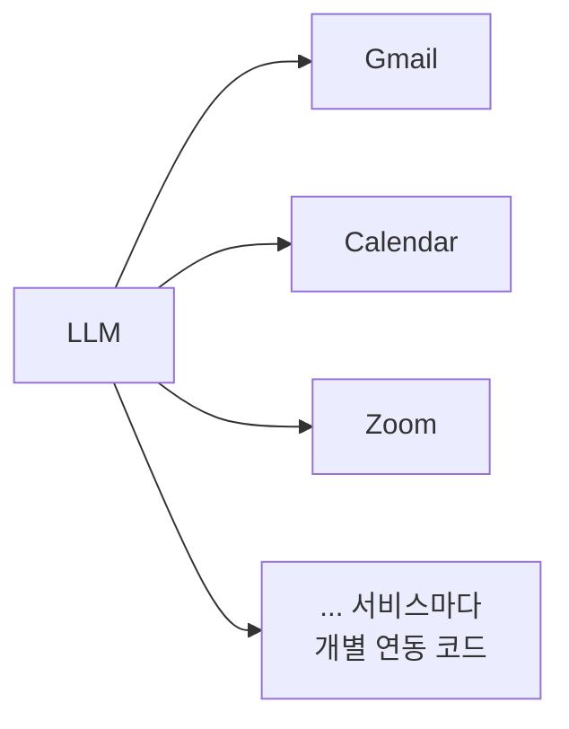
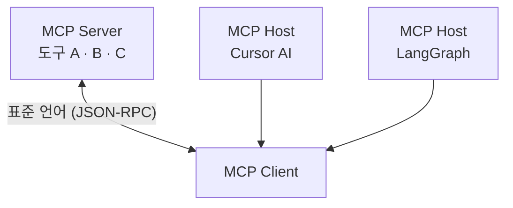
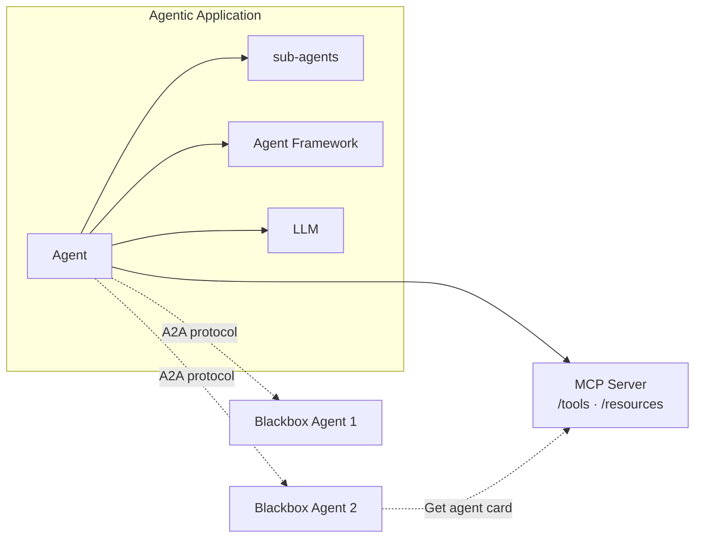
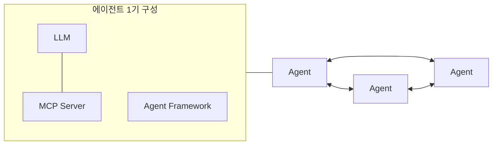

에이전트를 하나 만들어 본 팀이 두 번째를 만들 때 가장 먼저 부딪히는 것은 모델도 패턴도 아니다. **Gmail 연동 코드를 또 짜야 한다는 사실**이다. 프레임워크를 바꾸면 그마저도 다시 짜야 한다.

이 글은 그 곱셈을 다룬다. 프레임워크 M개와 서비스 N개가 있으면 연동이 M×N개 필요하고, 이 숫자는 [앞 편의 패턴 카탈로그](/blog/ai-agent/agent-pattern-catalog/) 어느 것을 골라도 줄지 않는다. 2024년 11월의 MCP와 2025년 4월의 A2A는 이 곱셈을 덧셈으로 바꾸려는 두 시도이며, **경쟁 관계가 아니라 서로 다른 층에 놓인다.** 글 후반은 그 표준들이 나온 2025년의 지형 — 벤치마크, 도입 수치, 그리고 같은 자료가 함께 실은 회의론 — 을 다룬다.

수치를 다루는 절이 길어서 미리 규칙을 정해 둔다. **이 글의 모든 정량 정보에는 시점과 출처 조건이 붙는다.** 같은 지표의 서로 다른 캡처값, 우연히 겹친 두 개의 10%, 조건을 빼면 과장이 되는 벤치마크 — 이 셋이 실제로 이 자료 안에 있고, 조건을 떼고 인용하면 셋 다 틀린 문장이 된다.

> 이 글은 **2025년 2월과 4월의 자료를 정리한 것**이며 이후 갱신되지 않았다. 생태계 규모·제품 목록·벤치마크는 그 시점의 스냅숏으로 읽어야 한다.

## 용어 정리

앞 편의 용어표에서 이 글이 쓰는 행만 추리고, 프로토콜 용어를 더했다.

| 용어 | 원어·표기 | 뜻 |
|---|---|---|
| MCP | Model Context Protocol | Anthropic이 공개한 프롬프트·도구·리소스 연결 표준 프로토콜 (JSON-RPC 기반) |
| MCP Host | — | 사용자 측 애플리케이션. Cursor·Claude Desktop·LangGraph 등 |
| MCP Client | — | 호스트와 서버 사이의 프로토콜 변환 계층 |
| MCP Server | — | 도구·리소스를 표준 형식으로 제공하는 쪽 |
| A2A | Agent-to-Agent Protocol | Google이 공개한 **에이전트 간** 협업 프로토콜 |
| Agent Card | — | A2A에서 원격 에이전트가 자신의 능력을 광고하는 명세 |
| JSON-RPC | — | JSON으로 원격 프로시저 호출을 주고받는 경량 규약. MCP의 전송 형식 |
| 가드레일 | Guardrail | 자율 행동의 허용 범위를 강제하는 안전 장치. [정의 편](/blog/ai-agent/agent-vs-workflow/) 참조 |
| 컴퓨터 유즈 | Computer Use | 모델이 화면·마우스·키보드를 조작해 앱과 상호작용하는 방식 |
| Dify | — | 노코드로 LLM 워크플로를 조립하는 플랫폼. [구조 편](/blog/rag/dify-architecture/) 참조 |

## 병목 — 서비스마다 연동을 새로 만든다

원 자료가 적은 문장은 하나다 — "다양한 외부 서비스와의 연계를 위해서 **각 서비스와의 연계 작업이 필요**하다." 한 줄이지만 여기에 확산의 병목이 전부 들어 있다. 도구를 붙이는 일은 어렵지 않고, 어려운 것은 **같은 도구를 다시 붙이는 일**이다.

에이전트 프레임워크가 M개, 연동할 서비스가 N개면 **M×N개의 연동**이 필요하다. MCP는 이 곱셈을 M+N의 덧셈으로 바꾸려는 시도다.

## MCP — 표준어를 하나 정한다

> MCP는 Anthropic이 공개한 **표준 프로토콜**이다. 프롬프트, 도구(Tool), 리소스 등의 표준을 정의해 공개했고, 에이전트 동작의 핵심인 프롬프트·리소스·도구를 위한 **생태계 조성**을 노린다.
>
> "프로토콜"이라는 단어보다 "생태계"라는 단어가 이 발표의 의도를 더 정확히 말한다. 표준을 정하는 것 자체는 기술적 성취가 아니고, 표준을 따르는 서버가 쌓여야 값이 나온다. 그래서 이 절의 판정 기준은 스펙의 우아함이 아니라 **몇 개가 등록됐는가**가 된다.

원 자료는 부동산 통역 비유로 설명한다. 왼쪽이 비유, 오른쪽이 실제 대응이다.

| 비유 | 실제 |
|---|---|
| 부동산 사무소 (A동·B동·C동 매물) | MCP Server (도구 A·B·C 제공) |
| 통역가 | MCP Client |
| 표준 언어(한국어) | 표준 언어(**JSON-RPC**) |
| 영어를 쓰는 손님 / 일본어를 쓰는 손님 | MCP Host (Cursor AI / LangGraph 등) |

비유가 성립하는 지점은 마지막 행이다. **손님이 늘어도 통역가는 한 명이면 된다** — 각 호스트가 서버마다 다른 연동 코드를 갖지 않고 표준 프로토콜 하나만 말하면 되는 구조가 이것이다.

[앞 편의 ReAct 루프 도식](/blog/ai-agent/agent-pattern-catalog/)에 대입하면 MCP의 자리가 분명해진다. `Tools` 상자 오른쪽에 붙어 있던 "무엇을 어떻게 붙일 것인가"의 빈칸을 채우는 **표준화 계층**이다.

### 생태계 규모 — 시점을 반드시 붙여야 하는 수치

> 제2의 스마트폰 앱 마켓으로 보고 있다. OpenAI, Google도 MCP에 참여함으로써 생태계 확장은 가속화된다 — **사실상 1, 2, 3위 리더가 참여**한 셈이다.
>
> 프로토콜에서 리더 참여가 결정적인 이유는 표준이 기술이 아니라 합의이기 때문이다. 더 나은 스펙이 이기는 것이 아니라 붙는 쪽이 많은 스펙이 이긴다.

아래 수치는 전부 **2025년 4월 시점의 화면 캡처를 옮긴 것**이다.

| 항목 | 값 (2025.04 시점) | 출처·주의 |
|---|---|---|
| Smithery 등록 capability 수 | **4,572** | 같은 자료 앞쪽 화면 캡처 |
| Smithery 등록 capability 수 | **4,289** | 같은 자료 뒤쪽 화면 캡처 |
| Featured 서버 수 | 1,125 | 뒤쪽 화면 |
| Web Search 카테고리 서버 수 | 114 | 뒤쪽 화면 |

**같은 지표에 두 값이 있는 것은 오기가 아니다.** 두 화면의 캡처 시점이 달라서 생긴 차이다. 이 지표가 확정하는 것은 하나의 숫자가 아니라 **"2025년 4월 기준 4천 건대"라는** 범위까지다. 단일 숫자로 단언하면 어느 캡처를 기준으로 삼았는지가 곧 그 주장의 유효 범위가 된다.

그리고 이 지표는 빠르게 움직인다. 같은 레지스트리의 3개월 뒤 화면은 **7,538개**를 표시했다 — 3개월에 65% 증가다. 그 시점의 기록과 그것이 현장에서 만든 부작용은 [MCP와 RAG 패러다임의 재편 편](/blog/ai-agent/mcp-rag-as-service/)에 있다. **두 수치는 시점이 붙어야만 의미가 확정되고, 어느 쪽도 현재형으로 쓸 수 없다.**

화면에 노출된 대표 서버는 Sequential Thinking, Desktop Commander, Github, Think Tool Server, Brave Search, Exa Search, Perplexity Search, DuckDuckGo Search Server, Serper Search and Scrape였고, 클라이언트 측 참여자로는 Cursor, Windsurf, LangGraph, Claude Desktop이 제시됐다.

## A2A — 에이전트끼리 말하게 한다

에이전트 간 협업 프로토콜인 **A2A가 2025년 4월 9일 공개**됐다. 서로 다른 프레임워크와 공급업체에 구축된 에이전트가 함께 작동하도록, 프레임워크·공급업체에 관계없이 **공통 언어**를 제공하는 것이 목표다. MCP 공개(2024년 11월)로부터 5개월 뒤인데, 이 간격이 순서를 말해 준다 — 먼저 에이전트가 도구를 표준으로 쓰게 하고, 그다음 에이전트끼리 서로를 도구처럼 쓰게 하는 순서다.

### 경쟁이 아니라 층위가 다르다

> **A2A 에이전트를 MCP 리소스로 모델링하는 것이 좋다.** 그런 다음 프레임워크는 A2A를 사용하여 사용자, 원격 에이전트 및 다른 에이전트와 통신할 수 있다.
>
> Google 문서가 직접 적은 결합 방식이다. 두 프로토콜이 같은 자리를 놓고 다투는 것이 아니라, A2A로 연결한 원격 에이전트를 MCP의 리소스 목록에 올려 두는 구조다. 그래서 "무엇을 쓸 것인가"가 아니라 "무엇을 어느 층에 둘 것인가"의 문제가 된다.

| 구분 | MCP | A2A |
|---|---|---|
| 공개 주체 | Anthropic (2024.11) | Google (2025.04.09) |
| 연결 대상 | 에이전트 ↔ **도구·리소스** | 에이전트 ↔ **에이전트** |
| 비유 | 앱이 OS API를 쓰는 방식 | 앱끼리 서로 호출하는 방식 |
| 표준화 항목 | 프롬프트·도구·리소스 | 에이전트 능력 광고(Agent Card), 작업 위임·통신 |
| 결합 방식 | A2A 에이전트를 MCP **리소스로 노출** | MCP 위에서 원격 에이전트와 통신 |

다섯 축 중 둘째 행 하나만 기억하면 나머지는 따라 나온다. **도구를 붙이면 MCP, 에이전트를 붙이면 A2A다.**

오른쪽 아래 점선이 두 프로토콜이 만나는 유일한 지점이다 — 블랙박스 에이전트가 **MCP 서버에서 Agent Card를 가져간다.** 이 그림을 한 단계 줄이면 최종 구조가 나온다.

**"LLM + MCP Server + Agent Framework"가 에이전트 한 기(基)를 이루고, 그 에이전트들이 A2A로 서로 연결되는** 2층 구조다. 두 도식은 같은 것을 다른 축척으로 그린 것인데, 앞 도식이 한 애플리케이션의 내부를 펼치는 반면 뒤 도식은 그 애플리케이션을 점 하나로 축약하고 관계망을 그린다. 앞의 것만 보면 A2A가 부가 기능처럼 보이고, 뒤의 것만 보면 MCP가 안 보인다.

## 2025년의 지형

### 연표 — 무엇이 언제 붙었나

| 날짜 | 주요 트렌드 / 이벤트 |
|---|---|
| 2022.11.30 | ChatGPT 출시 (GPT-3.5) |
| 2023.03.14 | GPT-4 및 ChatGPT 플러그인 지원 |
| 2023.03~06 | ChatGPT API, iOS 앱, 웹 브라우징 기능 등 생태계 확장 |
| 2023년 | RAG 구조 부상 |
| 2024년 | RAG 고도화, Agent / 멀티에이전트 |
| 2024.11 | **MCP(Anthropic) 공개** |
| 2025.03 | OpenAI, Agents SDK에 MCP 지원 |
| 2025.04.09 | **Google, A2A 프로토콜 공개** |
| 2025년~ | MCP/A2A 확산, Agentic AI 본격화 |

한 문장으로 읽으면 이렇다 — **2023년은 검색을 붙인 해, 2024년은 자율성을 붙인 해, 2025년은 그 둘을 표준 프로토콜로 연결한 해**다. 같은 시기를 "무엇이 공개됐는가"가 아니라 "무엇이 요청됐는가"로 다시 쓴 연표는 [LLM 앱 개발의 병목 이동 편](/blog/ai-agent/llm-app-bottleneck-shift/)에 있다.

### 도입 현황 — 두 개의 10%를 구분한다

| 수치 | 내용 | 출처 |
|---|---|---|
| **10%** | already use AI agents (이미 AI 에이전트를 사용 중) | 대기업 임원 1,100명 대상 Capgemini 서베이 |
| **82%** | plan to integrate them within the next 3 years | 동일 |
| **71%** | believe AI agents will significantly increase workflow automation and improve customer service satisfaction | 동일 |
| **약 10%** | "실제 비즈니스 로직에 적용되는 비율은 10% 정도로 떨어지는 편" | 원 자료 발표자의 시장 관찰 서술 (위 Capgemini 10%와는 **출처가 다른 별개 진술**) |

> **표의 첫 행과 마지막 행은 우연히 같은 값이며 근거가 완전히 다르다.**
>
> 앞의 것은 설문 응답자 중 "현재 사용 중"이라고 답한 비율이고, 뒤의 것은 발표자가 현장에서 관찰한 **프로덕션 적용률**에 대한 서술이다. 둘을 섞어 "설문에서도 10%, 현장에서도 10%니까 신뢰할 만하다"고 쓰면 같은 근거를 두 번 센 것이 된다. **두 값은 근거의 종류가 달라 서로를 보강하지 않는다.**

### 벤더별 제품

| 벤더 | 제품 | 내용 |
|---|---|---|
| OpenAI | Deep Research | 심층적이고 복잡한 연구를 수행하는 AI 에이전트 |
| OpenAI | Operator | 여행 숙박 예약, 레스토랑 예약, 온라인 쇼핑 등 작업 자동화 |
| Salesforce | 에이전트포스(Agentforce) | 고객서비스 자동화 + 실시간 데이터 분석 기반 맞춤형 응답 |
| Microsoft | 코파일럿 스튜디오 | 코딩 지식 없이 자신만의 AI 에이전트를 생성·업무 자동화 |
| Anthropic | Computer Use | 사람처럼 컴퓨터를 조작해 웹서핑·코딩·앱 상호작용을 수행하는 실험적 기술 |
| Google | 프로젝트 자비스(Jarvis) | 크롬 브라우저 기반, 개인 사용자의 일상 작업 지원에 초점 |

여섯 중 셋(Operator·Computer Use·Jarvis)이 [앞 편의 컴퓨터 유즈 패턴](/blog/ai-agent/agent-pattern-catalog/)이다. 자율성이 가장 높고 오류 비용에 가장 취약한 패턴에 대형 벤더가 몰려 있었다는 것이 2025년 초의 특징이다.

### 공급측 이유와 수요측 이유는 다른 표다

먼저 기술이 탄력받은 이유 — 공급 쪽이다.

| 이유 | 비고 |
|---|---|
| LLM 모델 성능 고도화 | **추론 모델의 등장** — o3-mini, DeepSeek R1 등 |
| 복잡 작업 수요 증가 | 단순 챗봇을 넘어 전문 보고서·투자 결정·시뮬레이션 |
| 인간 개입 최소화 | — |
| 상호작용 | — |
| 유연성과 확장성 | 멀티에이전트 협업 (2월판에만 포함) |

다음은 도입하는 쪽이 든 이유 — 수요 쪽이다.

| 이유 | 예시 |
|---|---|
| 자율적인 의사결정 | — |
| 동적 라우팅의 용이함 | 선택적 정보 검색: 내부 문서 검색, 웹 검색 등 |
| 목표 전달 방식의 변화 | 이행해야 하는 Task를 명시하지 않고 **최종 목표(Final Goal)만 전달**. 예: "AI Agent 시스템이 산업에 적용되고 있는 사례를 조사해서 보고서로 작성해줘" |
| 멀티에이전트 협업 시스템 | 자율적 판단을 수행하는 에이전트 협업 시스템 |

**두 표는 아홉 항목 중 하나(멀티에이전트)만 겹친다.** 하나로 합치고 싶어지는 표지만 합치면 여덟 항목이 뭉개진다 — 앞의 표는 "왜 지금 가능해졌는가"(모델 성능·추론 모델)를 말하고, 뒤의 표는 "왜 쓰고 싶은가"(목표만 던지면 된다)를 말한다. 기술 가능성과 채택 동기는 같은 축이 아니다.

멀티에이전트를 쓰는 근거는 따로 세 줄이 붙어 있다.

| 근거 | 내용 |
|---|---|
| 복잡한 문제 해결 | 작은 작업으로 나누어 각 에이전트가 처리(리서치·문서작성·Supervisor 에이전트 등) |
| 상호작용과 시너지 | **중앙집중식 통제 없이** 에이전트 간 정보 교환·협력으로 단일 에이전트의 한계 극복 |
| 다양한 응용 분야 | 스마트팩토리 로봇 간 협력 / 소방드론 군집 협력 / 금융시장 데이터 분석 |

두 번째 행이 [앞 편의 Supervisor 패턴](/blog/ai-agent/agent-pattern-catalog/)과 정면으로 어긋난다는 점이 흥미롭다. 같은 자료가 중앙집중식 통제 없는 협력을 근거로 들면서, 몇 페이지 뒤에서는 중앙 통제가 없으면 라우팅이 무너진다고 적는다. **어느 쪽도 틀리지 않았고, 규모가 다르다** — 2~3개에서는 통제가 없어도 되고 그 이상에서는 필요하다.

### 도구를 붙이면 얼마나 달라지는가 — o3 / o4-mini

> 이전 추론 모델에서는 하지 않았던 방식으로 **도구를 사용하도록 훈련**했다. 예를 들어 **o3가 정말 어려운 작업을 해결하기 위해 600번 연속으로 도구를 호출**하는 것을 보았다.
>
> 600이라는 숫자는 성능 자랑이 아니라 아키텍처 요구사항으로 읽어야 한다. 도구 호출이 세 자리로 가는 실행에서는 반복 상한과 비용 상한이 옵션이 아니고, 실행 로그가 없으면 무슨 일이 있었는지 재구성할 방법도 없다.

다음은 2025년 4월 17일 공개 시점의 벤치마크다.

| 벤치마크 | 지표 | o1 | o3-mini | o3 | o4-mini |
|---|---|---|---|---|---|
| SWE-Lancer: IC SWE Diamond | Dollars earned ($), 만점 236,000 | 28,500 (o1-high) | 17,375 (o3-mini-high) | 65,250 (o3-high) | 56,375 (o4-mini-high) |
| SWE-Bench Verified | Accuracy (%) | 48.9 | 49.3 | **69.1** | 68.1 |
| AIME 2024 | Accuracy (%) | 74.3 | 87.3 | 95.2 (python only) / 91.6 (no tools) | **98.7** (python only) / 93.4 (no tools) |
| AIME 2025 | Accuracy (%) | 79.2 | 86.5 | 98.4 (python only) / 88.9 (no tools) | **99.5** (python only) / 92.7 (no tools) |
| Codeforces | ELO | 1,891 | 2,073 | 2,706 (with terminal) | **2,719** (with terminal) |

이 표를 "AIME 99%"로 요약하는 것이 관행이지만, **그 요약은 조건을 빼면 과장이 된다.** 99.5%는 o4-mini가 AIME 2025에서 **파이썬 도구를 사용했을 때**의 값이고, 같은 모델이 도구 없이 푼 값은 92.7%다. 이 글에서 이 수치를 쓸 때는 모델·연도·**도구 사용 조건** 셋을 항상 함께 적는다.

그리고 조건을 붙여야 하는 이유가 방어적인 것만은 아니다. 도구 유무의 격차 자체가 이 표의 논지다.

> **모델을 키우는 것보다 도구를 붙이는 쪽의 이득이 큰 구간이 존재한다.**
>
> AIME 2025에서 o4-mini는 도구 없이 92.7%, 파이썬을 쓰면 99.5%다. 오답이 7.3%에서 0.5%로 줄었다 — 모델 세대를 하나 올려 얻기 어려운 폭이다. 이것이 에이전트 아키텍처의 경제적 근거이고, 그래서 조건을 지우고 "99%"만 쓰면 근거 자체가 사라진다. 남는 것은 모델 자랑뿐이다.

### 자율성과 가드레일은 짝으로 온다 — Codex CLI

Codex CLI는 터미널에서 실제로 **코드를 실행하고 파일을 조작하고 반복**할 수 있는 기능을 원하는 개발자를 위해 만들어졌다고 소개됐다. 요약하면 **리포지터리를 이해하고 실행하는 채팅 중심 개발**이다.

| 주요 특징 | 내용 |
|---|---|
| 진입 장벽 | API 키만 설정하면 바로 작동 |
| 안전성 | 완전 자동 승인, **네트워크 비활성화 및 디렉터리 샌드박스**를 실행하여 안전 + 보안 유지 |
| 멀티모달 | 스크린샷이나 다이어그램을 전달하여 기능 구현 |

두 번째 행이 이 제품의 설계 판단이다. **"완전 자동 승인"을 허용하는 대신 네트워크를 끊고 디렉터리를 샌드박스로 가뒀다** — 자율성을 올리면 가드레일이 따라오고, 그 둘의 조합이 곧 제품 사양이 된다. 같은 트레이드오프를 격리 등급 4단계로 나눈 것이 [실행 권한 편](/blog/ai-agent/code-execution-sandbox-limits/)이다.

### Hype인가 Real인가 — 같은 자료가 실은 회의론

2월 자료 후반부는 커뮤니티의 회의론을 정면으로 다룬다.

> "AI Agent"라는 단어 자체가 대세 키워드이기 때문에 기업이 이를 앞세워 열띤 광고를 하고 있다. 하지만 AI Agent 솔루션 중 **정말 AI Agent로만 이루어진 서비스는 극히 제한적**이다.
>
> 이 문장이 앞의 도입 현황 표와 같은 자료에 있다는 점이 중요하다. 82%가 3년 내 도입을 계획한다는 수치와 "실제로는 극히 제한적"이라는 관찰이 나란히 실려 있고, 둘 중 하나만 인용하면 자료를 왜곡한 것이 된다.

실무 접목 시 흔히 발생하는 문제로 다음이 열거됐다.

| 문제 | 상세 |
|---|---|
| 판단에 대한 신뢰성 | "웹검색이 필요한가? DB 검색이 필요한가?"를 매번 옳게 고르는가 |
| Inconsistent Decision Making | 어떤 때는 웹검색, 어떤 때는 DB 검색 — 같은 입력에 다른 경로 |
| 로컬 모델 성능 저하 | 상용 모델(GPT, Claude) 대비 로컬 모델(llama, mistral 등)에서 저하가 뚜렷 |
| 파인튜닝의 어려움 | 판단 품질을 학습으로 끌어올리기 어려움 |
| 역설적 결론 | 원활한 서비스 운영을 위해서는 **파이프라인이 견고해야 하며**, AI Agent의 "유연함"이 거꾸로 독이 되어 운영사의 "불안함"으로 이어짐 |

마지막 행의 **"유연함이 곧 불안함"** 한 줄이 워크플로 우선 설계를 정당화하는 가장 강한 근거다. 다섯 문제 중 넷은 개선 대상이지만 이 하나는 성질이라, 고쳐서 없앨 수 있는 것이 아니라 어디까지 허용할지 정해야 하는 것이다.

그런데 같은 자료에 정반대 방향의 문장도 있다 — "현실 세계(Real World Problem)에서 Rule-Based 시스템은 돌발 상황에 대처하기 어렵다." 회의론과 정면으로 맞서는 문장이고, 이 둘이 같은 자료에 공존한다는 사실이 결론을 말해 준다. 자료 전체의 결론은 둘 중 하나를 고르는 것이 아니라 **오류 비용을 기준으로 경계선을 긋는 것**이며, 그 경계선이 [첫 편](/blog/ai-agent/agent-vs-workflow/)의 2×2 표다.

### 다섯 원칙과 그중 하나의 리트머스

| # | 원칙 | 취지 |
|---|---|---|
| 1 | 광범위한 채택 전망 | 2025년에는 에이전트가 비즈니스에 광범위하게 적용되어 반복 작업을 자동화하고, **10배 또는 100배 많은 작업**을 수행하게 될 것으로 예상 |
| 2 | 문맥 축적에는 시간이 든다 | 에이전트가 **사용자 선호를 파악하기 위해 문맥을 쌓아가는 과정**이 필요하며, 이는 시간이 소요됨 |
| 3 | 측정 먼저 | **결과를 측정할 수 있는 방법**을 마련해야 성공적인 피드백을 받을 수 있음. 복잡해지기 전에 단순하게 시작할 것 |
| 4 | 오케스트레이션의 지속성 | 효율적인 조직은 **한 번의 LLM 호출로 모든 작업을 처리**하여, 모델이 발전하더라도 그들의 오케스트레이션이 지속됨 |
| 5 | 모델 발전에 편승하는 설계 | **모델이 더 똑똑해질수록 제품이 더 향상되도록** 구축해야 하며, 그렇지 않을 경우 잘못된 방향이라는 신호 |

> **5번은 아키텍처 리뷰의 판정 질문으로 그대로 쓸 수 있다.** "차기 모델이 두 배 똑똑해지면 우리 제품은 좋아지는가, 아니면 우리가 짜 넣은 우회 로직이 무의미해지는가?"
>
> 후자라면 설계가 모델의 약점을 메우는 데 과투자돼 있다는 뜻이다. 이 질문이 유용한 이유는 답이 코드에 있기 때문이다 — 프롬프트에 "출력 형식이 깨지면 이렇게 고쳐라" 류의 보정이 몇 줄인지 세어 보면 대략 나온다.

## GUI 도구에서는 패턴이 어떤 노드가 되는가

2월 자료에 함께 배포된 Dify 워크플로 4종의 골격이다. Dify 자체의 상세는 [별도 편](/blog/rag/dify-nodes-and-knowledge/)에 있고, 여기서는 **앞 편의 패턴이 노코드 도구에서 어떤 노드 구성으로 나타나는가**만 본다.

| 파일 | Dify 모드 | 핵심 노드 구성 | 대응 패턴 |
|---|---|---|---|
| `DeepResearch2.yml` | advanced-chat | start, llm×2, tool×3(tavily search, json parse), iteration-start, variable-aggregator, assigner×2, template-transform×2, answer×2 | Plan-and-Execute + 반복 검색 |
| `논문 기반 채팅.yml` | advanced-chat | start, document-extractor, file, list-operator, if-else, llm×9, assigner×6, template-transform×4, variable-aggregator, answer×6 | 조건 분기 워크플로 + RAG |
| `요약봇.yml` | advanced-chat | start, text-input, iteration + iteration-start, llm×2, tool×2, assigner×2, number×3, answer×2 | 반복(iteration) 기반 누적 요약 |
| `Todoist.yml` | **agent-chat** | 모델 gpt-4o + Todoist 도구 세트(getActiveTasks, createTask, updateTask, closeTask, deleteTask, getAllCollaborators) | 자율 에이전트 루프 |

**네 개 중 세 개가 `advanced-chat`(= 워크플로)이고 진짜 에이전트 모드(`agent-chat`)는 하나뿐이다.** 그 하나가 하필 할 일 관리인 것도 우연이 아니다 — 도구 호출이 CRUD로 명확히 떨어지고 오류 비용이 낮다. 첫 편의 판단 기준이 실습 자료에서도 지켜진 셈이고, 노코드 도구가 두 모드를 분리해 제공한다는 사실 자체가 그 경계가 실재한다는 방증이다. 두 모드가 어떤 노드로 갈리는지는 [워크플로 패턴 편](/blog/rag/dify-workflow-patterns/)에 있다.

---

세 편에 걸쳐 정의·패턴·표준을 정리했다. 남은 것은 이 위에 얹히는 질문이다 — **좋아졌는지 어떻게 아는가.**

다섯 원칙 중 3번("측정 먼저")이 그 질문을 던져 놓고 답하지 않는다. 무엇을 재야 하는지, 실행 경로가 긴 시스템에서 어느 지점을 채점해야 하는지, 정답이 하나가 아닌 출력을 어떻게 평가하는지가 전부 열려 있다. 그 답을 만들어 간 2025년 중반의 기록이 [LLM 앱 개발의 병목 이동](/blog/ai-agent/llm-app-bottleneck-shift/)에서 시작하는 다음 시리즈이고, 거기서 병목은 이미 도구 연결을 지나 **품질 측정**으로 옮겨 가 있다.

에이전트와 워크플로를 무엇으로 가르는지, 언제 에이전트를 쓰지 않는지 같은 정의 층의 판단은 [기본기 Q&A](/blog/ai-agent/ai-agent-qna-fundamentals/)에, 패턴별 실패 모드는 [멀티에이전트 Q&A](/blog/ai-agent/ai-agent-qna-multi-agent/)에 정리돼 있다.
