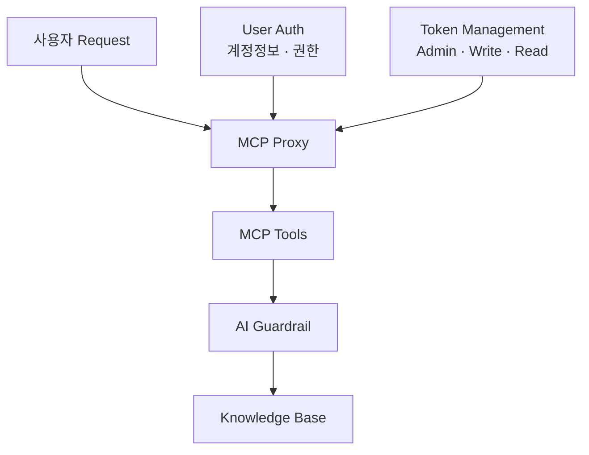
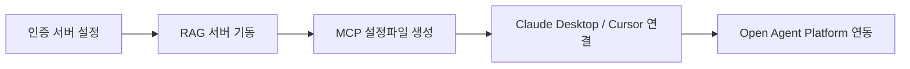

MCP를 붙여 본 팀이 처음 받는 질문은 대개 기술 질문이 아니다. **"그럼 우리 사내 문서가 다 열리는 건가요?"**

이 질문이 정확하다. 도구를 프로토콜로 붙이는 일은 도구 하나를 추가하는 일이 아니라 **경계를 하나 옮기는 일**이고, 옮긴 경계 안쪽에 사내 지식베이스가 들어 있으면 그때부터 문제는 검색 품질이 아니라 접근 제어가 된다. 이 글은 그 지점을 다룬다 — MCP가 실제로 바꾼 것, 벡터스토어를 애플리케이션 밖으로 떼어 내는 재편, 그리고 지식베이스 바로 앞에 무엇을 세워야 하는가.

[앞 편](/blog/ai-agent/agent-evaluation-observability/)의 마지막 표가 "Agent + MCP 시대의 도구 선택 평가"를 새 과제로 열어 두고 끝났다. 그 과제의 다른 절반이 여기 있다. 프로토콜 자체의 층위 구분 — MCP는 도구, A2A는 에이전트 — 은 [MCP와 A2A 편](/blog/ai-agent/mcp-a2a-landscape/)에 정리돼 있고, 이 글은 그 위에서 벌어지는 운영 문제만 본다.

> 이 글은 **2025년 6월과 7월의 자료를 정리한 것**이다. 생태계 규모와 제품 구성은 그 시점의 것이며, 특히 아래 등록 수치는 3개월 만에 크게 움직인 값이라 시점을 떼고 인용하면 안 된다.

## 용어 정리

앞 편의 용어표에서 이 글이 쓰는 행만 추리고, 권한 용어를 더했다.

| 용어 | 원어 / 표기 | 뜻 |
|---|---|---|
| MCP | Model Context Protocol | LLM 애플리케이션이 외부 도구·데이터에 붙는 방식을 표준화한 프로토콜 |
| MCP Proxy | — | 모든 도구 요청이 지나가는 단일 통로. 인증을 한 곳으로 모으는 계층 |
| Guardrail | AI Guardrail | 입출력을 검열·차단해 위험한 응답이나 권한 밖 접근을 막는 안전장치 계층 |
| Knowledge Base | — | 사내 문서 원본과 그 색인. RAG의 검색 대상 |
| RAG as a Service | — | 벡터스토어와 검색을 애플리케이션에서 분리해 독립 서비스로 제공하는 방식 |
| PGVector | — | PostgreSQL에 벡터 검색을 얹는 확장 |
| 하이브리드 검색 | Hybrid Search | 시맨틱(임베딩) 검색과 키워드(전문) 검색을 함께 쓰는 방식 |
| Multi-Query | — | 원 질의에서 하위 질문 여럿을 생성해 각각 검색하는 재현율 향상 기법 |
| Supervisor | — | 하위 에이전트에 작업을 배분하고 결과를 회수하는 조정자. [패턴 카탈로그](/blog/ai-agent/agent-pattern-catalog/) 참조 |
| Smithery | Smithery | MCP 서버·도구를 모아 배포·검색하는 레지스트리 |
| Citizen Developer | Citizen Developer | 전문 개발자가 아니면서 사내 도구를 직접 만드는 실무자 |

## MCP가 실제로 바꾼 것

| 항목 | 내용 |
|---|---|
| 접근성 | 코드 편집기에 MCP를 연동하는 것만으로 **비개발자도 MCP 도구를 붙여 에이전트를 활용 가능** |
| 사회적 확산 | 영상·기사에 "MCP를 활용한 업무 생산성" 활용기가 쏟아짐 — 디자인 도구 연동, 메신저 연동 사례가 특히 화제 |
| 생태계 | 도구 선택지가 다양해짐. 레지스트리 화면 기준 커뮤니티가 만든 **7,538개**의 skills·extensions 노출 (예: Supabase MCP Server, Memory Tool, Github, Notion) |
| 부작용 | 고객의 눈높이 상승 — "MCP로 이것도 되고, 저것도 되고, 다 된다며?" |

> **7,538은 2025년 7월 시점의 화면 캡처 값이다.** 같은 레지스트리가 3개월 전에는 4천 건대를 표시하고 있었다 — [2025년 4월 시점 기록](/blog/ai-agent/mcp-a2a-landscape/)에는 4,572와 4,289 두 캡처가 함께 남아 있다.
>
> 3개월에 약 65% 증가다. 이 수치를 인용할 때 시점을 붙이지 않으면 두 가지가 동시에 틀린다 — 오래된 값을 현재로 말하거나, 증가율을 근거 없이 연장하게 된다. **성장률이 큰 지표일수록 스냅숏으로만 다뤄야 한다.**

네 번째 행이 세 번째 행의 대가다. 도구 목록이 늘어나는 속도만큼 기대치도 올라가고, 그 기대는 "가능한 것"이 아니라 "다 되는 것"으로 표현된다.

> **"MCP는 그냥 도구일 뿐, 원래 코딩으로 도구를 구현하던 사람들에게 새로운 것은 아니다."**
>
> 프로토콜의 등장이 곧 새로운 능력의 등장은 아니라는 지적이다. Gmail을 붙이는 일은 MCP 이전에도 가능했고, 달라진 것은 **통합 비용**이지 가능성이 아니다. 그런데 비용이 충분히 내려가면 그 자체로 다른 일이 벌어진다 — 비개발자가 직접 붙이기 시작한다. 첫 번째 행이 말하는 것이 그것이고, 그래서 이 지적은 절반만 맞다.

## 지식베이스 앞에 무엇을 세우는가

7월 자료가 "[핵심]"이라고 표시한 유일한 슬라이드가 이 구조도다. 사내 지식베이스를 MCP로 열 때의 권한·안전 설계를 담고 있다.



| 계층 | 역할 | 없으면 생기는 일 |
|---|---|---|
| User Auth | 계정정보·권한 확인 | 누가 물었는지 모르는 채로 사내 문서가 열린다 |
| MCP Proxy | 모든 요청의 단일 통로 | 도구가 늘 때마다 인증을 각자 구현하게 된다 |
| Token Management | Admin / Write / Read 등급 토큰 관리 | 읽기 권한자가 쓰기 도구를 호출할 수 있다 |
| MCP Tools | 실제 도구 집합 | — |
| AI Guardrail | 지식베이스 접근 직전의 검열 계층 | 권한 밖 문서가 응답에 섞여 나간다 |
| Knowledge Base | 사내 지식 원본 | — |

세 번째 열이 이 표를 표로 만든 이유다. 여섯 계층 중 넷에 "없으면"이 채워져 있고, 그 넷이 방어선 셋과 그것을 지탱하는 통로 하나다.

> **사내 RAG를 MCP로 여는 순간 문제는 검색 품질이 아니라 접근 제어로 옮겨간다.**
>
> 이 구조도가 말하는 것은 3중 방어다 — Proxy에서 인증을 단일화하고, 토큰 등급으로 도구 권한을 나누고, 지식베이스 바로 앞에 가드레일을 둔다. 셋이 서로를 대체하지 않는다는 점이 설계의 요점이다. 인증만 있으면 인증된 사용자가 권한 밖 도구를 부를 수 있고, 토큰 등급만 있으면 등급 안에서 권한 밖 문서가 검색될 수 있다. **마지막 가드레일이 필요한 이유는 앞의 둘이 "누가"와 "무엇을"만 보고 "어떤 문서를"은 보지 않기 때문이다.**

같은 원리를 도구 인증 일반에 적용한 것이 [앞 편에서 본 게이트웨이 계층](/blog/ai-agent/ambient-agent-and-hitl/)이고, 사내 AI 확산 전반의 통제 축은 [노코드 플랫폼의 거버넌스 편](/blog/rag/dify-enterprise-governance/)에 별도로 있다.

## RAG를 애플리케이션 밖으로 떼어 낸다

| 항목 | 내용 |
|---|---|
| 정체 | RAG를 위한 전용 서버. **FastAPI 기반 REST API** |
| 조합 | LangChain + PostgreSQL(PGVector)로 구축된 문서 관리·검색 시스템 |
| 연계 | Open Agent Platform의 "RAG as a service" 구성요소 |
| 노출 방식 | MCP 도구로 감싸 여러 호스트가 같은 지식베이스를 공유 |

클라이언트가 제공하는 기능은 네 영역으로 갈린다.

| 영역 | 기능 |
|---|---|
| 컬렉션 관리 | 문서 컬렉션 생성 및 관리 / 컬렉션 통계 보기 / 컬렉션 일괄 삭제 |
| 문서 관리 | 여러 파일 업로드(PDF, TXT, MD, DOCX) / 문서 청크 보기 및 관리 / 개별 청크 또는 전체 문서 삭제 |
| 검색 | 시맨틱 검색(AI 기반 유사도) / 키워드 검색(전통적 전문 검색) / 하이브리드 검색(두 접근법의 장점 결합) / 고급 메타데이터 필터링 |
| API 테스터 | 모든 API 엔드포인트 직접 테스트 / API 기능 탐색 / 통합 개발 및 디버깅 |

네 영역 중 앞의 둘이 이 재편의 실제 내용이다. 컬렉션 생성과 청크 관리가 **API로 노출된다**는 것은 문서 적재가 더 이상 애플리케이션 배포와 묶이지 않는다는 뜻이다. 문서 하나를 바꾸려고 앱을 다시 배포하던 구조에서 벗어난다.

"RAG 패러다임의 변화 — RAG MCP"라는 제목이 가리키는 바가 이것이다. **벡터 DB를 애플리케이션 안에 심는 대신 별도 서비스로 떼어 내고, MCP 도구로 노출한다.** 그러면 어느 호스트에서든 같은 지식베이스를 붙여 쓸 수 있다. 파이프라인을 애플리케이션 안에 두었을 때의 적재·검색·생성 3단 구조는 [RAG 파이프라인 편](/blog/rag/rag-pipeline-ingestion/)에 있고, 이 재편은 그 파이프라인의 경계를 프로세스 밖으로 옮긴 것이다.

## 도구가 많아지면 에이전트를 쪼갠다

| 관찰 | 내용 |
|---|---|
| 제약 | 하나의 에이전트가 활용할 수 있는 도구의 개수는 제한적 |
| 대응 1 | 1개 에이전트가 사용하는 도구를 제한 |
| 대응 2 | 1개 에이전트의 역할을 특화 (System Prompt를 narrow down) |
| 대응 3 | 여러 에이전트를 협업시키는 디자인 패턴 연구 |
| 결론 | **Supervisor 패턴이 가장 효율적** |

MCP로 도구를 붙이기 쉬워진 것이 이 절이 필요해진 직접적 이유다. 붙이는 비용이 내려가면 도구 수가 늘고, 도구 수가 늘면 도구 스키마가 매 호출마다 프롬프트에 실린다. **통합 비용이 내려간 자리에 컨텍스트 비용이 올라온다.**

원 자료는 여기서 2계층 감독 구조 그래프를 제시한다 — 최상위 Supervisor가 두 팀 서브그래프를 거느리고, 각 팀 안에 다시 팀 단위 Supervisor가 있으며, 그 아래 개별 에이전트가 각자 `agent → tools` 루프를 도는 형태다. 이 구조도는 [패턴 카탈로그의 계층형 팀 절](/blog/ai-agent/agent-pattern-catalog/)에 더 자세한 판(말단 에이전트까지 열 노드)으로 실려 있으므로 여기서는 반복하지 않는다. 실제 조립은 [계층화 편](/blog/ai-agent/hierarchical-team-subgraph/)에 서브그래프 코드로 있다.

> **도구를 많이 쥔 만능 에이전트보다 역할이 좁은 에이전트를 감독자가 배분하는 편이 낫다** — 이 결론이 사람 조직의 팀 분할 논리와 같은 형태라는 점이 자주 지적된다.
>
> 다만 비유가 성립하는 범위를 봐야 한다. 사람 조직에서 팀을 나누는 이유는 인지 부하와 커뮤니케이션 비용이고, 여기서 나누는 이유는 **컨텍스트 윈도우와 도구 선택 정확도**다. 결과적 구조가 같아도 제약 조건이 다르므로, 조직론에서 가져온 직관(예: 팀 규모의 상한)이 그대로 적용되지는 않는다.

## 실제로 세우는 순서



다섯 단계 중 앞의 둘이 인프라이고 뒤의 셋이 연결이다. 인증 서버는 프로젝트를 만들고 Project URL과 두 종류의 키(공개용 anon, 서버용 service role)를 확보하는 정도이며, RAG 서버는 컨테이너로 띄운 뒤 MCP 설정 파일을 생성해 호스트 쪽 설정에 등록한다. 호스트가 둘(데스크톱 앱과 코드 편집기)인데 등록 방식이 같은 형태라는 점이 프로토콜 표준화의 실제 효용이다 — [앞 시리즈의 통역가 비유](/blog/ai-agent/mcp-a2a-landscape/)가 여기서 구체화된다.

설치 명령 자체보다 값을 하는 것은 그 위에서 쓰는 프롬프트다.

```text
You are a question-answer assistant based on given document.
You must use MCP tool to answer the question.

Here are additional information that you need to consider:
- Target Collection: RAG
- Search Type: hybrid(preferred)

## Search Guidelines:
Follow the guidelines step-by-step to find the answer.
1. Use `list_collections` to list up collections and find right **Collection ID**
2. Use `multi_query` to generate at least 3 sub-questions related to original query
3. Search all queries generated from previous step(`multi_query`) and find useful docs
4. Use searched documents to answer the question.

[Note] If you can't find your answer from the MCP tool, just say "I don't know"

## Format:
(answer to the question)

**출처**
- (Source and page numbers)

[Note]
- Answer in Korean
- Append sources that you've referenced at the very end of your answer.
```

설계 의도가 셋이다.

| # | 지시 | 의도 |
|---|---|---|
| 1 | `list_collections`로 Collection ID를 먼저 조회 | 컬렉션 식별자를 프롬프트에 하드코딩하지 않는다. 컬렉션이 바뀌어도 프롬프트를 고칠 필요가 없다 |
| 2 | `multi_query`로 하위 질문 3개 이상 생성 후 각각 검색 | 원 질의 하나로는 놓치는 근거를 잡는다. 검색 재현율을 프롬프트 층에서 올린다 |
| 3 | 못 찾으면 "I don't know", 출처를 반드시 말미에 첨부 | 할루시네이션 억제 + 검증 가능성. 근거 없이 답하지 않게 만든다 |

**셋이 각각 다른 층을 건드린다.** 1번은 결합도, 2번은 검색 품질, 3번은 답변 규율이다. 프롬프트 한 장이 이 셋을 동시에 하는 것이 흔한 일은 아니고, 세 지시를 따로 떼어 놓으면 각각이 다른 절의 주제가 된다. 특히 3번은 [Agentic RAG의 관련성 검증](/blog/rag/agentic-rag-relevance-check/)이 도구와 판정 노드로 하는 일을 프롬프트 문장으로 근사한 것이라, 통제 강도가 다르다 — **프롬프트에 둔 규칙은 확률적으로 지켜지고 코드에 둔 규칙은 항상 지켜진다.**

---

여기까지가 프로토콜이 만든 재편이다. 도구는 표준으로 붙고, 지식베이스는 서비스로 떨어져 나가고, 그 앞에 방어선이 셋 선다.

그런데 이 모든 구성요소 — 프레임워크, 관측 SaaS, 노코드 플랫폼, RAG 서버 — 를 어디까지 가져다 쓸 것인가는 아직 답하지 않았다. SDK를 직접 부를 것인가, 프레임워크를 얹을 것인가, 매니지드 플랫폼에 올릴 것인가. [다음 편](/blog/ai-agent/build-or-buy-agent-stack/)에서 세 선택지를 아홉 축으로 비교하고, 그 선택이 실제 산업에서 어떻게 갈렸는지를 서베이와 도입 사례로 확인한다.
