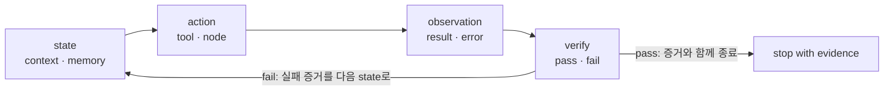
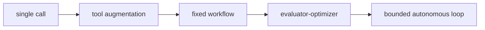

"에이전트 루프를 만든다"는 말은 코드로 옮기면 대개 `while` 문 하나가 된다. 그런데 그렇게 만든 루프는 개선 루프가 아니라 **비용을 태우는 재시도**에 가깝다. 반복 호출과 개선 루프를 가르는 것은 반복 그 자체가 아니라, 반복 사이에 무엇이 판정되고 무엇이 상태로 남느냐다.

이 글은 그 차이를 **런타임 계약**이라는 관리 단위로 정리한다. 목표·상태·정책·도구·관찰·검증기·종료·격리 여덟 개 표면을 하나씩 열고, 자율성을 한 번에 키우지 않고 다섯 단계로 넓히는 순서를 본 뒤, 실제 구현들이 그 계약을 각자 어떻게 구현했는지를 비교한다. 후반은 반대 방향이다 — **언제 루프가 과설계인가.** 판정 기준은 자율성의 크기가 아니라 검증 가능성이다.

[앞 편](/blog/ai-agent/loop-engineering-basics/)이 이 담론이 왜 지금 나왔는지를 다뤘다면 이 글은 실제로 무엇을 만드는지를 다루고, [다음 편](/blog/ai-agent/loop-antipatterns-and-checklist/)은 그것이 무너지는 방식을 다룬다.

> 이 글은 **2026년 6월 자료를 정리한 것**이다. 인용된 수치는 각 연구·벤치마크의 특정 설정에서 나온 값이며, 제품 기능 서술은 각 벤더의 공식 문서 기준이다.

## 용어 정리

앞 편의 용어표에서 이 글이 쓰는 행만 추리고, 계약 용어를 더했다.

| 용어 | 원어 / 표기 | 뜻 |
|---|---|---|
| 런타임 계약 | runtime contract | 루프의 관리 단위. 상태·행동·관찰·검증·종료가 무엇인지 명시한 약속 |
| Verifier | 검증기 | 종료 조건을 판정하는 관찰 가능한 증거 장치 |
| Observation shape | — | 도구 결과를 **어떤 형태로** 되돌릴지. 원본 덤프가 아니라 실패 요약·종료 코드·핵심 트레이스로 구조화 |
| Bounded retry | — | 최대 반복·타임아웃·비용 상한을 건 재시도 |
| Loop ownership | — | 루프의 상태·엣지·종료조건·권한을 누가 소유하는가 |
| ACI | Agent-Computer Interface | 에이전트가 파일을 보고 편집하고 명령을 실행하는 인터페이스 설계 |
| Provenance | — | 관찰값이 어디서 왔는지의 출처 정보 |
| Excessive Agency | — | 통제되지 않은 권한이 의도치 않거나 위험한 행동으로 이어지는 위험. OWASP 항목 |
| Deterministic gate | — | 테스트·정적 분석처럼 기계적으로 통과 여부가 갈리는 판정 |

## 최소 루프 — 관리 단위는 계약이다



```text
minimal-loop.contract
while budget.remaining() and not verifier.passed(state):
    action      = policy.next(state)              # model, router, graph edge
    observation = tools.run(action)               # API, code, browser, search
    evidence    = verifier.check(observation, spec)
    state       = update(state, observation, evidence)
return artifact, trace, evidence
```

> **이 계약이 없으면 반복 호출은 개선 루프가 아니라 비용을 태우는 재시도에 가깝다.**
>
> 반대로 trace·state schema·verifier·stop condition이 있으면 에이전트의 "끝났다"는 선언을 **산출물·테스트·로그·승인 같은 증거**와 연결할 수 있다. 도식에서 `fail` 화살표가 상태로 되돌아가는 것이 그 핵심인데, 실패가 로그로만 남고 상태에 들어가지 않으면 다음 반복이 같은 조건에서 다시 시작한다. 재시도와 개선을 가르는 것은 반복 횟수가 아니라 **실패 증거가 다음 입력이 되는가**다.

### 설계해야 할 여덟 가지

| 구성 요소 | 설계 질문 | 실패하면 생기는 문제 |
|---|---|---|
| **goal / spec** | 무엇이 완료이고, 어떤 산출물이 필요한가? | 에이전트가 임의의 "done"을 선언한다 |
| **state / memory** | 무엇을 컨텍스트로 유지·압축·폐기할 것인가? | context rot, 충돌, 누락이 생긴다 |
| **planner / policy** | 다음 행동은 모델이 고르는가, 그래프 엣지가 고르는가? | 불필요한 자율성이나 경직된 워크플로가 된다 |
| **tools / environment** | 어떤 API·셸·브라우저·DB 권한을 줄 것인가? | 권한 과다, 부작용, 출처 손실 |
| **observation** | 도구 결과와 오류를 어떤 형태로 되돌릴 것인가? | 모델이 실패 원인을 해석하지 못한다 |
| **evaluator / verifier** | 테스트·루브릭·정적 검사·모델 판정·사람 게이트 중 무엇이 통과 기준인가? | 반복이 품질 개선으로 이어지지 않는다 |
| **termination** | 성공·차단·최대 반복·예산·타임아웃 조건은 무엇인가? | 무한 루프, 비용 폭주, 불완전 종료 |
| **sandbox / handoff** | 격리·승인·롤백·사람 개입 지점은 어디인가? | 위험한 변경이 자동으로 확산된다 |

**세 번째 열을 세로로 읽으면 여덟 표면이 서로 다른 종류의 실패를 막는다는 것이 보인다.** 1·6·7번은 "언제 끝나는가"의 실패, 2·5번은 "무엇을 아는가"의 실패, 3번은 구조의 실패, 4·8번은 안전의 실패다. 여덟을 다 설계해야 하는 이유는 하나를 빼면 그 종류의 실패가 통째로 열리기 때문이지, 완성도를 높이기 위해서가 아니다.

### 자율성은 다섯 걸음으로 넓힌다

처음부터 완전 자율 에이전트를 만들지 않는다. 제어 표면을 이 순서로 넓힌다.



각 단계마다 기준선 평가·최대 반복·타임아웃·비용 상한·롤백 기준을 둔다. **마지막 단계 이름에 `bounded`가 붙어 있다는 것**이 이 순서의 요약이다 — 최종 목표조차 무제한 자율이 아니다.

### 누가 루프를 소유하는가

핵심 기준은 어떤 모델을 쓰는가보다 **누가 루프 소유권을 갖는가**다.

| 계층 | 대표 도구 | 소유 범위 | 개발자가 소유해야 할 설계면 |
|---|---|---|---|
| 오케스트레이션 · 런타임 | **LangGraph** | 그래프와 상태 | 상태 스키마 · 노드/엣지 · 종료 조건 · 영속성 · 사람 개입 · 트레이스/평가 |
| 코딩 하네스 · SDK | **OpenHands · SWE-agent** | 하네스 | 샌드박스 · 파일·검색·편집 인터페이스 · 명령 피드백 · **테스트를 검증기로** |
| 제품형 코딩 에이전트 | **Claude Code · Codex · Copilot cloud agent · Cursor · Devin** | 정책과 리뷰 | 권한 · 규칙 · 체크포인트 · PR 리뷰 · 승인 워크플로 · **벤더 주장 검증** |
| 1세대 자율 에이전트 | (2023년 전후의 오픈소스 프로젝트들) | 역사적 참조 | 초기 목표·태스크·메모리 루프의 교훈 — 검증·안전장치 부족 |

> **추상화가 높아지면 도입 속도는 오르고 직접 제어는 내려간다.**
>
> 그래서 위 표의 네 번째 열이 위에서 아래로 갈수록 짧아지지 않고 오히려 성격이 바뀐다. 첫 행에서는 상태와 엣지를 직접 짜지만 세 번째 행에서는 권한과 승인만 소유한다. 잃는 것이 아니라 옮겨가는 것이라, 추상화를 올릴수록 **트레이스·평가·권한·종료 조건의 소유 경계를 더 명확히** 해야 한다. 도구 비교로 도입을 시작하지 말고 "우리가 절대 외부에 넘기지 않을 것" 목록을 먼저 확정하는 편이 순서상 맞다.

## 같은 계약, 다른 구현

| 도구 | 루프의 정체 |
|---|---|
| **LangGraph** | 루프를 그래프로. `should_continue` 라우터 + `tool_node → llm_call` **되돌림 엣지**. 도구 호출이 남아 있으면 실행 후 모델로 복귀, 없으면 `END` |
| **Codex** | **turn = 추론 + 도구 호출**. 한 turn 안에서 추론과 도구 호출을 반복하고, 어시스턴트 메시지가 나오면 종료 |
| **Claude Code** | **수집 → 행동 → 검증**. 컨텍스트 수집 → 파일·실행·웹 행동 → 테스트·diff로 검증을 제품 UX에 묶음 |

공통점은 하나다 — 정체가 모두 **도구 결과를 다음 추론으로 되돌리는 것**이고, 구현 방식만 다르다.

```python
def should_continue(state: MessagesState) -> Literal["tool_node", END]:
    if state["messages"][-1].tool_calls:
        return "tool_node"     # 도구 호출이 남아 있으면 계속
    return END                 # 없으면 종료

builder.add_edge(START, "llm_call")
builder.add_conditional_edges("llm_call", should_continue, ["tool_node", END])
builder.add_edge("tool_node", "llm_call")   # 되돌림 엣지 = 루프
agent = builder.compile()
```

`add_edge("tool_node", "llm_call")` 한 줄이 **"도구 결과를 다음 추론으로 되돌린다"**는 Loop Engineering의 핵심을 코드로 박아 넣는다.

```text
codex.turn · 응답 API 흐름
input = build_prompt(instructions, tools, user_msg, environment_ctx)
while True:
    event = responses_api.stream(input)                # SSE 스트림
    if event.type == "function_call":
        out = run_tool(event.name, event.arguments)    # shell, update_plan, web_search, MCP
        input += [event, function_call_output(out)]    # 이전 prompt의 정확한 prefix 유지
        continue                                       # 프롬프트 캐싱을 위한 prefix 보존
    if event.type == "assistant_message":
        break                                          # turn 종료, 사용자에게 제어 반환
```

| # | 배울 운영 설계 | 내용 |
|---|---|---|
| 1 | **컨텍스트 창 관리** | 대화가 길어지면 프롬프트가 제곱으로 커지므로, 임계치를 넘으면 대화를 **압축**한다 |
| 2 | **프롬프트 캐싱** | 새 프롬프트가 이전 프롬프트의 **정확한 접두사**가 되도록 설계해 캐시 적중을 유지. 도구 목록·모델·샌드박스 설정을 중간에 바꾸면 **캐시 미스** |
| 3 | **지시 계층화** | 작업 전에 `AGENTS.md`를 읽어 전역 지침과 프로젝트별 지침을 쌓는다 |

> **핵심 난이도는 모델이 아니라 하네스에 있다.**
>
> 캐시를 깨지 않으면서 프롬프트를 키우고, 컨텍스트 창을 압축하고, 샌드박스와 승인 정책을 접두사 보존 방식으로 주입하는 것이 전부 루프 설계 문제다. 특히 2번의 함의가 실무적으로 큰데, **비용 최적화와 유연성이 정면으로 충돌**한다. 실행 도중 도구 목록을 바꾸는 것은 기능적으로는 자연스럽지만 캐시를 깨서 비용을 몇 배로 만든다. 그래서 변경은 접두사를 바꾸는 대신 새 메시지를 덧붙이는 방식으로 처리해야 한다.

### 제품형 에이전트가 넓혀 둔 표면

| 도구 | 자료가 기록한 구현 패턴 |
|---|---|
| **Claude Code** | 훅(`PreToolUse`·`PostToolUse`·`PostToolBatch`·`PreCompact`)으로 파괴적 명령 차단·포맷/린트·감사 로그 같은 가드레일 삽입. MCP로 이슈 트래커·모니터링·DB·설계 문서·커스텀 API 연결. 서브에이전트로 탐색·계획·일반 작업을 별도 컨텍스트 창과 도구 권한으로 분리해 메인 컨텍스트 보존 |
| **Copilot cloud agent** | 이슈·챗·에이전트 패널에서 시작, CI 기반 **일회성 개발 환경**에서 탐색·변경·자동 테스트/린터 실행. 설정 파일로 의존성·도구·러너를 시작 전에 결정론적으로 준비. 제약: 한 세션은 한 저장소·브랜치·PR에 묶이고 **최대 59분**, 에이전트가 푸시한 PR 워크플로는 사람이 승인해야 실행 |
| **Cursor** | 규칙·도구·터미널/브라우저·체크포인트·서브에이전트·클라우드 에이전트 조합. 컨텍스트 창이 차면 이전 대화를 요약으로 압축하고, 컨텍스트 내역을 시스템 프롬프트/도구/규칙/스킬/MCP/서브에이전트로 분해해 표시. **계획 모드**는 코드베이스 조사와 리뷰 가능한 구현 계획을 먼저 생성 |
| **Devin** | 티켓에서 PR까지의 클라우드 워크플로. 매니지드 세션 병렬 오케스트레이션, 과거 세션 분석, 재사용 플레이북, 지식베이스, 스케줄 관리 |

> **제품 문서는 기능과 워크플로 패턴의 근거로는 유용하지만, 생산성·성능·ROI 주장은 공식 주장으로 라벨링해야 한다.**
>
> 수치 경쟁보다 컨텍스트 수집·체크포인트·권한·규칙/스킬/MCP·매니지드 세션·플레이북 같은 **구현 패턴을 추출**하는 것이 실익이 크다. 위 표에서 실제로 가져갈 것은 제품 선택이 아니라 네 행에 공통으로 나타나는 세 가지다 — 컨텍스트를 압축하는 지점, 권한을 쪼개는 지점, 사람이 승인하는 지점. 세 지점이 어디에 있는지가 곧 그 제품의 루프 설계다.

### ACI — 코딩 하네스의 설계 변수

| 설계 변수 | 왜 중요한가 | 실전 구현 힌트 |
|---|---|---|
| **파일·검색 인터페이스** | 저장소 탐색 실패가 잘못된 패치로 이어진다 | 검색 결과를 압축하고, 읽은 파일과 라인을 트레이스에 남긴다 |
| **편집기 인터페이스** | 모델이 의도한 diff와 실제 diff가 어긋날 수 있다 | 패치 단위 적용, diff 검사, 롤백을 기본화 |
| **명령 샌드박스** | 테스트·빌드·셸은 **검증기이자 위험 권한**이다 | 타임아웃, 허용 목록, 작업 디렉터리, 시크릿 마스킹 |
| **관찰 형태** | 긴 로그는 다음 추론을 오염시킨다 | 실패 요약·종료 코드·핵심 스택 트레이스·재현 명령을 구조화 |

세 번째 행이 이 표에서 가장 긴장이 큰 자리다. 테스트를 돌리는 권한은 검증기를 만드는 데 필수인데, 같은 권한이 임의 코드 실행 권한이기도 하다. **검증 능력과 위험이 같은 권한에서 나온다**는 것이 코딩 에이전트 설계의 근본 제약이고, 그래서 이 행에만 완화 장치가 넷 붙어 있다.

> **역사적 교훈**: 2023년 전후에 등장한 1세대 자율 에이전트 프로젝트들은 목표를 넣고 태스크를 분해해 메모리와 도구로 반복하는 아이디어를 대중화했다. 그러나 **검증기·샌드박스·컨텍스트 압축·권한 경계·트레이스와 평가가 약했다.**
>
> 현대의 Loop Engineering은 그 원형 위에 검증기·샌드박스·예산·사람 개입을 얹는 방향으로 진화한 것이다. 아이디어가 틀렸던 것이 아니라 **경계 장치가 없었다**는 진단이며, 이것이 지금 여덟 표면 중 절반이 통제 장치인 이유이기도 하다.

## 언제 루프를 쓰고, 언제 과설계인가

| 근거 | 수치 | 조건 |
|---|---|---|
| 코딩 어시스턴트 통제 실험 (Peng 등, 2023) | 대조군 대비 **55.8% 빠른 완료** | JavaScript **HTTP 서버 구현**이라는 표준화 과제 한정. 테스트 스위트로 측정한 **과제 완료 시간** 기준 |
| METR 장기 소프트웨어 작업 | 작업 시간 지평 약 **7개월마다 2배** | 50% 완수 기준. 외적 타당성·비정형 작업 한계 명시 |

55.8%는 "코드를 많이 생성했다"가 아니라 **성공 기준과 테스트가 있는 작업에서 완료 경로가 줄었다**는 제한된 근거다. Loop Engineering은 여기서 한 단계 더 나아가 코드 생성 → 테스트 실행 → 실패 관찰 → 패치 → 재시도를 **하나의 제어 루프로 묶는다.**

> **루프를 쓸 때**는 결과가 `테스트` · `루브릭` · `사용자 눈에 보이는 결과` · `정적 검사` · `사람 승인` 중 **하나로 검증 가능**하고, **실패 피드백이 다음 반복의 상태를 실제로 개선**할 때다.
>
> **과설계 신호**는 그 반대다. 성공 기준이 불명확하고, 검증기를 만들 수 없고, 도구 관찰이 다음 결정을 개선하지 않으며, 사람이 한 번 읽고 판단하면 끝나는 작업이라면 **에이전트 루프보다 단순 워크플로가 낫다.** 두 문단이 같은 축의 양끝이라는 점이 중요하다 — 판정 기준은 작업의 난이도나 중요도가 아니라 오직 **검증 가능성**이다.

### 품질 — 모델의 주장보다 검증기의 증거

종료 조건은 에이전트의 "done" 선언이 아니라 **관찰 가능한 증거**여야 한다.

| ✕ 나쁜 종료 조건 | ✓ 좋은 종료 조건 | 개발자 설계 포인트 |
|---|---|---|
| "수정 완료했습니다"라는 모델 문장 | 테스트 통과 로그 · diff · 재현 절차 | **에이전트 응답과 검증기 출력을 분리**한다 |
| 모델 판정 단독 점수 | 결정론적 검사 + 모델 판정 보조 | 정답이 있는 영역은 **결정론적 게이트 우선** |
| 한 번 성공한 데모 | 능력 평가 + CI 회귀 + 프로덕션 모니터 | 새 능력 측정과 기존 기능 보호를 **다른 스위트**로 관리 |
| 트레이스 없는 성공률 | 결과 · 실행 기록 · 지연 · 토큰/비용 동시 기록 | **실패 재현과 비용 제어**까지 평가 대상에 포함 |

평가 논의에서 분리해서 봐야 할 개념은 일곱이다 — `task` · `trial` · `grader` · `transcript/trace` · `outcome` · `evaluation harness` · `agent harness`. 마지막 둘이 특히 혼동되는데, 평가 하네스는 재는 장치이고 에이전트 하네스는 재이는 대상이다.

| 검증 수단 | 위치 |
|---|---|
| 단위 테스트 등 결정론적 결과 검사 | **중심** (코딩 에이전트 기준) |
| 모델 루브릭 | **보조** — 코드 품질, 도구 사용 행태 |
| 사람 리뷰 | **루브릭 보정과 고위험 케이스에만** |

```text
verifier-first.loop
artifact = agent.propose_change(state)
evidence = run_tests_and_static_checks(artifact)
if evidence.passed:
    stop(trace=state.trace, proof=evidence)
else:
    state = state.with_feedback(evidence.failures)
```

이 방식은 디버깅에도 유리하다. 루프가 실패했을 때 "모델이 왜 그랬지"가 아니라 **어떤 상태·도구 출력·검증기 피드백이 다음 행동을 만들었는지**를 트레이스로 추적할 수 있다.

### 대가 — 비용·지연·복잡도·보안

| 축 | 내용 |
|---|---|
| **비용 · 지연** | 탐색 기반 기법은 CoT 대비 **5~100배 토큰**을 쓸 수 있고, 한 코딩 에이전트 논문은 RAG 대비 높은 해결률과 함께 **8~13배 비용 증가**를 보고했다. 자율성은 한 번에 키우지 않고 단계적으로 |
| **컨텍스트 · 멀티에이전트** | 에이전트 수를 늘리기 전에 **상태 스키마 · 공유 트레이스 · 산출물 소유권 · 병합 검증기**부터 |
| **보안 · 권한** | 생산성 루프는 동시에 **공격 표면 루프**다. 최소 권한 · 샌드박스 · 시크릿 격리 · 승인 게이트 |

세 축이 서로를 악화시킨다는 점이 이 표의 함정이다. 비용을 줄이려고 병렬 에이전트를 쓰면 두 번째 축이 커지고, 두 번째를 해결하려고 권한을 넓히면 세 번째가 커진다. **세 축을 동시에 낮추는 유일한 방법은 작업 범위를 좁히는 것**이고, 그래서 자율성 확장이 다섯 걸음으로 나뉜다.

### 멀티에이전트는 언제인가

한 코딩 에이전트 벤더의 공개 입장인 "멀티에이전트를 만들지 말라"는 주장은 전체 트레이스 공유와 결정 일관성을 강조하며, 개별 메시지만 공유하는 멀티에이전트 협업이 취약하다고 본다. 자료는 이를 **보편 법칙이 아니라 코딩 작업에 대한 강한 주의사항**으로 읽으라고 명시한다. 반대로 하위 작업이 독립적이거나 여러 관점이 필요하면 병렬화가 유효하다는 입장도 함께 인용된다.

> **판단 기준은 "멀티에이전트 금지"가 아니라 작업 독립성 · 공유 상태 · 쓰기 소유권 · 병합 규약이다.**
>
> 두 입장이 대립하는 것처럼 보이지만 사실은 다른 작업 유형을 말하고 있다. 같은 코드베이스를 여러 곳에서 고치는 상황과 독립적인 자료를 나눠 조사하는 상황은 병합 비용이 근본적으로 다르다. 그래서 멀티에이전트 제안이 오면 찬반을 묻지 말고 **쓰기 소유권 다이어그램과 병합 검증 방법을 먼저 요구**하는 편이 논쟁을 끝낸다.

| 상황 | 권장 구조 | 이유 |
|---|---|---|
| 동일 코드베이스를 여러 곳에서 동시에 수정 | **단일 작성자 + 리뷰어/평가자 루프** | 암묵적 설계 결정의 충돌을 줄인다 |
| 독립 자료 조사, 비교 분석 | 병렬 워커 + 오케스트레이터 종합 | 하위 결과가 충돌해도 통합자가 판단 가능 |
| 대규모 리팩터링 | 명시적 계획 · 파일 소유권 · 병합 게이트 | 트레이스와 소유권 없이는 오류 통합 비용이 커진다 |

### 보안 — 루프 안에 가드레일을 둔다

OWASP의 LLM 애플리케이션 위험 목록은 **Excessive Agency**를 에이전틱 아키텍처 확산으로 더 중요해진 항목으로 설명하며, 통제되지 않은 권한이 의도치 않거나 위험한 행동으로 이어질 수 있다고 경고한다.

| 위험 | 루프 안의 가드레일 | 구현 힌트 |
|---|---|---|
| 권한 과다 | 최소 권한 · 범위 제한 도구 · 승인 게이트 | 쓰기·삭제·배포 도구는 **별도 승인** |
| 시크릿 노출 | 시크릿 격리 · 마스킹 · 원본 환경변수 덤프 금지 | 도구 출력을 컨텍스트에 넣기 **전에** 필터링 |
| 취약 코드 생성 | 정적·보안 스캔 · 테스트 · 사람 리뷰 | 보안 스캔 실패를 **재시도 피드백으로 되돌림** |
| 비용 폭주 | 예산 · 최대 반복 · 타임아웃 | **중단 사유**를 트레이스에 남김 |

두 번째 열이 전부 "루프 안"이라는 것이 이 표의 제목이 말하는 바다. 보안 검토를 루프 바깥의 별도 단계로 두면 에이전트가 이미 행동한 뒤가 되고, 세 번째 열의 세 번째 행처럼 **스캔 실패를 재시도 피드백으로 되돌리면** 보안이 종료 조건의 일부가 된다.

코드 품질도 같은 결론에 닿는다. AI 생성 코드의 보안 약점 가능성을 보고한 연구가 있고 과제별로 영향이 다르게 나타났다는 보고도 있는데, 결론은 단순하다 — **AI 어시스턴트는 보안 검토를 대체하지 않으며, 정적 분석·테스트·리뷰 루프 안에서 써야 한다.**

> 루프를 도입할 때의 첫 질문은 "에이전트가 얼마나 자율적인가"가 아니라 — **"실패했을 때 무엇이 멈추고, 무엇이 기록되고, 누가 승인하며, 어떤 증거로 성공을 판단하는가"**다.
>
> 이 전환이 조직 논의에서 특히 값을 하는 이유는 자율성 논쟁이 대개 결론에 도달하지 못하기 때문이다. "얼마나 맡길 것인가"는 신뢰의 문제라 합의가 어렵지만, "실패하면 무엇이 멈추는가"는 설계의 문제라 답이 하나로 좁혀진다. 자동화 제안서 템플릿에 네 칸 — 실패 시 정지 범위 / 기록 / 승인자 / 성공 증거 — 을 추가하는 것만으로 논쟁의 성격이 바뀐다.

---

여기까지가 설계다. 관리 단위는 런타임 계약이고, 표면은 여덟이며, 자율성은 다섯 걸음으로 넓히고, 판정 기준은 자율성이 아니라 검증 가능성이다.

그런데 이 여덟 표면은 각각 특정한 방식으로 무너진다. 그리고 무너지는 방식에는 이름이 붙어 있고, 증상에서 원인으로 좁혀 가는 순서도 정해져 있다. [마지막 편](/blog/ai-agent/loop-antipatterns-and-checklist/)에서 안티패턴 열 종과 6단계 진단 체크리스트, 그리고 도입 자체를 하나의 루프로 다루는 조직 절차를 본다.
