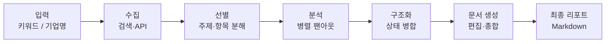
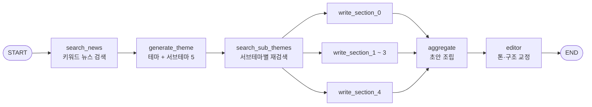

리포트를 자동으로 쓰게 만들 때 처음 손대는 곳은 대개 프롬프트다. 더 좋은 모델을 쓰고 지시를 정교하게 다듬으면 결과물이 나아질 것 같다. 그런데 실제로 파이프라인을 돌려 보면 병목이 다른 데 있다 — **수집과 분석이 본질적으로 병렬인데 순차로 짜여 있어서**, API 왕복 시간이 그대로 누적된다.

병렬로 바꾸려면 "몇 갈래로 갈라질 것인가"를 정해야 하고, 여기서 설계가 갈린다. 갈래 수를 코드에 박아 두면 그래프가 데이터 개수에 묶이고, 런타임에 정하려면 다른 장치가 필요하다. 이 시리즈는 성격이 달라 보이는 두 파이프라인 — 뉴스레터 생성기와 기업 분석 리포트 생성기 — 을 하나의 패턴으로 묶어 보면서 그 차이를 따라간다. 앞 시리즈에서 [노트북을 서비스로 옮기는](/blog/ai-agent/notebook-to-service/) 데까지 왔고, 이제 사람이 없는 시간에 스스로 도는 쪽을 만든다.

이 글은 그중 **정적 팬아웃** 쪽이다. 갈래 수를 5로 박아 두고 노드를 미리 펼쳐 만든 그래프가 어디까지 가고 어디서 막히는지를 본다.

## 용어 정리

| 약어 / 용어 | 원어 | 뜻 |
|---|---|---|
| Fan-out / Fan-in | Fan-out / Fan-in | 하나의 노드에서 여러 노드로 갈라졌다가(팬아웃) 다시 한 노드로 모이는(팬인) 그래프 형태 |
| Map-Reduce | Map-Reduce | 작업을 여러 조각으로 나눠 병렬 처리(Map)한 뒤 결과를 하나로 합치는(Reduce) 패턴 |
| `Send()` | LangGraph Send | 런타임에 "이 노드를 이 입력으로 실행하라"를 동적으로 발행하는 LangGraph 객체 |
| Reducer | Reducer | 여러 노드가 같은 상태 키에 쓸 때 값을 어떻게 합칠지 정하는 함수. `Annotated[T, fn]`으로 선언 |
| State | Graph State | 그래프 전체가 공유하는 데이터 구조. `TypedDict`로 정의 |
| ReAct | Reasoning + Acting | LLM이 "생각 → 도구 호출 → 관찰"을 반복하는 에이전트 루프 |
| Tool | Tool | LLM이 호출할 수 있게 스키마가 붙은 함수. `@tool` 데코레이터로 선언 |
| Structured Output | 구조화 출력 | LLM 응답을 자유 텍스트가 아닌 정해진 스키마(Pydantic)로 강제 받는 것 |
| LCEL | LangChain Expression Language | `prompt \| llm \| parser` 형태로 체인을 조립하는 파이프 문법 |
| SEC | Securities and Exchange Commission | 미국 증권거래위원회. 상장사 공시 원문 제공 |
| 10-K / 10-Q / 8-K | — | 각각 SEC 연간보고서 / 분기보고서 / 수시보고서 |
| CIK | Central Index Key | SEC가 기업에 부여하는 10자리 고유번호 |
| EPS / YoY / QoQ | Earnings Per Share / Year-over-Year / Quarter-over-Quarter | 주당순이익 / 전년 동기 대비 / 전분기 대비 성장률 |
| Tavily · Polygon · yfinance | — | 순서대로 LLM용 검색 API, 주가·재무제표·뉴스 금융 API, Yahoo Finance 주가 조회 라이브러리 |
| `recursion_limit` | — | 그래프가 밟을 수 있는 최대 스텝 수. 무한루프 방지용 안전장치 |

## 리포트 자동화가 수렴하는 5단계



| 단계 | 역할 | 뉴스레터 구현 | 기업분석 구현 | 대표 실패 모드 |
|---|---|---|---|---|
| 1. 수집 | 원재료 확보 | `search_recent_news` (Tavily, 5건) | `get_latest_filing_content`, `fetch_stock_data`, `collect_*_news` | 검색 0건, API 레이트리밋 |
| 2. 선별 | 분석 단위 결정 | LLM이 서브테마 5개 생성 | 재무·주식·시장 3관점 고정 | LLM이 4개만 생성 → 인덱스 초과 |
| 3. 분석 | 단위별 심층 처리 | 서브테마별 재검색 + 섹션 작성 | 관점별 ReAct 에이전트가 도구 반복 호출 | 일부 분기만 실패 |
| 4. 구조화 | 결과 병합 | `merge_dicts` 리듀서 | `operator.add` 리듀서 | 리듀서 없으면 쓰기 충돌 에러 |
| 5. 문서 생성 | 최종 산출물 | `aggregate` → `editor` | `combine` (6섹션 목차 프롬프트) | 컨텍스트 초과, 포맷 붕괴 |

**도식은 일곱 노드인데 표는 다섯 행이다.** 차이는 양 끝 — 입력과 최종 산출물이다. 표는 처리 단계만 세고 도식은 들어오는 것과 나가는 것까지 그리는데, 이 차이가 무의미하지 않다. 5단계는 전부 **변환**이고 양 끝은 **계약**이라 성격이 다르다. 입력이 키워드 하나냐 기업명 하나냐에 따라 뒤 단계가 전부 달라진다.

### 두 파이프라인의 차이는 도메인이 아니다

| 항목 | 뉴스레터 에이전트 | 기업분석 리포트 에이전트 |
|---|---|---|
| 입력 | 키워드 1개 (예: "OpenAI") | 기업명 1개 (예: "Tesla") |
| 수집 | Tavily 뉴스 검색 | SEC 공시 · Polygon 재무/주가 · yfinance · Tavily 뉴스 |
| 선별 | LLM이 메인테마 1 + 서브테마 5 생성 | 고정된 3개 관점(재무·주식·시장) |
| 팬아웃 방식 | **정적** — `for i in range(5)`로 노드 5개 미리 생성 | **동적** — `Send()`로 런타임 분기 |
| 병렬 단위 | 서브테마별 섹션 작성 | 관점별 ReAct 에이전트 |
| 노드 성격 | 단순 함수 (LLM 1회 호출) | ReAct 에이전트 (도구 여러 번 호출) |
| 리듀서 | `merge_dicts` (dict 병합) | `operator.add` (list 누적) |
| 종합 | `aggregate` → `editor` 2단계 | `combine` 1단계 |
| 출력 포맷 강제 | Pydantic (`NewsletterThemeOutput`) + 편집 프롬프트 | 프롬프트 안 6개 섹션 목차 |
| 비동기 | `asyncio.gather`로 검색 병렬화 | LangGraph 병렬 실행에 위임 |

열한 행 중 네 번째가 나머지를 끌고 온다 — 팬아웃 방식이 정적이냐 동적이냐가 리듀서 선택도, 노드 성격도, 비동기 처리 위치도 정한다.

> 리포트 자동화의 병목은 LLM 품질이 아니라 **팬아웃 설계**다. 수집·분석 단계는 본질적으로 병렬이라 순차로 짜면 API 왕복이 그대로 누적된다.
>
> 그런데 "몇 갈래로 갈라질지"는 실행 전에 모를 때가 많다. 경쟁사는 기업마다 수가 다르고 검색 결과는 쿼리마다 개수가 다르다. 여기서 정적 팬아웃이 무너지고, 그 자리를 메우는 것이 다음 편의 `Send()`다. 두 파이프라인은 난이도 순서가 아니라 **같은 문제의 두 해법**이다.

### 왜 "선별" 단계가 따로 필요한가

수집 결과를 그대로 LLM에 넣으면 컨텍스트가 터지고, 결과물은 평평한 요약이 된다. 선별 단계는 두 가지를 한다 — **분해**(큰 주제를 병렬 가능한 독립 단위로 쪼갬. 이게 있어야 팬아웃이 성립한다)와 **좁히기**(단위를 조사 가능한 수준으로 구체화). 뉴스레터는 후자를 프롬프트에 못 박았다: `The sub-themes should create a clear direction for the newsletter, avoiding broad, generic topics.`

기업분석은 이 단계를 LLM에 맡기지 않고 **3개 관점으로 하드코딩**했다. 리포트 목차가 이미 업계 표준으로 정해져 있는 도메인이기 때문이다. **선별을 LLM에 맡길지 고정할지는 도메인의 목차 안정성으로 판단한다.**

## 뉴스레터 에이전트의 그래프



구조는 "테마 설정 → 본문 작성 → 편집"의 3층이다. 눈여겨볼 것은 **검색이 두 번 일어난다**는 점이다. 처음엔 테마를 정하기 위해 얕게, 두 번째는 본문을 쓰기 위해 서브테마별로 깊게(`search_depth: "advanced"`, `include_raw_content: True`) 검색한다. 같은 검색 API를 두 번 부르지만 목적이 다르므로 파라미터도 다르다.

### 상태 스키마와 리듀서

```python
from typing import Dict, List, Annotated
from typing_extensions import TypedDict
from langgraph.graph.message import add_messages
from .models import NewsletterThemeOutput

def merge_dicts(left: Dict, right: Dict) -> Dict:
    return {**left, **right}

class State(TypedDict):
    keyword: str
    article_titles: List[str]
    newsletter_theme: NewsletterThemeOutput
    sub_theme_articles: Dict[str, List[Dict]]
    results: Annotated[Dict[str, str], merge_dicts]
    messages: Annotated[List, add_messages]
```

| 키 | 타입 | 리듀서 | 왜 이 리듀서인가 |
|---|---|---|---|
| `keyword` | `str` | 없음 (덮어쓰기) | 입력값. 한 노드만 쓴다 |
| `article_titles` | `List[str]` | 없음 | `search_news` 단독 쓰기 |
| `newsletter_theme` | Pydantic 모델 | 없음 | `generate_theme` 단독 쓰기 |
| `sub_theme_articles` | `Dict[str, List[Dict]]` | 없음 | `search_sub_themes`가 이미 합쳐서 한 번에 쓴다 |
| `results` | `Dict[str, str]` | **`merge_dicts`** | `write_section_0~4` **5개가 동시에** 쓴다 |
| `messages` | `List` | **`add_messages`** | `aggregate`와 `editor`가 차례로 append |

여섯 키 중 리듀서가 붙은 것은 둘뿐이고, 그 둘이 정확히 "여러 노드가 손대는 키"다.

> 리듀서는 **"여러 노드가 같은 키에 동시에 쓸 때"만** 필요하다. 리듀서 없이 병렬 노드가 같은 키에 쓰면 LangGraph는 어느 값을 채택할지 결정할 수 없어 쓰기 충돌 에러를 낸다. 기본 규칙은 [병렬 처리와 리듀서 편](/blog/rag/langgraph-parallel-multiagent/)에 정리돼 있다.
>
> 여기서 확장할 것은 **어떤 리듀서를 고르느냐가 곧 팬아웃 설계**라는 점이다. `merge_dicts`가 `{**left, **right}`인 이유는 각 섹션이 **서로 다른 키**(서브테마명)에 쓰기 때문이다. 키가 겹치지 않으니 단순 병합으로 충분하다. 반대로 키를 미리 정할 수 없는 구조라면 이 리듀서를 쓸 수 없고, 그 경우가 다음 편에서 나온다.

### 노드 분해

| 노드 | 동기/비동기 | 입력 키 | 출력 키 | 하는 일 |
|---|---|---|---|---|
| `search_keyword_news` | 동기 | `keyword` | `article_titles` | Tavily 뉴스 검색 5건, 제목만 추출 |
| `generate_newsletter_theme` | 동기 | `article_titles` | `newsletter_theme` | 구조화 출력으로 테마 1 + 서브테마 5 |
| `search_sub_theme_articles` | **비동기** | `newsletter_theme` | `sub_theme_articles` | `asyncio.gather`로 5개 검색 동시 실행 |
| `write_newsletter_section` ×5 | 동기 래퍼 | `sub_theme_articles` | `results` | 서브테마별 섹션 본문 작성 |
| `aggregate_results` | 비동기 | `results`, `newsletter_theme` | `messages` | 마크다운 헤딩으로 초안 조립 |
| `edit_newsletter` | 비동기 | `messages` | `messages` | 톤 일관성·전환·문법 교정 |

**표는 여섯 행인데 위 도식의 실행 노드는 열 개다.** 표가 `×5`로 한 행에 접은 것을 도식은 상자 셋으로 펼쳐 그렸고(실제는 다섯), 도식에는 START·END가 더 있다. 표는 **노드의 종류**를 세고 도식은 **실행 인스턴스**를 센다 — 그리고 이 둘의 개수가 어긋난다는 사실 자체가 이 글의 주제다. 종류는 여섯으로 고정인데 인스턴스는 서브테마 개수를 따라 변해야 한다.

`aggregate`는 LLM을 쓰지 않는다. `f"# {theme}"` 아래에 `results`의 각 항목을 `f"## {sub_theme}\n{content}"`로 이어붙이는 순수 문자열 조립이다.

> **조립(결정적)과 편집(확률적)을 분리한 것**이 이 설계의 좋은 점이다. 조립을 LLM에 맡기면 섹션이 누락되거나 순서가 뒤바뀔 수 있다.
>
> 이 분리가 값을 하는 이유는 실패 양상이 달라지기 때문이다. 코드가 조립하면 섹션 누락은 버그로 나타나 재현되고 고칠 수 있다. LLM이 조립하면 같은 누락이 확률적으로 나타나 재현되지 않는다. **보장할 수 있는 것은 코드가 보장하고, LLM은 다듬기만 한다.**

## 정적 팬아웃, 그리고 그 한계

```python
def create_newsletter_graph():
    workflow = StateGraph(State)
    workflow.add_node("editor", edit_newsletter)
    workflow.add_node("search_news", search_keyword_news)
    workflow.add_node("generate_theme", generate_newsletter_theme)
    workflow.add_node("search_sub_themes", search_sub_theme_articles)
    workflow.add_node("aggregate", aggregate_results)

    workflow.add_edge("aggregate", "editor")
    workflow.add_edge("editor", END)

    # 노드 5개를 컴파일 타임에 미리 생성 — i=i 로 현재 값 캡처
    for i in range(5):
        workflow.add_node(f"write_section_{i}",
            lambda s, i=i: write_newsletter_section(s, s['newsletter_theme'].sub_themes[i]))

    workflow.add_edge(START, "search_news")
    workflow.add_edge("search_news", "generate_theme")
    workflow.add_edge("generate_theme", "search_sub_themes")
    for i in range(5):
        workflow.add_edge("search_sub_themes", f"write_section_{i}")
        workflow.add_edge(f"write_section_{i}", "aggregate")

    return workflow.compile()
```

이 짧은 조립 함수에 논점이 셋 들어 있다.

| 논점 | 내용 |
|---|---|
| **`lambda s, i=i:`의 `i=i`** | 파이썬 클로저 늦은 바인딩 회피. `i=i` 없이 `lambda s:`로 쓰면 5개 람다가 전부 루프 종료 후의 `i=4`를 참조해 같은 섹션만 5번 쓴다 |
| **`sub_themes[i]` 인덱싱** | 서브테마가 5개 미만이면 `IndexError`. `generate_theme`에 방어 코드 `sub_themes[:5]`가 있지만 **초과만 막고 부족은 못 막는다** |
| **5라는 숫자의 하드코딩** | 그래프 구조가 데이터 개수에 결합됐다. 서브테마를 3개나 8개로 바꾸려면 그래프 코드를 고쳐야 한다 |

> 첫 행은 파이썬 관용구지만 여기서는 결과가 특히 고약하다. **틀려도 예외가 안 난다.** 5개 섹션이 전부 마지막 서브테마로 채워진 뉴스레터가 정상 종료되어 나온다.
>
> `IndexError`는 로그에 남지만 "다섯 섹션이 전부 같은 내용"은 사람이 읽어야 발견된다. 그래프를 코드로 조립하는 방식에서 반복 생성된 노드가 전부 같은 클로저 변수를 참조하는 것은 흔한 사고이고, 정적 팬아웃을 쓰는 한 계속 나온다.

두 번째와 세 번째 행이 같은 뿌리에서 나온다. **그래프 구조가 데이터 개수를 알고 있어야 한다**는 전제다.

> 이 한계가 다음 편의 `Send()`를 필요하게 만든다. 뉴스레터는 "5개"라는 상수로 문제를 봉합했지만, 기업 A는 경쟁사가 3곳이고 기업 B는 12곳인 상황에서는 봉합이 불가능하다.
>
> 봉합이 가능했던 이유를 정확히 짚으면 이렇다 — 서브테마 개수는 **우리가 프롬프트로 지시할 수 있는 값**이었다. LLM에게 5개를 만들라고 했으니 대체로 5개가 온다. 하지만 경쟁사 수는 지시 대상이 아니라 데이터다. 통제할 수 없는 값이 갈래 수를 정하는 순간 정적 팬아웃은 성립하지 않는다.

## 병렬화 지점이 두 층으로 나뉜다

파이프라인이 순차로 짜이면 API 호출 시간이 그대로 누적된다. 뉴스레터는 여러 세부 주제에 대해 검색을 반복하고 그 결과로 본문을 여러 번 쓰므로, 두 곳 모두에서 지연이 곱해진다. 그래서 병렬화를 두 층에 나눠 넣었다 — **검색은 노드 안에서 `asyncio.gather`로, 본문 작성은 그래프 구조로**(노드 5개 팬아웃).

```python
async def search_sub_theme_articles(state: State) -> State:
    subthemes = state['newsletter_theme'].sub_themes
    results = await asyncio.gather(
        *[search_news_for_subtheme(subtheme) for subtheme in subthemes])
    sub_theme_articles = {}
    for result in results:
        sub_theme_articles.update(result)
    if not any(sub_theme_articles.values()):   # 전건 실패만 차단 — 부분 실패는 통과
        raise ValueError("No articles found for any sub-theme.")
    return {"sub_theme_articles": sub_theme_articles}
```

| 병렬화 층 | 대상 | 수단 | 장점 | 단점 |
|---|---|---|---|---|
| 노드 **내부** | 서브테마 5개 검색 | `asyncio.gather` | 구현 간단, 노드 1개로 끝 | 그래프에서 진행상황이 안 보임, 부분 실패 추적 어려움 |
| 그래프 **구조** | 섹션 5개 작성 | 노드 5개 + 팬아웃 | 스트리밍으로 개별 진행 관찰 가능, 재시도 단위가 명확 | 그래프 코드가 개수에 결합 |

두 행의 장단점이 정확히 교차한다 — 한쪽이 얻는 것을 다른 쪽이 잃는다.

> 선택 기준은 **그 단계의 실패를 개별적으로 다뤄야 하는가**다. 검색 하나가 실패해도 빈 결과로 넘어가면 그만이라면 노드 안에서 묶는 편이 싸다. 반면 섹션 작성은 하나가 실패하면 그 섹션만 재시도하고 싶으므로 그래프에 노출해야 한다.
>
> 위 코드의 `if not any(...)` 검사가 그 판단을 드러낸다. **전건 실패만 차단하고 부분 실패는 통과시킨다.** 검색 다섯 중 셋만 성공해도 파이프라인은 계속 간다. 이 선택이 맞는지는 다음 단계가 빈 입력을 견디는지에 달렸고, 여기서는 섹션 본문이 근거 없이 쓰이는 위험을 감수한 것이다.

### 동기 래퍼는 안티패턴이다

`write_newsletter_section`은 async 함수를 `asyncio.run()`으로 감싼 동기 래퍼다.

```python
def write_newsletter_section(state: State, sub_theme: str) -> Dict:
    return asyncio.run(write_newsletter_section_async(state, sub_theme))
```

> LangGraph가 동기 노드를 별도 스레드에서 돌리기 때문에 **동작은 한다.** 하지만 이미 실행 중인 이벤트 루프 안에서 `asyncio.run()`을 호출하면 `RuntimeError`가 난다.
>
> 즉 이 코드는 실행 컨텍스트에 따라 되기도 하고 안 되기도 한다. 노트북에서 잘 돌던 것이 비동기 서버에 얹는 순간 터지는 전형적인 형태다. 노드를 그냥 `async def`로 선언하고 스레드 관리를 LangGraph에 맡기는 것이 정석이다.

---

여기까지가 갈래 수를 아는 경우다. 5라는 숫자를 코드에 박아 두는 대가로 그래프가 전부 눈에 보이고, 노드 이름이 고정되니 디버깅도 쉽다.

문제는 그 숫자를 모를 때다. 기업마다 경쟁사 수가 다르고, 검색 결과 문서 수는 쿼리마다 다르며, 서브테마조차 LLM이 넷만 만들어 올 수 있다. **갈래 수가 입력에 따라 변하는 순간 `for i in range(5)`는 성립하지 않는다.** [다음 편](/blog/ai-agent/send-map-reduce-report/)에서 `Send()`로 런타임에 노드를 발행하는 Map-Reduce 구조를 조립하고, 그때 리듀서 선택이 왜 함께 바뀌는지를 본다.
