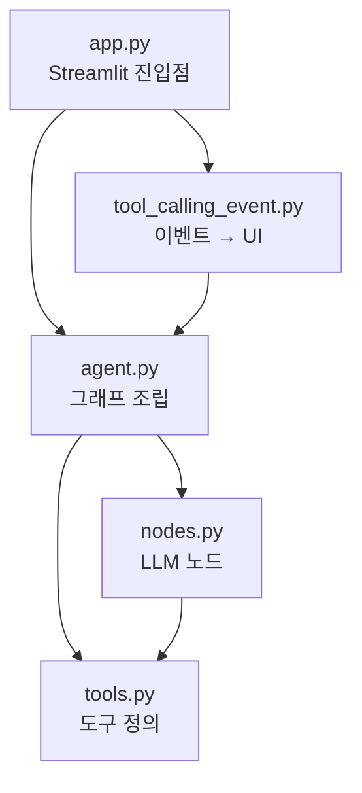
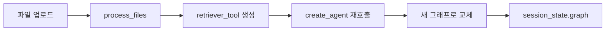
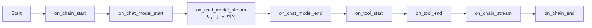
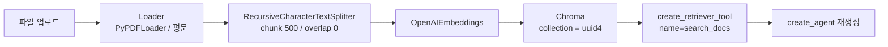
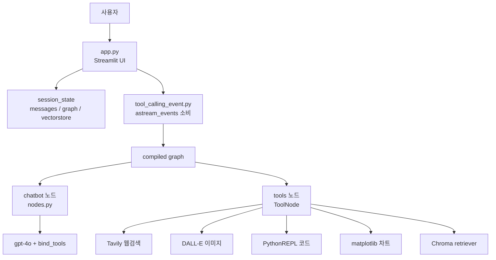

노트북에서 도는 에이전트를 서비스로 옮길 때 대개 화면부터 붙인다. Streamlit 파일을 하나 만들고 노트북 셀을 복사해 넣으면 일단 돌아간다. 그러다 사용자가 파일을 올리는 기능을 넣는 순간 막힌다 — 도구 목록이 사용자마다 달라야 하는데 그래프가 모듈 최상단의 전역 상수이기 때문이다.

이 글은 그 지점부터 시작한다. 그래프를 상수에서 **팩토리 산출물**로 바꾸고, 파일을 변경 축으로 가르고, 도구가 도는 동안 화면이 조용한 문제를 노드 내부 스트리밍으로 푼다. [앞 편](/blog/ai-agent/chatgpt-as-tool-router/)에서 그래프 두 노드와 도구 다섯 개까지 만들었다.

## 용어 정리

앞 편의 용어표에서 이 글이 쓰는 행만 추렸다.

| 약어 / 용어 | 원어 | 뜻 |
|---|---|---|
| `astream_events` | `graph.astream_events()` | 노드 **내부**의 LLM 토큰·도구 시작/종료까지 이벤트로 흘려주는 비동기 스트리밍 API |
| `stream_mode` | `values` / `updates` | 노드 **경계**에서의 스트리밍 단위. 전체 상태 대 변경분 |
| `MessagesState` | `langgraph.graph.MessagesState` | `messages` 키 하나만 가진 내장 State |
| Retriever Tool | `create_retriever_tool` | 벡터 검색기를 "도구"로 감싸 LLM이 직접 호출할 수 있게 만든 래퍼 |
| RAG | Retrieval-Augmented Generation | 외부 문서를 검색해 LLM 답변 근거로 넣는 기법 |
| Chroma | ChromaDB | 로컬 임베디드 벡터 DB |
| Streamlit | Streamlit | 파이썬만으로 웹 UI를 만드는 프레임워크. 입력마다 스크립트를 통째로 재실행 |
| `session_state` | `st.session_state` | Streamlit이 재실행되어도 살아남는 세션 단위 저장소 |
| 팩토리 함수 | factory function | 그래프를 만들어 반환하는 함수. 설정을 인자로 주입받는다 |
| Checkpointer | — | 상태 스냅샷을 저장해 중단·재개를 가능하게 하는 저장소 |

## 파일을 변경 축으로 가른다

| 파일 | 책임 | 바뀌는 이유(변경 축) |
|---|---|---|
| `agent.py` | 그래프 조립 — 노드 등록·엣지·컴파일 | **워크플로가 바뀔 때** |
| `nodes.py` | LLM 노드 — 모델 선택·System Prompt·체인 구성 | **프롬프트·모델을 바꿀 때** |
| `tools.py` | 도구 정의 — 외부 API 연동, 도구 목록 조립 | **도구를 추가·교체할 때** |
| `tool_calling_event.py` | 스트리밍 이벤트 → UI 렌더 변환 | **UI 표현을 바꿀 때** |
| `app.py` | Streamlit 진입점 — 세션 상태·파일 업로드·채팅 루프 | **화면·입력 경로가 바뀔 때** |

세 번째 열이 분리 기준의 전부다. 파일을 기능으로 가르면 "이건 어디에 넣지"가 계속 나오지만, **바뀌는 이유로 가르면 그 질문이 사라진다.**



**표는 다섯 행, 도식은 다섯 노드로 정확히 대응한다.** 도식이 더하는 것은 화살표 방향 하나뿐인데 그것이 핵심이다 — 의존이 **위에서 아래 한 방향**이다. `tools.py`는 아무것도 import하지 않고, `agent.py`는 Streamlit을 모른다.

> 이 단방향성이 만들어 내는 실질적 이득은 하나다. **`agent.py` + `nodes.py` + `tools.py` 세 파일만 떼어 CLI·API 서버·배치로 옮길 수 있다.**
>
> 화살표가 한 번이라도 역류하면 — 예컨대 `tools.py`가 진행 표시를 위해 `st.write`를 부르면 — 그 순간 도구가 Streamlit에 묶여 서버로 옮길 수 없게 된다. UI 프레임워크 의존이 아래층으로 새는 것은 흔한 사고이고, 대개 "잠깐 디버깅용"으로 시작한다.

### 노트북과 무엇이 달라졌나

| 항목 | 노트북 | 프로덕션(`.py` 5종) |
|---|---|---|
| State | 매번 `class State(TypedDict)` 직접 정의 | 내장 `MessagesState` 사용 |
| 그래프 | 셀에서 전역 변수로 조립 | `create_agent()` **팩토리 함수** |
| 도구 | 셀마다 `tools = [...]` 하드코딩 | `get_tools(retriever_tool)`로 **동적 구성** |
| 프롬프트 | 셀 안 f-string | `get_system_prompt(docs_info)` 함수 |
| LLM 모델 | `gpt-4o-mini` | `gpt-4o`(품질 우선) |
| 실행 | `graph.stream()` 동기 | `graph.astream_events()` 비동기 |
| 관측 | 없음 | LangSmith 트레이싱 환경변수 설정 |

일곱 행 중 2·3행이 나머지를 끌고 온 원인이다 — 그래프를 함수로 감싸기로 한 결정 하나가 도구 구성·프롬프트 생성까지 전부 함수로 밀어낸다.

### 팩토리 함수가 핵심인 이유

인라인 구성을 함수로 감쌌을 때 무엇이 달라지는지 — 설정 주입, 재사용, 테스트 격리 — 는 [서브그래프 리팩터링 편](/blog/rag/langgraph-subgraph-retrofit/)에 다섯 축으로 정리돼 있다. 여기서는 그 표에 없는 트리거를 본다. **도구 목록이 사용자마다·시점마다 다르다**는 조건이다.



> 그래프는 **상수가 아니라 파라미터를 받아 그때그때 만들어지는 산출물**이어야 한다. `create_agent(docs_info, retriever_tool)`이라는 시그니처 전체가 이 한 문장에서 나온다.
>
> 왜 도구가 바뀌면 그래프를 통째로 다시 만들어야 하는지는 컴파일 시점을 보면 명확하다. `bind_tools`의 결과와 `ToolNode`의 내용이 컴파일 때 확정되므로, 도구 목록이 달라지면 두 노드가 모두 달라진다. 부분 교체가 되지 않으니 재컴파일이 맞다.

## 도구 호출 이벤트 스트리밍

| 방법 | 단위 | 나오는 것 |
|---|---|---|
| `stream_mode="updates"` | 노드 경계 | 각 노드가 **바꾼 값만** |
| `stream_mode="values"` | 노드 경계 | 그 시점까지 **누적된 전체 State** |
| `astream_events()` | 노드 **내부** | LLM 토큰 하나하나 + 도구 시작/종료 |

> 타이핑하듯 글자가 흐르고 "도구 호출 중…" 상태가 뜨려면 **세 번째만이 답이다.** 앞의 둘은 노드가 끝나야 값이 나온다.
>
> 이 구분이 실무에서 자주 틀리는 자리다. `stream()`이라는 이름 때문에 토큰이 나올 것 같지만, LangGraph의 스트리밍 단위는 기본적으로 **노드**다. 도구 하나가 30초를 먹는 노드라면 `stream_mode`를 무엇으로 주든 30초 동안 아무것도 나오지 않는다. 노드를 잘게 쪼개서 해결하려 들기 전에 `astream_events()`를 먼저 봐야 한다.



이벤트 객체는 `event`(종류) / `name`(노드·도구 이름) / `data`(input·output·chunk) 세 필드를 갖는다. 도식의 여덟 단계 중 UI가 실제로 소비하는 것은 `on_chat_model_stream`·`on_tool_start`·`on_tool_end` 셋뿐이고, 나머지 다섯은 경계 표시라 대개 무시한다.

### UI 변환 코드

```python
async def invoke_our_graph(state, st_placeholder, graph):
    container = st_placeholder
    thoughts_placeholder = container.container()   # 도구 진행 표시 영역
    token_placeholder = container.empty()          # 답변 텍스트 영역
    final_text = ""

    async for event in graph.astream_events(state, version="v2"):
        kind = event["event"]

        if kind == "on_chat_model_stream":
            addition = event["data"]["chunk"].content
            final_text += addition
            if addition:
                token_placeholder.write(final_text)   # 누적 문자열을 통째로 갱신

        elif kind == "on_tool_start":
            with thoughts_placeholder:
                status_placeholder = st.empty()
                with status_placeholder.status("도구 호출중...", expanded=True) as s:
                    tool_name = event['name']
                    st.write(f"🔧 {tool_name}를 호출했습니다.")
                    input_data = event['data'].get('input')
                    st.code(input_data)               # 어떤 인자로 불렀는지 노출
                    output_placeholder = st.empty()   # 결과가 들어올 자리를 미리 확보
                    s.update(label="도구 호출을 완료했어요!", expanded=False)

        elif kind == "on_tool_end":
            tool_output = event['data'].get('output')
            output_placeholder.code(tool_output)
            if event['name'] in ['data_visualization', 'generate_image']:
                if tool_output.startswith("data:image/png;base64,"):
                    final_text += f"\n\n"
                elif tool_output.split(",")[1].startswith("http"):
                    final_text += f"\n[1]})\n"
    return final_text
```

| 패턴 | 구현 | 왜 |
|---|---|---|
| **자리 예약** | `on_tool_start`에서 `output_placeholder = st.empty()` | 결과가 오기 전에 위치를 잡아야 화면이 튀지 않음 |
| **누적 후 통짜 갱신** | `final_text += addition` 후 `write(final_text)` | Streamlit은 append가 아니라 **덮어쓰기** 렌더 |
| **도구 이름 기반 분기** | `if event['name'] in [...]` | 이미지 계열 도구만 마크다운 이미지로 변환 |
| **입력값 노출** | `st.code(input_data)` | 사용자가 "무슨 쿼리로 검색했는지" 확인 가능 |

네 패턴 중 앞의 셋은 Streamlit의 렌더 모델에 맞추는 기술적 처리이고, 마지막 하나만 성격이 다르다.

> 마지막 항목은 UI 기법이 아니라 제품 결정이다. **도구 이름·입력·출력을 보여주는 것 자체가 기능이다.**
>
> 에이전트에 대한 불신은 대부분 "왜 이런 답이 나왔는지 모름"에서 온다. 앞 편에서 본 인자 재작성이 특히 그렇다 — 내가 쓴 문장과 다른 검색어로 검색이 돌았는데 그 사실이 화면에 없으면 결과를 검증할 방법이 없다. ChatGPT가 검색 출처를 접어서라도 노출하는 것도 같은 방향으로 읽히지만, 그 선택의 실제 이유는 밖에서 알 수 없다.

### 알려진 결함

이 코드에는 실무에서 반드시 걸리는 문제가 셋 있다. 아래는 원 자료에 없어 직접 채운 것이다.

| 문제 | 위치 | 개선 |
|---|---|---|
| 지역변수 존재 여부로 상태 추적 | `on_tool_end`의 `output_placeholder` 참조 | 도구 병렬 호출 시 **직전 것에 덮어쓴다**. `run_id` 기준 dict로 관리해야 함 |
| `tool_output.split(",")[1]` | 이미지 분기 | 콤마가 여러 개인 출력에서 깨진다. 접두어 파싱을 명시적으로 |
| f-string 안 큰따옴표 중첩 | 이미지 마크다운 | Python 3.12 미만에서 문법 오류 |

> 첫 번째가 앞 편에서 본 결합 질의와 정면으로 충돌한다. **"조사하고 그림으로 표현해줘"는 도구 두 개를 동시에 발행하는 질의**였고, 그때 `output_placeholder`는 하나뿐이다.
>
> 즉 이 결함은 예외적인 입력에서 터지는 것이 아니라 **이 클론이 자랑하는 바로 그 시나리오에서 터진다.** 이벤트 스트림은 본질적으로 여러 실행이 뒤섞여 흐르므로, 상태를 지역변수가 아니라 `run_id`를 키로 하는 맵에 담아야 한다. 이벤트 객체가 `run_id`를 주는 이유가 그것이다.

## Streamlit 앱 조립

```python
def initialize_session_state():
    if "messages" not in st.session_state:
        st.session_state.messages = [AIMessage(content="무엇을 도와드릴까요?")]
    if "graph" not in st.session_state:
        st.session_state.graph = create_agent()
    if "vectorstore" not in st.session_state:
        st.session_state.vectorstore = None
    if "current_files_hash" not in st.session_state:
        st.session_state.current_files_hash = None
```

| 키 | 보관 대상 | 없으면 |
|---|---|---|
| `messages` | 대화 이력 | 매 입력마다 대화가 초기화 |
| `graph` | 컴파일된 LangGraph | 입력마다 그래프 재컴파일(느림) |
| `vectorstore` | Chroma 인스턴스 | 질문마다 PDF 재임베딩(과금) |
| `current_files_hash` | 업로드 파일 지문 | 같은 파일을 반복 임베딩 |

네 키가 전부 "다시 만들면 비싼 것"이다. Streamlit은 사용자 입력마다 **스크립트를 처음부터 다시 실행**하므로, "무엇을 세션에 남길 것인가"가 곧 성능 설계가 된다.

### 파일 해시 캐싱

```python
def get_files_hash(uploaded_files):
    """업로드된 파일들의 해시값을 생성합니다."""
    return hash(tuple(f.name + str(f.size) for f in uploaded_files))

# 동일 파일이면 기존 vectorstore 재사용, 아니면 새로 임베딩
if (st.session_state.current_files_hash == current_hash
        and st.session_state.vectorstore is not None):
    retriever = st.session_state.vectorstore.as_retriever()
```

> `이름 + 크기`만으로 만든 지문이라 **내용이 바뀌어도 크기가 같으면 캐시 히트**한다. 실서비스에서는 바이트 스트림의 SHA-256을 써야 한다.
>
> 이 결함이 위험한 이유는 조용하기 때문이다. 캐시가 잘못 맞으면 에러가 아니라 **옛 문서로 답변하는 정상 응답**이 나온다. 파이썬 내장 `hash()`가 프로세스마다 시드가 달라 재시작 후 값이 바뀐다는 점도 겹친다 — 지문은 결정적이어야 하고, 내용에서 나와야 한다.

### 문서 업로드를 RAG 도구로 바꾸는 경로



앞의 다섯 단계는 표준 RAG 인덱싱이고, 마지막 두 단계가 이 구조 고유의 것이다.

```python
retriever_tool = create_retriever_tool(
    retriever,
    "search_docs",
    f"Search through the following documents: {file_names}",  # 설명에 파일명을 넣는다
)
st.session_state.graph = create_agent(docs_info, retriever_tool)
```

> **도구 설명에 실제 파일명을 넣는 것**이 요령이다. LLM은 이 설명만 보고 호출 여부를 정하므로, "이 도구 안에 무엇이 들어 있는지"가 설명에 없으면 도구를 부르지 않는다.
>
> 앞 편의 "docstring이 곧 스펙"이 런타임 버전으로 나타난 자리다. 정적으로 쓰는 docstring과 달리 여기서는 설명 문자열 자체를 사용자 데이터로 조립한다. 문서를 올렸는데 답을 못 찾는 증상을 만나면 검색 품질보다 이 문자열을 먼저 봐야 한다 — 애초에 도구가 호출되지 않았을 가능성이 크다.

### 채팅 루프

```python
prompt = st.chat_input("메시지를 입력하세요")
if prompt:
    st.session_state.messages.append(HumanMessage(content=prompt))
    with st.chat_message("user"):
        st.write(prompt)

    with st.chat_message("assistant"):
        placeholder = st.container()
        try:
            response = asyncio.run(invoke_our_graph(
                {"messages": st.session_state.messages},   # 전체 이력을 매번 투입
                placeholder,
                st.session_state.graph,
            ))
            st.session_state.messages.append(AIMessage(content=response))
        except RecursionError as e:
            st.error(f"⚠️ 너무 많은 재귀 호출이 발생했습니다: {str(e)}")
```

| 결정 | 의미 |
|---|---|
| 매 턴 `messages` **전체**를 State로 넣음 | Checkpointer 없이 앱 레벨에서 메모리를 관리 |
| `asyncio.run()`으로 비동기 진입 | 동기 Streamlit에서 async 스트리밍을 쓰기 위한 다리 |
| `st.container()`를 placeholder로 전달 | 렌더 위치를 이벤트 핸들러에 위임 |

첫 행이 다음 절의 미구현 목록 절반을 설명한다 — 대화가 앱 메모리에만 있으면 영속화도 세션 격리도 성립하지 않는다.

## 데모와 서비스 사이에 남은 것

여기까지가 재현의 절반이다. 나머지 절반을 목록으로 적어 두면 그것이 곧 실서비스 체크리스트가 된다.

| 미구현 | 필요한 것 |
|---|---|
| 멀티 세션·사용자 인증 | 사용자별 격리, DB 기반 대화 저장 |
| 대화 영속화 | LangGraph Checkpointer + `thread_id` |
| 컨텍스트 길이 관리 | 요약·트리밍 전략 |
| 코드 실행 격리 | 샌드박스 컨테이너 |
| 스트리밍 중단 | 취소 토큰 |
| 비용 상한 | 호출 횟수·토큰 쿼터 |

> 여섯 항목이 두 무리로 갈린다. 1·2·3은 **상태를 어디에 둘 것인가**의 문제이고, 4·5·6은 **무엇을 못 하게 막을 것인가**의 문제다.
>
> 앞 무리는 Checkpointer 하나를 도입하면 세 개가 함께 풀린다. 뒤 무리는 그런 단일 해법이 없고 각각 다른 계층에서 막아야 한다 — 격리는 인프라, 중단은 런타임, 쿼터는 애플리케이션이다. 도입 순서를 정할 때 이 차이가 실질적이다.

## 전체 조립도



**이 도식은 열세 노드인데 앞의 파일 표는 다섯 행이었다.** 축척이 다르기 때문이다 — 조립도는 파일 5개, 그래프 내부 노드 2개, 도구 5개, 그리고 세션 저장소를 한 그림에 겹쳐 그린다. 파일 경계와 실행 경계가 일치하지 않는다는 것이 이 그림이 주는 정보다. `tools.py` 한 파일이 도식에서는 다섯 갈래로 펼쳐지고, 반대로 `agent.py`는 도식에 노드가 없다. 조립만 하고 런타임에는 사라지기 때문이다.

---

두 편에 걸쳐 확인한 것을 한 문장으로 줄이면 이렇다. **관찰된 동작의 대부분은 모델 크기가 아니라 "언제 무엇을 부를지 판단하는 라우팅"으로 설명되며, 그 판단은 코드가 아니라 프롬프트에, 그 반복은 그래프의 되돌림 엣지 하나에 담긴다.** 원 제품이 실제로 그렇게 만들어졌는지는 여전히 알 수 없지만, 같은 관찰을 내는 구조 하나를 손에 넣었다.

여기까지의 두 클론은 사용자가 질문을 던지면 에이전트가 답하는 형태였다. 사람이 시작하고 사람이 읽는다. 그런데 에이전트를 쓰는 이유 중 상당수는 그 반대쪽에 있다 — **사람이 없는 시간에 스스로 돌아 결과물을 만들어 두는 것**이다. 다음 시리즈에서 정해진 시각에 여러 소스를 훑어 리포트를 써 내는 에이전트를 만들고, 그때 팬아웃과 종료 조건이 왜 다른 문제가 되는지를 본다.
