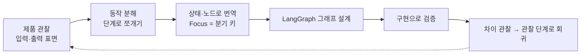
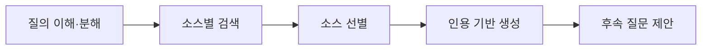
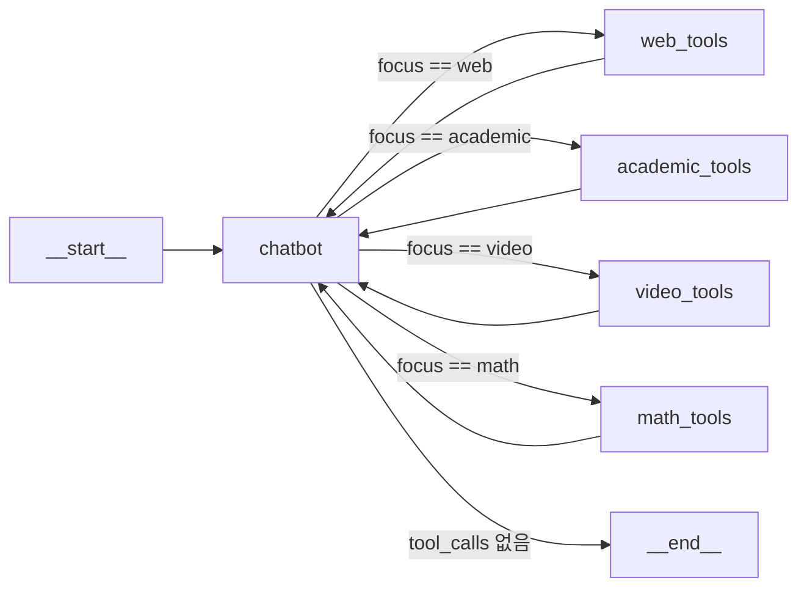

"Perplexity 클론"이라는 이름이 붙은 예제를 열면 시선이 대개 결과물로 간다. 검색이 되는가, 답변이 그럴듯한가. 그런데 완성도로만 보면 이런 클론은 거의 항상 원본에 못 미치고, 그 격차를 확인하는 것만으로는 남는 것이 없다.

값이 있는 것은 클론이 아니라 **그 앞에 있는 절차**다 — 완성된 제품의 화면만 보고 그 안에서 도는 에이전트 그래프를 되짚어 그리는 일. 클론은 그 추론이 맞았는지 확인하는 검증 수단일 뿐이다. 이 글은 그 절차를 다섯 단계로 세우고, Perplexity에 적용해 State·노드·조건분기까지 그린다. [앞 시리즈](/blog/ai-agent/hierarchical-team-subgraph/)에서 부품을 다 만들었으니 이제 제품을 해체할 차례다.

시작하기 전에 선을 하나 긋는다. **화면에서 본 것과 거기서 끌어낸 결론은 종류가 다른 진술이다.** 상용 제품의 내부 구현은 공개돼 있지 않으므로, 이 글이 원 제품에 대해 말하는 것은 전부 관찰과 추론이며 내부 동작의 확인이 아니다. 이 구분을 문장 안에서 화살표로 갈라 놓는 것이 이 절차의 첫 규율이다.

## 용어 정리

| 약어 / 용어 | 원어 | 뜻 |
|---|---|---|
| Focus | Focus mode | Perplexity가 제공하는 검색 소스 한정 기능. Web / Academic / Math / Writing / Video / Social 중 선택 |
| Citation | Citation | 답변 문장에 붙는 각주형 출처 표시. 본문의 `[1]`이 Sources 목록의 특정 문서를 가리킴 |
| Grounding | Grounding | 모델 답변을 외부 근거 문서에 묶어두는 것. 인용은 그라운딩을 사용자에게 보이는 형태 |
| State | Graph State | LangGraph에서 노드 사이를 흐르는 공유 상태. 여기서는 `TypedDict`로 정의 |
| Reducer | State reducer | 상태 필드를 어떻게 병합할지 정하는 함수. `add_messages`는 append 방식 |
| ToolNode | LangGraph ToolNode | `tool_calls`를 실제로 실행해 `ToolMessage`로 되돌려주는 사전 제작(prebuilt) 노드 |
| Conditional Edge | Conditional Edge | 상태를 읽어 다음 노드 이름을 문자열로 반환하는 분기 간선 |
| Tavily | Tavily Search API | LLM 에이전트용 웹 검색 API. `TavilySearchResults` 도구로 래핑 |
| arXiv | arXiv | 논문 프리프린트 저장소. `ArxivAPIWrapper`로 검색 |
| Wolfram Alpha | Wolfram Alpha | 수식·계산 질의 응답 엔진. 수학 Focus의 백엔드 |
| Chroma | ChromaDB | 오픈소스 벡터 DB. 여기서는 인메모리로 사용 |
| RAG | Retrieval-Augmented Generation | 검색으로 근거를 가져와 생성에 쓰는 패턴 |
| TTFT | Time To First Token | 첫 토큰이 화면에 뜨기까지의 시간. 스트리밍 UX의 핵심 지표 |
| `session_state` | Streamlit session state | Streamlit이 스크립트 재실행 사이에 값을 유지하는 저장소 |
| rerun | Streamlit rerun | 위젯 조작 때마다 스크립트 전체를 처음부터 다시 실행하는 Streamlit의 실행 모델 |

## 절차의 뼈대

이 절차가 붙잡으려는 문제는 다섯 축으로 갈린다.

| 축 | 문제 | 이 설계의 선택 |
|---|---|---|
| 소스 선택 | 웹만 검색하면 논문·영상 질의에 약하다 | Focus를 **사용자가 고르는 상태 필드**로 승격하고 도구를 소스별로 분리 |
| 라우팅 | 어떤 도구를 쓸지 누가 정하는가 | LLM 라우터가 아니라 **UI 선택값**으로 결정론적 분기 |
| 도구 결합 | 도구가 늘면 프롬프트가 비대해진다 | Focus별 도구 목록을 나눠 `bind_tools`에 **그때 필요한 것만** 바인딩 |
| 다중 실행 | 한 질문을 여러 소스로 보고 싶다 | 체크박스 다중 선택 → Focus마다 그래프를 반복 호출 |
| 진행 표시 | 검색 중 화면이 멈춘 것처럼 보인다 | `st.status`로 단계별 진행 메시지를 노출 |

다섯 축 중 앞의 셋이 이 글의 범위이고, 뒤의 둘(다중 실행·진행 표시)은 UI 계층에서 결판나므로 다음 편에서 다룬다.

## 리버스 엔지니어링 5단계

절차에 이름을 붙여 두면 다음 제품에도 그대로 쓸 수 있다. 아래 R1~R5는 위 도식이 실제로 밟은 순서를 단계로 고정한 것이다.

| 단계 | 이름 | 하는 일 | Perplexity 적용 예 |
|---|---|---|---|
| **R1** | 입력 표면 목록화 | 사용자가 **조작할 수 있는 컨트롤**을 빠짐없이 적는다 | 질의 입력창(Ask anything), Focus 6종, Attach, Pro 토글 |
| **R2** | 출력 표면 목록화 | 화면에 **무엇이 어떤 순서로** 나오는지 적는다 | Sources 카드(youtube·1, github·2, …, View 4 more) → 본문 → 본문 문장 끝의 인용 번호 |
| **R3** | 상태 변수로 번역 | 컨트롤을 State 필드로 옮기고, 그중 **분기 키**를 찾는다 | Focus → `focus: Literal["web","academic","video","math"]` |
| **R4** | 실행 순서 역추론 | 출력 등장 순서를 노드 실행 순서로 읽는다 | Sources가 본문보다 **먼저** 뜬다 → 검색이 생성보다 선행 |
| **R5** | 최소 그래프로 재현·검증 | 가장 단순한 그래프로 만들어 돌려보고 원본과의 차이를 기록 | `chatbot` + Focus별 `ToolNode` 루프 그래프 |

R4 행의 서술 형태가 이 절차 전체의 어투다 — 화살표 왼쪽이 화면에서 본 것, 오른쪽이 거기서 끌어낸 결론이다.

**도식은 여섯 노드인데 표는 다섯 행이다.** 두 곳에서 어긋난다. 도식의 「제품 관찰」 하나가 표에서는 R1(입력)과 R2(출력)로 갈라지고, 반대로 표의 R5 하나가 도식에서는 「구현으로 검증」과 「차이 관찰」 둘로 갈라진다. 뒤쪽이 더 중요하다 — **구현을 돌려 보는 것과 차이를 기록하는 것은 다른 작업**이고, 대개 후자가 생략된다. 도식에만 있는 점선 화살표(차이 → 관찰)가 그 생략을 막는 장치다.

> 이 절차의 산출물은 그래프가 아니라 **차이 목록**이다. R5까지 갔는데 원본과 무엇이 다른지 적지 못했다면 R1의 관찰이 얕았던 것이다.
>
> 그래서 절차가 직선이 아니라 순환이다. 차이가 곧 다음 관찰 대상이고, 관찰이 늘면 그래프가 정교해지며, 정교해진 그래프가 다시 새 차이를 드러낸다. 한 바퀴로 끝나는 리버스 엔지니어링은 관찰이 부족했다는 뜻일 때가 많다.

### 각 단계에서 던지는 질문

| 단계 | 핵심 질문 | 이 질문이 잡아내는 것 |
|---|---|---|
| R1 | "이 버튼은 무엇을 **바꾸는가**?" | 상태 필드 후보. 토글·드롭다운은 거의 항상 분기 키다 |
| R2 | "이 영역은 **누가 채우는가**?" | 노드 경계. 출처 카드와 본문이 따로 뜨면 생산자가 다르다 |
| R3 | "이 값은 **모델이 정하나, 사람이 정하나**?" | 라우팅 주체. 사람이 정하면 결정론, 모델이 정하면 LLM 라우터 |
| R4 | "**되돌아오는 흐름**이 있는가?" | 루프 존재 여부. 도구 실행 후 다시 생성으로 가면 사이클 |
| R5 | "원본과 **어디가 다른가**?" | 미관찰 컴포넌트. 차이가 곧 다음 관찰 대상 |

다섯 질문 모두 화면에서 답할 수 있는 형태라는 점이 핵심이다. 내부 문서나 소스 접근을 전제하지 않는다.

### 관찰을 아키텍처로 옮기는 번역 규칙

| UI에서 본 것 | 아키텍처에서의 정체 |
|---|---|
| 토글·드롭다운·탭 | State의 분기 필드 + Conditional Edge |
| 첨부(Attach) 버튼 | 문서 로더 노드 + 임시 벡터 인덱스 |
| "Pro" 같은 심화 스위치 | 반복 횟수·재검색 루프 상한을 바꾸는 설정 필드 |
| 단계별 진행 문구 | 노드 단위 이벤트 스트림(`stream_mode="updates"`) |
| 출처 카드 목록 | 검색 노드가 State에 남긴 문서 배열 |
| 본문 속 각주 번호 | 문서 배열의 인덱스와 생성 텍스트를 잇는 참조 |
| 후속 질문 추천 | 답변 완료 후 실행되는 별도 생성 노드 |

일곱 행이 전부 "화면 요소 → 그래프 요소"의 단방향 사전이고, 이 사전이 있으면 R3의 번역이 창작이 아니라 조회가 된다.

> 이 표에서 가장 많이 값을 하는 행은 첫 번째다. **토글과 드롭다운은 설계자가 "여기서 흐름이 갈린다"고 이미 선언해 놓은 자리**이기 때문이다.
>
> 제품 팀이 사용자에게 선택지를 노출하기로 했다는 것은, 그 선택이 뒤쪽 처리를 실제로 바꾼다는 뜻이다. 바꾸지 않는다면 컨트롤을 둘 이유가 없다. 그래서 UI의 분기 지점은 아키텍처 분기 지점의 가장 신뢰할 만한 대리 지표다.

## Perplexity 동작 분해 — 관찰과 추론

관찰의 출발점은 제품이 스스로 밝힌 설명이다. **2026년 7월 기준 공개 화면과 소개 문구를 근거로 한다** — Focus 구성과 UI는 제품 업데이트에 따라 바뀔 수 있다.

> Perplexity는 웹 검색 결과를 기반으로 사용자의 질의에 최신 정보를 활용한 답변을 생성한다.
>
> 특히 **Focus 기능**을 통해 정보의 소스를 정하고, 해당 소스 안에서의 검색 결과를 받아볼 수 있다.

### Focus 6종

| Focus | 화면상의 설명 | 이 구현에서의 대응 |
|---|---|---|
| **Web** | 인터넷 전체 검색 | `TavilySearchResults(max_results=2)` |
| **Academic** | 발표된 학술 논문 검색 | `ArxivAPIWrapper` |
| **Math** | 수식 풀이·수치 답변 | `WolframAlphaAPIWrapper` |
| **Video** | 영상 탐색·시청 | YouTube 검색 + 자막 로드 + Chroma 검색 |
| **Writing** | 검색 없이 텍스트 생성·대화 | **미구현** (도구 없이 LLM만 쓰면 되는 경로) |
| **Social** | 토론·의견 검색 | **미구현** |

여섯 중 넷만 구현했고, 빈 둘은 성격이 다르다 — Writing은 도구가 필요 없어서 쉬운 쪽이고, Social은 쓸 만한 공개 API를 찾는 것부터가 일이라 어려운 쪽이다.

### 다섯 단계와 이 구현의 대응

| 단계 | 화면에서 관찰되는 것 → 추론 | 이 구현에서의 위치 |
|---|---|---|
| 질의 이해·분해 | 입력한 문장과 Sources에 걸린 검색어가 일치하지 않는다 → 질문을 검색어로 재작성하거나 여러 개로 쪼개는 단계가 앞에 있는 것으로 **추정** | `chatbot` 노드가 `tool_calls`의 인자로 검색어를 만드는 것으로 **암묵 처리** |
| 소스별 검색 | Focus를 바꾸면 Sources 카드의 도메인 구성이 통째로 달라진다 → Focus가 검색 대상 인덱스를 한정한다 | Focus별 `ToolNode` 실행 |
| 소스 선별 | Sources가 몇 건만 보이고 나머지는 "View N more"로 접혀 있다 → 상위 문서를 고르는 랭킹·중복 제거가 있는 것으로 **추정** | `max_results=2` 상한. Video는 Chroma 유사도 검색이 그 자리를 대신함 |
| 인용 기반 생성 | 본문 문장 끝의 `[n]`이 Sources 목록의 특정 항목과 대응한다 → 생성이 문서를 지목하며 이뤄진다 | `ToolMessage`를 컨텍스트에 넣고 `chatbot` 재호출. **각주 강제 장치 없음** |
| 후속 질문 제안 | 답변이 끝난 뒤 관련 질문 3~4개가 아래에 뜬다 → 답변 완료를 조건으로 도는 별도 생성이 한 번 더 있다 | **미구현** |

두 번째 열이 이 표의 전부다. 왼쪽은 누구나 화면에서 재현할 수 있는 사실이고, 오른쪽은 거기서 끌어낸 가설이며, 둘 사이의 화살표가 그 경계다.

**도식은 다섯 노드, 표도 다섯 행으로 일치한다.** 도식이 순서만 말하고 표가 근거를 말하는 관계다.

> 이 구현이 다섯 단계 중 실제로 만든 것은 **가운데 셋(검색·선별·생성)뿐**이다. 양 끝단인 질의 분해와 후속 질문은 비어 있다.
>
> 그리고 그 공백이 실패가 아니라 R5의 산출물이다. 무엇을 안 만들었는지 정확히 적어 두면 그것이 다음 확장 과제 목록이 되고, 클론의 완성도를 과장하지 않게 된다. **"다 만들었다"는 말이 나오는 순간 차이 목록이 사라진다.**

## LangGraph 설계 — 노드·상태·조건분기

### 설계의 출발점

> Perplexity는 기본적으로 웹 검색을 기반으로 답변을 생성하므로, **웹 검색 도구를 결합한 단일 에이전트 시스템**으로 구현할 수 있다.
>
> 그러나 **Focus 기능을 구현하려면** 논문 검색, 영상 검색 등 **더 다양한 도구를 결합**해야 한다.

핵심은 "멀티 에이전트가 아니라 **단일 에이전트 + 다중 도구**"라는 판단이다. 소스가 늘어난다고 에이전트를 늘리지 않는다. [단일 에이전트의 경계](/blog/ai-agent/when-to-split-agents/)에서 정리한 일곱 신호에 비춰 보면, 여기서 늘어난 것은 도구의 **이질성**이지 책임의 충돌이 아니다. 검색·논문·수식·영상 넷은 전부 "질문에 근거를 대준다"는 하나의 목표를 향한다.

### 그래프 구조

**Focus 표는 여섯 행인데 도식은 네 갈래다.** 빠진 둘이 Writing과 Social이고, 이것이 도식과 표를 나란히 놓아야 보이는 정보다 — 표는 제품이 제공하는 것을, 도식은 구현이 도달한 곳을 그린다. 두 그림의 차이가 곧 R5의 차이 목록 한 줄이 된다.

### 설계 결정 세 가지

| 결정 | 선택 | 이유 | 대가 |
|---|---|---|---|
| **도구를 한 노드에 다 넣을 것인가** | Focus별로 `ToolNode`를 **분리** | 노드 이름이 곧 분기 목적지가 되어 라우팅이 단순해진다 | 노드 수가 Focus 수만큼 늘어난다 |
| **라우팅을 누가 하는가** | **사용자가 고른 `focus` 값**으로 결정 | 결정론적·재현 가능·토큰 비용 0 | 사용자가 잘못 고르면 엉뚱한 소스로 간다 |
| **어떤 도구를 모델에 보여줄 것인가** | 해당 Focus의 도구만 `bind_tools` | 안 쓰는 도구 스키마가 프롬프트에 안 들어간다 | 한 질문에서 소스를 섞어 쓸 수 없다 |

세 결정이 전부 같은 방향을 향한다 — **판단을 모델에서 걷어내 코드와 UI로 옮긴다.**

> 이 방향은 공짜가 아니다. 세 행의 「대가」 열을 이어 붙이면 하나의 문장이 된다 — **사용자가 소스를 잘못 고르면 시스템은 그것을 바로잡을 수단이 없다.**
>
> 모델에게 라우팅을 맡겼다면 잘못된 선택을 모델이 흡수해 줬을 것이다. 결정론을 택한다는 것은 정확도의 책임을 사용자에게 넘긴다는 뜻이고, 그 교환이 성립하려면 사용자가 무엇을 고르는지 알아야 한다. Focus처럼 의미가 자명한 컨트롤에서만 이 교환이 유리하다.

### 라우팅 주체 네 가지

| 방식 | 결정 주체 | 장점 | 단점 |
|---|---|---|---|
| **UI 선택값** (이 구현) | 사람 | 결정론적, 비용 0, 디버깅 쉬움 | 사용자 인지 부담, 소스 혼합 불가 |
| LLM 라우터 | 모델 (분류 호출 1회) | 사용자가 신경 쓰지 않아도 됨 | 라우팅 오류·추가 지연·추가 비용 |
| 도구 바인딩 자동 선택 | 모델 (도구 전체 노출) | 노드 하나로 끝, 소스 혼합 가능 | 도구가 늘수록 프롬프트 비대·오선택 증가 |
| 병렬 팬아웃 후 병합 | 전부 실행 | 재현율 최대 | 비용·지연이 소스 수에 비례 |

네 방식은 **비용을 어디에 낼 것인가**로 갈린다 — 1행은 사용자의 인지에, 2·3행은 토큰에, 4행은 지연에 낸다.

> 원 제품에서 화면으로 확인할 수 있는 것은 여기까지다. Focus를 고르지 않아도 답변이 나오고, 고르면 그 소스로 한정된 결과가 온다. 즉 **선택이 비어 있을 때도 무언가가 소스를 정한다.**
>
> 그것이 표의 어느 행인지는 화면에 드러나지 않는다. 모델이 분류하는지, 규칙이 기본값을 주는지, 여러 소스를 동시에 때리고 합치는지는 밖에서 구분되지 않기 때문이다. 말할 수 있는 것은 1행 단독은 아니라는 것뿐이고, 이 구현은 그중 결정론적인 절반만 만든 것이다.

---

여기까지가 관찰에서 그래프까지다. 컨트롤이 State 필드가 되고, 등장 순서가 실행 순서가 되고, Focus 하나가 분기 키가 됐다.

그런데 R2에서 목록화한 출력 표면 중 아직 손대지 않은 것이 남아 있다. **본문 문장 끝의 `[1]`, `[2]`** 다. 이 번호가 Sources 카드의 특정 항목을 가리킨다는 관찰은 적어 뒀지만, 지금 그래프는 그 대응을 만들어 낼 방법이 없다 — 도구가 문자열 한 덩어리를 반환하는 순간 어느 문장이 어느 문서에서 왔는지가 사라지기 때문이다. [다음 편](/blog/ai-agent/focus-routing-and-citations/)에서 코드를 마저 조립하고, 인용 정합성이 왜 프롬프트 문제가 아니라 상태 설계 문제인지를 본다.
