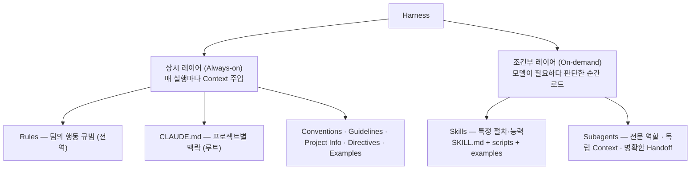
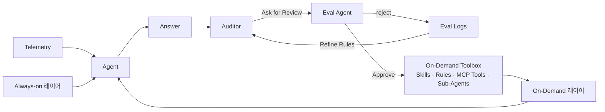
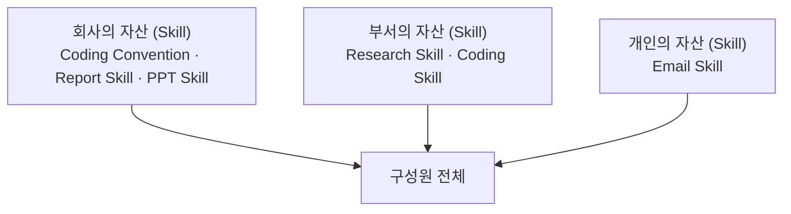

"하네스를 바꾸면 성능이 좋아진다"는 주장은 검증하기 어렵다. 대개 모델도 같이 바뀌기 때문이다. 그래서 모델을 고정한 채 하네스만 교체한 실험 하나가 이 논의에서 유독 무겁게 인용된다 — 벤치마크 52.8%에서 66.5%, 순위는 Top 30 밖에서 Top 5로.

이 글은 그 실증을 중심에 놓고 양옆을 채운다. 앞쪽에는 그 하네스가 컨텍스트를 어떻게 배치하는지 — 상시 레이어와 조건부 레이어로 나누는 사실상 표준 구조. 뒤쪽에는 그 구조가 스스로 갱신될 때 필요한 것 — 진화 루프와 거버넌스, 그리고 둘 중 하나만 빠져도 작동하지 않는다는 경고. [앞 편](/blog/ai-agent/agent-equals-model-plus-harness/)이 `Agent = Model + Harness`라는 등식을 세웠다면 이 글은 그 등식의 우변을 실제로 움직여 본 기록이다.

이 다음부터는 시선이 조직으로 넘어간다. [위임 격차 편](/blog/ai-agent/delegation-gap/)이 "쓰긴 쓰는데 맡기지는 못한다"는 간극을 다룬다.

> 이 글은 **2026년 4월 자료를 정리한 것**이다. 벤치마크 수치·서베이·도입 사례는 모두 원 자료가 인용한 외부 자료이며, 도입 사례는 **각 기업이 자사 사례로 발표한 값**이다.

## 용어 정리

앞 편의 용어표에서 이 글이 쓰는 행만 추리고, 레이어·진화 용어를 더했다.

| 용어 | 원어 / 표기 | 뜻 |
|---|---|---|
| Always-on / On-demand | — | 매 실행마다 주입되는 상시 레이어 vs 모델이 필요하다 판단한 순간 로드되는 조건부 레이어 |
| Progressive Disclosure | Progressive Disclosure | 초기에는 요약만 로드하고 필요할 때 전체를 로드하는 단계적 정보 공개 |
| Context Rot | Context Rot | 컨텍스트가 채워질수록 모델 추론 능력이 떨어지는 현상 |
| Lost in the middle | — | 관련 정보가 컨텍스트 중간에 있을수록 찾기 어려워지는 현상 |
| Self-Evolving Harness | — | 운영 Trace를 관찰해 Prompt·SKILL·Tool·Eval 중 하나를 자동 갱신하고, 리뷰·버전·롤백을 거쳐 재배포로 루프를 닫는 구조 |
| Trace | Trace | 상태·행동·관찰·검증 결과·결정을 단계별로 남긴 재현 가능한 실행 기록 |
| Eval | Evaluation | 정의된 기준으로 품질을 측정하는 활동. 오프라인 평가·온라인 Trace·회귀 테스트 |
| Terminal Bench 2.0 | — | 터미널 작업 수행 능력 벤치마크 |
| MRCR v2 | Multi-Round Coreference Resolution | 롱컨텍스트 검색 벤치마크(8-needle) |

## 상시와 조건부 — 사실상 표준 아키텍처

여러 코딩 에이전트가 수렴한 구조를 자료는 "하네스의 사실상 표준 아키텍처"로 부른다.

| 구분 | 상시 (Always-on) | 조건부 (On-demand) |
|---|---|---|
| 로드 시점 | 매 실행마다 컨텍스트에 주입 | 모델이 필요하다 판단한 순간 |
| 대표 구성물 | Rules, `CLAUDE.md` / `AGENTS.md`, `MEMORY.md` | Skills(`pdf/`·`excel/`·`code-review/`), Rules, Sub-Agents |
| 성격 | "매번 설명하기 귀찮은 모든 것"이 쌓인다 | 필요할 때만 컨텍스트를 점유한다 |
| 얻는 것 | 일관성 | 효율성과 확장성 |

**도식과 표는 같은 두 레이어를 다루지만 담고 있는 항목이 서로 다르다.** 도식에만 있는 것이 다섯이다 — `Conventions`·`Guidelines`·`Project Info`·`Directives`·`Examples`, 즉 상시 레이어에 실제로 무엇이 들어가는지의 내역이다. 표에만 있는 것도 셋이다 — `AGENTS.md`·`MEMORY.md`, 그리고 조건부 레이어의 구체적 스킬 디렉터리들. 도식은 계층 구조를, 표는 운용 성격을 말하고 있어 어느 한쪽만 두면 여덟 항목이 사라진다.

이 분할이 하네스 설계의 근간이고, 다음 개념으로 이어진다.

## 컨텍스트를 키운다고 성능이 따라오지 않는다

**Progressive Disclosure**는 제한된 자원을 효율적으로 쓰기 위한 단계적 로드다. 초기에는 요약만, 필요할 때 전체를 로드한다.

회피 대상은 **Context Rot** — 컨텍스트가 채워질수록 모델 추론 능력이 저하되는 현상이며, 관련 정보가 중간에 있을수록 찾기 어려워지는 `lost in the middle`을 포함한다.

| 롱컨텍스트 검색 — MRCR v2 (8-needle) | 평균 일치율 |
|---|---|
| Opus 4.6 — 256K | **93.0** |
| Opus 4.6 — 1M | 76.0 |
| 낙폭 | 약 **17.0%p** |

> **컨텍스트를 키운다고 성능이 따라오지 않는다는 것이 이 수치의 요지다.**
>
> 벤치마크 이름을 캡션에 못 박은 이유가 있다. 같은 주장이 여러 자료에 조금씩 다른 숫자로 돌아다니는데, 출처가 특정된 값만 검증이 가능하다. 위 값은 [앞 시리즈의 다섯 구성물 편](/blog/ai-agent/harness-five-primitives/)에 모델 네 종의 전체 표로 실려 있고, 거기서 보면 다른 모델에서는 순서가 뒤집히기도 한다 — **단일 벤치마크의 한 모델에서 관측된 값**이지 보편 법칙이 아니다. 설계 변수로 삼을 것은 절대 수치가 아니라 상시와 조건부의 **비중 조절**이다.

## 모델을 고정하고 하네스만 바꿨다

| 항목 | 값 |
|---|---|
| 벤치마크 | Terminal Bench 2.0 |
| 모델 | **고정** (동일 모델 유지) |
| 변경 요소 | **하네스만** (System Prompt + Tools + Middleware) |
| 결과 | 52.8% → 66.5% (**+13.7 pts**), Top 30 바깥 → **Top 5** |
| 출처 | 2026년 2월 공개된 프레임워크 벤더의 하네스 엔지니어링 블로그 |

개선 기법 일곱 가지는 그대로 루프 설계 체크리스트로 쓸 수 있다.

| 기법 | 내용 |
|---|---|
| **Trace 분석 스킬** | 최근 Trace를 분석해 하네스 피드백에 반영 |
| **자가 검증** | 정합성을 스스로 확인 |
| **로컬 컨텍스트 미들웨어** | 정확한 참조 디렉터리를 전달 |
| **테스트 가능한 코드 작성법 주입** | 테스트 코드 작성 방법을 컨텍스트로 제공 |
| **시간 예산** | 작업을 마무리하고 검증 단계로 넘어가도록 **시간 예산 경고**를 삽입 |
| **루프 감지 미들웨어** | 동일 파일에 N번 이상 수정이 일어나면 "접근 방식을 재고하라"는 컨텍스트를 추가 |
| **추론량 선택** | 추론을 최대로 올리면 타임아웃으로 **53.9%**, 한 단계 낮추면 **63.6%**로 더 높았음 |

> **마지막 항목이 이 표에서 가장 반직관적이다. 추론을 더 많이 시키는 것이 항상 이득이 아니다.**
>
> 예산이 없으면 더 깊은 추론이 오히려 미완성으로 끝난다. 같은 논리가 조직 자동화에도 적용되는데, 품질을 위해 검토 단계를 늘리면 어느 지점부터는 완료율이 떨어져 총 산출이 줄어든다. 자료가 덧붙인 시사점 하나도 같은 방향이다 — **모델을 후속 학습시킨 하네스가 반드시 그 모델에 최적은 아니다.** 짝지어 나온 조합이라고 최적일 것이라는 가정을 검증 없이 쓰지 말라는 뜻이다.

## 하네스를 이루는 세 층위

| 층위 | 역할 | 핵심 질문 | 구성물 |
|---|---|---|---|
| **Control Loop** | 실행 흐름 제어 | 언제 끝낼지, 실패 시 어떻게 돌아올지 | ReAct · Plan-Execute · Middleware |
| **Eval & Observability** | 측정 없이는 개선할 수 없다 | **Eval이 없으면 Harness가 아니다** | 오프라인 평가 · 온라인 Trace · 회귀 테스트 |
| **Safety Layer** | 신뢰 · 책임 · 통제 | 권한·샌드박스·사람 개입 | RBAC · 샌드박스 실행 · 감사 로그 |

세 번째 열에 유일하게 단정문이 들어간 행이 두 번째다 — **Eval이 없으면 Harness가 아니다.** 앞 편의 네 계층에서 검증이 가장 자주 빠진다고 했던 것과 같은 지적이고, 여기서는 그것을 자격 요건으로 격상시킨다.

## 스스로 갱신되는 루프

레퍼런스 루프는 다섯 단계이며, **앞 넷이 진화 루프이고 마지막 하나가 거버넌스**다.

| # | 단계 | 내용 |
|---|---|---|
| 1 | **Runtime** | 에이전트 실행 + 사전 완료 검사·각종 미들웨어 |
| 2 | **Observation** | Trace · 성공/실패 · 사용자 피드백 · 내부 메트릭 |
| 3 | **Eval Gate** | 평가셋 관리와 쌍방향 — 시그널 필터링 |
| 4 | **Dispatch** | Prompt · SKILL · Tool · Eval 중 **무엇을 변경할지** 분기 |
| 5 | **Review & Version** (거버넌스) | 리뷰·승인·버전·롤백 → 재배포로 루프가 닫힌다 |

> **Self-Evolving과 Governance는 둘 중 하나만 빠져도 제대로 작동하지 않는다.**
>
> 이유는 대칭적이다. 거버넌스 없이 진화 루프만 돌리면 아무도 모르는 사이에 동작이 바뀌어 있고, 진화 루프 없이 거버넌스만 두면 검토할 변경이 생기지 않아 절차만 남는다. 5단계가 **재배포로 루프를 닫는다**는 표현도 중요한데, 승인이 끝이 아니라 배포까지 가야 다음 사이클의 관찰 대상이 생긴다는 뜻이다. 승인은 났는데 반영은 다음 분기인 조직에서는 이 루프가 돌지 않는다.

만능이 아니라는 점이 그다음에 곧바로 나온다.

| ✓ 장점 (축적이 만드는 복리) | ✗ 한계 (완화책과 함께 봐야 한다) |
|---|---|
| **자동 개선** — 축적된 운영 데이터로 하네스가 자동 진화 | **과적합 위험** — 특정 실패 패턴에 맞추다 일반 성능 저하 |
| **회귀 방지** — 실패 케이스가 평가셋에 쌓여 같은 실수가 반복되지 않음 | **무한 루프** — 변경 빈도가 재배포 주기보다 빨라짐 |
| **지식 자산화** — 공통 SKILL 형태로 조직 지식 누적 | **신뢰도** — 자동 변경을 사람이 언제까지 검토할 것인가 |
| **스케일** — 수천 개 Trace 자동 분석 가능 | **비용·디버깅** — Trace·평가·병렬 실행 비용과 추적 난이도 |

**네 쌍이 하나씩 짝을 이룬다.** 자동 개선의 대가가 과적합이고, 회귀 방지의 대가가 변경 빈도이며, 지식 자산화의 대가가 검토 부담이고, 스케일의 대가가 비용이다. 장점만 취하는 조합은 없다는 것이 이 표의 배치가 말하는 바이며, 완화책으로 제시된 것은 홀드아웃·배치 처리·단계적 위임·샘플링·감사 로그 다섯이다. 설계된 루프를 **신중하게 운영하는 것**이지 켜두면 저절로 되는 것이 아니다.

## 스킬이 자산이 되는 방식

| 관점 | 내용 |
|---|---|
| **① 개인 — 능력의 확장** | 에이전트 하나로 모든 걸 하는 대신 능력이 필요할 때 선택적으로 로드한다. 문서 분석 스킬, 스프레드시트 편집 스킬, 내 코드리뷰 체크리스트, 훅·미들웨어를 통한 동적 제어. 핵심은 효율성 — 매번 컨텍스트에 욱여넣지 않고 필요할 때 주입 |
| **② 조직 — 공통 자산 + 개인화** | 사내 보고서 표준·컴플라이언스 같은 공통 SKILL, 전사 피드백으로 계속 고도화되는 자산, 역할별 작업 패턴을 담은 개인·팀 SKILL. 사용자 가치가 애플리케이션에서 에이전트로 이동 |

세 층위가 전부 같은 방향으로 흐른다는 것이 이 도식의 요점이다. 회사 자산이 아래로만 내려가는 것이 아니라 **개인 자산도 구성원 전체로 흘러간다.** 다음 두 절이 그 흐름을 어떻게 관리할 것인가를 다룬다.

### 개인 하네스가 먼저다

이 자료에서 반전이 가장 강한 대목은 팀을 위해 만들다가 방향을 바꾼 경험이다. 결론은 우선순위 세 줄로 정리된다.

| 우선순위 | 내용 |
|---|---|
| ① | 하네스는 **'나의 일을 줄여주는 것'**이 1번이다 |
| ② | 팀을 위해서가 아닌 **"내가 덜 일하는 방향"**으로 구축한다 |
| ③ | 겹치는 일은 Team Harness가 **지원**한다 — seed 위에 개인 fork |

전제가 되는 관찰 — '내가 일하는 방식'과 '팀이 일하는 방식'이 완벽히 일치하지 않으며 100% 공통 분모는 존재하지 않는다 — 은 [앞 시리즈의 마지막 편](/blog/ai-agent/self-evolving-seed-and-fork/)에 원문 그대로 실려 있다. 여기서는 그 관찰이 거버넌스 설계로 어떻게 이어지는지만 이어 간다.

### 그래서 거버넌스는 대칭이 아니다

안정성과 속도를 동시에 확보하려면 승인 절차를 양쪽에 똑같이 걸지 않는다.

| 구분 | Strict Governance (공통) | Loose Governance (개인) |
|---|---|---|
| 성격 | 4층위 × 4차원 승인 게이트 | 자율적 · 공유 가능 |
| Layer 1 · 조직 | 보안 책임자 + 엔지니어링 리드 · 주 배치 · 즉시 대응 + 원인 분석 | — |
| Layer 2 · 부서 | 부서장 + 리뷰어 2명 · 주 단위 | — |
| Layer 3 · 팀 | 팀 리드 리뷰 · 일 단위 | — |
| 개인 단위 | — | 자율 승인 · 실시간 배포 · 본인 롤백 |
| 검토 차원 | 기능 · 보안 · 비즈니스 룰 · 성능 (4차원) | 자동 diff + 영향 범위 주석 |
| 안전장치 | 감사 · 버전 · 롤백 | **15분 롤백** · 감사 추적 |
| 담는 것 | 보안 / 품질 일관성 / 비즈니스 로직 / 핵심 가치 | 실험적 기능 / 개인 작업 효율화 / 맞춤형 설계 |

> **전사 표준화를 서두르면 채택률이 죽고, 방치하면 품질이 죽는다. 비대칭이 답이다.**
>
> 오른쪽 열에서 유일하게 강제되는 것은 세 가지뿐이다 — 자동 diff, 영향 범위 주석, 15분 롤백. 승인자도 주기도 없다. 대신 되돌릴 수 있게만 만들어 두고, 되돌릴 수 없는 것(보안·비즈니스 로직·핵심 가치)만 왼쪽 열의 4층위 게이트로 보낸다. 판단 기준은 중요도가 아니라 **가역성**이며, 이 기준이 뒤에 [승인 게이트 설계](/blog/ai-agent/delegation-gap/)에서 다시 나온다.

## 2026년 엔터프라이즈의 실제 위치

| 지표 | 값 | 출처 표기 |
|---|---|---|
| 엔터프라이즈 에이전트 도입 | **40%+** | Gartner 예측 (2026년 말 기준) |
| 기업 파일럿 운영 | **78%** | 650개 기업 서베이 (2026년 3월) |
| 프로덕션 스케일 도달 | **14%** | 스케일링 갭 — **64pt 격차** |
| 실패 원인이 비기술 요인 | **89%** | 거버넌스·운영 등 |

도입 사례로 제시된 것들이다. 모두 각 기업이 자사 사례로 발표한 값이다.

| 기업 | 내용 |
|---|---|
| TELUS · 직원 57,000명 | 코딩 에이전트를 사내 AI 플랫폼의 코어로 |
| Novo Nordisk | 엔터프라이즈 도입 · 임상 문서 작성 **10주 → 수 분** |
| Coinbase · Deloitte · Zapier | 엔터프라이즈 코딩 에이전트 도입 |

> **이 절의 핵심은 78% → 14%라는 64포인트 격차와, 실패의 89%가 비기술 요인이라는 두 숫자다.**
>
> 두 숫자를 붙이면 진단이 나온다. 파일럿에서 프로덕션으로 넘어가지 못하는 이유가 모델 성능이 아니라 운영·거버넌스라는 것이다. 실무적 함의는 승인 기준에 있다 — PoC 성공을 성과로 보고하는 관행이 위험하고, PoC 승인 단계에서 **권한·승인·감사·롤백** 네 가지를 함께 설계하지 않으면 그 PoC는 64포인트 격차의 왼쪽에 남는다.

## 준비할 것 셋

| # | 항목 | 내용 |
|---|---|---|
| ① | **평가 체계 구축** | 골든 데이터셋과 회귀 자동화, **최소 100 케이스**, 생산 Trace와 평가셋 연결, 정량 평가 기준 마련 |
| ② | **SKILL 카탈로그와 거버넌스** | 공통 스킬 · 감사 · 반영 기준, 버전·롤백·감사 로그, **초기 3~4개월**, Owner 1명 + 팀 리뷰 |
| ③ | **운영팀 재정의** | **Harness Engineer · SKILL Curator · Trace Analyst**, 단계적 확대, 흡수 불가 자산(데이터·평가·도메인)에 투자 |

세 항목에 붙은 정량 기준이 각각 다르다 — 첫째는 규모(100 케이스), 둘째는 기간(3~4개월), 셋째는 사람이다. **셋 다 착수 전에 정할 수 있는 값**이라는 것이 이 표의 실용성이고, "충분히 준비되면 시작하겠다"는 무기한 연기를 막는 장치이기도 하다.

한 장 요약은 이렇다.

> 모델은 상품이 되고, **동작하는 방식이 경쟁 우위**가 된다. Harness Engineering은 모델이 동작하는 방식을 설계하는 일이고, 그 방식이 **진화 가능해야** 쓸수록 좋아지며, 엔터프라이즈의 경쟁 우위는 이 **진화 루프**에 있다.
>
> 그리고 액션 포인트는 둘로 좁혀진다 — **기술보다 조직**(역할 지정), 그리고 **흡수되지 않을 자산**(조직 데이터·평가셋·조직 구조·도메인 특화 SKILL). 두 번째가 특히 판단 기준으로 쓸모 있는데, 다음 세대 모델이나 다음 버전 제품이 흡수해 버릴 것에는 장기 투자하지 않는다는 뜻이다. 프롬프트 최적화는 흡수되고, 우리 도메인의 평가셋은 흡수되지 않는다.

## 조직에 옮기면 무엇이 되는가

| 주장 | 조직에 미치는 함의 | 첫 90일에 할 일 |
|---|---|---|
| 모델은 상향 평준화, 차이는 하네스에서 난다 | "더 좋은 모델로 바꾸자"는 예산 논의를 **"운영 구조를 바꾸자"**로 전환. 벤더 종속도가 낮아짐 | 사내 AI 도구의 시스템 프롬프트·도구·규칙을 인벤토리화. 모델 교체 없이 바꿀 수 있는 표면부터 목록화 |
| 95% × 10단계 ≈ 60% (오차 누적) | 긴 워크플로를 통째로 맡기는 기획은 실패한다. **단계를 쪼개고 각 단계에 검증을 붙이는 설계**가 필요 | 자동화 요구가 큰 워크플로 1개를 단계별로 분해하고, 단계마다 기계적 검증 가능 여부를 표시 |
| Eval이 없으면 Harness가 아니다 | 평가셋 없는 AI 과제는 성과 보고도 불가능. **평가 자산이 곧 조직 자산** | 골든 데이터셋 최소 100 케이스 착수. 생산 Trace를 평가셋으로 흘려보내는 파이프라인 1개 연결 |
| 78% 파일럿 vs 14% 프로덕션, 실패 89%가 비기술 요인 | 기술 검증이 아니라 **거버넌스·운영 설계**가 병목. PoC 성공을 성과로 보고하는 관행이 위험 | PoC 승인 기준에 "프로덕션 게이트 4종(권한·승인·감사·롤백)" 추가. PoC 단계에서 같이 설계 |
| 자기진화와 거버넌스는 하나만 빠지면 작동 안 함 | 자동 개선을 켜는 순간 **누가 언제 검토하는가**가 정책 문제가 됨 | 변경 유형별 승인 경로 표를 만든다. 자동 반영 / 배치 리뷰 / 즉시 리뷰 3단계로 분류 |
| 공통은 Strict, 개인은 Loose | 전사 표준화를 서두르면 채택률이 죽고 방치하면 품질이 죽는다 | 개인 스킬은 자율 배포 + 15분 롤백 + 자동 diff 로그만 강제. 공통 승격 심사는 별도 게이트로 분리 |
| "개인 하네스가 1번" — 팀 표준부터 만들면 실패 | 하향식 접근이 실패하는 이유. **개인 효율에서 출발해 공통 분모를 추출**하는 상향식 | 팀 표준 제작 대신 각자가 자기 스킬을 만들게 하고, 3개월 뒤 **중복 3회 이상 등장한 것만** 공통으로 승격 |
| 역할 재정의: Harness Engineer · SKILL Curator · Trace Analyst | 기존 직무 기술서에 없는 역할. **신규 영입이 아니라 기존 인력의 역할 재배치**로 시작 가능 | 기존 인력 중 3개 역할을 겸직으로 지정(각 1명). Owner 없는 스킬 카탈로그는 만들지 않는다 |

여덟 행 중 다섯이 **"먼저 만들지 말고 먼저 재라"**는 형태다(2·3·4·5·7). 세 번째 열에 신규 구축이 들어간 행은 하나도 없고, 전부 인벤토리·분해·분류·연결이다. 하네스 도입이 실패하는 지점이 구축이 아니라 그 앞이라는 진단이 표 전체에 깔려 있다.

---

여기까지가 하네스 쪽이다. 상시와 조건부로 컨텍스트를 나누고, 하네스만 바꿔도 성능이 오르고, 그 하네스가 스스로 갱신되며, 갱신에는 비대칭 거버넌스가 붙는다.

그런데 이 모든 것은 사람이 앉아서 호출하는 것을 전제한다. 하네스가 아무리 좋아도 매번 프롬프트를 쳐야 한다면 처리량은 여전히 사람의 시간에 묶인다. 그리고 실제 데이터는 더 냉정하다 — 개발자는 업무의 60%에 AI를 쓰지만 **완전히 위임 가능한 일은 0~20%**에 불과하다. [다음 편](/blog/ai-agent/delegation-gap/)에서 그 간극의 정체와, 사람 없이 도는 시스템이 성립하려면 무엇이 먼저 있어야 하는지를 본다.
