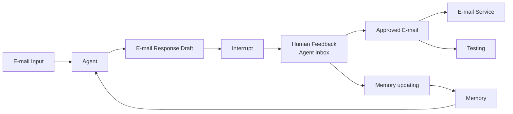
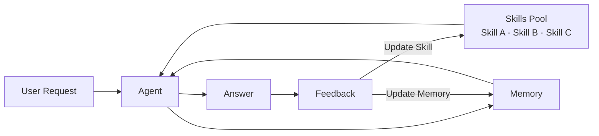
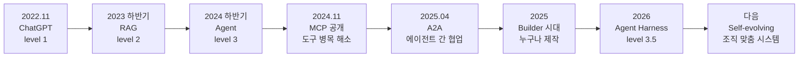
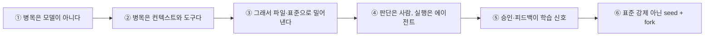

사내 표준 도구를 정하고 배포하면 대개 쓰이지 않는다. 이 사실은 널리 관찰되는데도 원인 진단은 늘 같은 자리에 머문다 — 교육이 부족했다, 홍보가 약했다, 도구가 아직 덜 익었다. 그런데 이 시리즈가 다룬 자료의 마지막 장은 다른 답을 내놓는다. **개인이 일하는 방식과 팀이 일하는 방식이 애초에 일치하지 않는다.**

이 글은 두 가지를 붙인다. 하나는 하네스가 스스로 나아지는 구조 — 사람의 승인과 반려가 학습 신호가 되고, 그 신호가 스킬과 메모리를 갱신하는 루프. 다른 하나는 그 구조를 조직에 퍼뜨릴 때의 형태 — 표준이 아니라 **seed와 fork**. [앞 편](/blog/ai-agent/harness-five-primitives/)이 다섯 부품을 열었다면 이 글은 그 부품이 시간에 따라 변하고 사람 사이로 퍼지는 방식을 본다.

마지막으로 세 달치 자료를 스무 개 명제로 종합하고, 90일 로드맵으로 닫는다. 시리즈 전체의 출발점은 [첫 편](/blog/ai-agent/agent-harness-architecture/)에 있다.

> 이 글은 **2026년 1월부터 3월까지의 자료를 정리한 것**이다. 등장하는 사례·수치는 모두 원 자료의 것이다.

## 용어 정리

앞 편들의 용어표에서 이 글이 쓰는 행만 추리고, 진화 구조 용어를 더했다.

| 용어 | 원어 / 표기 | 뜻 |
|---|---|---|
| Ambient Agent | Ambient Agent | 사람의 호출 없이 배경에서 상시 동작하며 인터럽트로만 개입하는 에이전트 |
| Self-evolving 시스템 | — | 피드백으로 스킬·메모리를 스스로 갱신하는 구조 |
| seed · fork | — | 팀이 공통 기반을 제공하고 개인이 복제해 자기 것으로 키우는 확산 방식 |
| SKILL | — | `SKILL.md`로 패키징된 전문성. 정의는 [다섯 구성물 편](/blog/ai-agent/harness-five-primitives/) |
| Agent Harness | Agent Harness | 모델을 감싸 장기 실행 작업을 관리하는 시스템. 정의는 [첫 편](/blog/ai-agent/agent-harness-architecture/) |
| MRCR v2 | Multi-Round Coreference Resolution | 롱컨텍스트 검색 벤치마크(8-needle) |
| Centaur 모델 | Centaur Model | 인간 × AI의 승수 효과 모델. [조직 적용 편](/blog/ai-agent/enterprise-ai-adoption-actions/) 참조 |

## 고정된 워크플로우의 한계

먼저 무엇이 문제인지부터다. 기존 구조의 한계로 지목된 것은 둘이다 — **고정된 워크플로우 구조**, 그리고 **피드백 루프로 인한 수정 반영이 제한적**이라는 것. 두 번째가 첫 번째의 결과다. 흐름이 코드에 박혀 있으면 운영에서 배운 것이 돌아올 자리가 없다.

돌아올 자리를 만든 첫 형태가 배경 상시 동작 에이전트다.

도식의 화살표에는 두 개의 라벨이 붙어 있었다 — `Learn preferences over time`, `Run agent tests`. 사람의 승인 행위가 두 방향으로 갈라진다는 뜻이다.

> **승인은 결과물을 내보내는 동작이면서 동시에 학습 신호이고 테스트 케이스다.**
>
> 사람이 "이 초안 괜찮다"고 누르는 순간 세 가지가 동시에 일어난다. 메일이 나가고, 선호가 메모리에 쌓이고, 그 사례가 회귀 테스트 자산이 된다. 조직 관점에서 이것이 갖는 함의는 **승인·반려 로그를 수집 대상으로 설계해야 한다**는 것이다. 대부분의 승인 워크플로는 결재 기록만 남기고 판단 근거를 버리는데, 버려지는 그 부분이 여기서는 자산이다.

같은 원리를 스킬로 확장하면 이렇게 된다.

**두 도식의 차이는 피드백이 무엇을 고치느냐에 있다.** 앞 도식에서 피드백은 메모리만 갱신했다. 이 도식에서는 `Update Skill`과 `Update Memory` 두 갈래로 갈린다 — 절차 자체가 바뀌는 경로가 하나 더 생긴 것이다. 메모리는 "무엇을 기억할 것인가"이고 스킬은 "어떻게 할 것인가"라, 후자가 갱신되면 다음 실행의 동작 방식이 달라진다.

> **Self-evolving 하는 좋은 기틀이 마련됐고, 조직 차원의 맞춤형 시스템과 개인화된 시스템에 그대로 적용할 수 있다.**
>
> 다만 자료가 함께 제시한 그래프를 봐야 한다. 가로축이 수정 횟수, 세로축이 성능인데 곡선이 톱니 모양으로 오르내리면서 **전체적으로만** 우상향한다. 개별 수정은 성능을 떨어뜨리기도 한다는 뜻이다. 자동 개선 루프를 켤 때 단일 변경의 효과로 판정하면 안 되고 누적 추세로 봐야 하며, 그러려면 판정 주기와 롤백 경로가 먼저 있어야 한다.

## 팀을 위해 만들었는데 틀렸다

발표의 마지막 장은 발표자가 그날 팀에 보낸 메시지 전문이었다. 이 시리즈에서 조직 관점으로 가장 값진 대목이다.

> 시간 날 때마다 하네스를 본격적으로 만들어 본 게 1주일이 조금 넘은 것 같습니다. 그동안 여러 배포판의 플러그인을 활용하는 데만 집중하다가 "이제는 만들어 봐야겠다"고 결심해서 만든 지 일주일입니다.
>
> 처음에는 **팀원을 위해서 유용한 플러그인을 만들어야겠다**는 생각이었습니다. 하지만 점점 만들면 만들수록 **제 생각이 틀렸다**는 것을 깨달았습니다. 하네스는 결국 **"나의 일을 줄여주는 역할"이 1번**이라는 것을요.
>
> **"내가 일하는 방식"과 "팀이 일하는 방식"은 일치하지 않습니다.** 그렇기 때문에 Team Harness는 이상적인 목표이나 현실과는 괴리가 발생합니다. 그래서 여러분들은 **개인의 하네스를 구축해야 합니다.** 팀을 위해서가 아닌 **개인이 일을 덜 하는 방향**으로요.
>
> 물론 우리는 겹치는 일이 많기 때문에 Team Harness가 이를 매우 많이 지원해 나갈 수 있습니다. 그럼에도 우리의 일은 100% 공통 분모로 엮일 수 없기에, 결국 개인만의 하네스가 필요합니다.
>
> 하지만 우리는 모두가 여유로운 상황이 아니기 때문에 **팀 차원의 하네스를 동료 한 분이 먼저 만들어 주셨습니다.** 이 seed를 시작으로 여러 fork를 통해 나만의 것으로 만들어 나가시길 바랍니다. 저도 힘을 보태기 위해 **제게 맞춘 하네스**를 공유드립니다. 아직 버그도 있고 수정해 나갈 부분이 있지만, 건물을 세우기 위한 토지 작업 정도는 해 놓은 수준입니다. 코드는 자유롭게 복사해도 좋고, fork 해도 좋고, 직접 기여하셔도 좋습니다.

> **이 메시지가 뒤집은 통념은 "좋은 도구를 만들어 배포하면 팀이 쓴다"는 것이다.**
>
> 실패 원인은 도구의 완성도가 아니라 전제에 있다. 개인의 작업 방식이 팀 평균과 일치하지 않기 때문에, 팀 평균에 맞춘 도구는 누구에게도 딱 맞지 않는다. 올바른 형태는 팀이 seed를 제공하고 개인이 fork해 진화시키는 구조다 — **표준화가 아니라 분기 가능한 공통 기반**이 답이다. 이 결론이 실무적으로 값을 하는 이유는 팀 리드가 할 일을 바꾸기 때문이다. "무엇을 표준으로 정할 것인가"가 아니라 "어디까지가 공통 분모인가"를 묻게 되고, 후자는 만들기 전이 아니라 몇 달 써 본 뒤에야 답할 수 있다.

이 구조는 [다음 시리즈](/blog/ai-agent/self-evolving-harness-governance/)에서 거버넌스 문제로 다시 나온다. 공통 자산과 개인 자산에 같은 승인 절차를 걸면 둘 중 하나가 죽는다는 논지이며, 여기서 나온 seed·fork가 그 논지의 전제다.

## 세 달을 관통하는 흐름

### 한 장의 연표

[둘째 편](/blog/ai-agent/why-agents-now/)의 연표와 같은 축이지만 마지막 마디가 하나 더 붙었다. **Self-evolving이 level 4가 아니라 "다음"으로 표기된 것**이 이 도식의 절제다. 자기진화가 자율성 등급을 올리는 것이 아니라 같은 등급 안에서 시스템이 나아지는 것이라는 뜻이다.

### 세 자료의 역할 분담

| 시점 | 질문 | 답 | 청중 |
|---|---|---|---|
| **2026.01** | 하네스란 무엇이고 어떻게 동작하나 | 컨텍스트를 파일로 밀어내는 구조. RAG의 정의도 바뀐다 | 엔지니어 |
| **2026.02** | 왜 지금이고, 조직은 무엇을 해야 하나 | 침투 속도·생산성 정체·도입 사례. 역할 재정의와 실행 프레임워크 | 경영진·조직 |
| **2026.03** | 그래서 실제로 어떻게 만드나 | 다섯 구성물 + 200만 줄의 교훈 | 실무 리더 |

세 행이 이 시리즈의 다섯 편에 그대로 대응한다 — 1월이 [첫 편](/blog/ai-agent/agent-harness-architecture/), 2월이 [둘째](/blog/ai-agent/why-agents-now/)·[셋째 편](/blog/ai-agent/enterprise-ai-adoption-actions/), 3월이 [넷째 편](/blog/ai-agent/harness-five-primitives/)과 이 글이다. **청중 열이 다르다는 것이 분할의 근거**이기도 하다. 엔지니어용 자료와 경영진용 자료를 한 글에 섞으면 양쪽 다 읽지 않는다.

### 여섯 명제

여섯이 하나의 사슬이다. 각 마디가 앞 마디의 결과이며, 마지막 두 마디가 이 글의 주제다.

### 스무 개 명제와 그 한계

**네 번째 열이 이 표의 존재 이유다.** 앞 세 열만 있으면 주장 목록이지만 반대 논거가 붙으면 인용 가능한 형태가 된다.

| # | 명제 | 근거 (출처 시점) | 조직 운영으로의 번역 | 반대 논거 · 한계 |
|---|---|---|---|---|
| 1 | 채택 속도가 플랫폼 시프트마다 2배씩 빨라졌다 | PC 20년 → 생성형 AI 3년 (2월) | 관망 옵션을 의사결정지에서 제거 | 인용 자료가 2023년 기준. 3년 수치엔 "?" 병기 |
| 2 | 15년간 정체된 1인당 생산성을 깰 후보 | 매출 $1M당 직원수 5.1 고착 (2월) | AI 투자 ROI 서사를 재무 언어로 확보 | "AI 적용 시 <3?"은 예측이지 실측 아님 |
| 3 | 에이전트의 진짜 병목은 도구 개발이었다 | 도구 연동의 "개발 필요" 반복 (2월) | 예산·인력을 연동·플랫폼 계층에 배치 | 표준화가 곧 벤더 종속 리스크로 전이 가능 |
| 4 | 2026년의 핵심 역량은 컨텍스트 관리 | 하네스 정의 (1·3월) | 세션 비용·컨텍스트 예산을 관리 지표화 | 모델 세대가 바뀌면 최적 상한도 바뀜 |
| 5 | 컨텍스트 창이 크다고 채우면 손해다 | MRCR v2 8-needle, 256K 93.0 vs 1M 76.0 (3월) | "다 넣기" 금지를 규약화 | 단일 벤치마크. 모델·작업 유형별 편차 존재 |
| 6 | 계획 파일이 지시문이자 설계서다 | 계획 파일 실물 (1월) | 문서 이중관리 폐지, PR에 계획 첨부 | 계획 품질이 낮으면 오히려 오도 |
| 7 | 계획 리뷰가 새로운 품질 게이트 | 계획 없이 구현 금지 / 커버리지 85% (3월) | 코드리뷰 앞단에 계획 리뷰 도입 | 리뷰 부하가 앞단으로 이동할 뿐일 수 있음 |
| 8 | SKILL은 확장, SubAgent는 분리 | 1·3월 공통 | 자산화 판단 기준으로 사용 | 경계가 모호한 중간 사례 다수 |
| 9 | 에이전트를 너무 잘게 나누면 손해 | 과다 분할 경고 (3월) | 조직 분할 원칙과 동일하게 관리 | 적정 개수의 정량 기준은 제시되지 않음 |
| 10 | 커맨드가 프로세스를 실행 가능한 자산으로 만든다 | 커맨드 여섯 가지 이유 (3월) | 표준작업절차를 저장소에 커밋 | 프롬프트도 유지보수 부채가 됨 |
| 11 | 훅이 가드레일을 강제한다 | 사전 훅 흐름 (3월) | 보안·컴플라이언스를 시스템화 | 훅 오탐이 생산성을 해칠 수 있음 |
| 12 | 지식 자산은 인덱스 + 분리 본문 | `MEMORY.md` 200줄 / 디렉터리 파일 (1·3월) | 위키 구조 재편 원칙 | 인덱스 관리 자체가 새 업무 |
| 13 | 소규모 지식은 벡터화 없이도 된다 | 동적 지식 검색 (1월) | 착수 비용 0의 파일럿 경로 확보 | 엔터프라이즈 규모에선 여전히 사전 구축 필요 |
| 14 | 문서를 통합하지 않고 검색 레이어를 얹는다 | 사내 검색 에이전트로 티켓 96%↓ (2월) | 수년짜리 정보구조 과제를 우회 | 정확도 74% — 오답 감수 범위 설정 필요 |
| 15 | 별도 AI 포털이 아니라 기존 도구 안으로 | 공통 성공 요인 (2월) | 채택률을 진입점 위치로 확보 | 기존 도구의 확장성 제약 |
| 16 | 자리는 유지, 일이 재구성된다 | 같은 자리 다른 일 / 센토어 (2월) | 감축이 아닌 승수 서사로 소통 | 실제 인력 재배치 갈등은 여전히 발생 |
| 17 | 상단은 유연, 하단은 결정론적 | 역할 3층의 세로축 (2월) | 레이어별 품질 기준 분리 | 중간 계층의 정의가 가장 모호 |
| 18 | 사람의 승인 기록이 학습 신호 | 배경 상시 에이전트 (3월) | 승인·반려 로그를 데이터 자산화 | 개인정보·감사 이슈 검토 필요 |
| 19 | 장애 원인 분석은 여전히 사람의 일 | 원인 분석 벤치마크 34.9% (3월) | 과대약속 방지, 적용 범위 명시 | 모델 세대마다 빠르게 변동 |
| 20 | **하향식 표준 강제는 실패한다 — seed + fork** | 팀 공유 메시지 전문 (3월) | 사내 도구 전략의 근본 원칙 | 완전 분산 시 재현성·감사 어려움 |

스무 행 중 **한계 열에 "단일 사례" 또는 "예측이지 실측 아님"이 붙은 것이 다섯**이다(1·2·5·13·14). 이 다섯은 조건을 떼어 내면 주장이 과장된 형태로 남는다. 나머지 열다섯은 구조에 대한 진술이라 수치 조건이 없는 대신, 조직 조건에 따라 성립 여부가 갈린다.

## 90일 로드맵

| 구간 | 목표 | 실행 항목 | 검증 지표 |
|---|---|---|---|
| **0~30일** | 기준선과 규칙 | 반복 업무 시간 실측(월 10시간 기준) / 컨텍스트 예산 가이드 / 계획 승인 후 착수 규칙 / 지식베이스 인덱스+본문 재편 / AI 과제 승인 게이트 4항목 | 측정된 기준선의 존재 여부 |
| **31~60일** | 파일럿과 자산화 | Quick Win 1건 PoC(2주) → Optimize(4주) / 반복 워크플로우 3건 커맨드화 / 위험 명령 차단 훅 배포 / 규칙 파일의 조건부 분해 | 파일럿 1건 완주, 커맨드 3건 커밋 |
| **61~90일** | 확산과 증명 | 사내 에이전트 갤러리 + 공유 인센티브 / 토큰 절감 리포트 / 팀 하네스 seed 공개 + fork 장려 / 성공 사례 전파 | 가시적 성과 도출, 절감액 보고 |

> **첫 구간의 검증 지표가 "기준선의 존재 여부"라는 점이 이 표의 설계다.**
>
> 0~30일에는 개선을 요구하지 않는다. 측정만 있으면 통과다. 대부분의 AI 도입이 실패하는 이유가 여기 있는데, 착수 전 값을 재지 않으면 나중에 무엇이 좋아졌는지 말할 수 없고, 말할 수 없으면 다음 예산이 나오지 않는다. **90일 계획에서 가장 중요한 결정은 60일과 90일에 무엇을 할지가 아니라 30일에 아무것도 만들지 않겠다는 결정이다.**

세 번째 구간의 마지막 항목 — 팀 하네스를 **seed로 공개하고 fork를 장려**한다 — 이 이 글의 결론이 로드맵에 박힌 자리다. 표준으로 배포하면 90일 차에 채택률을 보고해야 하지만, seed로 공개하면 fork 수를 보고하면 된다. 지표가 달라지면 행동이 달라진다.

---

여기까지가 2026년 상반기다. 컨텍스트를 파일로 밀어내는 구조가 자리를 잡았고, 조직은 역할을 세 층으로 다시 나눴고, 하네스는 피드백으로 스스로 갱신되기 시작했으며, 확산의 형태는 표준이 아니라 seed와 fork로 정리됐다.

그런데 이 서사에는 아직 검증되지 않은 전제가 하나 있다. **하네스를 잘 만들면 성능이 좋아진다**는 전제다. 정말 그런가 — 모델을 고정한 채 하네스만 바꿔서 얼마나 달라지는지, 그리고 진화 루프를 켰을 때 누가 언제 검토할 것인지. [다음 시리즈](/blog/ai-agent/agent-equals-model-plus-harness/)에서 `Agent = Model + Harness`라는 등식과 그것을 뒷받침하는 벤치마크 실증, 그리고 자율성과 거버넌스가 왜 한 쌍인지를 본다.

에이전트가 개발조직 구조를 어떻게 바꾸는지, 팀 생산성을 무엇부터 재야 하는지는 [운영 Q&A](/blog/ai-agent/ai-agent-qna-operations/)에 결론부터 정리돼 있다.
