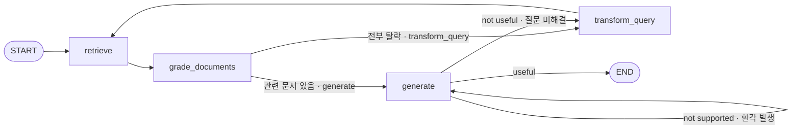
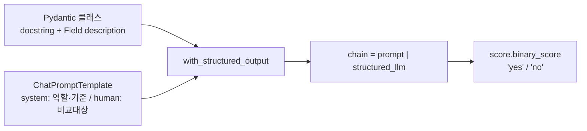

환각이 잡혔을 때 무엇을 다시 해야 하는가. 반사적으로는 "다시 검색한다"가 떠오르지만, Self-RAG의 답은 다르다. **문서는 멀쩡하니 답변만 다시 쓴다.** 반대로 답변이 질문에 답하지 못하면 그때는 검색어가 잘못됐다고 보고 재검색으로 간다.

같은 "판정이 나빴다"인데 되돌아가는 지점이 다르다는 것 — 이것이 판정을 하나가 아니라 여럿 두는 이유다. 무엇이 잘못됐는지를 구분할 수 있어야 어디로 되돌아갈지도 정해진다.

이 글은 Grader 세 개를 붙인 Self-RAG를 코드로 따라가고, 그 셋이 공유하는 **구조화 출력 패턴**을 일반화한다. [앞 편](/blog/ai-agent/agentic-rag-as-tool/)에서 판정이 하나뿐인 Agentic RAG까지 왔다.

## 용어 정리

앞 편의 용어표에서 이 글이 쓰는 행만 추렸다.

| 약어 / 용어 | 원어 | 뜻 |
|---|---|---|
| Self-RAG | Self-Reflective RAG | 생성 결과를 스스로 채점해 재생성·재검색하는 RAG |
| Grader | — | yes/no 등 정형 라벨을 뱉는 LLM 판정기 |
| Groundedness | 근거성 | 답변이 주어진 문서에 근거하는가. 사실성과 다름 |
| `with_structured_output` | — | LLM 출력을 Pydantic 스키마로 강제 파싱시키는 LangChain API |
| Pydantic | — | 파이썬 데이터 검증 라이브러리. 스키마 클래스를 정의한다 |
| Conditional Edge | 조건부 엣지 | 함수 반환값에 따라 다음 노드가 갈리는 엣지 |
| Reflection Token | — | Self-RAG 원논문에서 모델이 직접 생성하도록 학습시킨 자기평가 특수 토큰 |
| F1 / F3 / F4 | — | 검색 실패 / 근거 없는 확장(환각) / 동문서답. 분류는 [앞 편](/blog/ai-agent/agentic-rag-as-tool/) 참조 |

## 생성 이후에 검증 단계를 둔다

관련성만 봐서는 F3(환각)과 F4(동문서답)를 막지 못한다. 검색된 문서가 관련 있다고 판정된 다음에 벌어지는 일이기 때문이다. 그래서 **생성 이후**에 검증을 둔다.

- **환각 검토(Hallucination Grader)**: 답변이 문서에 근거하는가?
- **답변 적합성 검토(Answer Grader)**: 근거는 맞는데, 질문에 답하고 있는가?



`generate → generate` 자기 루프가 이 그래프의 성격을 규정한다. 환각이 잡히면 **같은 문서로 답변만 다시 쓴다.** 검색을 다시 하지 않는다.

> 앞 편의 Agentic RAG와 비교하면 되돌아가는 지점이 둘로 늘었다. 하나는 **검색 앞**(`transform_query → retrieve`), 하나는 **생성 앞**(`generate → generate`)이다.
>
> 이 분리가 비용 관점에서 결정적이다. 환각을 잡을 때마다 재검색까지 돌면 문서 채점 N회가 매번 따라붙는다. **틀린 층에서만 다시 하는 것**이 검증 루프 설계의 기본 원칙이고, 그러려면 판정을 층별로 나눠야 한다.

### State — 구조화 전환

```python
from typing import List
from typing_extensions import TypedDict


class GraphState(TypedDict):
    """그래프의 상태.

    question:   사용자 질문 (재작성되면 덮어써짐)
    generation: LLM이 생성한 답변
    documents:  검색된 문서 리스트
    """
    question: str
    generation: str
    documents: List[str]
```

앞 편의 `AgentState`와 두 가지가 다르다. **리듀서가 없고, 문서를 리스트로 들고 있다.**

| 축 | Agentic RAG (`AgentState`) | Self-RAG (`GraphState`) |
|---|---|---|
| 채널 구성 | `messages` 하나 | `question`·`generation`·`documents` 셋 |
| 병합 규칙 | `add_messages`로 누적 | 없음 — 키 단위 덮어쓰기 |
| 문서 형태 | `ToolMessage.content` 문자열 한 덩어리 | `List[Document]` |
| 가능해지는 것 | 대화 이력 유지 | **개별 채점 후 필터링** |
| 잃는 것 | 문서 단위 조작 | 대화 맥락 |

리듀서가 없다는 것이 여기서는 **결함이 아니라 요구사항**이다. `transform_query`가 `question`을 고쳐 쓰는 동작이 덮어쓰기에 의존하기 때문이다. 누적 리듀서가 붙어 있으면 재작성된 질문이 원 질문 뒤에 붙어 버린다.

> [앞 시리즈에서](/blog/ai-agent/langgraph-state-reducer/) "리듀서를 안 붙이면 대화 이력이 날아간다"고 했던 것과 정면으로 보이지만 모순이 아니다. **채널마다 필요한 병합 정책이 다르다**는 말의 실물이 이것이다.
>
> `messages`는 누적이어야 하고 `question`은 덮어쓰기여야 한다. 상태 설계가 "필드 목록"이 아니라 "필드별 병합 정책"인 이유가 여기서 두 번째로 드러난다.

## 세 개의 Grader

```python
from langchain_core.prompts import ChatPromptTemplate
from langchain_core.pydantic_v1 import BaseModel, Field
from langchain_openai import ChatOpenAI

llm = ChatOpenAI(model="gpt-4o-mini", temperature=0)


# (1) 문서 관련성
class GradeDocuments(BaseModel):
    """Binary score for relevance check on retrieved documents."""
    binary_score: str = Field(description="Documents are relevant to the question, 'yes' or 'no'")

system = """You are a grader assessing relevance of a retrieved document to a user question. \n
    It does not need to be a stringent test. The goal is to filter out erroneous retrievals. \n
    If the document contains keyword(s) or semantic meaning related to the user question, grade it as relevant. \n
    Give a binary score 'yes' or 'no' score to indicate whether the document is relevant to the question."""
grade_prompt = ChatPromptTemplate.from_messages([
    ("system", system),
    ("human", "Retrieved document: \n\n {document} \n\n User question: {question}"),
])
retrieval_grader = grade_prompt | llm.with_structured_output(GradeDocuments)


# (2) 환각 검토
class GradeHallucinations(BaseModel):
    """Binary score for hallucination present in generation answer."""
    binary_score: str = Field(description="Answer is grounded in the facts, 'yes' or 'no'")

system = """You are a grader assessing whether an LLM generation is grounded in / supported by a set of retrieved facts. \n
     Give a binary score 'yes' or 'no'. 'Yes' means that the answer is grounded in / supported by the set of facts."""
hallucination_prompt = ChatPromptTemplate.from_messages([
    ("system", system),
    ("human", "Set of facts: \n\n {documents} \n\n LLM generation: {generation}"),
])
hallucination_grader = hallucination_prompt | llm.with_structured_output(GradeHallucinations)


# (3) 답변 적합성
class GradeAnswer(BaseModel):
    """Binary score to assess answer addresses question."""
    binary_score: str = Field(description="Answer addresses the question, 'yes' or 'no'")

system = """You are a grader assessing whether an answer addresses / resolves a question \n
     Give a binary score 'yes' or 'no'. Yes' means that the answer resolves the question."""
answer_prompt = ChatPromptTemplate.from_messages([
    ("system", system),
    ("human", "User question: \n\n {question} \n\n LLM generation: {generation}"),
])
answer_grader = answer_prompt | llm.with_structured_output(GradeAnswer)
```

세 Grader의 프롬프트 구조가 **완전히 동일한 틀**이다. `system`에 역할과 판정 기준을, `human`에 비교할 두 대상을 넣는다. 무엇과 무엇을 비교하느냐만 다르다.

| Grader | 비교 대상 A | 비교 대상 B | 묻는 것 | 잡는 실패 |
|---|---|---|---|---|
| `GradeDocuments` | 검색 문서 1개 | 질문 | 이 문서를 근거로 써도 되는가 | F1 |
| `GradeHallucinations` | 문서 집합 | 생성 답변 | 답변이 문서 밖으로 나갔는가 | F3 |
| `GradeAnswer` | 질문 | 생성 답변 | 답변이 질문을 해결했는가 | F4 |

세 행을 관통하는 것은 **판정 대상이 언제나 두 개의 쌍**이라는 점이다. "이 답변이 좋은가"처럼 단일 대상을 평가하는 Grader는 하나도 없다. 무엇에 비추어 판정하는지를 명시해야 판정이 재현 가능해지기 때문이다.

### 문서 필터링 노드 — 개별 채점

```python
def grade_documents(state):
    """검색 문서를 개별 채점해 관련 있는 것만 남긴다."""
    print("---CHECK DOCUMENT RELEVANCE TO QUESTION---")
    question = state["question"]
    documents = state["documents"]

    filtered_docs = []
    for d in documents:                       # 문서 수만큼 LLM 호출
        score = retrieval_grader.invoke(
            {"question": question, "document": d.page_content}
        )
        if score.binary_score == "yes":
            print("---GRADE: DOCUMENT RELEVANT---")
            filtered_docs.append(d)
        else:
            print("---GRADE: DOCUMENT NOT RELEVANT---")
            continue
    return {"documents": filtered_docs, "question": question}
```

앞 편에서 뭉쳐서 한 번 채점하던 것이 여기서는 **문서마다 한 번씩** 돈다. 그 대가로 무관 문서를 실제로 걸러낼 수 있게 됐다.

> 이 루프가 Self-RAG 비용의 대부분을 차지한다. 문서 N개면 **순차 LLM 호출 N회**이고, 병렬화도 배치화도 없다.
>
> 실습 코드의 단순함이 오히려 지점을 선명하게 만든다. 관련성 판정의 해상도를 올리는 대가가 정확히 어디에서 나가는지가 이 `for` 문 하나에 보인다. 개선 방향도 같은 자리에 있다 — 팬아웃으로 병렬화하거나, 여러 문서를 한 프롬프트에 담아 배치 채점하는 것이다.

### 두 개의 조건 분기 함수

```python
def decide_to_generate(state):
    """관련 문서가 하나도 안 남았으면 질문을 재작성한다."""
    print("---ASSESS GRADED DOCUMENTS---")
    filtered_documents = state["documents"]

    if not filtered_documents:            # 전부 탈락한 경우에만 재작성
        print("---DECISION: ALL DOCUMENTS ARE NOT RELEVANT TO QUESTION, TRANSFORM QUERY---")
        return "transform_query"
    print("---DECISION: GENERATE---")
    return "generate"


def grade_generation_v_documents_and_question(state):
    """환각 → 적합성 순으로 2단 검증한다."""
    print("---CHECK HALLUCINATIONS---")
    question = state["question"]
    documents = state["documents"]
    generation = state["generation"]

    score = hallucination_grader.invoke(
        {"documents": documents, "generation": generation}
    )

    if score.binary_score == "yes":
        print("---DECISION: GENERATION IS GROUNDED IN DOCUMENTS---")
        # 환각이 없을 때만 적합성 검사로 진입한다
        score = answer_grader.invoke({"question": question, "generation": generation})
        if score.binary_score == "yes":
            return "useful"          # → END
        return "not useful"          # → transform_query (재검색)
    return "not supported"           # → generate (같은 문서로 재생성)
```

**중첩 구조가 설계의 핵심이다.** 환각 판정이 `no`면 적합성 검사를 아예 하지 않는다. 근거 없는 답변의 적합성을 재는 것은 의미가 없기 때문이다. 판정 비용을 아끼는 동시에 논리적 순서를 지킨다.

세 반환값이 서로 다른 곳으로 간다.

| 반환값 | 의미 | 다음 노드 | 왜 그리로 가는가 |
|---|---|---|---|
| `not supported` | 문서에 없는 말을 지어냄 | `generate` | 문서는 멀쩡하니 **답변만** 다시 쓴다 |
| `not useful` | 근거는 맞지만 질문 미해결 | `transform_query` | 검색어가 잘못됐다고 보고 **재검색**한다 |
| `useful` | 통과 | `END` | — |

> 가운데 행에 이 구조의 가정이 하나 숨어 있다. **"근거는 맞는데 질문에 답하지 못했다"의 원인을 검색어 탓으로 돌린다**는 가정이다.
>
> 실제로는 프롬프트가 잘못됐거나 질문 자체가 답할 수 없는 것일 수도 있다. 그런데 코드에는 그 경로가 없다. `not useful`은 무조건 재작성으로 가고, 재작성해도 같은 문서가 나오면 같은 판정이 반복된다. 시리즈 마지막 편에서 이 루프에 상한이 없다는 사실과 함께 다시 짚는다.

### 그래프 조립

```python
workflow = StateGraph(GraphState)

workflow.add_node("retrieve", retrieve)
workflow.add_node("grade_documents", grade_documents)
workflow.add_node("generate", generate)
workflow.add_node("transform_query", transform_query)

workflow.add_edge(START, "retrieve")
workflow.add_edge("retrieve", "grade_documents")

# 문서 관련성 검토 분기
workflow.add_conditional_edges(
    "grade_documents",
    decide_to_generate,
    {"transform_query": "transform_query", "generate": "generate"},
)
workflow.add_edge("transform_query", "retrieve")

# 환각 및 답변 적절성 검토 분기
workflow.add_conditional_edges(
    "generate",
    grade_generation_v_documents_and_question,
    {"not supported": "generate", "useful": END, "not useful": "transform_query"},
)

app = workflow.compile()
```

두 번째 `add_conditional_edges`의 경로 맵에 `"not supported": "generate"`가 있다. **자기 자신을 가리키는 엣지**이고, 이것이 도식의 자기 루프다. 앞 시리즈에서 되돌아오는 엣지 하나가 DAG를 깬다고 했는데, 여기서는 그 엣지가 자기 자신으로 온다.

## Grader 설계 패턴 — 구조화 출력의 3요소

네 변형의 모든 Grader가 동일한 3단 구성을 따른다. 이 패턴 하나만 익히면 판정 축을 늘리는 일이 기계적인 작업이 된다.



| 요소 | 역할 | 실패 시 증상 |
|---|---|---|
| **클래스 docstring** | 이 스키마가 무엇인지 LLM에게 설명. 함수 호출의 `description`으로 전달됨 | 판정 의도를 오해 |
| **`Field(description=...)`** | 각 필드가 무슨 값을 가져야 하는지 명시. `'yes' or 'no'`를 여기 박아둠 | 자유서술로 새어나감 |
| **`with_structured_output`** | LLM을 함수호출 모드로 강제해 스키마에 맞는 객체를 반환 | 파싱 실패·예외 |

**도식은 다섯 노드인데 표는 세 행이다.** 표에 없는 둘은 `chain` 결합과 `score.binary_score` 접근인데, 실패 모드가 없어서 빠졌다 — 앞의 셋 중 하나라도 틀리면 그 지점에서 이미 깨지고, 셋이 맞으면 뒤의 둘은 자동으로 따라온다. **고장 나는 자리와 결과를 꺼내는 자리는 다르다.**

앞의 두 요소가 전부 **설명문**이라는 점이 이 패턴에서 가장 자주 간과되는 사실이다. 판정 정확도를 올리려고 `system` 프롬프트만 고치는 경우가 많은데, 모델은 스키마의 docstring과 `Field(description=...)`도 함께 읽는다.

### 왜 문자열 파싱이 아니라 Pydantic인가

```python
# 나쁜 방법 — 출력 문자열 파싱. "not relevant" 안에도 'relevant'가 들어 있다
if "yes" in llm.invoke(prompt).content.lower():
    ...

# 이 구현의 방식 — 스키마로 강제하면 정확 일치 비교가 성립한다
score = (grade_prompt | llm.with_structured_output(GradeDocuments)).invoke(...)
if score.binary_score == "yes":
    ...
```

> 조건 엣지 함수의 반환값은 **그래프 경로를 결정한다.** 여기서 파싱이 흔들리면 그래프가 엉뚱한 노드로 간다.
>
> 그래서 구조화 출력은 편의 기능이 아니라 **그래프 안정성의 전제**다. 같은 LLM 호출이라도 결과가 화면에 출력되고 끝나는 자리와 분기 조건이 되는 자리는 요구되는 신뢰도가 다르다.

### Pydantic v1 / v2 혼용 주의

같은 자료 안에서도 import 경로가 갈린다.

| 구현 | import 경로 |
|---|---|
| Agentic RAG · Self-RAG · CRAG | `from langchain_core.pydantic_v1 import BaseModel, Field` |
| Adaptive RAG | `from pydantic import BaseModel, Field` (주석: `langchain-core >= 0.3은 Pydantic v2 필수`) |

`langchain-core 0.3` 이후로는 **v2 직접 import가 정답**이며 `langchain_core.pydantic_v1`은 폐기 경로다. 최신 코드를 쓴다면 Adaptive RAG 쪽 방식을 따른다.

### binary yes/no의 세 가지 한계

모든 판정을 2진값으로 처리하면 실무에서 세 가지가 걸린다.

| # | 한계 | 무엇을 잃는가 |
|---|---|---|
| 1 | **근거 span이 없다** | "환각이다"라고만 하고 어느 문장이 문제인지 지목하지 않는다. 재생성 시 LLM은 무엇을 고쳐야 할지 모른 채 다시 쓴다 |
| 2 | **경계 사례가 뭉개진다** | CRAG 원논문은 Correct / Incorrect / **Ambiguous** 3단계를 쓴다. 2진값은 애매한 경우를 한쪽으로 밀어버린다 |
| 3 | **신뢰도가 없다** | 확신 없는 `yes`와 확신 있는 `yes`가 구분되지 않아 임계치 튜닝이 불가능하다 |

첫 번째가 가장 실용적인 개선 지점이다. `reason: str` 필드를 스키마에 하나 더 두고 그 값을 재생성 프롬프트에 주입하면, 맹목적 재생성이 지시가 있는 재생성으로 바뀐다. 앞의 3요소 패턴에서 필드를 추가하는 비용이 거의 0인 것이 여기서 값을 한다.

> 세 한계 모두 **판정 결과를 지표로 쌓을 때** 더 아프다. 신뢰도가 없으면 "판정 통과율 87%"라는 숫자가 무엇을 뜻하는지 해석할 수 없다.
>
> 그래서 판정기를 붙이는 결정과 판정 결과를 지표로 쓰는 결정은 분리해서 봐야 한다. 앞은 2진값으로도 되지만, 뒤는 최소한 신뢰도나 이유 필드가 있어야 성립한다.

---

여기까지가 "생성 결과를 의심하는" 방향이다. 판정을 세 개까지 늘렸지만, 이 구조에는 여전히 못 막는 실패가 남아 있다. **벡터DB 안에 애초에 답이 없는 질문**(F7)이다. 문서를 아무리 정교하게 채점해도 없는 근거가 생기지는 않는다.

방법은 둘로 갈린다. 검색해 보고 부실하면 웹으로 보정하거나, 검색하기 **전에** 이 질문이 어느 데이터소스로 가야 하는지부터 정하거나. [다음 편](/blog/ai-agent/crag-adaptive-rag-routing/)에서 CRAG와 Adaptive RAG를 나란히 놓는다.
