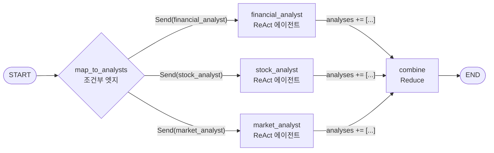

조건부 엣지는 목적지 노드 이름을 문자열로 돌려주는 함수다. 문자열 하나를 돌려주니 갈 곳도 하나다 — 이것이 조건부 엣지를 **라우팅** 장치로 이해하게 만들고, 그 이해가 팬아웃을 막는다. 갈래를 여럿 만들고 싶으면 엣지를 미리 여러 개 그려 두는 수밖에 없어 보인다.

그런데 같은 자리에서 **리스트**를 돌려줄 수 있다. 리스트의 각 원소가 "이 노드를 이 입력으로 실행하라"는 지시라면, 갈래 수는 그 리스트의 길이가 되고 그 길이는 실행 시점에 정해진다. 이 글은 그 장치인 `Send()`로 기업 분석 리포트 파이프라인을 조립하고, 팬아웃 방식이 바뀔 때 리듀서 선택이 왜 함께 바뀌는지를 본다. [앞 편](/blog/ai-agent/newsletter-agent-static-fanout/)에서 `for i in range(5)`가 데이터 개수에 묶이는 지점까지 왔다.

## 용어 정리

앞 편의 용어표에서 이 글이 쓰는 행만 추렸다.

| 약어 / 용어 | 원어 | 뜻 |
|---|---|---|
| Fan-out / Fan-in | Fan-out / Fan-in | 한 노드에서 여러 노드로 갈라졌다가 다시 모이는 그래프 형태 |
| Map-Reduce | Map-Reduce | 작업을 조각으로 나눠 병렬 처리(Map)한 뒤 하나로 합치는(Reduce) 패턴 |
| `Send()` | LangGraph Send | 런타임에 "이 노드를 이 입력으로 실행하라"를 동적으로 발행하는 객체 |
| Reducer | Reducer | 여러 노드가 같은 상태 키에 쓸 때 병합 규칙. `Annotated[T, fn]`으로 선언 |
| ReAct | Reasoning + Acting | LLM이 "생각 → 도구 호출 → 관찰"을 반복하는 에이전트 루프 |
| Structured Output | 구조화 출력 | LLM 응답을 정해진 스키마(Pydantic)로 강제 받는 것 |
| `recursion_limit` | — | 그래프가 밟을 수 있는 최대 스텝 수 |
| SEC | Securities and Exchange Commission | 미국 증권거래위원회. 상장사 공시 원문 제공 |

## 왜 Map-Reduce가 필요한가

| 상황 | 정적 팬아웃으로 되는가 | 이유 |
|---|---|---|
| 관점 3개 고정 (재무·주식·시장) | 된다 | 개수가 컴파일 타임에 확정 |
| 경쟁사 N개 각각 분석 | **안 된다** | N이 기업마다 다름 |
| 검색 결과 문서 M개 각각 요약 | **안 된다** | M이 쿼리마다 다름 |
| 서브테마 3~5개 가변 | **안 된다** | 인덱스 초과/미달 |

핵심 조건은 하나로 줄어든다 — **갈래 수와 각 갈래의 입력이 런타임에 결정되는가.** 첫 행만 "된다"이고 나머지 셋이 안 되는 이유가 전부 같다.

> 이 구현 자체는 관점 3개 고정이라 사실 정적 팬아웃으로도 짤 수 있다. 그런데도 `Send()`를 쓴 것은 **패턴을 익히기 위한 의도적 선택**이다.
>
> 이 사실을 알고 읽는 것과 모르고 읽는 것은 다르다. 모르고 읽으면 "관점이 셋이니 `Send()`가 필요하다"는 잘못된 인과를 배운다. 실제 필요 조건은 개수의 가변성이고, 이 코드는 그 조건을 만족하지 않은 채 구조만 먼저 보여 준다. 경쟁사 N개를 분석하는 순간 같은 코드가 그대로 필요해진다는 것이 이 선택의 이유다.

## `Send()` 동작 원리



**이 도식은 세 갈래로 그려져 있지만 앞의 표는 네 상황을 다룬다.** 축이 다르다 — 표는 정적 팬아웃이 감당하지 못하는 상황의 목록이고, 도식은 그중 첫 행에 해당하는 한 번의 실행을 찍은 스냅샷이다. 그리고 이 어긋남 자체가 `Send()`의 성질을 드러낸다. **실제 그래프 시각화에서는 저 세 화살표가 보이지 않는다.** 분기는 실행 전에 존재하지 않기 때문이다.

| 개념 | 일반 조건부 엣지 | `Send()` |
|---|---|---|
| 반환값 | 노드 이름 문자열 1개 | `Send` 객체의 **리스트** |
| 분기 수 | 1개 (라우팅) | N개 동시 (팬아웃) |
| 하위 노드 입력 | 전체 State 그대로 | `Send`에 담은 **개별 payload** |
| 개수 결정 시점 | 컴파일 타임 | **런타임** |

> 세 번째 행이 가장 자주 지나쳐진다. **`Send()`의 두 번째 인자가 핵심이다.** `Send("financial_analyst", {"company": company, "task": "financial"})`에서 두 번째 dict는 그 노드만 받는 **전용 입력**이다.
>
> 전체 State가 아니라 조각을 받으므로 각 분기는 자기 몫만 알면 된다. 이것이 Map 단계의 격리를 만든다. 앞 편의 정적 팬아웃에서는 각 노드가 `state['newsletter_theme'].sub_themes[i]`로 **전체 상태에서 자기 것을 찾아 꺼냈고**, 그래서 인덱스가 필요했고, 그래서 개수 불일치가 `IndexError`가 됐다. 입력을 주입받으면 찾을 일이 없으니 그 실패 경로 자체가 사라진다.

### 상태 스키마

```python
class AnalysisState(TypedDict):
    company: str
    messages: Annotated[List[BaseMessage], operator.add]
    analyses: Annotated[List[dict], operator.add]   # 분석 결과를 누적
    combined_report: str
```

앞 편의 `merge_dicts`와 대비된다.

| | 뉴스레터 `results` | 기업분석 `analyses` |
|---|---|---|
| 타입 | `Dict[str, str]` | `List[dict]` |
| 리듀서 | `merge_dicts` (`{**l, **r}`) | `operator.add` (리스트 연결) |
| 식별 방식 | 키(서브테마명)로 구분 | 원소 안의 `type` 필드로 구분 |
| 순서 보장 | 없음 (dict) | 없음 (완료 순서대로 append) |
| 중복 위험 | 같은 키면 덮어씀 | 같은 분석이 두 번 들어갈 수 있음 |

다섯 행 중 마지막이 교환의 대가다 — dict는 중복을 조용히 삼키고, list는 중복을 조용히 쌓는다.

> **`operator.add`가 dict가 아닌 list인 이유**는 `Send()`로 만들어지는 분기의 개수가 가변이라 "키"를 미리 정할 수 없기 때문이다. 리스트에 append하고 원소 안에 `type` 메타데이터를 넣는 방식이 동적 팬아웃과 맞는다.
>
> 여기서 규칙 하나가 나온다. **키가 고정이면 dict 병합, 가변이면 list 누적.** 리듀서 선택은 취향이 아니라 팬아웃 방식이 결정하는 종속 변수다. 앞 편에서 `merge_dicts`를 고른 것도 서브테마명이라는 안정적인 키가 있었기 때문이다.

## Map 함수와 분석가 노드

```python
from langgraph.types import Send

# Map 함수: 각 분석가에게 작업 할당
def map_to_analysts(state: AnalysisState):
    company = state["company"]
    return [
        Send("financial_analyst", {"company": company, "task": "financial"}),
        Send("stock_analyst",     {"company": company, "task": "stock"}),
        Send("market_analyst",    {"company": company, "task": "market"})
    ]

# 각 분석가 노드 함수
def analyst_node(state: dict, agent, task_type: str):
    """각 분석가의 작업을 실행하고 결과를 구조화"""
    company = state["company"]
    result = agent.invoke(
        {"messages": [("human", f"Analyze {task_type} aspects of {company}")]})

    return {
        "analyses": [{
            "type": task_type,
            "content": result["messages"][-1].content,
            "timestamp": datetime.now().isoformat()
        }]
    }
```

`analyst_node`의 시그니처가 `(state, agent, task_type)`인 것이 포인트다. **노드 함수를 팩토리로 만들어** 에이전트만 갈아끼우면 새 분석 관점이 추가된다. 실제 배선은 람다로 부분 적용한다.

반환값이 항상 `{"analyses": [단일 dict]}` 형태인 것도 규약이다. `operator.add`가 이것을 이어붙이므로, **모든 Map 노드는 원소 1개짜리 리스트를 반환한다**는 계약을 지켜야 한다.

### 각 분석가는 ReAct 에이전트다

```python
financial_agent = create_react_agent(llm, [get_financial_data, analyze_data, chart_generator],
                                     state_modifier=financial_prompt)
stock_agent     = create_react_agent(llm, [fetch_stock_data, analyze_data, chart_generator],
                                     state_modifier=stock_prompt)
market_agent    = create_react_agent(llm, [get_latest_filing_content, collect_company_news,
                                           collect_competitor_news, collect_market_news, scrape_webpages],
                                     state_modifier=market_prompt)
```

| 에이전트 | 도구 | 역할 프롬프트 요지 |
|---|---|---|
| `financial_agent` | 재무데이터 수집 · pandas 분석 · 차트 | 재무제표 정밀 분석, 재무비율 계산·해석, 산업 표준 대비 경쟁력 |
| `stock_agent` | 주가데이터 수집 · pandas 분석 · 차트 | 가격 패턴 식별, 기술지표 평가, 동종업계 밸류에이션 비교 |
| `market_agent` | SEC 공시 · 자사/경쟁사/시장 뉴스 · 웹스크래핑 | 경쟁 포지션, 산업 역학, 시장 점유율과 성장성 |

**표는 세 행이고 위 도식의 Map 분기도 셋으로 대응한다.** 도식이 더하는 것은 세 갈래가 동시에 돈다는 사실 하나이고, 표가 더하는 것은 각 갈래가 무엇을 들고 도는지다.

`analyze_data`와 `chart_generator`를 **재무·주식 에이전트가 공유**한다. 같은 CSV를 읽는 구조라 도구 재사용이 가능하다. 그리고 세 프롬프트가 모두 `오늘은 {today}입니다.`로 시작한다.

> 기준일 주입은 시점 의존 리포트의 필수 장치다. LLM은 학습 시점에 갇혀 있어 기준일을 주지 않으면 "최근 실적"을 2년 전 것으로 쓴다.
>
> 이 한 줄이 없을 때의 실패가 고약한 이유는 결과물이 멀쩡해 보이기 때문이다. 리포트에 연도가 명시되지 않으면 읽는 사람은 최신 자료로 받아들인다. 도구가 최신 데이터를 가져왔더라도 모델이 그것을 "예상보다 높다"고 해석하는 기준이 과거에 묶여 있으면 해석 전체가 틀어진다.

## Reduce 함수와 그래프 조립

```python
def combine_analyses(state: AnalysisState):
    analyses = state["analyses"]
    charts_directory = './charts'
    chart_images = [f""      # 상태가 아니라 디렉토리를 스캔한다
                    for file in os.listdir(charts_directory)
                    if file.endswith(('.png', '.jpg', '.jpeg'))]
    report_prompt = f"""
    <이전 분석> {analyses} </이전 분석>
    <지침>
    1. ## 요약        2. ## 재무 분석      3. ## 주식 성과 분석
    4. ## 시장 위치 분석  5. ## 위험 및 기회   6. ## 투자 권장 사항
    </지침>
    """
    combined_report = llm.invoke(report_prompt)
    return {"combined_report": combined_report,
            "messages": [("report", combined_report)]}
```

`<지침>` 블록의 여섯 항목이 이 파이프라인의 출력 계약이다. Pydantic 스키마 대신 프롬프트 목차로 포맷을 강제한 것인데, 두 방법의 차이는 아래에서 따로 본다. 차트를 상태가 아니라 디렉토리 스캔으로 모으는 부분은 실제로 결함을 일으키며, 다음 편의 산출물 오염 절에서 다룬다.

```python
from langgraph.graph import END, StateGraph, START

workflow = StateGraph(AnalysisState)

# Map 노드 추가 — 람다로 에이전트 부분 적용
workflow.add_node("financial_analyst", lambda x: analyst_node(x, financial_agent, "financial"))
workflow.add_node("stock_analyst",     lambda x: analyst_node(x, stock_agent,     "stock"))
workflow.add_node("market_analyst",    lambda x: analyst_node(x, market_agent,    "market"))

# Reduce 노드 추가
workflow.add_node("combine", combine_analyses)

# START에서 map_to_analysts로 가는 조건부 엣지
workflow.add_conditional_edges(START, map_to_analysts, {
    "financial_analyst": "financial_analyst",
    "stock_analyst": "stock_analyst",
    "market_analyst": "market_analyst"})

# 각 분석가의 결과를 combine으로 팬인
for analyst in ["financial_analyst", "stock_analyst", "market_analyst"]:
    workflow.add_edge(analyst, "combine")
workflow.add_edge("combine", END)

app = workflow.compile()
```

조건부 엣지가 `START`에 붙은 것이 눈에 띈다. 팬아웃이 그래프의 첫 동작이므로 중간 노드를 거칠 이유가 없다.

```python
config = {"recursion_limit": 50}
inputs = {"company": "Tesla", "messages": [], "analyses": [], "combined_report": ""}
for output in app.stream(inputs, config):
    if "__end__" not in output:
        print(output)
```

> 실행부는 `recursion_limit`을 반드시 올려 준다. **ReAct 에이전트 3개가 각각 도구를 여러 번 호출하므로 기본값으로는 부족하다.**
>
> 스텝 수가 곱셈으로 늘어난다는 점이 핵심이다. 분기 하나가 도구를 다섯 번 부르면 그것만으로 열 스텝(호출 + 관찰)이고, 셋이면 서른이다. Streamlit 앱은 이 값을 100까지 올린다. 앞 편의 뉴스레터는 노드마다 LLM을 한 번씩만 부르므로 이 문제가 없었다 — **노드 안에 루프가 들어가는 순간 스텝 예산 계산이 달라진다.**

Streamlit 앱은 `app.astream`으로 받은 노드별 출력을 탭 세 개(Financial / Stock / Market)에 실시간으로 뿌린다. 최종 리포트를 기다리는 동안 중간 산출물을 보여주는 UX인데, `value['analyses'][0]['content']`로 바로 꺼낼 수 있는 근거가 앞의 계약이다 — 각 Map 노드는 항상 원소 1개짜리 리스트를 반환한다.

### 정적 팬아웃과 `Send()` 정면 비교

| 기준 | 정적 팬아웃 | `Send()` Map-Reduce |
|---|---|---|
| 노드 생성 시점 | 컴파일 타임 (`add_node` 루프) | 런타임 (`Send` 발행) |
| 분기 수 | 고정 | 가변 |
| 하위 노드 입력 | 전체 State에서 인덱스로 꺼냄 | `Send` payload로 주입 |
| 개수 불일치 위험 | `IndexError` | 없음 |
| 그래프 시각화 | 노드가 전부 보임 | 실행 전엔 분기가 안 보임 |
| 디버깅 | 쉬움 (노드명 고정) | 상대적으로 어려움 |
| 적합한 상황 | 항목 수가 도메인상 고정 | 항목 수가 입력에 따라 변함 |

> 다섯 번째와 여섯 번째 행이 `Send()`의 대가다. **`Send()`는 만능이 아니다.**
>
> 실행 전에 그래프를 그려 보면 분기가 없는 그림이 나오고, 어느 분기가 실패했는지도 노드 이름만으로는 구분되지 않는다. 항목 수가 도메인상 확실히 고정이라면 정적 팬아웃이 관측성 면에서 낫다. 선택 기준은 "더 좋은 패턴"이 아니라 마지막 행 하나다 — **개수가 변하는가.**

## 리포트 포맷을 강제하는 두 방법

### 방법 A — Pydantic 스키마

```python
class NewsletterThemeOutput(BaseModel):
    """Output model for structured theme and sub-theme generation."""
    theme: str = Field(description="The main newsletter theme based on the provided article titles.")
    sub_themes: List[str] = Field(description="List of sub-themes or key news items to investigate under the main theme.")

structured_llm_newsletter = llm.with_structured_output(NewsletterThemeOutput)
subtheme_chain = theme_prompt | structured_llm_newsletter
newsletter_theme = subtheme_chain.invoke({"article_titles": "\n".join(article_titles)})
newsletter_theme.sub_themes = newsletter_theme.sub_themes[:5]   # 방어적 절단
```

`with_structured_output`은 Pydantic 스키마를 함수 호출 스펙으로 변환해 모델에 전달한다. 결과가 **파싱 완료된 객체**로 돌아오므로 `newsletter_theme.sub_themes`처럼 속성 접근이 되고, 정규식으로 자유 텍스트를 긁을 필요가 없다.

| 얻는 것 | 설명 |
|---|---|
| 타입 보장 | `sub_themes`는 반드시 문자열 리스트 |
| 파싱 실패 제거 | JSON 깨짐·마크다운 코드펜스 혼입 문제가 사라짐 |
| 하위 노드 안전성 | `state['newsletter_theme'].sub_themes[i]`가 성립 |
| `Field(description)` = 프롬프트 | 필드 설명이 그대로 모델에 전달됨. **스키마가 곧 지시문** |

네 행 중 마지막이 자주 잊히는 것이다. 스키마를 타입 선언으로만 보면 `description`을 비워 두게 되는데, 그 문자열이 모델이 읽는 유일한 지시다.

### 방법 B — 프롬프트 목차

기업분석은 Pydantic을 쓰지 않고 프롬프트 `<지침>` 블록에 여섯 섹션 목차를 박았다. 각 섹션마다 무엇을 담을지도 함께 지정한다 — 재무 분석에는 "수익·순이익·자산·부채·자본과 추세 비교", 위험 및 기회에는 "정량 데이터로 뒷받침", 투자 권장 사항에는 "명확한 권고와 근거".

| 기준 | Pydantic 스키마 | 프롬프트 목차 |
|---|---|---|
| 강제력 | 강함 (스키마 위반 시 재시도) | 약함 (LLM이 섹션을 빠뜨릴 수 있음) |
| 적합한 데이터 | 짧고 구조적 (테마, 분류, 점수) | 길고 서술적 (본문 단락) |
| 후속 코드 접근 | 속성 접근 | 문자열 파싱 필요 |
| 긴 산문 | 부적합 (필드에 긴 텍스트는 품질 저하) | 적합 |
| 검증 | 자동 | 수동 |

> 실무 기준은 **용도**로 갈린다. 분기·라우팅에 쓰는 값은 Pydantic으로, 사람이 읽는 최종 산출물은 프롬프트 목차로 간다.
>
> 두 파이프라인의 선택이 정확히 이 기준을 따랐다. 뉴스레터의 `sub_themes`는 그래프 분기를 결정하므로 스키마가 필수였고 — 파싱이 실패하면 팬아웃이 성립하지 않는다 — 기업분석의 최종 리포트는 아무도 파싱하지 않으므로 목차로 충분했다. **다음 단계가 코드인가 사람인가**를 물으면 답이 나온다.

### 절충안 — 섹션은 스키마로, 본문은 자유롭게

섹션 존재는 보장하면서 본문은 자유롭게 두려면, 섹션 단위 스키마에 본문을 문자열 필드로 담는다.

```python
class ReportSection(BaseModel):
    heading: str = Field(description="섹션 제목")
    body_markdown: str = Field(description="섹션 본문. 마크다운 표 사용 권장")

class CompanyReport(BaseModel):
    summary: ReportSection
    financial: ReportSection
    stock: ReportSection
    market: ReportSection
    risks: ReportSection
    recommendation: ReportSection
```

**`CompanyReport`의 여섯 필드가 앞 프롬프트의 여섯 항목과 정확히 대응한다.** 같은 목차를 프롬프트에 문장으로 쓸 것이냐 스키마에 필드로 쓸 것이냐의 차이만 있다.

> 이러면 **섹션 여섯 개는 스키마가 보장**하고 본문 품질은 프롬프트가 담당한다. 섹션 누락으로 인한 후속 처리 실패가 사라지고, 특정 섹션만 재생성하는 것도 가능해진다.
>
> 뒤쪽이 실무에서 더 값을 한다. 프롬프트 목차 방식에서는 "위험 및 기회 섹션이 부실하다"는 피드백에 리포트 전체를 다시 생성해야 하지만, 필드로 갈라 두면 그 필드만 다시 채우면 된다. 재생성 단위가 곧 비용 단위다.

---

여기까지가 그래프 구조다. 갈래를 런타임에 만들고, 결과를 리스트로 누적하고, 목차를 강제해 리포트를 뽑았다.

그런데 이 파이프라인의 실질적인 무게는 그래프가 아니라 **각 분기가 부르는 도구들**에 있다. 3년치 분기 재무제표를 어떻게 LLM에게 넘길 것인가, 도구가 도구 안에서 또 에이전트를 부르는 구조는 무엇을 얻고 무엇을 잃는가, 그리고 세 분기 중 하나가 실패했을 때 리포트를 낼 것인가 말 것인가. [다음 편](/blog/ai-agent/tool-contract-and-partial-failure/)에서 도구 인터페이스 규약과 부분 실패 마감 정책을 다룬다.
