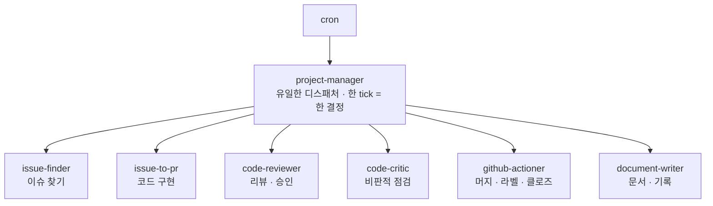
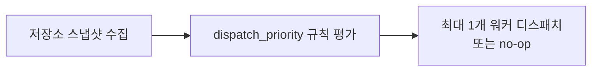
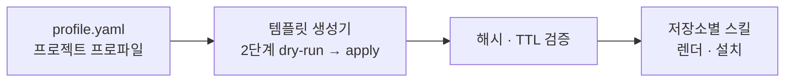

에이전트를 여럿 띄우면 곧바로 새 문제가 생긴다. A가 B를 부르고 B가 C를 부르고 C가 다시 A를 부르는 그래프가 만들어지면, 무엇이 왜 실행됐는지 사후에 재구성할 수 없다. 자동화의 신뢰는 성능이 아니라 **"무엇을 왜 했는지 남는가"**로 판정되는데, 이 구조에서는 남길 것이 없다.

이 글은 그 문제를 하드 규칙 몇 줄로 막은 사례를 해부한다. 핵심은 두 문장이다 — **워커는 서로를 호출하지 않는다. 디스패처만 선택한다.** 그리고 **한 사이클에 최대 하나의 결정.** 여기에 결정 로그와 커서 파일, 라벨 계약, 알림 정책이 붙으면 야간·주말에도 도는 시스템이 감사 가능한 상태로 유지된다. [앞 편](/blog/ai-agent/delegation-gap/)이 위임 격차와 승인 게이트라는 원칙을 세웠다면, 이 글은 그 원칙의 구현 규약이다.

이 다음부터 시리즈는 다시 층을 내려가, 에이전트 루프 자체를 어떻게 설계하는지로 [넘어간다](/blog/ai-agent/loop-engineering-basics/).

> 이 글은 **2026년 5월 자료를 정리한 것**이다. 아키텍처와 내부 식별자는 원 자료가 공개한 사례의 것이고, 효과 수치는 벤더·외부 보고 기준의 참고치다.

## 용어 정리

앞 편의 용어표에서 이 글이 쓰는 행만 추리고, 운영 규약 용어를 더했다.

| 용어 | 원어 / 표기 | 뜻 |
|---|---|---|
| 디스패처 | Dispatcher | 어떤 워커에게 일을 줄지 결정하는 단일 주체 |
| 워커 | Worker | 하나의 책임만 갖는 실행 단위. 각 워커 = 하나의 스킬(계약) |
| tick | tick | 스케줄러가 디스패처를 깨우는 한 주기 |
| no-op | no-op | 그 tick에 아무 디스패치도 하지 않기로 한 결정 |
| SoT | Source of Truth | 사람과 에이전트가 함께 참조하는 단일 진실 공급원 |
| ADR | Architecture Decision Record | 아키텍처 결정과 근거를 남기는 문서 |
| 결정 로그 | — | 매 tick의 디스패치·무동작 결정을 기록하는 저장소 |
| 커서 | cursor | 어디까지 처리했는지를 보존해 중복 처리를 막는 표식 |
| 스모크 체크 | smoke check | 설치 직후 최소 동작을 확인하는 검증 |

## 무엇을 자율화했는가

| 구분 | 내용 |
|---|---|
| **WHY** | 코드 저장소 운영을 자율화한다 — 운영 스킬 설치, 저장소별 프로젝트 구성, 반복 작업을 백그라운드 cron으로 |
| **WHAT** | 저장소 운영 스킬 세트, 그 진실 공급원 계약, 정적 역할 스킬(`install`·`update`·`project-setup`·`cronjob`), 템플릿 기반 스킬 생성기 + 프로젝트 프로파일 |



| 역할 | 책임 |
|---|---|
| `project-manager` | 오케스트레이터 — 디스패치 결정 |
| `issue-finder` | 처리할 이슈를 탐색·선별 |
| `issue-to-pr` | 이슈를 받아 PR로 구현 |
| `code-reviewer` | 변경을 리뷰·승인 |
| `code-critic` | 비판적 점검·리스크 식별 |
| `github-actioner` | 머지·라벨·클로즈 등 조치 |
| `document-writer` | 문서·기록 작성 |

**도식은 일곱 노드이고 표도 일곱 행이라 개수는 같지만, 도식에만 있는 것이 화살표의 방향이다.** 모든 화살표가 디스패처에서 나가고 워커끼리는 이어지지 않는다. 표는 각자가 무엇을 하는지만 말하고, 도식은 서로 무엇을 하지 않는지를 말한다.

> **워커는 서로를 호출하지 않는다. 디스패처만 선택한다.**
>
> 이 한 줄이 아키텍처의 전부이며, 그 대가로 얻는 것은 성능이 아니라 **재구성 가능성**이다. 워커가 서로를 부르면 실행 그래프가 런타임에 만들어지고 사후 재현이 불가능해진다. 디스패처만 선택하면 그래프의 깊이가 항상 1이라 "누가 왜 실행됐나"가 결정 로그 한 줄로 답해진다. 감사와 디버깅이 필요한 시스템에서는 이 단순함이 곧 운영 비용이다.

각 역할은 하나의 책임이고 하나의 스킬(계약)이며, 프로젝트별 상태는 저장소가 아니라 별도 홈 디렉터리(`$HERMES_HOME/{slug}/`) 아래에 격리된다. 상태를 저장소에 두지 않는 것이 중요한데, 저장소는 워커가 수정하는 대상이라 상태를 같이 두면 작업이 상태를 덮어쓴다.

## 한 tick, 한 결정

매 tick에서 디스패처의 판단 흐름은 세 단계다.



하드 규칙은 넷이다.

| # | 규칙 |
|---|---|
| 1 | **디스패처만** 워커를 선택한다 |
| 2 | 한 tick = **최대 1 디스패치 또는 1 no-op** |
| 3 | 워커는 다른 워커를 호출·디스패치하지 않는다 |
| 4 | 상태 라벨의 연쇄는 계약이 아니다 |

> **단순하고 예측 가능한 제어 흐름이 디버깅과 감사를 쉽게 만든다.**
>
> 네 규칙 중 4번이 가장 덜 직관적이다. 라벨이 `triage → in-progress → review` 순으로 붙는다고 해서 그 순서를 시스템이 보장하지는 않는다는 뜻인데, 이것을 계약으로 삼으면 라벨을 사람이 손으로 바꾼 순간 시스템이 잘못된 상태를 참으로 믿게 된다. **관찰 가능한 표식과 실행 계약을 분리**하라는 원칙이며, 사람이 만지는 모든 필드에 같은 원칙이 적용된다.

디스패치는 직접 호출이 아니라 논블로킹으로 이뤄진다.

| 항목 | 내용 |
|---|---|
| 왜 직접 호출하지 않는가 | 디스패처가 워커를 도구로 직접 호출하면 **다음 cron tick을 막는다** |
| 해법 | 리포트의 **마지막 줄에 `/background` 한 줄만** 출력 → 런타임이 격리 워커 세션을 띄운다 |

```text
/background Run the gucci-harness:<worker> skill
for project=<slug> (target=<target>,
reason=<reason>) using the <worker_cli> worker CLI.
```

여기에 붙는 규약이 셋이다 — 디스패치 결정 행은 출력 **전에** 결정 로그에 기록하고, 디스패치 tick당 `/background` 줄은 **정확히 하나이며 마지막 줄**이어야 하고, 무동작 tick은 그 줄을 출력하지 않는다. 첫 번째 규약의 순서가 중요하다. **기록이 실행보다 앞선다** — 반대로 하면 실행 도중 죽었을 때 결정 자체가 사라진다.

## 상태는 두 파일에 산다

| 장치 | 역할 |
|---|---|
| `pm-decisions.db` | 프로젝트당 SQLite(WAL) 1개. tick마다 디스패치·무동작 결정을 기록 |
| `last-tick.json` | 머지된 PR 커서와 마지막 tick 시각을 보존 — **중복 처리 방지** |
| 요청 한도 내성 | 저장소 API가 **429**를 반환하면 디스패치 없이 무동작으로 기록 → 안전하게 다음 tick으로 |

세 행이 각각 다른 실패를 막는다. 첫째는 "무엇을 했는지 모름", 둘째는 "같은 일을 두 번 함", 셋째는 "외부 장애가 시스템 장애로 번짐"이다. 특히 세 번째의 처리 방식이 눈여겨볼 만한데, 오류를 예외로 던지지 않고 **무동작이라는 정상 결정으로 기록**한다. 그러면 장애 구간이 로그에서 공백이 아니라 연속된 no-op으로 남는다.

## 계약은 라벨과 한국어 코멘트로

| 구분 | 내용 |
|---|---|
| 상태 라벨 | `br:triage` · `br:in-progress` · `br:needs-adr` · `br:blocked` |
| 우선순위 라벨 | `P0` · `P1` · `P2` · `P3` |
| 표기 규칙 | `br:*` 라벨은 접두사를 하드코딩, 슬러그는 kebab-case |
| 코멘트 | **사람이 읽는 한국어** — 예: "이 PR은 인증 모듈 변경으로 ADR이 필요합니다. 검토 후 결정 부탁드립니다." |
| 기계값 | 푸터의 `br_label` · `reason` **만** — 예: `br_label: br:needs-adr   reason: auth-change` |

> **마지막 두 행이 이 표의 설계다. 사람이 읽는 문장과 기계가 읽는 값을 같은 코멘트 안에서 분리한다.**
>
> 하나로 합치면 둘 다 나빠진다. 기계가 파싱하도록 쓰면 사람에게 불친절해지고, 사람이 읽기 좋게 쓰면 파싱이 깨진다. 본문은 자연어로 두고 푸터에 키-값 두 개만 고정하면 양쪽이 각자의 형식을 유지한다. 이 방식은 사람이 코멘트 본문을 고쳐도 기계값이 살아남는다는 부수 효과도 있다.

알림 정책도 명시돼 있다.

| 알린다 | 알리지 않는다 |
|---|---|
| `blocked` — 막혔을 때 | 머지·클로즈 **성공** |
| ADR이 필요할 때 | 저장소 코멘트·라벨로만 기록 |

**성공을 알리지 않는다**는 것이 이 정책의 핵심이다. 노이즈를 줄이고 사람의 주의를 결정에만 집중시킨다. 자동화 알림이 신뢰를 잃는 전형적인 경로가 여기 있는데, 성공 알림이 쌓이면 사람이 채널 전체를 무시하게 되고 그러면 정작 실패 알림도 놓친다.

## 스킬을 찍어내고 설치한다



| 항목 | 내용 |
|---|---|
| SoT 적합성 | 템플릿·생성기·스킬은 모두 `docs/sot/` 계약을 따른다. **계약이 바뀌어야 하면 SoT를 먼저 바꾼다** |
| 시크릿 | 토큰은 프로파일·로그·메타데이터 어디에도 기록되지 않는다 (`redact_token_text`가 스크럽) |
| 설치 | 정적 스킬 복사 → 인증 → 워커 프로파일 부트스트랩 → **스모크 체크** |
| 가동 | 설치 한 번 → 이후 반복 작업은 백그라운드 cron으로 상시 가동 |

> **첫 행의 순서 규칙 — 계약이 바뀌어야 하면 SoT를 먼저 바꾼다 — 이 이 시스템 전체를 지탱한다.**
>
> 생성기가 스킬을 찍어내는 구조에서 스킬을 직접 고치면 다음 생성 때 덮어써진다. 그래서 변경은 반드시 상류인 계약 문서에서 시작해야 하고, 이것은 코드 생성 파이프라인이 있는 모든 시스템의 공통 규율이다. 두 번째 행의 시크릿 처리도 같은 성격인데, 스크럽을 로그 기록 시점에 거는 것이 아니라 **텍스트를 만드는 지점**에 걸어야 누락이 생기지 않는다.

결과는 24시간 가동이다. 사람의 근무 시간이 더 이상 처리량의 상한이 아니게 되고, 야간·주말에도 백로그가 줄어들며, **출근하면 PR이 와 있다.**

## 효과와 리스크

벤치마크로 가늠하는 잠재 효과다.

| 지표 | 배수 |
|---|---|
| PR 머지율 | **2x** |
| 보안 수정 속도 | **20x** |
| 마이그레이션 시간 | **10x** |

| 항목 | 내용 |
|---|---|
| 출처 | 여러 벤더·기업의 **외부 보고 기준 수치** |
| 대표 사례 | TELUS — 13,000 솔루션, 출시 **30% 단축**, **50만 시간** 절감 |
| 주의 | 우리 환경에서는 **반드시 자체 검증이 필요**하다. 수치는 참고치이며 일반화에 주의 |

> **세 배수를 나란히 읽을 때 주의할 것은 분모가 서로 다르다는 점이다.**
>
> 머지율은 비율이고, 보안 수정 속도는 시간이며, 마이그레이션은 프로젝트 단위다. 20배가 2배보다 열 배 좋다는 뜻이 아니라 **측정 대상이 다르다**는 뜻이다. 그리고 셋 다 벤더 또는 도입사가 발표한 값이라 독립 검증을 거치지 않았다. 이런 수치의 올바른 용도는 목표 설정이 아니라 **어느 작업 유형이 자동화에 유리한지의 힌트**다 — 반복적이고 검증 가능한 보안 패치가 가장 큰 배수를 보였다는 사실이 그 자체로 정보다.

| 리스크 | 완화 장치 |
|---|---|
| 환각 · 잘못된 도구 호출 | 승인 게이트로 **부작용 전에** 차단 |
| 비가역적 변경 | ADR · 사람 리뷰 **필수 게이트** |
| 토큰 · 시크릿 노출 | 환경변수만 사용 · 자동 스크럽 |
| 워커 폭주 · 충돌 | 워커 격리 · 한 tick 한 결정 · **최소 권한** |

도입의 전제는 **신뢰의 설계**다. 위임 격차를 넘으려면 자율성을 신뢰할 수 있는 구조가 먼저 있어야 하고, ADR과 리뷰(결정 지점 표면화)·상태 라벨(현재 상태 추적)·결정 로그(무엇을 왜 했는지 기록) 셋이 곧 **신뢰를 만드는 인프라**다. 네 리스크의 완화 장치가 전부 앞 절들에서 이미 나온 것이라는 점도 확인해 둘 만하다 — 리스크 대응이 별도 레이어가 아니라 아키텍처 자체에 박혀 있다.

## 사람에게 남는 것

| 시스템으로 이동 | 사람에게 남는다 |
|---|---|
| 단순 코딩 | **무엇을** 만들지 |
| 코드 검수 | **왜** 만들지 |
| 반복 운영 작업 | **어떤 트레이드오프**를 택할지 |

| # | 영역 | 정의 | 예시 |
|---|---|---|---|
| ① | **아키텍처 결정** | 시스템의 경계와 트레이드오프, 장기 진화 방향을 정하는 일 | 되돌리기 비싼 구조적 선택 / 확장성·일관성·복잡도의 균형 / **"무엇을 만들지 않을지"의 결정** |
| ② | **UX · UI 기획** | 사용자가 실제로 어떻게 움직이는지를 설계하는 일 | 사용자 흐름·정보구조 설계 / 제품 감각이 필요한 판단 / 드래그냐 드롭다운이냐 같은 디테일 |
| ③ | **비즈니스 로직** | 도메인 규칙과 우선순위, 가치 판단을 정하는 일 | 도메인 규칙·정책 정의 / 무엇이 더 중요한가의 우선순위 / 맥락을 아는 사람만 할 수 있는 판단 |

> **좋은 결정을 하려면 축적된 통찰과 경험이 필요하다. 인재상이 실행자에서 판단자·설계자로 옮겨간다.**
>
> 위 표의 두 열은 행 수가 같지만 대응하지 않는다. 왼쪽은 작업이고 오른쪽은 질문이라, 세 작업이 세 질문으로 변환되는 것이 아니라 세 작업이 전부 빠진 자리에 세 질문이 남는 것이다. 그리고 아래 표의 ①번 마지막 항목 — **"무엇을 만들지 않을지"의 결정** — 이 자동화가 가장 대체하기 어려운 종류인데, 만들지 않기로 한 것은 산출물이 없어 학습 데이터가 되지 않기 때문이다.

핵심 요약은 다섯 줄로 압축된다.

| # | 내용 |
|---|---|
| 01 | 자율형은 동기형이 아니라 **비동기 백그라운드**다 |
| 02 | 오케스트레이터는 **디스패처**, 알고리즘은 하네스(스킬)에 있다 |
| 03 | 사람의 결정은 저장소의 **ADR · 리뷰**로 표면화한다 |
| 04 | 아키텍처 = **디스패처 + 워커 + SoT 계약** |
| 05 | 사람에겐 의사결정이 남고, 그래서 **통찰이 자산**이다 |

## 조직에 옮기면 무엇이 되는가

| 주장 | 조직에 미치는 함의 | 첫 90일에 할 일 |
|---|---|---|
| 위임 격차: 사용 60% vs 완전 위임 0~20% | 도입률 지표는 성과를 증명하지 못한다. **위임 가능 비율**이 진짜 지표 | 팀 업무를 "완전 위임 / 부분 위임 / 위임 불가"로 3분류. 위임 불가 사유를 신뢰·구조 요인별로 기록 |
| 처리량 = 사람의 시간 → 시스템의 가동 | 인력 증원으로만 처리량을 늘리던 계획이 바뀐다. 야간·주말 백로그 소진이 실제 처리 능력이 됨 | 반복 운영 작업 1~2종을 야간 배치로 전환. 아침에 결과만 검토하는 리듬을 4주 시범 운영 |
| 오케스트레이터는 범용재, 해자는 스킬·SoT 계약 | 도구 도입 예산보다 **사내 업무 규약을 코드화하는 투자**가 남는 자산 | 코드리뷰 기준·릴리스 절차·장애 대응 절차를 각각 스킬 문서로 1개씩 작성. 도구는 나중에 고른다 |
| 워커는 서로를 호출하지 않는다, 디스패처만 선택한다 | 멀티에이전트를 "많이 붙이는" 설계가 디버깅 불가로 이어짐. **단일 디스패처 + 한 사이클 한 결정**이 감사 가능한 구조 | 자동화 파이프라인의 호출 그래프를 그려 순환·상호 호출을 제거. 결정 주체를 1개로 고정 |
| 결정 로그 + 커서 파일 | 자동화의 신뢰는 **"무엇을 왜 했는지 남는가"**로 판정된다. 감사·규제 대응의 기반 | 자동화 시스템에 결정 로그 테이블을 먼저 만든다. 로그 없이 도는 자동화는 승인하지 않는 원칙 수립 |
| 성공은 알리지 않고 막힌 것과 ADR만 알린다 | 알림 과다가 오히려 신뢰를 떨어뜨린다. **주의를 결정에만 쓰게 하는 것**이 운영 설계 | 기존 자동화 알림 채널을 감사해 "행동을 유발하지 않는 알림"을 전부 제거 |
| 사람에게 남는 일 = 아키텍처·UX·비즈니스 로직 | 역량 개발 방향이 코딩 숙련도에서 **판단력·도메인 통찰**로 이동. 평가 기준도 바뀌어야 | 시니어 평가 항목에 "되돌리기 비싼 결정의 품질"을 추가. 주니어에게는 도메인 학습 경로를 명시 |
| 벤더 수치(2x·20x·10x)는 참고치일 뿐 | 외부 사례 수치를 사내 목표로 직결하면 목표 설정이 무너진다 | 도입 전 **자체 기준선**(PR 사이클·재작업률·결함률)을 4주간 먼저 측정. 비교 없는 효과 주장 금지 |

여덟 행 중 다섯의 세 번째 열이 **"먼저 그리거나 먼저 재라"**로 시작한다. 호출 그래프를 그리고, 업무를 3분류하고, 기준선을 재고, 알림을 감사하고, 규약을 문서로 쓴다 — 전부 시스템을 만들기 전에 하는 일이다.

---

여기까지가 자율 실행의 운영 규약이다. 디스패처는 하나, 사이클당 결정은 하나, 결정은 기록보다 늦게 실행되고, 알림은 막힌 것만 나간다.

그런데 이 규약은 워커 **바깥**의 이야기다. 워커 하나가 안에서 도는 루프 자체 — 무엇을 관찰하고 무엇으로 검증하고 언제 멈추는지 — 는 아직 열지 않았다. 그리고 2026년 하반기의 담론은 정확히 그 안쪽을 향한다. [다음 편](/blog/ai-agent/loop-engineering-basics/)에서 제어 표면이 프롬프트에서 컨텍스트로, 다시 루프로 넓어진 역사와 그 이동을 만든 네 가지 촉발 요인을 본다.
