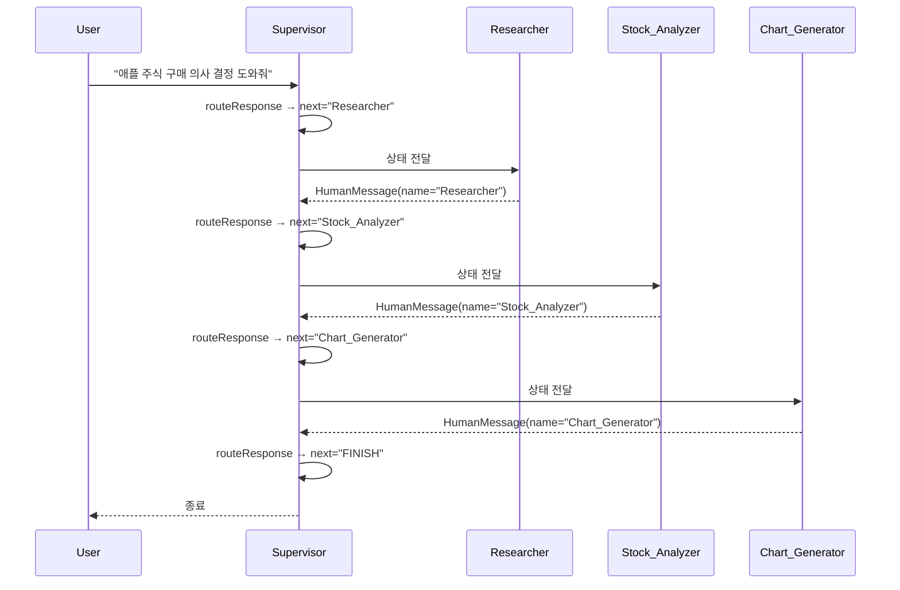
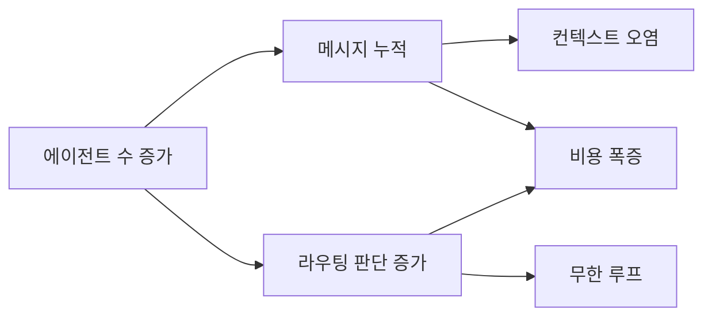

Supervisor 패턴에서 라우팅 함수는 `lambda x: x["next"]` 한 줄이다. 관리자가 LLM인데 라우팅 로직에 LLM 호출도 조건문도 없다. 판단은 이미 끝났고 그래프는 그 값을 **읽기만** 하기 때문이다.

**판단(LLM)과 실행(그래프)의 분리** — 이것이 Supervisor 패턴의 본질이고, 그 분리를 성립시키는 것이 구조화 출력이다. 이 글은 그 조립을 코드로 따라가고, 관리자를 한 명 세운 대가로 따라오는 세 가지를 정면으로 다룬다. [앞 편](/blog/ai-agent/when-to-split-agents/)에서 토폴로지를 골랐다면 여기가 그 구현이다.

## 용어 정리

앞 편의 용어표에서 이 글이 쓰는 행만 추렸다.

| 약어 / 용어 | 원어 | 뜻 |
|---|---|---|
| Supervisor | — | 하위 에이전트에게 일을 배정하고 결과를 회수하는 관리자 노드 |
| `create_react_agent` | — | ReAct 루프를 완성해 주는 LangGraph 프리빌트 |
| `functools.partial` | — | 함수의 일부 인자를 미리 묶어 새 함수를 만드는 표준 라이브러리 |
| Structured Output | 구조화 출력 | Pydantic 스키마를 강제해 LLM 출력을 파싱 가능한 객체로 받는 것 |
| `Literal[...]` | typing.Literal | 허용값을 타입으로 못 박는 파이썬 문법 |
| Reducer | 리듀서 | 같은 키에 새 값이 들어올 때 덮어쓸지 누적할지 정하는 함수 |
| `recursion_limit` | — | 그래프가 실행할 수 있는 최대 스텝 수. 기본값 **25** |
| `MessagesPlaceholder` | — | 프롬프트 템플릿에 메시지 리스트를 끼워 넣는 자리 |

## 전체 그림

하위 에이전트 셋으로 주식 종목을 평가하는 구성이다. `Researcher`(웹 검색), `Stock_Analyzer`(재무 분석), `Chart_Generator`(Python REPL).



`S->>S` 화살표가 네 번 나오는 것이 이 도식의 요점이다. 워커 셋을 부르는 데 **라우팅 호출이 네 번** 들어간다. 마지막 하나는 `FINISH`를 고르기 위한 것인데, 아무 일도 하지 않는 이 호출이 아래 비용 절의 출발점이다.

## 라우터 — 구조화 출력으로 `next` 받기

Supervisor의 본체는 이 스무 줄이다.

```python
members = ["Researcher", "Stock_Analyzer", "Chart_Generator"]
options = ["FINISH"] + members

system_prompt = (
    "You are a supervisor tasked with managing a conversation between the"
    " following workers:  {members}. Given the following user request,"
    " respond with the worker to act next. Each worker will perform a"
    " task and respond with their results and status. When finished,"
    " respond with FINISH."
)

class routeResponse(BaseModel):
    next: Literal[*options]          # ← 허용값을 타입으로 못 박는다

prompt = ChatPromptTemplate.from_messages([
    ("system", system_prompt),
    MessagesPlaceholder(variable_name="messages"),
    ("system",
     "Given the conversation above, who should act next?"
     " Or should we FINISH? Select one of: {options}"),
]).partial(options=str(options), members=", ".join(members))

def supervisor_agent(state):
    supervisor_chain = prompt | llm.with_structured_output(routeResponse)
    return supervisor_chain.invoke(state)   # → {"next": "Researcher"} 형태로 상태에 병합
```

| 요소 | 왜 이렇게 했나 |
|---|---|
| `Literal[*options]` | 라우팅 결과를 **문자열이 아니라 열거형**으로 강제. 오타·환각 노드명 원천 차단 |
| `with_structured_output` | 자연어 파싱 없이 곧바로 객체. 정규식 파싱 코드가 사라짐 |
| 지시문을 **뒤에** 한 번 더 | `MessagesPlaceholder` 뒤에 "who should act next?"를 재배치 — 긴 대화 뒤에서도 지시가 묻히지 않음 |
| `"FINISH"`를 옵션에 포함 | 종료도 **하나의 선택지**로 취급. 별도 종료 판정 로직 불필요 |
| `.partial(...)` | members·options를 프롬프트에 미리 바인딩. 노드 추가 시 배열만 수정 |

네 번째 행이 앞 편에서 짚은 "중앙 통제의 값어치는 종료 판정에 있다"의 구현이다. 종료를 별도 조건문으로 두지 않고 선택지 배열에 섞어 놓으면, 관리자는 매 턴 "누구를 부를까"와 "끝낼까"를 **같은 판단으로** 처리한다.

> [앞 시리즈의 Grader](/blog/ai-agent/self-rag-grader-design/)와 정확히 같은 3요소 패턴이다. Pydantic 클래스 + `Field`/`Literal` 제약 + `with_structured_output`.
>
> 다른 점은 판정 결과가 **경로 이름 그 자체**라는 것이다. Grader는 `yes`/`no`를 받아 코드가 노드 이름으로 번역했지만, 여기서는 LLM이 노드 이름을 직접 뱉는다. 그래서 `Literal`이 문법 장식이 아니라 **환각 방어선**이 된다 — 제약이 없으면 존재하지 않는 워커 이름이 나온다.

`Literal[*options]`(리스트 언패킹을 타입 인자로 사용)은 **Python 3.11+** 문법이다. 하위 버전에서는 `Literal["FINISH", "Researcher", ...]`로 직접 나열하거나 `Literal[tuple(options)]` 형태를 써야 한다.

## 워커 노드 — `create_react_agent` + `functools.partial`

```python
class AgentState(TypedDict):
    messages: Annotated[Sequence[BaseMessage], operator.add]
    next: str          # ← Supervisor가 채우는 라우팅 필드

def agent_node(state, agent, name):
    result = agent.invoke(state)
    # 핵심: 워커 결과를 AIMessage가 아니라 name 태그가 붙은 HumanMessage로 되돌린다
    return {"messages": [HumanMessage(content=result["messages"][-1].content, name=name)]}

research_agent = create_react_agent(llm, tools=[tavily_tool],
                                    state_modifier=research_system_prompt)
research_node = functools.partial(agent_node, agent=research_agent, name="Researcher")

stock_agent = create_react_agent(llm, tools=[stock_analysis],
                                 state_modifier=stock_system_prompt)
stock_node = functools.partial(agent_node, agent=stock_agent, name="Stock_Analyzer")

chart_agent = create_react_agent(llm, tools=[python_repl_tool],
                                 state_modifier=chart_system_prompt)
chart_node = functools.partial(agent_node, agent=chart_agent, name="Chart_Generator")
```

`functools.partial`로 같은 `agent_node` 함수를 세 번 재사용한다. 워커를 늘리는 비용이 두 줄이다.

**왜 결과를 `HumanMessage(name=...)`로 감싸는가**가 이 코드에서 가장 덜 자명한 선택이다.

| 이유 | 설명 |
|---|---|
| **발화자 식별** | Supervisor가 "누가 무엇을 이미 했는지"를 `name` 태그로 읽는다. 안 붙이면 중복 배정 발생 |
| **역할 혼동 방지** | 워커 출력이 `AIMessage`로 쌓이면 Supervisor LLM이 그것을 **자기 발화**로 오인한다 |
| **경계 차단** | 워커 내부의 ReAct 중간 단계(툴 콜·툴 응답)는 버리고 **최종 답변 1개만** 상위로 올린다 |

세 번째가 특히 중요하다. `result["messages"][-1]`만 취하므로 워커가 도구를 열 번 불렀어도 Supervisor는 결론 한 줄만 본다.

> **컨텍스트 오염을 막는 첫 번째 방어선**이 이 대괄호 안의 `-1`이다. 코드 한 글자가 상위 그래프에 올라오는 메시지 수를 N에서 1로 줄인다.
>
> 그리고 이 선택이 아래 비용 절과 직결된다. 라우팅 호출의 입력에 누적 메시지 전량이 들어가므로, 워커 하나가 남기는 메시지 수가 곧 **이후 모든 라우팅 호출의 단가**가 된다.

`state_modifier` 인자는 최신 LangGraph에서 `prompt`로 이름이 바뀌었다. 코드를 이식할 때 확인이 필요하다.

### 그래프 조립 — `next` 필드로 분기

```python
workflow = StateGraph(AgentState)
workflow.add_node("Researcher", research_node)
workflow.add_node("Stock_Analyzer", stock_node)
workflow.add_node("Chart_Generator", chart_node)
workflow.add_node("supervisor", supervisor_agent)

# (1) 모든 워커는 반드시 supervisor로 복귀 — Supervisor 패턴의 정의 그 자체
for member in members:
    workflow.add_edge(member, "supervisor")

# (2) supervisor가 채운 state["next"] 값을 그대로 노드 이름으로 사용
conditional_map = {k: k for k in members}
conditional_map["FINISH"] = END

workflow.add_conditional_edges(
    "supervisor",
    lambda x: x["next"],      # ← 라우팅 함수가 단 한 줄
    conditional_map)

workflow.add_edge(START, "supervisor")
graph = workflow.compile()
```

`conditional_map`이 항등 매핑(`{k: k}`)이라는 점이 이 조립의 성격을 말해 준다. 라우팅 값과 노드 이름이 같으므로 번역이 필요 없고, `FINISH` 한 칸만 `END`로 바꾸면 끝난다.

### 도구 설계 — 숫자는 도구가 만든다

```python
@tool
def stock_analysis(ticker: str) -> str:
    """
    주어진 주식 티커에 대한 업데이트된 종합적인 재무 분석을 수행합니다.
    최신 주가 정보, 재무 지표, 성장률, 밸류에이션 및 주요 비율을 제공합니다.
    가장 최근 영업일 기준의 데이터를 사용합니다.
    """
    ticker = yf.Ticker(ticker)
    historical_prices = ticker.history(period='5d', interval='1d')
    last_5_days_close = historical_prices['Close'].tail(5)
    annual_financials = ticker.get_financials()
    quarterly_financials = ticker.get_financials(freq="quarterly")
    return str({
        "최근 5일간 종가": {...},
        "연간 재무제표 요약": format_financial_summary(annual_financials),
        "분기별 재무제표 요약": format_financial_summary(quarterly_financials),
    })
```

시스템 프롬프트는 `"Never hallucinate the given metrics."` 한 줄이다.

> **숫자는 LLM이 만들지 않고 도구가 만든다** — 금융·커머스 도메인에서 반드시 지켜야 할 원칙이다.
>
> 프롬프트 한 줄이 이 원칙을 보장하는 것은 아니다. 실제로 보장하는 것은 **도구가 원본 값을 그대로 반환한다는 사실**이고, 프롬프트는 모델이 그 값을 재가공하지 않게 막는 보조 장치다. 순서를 바꿔 프롬프트로만 통제하려 들면 통제가 안 된다.

## 상태를 어떻게 나르나 — 리듀서 선택

| 리듀서 | 어디에 쓰이나 | 동작 | 주의점 |
|---|---|---|---|
| `add_messages` | 단일 에이전트 사례 | 메시지 추가 + **id 기준 중복 갱신** | LangChain 메시지 객체 전용 |
| `operator.add` | Supervisor·Hierarchical | 리스트 단순 연결 | 중복 제거 없음, 무한 누적 위험 |
| (리듀서 없음) | 리포트 생성기의 `current_section` 등 | **덮어쓰기** | 병렬 노드가 같은 키를 쓰면 충돌 |

멀티에이전트 코드가 `add_messages`가 아니라 `operator.add`를 쓰는 이유는 워커 출력이 이미 `agent_node`에서 **한 개로 압축**되어 있어 중복 갱신 로직이 필요 없기 때문이다. 압축을 앞단에서 했으니 뒷단이 단순해진 것이고, 반대로 압축을 안 했다면 여기서 id 관리가 필요해진다.

## 관리자를 세운 대가 셋



에이전트 수 증가라는 하나의 원인에서 두 경로가 갈라지고, 비용 폭증에서 다시 합류한다.

### (1) 컨텍스트 오염

| 증상 | 원인 | 방어책 |
|---|---|---|
| Supervisor가 이미 끝난 워커를 또 호출 | 워커 결과에 발화자 표시가 없음 | `HumanMessage(name=...)` 태깅 |
| 워커가 다른 워커의 도구를 흉내냄 | 툴 콜 원문이 공유 상태에 남음 | `result["messages"][-1]`만 추출 |
| 팀 간 지시가 뒤섞임 | 상태 스키마를 공유함 | 팀별 State 분리 + 진입 어댑터 |
| 초반 지시가 후반에 무시됨 | 긴 대화에서 시스템 프롬프트가 묻힘 | `MessagesPlaceholder` **뒤에** 지시문 재배치 |

네 방어책이 전부 앞에서 이미 코드로 나왔다. 세 번째만 예외인데, 상태 격리는 Supervisor 한 층에서는 불가능하고 계층 구조에서만 성립한다 — [다음 편](/blog/ai-agent/hierarchical-team-subgraph/)의 주제다.

### (2) 무한 루프

Supervisor가 `FINISH`를 고르지 않고 A→B→A→B를 반복하는 상황이다. 방어책으로 실행 시 `recursion_limit`을 명시한다.

```python
for s in super_graph.stream(
    {"messages": [HumanMessage(content="OpenAI가 최근에 출시한 o1 모델과 AI 에이전트")]},
    {"recursion_limit": 150},          # ← 기본값 25로는 3층 구조가 완주하지 못한다
):
    if "__end__" not in s:
        print(s)
```

`recursion_limit`의 기본값은 **25**다. 150을 준 이유는 이 예제가 3층 Hierarchical이어서 스텝이 곱셈으로 늘기 때문이다.

| 구조 | 1회 작업의 스텝 소모 |
|---|---|
| 단일 | 에이전트 1 + 도구 1 = 2 |
| Supervisor | 라우팅 1 + 워커 1 = 2, 워커 K명이면 약 2K + 마무리 |
| Hierarchical | 상위 라우팅 1 + 팀 진입 1 + (팀 라우팅 1 + 워커 1) × M + 복귀 1 |

**계층을 하나 더할 때마다 스텝 수가 곱해진다.** 25로는 팀 두 개짜리 구조도 완주하기 어렵다. 위 코드가 실제로 어떤 3층 구조를 돌리는지는 [다음 편](/blog/ai-agent/hierarchical-team-subgraph/)에서 팀 서브그래프를 조립하며 확인한다.

방어책은 다섯이다.

| 방어책 | 방법 |
|---|---|
| 스텝 상한 | `recursion_limit` — 넘으면 `GraphRecursionError` |
| 호출 횟수 카운터 | State에 `visit_count: dict`를 두고 임계 초과 시 강제 `FINISH` |
| 종료 조건 명문화 | Supervisor 프롬프트에 "각 워커는 최대 1회만 호출한다" 같은 규칙 삽입 |
| 진행 판정 | 직전 워커 결과와 현재 결과가 동일하면 정체로 보고 종료 |
| 타임아웃 | 그래프 전체에 벽시계 상한 부여 |

> **`recursion_limit`은 안전벨트지 설계가 아니다.** 한도에 걸린다는 건 종료 조건이 부실하다는 뜻이다.
>
> 그래서 한도에 걸렸을 때 값을 올리는 것은 대개 오답이다. 다섯 방어책 중 위에서 둘째부터 넷째까지가 실제 해법이고, 첫째는 그것들이 실패했을 때 시스템을 지키는 최후 방어선이다. [앞 시리즈에서](/blog/ai-agent/groundedness-cost-limits/) 검증 루프에 상한이 없다는 결함을 짚은 것과 같은 구조의 문제다.

### (3) 비용 폭증

| 항목 | 단일 | Supervisor(워커 K회 실행) |
|---|---|---|
| 라우팅 LLM 호출 | 0 | **K + 1회**(마지막 FINISH 판정 포함) |
| 라우팅 1회의 입력 토큰 | — | 시스템 프롬프트 + **누적 메시지 전량** |
| 누적 효과 | 없음 | 대화가 길어질수록 라우팅 1회 비용도 함께 증가 |

> 세 행을 하나로 줄이면 **라우팅 비용은 호출 횟수만 늘리는 게 아니라 호출당 단가도 같이 올린다.**
>
> 이 곱셈 구조를 놓치면 비용 추정이 크게 빗나간다. "워커가 3명이니 호출이 4번 는다"고 계산하면 선형이지만, 실제로는 네 번째 라우팅 호출의 입력이 첫 번째보다 훨씬 길다. **워커 수가 아니라 워커가 남기는 메시지 길이가 비용을 지배한다.**

완화책은 다섯이다.

| 완화책 | 설명 |
|---|---|
| 라우터에 저가 모델 | 라우팅은 분류 문제 — 워커보다 작은 모델로 충분 |
| 라우터 입력 절단 | 최근 N개 메시지 또는 요약본만 라우터에 전달 |
| 결정적 구간 하드코딩 | 순서가 고정된 구간은 LLM 라우팅 대신 고정 엣지로 |
| 계층 축소 | 팀이 2개뿐이면 Hierarchical 대신 평평한 Supervisor |
| 프롬프트 캐싱 | 고정 시스템 프롬프트를 캐시해 반복 입력 비용 절감 |

앞의 둘이 즉효약이고, 셋째는 앞 편의 리포트 생성기가 이미 쓰고 있는 방식이다. 넷째는 설계를 되돌리는 것이라 비용이 크다.

---

세 대가 중 두 개는 이 구조 안에서 완화된다. 그런데 **컨텍스트 오염의 세 번째 행 — 팀 간 지시가 뒤섞이는 문제 — 만은 여기서 풀리지 않는다.** Supervisor 한 층에서는 모든 워커가 같은 State를 공유하기 때문이다.

상태를 나누려면 그래프를 나눠야 하고, 그래프를 나누면 스키마가 서로 달라진다. 서로 다른 스키마를 가진 그래프를 어떻게 연결하는가. [다음 편](/blog/ai-agent/hierarchical-team-subgraph/)에서 팀 서브그래프와 상태 격리 어댑터를 다룬다.
