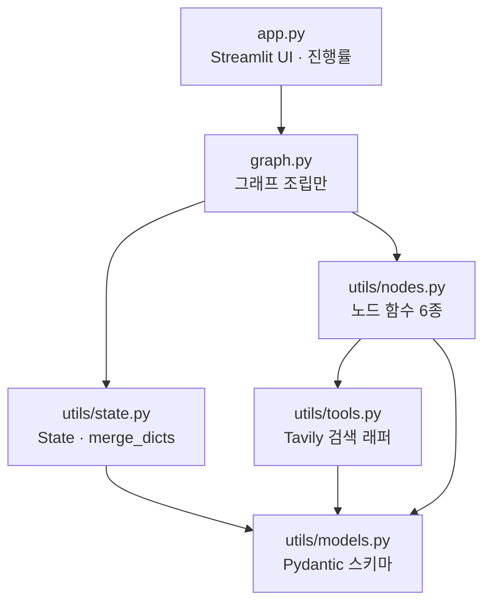
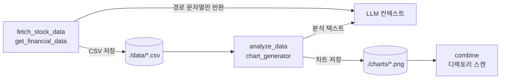
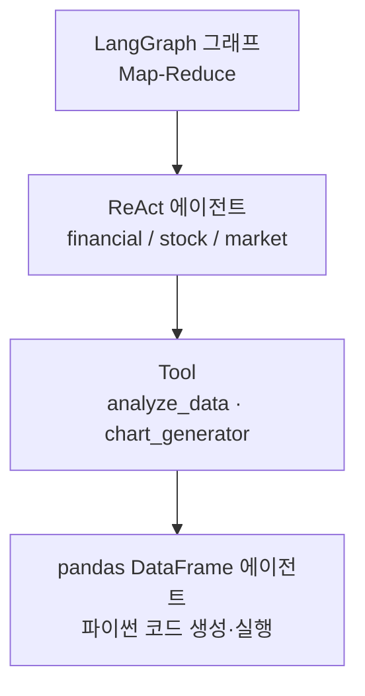

3년치 분기 재무제표를 33개 항목으로 뽑아 놓고 나면 다음 질문이 생긴다. 이걸 어떻게 LLM에게 넘기지. 텍스트로 직렬화해 프롬프트에 넣는 것이 자연스러워 보이는데, 그러면 컨텍스트를 통째로 먹고 숫자는 토큰을 거치며 뭉개진다.

답은 **넘기지 않는 것**이다. 도구가 데이터를 반환하지 않고 파일로 떨군 뒤 경로 한 줄만 알려주면, 계산은 pandas가 원본에서 하고 LLM은 결과만 읽는다. 이 규약 하나가 도구 인터페이스 전체를 바꾸고, 그 대가로 새 문제를 하나 데려온다. 이 글은 그 교환과, 세 분기 중 하나가 실패했을 때 결과물을 낼 것인가 말 것인가의 판단을 다룬다. [앞 편](/blog/ai-agent/send-map-reduce-report/)에서 그래프 구조는 완성했다.

## 용어 정리

앞 편들의 용어표에서 이 글이 쓰는 행만 추렸다.

| 약어 / 용어 | 원어 | 뜻 |
|---|---|---|
| Tool | Tool | LLM이 호출할 수 있게 스키마가 붙은 함수. `@tool` 데코레이터로 선언 |
| ReAct | Reasoning + Acting | LLM이 "생각 → 도구 호출 → 관찰"을 반복하는 에이전트 루프 |
| LCEL | LangChain Expression Language | `prompt \| llm \| parser` 형태로 체인을 조립하는 파이프 문법 |
| SEC | Securities and Exchange Commission | 미국 증권거래위원회. 상장사 공시 원문 제공 |
| 10-K / 10-Q / 8-K | — | 각각 SEC 연간보고서 / 분기보고서 / 수시보고서 |
| CIK | Central Index Key | SEC가 기업에 부여하는 10자리 고유번호 |
| Tavily · Polygon · yfinance | — | 순서대로 LLM용 검색 API, 금융 데이터 API, Yahoo Finance 주가 조회 라이브러리 |
| `recursion_limit` | — | 그래프가 밟을 수 있는 최대 스텝 수 |

## 계층 경계를 먼저 긋는다

도구 이야기를 하기 전에 도구가 어디에 놓이는지를 정해야 한다. 뉴스레터 파이프라인은 파일을 여섯으로 갈랐다.



| 파일 | 책임 | 반드시 지킨 경계 |
|---|---|---|
| `app.py` | Streamlit UI, 진행률, 에러 표시 | 그래프 로직 없음 — `create_newsletter_graph()`만 호출 |
| `graph.py` | 노드·엣지 배선 | 비즈니스 로직 없음. 조립만 41줄 |
| `utils/state.py` | 상태 스키마 + 리듀서 | 어디에도 의존하지 않음(모델 제외) |
| `utils/nodes.py` | 노드 함수 6종 + 프롬프트 | 그래프 구조를 모름 |
| `utils/tools.py` | 외부 API(Tavily) 래핑 | **상태를 모름. 순수 입출력** |
| `utils/models.py` | Pydantic 스키마 5줄 | 의존성 없음 |

**도식 여섯 노드와 표 여섯 행이 1:1로 대응한다.** 도식이 더하는 것은 의존 화살표뿐인데, 그 화살표가 표의 세 번째 열을 검증 가능하게 만든다 — `utils/tools.py`에서 나가는 화살표가 `models.py` 하나뿐이라는 사실이 "상태를 모른다"를 증명한다. 이 경계가 실제로 깨진 자리는 글 뒤쪽에서 다시 나온다.

리팩터링 흔적도 코드에 남아 있다. 루트의 `nodes.py`·`tools.py`·`models.py`는 초기 평면 배치본이고, `graph.py`가 실제로 임포트하는 것은 `utils/` 패키지다. 둘의 차이가 그대로 체크리스트다.

| 개선 항목 | 루트 초기본 | `utils/` 리팩터링본 |
|---|---|---|
| 임포트 | `from utils.state import State` (절대) | `from .state import State` (상대) — 패키지 이동에 강함 |
| `.env` 경로 | `load_dotenv()` — **실행 디렉토리 기준** | `Path(__file__).parent.parent / '.env'` — **파일 기준** |
| Pydantic 필드 | `theme: str` (설명 없음) | `Field(description=...)` — LLM이 읽는 스펙 |
| API 키 검증 | 없음 | 모듈 로드 시 키 부재를 `ValueError`로 즉시 실패 |

> 두 번째 행은 실무에서 자주 터진다. `load_dotenv()`는 현재 작업 디렉토리 기준이라 다른 폴더에서 앱을 실행하면 키를 못 읽는다.
>
> 증상이 헷갈리는 이유는 **개발자 머신에서는 항상 되기 때문**이다. 프로젝트 루트에서 실행하는 습관이 있으면 영원히 재현되지 않다가, 배포 스크립트가 다른 디렉토리에서 프로세스를 띄우는 순간 인증 실패로 나타난다. `__file__` 기준으로 루트를 계산하면 어디서 실행하든 같은 파일을 읽는다.

## 도구 카탈로그

기업분석 쪽은 도구를 성격으로 두 파일에 갈랐다. 정성 데이터와 정량 데이터는 반환 형태가 근본적으로 다르기 때문이다.

**정성 데이터 — 시장·경쟁·공시**

| 툴 | 데이터 소스 | 입력 | 출력 | 특징 |
|---|---|---|---|---|
| `get_latest_filing_content` | SEC EDGAR | `ticker` | `{form_type: 요약}` | 티커→CIK 변환 후 10-K/10-Q/8-K 최신본 수집, 폼별 요약 |
| `collect_competitor_news` | Polygon | `ticker`, `news_count` | `{경쟁사티커: [기사설명]}` | 관련기업 자동 조회 후 각각 뉴스 수집 |
| `collect_company_news` | Tavily | `company_name` | 문자열 | 최근 7일 |
| `collect_market_news` | Tavily | `sector` | 문자열 | 섹터 단위 |
| `scrape_webpages` | WebBaseLoader | `List[str]` URL | `<Document>` 태그 문자열 | 위 툴이 찾은 URL을 후속 심층 조회 |

**정량 데이터 — 재무·주가 + 분석/시각화**

| 툴 | 데이터 소스 | 반환 | 특징 |
|---|---|---|---|
| `fetch_stock_data` | yfinance + Polygon | **CSV 경로 문자열** | 자사 + 나스닥지수 + 경쟁사 종가를 한 DataFrame에 |
| `get_financial_data` | Polygon | **CSV 경로 문자열** | 분기별 재무제표 33개 항목 + 파생 지표 계산 |
| `analyze_data` | 저장된 CSV | 분석 텍스트 | 내부에서 pandas 에이전트 재호출 |
| `chart_generator` | 저장된 CSV | 차트 파일 (`./charts`) | 내부에서 pandas 에이전트 재호출 |

두 표의 「출력」 열을 나란히 보면 규약 차이가 드러난다. 정성 도구는 값을 돌려주고, 정량 도구는 **경로를 돌려준다.**

## 값이 아니라 경로를 반환한다



수집 도구는 데이터를 반환하지 않고 CSV로 떨군 뒤 경로만 알려준다 — `df.to_csv(csv_path)` 후 `return f"Stock file saved to {csv_path}"`.

| 이 규약의 이유 | 설명 |
|---|---|
| **컨텍스트 절약** | 3년치 분기 재무제표 33컬럼을 텍스트로 넣으면 컨텍스트를 다 먹는다. 경로는 한 줄 |
| **정밀도 보존** | LLM이 숫자를 토큰으로 읽고 다시 쓰면 반올림·누락이 생긴다. pandas가 원본을 직접 계산 |
| **도구 간 공유** | `analyze_data`와 `chart_generator`가 같은 파일을 읽는다. 재수집 불필요 |
| **재현성** | 중간 산출물이 파일로 남아 사후 검증 가능 |

**도식은 여섯 노드인데 표는 네 행이다.** 축이 다르다 — 도식은 데이터가 어디를 거쳐 가는지를, 표는 왜 그 경로를 택했는지를 말한다. 다만 도식에만 있고 표에 없는 것이 하나 결정적이다. **오른쪽 끝의 `combine`이 상태가 아니라 디렉토리를 스캔한다**는 화살표인데, 이것이 아래 산출물 오염의 원인이다. 이유 네 가지 중 어디에도 "디렉토리를 스캔해야 한다"는 없다.

> 이 규약의 대가는 **파일 경로가 전역 상태가 된다**는 것이다. 두 기업을 동시에 분석하면 `stock_data.csv`를 서로 덮어쓴다.
>
> 즉 컨텍스트 문제를 파일시스템으로 옮겨 푼 것이고, 파일시스템은 그래프가 관리하지 않는 영역이다. 실무 대응은 실행 ID를 경로에 넣거나(`./data/{run_id}/stock_data.csv`), 객체 스토리지 키를 상태에 담아 전달하는 것이다. 뒤쪽이 정석인 이유는 아래에서 다시 나온다.

### docstring이 곧 API 스펙

LLM은 함수 시그니처와 docstring만 보고 도구를 호출한다. docstring이 부실하면 인자를 틀린다. `collect_competitor_news`는 호출 예시까지 넣어 이를 방어한다.

```python
@tool
def collect_competitor_news(ticker, news_count):
    """주어진 티커 관련 회사들의 최신 증권 뉴스를 수집합니다.
    Args:
        news_count (int): number how many news will we collect. Basic Number is 10.
    Example:
        response = competitor_news("ticker":"AAPL", "news_count":10)
    """
```

원문에는 `Returns` 블록도 있어 반환이 "경쟁사 티커를 키로 하고 기사 설명 리스트를 값으로 갖는 dict"임을 명시한다. 네 요소가 각각 다른 실패를 막는다.

| 요소 | 왜 넣는가 |
|---|---|
| `Args` 타입·설명 | 인자 타입 오류 방지 |
| **`Basic Number is 10`** | 기본값 힌트. LLM이 값을 못 정할 때의 앵커 |
| `Returns` 구조 | 반환값을 어떻게 이어서 쓸지 판단 |
| **`Example`** | 실제 호출 형태와 응답 형태를 동시에 보여줌 |

> 네 요소 중 `Example`이 가장 강하다. **타입 설명은 규격을 말하지만 예시는 규격과 용법을 동시에 말한다.**
>
> 특히 반환 구조가 중첩됐을 때 차이가 크다. "dict of list"라는 서술을 읽고 모델이 상상하는 형태와 `{"MSFT": ["US stock....", ...]}`를 보고 아는 형태는 다르다. 다음 도구 호출에서 이 값을 어떻게 인용할지가 예시 한 줄로 정해진다.

## 도구 안에 또 에이전트가 있다

수집과 시각화만으로는 부족하다. 뽑아 온 데이터를 유의미한 정보로 만들려면 분석이 필요하고, 그 자리에 `create_pandas_dataframe_agent`가 들어간다.

```python
@tool
def analyze_data(query: str):
    """저장된 주식 데이터와 재무 데이터를 pandas_agent로 분석하고 질문에 답변합니다."""
    stock_df = pd.read_csv(DATA_DIR / "stock_data.csv")
    finance_df = pd.read_csv(DATA_DIR / "finance_data.csv")
    pandas_agent = create_pandas_dataframe_agent(
        ChatOpenAI(model="gpt-4o"),      # 바깥 오케스트레이션보다 상위 모델
        [stock_df, finance_df], verbose=True,
        agent_type=AgentType.OPENAI_FUNCTIONS,
        allow_dangerous_code=True,       # LLM 생성 코드를 exec 한다
        prefix=custom_prefix)            # "정확한 지표와 표로 인사이트를 뽑아라"
    return pandas_agent.run(query)
```

`chart_generator`도 같은 구조이며 프롬프트만 "차트를 만들어 `./charts`에 저장하라"로 다르다. 결과적으로 **도구 내부에 또 하나의 에이전트가 들어 있는 4층 구조**가 된다.



| 층 | 판단하는 것 | 모델 |
|---|---|---|
| 1. 그래프 | 어떤 관점들을 병렬로 돌릴지 | — (코드) |
| 2. ReAct | 어떤 도구를 어떤 순서로 부를지 | `gpt-4o-mini` |
| 3. Tool | (경계) 무엇을 분석할지 질의 전달 | — |
| 4. pandas 에이전트 | 어떤 파이썬 코드를 짜서 계산할지 | **`gpt-4o`** |

도식 네 층과 표 네 행이 대응하고, 표가 더하는 것은 마지막 열이다.

> 바깥 층은 싼 모델, 안쪽 계산 층은 비싼 모델을 쓴다. **오케스트레이션은 저렴하게, 정확도가 필요한 계산은 비싸게** — 의도적인 모델 티어링이다.
>
> 이 배분이 합리적인 이유는 실패의 대가가 층마다 다르기 때문이다. 2층이 도구 순서를 틀리면 한 번 더 돌면 되지만, 4층이 계산 코드를 틀리면 **틀린 숫자가 그대로 결과물에 실린다.** 그리고 3층이 판단을 하지 않는 순수 경계라는 점도 눈여겨볼 만하다 — 층을 넷으로 세는 것이 과해 보이지만 판단 주체는 셋이고 하나는 통로다.

> **`allow_dangerous_code=True`**는 LLM이 생성한 파이썬 코드를 **그대로 `exec`한다**는 뜻이다. 프롬프트 인젝션이 임의 코드 실행으로 직결된다.
>
> 로컬 CSV만 다루는 실습에서는 허용할 만하지만, 운영에서는 샌드박스 컨테이너·네트워크 차단·읽기전용 파일시스템이 전제되어야 한다. 이 파이프라인이 특히 위험한 이유는 앞 단계가 **웹에서 긁어 온 뉴스와 공시 원문을 컨텍스트에 넣는다**는 점이다. 외부 텍스트가 들어오는 경로와 코드가 실행되는 경로가 한 프로세스 안에 있다.

### SEC 공시 처리 — 대용량 원문을 다루는 법

`get_latest_filing_content`는 이 파이프라인에서 가장 긴 도구다. 처리 순서는 `ticker` → CIK 매핑 → 10자리 zero-fill → submissions API로 공시 목록 → 폼 필터 → 원문 HTML → 텍스트 추출 → LCEL 병렬 요약이다.

| 처리 | 구현 | 왜 |
|---|---|---|
| 폼별 최신 1건만 | `sort_values('date').drop_duplicates('form')` | 10-K/10-Q/8-K 전부 가져오면 양이 감당 안 됨 |
| 병렬 요약 | `chain = prompt \| llm \| StrOutputParser()` 후 `chain.batch(inputs)` | 폼 3종을 순차가 아닌 배치로. LCEL이 제공하는 병렬화 |
| 폼별 차등 프롬프트 | 10-K는 사업개요·위험요인, 10-Q는 전년 동기 대비, 8-K는 이벤트 당사자·금액 | 보고서 종류마다 중요한 정보가 다름 |
| 길이 제약 | `각 항목은 1-3문장으로 제한` | 요약 길이를 제어하지 않으면 다음 단계 컨텍스트가 터짐 |
| `User-Agent` 헤더 | 연락 가능한 이메일 명시 | SEC EDGAR는 이것이 없으면 차단한다 |

다섯 행 중 넷이 **양을 줄이는 처리**다. 대용량 원문을 다루는 도구의 일은 데이터를 가져오는 것이 아니라 무엇을 버릴지 정하는 것이다.

## 실패 모드 지도

| 실패 모드 | 원 코드의 대응 | 보강 대응 |
|---|---|---|
| 검색 0건 | 전건 실패 시 `ValueError`. 도구 레벨은 `{subtheme: []}` 반환 후 계속 | 부분 실패는 통과시키되 성공 분기 수를 상태에 기록하고, 임계치 미만이면 "데이터 부족" 명시 |
| 레이트리밋 | 없음 | 지수 백오프 + 지터, 동시 요청 세마포어 제한 |
| 분기 예외 | 없음 (예외 시 그래프 중단) | 노드를 `try/except`로 감싸 실패도 결과로 기록 |
| 컨텍스트 초과 | SEC 요약에 `1-3문장` 길이 제약 | 원문 청킹 후 계층 요약, 토큰 예산 사전 계산 |
| 루프 폭주 | `recursion_limit` 50 / 100 | 도구별 호출 횟수 상한, 타임아웃 |
| 산출물 오염 | 없음 | 아래 절 참조 |

여섯 행 중 넷이 왼쪽 열에 "없음" 또는 부분 대응이다. 데모와 운영을 가르는 것이 대체로 이 열이다.

### 부분 실패를 어떻게 마감하는가

핵심 원칙은 하나다. **분기 하나의 실패가 전체를 무너뜨리면 안 된다.** 세 관점 중 둘만 성공해도 결과물은 나와야 한다.

```python
def analyst_node(state: dict, agent, task_type: str):
    company = state["company"]
    try:
        result = agent.invoke({"messages": [("human", f"Analyze {task_type} aspects of {company}")]})
        content, status = result["messages"][-1].content, "ok"
    except Exception as e:
        content, status = f"{task_type} 분석 수집 실패: {e}", "failed"
    return {"analyses": [{"type": task_type, "status": status,   # 실패도 결과로 기록
                          "content": content, "timestamp": datetime.now().isoformat()}]}
```

앞 편의 Map 노드 계약 — 항상 원소 1개짜리 리스트를 반환한다 — 이 여기서 값을 한다. 실패해도 리스트 하나를 돌려주므로 팬인이 깨지지 않는다.

| 마감 정책 | 동작 | 언제 쓰나 |
|---|---|---|
| **전부 성공해야 마감** | 하나라도 실패면 산출물 미생성 | 누락이 오판을 부르는 경우 |
| **부분 마감 + 한계 명시** | 성공분만으로 작성, 실패 섹션에 사유 기재 | 대부분의 정보성 문서 |
| **재시도 후 부분 마감** | 실패 분기만 1~2회 재시도 후 위 정책 | 일시적 장애가 잦은 환경 |

세 번째 정책은 **일시적 실패와 영구적 실패를 가를 수 있을 때만** 성립한다. 구분하지 못하면 성공할 수 없는 분기를 계속 재시도하다 전체가 멈춘다. 같은 문제를 메시지 소비 쪽에서 푸는 방법 — 영구 실패를 줄 밖으로 빼내 뒤의 것들을 진행시키는 [DLQ 설계](/blog/backend-engineering/kafka-messaging-and-delivery-guarantees/) — 가 이 구분을 예외 타입으로 못 박는다.

> 두 번째가 기본값이어야 한다. **"주식 분석은 데이터 수집 실패로 제외됨"이라고 쓰는 것**이, 실패를 감춘 채 그럴듯한 문서를 내는 것보다 낫다.
>
> 후자가 더 나쁜 이유는 읽는 사람이 결함을 알 방법이 없기 때문이다. 세 관점 중 둘로 쓴 문서는 세 관점으로 쓴 문서와 겉모습이 같다. 자동 생성물에서 가장 위험한 상태는 틀린 것이 아니라 **결함이 보이지 않는 것**이고, 그래서 실패는 감추는 대상이 아니라 출력해야 할 항목이다.

### 산출물 오염 — 실제로 관찰된 사례

앞 편의 `combine_analyses`는 차트를 상태에서 받지 않고 `os.listdir('./charts')`로 디렉토리를 스캔한다. 그래서 이전 실행의 차트가 그대로 섞인다.

**노트북 실행 출력에 이 결함이 그대로 남아 있다.** Tesla를 분석한 문서인데 "주식 성과 분석" 섹션에 ``가 삽입되어 있다. 앞선 실습에서 만든 NVDA 차트 파일이 `./charts`에 남아 Tesla 산출물로 딸려 들어간 것이다.

| 완화책 | 방법 |
|---|---|
| 실행 격리 | `./charts/{run_id}/`로 실행마다 분리 |
| 상태 경유 | 차트 생성 도구가 파일 경로를 반환하고, 그 경로를 상태에 누적. Reduce는 상태만 읽음 |
| 시작 시 정리 | 그래프 진입 시 작업 디렉토리 초기화 |

> 두 번째가 정답에 가깝다. **파일시스템을 암묵적 채널로 쓰지 말고 상태를 명시적 채널로 쓴다** — 그래프 기반 시스템의 일반 원칙이다.
>
> 앞의 "값이 아니라 경로를 반환한다" 규약과 모순되지 않는다는 점이 중요하다. 데이터의 **본문**은 파일에 두되 그 **참조**는 상태에 담으라는 것이고, 이 구현이 어긴 것은 후자다. 경로를 반환은 했는데 아무도 상태에 담지 않아서 Reduce가 디렉토리를 뒤지는 수밖에 없었다. 세 번째(시작 시 정리)는 동시 실행에서 서로의 작업물을 지우므로 단독으로는 위험하다.

### 알려진 결함

| 위치 | 결함 | 영향 |
|---|---|---|
| `get_financial_data` | `Operating Income`에 `operating_expenses` 값을 넣음 (영업이익 자리에 영업비용) | 영업이익률이 전부 틀림. **파생 지표는 검증 테스트가 필수**라는 사례 |
| `AnalysisState` | `combined_report: str`로 선언했지만 실제로는 `AIMessage` 객체 저장 | 소비 측에서 `.content`를 붙여야 함. TypedDict는 런타임 검증을 안 한다 |
| `write_newsletter_section` | 이벤트 루프 안에서 `asyncio.run()` | 실행 컨텍스트에 따라 `RuntimeError` |
| `graph.py` | `sub_themes[i]` 고정 인덱스 | 서브테마 5개 미만이면 `IndexError` |
| `utils/tools.py` | 도구 함수에 `streamlit` 직접 의존 (`st.error`, `st.status`) | UI와 도구 계층 결합. 노트북·배치에서 재사용 불가 |

마지막 행이 이 글 첫머리의 계층 표와 정면으로 충돌한다. 표는 `utils/tools.py`가 "상태를 모름. 순수 입출력"이라고 선언했는데 실제 코드는 UI 라이브러리를 임포트한다. **도구가 Streamlit을 임포트하는 순간 그 도구는 Streamlit 밖에서 못 쓴다.** 진행상황 보고는 콜백이나 그래프 스트리밍으로 빼는 것이 맞다.

첫 행은 성격이 다르다. 나머지 넷은 코드를 읽으면 보이지만, 영업이익 필드 오매핑은 **결과가 정상적으로 나오고 숫자만 틀린다.** 파생 지표를 만드는 곳에 반드시 계산 검증이 붙어야 하는 이유다.

### 비용과 지연

| 항목 | 뉴스레터 | 기업분석 |
|---|---|---|
| LLM 호출 수 | 테마 1 + 섹션 5 + 편집 1 = **최소 7회** | ReAct 3개 × (도구 호출 N회 + 추론) + pandas 에이전트 다회 + 종합 1 = **수십 회** |
| 외부 API 호출 | Tavily 1 + 5 = 6회 | SEC · Polygon · yfinance · Tavily 다수 |
| 병렬화 이득 | 검색 5건 동시 + 섹션 5개 동시 | 관점 3개 동시 |
| 지배적 비용 | LLM 토큰 (원문 `raw_content` 포함) | pandas 에이전트의 상위 모델 호출 |

두 열의 자릿수가 다르다. 노드 안에 루프가 들어가는 순간 호출 수가 곱셈으로 늘어난다.

> **병렬화는 지연을 줄이지만 비용을 줄이지 않는다.** 오히려 동시 호출로 레이트리밋에 더 빨리 닿는다.
>
> 그래서 팬아웃 폭을 무제한으로 두면 안 되고, 세마포어로 동시 실행 수를 제한하는 것이 표준이다. 앞 편의 `Send()`가 갈래 수를 런타임에 정한다는 것은 곧 **동시 호출 수도 런타임에 정해진다**는 뜻이라, 동적 팬아웃일수록 이 제한이 필요하다. 경쟁사가 12곳인 기업을 분석하면 12개 분기가 동시에 API를 때린다.

---

세 편에 걸쳐 만든 것은 사람이 없는 시간에 스스로 도는 파이프라인이다. 갈래를 만들고, 결과를 모으고, 실패를 숨기지 않고 마감했다. 그런데 이 에이전트가 하는 일은 결국 **읽고 쓰는 것**뿐이다 — 검색하고 계산하고 문서를 만든다.

권한을 한 칸 더 주면 이야기가 달라진다. 코드를 짜 주는 데서 멈추지 않고 **그 코드를 실행해 보고 틀리면 고치는** 에이전트는, 성공하면 훨씬 쓸모 있지만 실패하면 파일을 지운다. 이 글에서 지나친 `allow_dangerous_code=True` 한 줄이 그 세계의 입구다. [다음 시리즈](/blog/ai-agent/dynamic-rag-code-agent/)에서 코딩 에이전트를 뜯으면서, 근거를 어디서 가져올지 고르는 라우팅부터 시작한다.

`Send()`가 조건부 엣지와 무엇이 다른지, 분기 하나가 실패했을 때 무엇을 남겨야 하는지, 선별을 LLM에 맡길지 고정할지는 [멀티에이전트 Q&A](/blog/ai-agent/ai-agent-qna-multi-agent/)에 문답으로 정리돼 있다.
