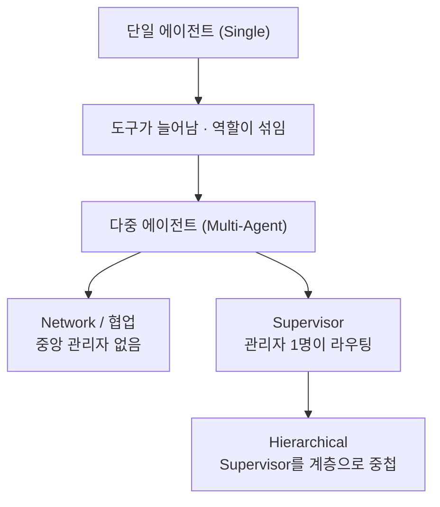
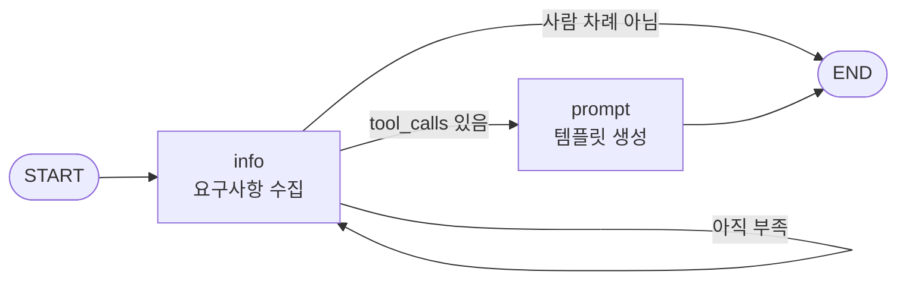
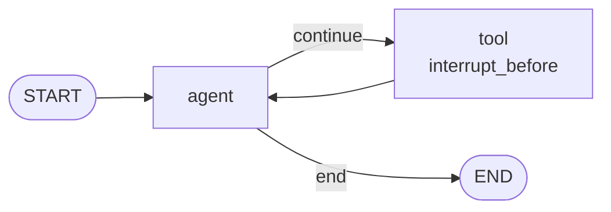
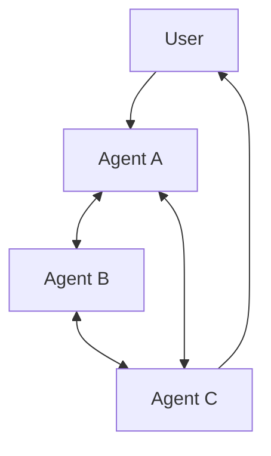
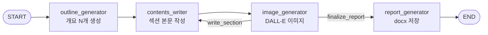
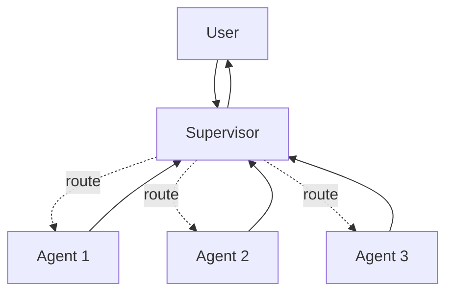
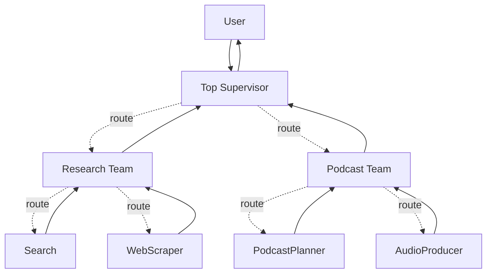

"다중 에이전트 리포트 생성기"라는 이름의 예제를 열어 보면 코드에 **Supervisor가 없다.** 노드 네 개가 고정 순서로 연결되고 섹션 카운터로 루프백하는 정적 파이프라인이다. 그런데 이 예제가 잘못 만들어진 것이 아니다. 쪼갠 이유가 "라우팅 판단이 필요해서"가 아니라 **"한 번에 다 못 써서"**였고, 그 목적에는 이 구조가 맞다.

에이전트를 몇 개로 쪼갤 것인가, 그리고 쪼갠 뒤 누가 다음 순서를 정하는가 — 멀티에이전트 설계는 결국 이 두 질문의 조합이다. 이 글은 첫 번째 질문을 다룬다. 단일 에이전트로 충분한 경계가 어디까지인지 두 사례로 확인하고, 넘어섰을 때 고를 수 있는 토폴로지 셋을 정리한다. [앞 시리즈](/blog/ai-agent/groundedness-cost-limits/)에서 판정기를 넷까지 늘렸지만 판단 주체는 여전히 하나였다.

## 용어 정리

| 약어 / 용어 | 원어 | 뜻 |
|---|---|---|
| State | Graph State | 그래프 전체가 공유하는 데이터 구조. `TypedDict`로 선언 |
| Reducer | 리듀서 | 같은 키에 새 값이 들어올 때 **덮어쓸지 누적할지** 정하는 함수 |
| Node | 노드 | 상태를 입력받아 상태 일부를 반환하는 함수. 에이전트 1개 = 노드 1개가 기본 |
| Subgraph | 서브그래프 | 컴파일된 그래프를 다른 그래프의 노드로 끼워 넣은 것. Hierarchical의 핵심 |
| ReAct | Reasoning + Acting | 생각 → 도구 호출 → 관찰을 반복하는 루프. `create_react_agent`가 이 루프를 완성해 준다 |
| Structured Output | 구조화 출력 | Pydantic 스키마를 강제해 LLM 출력을 파싱 가능한 객체로 받는 것 |
| Supervisor | — | 하위 에이전트에게 일을 배정하고 결과를 회수하는 관리자 노드 |
| Hierarchical | — | Supervisor를 여러 층으로 중첩한 구조 |
| Network | Network / Collaboration | 중앙 관리자 없이 에이전트끼리 서로 넘겨주는 구조 |
| HITL | Human In The Loop | 위험한 실행 직전 사람 승인을 받는 것. `interrupt_before` |
| Checkpointer | — | 상태를 저장해 중단·재개를 가능하게 하는 저장소. [앞 시리즈](/blog/ai-agent/langgraph-checkpointer-hitl/) 참조 |
| `recursion_limit` | — | 그래프가 실행할 수 있는 **최대 스텝 수**. 무한 루프 방어선 |
| REPL | Read-Eval-Print Loop | 코드를 즉시 실행하는 환경. `PythonREPLTool` |
| Fan-out / Fan-in | — | 작업을 여러 갈래로 퍼뜨렸다가 다시 모으는 패턴 |

## 네 구조의 계보



핵심은 **F가 E의 확장**이라는 점이다. Hierarchical은 Supervisor를 갖는 여러 팀을 하위 팀으로 구성해 하나의 조직 시스템을 만든 것이지, 별개의 발명이 아니다. 같은 넷을 축별로 펼치면 여덟 줄이 된다.

| 항목 | 단일 에이전트 | Network / 협업 | Supervisor | Hierarchical |
|---|---|---|---|---|
| **다음 순서를 정하는 주체** | 조건부 엣지 함수(코드) | 각 에이전트 자신 | Supervisor LLM | 상위 Supervisor → 팀 Supervisor |
| **LLM 라우팅 호출** | 없음 | 에이전트마다 내장 | 매 턴 1회 추가 | 매 턴 계층 수만큼 추가 |
| **상태 공유 범위** | 단일 State | 단일 State 공유 | 단일 State 공유 | **팀별 State 분리** |
| **대표 사례** | 프롬프트 생성기 / 검색+코드실행 | 리포트 생성기 | 주식 종목 평가 | 문서 기반 팟캐스트 |
| **적정 규모** | 도구 2~5개 | 에이전트 2~4개 | 워커 3~6개 | 팀 2~4개 × 팀당 2~4명 |
| **예측 가능성** | 높음 | 낮음 | 중간 | 중간 |
| **비용** | 낮음 | 중간 | 중상 | 높음 |
| **디버깅 난도** | 낮음 | **높음** | 중간 | 중상(팀 단위로 격리되어 오히려 나음) |

**도식은 여섯 노드인데 표는 여덟 행에 네 열이다.** 도식에만 있는 것은 "도구가 늘어남·역할이 섞임"이라는 **전이 조건**이고, 표에만 있는 것은 여덟 개 비교축이다. 두 그림이 다른 질문에 답한다 — 도식은 "왜 다음 단계로 넘어가는가"를, 표는 "넘어가면 무엇이 달라지는가"를 말한다.

> 표 마지막 행이 직관과 어긋나는 자리다. **Hierarchical의 디버깅 난도가 Network보다 낮다.**
>
> 층이 많으면 어려울 것 같지만, Network는 누가 언제 누구에게 넘겼는지가 어디에도 기록되지 않는 반면 Hierarchical은 팀 경계에서 상태가 잘려 있어 문제 범위를 팀 단위로 좁힐 수 있다. **복잡도와 디버깅 난도는 같은 축이 아니다.** 구조가 없는 것이 층이 많은 것보다 나쁘다.

## 단일 에이전트로 충분한 경계

먼저 쪼개지 않아도 되는 선을 그어야 한다. 아래 일곱 신호 중 오른쪽에 해당하는 것이 쌓이면 그때가 경계다.

| 신호 | 단일로 충분 | 쪼개야 함 |
|---|---|---|
| **시스템 프롬프트 길이** | 한 화면에 들어옴 | 역할 설명이 서로 충돌하기 시작 |
| **도구 개수** | 2~5개, 성격이 유사 | 6개 이상이거나 성격이 완전히 이질적 |
| **도구 선택 정확도** | LLM이 헷갈리지 않음 | 엉뚱한 도구를 부르는 빈도가 올라감 |
| **작업 순서** | 고정이거나 자명함 | 상황에 따라 순서가 달라짐 |
| **출력 토큰 한계** | 한 번에 다 쓸 수 있음 | 한 응답에 담기 어려움 → 섹션 분할 필요 |
| **권한·위험 등급** | 전부 동일 | 일부만 사람 승인이 필요함 |
| **컨텍스트 오염** | 대화가 짧음 | 앞 단계 원문이 뒤 단계 판단을 흐림 |

**한 줄 기준**: 프롬프트에 "만약 A라면 ~하고, B라면 ~하라"가 **세 개 이상 쌓이면** 그건 이미 여러 에이전트다.

> 일곱 신호 중 **도구 개수만 정량 기준**이고 나머지 여섯은 정성이다. 그래서 "몇 개부터 쪼개나요"라는 질문에 숫자로 답하면 대개 틀린다.
>
> 실제로 아래 두 사례는 도구가 이질적인데도 쪼개지 않았다. 기준은 도구의 종류가 아니라 **책임의 분리 필요성**이다.

### 사례 ① 프롬프트 생성기 — 툴 콜을 상태 전이 트리거로 쓴다

사용자와 대화하며 프롬프트 요구사항을 캐묻고, 정보가 다 모이면 프롬프트를 생성한다.



설계 포인트는 하나다. **정보 수집 완료 판정을 LLM 자연어가 아니라 툴 콜 발생 여부로 판단한다.**

```python
class PromptInstructions(BaseModel):
    """Instructions on how to prompt the LLM."""
    objective: str
    variables: List[str]
    constraints: List[str]
    requirements: List[str]

llm = ChatOpenAI(model="gpt-4o-mini", temperature=0)
llm_with_tool = llm.bind_tools([PromptInstructions])

def get_state(state) -> Literal["prompt", "info", "__end__"]:
    messages = state["messages"]
    # 툴 콜이 찍혔다 = 4개 필드가 다 모였다 = 다음 단계로
    if isinstance(messages[-1], AIMessage) and messages[-1].tool_calls:
        return "prompt"
    # 마지막이 사람 발화가 아니다 = 사용자 입력 대기
    elif not isinstance(messages[-1], HumanMessage):
        return END
    return "info"

workflow = StateGraph(State)
workflow.add_node("info", info_chain)
workflow.add_node("prompt", prompt_gen_chain)
workflow.add_conditional_edges("info", get_state)
workflow.add_edge("prompt", END)
workflow.add_edge(START, "info")
graph = workflow.compile(checkpointer=memory)
```

`bind_tools`로 붙인 Pydantic 모델은 **실행할 함수가 아니라 "완료 신호 겸 스키마"**로 쓰였다. 실행 함수가 아예 없고, `ToolNode`도 그래프에 없다.

> [앞 시리즈에서](/blog/ai-agent/langgraph-tool-react-loop/) `bind_tools`와 `ToolNode`가 둘 다 필요하다고 했는데, 여기서는 일부러 하나만 쓴다. 도구를 **실행 목적이 아니라 상태 전이 트리거**로 쓰기 때문이다.
>
> 이 트릭이 유용한 이유는 "정보가 충분한가"라는 판단이 자연어로는 불안정하기 때문이다. "모두 모였습니다"라는 문장을 문자열로 검사하면 표현이 조금만 달라져도 깨진다. **필수 필드를 가진 스키마를 채울 수 있는가**로 바꾸면 판단이 구조화된 값이 된다.

### 사례 ② 웹 검색 + 코드 실행 — 이질적인 도구를 한 에이전트가 쓴다

Tavily 웹 검색과 Python REPL을 **한 에이전트**가 둘 다 쓴다. 쪼개지 않았다.



```python
workflow.add_conditional_edges("agent", should_continue,
                               {"continue": "tool", "end": END})
workflow.add_edge("tool", "agent")

memory = MemorySaver()
# 핵심: 도구 실행 직전에 멈춰 사람 승인을 받는다
graph = workflow.compile(checkpointer=memory, interrupt_before=["tool"])
```

근거는 명확하다 — Python REPL을 로컬 환경에서 실행하면 사용자의 PC에 위협이 될 수 있으므로, 인터럽트 기능으로 사용자 확인을 받는다.

**여기서 배울 것**: 도구가 이질적(검색 vs 코드 실행)이어도 **작업 목표가 하나면 단일로 충분하다.** 이 사례에서 분리가 필요했던 것은 에이전트가 아니라 **위험 등급**이었고, 그건 `interrupt_before` 하나로 해결됐다.

승인 게이트가 실제로 도는 프로토콜은 세 단계다.

| 단계 | 무슨 일이 벌어지나 |
|---|---|
| 1 | 실행 → `tool` 노드 직전에 멈춤 |
| 2 | 사람이 `get_state`로 다음 노드와 인자를 확인 |
| 3 | 입력 자리에 `None`을 넣어 재개 |

```python
async for chunk in graph.astream(None, thread, stream_mode="updates"):
    ...
```

> `interrupt_before`가 성립하려면 **checkpointer가 필수**다. 중단 시점의 상태를 어딘가에 저장해야 재개할 수 있기 때문이다.
>
> 이 인과가 위 `compile` 한 줄에 두 인자가 나란히 붙어 있는 이유다. 인터럽트를 걸었는데 안 멈춘다면 대부분 체크포인터를 함께 주지 않은 것이다. 메커니즘의 상세는 [앞 시리즈의 HITL 편](/blog/ai-agent/langgraph-checkpointer-hitl/)에 상태 전이도와 함께 정리돼 있다.

## 멀티에이전트 토폴로지 3종

### Network / 협업 — 중앙 관리자 없음



각 에이전트가 **자기 판단으로** 다음 사람에게 넘긴다. 관리자가 없으니 라우팅 비용이 없지만, 누가 언제 멈출지 아무도 모른다.

앞서 언급한 리포트 생성기가 이 계열로 분류되는 사례인데, 실제 코드에는 관리자도 자율 위임도 없다.



```python
def should_continue_writing(state: State):
    if state["current_section"] <= state["total_sections"]:
        return "write_section"
    else:
        return "finalize_report"

graph_builder.add_conditional_edges(
    "image_generator",
    should_continue_writing,
    {"write_section": "contents_writer",
     "finalize_report": "report_generator"}
)
```

설계 이유가 명시돼 있다 — **LLM의 제한된 출력 토큰을 고려해 섹션별로 나눠 작성하는 것이 이 그래프의 핵심**이다.

> 즉 **라우팅 판단이 필요해서 쪼갠 게 아니라, 한 번에 다 못 써서 쪼갠 것**이다. 순서가 이미 정해져 있다면 LLM 라우터는 낭비다.
>
> 이런 경우는 멀티에이전트가 아니라 **워크플로우**로 부르는 것이 정확하며, 조건부 엣지로 충분하다. 이름을 정확히 붙이는 것이 실무에서 값을 하는 이유는, "멀티에이전트를 도입했다"고 부르는 순간 라우팅·오염·비용 같은 멀티에이전트의 문제를 없는데도 걱정하게 되기 때문이다.

문맥 유지 장치도 눈여겨볼 만하다 — 이전 섹션 본문을 전부 프롬프트에 다시 넣는다.

```python
previous_sections_content = []
for i in range(1, state['current_section']):
    section_key = f"section{i}"
    if section_key in state["section_content"]:
        previous_sections_content.append(
            f"Section {i}:\n{state['outline'][section_key]}\n{state['section_content'][section_key]}"
        )
previous_sections = "\n\n".join(previous_sections_content)
```

이 방식은 섹션 수에 대해 **컨텍스트가 O(N²)로 증가한다.** 섹션 10개면 마지막 섹션은 앞의 9개를 전부 읽는다. 출력 토큰 한계를 피하려고 쪼갠 것이 입력 토큰 폭증으로 돌아오는 구조다. 실무에서는 이전 섹션의 **요약본**만 넘기는 것이 정석이다.

### Supervisor — 관리자 1명이 라우팅



Supervisor 패턴의 정의 — 관리자가 사용자와 상호작용하며 지시를 받고, 적합한 에이전트에게 작업을 할당하고, 에이전트는 완료 후 관리자로 되돌아온다 — 는 [멀티에이전트 확장 편](/blog/rag/langgraph-parallel-multiagent/)에 정리돼 있다. 여기서 확장할 것은 **Network와 갈리는 지점**이다.

> **모든 워커는 반드시 Supervisor로 되돌아온다.** 이것이 결정적 차이다.
>
> 그리고 그 되돌아옴이 종료 판정을 가능하게 한다. Network에서는 "이제 끝났는가"를 물을 대상이 없지만, Supervisor 구조에서는 매 턴 관리자가 그 질문을 받는다. **중앙 통제의 진짜 값어치는 배정이 아니라 종료 판정에 있다.**

### Hierarchical — Supervisor의 중첩



작동 원리는 Supervisor와 동일하고 층만 늘어난다. 전체 Supervisor가 각 팀에 명령을 하달하고, 각 팀의 Supervisor가 하위 에이전트에 하달한다.

이 도식이 [멀티에이전트 확장 편의 계층 도식](/blog/rag/langgraph-parallel-multiagent/)과 노드 수가 같지만 겹치는 것은 셋(ResearchTeam·WebScraper·Search)뿐이다. 나머지 다섯 — `User`, `Top Supervisor`, `PodcastTeam`, `PodcastPlanner`, `AudioProducer` — 이 여기에만 있는데, 그중 둘이 중요하다. **`User`와 `Top Supervisor` 사이의 양방향 화살표**가 그것이다. 계층 구조에서도 사용자와 대화하는 주체는 최상위 하나이고, 팀은 사용자를 모른다.

### 토폴로지 선택 기준

| 기준 | Network / 협업 | Supervisor | Hierarchical |
|---|---|---|---|
| **중앙 통제** | 없음 | 있음(1층) | 있음(2층 이상) |
| **라우팅 LLM 호출** | 0 (각자 판단) | 스텝당 1 | 스텝당 계층 수 |
| **종료 판정** | 각자 판단 → 불안정 | Supervisor가 `FINISH` | 각 층이 `FINISH` |
| **상태 격리** | 없음 | 없음 | **있음(팀별 State)** |
| **에이전트 추가 비용** | 낮음(엣지만 추가) | 낮음(members 배열 추가) | 중간(팀 서브그래프 조립) |
| **워커 수가 늘 때** | 연결 수가 N²로 폭증 | 라우터 프롬프트가 비대해짐 | 팀으로 묶어 흡수 |
| **적합 상황** | 에이전트 2~3개, 핑퐁형 협업 | 역할이 뚜렷한 워커 3~6개 | 이질적 도메인 팀 2~4개 |
| **부적합 상황** | 종료 조건이 애매한 작업 | 워커 10개 이상 | 팀이 1개뿐일 때(과설계) |

여섯 번째 행이 선택을 실질적으로 가른다. **셋은 규모가 커질 때 각각 다른 곳에서 무너진다** — Network는 연결 수에서, Supervisor는 프롬프트 길이에서, Hierarchical은 층당 호출 비용에서. 어느 벽에 먼저 부딪힐지가 곧 선택 기준이다.

> **실무 선택 순서**: 단일 → 조건부 엣지 워크플로우 → Supervisor → Hierarchical. **한 단계씩만 올린다.**
>
> 처음부터 Hierarchical로 시작하면 디버깅 불가능한 시스템이 된다. 그리고 두 번째 칸(조건부 엣지 워크플로우)이 자주 통째로 건너뛰어진다 — 리포트 생성기가 정확히 그 칸에 있는 구조이고, 순서가 고정된 작업의 대다수가 여기서 끝난다.

---

여기까지가 "쪼갤 것인가"의 판단이다. 쪼개기로 했다면 다음 질문은 **누가 다음 순서를 정하는가**이고, 실무에서 실제로 쓰이는 답은 Supervisor 하나다.

그런데 관리자를 한 명 세우는 순간 새 문제가 셋 따라온다. 관리자가 이미 끝난 워커를 또 부르고, `FINISH`를 고르지 않아 A→B→A→B를 반복하고, 매 스텝 누적된 메시지 전량이 라우팅 프롬프트에 들어가 호출당 단가가 계속 오른다. [다음 편](/blog/ai-agent/supervisor-pattern-cost/)에서 Supervisor를 코드로 조립하고 그 세 가지 대가를 정면으로 다룬다.
