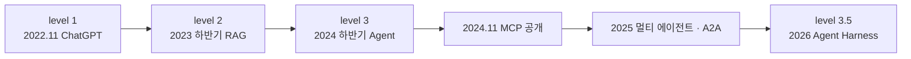
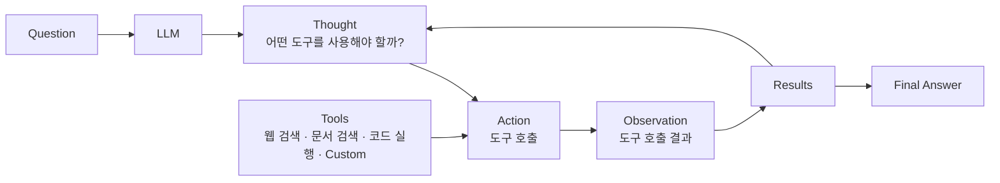
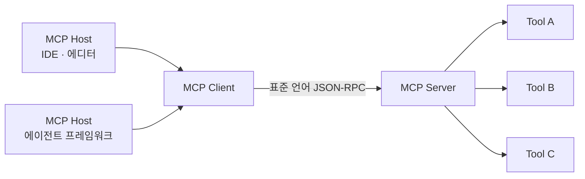
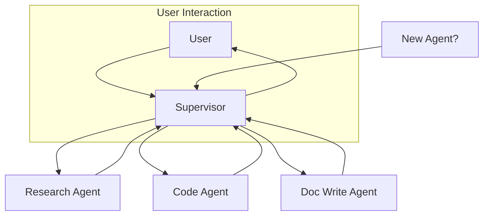
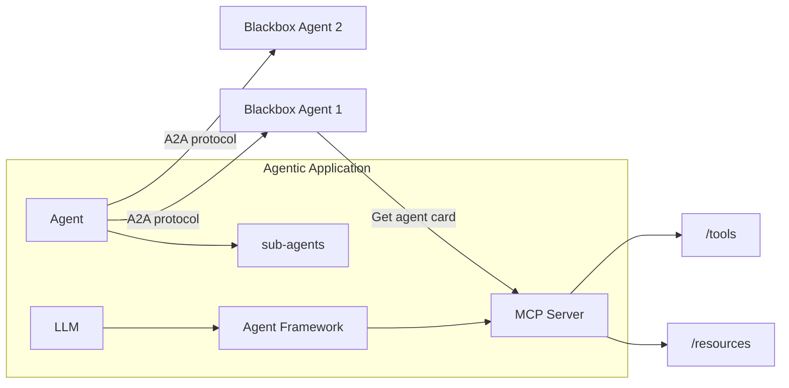

"왜 지금 에이전트인가"에 기술적 이유로 답하면 대개 설득되지 않는다. 도구 호출도, 다단계 실행도 몇 년 전부터 가능했기 때문이다. 이 시기의 자료들이 기술이 아니라 **채택 곡선과 생산성 지표**에서 논증을 시작하는 이유가 거기에 있다.

이 글은 그 논증을 순서대로 편다. 플랫폼 시프트마다 절반으로 줄어든 침투 기간, 15년째 자리를 지킨 1인당 생산성, 그리고 그 둘 사이에 놓인 하나의 진단 — **에이전트 확산의 최대 병목은 모델이 아니라 도구 개발이었다**는 것. 표준화가 왜 그토록 빨리 자리를 잡았는지는 이 진단에서 따라 나온다. [앞 편](/blog/ai-agent/agent-harness-architecture/)이 하네스의 내부 구조를 봤다면 이 글은 그 구조가 놓인 바깥의 판을 본다.

여기까지가 기술과 시장의 이야기이고, 그 다음 [조직 적용 편](/blog/ai-agent/enterprise-ai-adoption-actions/)에서 실제 도입 사례와 역할 재정의로 넘어간다.

> 이 글은 **2026년 2월 자료를 정리한 것**이다. 거시 지표는 2023년 조사분을 인용한 것이고, 생태계 수치와 제품 상태는 2025~2026년 시점의 것이다. 등장하는 회사 사례와 수치는 모두 원 자료의 것이다.

## 용어 정리

앞 편의 용어표에서 이 글이 쓰는 행만 추리고, 표준·프로토콜 용어를 더했다.

| 용어 | 원어 / 표기 | 뜻 |
|---|---|---|
| RAG | Retrieval-Augmented Generation | 검색으로 증강된 생성. 2023년 하반기 부상, 2026년에는 "선택지 중 하나"로 위상이 바뀐다 |
| MCP | Model Context Protocol | 2024년 11월 공개된 도구 연결 표준(JSON-RPC). "웹 시대의 API = 에이전트 시대의 MCP" |
| A2A | Agent-to-Agent | 2025년 4월 9일 공개된 에이전트 간 협업 프로토콜. Agent Card로 서로를 발견한다 |
| ReAct | Reasoning + Acting | Thought → Action → Observation 루프. 에이전트 아키텍처의 원형 (arXiv 2210.03629) |
| Agent Harness | Agent Harness | 모델을 감싸 장기 실행 작업을 신뢰성 있게 관리하는 시스템. 정의는 [앞 편](/blog/ai-agent/agent-harness-architecture/) |
| Supervisor | Supervisor | 지시를 받아 적합한 에이전트에 작업을 할당하고 결과를 회수하는 조정자. 정의는 [멀티에이전트 확장 편](/blog/rag/langgraph-parallel-multiagent/) |

## 연표에 붙은 레벨 번호

원 자료는 목차 자체를 연표로 제시하고, 각 단계에 레벨을 붙였다.

| 날짜 | 주요 트렌드·이벤트 | 레벨 |
|---|---|---|
| 2022.11.30 | ChatGPT 출시 (GPT-3.5) | **level 1** |
| 2023.03.14 | GPT-4 및 플러그인 지원 | |
| 2023.03~06 | API·iOS 앱·웹 브라우징 등 생태계 확장 | |
| 2023년 하반기 | RAG 구조 부상 | **level 2** |
| 2024년 상반기 | RAG 고도화 | |
| 2024년 하반기 | Agent | **level 3** |
| 2024.11 | MCP 공개 | |
| 2025.04 | 주요 어시스턴트 제품군 MCP 지원 | |
| 2025.04.09 | A2A 프로토콜 공개 | |
| 2025년 | MCP · Agentic AI · 멀티 에이전트 | |
| 2026년 | **Agent Harness** | **level 3.5** |

**표는 열한 행인데 도식은 여섯 마디다.** 도식이 레벨이 부여된 지점과 프로토콜 사건만 남겼기 때문이고, 표에만 있는 다섯 항목은 GPT-4·플러그인·생태계 확장·RAG 고도화·주요 제품군의 MCP 지원처럼 **레벨을 올리지 않은 사건들**이다. 도식만 보면 계단이 여섯 개인 깔끔한 상승으로 읽히지만, 표를 보면 그 사이가 촘촘히 채워져 있고 레벨은 드물게만 올라간다. 두 표현을 다 두는 이유가 여기 있다 — 도식은 도약을, 표는 밀도를 말한다.

> **왜 4가 아니라 3.5인가.** 완전 자율(레벨 4~5)이 아니라 **사람이 계획을 승인하고 에이전트가 길게 실행하는 중간 단계**라는 뜻이다.
>
> 이 겸손한 번호가 오히려 신뢰를 준다. 같은 자료가 자율주행 0~5단계를 빌려 현재 위치를 3단계(조건부 자동화)로 표시하는데, 두 표기가 같은 말을 한다 — **운전자가 시스템의 요청 시 개입한다.** 조직이 지금 설계해야 하는 것은 사람이 상시 감시하는 2단계도, 손을 떼는 4단계도 아니라 "시스템이 요청할 때 사람이 개입하는 절차"다. 승인 게이트를 어디에 둘지가 곧 아키텍처가 된다.

## 거시 지표 넷

이 절의 모든 그래프는 2023년 산업 리포트를 출처로 하며, 자동화 시나리오만 별도 컨설팅 보고서다. **2023년 기준이라는 시점이 이 절 전체에 걸린 조건이다.**

**① 채택 속도 — 매 플랫폼 시프트마다 두 배씩 빨라졌다.** 미국에서 50% 사용자 침투에 도달하기까지 걸린 연수다.

| 기술 | 50% 침투 소요 연수 |
|---|---|
| PC | 20년 |
| 인터넷 | 12년 |
| 모바일 | 6년 |
| **생성형 AI** | **3년** (그래프에는 "?" 병기) |

마지막 행에 물음표가 붙어 있다는 사실이 중요하다. 20 → 12 → 6은 관측값이고 3은 추정이라, 네 값은 같은 강도의 근거가 아니다. 나란히 놓으면 그 차이가 지워진다.

**② 15년간 정체된 생산성.** 2006~2019년 구간에서 AI 진단·음성인식·이미지 인식이 등장했음에도 연평균 생산성 증가율은 2.8%에서 1.3%로 둔화됐고, 선진국 생산성 성장에 미친 기여는 미미했다.

**③ 근로자 1인당 생산성 — 매출 $1M당 직원 수.** S&P 500 기업 기준, 인플레이션 조정값이다.

| 연도 | 매출 $1M당 직원 수 |
|---|---|
| 1986 | 7.8 |
| 2000 | 6.4 |
| 2008 | 5.1 |
| 2019 | 5.3 |
| 현재 | 5.1 |
| AI 적용 시 | **<3?** |

그래프에는 "PC와 인터넷이 만든 약 35% 생산성 개선"이라는 주석이 붙어 있다. **개선은 1986→2008 구간에서 끝났고 그 이후는 정체**라는 것이 이 슬라이드의 논지다. 마지막 행도 물음표가 붙은 예측이지 실측이 아니다.

**④ 콜센터 챗봇 도입 — 비용과 만족도.** 한 금융 기관의 세 지표다.

| 지표 | 사람 | AI | 변화 |
|---|---|---|---|
| 상담 건당 비용 | $2.58 | $0.13 | **-95%** |
| 응답 시간 중앙값 | 45분 이상 | 1분 | 대폭 단축 |
| 고객 만족도 중앙값 | 55% | 69% | 상승 |

> **이 표의 핵심은 세 번째 행이다.** 만족도가 떨어지지 않고 오히려 올랐다.
>
> "비용 절감과 고객 경험 악화는 함께 온다"는 통념을 데이터로 반박하는 자리라서, 비용 절감 논의에서 가장 자주 부딪히는 반대 논거를 미리 무력화한다. 다만 이 값에는 조건이 둘 붙어 있다 — **한 기관의 사례이고 2023년 리포트 인용**이다. 조건이 떨어져 나가면 "AI를 넣으면 만족도가 오른다"는 일반 명제로 왜곡된다.

자동화 도입 시나리오는 국가별로 갈린다. 임금 상승으로 경제성을 빨리 확보하는 선진국에서 더 빠르게 진행될 가능성이 높다는 것이 요지이고, 낙관·비관 시나리오의 50% 도달 시점은 2030~2040년대와 2050~2070년대로 크게 벌어진다. **같은 자료 안에서도 20~30년의 폭이 있다**는 뜻이라, 이 그래프를 근거로 특정 시점을 못 박는 인용은 성립하지 않는다.

## RAG가 답한 것

병목 사슬의 두 번째 칸이다. 네 가지 접근을 네 지표로 비교한 막대그래프가 이 절의 근거다.

| 지표 | 상대적 순위 (막대 높이 기준) |
|---|---|
| 구축 비용 | 프롬프트 엔지니어링 < RAG < PEFT < **전체 파인튜닝(최대)** |
| 환각 감소 효과 | 프롬프트 엔지니어링 < PEFT ≈ 전체 파인튜닝 < **RAG(최대)** |
| 최신 정보 반영 | PEFT ≈ 전체 파인튜닝 < 프롬프트 엔지니어링 < **RAG(최대)** |
| 과정의 투명성 | PEFT ≈ 전체 파인튜닝 < 프롬프트 엔지니어링 < **RAG(최대)** |

네 지표 중 셋에서 RAG가 최상위이고 비용은 두 번째로 낮다. **비용 대비 환각 억제·최신성·투명성 세 박자를 동시에 잡는 유일한 선택지**라는 것이 이 그래프의 주장이며, 파인튜닝은 비용이 최대인데 세 지표 모두 열위다. 단, 이 표는 막대 높이에서 읽은 **상대 순위**이지 수치가 아니다.

## 에이전트의 진짜 병목

ReAct 논문 구조가 에이전트 아키텍처의 원형으로 제시된다.

이 루프 자체는 새롭지 않다. 문제는 `Tools` 노드에 무엇을 꽂느냐였다. 자료가 든 예는 평범한 업무 지시 하나다 — "OOO에 대해 웹 검색해 줘 / 조사한 내용을 보고서 형식으로 메일 발송해 줘 / 오후 6시 미팅 일정에 추가해 줘." 이 세 줄을 실행하려면 메일·캘린더·화상회의에 각각 붙어야 하고, 슬라이드는 세 갈래 모두에 같은 빨간 글씨를 반복해 붙였다 — **"개발 필요"**.

> **에이전트 제작의 최대 병목은 도구 개발이었다.** 그리고 이 병목이 풀리면 에이전트가 늘고, 에이전트가 늘면 토큰 소비가 몇 배가 된다.
>
> 이 두 문장을 붙여 읽으면 표준화가 왜 그렇게 빨리 자리 잡았는지가 설명된다. MCP는 자선사업이 아니다. 모델 제조사에게 도구 병목 해소는 **자기 수요를 키우는 투자**이고, 개발자에게는 연동 비용 절감이다. 인센티브가 한 방향으로 정렬된 지점이라 확산이 빨랐다. 이 구조를 이해하면 앞으로 어떤 표준이 더 나올지도 같은 논리로 예측할 수 있다 — 다음 병목이 어디에 있고, 그것을 푸는 것이 누구의 매출을 늘리는가.

## 표준이 자리 잡은 뒤의 생태계

한 글로벌 레지스트리 화면 기준 수치다.

| 항목 | 값 |
|---|---|
| 총 연결 가능 capability | 4,289 |
| Featured 서버 | 1,125 |
| 웹 검색 카테고리 | 114 |

주요 서버의 사용 규모는 다음과 같았다.

| 서버 | 사용량 | 유형 |
|---|---|---|
| Sequential Thinking | 656.49k | Remote |
| Desktop Commander | 382.03k | Local |
| GitHub | 224.77k | Remote |
| Think Tool Server | 204.11k | Remote |
| Brave Search | 159.13k | Remote |
| Perplexity Search | 52.49k | Remote |
| Exa Search | 27.60k | Remote |
| DuckDuckGo Search Server | 19.38k | Remote |
| Serper Search and Scrape | 3.51k | Remote |

아홉 서버 중 다섯이 검색이고, 1위와 9위의 차이가 187배다. **생태계 수치는 총량보다 이 편중을 봐야 한다** — 4,289개가 고르게 쓰이는 것이 아니라 상위 소수에 몰린다. 국내 레지스트리도 같은 양상으로, 메신저·지도·주식 정보·음악·학교 급식·시간표 같은 생활 밀착 도구가 먼저 올라와 있었다.

구조 자체는 단순하다.

> 웹 시대에는 API였고, 에이전트 시대에는 MCP다. API에서 MCP로의 전환이 활발히 일어나고 있다.
>
> 이 대응이 단순한 비유가 아닌 이유는 **연결의 단위가 달라지기 때문**이다. API는 사람이 문서를 읽고 클라이언트를 짜서 붙이는 것을 전제하고, MCP는 모델이 도구 목록을 읽고 스스로 고르는 것을 전제한다. 그래서 신규 사내 서비스를 설계할 때 "MCP로 노출할 것인가"를 API 설계 표준의 한 항목으로 넣는 것이 자연스러운 귀결이 된다.

같은 시기의 기업용 플랫폼들은 사무 제품군·ERP·CRM·디자인 도구를 코딩·문서·메일·보안·마케팅 에이전트로 잇는 그림을 내놨고, 캔버스에 노드를 잇는 형태의 노코드 빌더들이 공통 형태로 등장했다. **누구나 에이전트를 만들 수 있게 된 시기**라는 뜻이며, 이것이 다음 편의 조직 논의로 이어지는 전제다.

국내 반응도 같은 시기에 몰렸다. 아래는 원 자료가 인용한 보도이며, **각 기업이 컨퍼런스콜·출시 발표로 스스로 밝힌 내용을 매체가 전한 것**이다.

| 매체·시점 | 요지 |
|---|---|
| 비즈니스포스트 (2025.02.14) | 하나증권 — 카카오가 메신저에 AI 에이전트를 입히려는 방향성은 긍정적 |
| 이데일리 (2025.01.31) | 삼성전자 컨퍼런스콜 — 갤럭시 AI를 "퍼스널 에이전트"로 고도화, 사용자 맥락에서 요구를 파악하고 행동까지 수행 |
| 성공투자 오후증시 | 카카오 — 합작 AI 에이전트 출시 |
| (2025.02.11) | 유아이패스 — 임원 90%가 AI 에이전트 도입 시 프로세스 개선 기대 |
| 디지털데일리 (2024.12.03) | 2025년 신기술 트렌드에서 노코드·로우코드가 빠지고 AI 에이전트가 부상 |

다섯 건이 2024년 12월부터 2025년 2월 사이에 몰려 있다는 것이 이 표의 요점이다. 개별 기사보다 **밀집도**가 신호다.

## 에이전트끼리 붙는 층

도구 연결이 풀리면 다음 질문은 에이전트끼리다.

이 도식에서 새로 볼 것은 하나뿐이다 — User와 Supervisor가 점선 상자로 묶여 **상호작용 경계**를 이룬다는 것. 나머지, 즉 Supervisor가 라우팅 지식을 한곳에 모은다는 점과 `New Agent?`가 뜻하는 확장 비용은 [패턴 카탈로그의 Supervisor 절](/blog/ai-agent/agent-pattern-catalog/)에 이미 정리돼 있고, 상태 공유 방식은 [멀티에이전트 확장 편](/blog/rag/langgraph-parallel-multiagent/)이 정본이다. 여기서는 그 경계선이 다음 도식과 어떻게 이어지는지만 본다.

> **두 도식을 붙이면 표준의 지형이 나온다 — MCP는 에이전트↔도구, A2A는 에이전트↔에이전트다.**
>
> 두 번째 도식에서 상대 에이전트가 `Blackbox`로 표시된 것이 핵심이다. 내부를 모르는 채로 협업해야 하므로 서로를 발견하는 수단(Agent Card)이 프로토콜에 포함된다. 앞 도식의 Supervisor가 **내가 아는 에이전트들**을 조정하는 구조라면, 이 도식은 **모르는 에이전트와 붙는** 구조다. 조직 관점에서는 전자가 사내 통합, 후자가 외부 연동에 대응한다.

---

여기까지가 판이다. 채택 곡선은 가팔라졌고, 생산성은 15년째 제자리이며, 도구 개발이라는 병목은 표준화로 풀렸고, 그 위에서 누구나 에이전트를 만드는 시기가 왔다.

그런데 이 진단은 전부 바깥의 이야기다. 실제로 도입한 조직에서 무슨 일이 일어났고, 그 결과 사람의 자리가 어떻게 재편됐는지는 아직 남아 있다. [다음 편](/blog/ai-agent/enterprise-ai-adoption-actions/)에서 금융권 도입 사례의 정량 지표를 확인하고, 역할을 세 층으로 다시 나눈 모델과 그것을 실행 순서로 옮긴 프레임워크를 본다.
